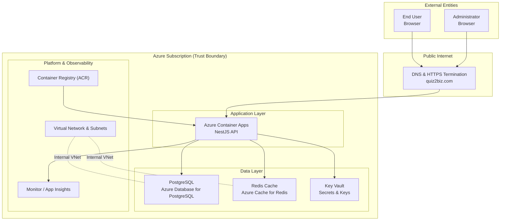
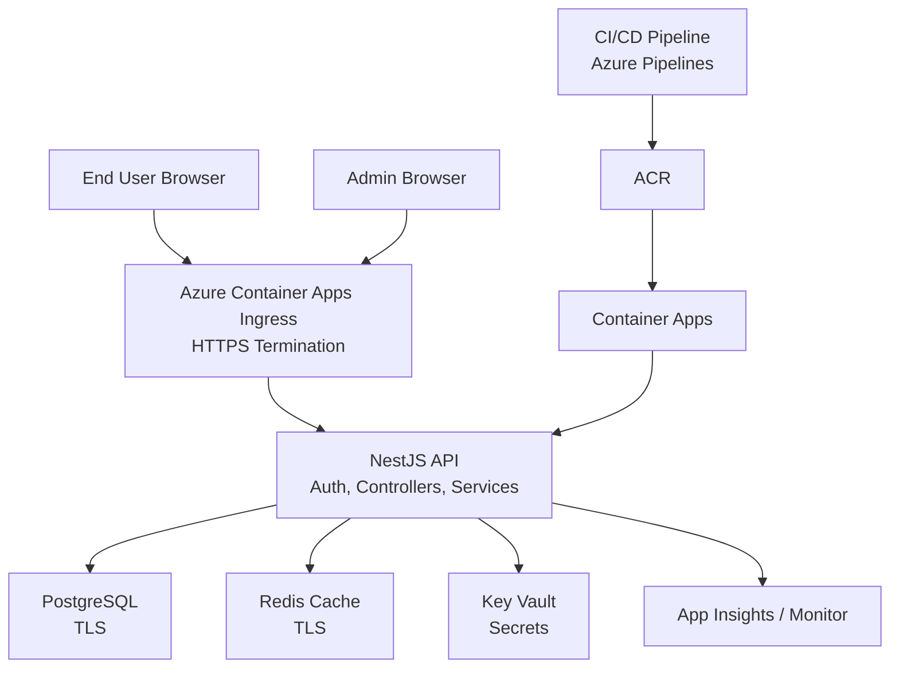
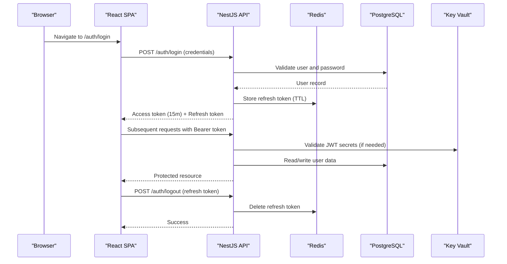
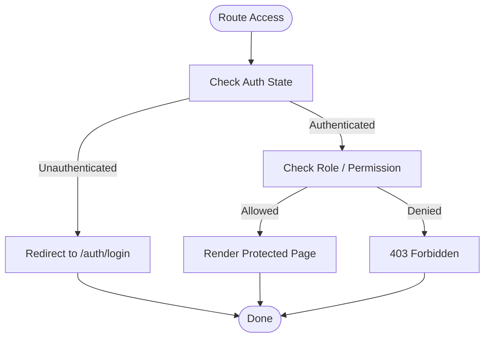
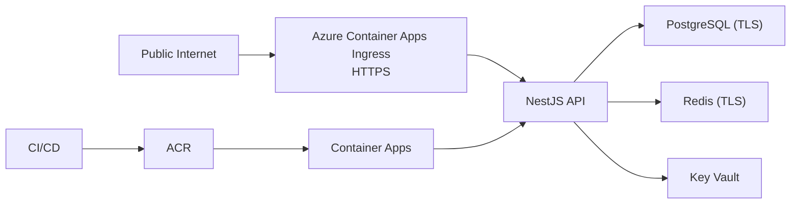
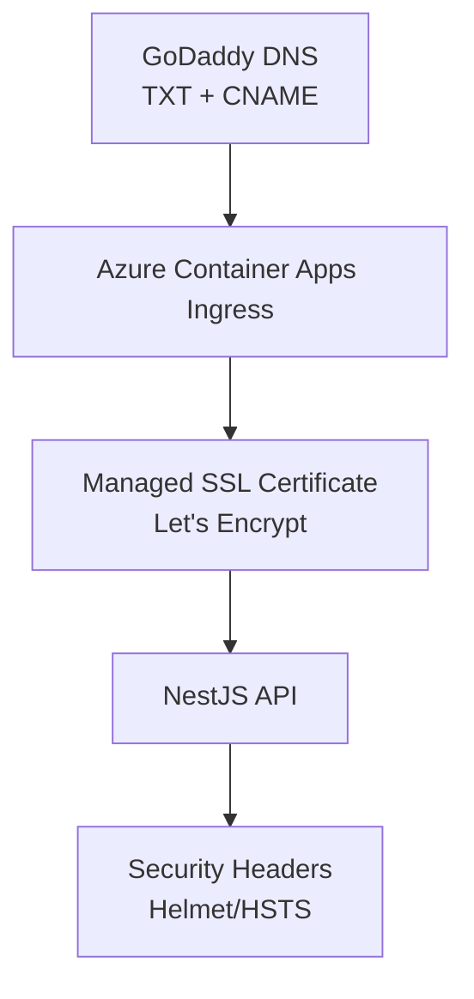
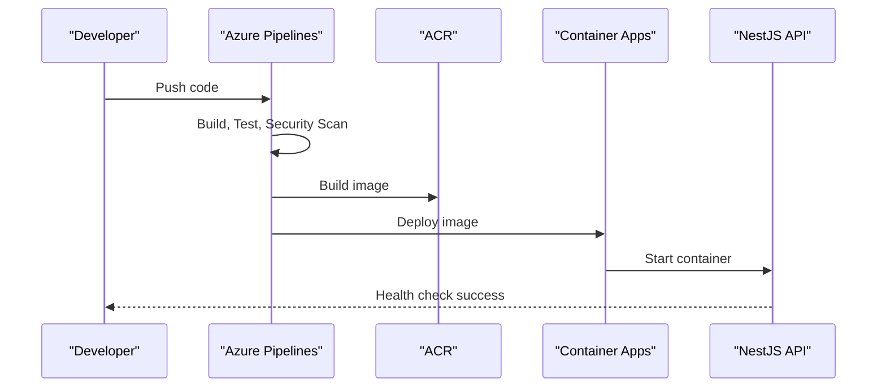
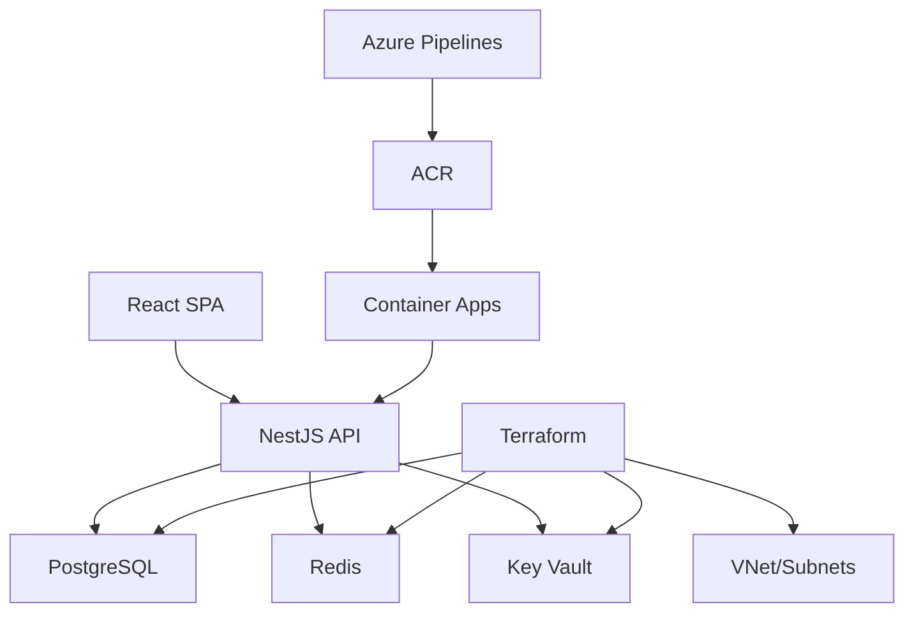

# System Context & Trust Boundaries

<cite>
**Referenced Files in This Document**
- [README.md](file://README.md)
- [apps/api/src/main.ts](file://apps/api/src/main.ts)
- [apps/api/src/modules/auth/auth.module.ts](file://apps/api/src/modules/auth/auth.module.ts)
- [apps/api/src/modules/auth/auth.controller.ts](file://apps/api/src/modules/auth/auth.controller.ts)
- [apps/api/src/modules/auth/auth.service.ts](file://apps/api/src/modules/auth/auth.service.ts)
- [apps/api/src/config/configuration.ts](file://apps/api/src/config/configuration.ts)
- [apps/web/src/App.tsx](file://apps/web/src/App.tsx)
- [infrastructure/terraform/main.tf](file://infrastructure/terraform/main.tf)
- [docs/architecture/c4-01-system-context.mmd](file://docs/architecture/c4-01-system-context.mmd)
- [docs/security/threat-model.md](file://docs/security/threat-model.md)
- [docs/CUSTOM-DOMAIN-SETUP.md](file://docs/CUSTOM-DOMAIN-SETUP.md)
- [docs/HTTPS-FLOW-DIAGRAM.md](file://docs/HTTPS-FLOW-DIAGRAM.md)
- [azure-pipelines.yml](file://azure-pipelines.yml)
- [scripts/deploy-to-azure.ps1](file://scripts/deploy-to-azure.ps1)
- [docker/api/Dockerfile](file://docker/api/Dockerfile)
- [docker/web/Dockerfile](file://docker/web/Dockerfile)
</cite>

## Table of Contents
1. [Introduction](#introduction)
2. [Project Structure](#project-structure)
3. [Core Components](#core-components)
4. [Architecture Overview](#architecture-overview)
5. [Detailed Component Analysis](#detailed-component-analysis)
6. [Dependency Analysis](#dependency-analysis)
7. [Performance Considerations](#performance-considerations)
8. [Troubleshooting Guide](#troubleshooting-guide)
9. [Conclusion](#conclusion)

## Introduction
This document provides a C4-level system context for Quiz-to-Build (Quiz2Biz), focusing on the top-level system boundary, external entities, internal components, trust zones, and operational flows. It explains how public users and administrators interact with the system, how the API gateway and application services operate, and how Azure infrastructure enforces trust boundaries. It also documents authentication flows, authorization patterns, access control mechanisms, network topology, DNS configuration, and HTTPS termination points.

## Project Structure
Quiz2Biz is a cloud-native platform with a frontend SPA, a backend API, and supporting infrastructure. The system is deployed to Azure Container Apps with integrated PostgreSQL, Redis, and Azure Key Vault for secrets. CI/CD is orchestrated via Azure Pipelines and PowerShell scripts.

**Diagram sources**
- [docs/architecture/c4-01-system-context.mmd:1-54](file://docs/architecture/c4-01-system-context.mmd#L1-L54)
- [infrastructure/terraform/main.tf:1-153](file://infrastructure/terraform/main.tf#L1-L153)
- [apps/api/src/main.ts:1-329](file://apps/api/src/main.ts#L1-L329)

**Section sources**
- [README.md:190-215](file://README.md#L190-L215)
- [docs/architecture/c4-01-system-context.mmd:1-54](file://docs/architecture/c4-01-system-context.mmd#L1-L54)
- [infrastructure/terraform/main.tf:1-153](file://infrastructure/terraform/main.tf#L1-L153)

## Core Components
- End Users: Interact with the React SPA to complete questionnaires, view scores, and generate documents.
- Administrators: Manage questionnaires, sessions, and review documents within the application.
- API Gateway and Ingress: Azure Container Apps ingress terminates HTTPS and routes traffic to the API.
- API Service: NestJS application handling authentication, authorization, business logic, and integrations.
- Data Stores: PostgreSQL for relational data, Redis for caching and session tokens.
- Secrets Management: Azure Key Vault for database URLs, JWT secrets, and other sensitive values.
- CI/CD: Azure Pipelines orchestration and PowerShell deployment scripts.
- DNS and TLS: Custom domain managed in GoDaddy with Azure-managed SSL certificates.

**Section sources**
- [apps/web/src/App.tsx:1-284](file://apps/web/src/App.tsx#L1-L284)
- [apps/api/src/main.ts:1-329](file://apps/api/src/main.ts#L1-L329)
- [infrastructure/terraform/main.tf:1-153](file://infrastructure/terraform/main.tf#L1-L153)
- [docs/CUSTOM-DOMAIN-SETUP.md:1-375](file://docs/CUSTOM-DOMAIN-SETUP.md#L1-L375)

## Architecture Overview
The system enforces trust boundaries between the public internet and the Azure subscription. HTTPS is terminated at the ingress (Azure Container Apps), which then forwards encrypted traffic to the API. The API communicates securely with PostgreSQL (TLS), Redis (TLS), and retrieves secrets from Key Vault. CI/CD builds container images and deploys them to Azure Container Apps.

**Diagram sources**
- [docs/CUSTOM-DOMAIN-SETUP.md:1-375](file://docs/CUSTOM-DOMAIN-SETUP.md#L1-L375)
- [infrastructure/terraform/main.tf:1-153](file://infrastructure/terraform/main.tf#L1-L153)
- [apps/api/src/main.ts:1-329](file://apps/api/src/main.ts#L1-L329)

**Section sources**
- [docs/security/threat-model.md:16-50](file://docs/security/threat-model.md#L16-L50)
- [docs/CUSTOM-DOMAIN-SETUP.md:1-375](file://docs/CUSTOM-DOMAIN-SETUP.md#L1-L375)

## Detailed Component Analysis

### Authentication and Authorization Flow
The system uses JWT-based authentication with refresh tokens and supports OAuth providers. The NestJS API enforces CSRF protection for state-changing requests and applies rate limiting. The frontend routes protect access to authenticated pages.

**Diagram sources**
- [apps/api/src/modules/auth/auth.controller.ts:1-171](file://apps/api/src/modules/auth/auth.controller.ts#L1-L171)
- [apps/api/src/modules/auth/auth.service.ts:1-507](file://apps/api/src/modules/auth/auth.service.ts#L1-L507)
- [apps/api/src/modules/auth/auth.module.ts:1-53](file://apps/api/src/modules/auth/auth.module.ts#L1-L53)
- [apps/api/src/config/configuration.ts:1-115](file://apps/api/src/config/configuration.ts#L1-L115)
- [apps/api/src/main.ts:1-329](file://apps/api/src/main.ts#L1-L329)

**Section sources**
- [apps/api/src/modules/auth/auth.controller.ts:38-171](file://apps/api/src/modules/auth/auth.controller.ts#L38-L171)
- [apps/api/src/modules/auth/auth.service.ts:104-183](file://apps/api/src/modules/auth/auth.service.ts#L104-L183)
- [apps/api/src/modules/auth/auth.module.ts:17-53](file://apps/api/src/modules/auth/auth.module.ts#L17-L53)
- [apps/api/src/config/configuration.ts:5-43](file://apps/api/src/config/configuration.ts#L5-L43)
- [apps/api/src/main.ts:104-123](file://apps/api/src/main.ts#L104-L123)

### Authorization and Access Control
- Role-based access control (RBAC) is enforced via guards and decorators.
- Protected routes in the SPA require authentication; public routes redirect authenticated users away from login.
- CSRF protection is enforced for state-changing requests; a dedicated endpoint returns a CSRF token cookie.

**Diagram sources**
- [apps/web/src/App.tsx:149-187](file://apps/web/src/App.tsx#L149-L187)
- [apps/api/src/modules/auth/auth.controller.ts:83-91](file://apps/api/src/modules/auth/auth.controller.ts#L83-L91)

**Section sources**
- [apps/web/src/App.tsx:149-187](file://apps/web/src/App.tsx#L149-L187)
- [apps/api/src/modules/auth/auth.controller.ts:83-91](file://apps/api/src/modules/auth/auth.controller.ts#L83-L91)

### Data Flows and Trust Boundaries
- Public Internet to Application: HTTPS termination at Azure Container Apps ingress; TLS protects traffic to the API.
- Application to Data: API connects to PostgreSQL and Redis over TLS; secrets are retrieved from Key Vault.
- CI/CD to Runtime: Images built in ACR and deployed to Container Apps; environment variables are injected via Key Vault references.

**Diagram sources**
- [docs/CUSTOM-DOMAIN-SETUP.md:1-375](file://docs/CUSTOM-DOMAIN-SETUP.md#L1-L375)
- [infrastructure/terraform/main.tf:1-153](file://infrastructure/terraform/main.tf#L1-L153)
- [apps/api/src/main.ts:1-329](file://apps/api/src/main.ts#L1-L329)

**Section sources**
- [docs/security/threat-model.md:42-50](file://docs/security/threat-model.md#L42-L50)
- [docs/CUSTOM-DOMAIN-SETUP.md:1-375](file://docs/CUSTOM-DOMAIN-SETUP.md#L1-L375)

### Network Topology, DNS, and HTTPS Termination
- DNS: Custom domain quiz2biz.com configured in GoDaddy; Azure Container Apps hostname binding and managed certificate provisioning.
- HTTPS: Azure-managed SSL certificates (Let’s Encrypt) with automatic renewal; HSTS and security headers applied by the API.
- Ingress: Azure Container Apps ingress handles HTTPS termination and forwards to the API.

**Diagram sources**
- [docs/CUSTOM-DOMAIN-SETUP.md:1-375](file://docs/CUSTOM-DOMAIN-SETUP.md#L1-L375)
- [docs/HTTPS-FLOW-DIAGRAM.md:1-292](file://docs/HTTPS-FLOW-DIAGRAM.md#L1-L292)
- [apps/api/src/main.ts:104-123](file://apps/api/src/main.ts#L104-L123)

**Section sources**
- [docs/CUSTOM-DOMAIN-SETUP.md:1-375](file://docs/CUSTOM-DOMAIN-SETUP.md#L1-L375)
- [docs/HTTPS-FLOW-DIAGRAM.md:1-292](file://docs/HTTPS-FLOW-DIAGRAM.md#L1-L292)

### CI/CD and Deployment
- CI/CD pipeline builds, tests, secures, and deploys the application.
- PowerShell script automates infrastructure provisioning and deployment to Azure.
- Container images are built in ACR and deployed to Container Apps.

**Diagram sources**
- [azure-pipelines.yml:1-908](file://azure-pipelines.yml#L1-L908)
- [scripts/deploy-to-azure.ps1:1-349](file://scripts/deploy-to-azure.ps1#L1-L349)
- [docker/api/Dockerfile:1-120](file://docker/api/Dockerfile#L1-L120)
- [docker/web/Dockerfile:1-85](file://docker/web/Dockerfile#L1-L85)

**Section sources**
- [azure-pipelines.yml:1-908](file://azure-pipelines.yml#L1-L908)
- [scripts/deploy-to-azure.ps1:1-349](file://scripts/deploy-to-azure.ps1#L1-L349)

## Dependency Analysis
The system exhibits layered dependencies: frontend SPA depends on the API; the API depends on data stores and secrets; infrastructure is provisioned via Terraform and managed by CI/CD.

**Diagram sources**
- [apps/web/src/App.tsx:1-284](file://apps/web/src/App.tsx#L1-L284)
- [apps/api/src/main.ts:1-329](file://apps/api/src/main.ts#L1-L329)
- [infrastructure/terraform/main.tf:1-153](file://infrastructure/terraform/main.tf#L1-L153)
- [azure-pipelines.yml:1-908](file://azure-pipelines.yml#L1-L908)

**Section sources**
- [infrastructure/terraform/main.tf:1-153](file://infrastructure/terraform/main.tf#L1-L153)
- [apps/api/src/main.ts:1-329](file://apps/api/src/main.ts#L1-L329)

## Performance Considerations
- Compression: Gzip/Brotli enabled for API responses, excluding streaming endpoints.
- Security headers: Helmet and HSTS reduce latency overhead while improving security posture.
- CORS: Strict origin allowlist prevents cross-origin misuse.
- Observability: Application Insights and Azure Monitor provide telemetry for performance tuning.

[No sources needed since this section provides general guidance]

## Troubleshooting Guide
Common issues and resolutions:
- HTTPS not working: Verify DNS propagation, certificate provisioning, and CORS origin configuration.
- SSL certificate errors: Confirm managed certificate status and binding type.
- CORS failures: Ensure CORS_ORIGIN includes HTTPS origins.
- Application logs: Use Azure Container Apps logs to diagnose startup and runtime issues.
- Domain verification: Validate TXT and CNAME records in GoDaddy DNS.

**Section sources**
- [docs/CUSTOM-DOMAIN-SETUP.md:208-375](file://docs/CUSTOM-DOMAIN-SETUP.md#L208-L375)
- [docs/HTTPS-FLOW-DIAGRAM.md:175-206](file://docs/HTTPS-FLOW-DIAGRAM.md#L175-L206)
- [apps/api/src/main.ts:180-192](file://apps/api/src/main.ts#L180-L192)

## Conclusion
Quiz2Biz enforces clear trust boundaries between the public internet and the Azure subscription. HTTPS is terminated at the ingress, and the API enforces authentication, authorization, and security controls. CI/CD pipelines and infrastructure-as-code ensure repeatable deployments, while observability and security headers maintain a robust runtime environment. The documented flows and configurations provide a reliable foundation for operations and further enhancements.