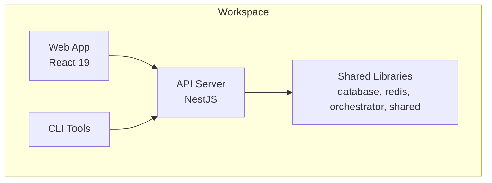
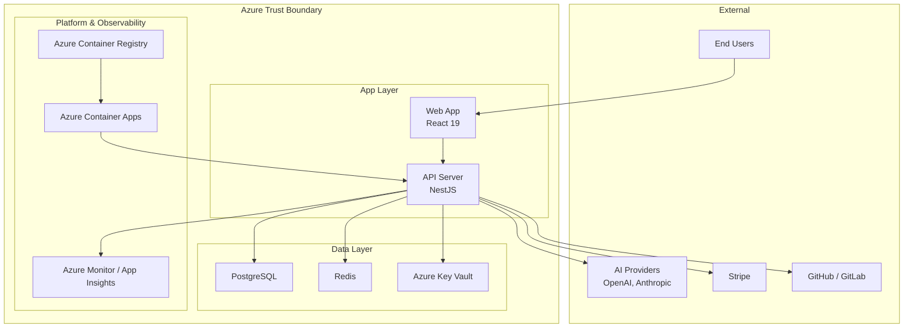
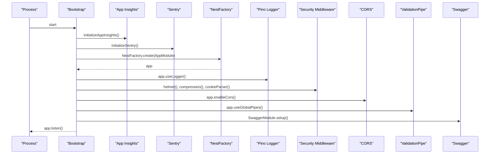
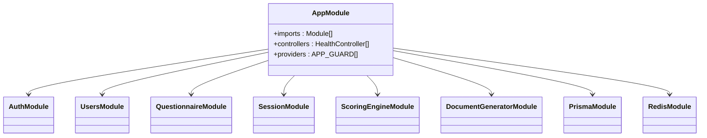
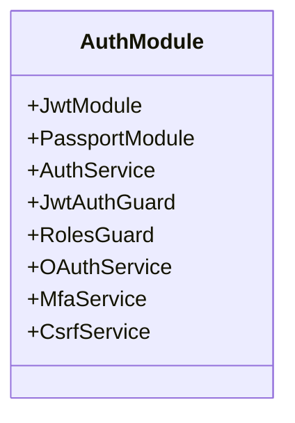
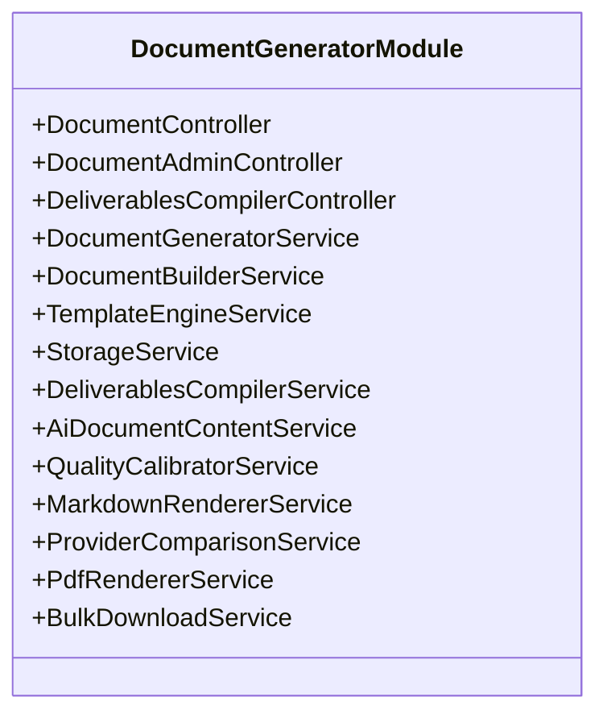
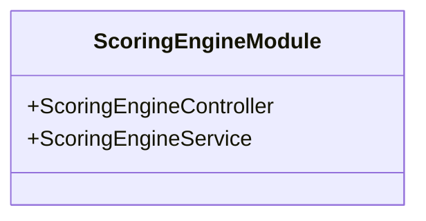
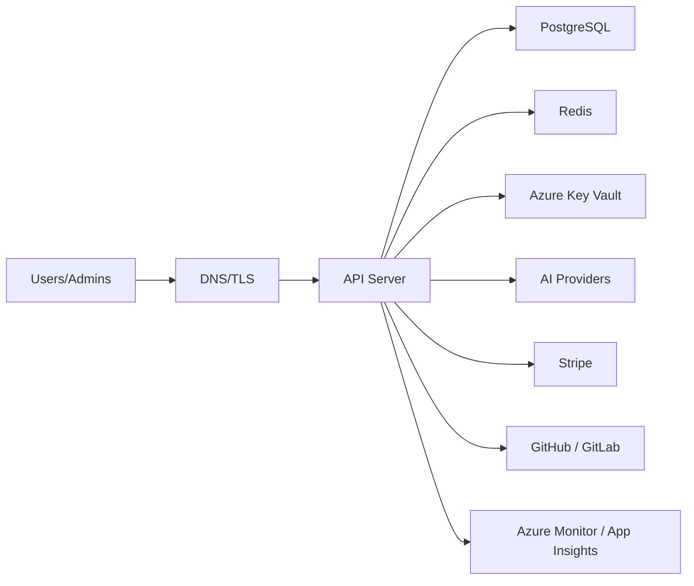
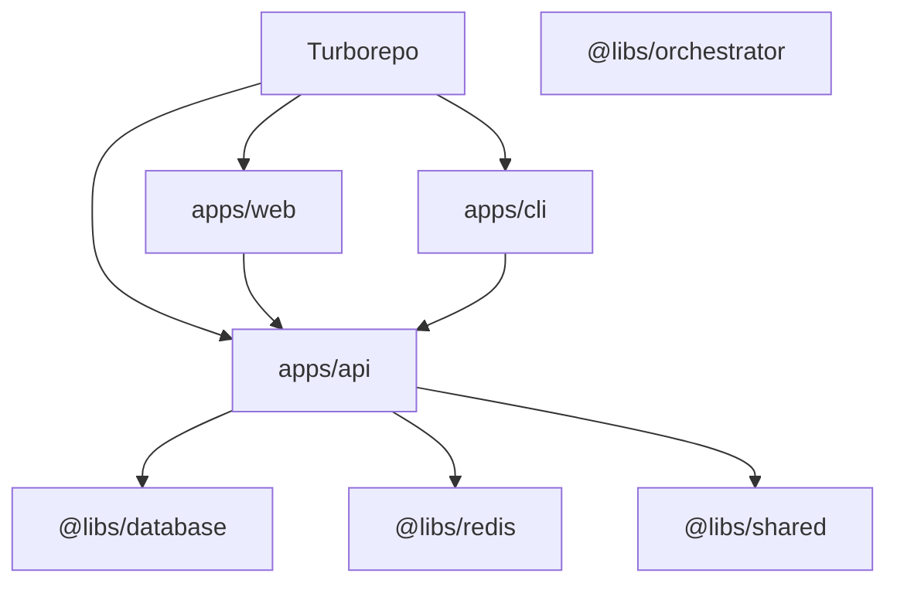

# Architecture Overview

<cite>
**Referenced Files in This Document**
- [main.ts](file://apps/api/src/main.ts)
- [app.module.ts](file://apps/api/src/app.module.ts)
- [package.json](file://package.json)
- [004-monolith-vs-microservices.md](file://docs/adr/004-monolith-vs-microservices.md)
- [005-database-choice.md](file://docs/adr/005-database-choice.md)
- [001-authentication-authorization.md](file://docs/adr/001-authentication-authorization.md)
- [c4-01-system-context.mmd](file://docs/architecture/c4-01-system-context.mmd)
- [docker-compose.yml](file://docker-compose.yml)
- [docker-compose.prod.yml](file://docker-compose.prod.yml)
- [auth.module.ts](file://apps/api/src/modules/auth/auth.module.ts)
- [document-generator.module.ts](file://apps/api/src/modules/document-generator/document-generator.module.ts)
- [scoring-engine.module.ts](file://apps/api/src/modules/scoring-engine/scoring-engine.module.ts)
- [web/package.json](file://apps/web/package.json)
</cite>

## Table of Contents
1. [Introduction](#introduction)
2. [Project Structure](#project-structure)
3. [Core Components](#core-components)
4. [Architecture Overview](#architecture-overview)
5. [Detailed Component Analysis](#detailed-component-analysis)
6. [Dependency Analysis](#dependency-analysis)
7. [Performance Considerations](#performance-considerations)
8. [Troubleshooting Guide](#troubleshooting-guide)
9. [Conclusion](#conclusion)
10. [Appendices](#appendices)

## Introduction
This document describes the architectural design of Quiz-to-Build’s modular monolith. The system is organized as a single deployable API server backed by shared infrastructure, with clear module boundaries enabling future extraction to microservices. The architecture balances development velocity, operational simplicity, and scalability while maintaining strong security, observability, and maintainability.

## Project Structure
The repository follows a monorepo workspace with three primary applications and shared libraries:
- API server (NestJS): Centralized business logic, controllers, guards, interceptors, and 20+ feature modules.
- Web application (React 19): SPA frontend consuming the API.
- CLI tools: Command-line utilities for local workflows and automation.
- Shared libraries: Reusable packages for database, Redis cache, orchestrator, and shared DTOs/types.

**Diagram sources**
- [package.json:11-14](file://package.json#L11-L14)
- [docker-compose.yml:18-136](file://docker-compose.yml#L18-L136)
- [docker-compose.prod.yml:40-82](file://docker-compose.prod.yml#L40-L82)

**Section sources**
- [package.json:11-14](file://package.json#L11-L14)
- [docker-compose.yml:18-136](file://docker-compose.yml#L18-L136)
- [docker-compose.prod.yml:40-82](file://docker-compose.prod.yml#L40-L82)

## Core Components
- API Server (NestJS)
  - Bootstrapped with structured logging, compression, security middleware, rate limiting, and global pipes/filters/interceptors.
  - Central AppModule aggregates 20+ feature modules and shared infrastructure modules.
  - Swagger/OpenAPI documentation is conditionally enabled.
- Web Application (React 19)
  - SPA built with Vite, TypeScript, TailwindCSS, and React Query for data fetching.
  - Consumes the API via environment-configured endpoints.
- CLI Tools
  - Local automation and offline utilities for configuration, scoring, and heatmap generation.
- Shared Libraries
  - database: Prisma client wrapper.
  - redis: Redis cache wrapper.
  - orchestrator: Internal AI multi-agent orchestration helpers.
  - shared: DTOs, interfaces, and common utilities.

Key runtime and deployment characteristics:
- Node.js 22+ requirement.
- Docker Compose for local development and production-like environments.
- Azure Container Apps for containerized deployment.

**Section sources**
- [main.ts:28-329](file://apps/api/src/main.ts#L28-L329)
- [app.module.ts:53-129](file://apps/api/src/app.module.ts#L53-L129)
- [web/package.json:1-75](file://apps/web/package.json#L1-L75)
- [docker-compose.yml:18-136](file://docker-compose.yml#L18-L136)
- [docker-compose.prod.yml:40-82](file://docker-compose.prod.yml#L40-L82)

## Architecture Overview
The system employs a modular monolith with clear module boundaries and shared infrastructure. The API server exposes REST endpoints, integrates with PostgreSQL and Redis, and provides comprehensive observability and security controls. The web application consumes the API, while CLI tools support local workflows.

**Diagram sources**
- [c4-01-system-context.mmd:1-54](file://docs/architecture/c4-01-system-context.mmd#L1-L54)
- [docker-compose.yml:18-136](file://docker-compose.yml#L18-L136)
- [docker-compose.prod.yml:40-82](file://docker-compose.prod.yml#L40-L82)

**Section sources**
- [c4-01-system-context.mmd:1-54](file://docs/architecture/c4-01-system-context.mmd#L1-L54)
- [docker-compose.yml:18-136](file://docker-compose.yml#L18-L136)
- [docker-compose.prod.yml:40-82](file://docker-compose.prod.yml#L40-L82)

## Detailed Component Analysis

### API Server Bootstrap and Cross-Cutting Concerns
- Initialization order: Application Insights instrumentation is initialized before other imports to ensure full telemetry coverage.
- Structured logging: Pino logger configured globally for production-ready JSON logs.
- Security middleware: Helmet CSP, HSTS, Permissions-Policy, and cookie parsing for CSRF.
- Compression: Gzip/Brotli with streaming endpoint exemptions.
- Body limits: JSON/URL-encoded payload size limits.
- CORS: Origin parsing with credential handling.
- Global pipes/filters/interceptors: ValidationPipe, TransformInterceptor, LoggingInterceptor, and HttpExceptionFilter.
- Swagger/OpenAPI: Conditional documentation with bearer auth and tag-based grouping.
- Shutdown hooks: Graceful shutdown with Application Insights flush.

**Diagram sources**
- [main.ts:28-329](file://apps/api/src/main.ts#L28-L329)

**Section sources**
- [main.ts:28-329](file://apps/api/src/main.ts#L28-L329)

### AppModule and Module Composition
- Central AppModule aggregates:
  - Configuration and logging modules.
  - Rate limiting guard.
  - Shared infrastructure: PrismaModule (PostgreSQL), RedisModule.
  - Feature modules: Auth, Users, Questionnaire, Session, Adaptive Logic, Standards, Admin, Document Generator, Scoring Engine, Heatmap, Notifications, Payment, Adapters, Idea Capture, AI Gateway, Chat Engine, Fact Extraction, Quality Scoring, Projects.
  - Legacy modules conditionally loaded via feature flag.
- Global guards include ThrottlerGuard and CsrfGuard.

**Diagram sources**
- [app.module.ts:53-129](file://apps/api/src/app.module.ts#L53-L129)

**Section sources**
- [app.module.ts:53-129](file://apps/api/src/app.module.ts#L53-L129)

### Authentication and Authorization Module
- JWT-based authentication with refresh tokens, role-based access control (RBAC), and attribute-based access control (ABAC).
- Passport strategies, guards, and MFA support.
- Token rotation, blacklist via Redis, and rate limiting on auth endpoints.

**Diagram sources**
- [auth.module.ts:17-51](file://apps/api/src/modules/auth/auth.module.ts#L17-L51)

**Section sources**
- [auth.module.ts:17-51](file://apps/api/src/modules/auth/auth.module.ts#L17-L51)
- [001-authentication-authorization.md:44-77](file://docs/adr/001-authentication-authorization.md#L44-L77)

### Document Generation Module
- End-to-end document generation pipeline: builder, template engine, storage, compiler, AI content, quality calibrator, markdown renderer, PDF renderer, bulk download.
- Integrates with Prisma for persistence and configuration.

**Diagram sources**
- [document-generator.module.ts:19-46](file://apps/api/src/modules/document-generator/document-generator.module.ts#L19-L46)

**Section sources**
- [document-generator.module.ts:19-46](file://apps/api/src/modules/document-generator/document-generator.module.ts#L19-L46)

### Scoring Engine Module
- Risk-weighted readiness scoring with explicit formulas and Redis-backed caching.
- Integrates Prisma for persistence and Redis for caching.

**Diagram sources**
- [scoring-engine.module.ts:16-22](file://apps/api/src/modules/scoring-engine/scoring-engine.module.ts#L16-L22)

**Section sources**
- [scoring-engine.module.ts:16-22](file://apps/api/src/modules/scoring-engine/scoring-engine.module.ts#L16-L22)

### Technology Stack and Integration Patterns
- API Server: NestJS with Express, Swagger, Pino, Helmet, Compression, Sentry, Application Insights.
- Database: PostgreSQL via Prisma with JSONB, full-text search, and migrations.
- Cache: Redis via ioredis for session tokens, rate limiting, and scoring results.
- Frontend: React 19 with Vite, React Query, TailwindCSS.
- Observability: Application Insights, Sentry, Azure Monitor.
- CI/CD: Azure Pipelines or GitHub Actions pushing images to ACR and deploying to ACA.

**Section sources**
- [main.ts:10-26](file://apps/api/src/main.ts#L10-L26)
- [005-database-choice.md:54-84](file://docs/adr/005-database-choice.md#L54-L84)
- [web/package.json:18-36](file://apps/web/package.json#L18-L36)

### System Context and External Integrations
- End users and administrators interact with the system via HTTPS.
- API integrates with:
  - PostgreSQL (Prisma)
  - Redis (cache)
  - Azure Key Vault (secrets)
  - AI providers (OpenAI, Anthropic)
  - Payment provider (Stripe)
  - Source control platforms (GitHub, GitLab)
  - Monitoring (Azure Monitor/App Insights)

**Diagram sources**
- [c4-01-system-context.mmd:1-54](file://docs/architecture/c4-01-system-context.mmd#L1-L54)

**Section sources**
- [c4-01-system-context.mmd:1-54](file://docs/architecture/c4-01-system-context.mmd#L1-L54)

## Dependency Analysis
- Workspace composition: Turborepo orchestrates builds/tests across apps and libs.
- API depends on shared libs (database, redis) and feature modules.
- Web depends on API endpoints; CLI depends on API for remote operations.
- Infrastructure dependencies: Docker Compose for local dev, Azure Container Apps for production.

**Diagram sources**
- [package.json:11-14](file://package.json#L11-L14)

**Section sources**
- [package.json:11-14](file://package.json#L11-L14)

## Performance Considerations
- Database: PostgreSQL with JSONB, full-text search, and GIN indexes; Prisma connection pooling.
- Cache: Redis for short-lived tokens, rate limiting, and scoring results.
- API: Compression (gzip/brotli) with streaming exemptions; rate limiting via throttler; body size limits; CORS and security headers.
- Observability: Structured logs, telemetry, and tracing for performance insights.
- Scalability: Modular monolith with clear boundaries; extraction criteria defined for future microservices.

[No sources needed since this section provides general guidance]

## Troubleshooting Guide
- Bootstrap failures: Captured and reported to Sentry; SIGTERM/SIGINT handlers flush Application Insights telemetry.
- Logging: Pino structured logs; enable/disable Swagger based on environment.
- Security: Review CSP, HSTS, and Permissions-Policy headers; ensure cookie security for CSRF protection.
- Database connectivity: Verify Prisma datasource configuration and connection limits.
- Cache connectivity: Confirm Redis host/port and password configuration.

**Section sources**
- [main.ts:300-329](file://apps/api/src/main.ts#L300-L329)
- [docker-compose.yml:118-125](file://docker-compose.yml#L118-L125)
- [docker-compose.prod.yml:49-57](file://docker-compose.prod.yml#L49-L57)

## Conclusion
Quiz-to-Build adopts a modular monolith to accelerate development, simplify operations, and preserve clear boundaries for future extraction. The architecture integrates NestJS, React 19, Prisma, and Redis with robust security, observability, and containerized deployment. ADRs formalize decisions around monolith vs microservices, database selection, and authentication/authorization.

[No sources needed since this section summarizes without analyzing specific files]

## Appendices

### Architectural Decision Records (ADRs)
- Monolith vs Microservices: Modular monolith chosen for development velocity and operational simplicity with extraction criteria.
- Database Choice: PostgreSQL selected for relational integrity, JSONB flexibility, and Prisma integration.
- Authentication and Authorization: JWT with refresh tokens, RBAC, ABAC, and MFA support.

**Section sources**
- [004-monolith-vs-microservices.md:43-129](file://docs/adr/004-monolith-vs-microservices.md#L43-L129)
- [005-database-choice.md:54-84](file://docs/adr/005-database-choice.md#L54-L84)
- [001-authentication-authorization.md:44-77](file://docs/adr/001-authentication-authorization.md#L44-L77)