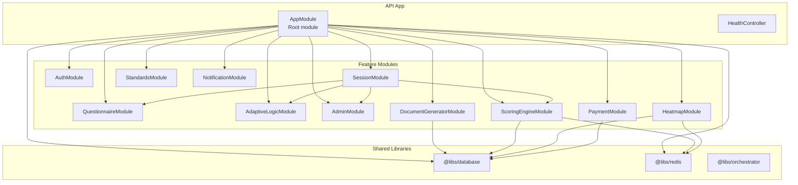
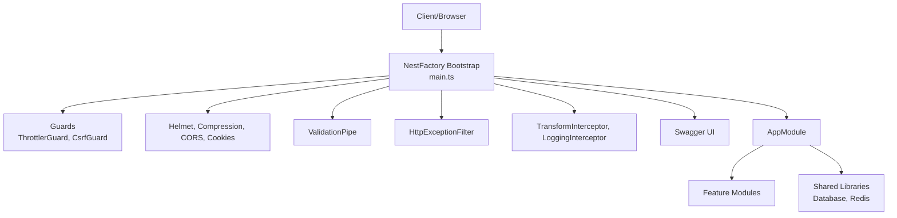
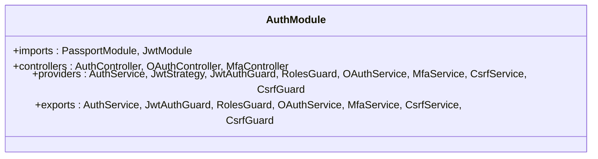
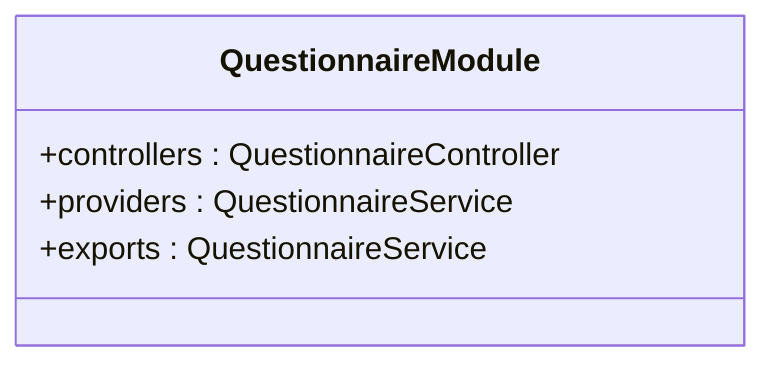
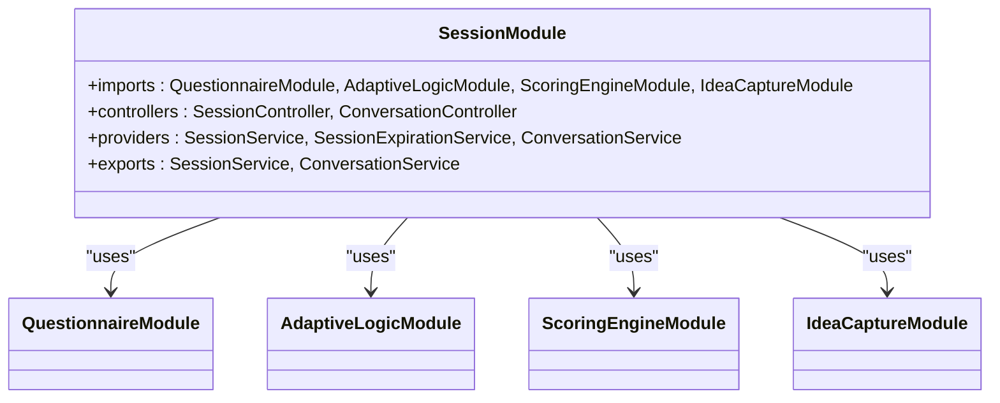
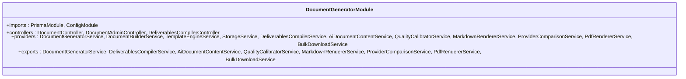
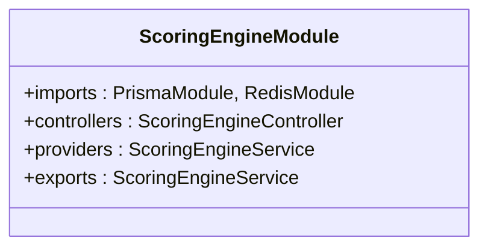
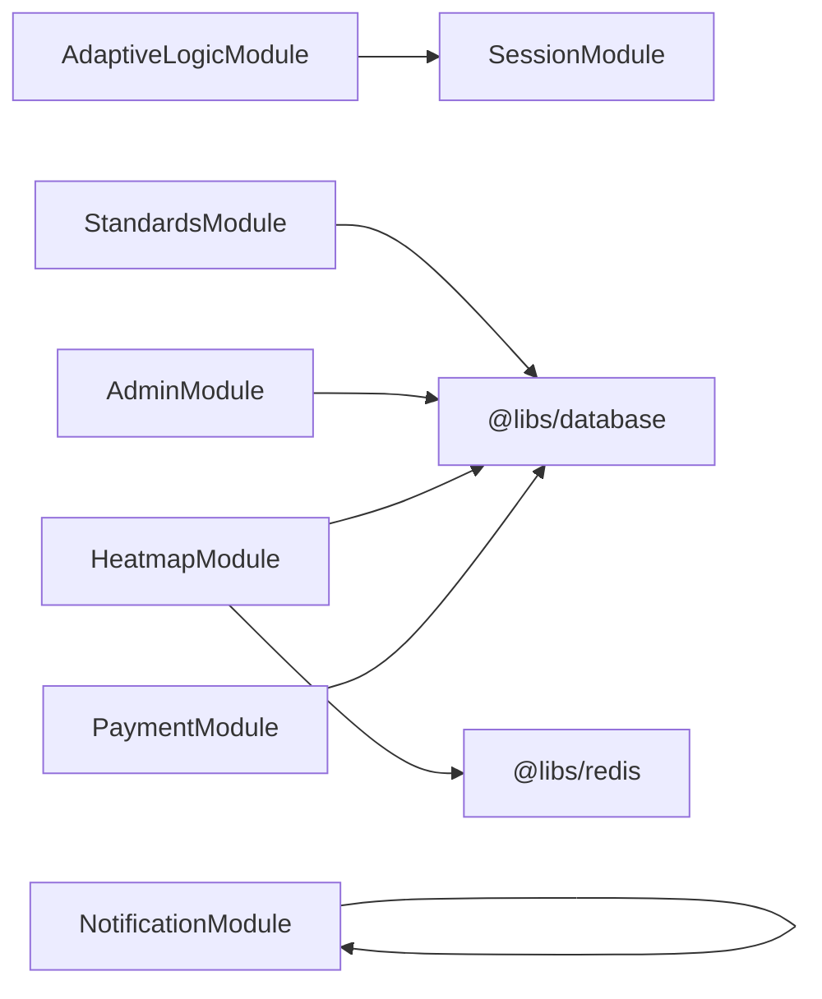
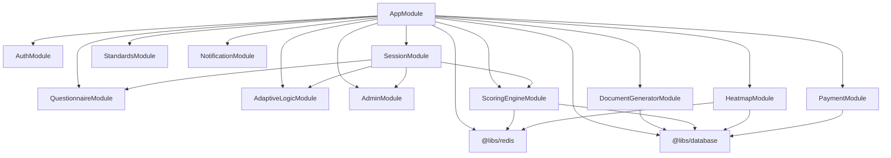

# Component Organization

<cite>
**Referenced Files in This Document**
- [app.module.ts](file://apps/api/src/app.module.ts)
- [main.ts](file://apps/api/src/main.ts)
- [auth.module.ts](file://apps/api/src/modules/auth/auth.module.ts)
- [questionnaire.module.ts](file://apps/api/src/modules/questionnaire/questionnaire.module.ts)
- [session.module.ts](file://apps/api/src/modules/session/session.module.ts)
- [document-generator.module.ts](file://apps/api/src/modules/document-generator/document-generator.module.ts)
- [scoring-engine.module.ts](file://apps/api/src/modules/scoring-engine/scoring-engine.module.ts)
- [adaptive-logic.module.ts](file://apps/api/src/modules/adaptive-logic/adaptive-logic.module.ts)
- [standards.module.ts](file://apps/api/src/modules/standards/standards.module.ts)
- [admin.module.ts](file://apps/api/src/modules/admin/admin.module.ts)
- [heatmap.module.ts](file://apps/api/src/modules/heatmap/heatmap.module.ts)
- [notification.module.ts](file://apps/api/src/modules/notifications/notification.module.ts)
- [payment.module.ts](file://apps/api/src/modules/payment/payment.module.ts)
- [database package.json](file://libs/database/package.json)
- [redis package.json](file://libs/redis/package.json)
- [orchestrator package.json](file://libs/orchestrator/package.json)
</cite>

## Table of Contents
1. [Introduction](#introduction)
2. [Project Structure](#project-structure)
3. [Core Components](#core-components)
4. [Architecture Overview](#architecture-overview)
5. [Detailed Component Analysis](#detailed-component-analysis)
6. [Dependency Analysis](#dependency-analysis)
7. [Performance Considerations](#performance-considerations)
8. [Troubleshooting Guide](#troubleshooting-guide)
9. [Conclusion](#conclusion)
10. [Appendices](#appendices)

## Introduction
This document describes Quiz-to-Build’s component organization and module system. It covers the NestJS module architecture with more than 20 feature modules, including Auth, Questionnaire, Session, DocumentGenerator, ScoringEngine, and others. It explains module dependency graphs, import/export patterns, inter-module communication, and the service layer with dependency injection and lifecycle management. It also documents the shared libraries for database, orchestrator, and Redis clients, and outlines the frontend component architecture, state management, and plugin patterns for AI providers, OAuth integrations, and document templates. Finally, it provides testing strategies, performance optimization techniques, and code organization best practices.

## Project Structure
The backend is a NestJS application under apps/api with a modular design. The root module composes feature modules and registers global guards, interceptors, filters, and middleware. Shared libraries (database, redis, orchestrator) are published locally and consumed by modules.

**Diagram sources**
- [app.module.ts:53-128](file://apps/api/src/app.module.ts#L53-L128)
- [auth.module.ts:17-51](file://apps/api/src/modules/auth/auth.module.ts#L17-L51)
- [questionnaire.module.ts:5-9](file://apps/api/src/modules/questionnaire/questionnaire.module.ts#L5-L9)
- [session.module.ts:12-22](file://apps/api/src/modules/session/session.module.ts#L12-L22)
- [adaptive-logic.module.ts:6-10](file://apps/api/src/modules/adaptive-logic/adaptive-logic.module.ts#L6-L10)
- [standards.module.ts:6-11](file://apps/api/src/modules/standards/standards.module.ts#L6-L11)
- [admin.module.ts:7-12](file://apps/api/src/modules/admin/admin.module.ts#L7-L12)
- [document-generator.module.ts:19-45](file://apps/api/src/modules/document-generator/document-generator.module.ts#L19-L45)
- [scoring-engine.module.ts:16-21](file://apps/api/src/modules/scoring-engine/scoring-engine.module.ts#L16-L21)
- [heatmap.module.ts:20-25](file://apps/api/src/modules/heatmap/heatmap.module.ts#L20-L25)
- [notification.module.ts:8-14](file://apps/api/src/modules/notifications/notification.module.ts#L8-L14)
- [payment.module.ts:18-23](file://apps/api/src/modules/payment/payment.module.ts#L18-L23)
- [database package.json:12-16](file://libs/database/package.json#L12-L16)
- [redis package.json:12-16](file://libs/redis/package.json#L12-L16)
- [orchestrator package.json:10-12](file://libs/orchestrator/package.json#L10-L12)

**Section sources**
- [app.module.ts:53-128](file://apps/api/src/app.module.ts#L53-L128)
- [main.ts:28-317](file://apps/api/src/main.ts#L28-L317)

## Core Components
- Root module: Composes configuration, logging, throttling, database, cache, and all feature modules. Registers global guards (rate limiting, CSRF), interceptors, filters, and middleware. Exposes a health controller.
- Feature modules: Each encapsulates domain boundaries (Auth, Questionnaire, Session, DocumentGenerator, ScoringEngine, Heatmap, Notifications, Payments, Standards, Admin, AdaptiveLogic, and more). They import shared libraries and other feature modules as needed.
- Shared libraries:
  - Database: Prisma client wrapper for data access.
  - Redis: Cache service wrapper for caching and session-related operations.
  - Orchestrator: Internal AI multi-agent orchestration library.

**Section sources**
- [app.module.ts:53-128](file://apps/api/src/app.module.ts#L53-L128)
- [database package.json:12-16](file://libs/database/package.json#L12-L16)
- [redis package.json:12-16](file://libs/redis/package.json#L12-L16)
- [orchestrator package.json:10-12](file://libs/orchestrator/package.json#L10-L12)

## Architecture Overview
The system follows a layered, modular architecture:
- Entry point initializes telemetry, logging, security middleware, global pipes/filters/interceptors, OpenAPI documentation, and starts the server.
- AppModule composes feature modules and shared libraries.
- Feature modules expose controllers and services; services depend on shared libraries and other feature services.
- Inter-module communication occurs via exported providers and DTOs.

**Diagram sources**
- [main.ts:28-317](file://apps/api/src/main.ts#L28-L317)
- [app.module.ts:53-128](file://apps/api/src/app.module.ts#L53-L128)

## Detailed Component Analysis

### Auth Module
- Purpose: Authentication, roles, OAuth, MFA, and CSRF protection.
- Providers: AuthService, JwtAuthGuard, RolesGuard, OAuthService, MfaService, CsrfService/Guard.
- Dependencies: Passport/JWT configured via ConfigModule; exports guards/services for other modules.

**Diagram sources**
- [auth.module.ts:17-51](file://apps/api/src/modules/auth/auth.module.ts#L17-L51)

**Section sources**
- [auth.module.ts:17-51](file://apps/api/src/modules/auth/auth.module.ts#L17-L51)

### Questionnaire Module
- Purpose: Questionnaire templates and management.
- Providers: QuestionnaireService.
- Exports: QuestionnaireService for use by Session and other modules.

**Diagram sources**
- [questionnaire.module.ts:5-9](file://apps/api/src/modules/questionnaire/questionnaire.module.ts#L5-L9)

**Section sources**
- [questionnaire.module.ts:5-9](file://apps/api/src/modules/questionnaire/questionnaire.module.ts#L5-L9)

### Session Module
- Purpose: Assessment sessions, conversation, expiration handling.
- Imports: QuestionnaireModule, forward-ref AdaptiveLogicModule, ScoringEngineModule, IdeaCaptureModule.
- Providers: SessionService, SessionExpirationService, ConversationService.
- Exports: SessionService, ConversationService.

**Diagram sources**
- [session.module.ts:12-22](file://apps/api/src/modules/session/session.module.ts#L12-L22)
- [questionnaire.module.ts:5-9](file://apps/api/src/modules/questionnaire/questionnaire.module.ts#L5-L9)
- [adaptive-logic.module.ts:6-10](file://apps/api/src/modules/adaptive-logic/adaptive-logic.module.ts#L6-L10)
- [scoring-engine.module.ts:16-21](file://apps/api/src/modules/scoring-engine/scoring-engine.module.ts#L16-L21)

**Section sources**
- [session.module.ts:12-22](file://apps/api/src/modules/session/session.module.ts#L12-L22)

### Document Generator Module
- Purpose: Document generation, templates, storage, PDF rendering, bulk downloads, AI content, quality calibration.
- Providers: DocumentGeneratorService, DocumentBuilderService, TemplateEngineService, StorageService, DeliverablesCompilerService, AiDocumentContentService, QualityCalibratorService, MarkdownRendererService, ProviderComparisonService, PdfRendererService, BulkDownloadService.
- Dependencies: PrismaModule, ConfigModule.

**Diagram sources**
- [document-generator.module.ts:19-45](file://apps/api/src/modules/document-generator/document-generator.module.ts#L19-L45)

**Section sources**
- [document-generator.module.ts:19-45](file://apps/api/src/modules/document-generator/document-generator.module.ts#L19-L45)

### Scoring Engine Module
- Purpose: Risk-weighted readiness scoring with Redis caching and Prisma persistence.
- Providers: ScoringEngineService.
- Dependencies: PrismaModule, RedisModule.

**Diagram sources**
- [scoring-engine.module.ts:16-21](file://apps/api/src/modules/scoring-engine/scoring-engine.module.ts#L16-L21)

**Section sources**
- [scoring-engine.module.ts:16-21](file://apps/api/src/modules/scoring-engine/scoring-engine.module.ts#L16-L21)

### Additional Feature Modules
- AdaptiveLogicModule: Depends on SessionModule via forwardRef; exports AdaptiveLogicService.
- StandardsModule: CRUD for standards using PrismaModule.
- AdminModule: Admin questionnaire and audit services.
- HeatmapModule: Gap heatmaps with Redis caching.
- NotificationModule: Global module for notifications and job services.
- PaymentModule: Stripe integration for payments and subscriptions.

**Diagram sources**
- [adaptive-logic.module.ts:6-10](file://apps/api/src/modules/adaptive-logic/adaptive-logic.module.ts#L6-L10)
- [session.module.ts:12-22](file://apps/api/src/modules/session/session.module.ts#L12-L22)
- [standards.module.ts:6-11](file://apps/api/src/modules/standards/standards.module.ts#L6-L11)
- [admin.module.ts:7-12](file://apps/api/src/modules/admin/admin.module.ts#L7-L12)
- [heatmap.module.ts:20-25](file://apps/api/src/modules/heatmap/heatmap.module.ts#L20-L25)
- [notification.module.ts:8-14](file://apps/api/src/modules/notifications/notification.module.ts#L8-L14)
- [payment.module.ts:18-23](file://apps/api/src/modules/payment/payment.module.ts#L18-L23)

**Section sources**
- [adaptive-logic.module.ts:6-10](file://apps/api/src/modules/adaptive-logic/adaptive-logic.module.ts#L6-L10)
- [standards.module.ts:6-11](file://apps/api/src/modules/standards/standards.module.ts#L6-L11)
- [admin.module.ts:7-12](file://apps/api/src/modules/admin/admin.module.ts#L7-L12)
- [heatmap.module.ts:20-25](file://apps/api/src/modules/heatmap/heatmap.module.ts#L20-L25)
- [notification.module.ts:8-14](file://apps/api/src/modules/notifications/notification.module.ts#L8-L14)
- [payment.module.ts:18-23](file://apps/api/src/modules/payment/payment.module.ts#L18-L23)

## Dependency Analysis
- Root module dependency graph: AppModule imports configuration, logging, throttling, database, cache, and all feature modules. It conditionally loads legacy modules via an environment flag.
- Feature module dependencies:
  - SessionModule depends on QuestionnaireModule, AdaptiveLogicModule (forwardRef), ScoringEngineModule, and IdeaCaptureModule.
  - ScoringEngineModule and HeatmapModule depend on RedisModule.
  - Multiple modules depend on PrismaModule for persistence.
- Shared library dependencies:
  - Database and Redis are declared as dependencies in their respective package.json files.
  - Orchestrator is a local library with internal dependencies.

**Diagram sources**
- [app.module.ts:53-128](file://apps/api/src/app.module.ts#L53-L128)
- [session.module.ts:12-22](file://apps/api/src/modules/session/session.module.ts#L12-L22)
- [scoring-engine.module.ts:16-21](file://apps/api/src/modules/scoring-engine/scoring-engine.module.ts#L16-L21)
- [heatmap.module.ts:20-25](file://apps/api/src/modules/heatmap/heatmap.module.ts#L20-L25)
- [document-generator.module.ts:19-45](file://apps/api/src/modules/document-generator/document-generator.module.ts#L19-L45)
- [payment.module.ts:18-23](file://apps/api/src/modules/payment/payment.module.ts#L18-L23)

**Section sources**
- [app.module.ts:53-128](file://apps/api/src/app.module.ts#L53-L128)
- [session.module.ts:12-22](file://apps/api/src/modules/session/session.module.ts#L12-L22)
- [scoring-engine.module.ts:16-21](file://apps/api/src/modules/scoring-engine/scoring-engine.module.ts#L16-L21)
- [heatmap.module.ts:20-25](file://apps/api/src/modules/heatmap/heatmap.module.ts#L20-L25)
- [document-generator.module.ts:19-45](file://apps/api/src/modules/document-generator/document-generator.module.ts#L19-L45)
- [payment.module.ts:18-23](file://apps/api/src/modules/payment/payment.module.ts#L18-L23)

## Performance Considerations
- Compression: HTTP compression is enabled with a filter that excludes Server-Sent Events and streaming AI gateway endpoints.
- Security middleware: Helmet hardens headers; permissions policy restricts browser features.
- Request sizing: JSON/URL-encoded body limits mitigate payload attacks.
- Caching: RedisModule is used by ScoringEngineModule and HeatmapModule to reduce database load.
- Logging: Pino structured logging is configured globally for efficient log aggregation.
- Telemetry: Application Insights and Sentry initialization occur early; graceful shutdown flushes telemetry.

**Section sources**
- [main.ts:43-67](file://apps/api/src/main.ts#L43-L67)
- [main.ts:68-123](file://apps/api/src/main.ts#L68-L123)
- [main.ts:125-168](file://apps/api/src/main.ts#L125-L168)
- [main.ts:176-178](file://apps/api/src/main.ts#L176-L178)
- [main.ts:180-191](file://apps/api/src/main.ts#L180-L191)
- [main.ts:300-317](file://apps/api/src/main.ts#L300-L317)

## Troubleshooting Guide
- Global guards and middleware: ThrottlerGuard and CsrfGuard are registered at the application level. Review rate-limiting and CSRF configurations if clients encounter 429 or CSRF failures.
- Exception handling: A global HttpExceptionFilter standardizes error responses.
- Interceptors: TransformInterceptor and LoggingInterceptor provide consistent response shaping and request logging.
- Telemetry: Application Insights and Sentry are initialized early; bootstrap errors are captured and logged.

**Section sources**
- [app.module.ts:118-127](file://apps/api/src/app.module.ts#L118-L127)
- [main.ts:208-212](file://apps/api/src/main.ts#L208-L212)
- [main.ts:319-328](file://apps/api/src/main.ts#L319-L328)

## Conclusion
Quiz-to-Build employs a robust, modular NestJS architecture with over 20 feature modules, centralized configuration, and shared libraries for database and caching. The root AppModule composes modules, registers cross-cutting concerns, and exposes a health endpoint. Feature modules encapsulate domain logic and collaborate via exported providers. The design supports scalability, maintainability, and clear separation of concerns, while leveraging Redis and Prisma for performance and persistence.

## Appendices

### Frontend Component Architecture (Overview)
- Reusable UI components: Presentational components designed for reuse across pages.
- Layout components: Page scaffolding and navigation shells.
- Feature-specific components: Domain-focused components for questionnaires, sessions, documents, and dashboards.
- Prop drilling prevention: Context providers, centralized stores, and dependency injection-like patterns are used to pass data down the tree efficiently.
- State management: Centralized stores for authentication, questionnaire answers, decisions, and evidence; combined with React hooks for derived state and effects.

[No sources needed since this section provides a conceptual overview]

### Plugin Architecture (Overview)
- AI providers: Pluggable adapters for document generation and content services, allowing multiple providers with consistent interfaces.
- OAuth integrations: Extensible OAuth strategies and controllers for identity providers.
- Document templates: Template engine services supporting multiple formats and provider comparisons.

[No sources needed since this section provides a conceptual overview]

### Testing Strategies (Overview)
- Unit tests: Module-level and service-level tests with isolated providers and mocks.
- Integration tests: Cross-module flows (e.g., questionnaire scoring session) validated end-to-end.
- E2E tests: Full user journeys for authentication, document generation, and payments.
- Performance tests: Load and memory tests to validate throughput and resource usage.

[No sources needed since this section provides general guidance]