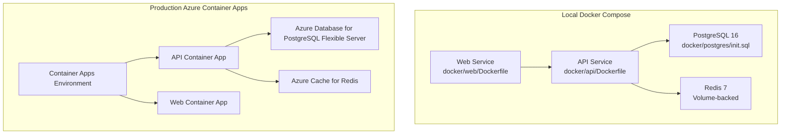
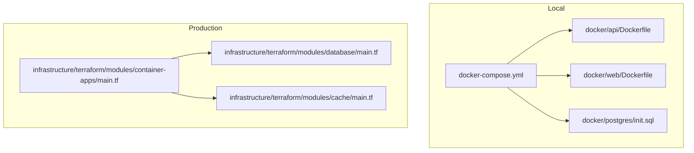
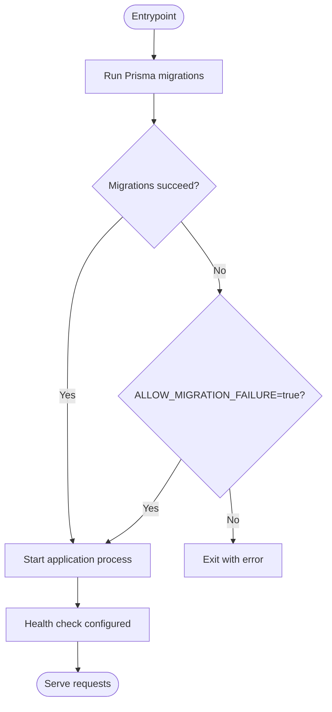
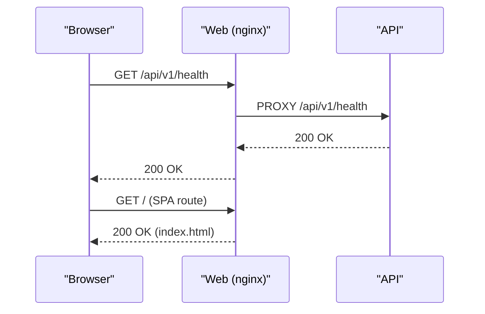
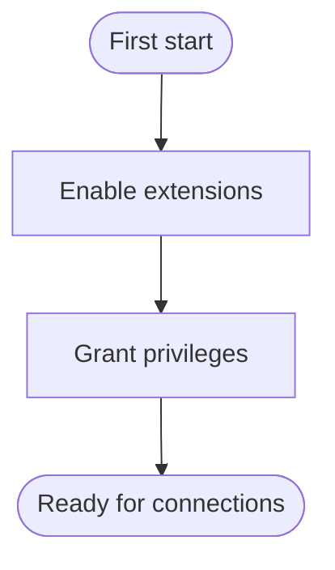
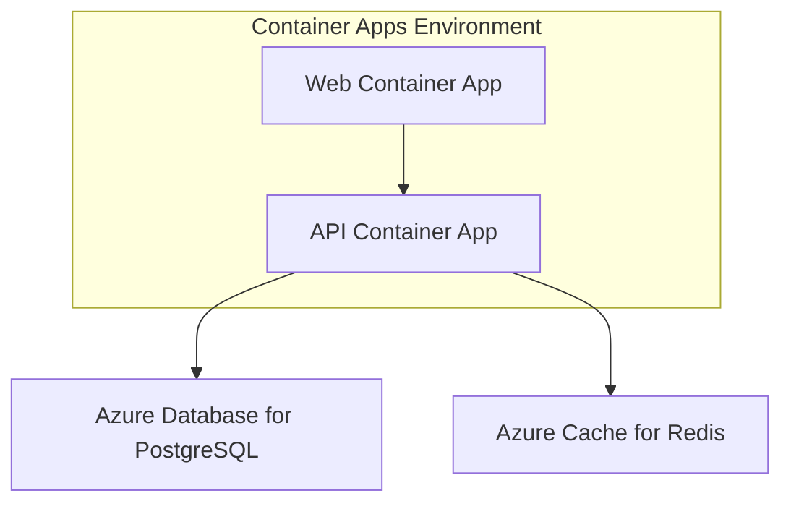
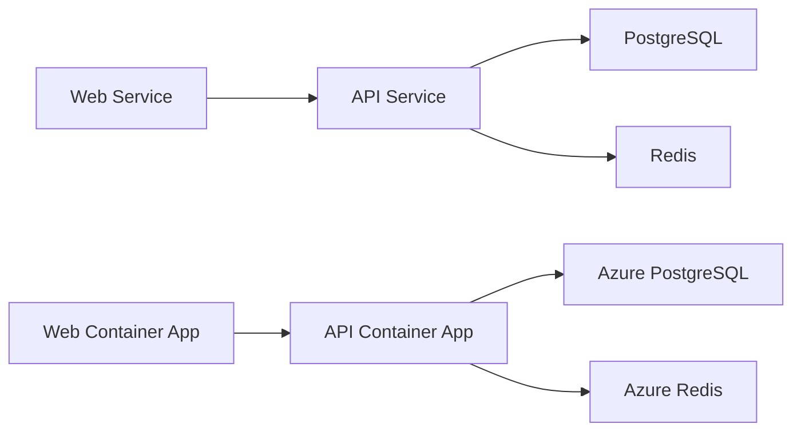

# Container Architecture

<cite>
**Referenced Files in This Document**
- [docker-compose.yml](file://docker-compose.yml)
- [docker-compose.prod.yml](file://docker-compose.prod.yml)
- [.dockerignore](file://.dockerignore)
- [docker/api/Dockerfile](file://docker/api/Dockerfile)
- [docker/api/entrypoint.sh](file://docker/api/entrypoint.sh)
- [docker/web/Dockerfile](file://docker/web/Dockerfile)
- [docker/web/nginx.conf](file://docker/web/nginx.conf)
- [docker/postgres/init.sql](file://docker/postgres/init.sql)
- [infrastructure/terraform/modules/container-apps/main.tf](file://infrastructure/terraform/modules/container-apps/main.tf)
- [infrastructure/terraform/modules/database/main.tf](file://infrastructure/terraform/modules/database/main.tf)
- [infrastructure/terraform/modules/cache/main.tf](file://infrastructure/terraform/modules/cache/main.tf)
- [scripts/deploy-local.sh](file://scripts/deploy-local.sh)
- [scripts/dev-start.sh](file://scripts/dev-start.sh)
</cite>

## Table of Contents
1. [Introduction](#introduction)
2. [Project Structure](#project-structure)
3. [Core Components](#core-components)
4. [Architecture Overview](#architecture-overview)
5. [Detailed Component Analysis](#detailed-component-analysis)
6. [Dependency Analysis](#dependency-analysis)
7. [Performance Considerations](#performance-considerations)
8. [Troubleshooting Guide](#troubleshooting-guide)
9. [Conclusion](#conclusion)
10. [Appendices](#appendices)

## Introduction
This document describes the container architecture for Quiz-to-Build, covering the local Docker Compose setup, production-grade Azure Container Apps deployment, and supporting infrastructure. It explains the containerized topology, Docker configurations, orchestration strategy, environment setup, security considerations, and operational practices for monitoring and troubleshooting.

## Project Structure
The container architecture spans three primary areas:
- Local development and testing with Docker Compose
- Production deployment via Azure Container Apps with managed backing services
- Supporting infrastructure modules for database and cache

**Diagram sources**
- [docker-compose.yml:18-150](file://docker-compose.yml#L18-L150)
- [docker-compose.prod.yml:1-95](file://docker-compose.prod.yml#L1-L95)
- [docker/api/Dockerfile:1-120](file://docker/api/Dockerfile#L1-L120)
- [docker/web/Dockerfile:1-85](file://docker/web/Dockerfile#L1-L85)
- [infrastructure/terraform/modules/container-apps/main.tf:1-310](file://infrastructure/terraform/modules/container-apps/main.tf#L1-L310)
- [infrastructure/terraform/modules/database/main.tf:1-78](file://infrastructure/terraform/modules/database/main.tf#L1-L78)
- [infrastructure/terraform/modules/cache/main.tf:1-20](file://infrastructure/terraform/modules/cache/main.tf#L1-L20)

**Section sources**
- [docker-compose.yml:18-150](file://docker-compose.yml#L18-L150)
- [docker-compose.prod.yml:1-95](file://docker-compose.prod.yml#L1-L95)
- [docker/api/Dockerfile:1-120](file://docker/api/Dockerfile#L1-L120)
- [docker/web/Dockerfile:1-85](file://docker/web/Dockerfile#L1-L85)
- [infrastructure/terraform/modules/container-apps/main.tf:1-310](file://infrastructure/terraform/modules/container-apps/main.tf#L1-L310)
- [infrastructure/terraform/modules/database/main.tf:1-78](file://infrastructure/terraform/modules/database/main.tf#L1-L78)
- [infrastructure/terraform/modules/cache/main.tf:1-20](file://infrastructure/terraform/modules/cache/main.tf#L1-L20)

## Core Components
- API Server container (NestJS backend)
  - Multi-stage build with Node.js 25 Alpine
  - Non-root user, health checks, Prisma client generation, and migration entrypoint
- Web Application container (React SPA served by nginx)
  - Multi-stage build with Node.js 25 Alpine for build, nginx 1.27 Alpine for runtime
  - Environment-driven proxying to API, security headers, asset caching
- PostgreSQL 16 database container
  - Initialization script enabling extensions and granting privileges
- Redis 7 cache container
  - Append-only persistence enabled
- Azure Container Apps (production)
  - API and Web container apps with liveness/readiness/startup probes
  - Managed secrets and environment variables
  - Optional canary deployment and traffic weights

**Section sources**
- [docker/api/Dockerfile:1-120](file://docker/api/Dockerfile#L1-L120)
- [docker/api/entrypoint.sh:1-34](file://docker/api/entrypoint.sh#L1-L34)
- [docker/web/Dockerfile:1-85](file://docker/web/Dockerfile#L1-L85)
- [docker/web/nginx.conf:1-61](file://docker/web/nginx.conf#L1-L61)
- [docker/postgres/init.sql:1-21](file://docker/postgres/init.sql#L1-L21)
- [infrastructure/terraform/modules/container-apps/main.tf:1-310](file://infrastructure/terraform/modules/container-apps/main.tf#L1-L310)

## Architecture Overview
The system uses Docker Compose for local development and Azure Container Apps for production. The API container depends on PostgreSQL and Redis. The Web container proxies API requests to the API container and serves the SPA. In production, the API and Web run as separate container apps within a Container Apps Environment, backed by managed Azure Database for PostgreSQL and Azure Cache for Redis.

**Diagram sources**
- [docker-compose.yml:18-150](file://docker-compose.yml#L18-L150)
- [docker/api/Dockerfile:1-120](file://docker/api/Dockerfile#L1-L120)
- [docker/web/Dockerfile:1-85](file://docker/web/Dockerfile#L1-L85)
- [docker/postgres/init.sql:1-21](file://docker/postgres/init.sql#L1-L21)
- [infrastructure/terraform/modules/container-apps/main.tf:1-310](file://infrastructure/terraform/modules/container-apps/main.tf#L1-L310)
- [infrastructure/terraform/modules/database/main.tf:1-78](file://infrastructure/terraform/modules/database/main.tf#L1-L78)
- [infrastructure/terraform/modules/cache/main.tf:1-20](file://infrastructure/terraform/modules/cache/main.tf#L1-L20)

## Detailed Component Analysis

### API Server Container
- Build stages:
  - Builder stage installs dependencies, generates Prisma client, and builds API libraries
  - Development stage runs in watch mode for local iteration
  - Production stage copies pruned production dependencies, sets OCI labels, creates non-root user, exposes port, defines health check, and starts via entrypoint
- Entrypoint:
  - Applies database migrations using the local Prisma binary
  - Supports overriding migration failure behavior via environment flag
  - Starts the application with constrained memory
- Environment variables:
  - Database URL, Redis host/port, JWT secrets, API prefix, and logging level
- Health checks:
  - HTTP GET to the API health endpoint

**Diagram sources**
- [docker/api/entrypoint.sh:1-34](file://docker/api/entrypoint.sh#L1-L34)
- [docker/api/Dockerfile:68-120](file://docker/api/Dockerfile#L68-L120)

**Section sources**
- [docker/api/Dockerfile:1-120](file://docker/api/Dockerfile#L1-L120)
- [docker/api/entrypoint.sh:1-34](file://docker/api/entrypoint.sh#L1-L34)

### Web Application Container
- Build and runtime:
  - Build stage prepares environment variables for OAuth and API endpoints, writes a production environment file, and builds the SPA
  - Runtime stage serves assets via nginx with environment substitution for API upstream
- Proxying:
  - Health and API routes proxied to the API container
  - SPA fallback to index.html for client-side routing
- Security:
  - Comprehensive security headers and CSP directives
- Health checks:
  - HTTP GET to root path

**Diagram sources**
- [docker/web/Dockerfile:40-85](file://docker/web/Dockerfile#L40-L85)
- [docker/web/nginx.conf:20-48](file://docker/web/nginx.conf#L20-L48)

**Section sources**
- [docker/web/Dockerfile:1-85](file://docker/web/Dockerfile#L1-L85)
- [docker/web/nginx.conf:1-61](file://docker/web/nginx.conf#L1-L61)

### PostgreSQL Database Container
- Base image: PostgreSQL 16 Alpine
- Initialization:
  - Enables UUID and pgcrypto extensions
  - Grants privileges on the questionnaire database
- Persistence:
  - Named volume for data
- Health checks:
  - Uses pg_isready to verify service availability

**Diagram sources**
- [docker/postgres/init.sql:1-21](file://docker/postgres/init.sql#L1-L21)

**Section sources**
- [docker-compose.yml:27-51](file://docker-compose.yml#L27-L51)
- [docker/postgres/init.sql:1-21](file://docker/postgres/init.sql#L1-L21)

### Redis Cache Container
- Base image: Redis 7 Alpine with append-only enabled
- Persistence:
  - Named volume for data
- Health checks:
  - PING command via redis-cli
- Production note:
  - Requires password in production Compose configuration

**Section sources**
- [docker-compose.yml:55-70](file://docker-compose.yml#L55-L70)
- [docker-compose.prod.yml:23-38](file://docker-compose.prod.yml#L23-L38)

### Azure Container Apps (Production)
- API Container App:
  - Non-root container with CPU/memory limits
  - Environment variables for runtime configuration and secrets
  - Liveness, readiness, and startup probes using the API prefix
  - Traffic distribution supports single or multiple revisions (canary)
- Web Container App:
  - Single revision serving SPA
  - Probes on port 80
- Backing Services:
  - Azure Database for PostgreSQL Flexible Server
  - Azure Cache for Redis

**Diagram sources**
- [infrastructure/terraform/modules/container-apps/main.tf:20-310](file://infrastructure/terraform/modules/container-apps/main.tf#L20-L310)
- [infrastructure/terraform/modules/database/main.tf:9-78](file://infrastructure/terraform/modules/database/main.tf#L9-L78)
- [infrastructure/terraform/modules/cache/main.tf:3-20](file://infrastructure/terraform/modules/cache/main.tf#L3-L20)

**Section sources**
- [infrastructure/terraform/modules/container-apps/main.tf:1-310](file://infrastructure/terraform/modules/container-apps/main.tf#L1-L310)
- [infrastructure/terraform/modules/database/main.tf:1-78](file://infrastructure/terraform/modules/database/main.tf#L1-L78)
- [infrastructure/terraform/modules/cache/main.tf:1-20](file://infrastructure/terraform/modules/cache/main.tf#L1-L20)

## Dependency Analysis
- Local Compose dependencies:
  - API depends on PostgreSQL and Redis being healthy before starting
  - Web depends on API for proxying
- Production dependencies:
  - API depends on managed Azure Database for PostgreSQL and Azure Cache for Redis
  - Web depends on API Container App
- Secrets and environment:
  - Compose files pass secrets via environment variables
  - Terraform injects secrets as Container Apps secrets and references them in environment blocks

**Diagram sources**
- [docker-compose.yml:129-135](file://docker-compose.yml#L129-L135)
- [docker-compose.prod.yml:58-80](file://docker-compose.prod.yml#L58-L80)
- [infrastructure/terraform/modules/container-apps/main.tf:20-310](file://infrastructure/terraform/modules/container-apps/main.tf#L20-L310)

**Section sources**
- [docker-compose.yml:129-135](file://docker-compose.yml#L129-L135)
- [docker-compose.prod.yml:58-80](file://docker-compose.prod.yml#L58-L80)
- [infrastructure/terraform/modules/container-apps/main.tf:20-310](file://infrastructure/terraform/modules/container-apps/main.tf#L20-L310)

## Performance Considerations
- Image optimization
  - Multi-stage builds reduce final image size and attack surface
  - Non-root users improve security posture
  - Pruned production dependencies minimize runtime footprint
- Resource allocation
  - Define CPU/memory requests/limits per container app in production
  - Use appropriate Redis maxmemory policies and reserved memory
- Network and proxying
  - nginx template substitution enables dynamic upstream configuration
  - Health checks and probes ensure traffic only reaches ready instances
- Observability
  - Enable Application Insights connection string in production
  - Use structured logs and standardized log levels

[No sources needed since this section provides general guidance]

## Troubleshooting Guide
- Local development
  - Use the quick-start script to bring up services and apply migrations
  - Check service health endpoints:
    - API: http://localhost:3000/api/v1/health
    - Web: http://localhost:80/
  - Inspect logs and container status after startup
- Migration failures
  - Review entrypoint behavior for migration overrides
  - Confirm Prisma client generation and migrations run during build
- Production diagnostics
  - Inspect Container Apps logs and metrics
  - Verify liveness/readiness/startup probe paths and intervals
  - Confirm secrets injection and environment variable correctness
- Database and cache
  - Validate connectivity from API to PostgreSQL and Redis
  - Ensure initialization scripts and health checks pass

**Section sources**
- [scripts/dev-start.sh:1-15](file://scripts/dev-start.sh#L1-L15)
- [docker/api/entrypoint.sh:17-30](file://docker/api/entrypoint.sh#L17-L30)
- [docker/web/nginx.conf:20-48](file://docker/web/nginx.conf#L20-L48)
- [infrastructure/terraform/modules/container-apps/main.tf:124-156](file://infrastructure/terraform/modules/container-apps/main.tf#L124-L156)

## Conclusion
Quiz-to-Build employs a clean separation of concerns across containers: a NestJS API, an nginx-served React Web app, and managed backing services in Azure. The Docker Compose setup streamlines local development, while Azure Container Apps provides robust, scalable production deployment with health checks, secrets management, and optional canary releases. Following the outlined security and operational practices ensures reliable, observable, and maintainable deployments.

[No sources needed since this section summarizes without analyzing specific files]

## Appendices

### Development Environment Setup
- Local deployment script
  - Automates prerequisites, environment setup, infrastructure startup, database setup, build, and local API start
- Quick start script
  - Minimal output, brings up services, applies migrations, and prints useful URLs

**Section sources**
- [scripts/deploy-local.sh:1-359](file://scripts/deploy-local.sh#L1-L359)
- [scripts/dev-start.sh:1-15](file://scripts/dev-start.sh#L1-L15)

### Container Security Considerations
- Non-root users in production stages
- Health checks via HTTP endpoints
- nginx security headers and CSP
- Secrets injected via environment variables and Container Apps secrets
- OCI labels for supply chain metadata

**Section sources**
- [docker/api/Dockerfile:89-110](file://docker/api/Dockerfile#L89-L110)
- [docker/web/Dockerfile:57-59](file://docker/web/Dockerfile#L57-L59)
- [docker/web/nginx.conf:50-60](file://docker/web/nginx.conf#L50-L60)
- [infrastructure/terraform/modules/container-apps/main.tf:189-214](file://infrastructure/terraform/modules/container-apps/main.tf#L189-L214)

### Orchestration and Health Checks
- Compose service dependencies and conditions
- Health checks for API and Web
- Production probes for liveness/readiness/startup

**Section sources**
- [docker-compose.yml:129-135](file://docker-compose.yml#L129-L135)
- [docker-compose.prod.yml:58-80](file://docker-compose.prod.yml#L58-L80)
- [docker/api/Dockerfile:114-116](file://docker/api/Dockerfile#L114-L116)
- [docker/web/Dockerfile:78-80](file://docker/web/Dockerfile#L78-L80)
- [infrastructure/terraform/modules/container-apps/main.tf:124-156](file://infrastructure/terraform/modules/container-apps/main.tf#L124-L156)

### Production Scaling and Auto-Scaling
- Container Apps supports min/max replicas and multiple revisions for canary deployments
- Traffic weights can be configured for gradual rollout
- CPU/memory resources are set per container app

**Section sources**
- [infrastructure/terraform/modules/container-apps/main.tf:31-40](file://infrastructure/terraform/modules/container-apps/main.tf#L31-L40)
- [infrastructure/terraform/modules/container-apps/main.tf:166-181](file://infrastructure/terraform/modules/container-apps/main.tf#L166-L181)

### Logging and Monitoring
- Application Insights connection string supported in production environment
- Health endpoints and probes aid observability
- Structured logging recommended for containerized environments

**Section sources**
- [infrastructure/terraform/modules/container-apps/main.tf:120-122](file://infrastructure/terraform/modules/container-apps/main.tf#L120-L122)