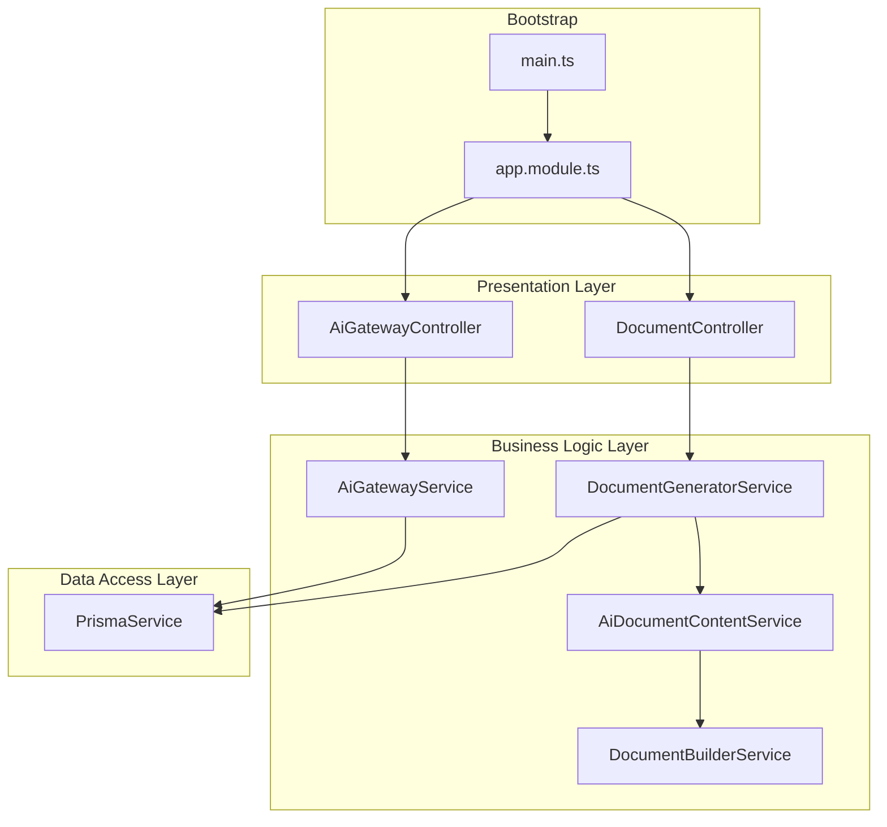
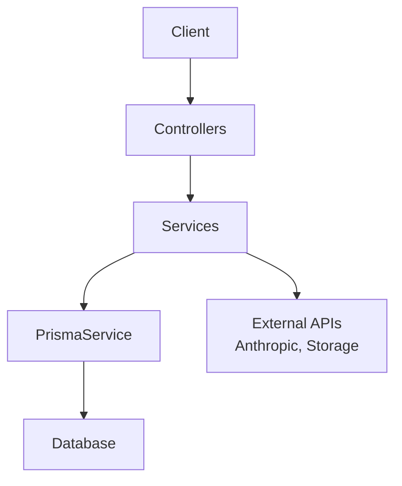
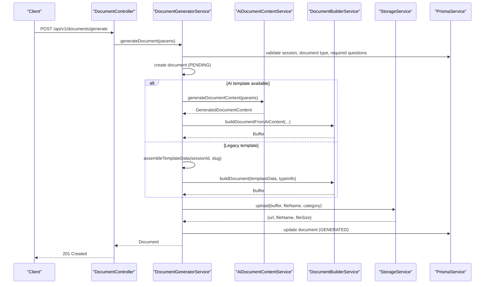
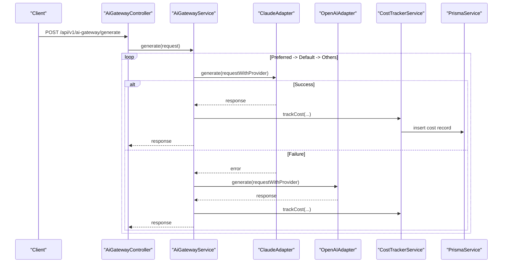
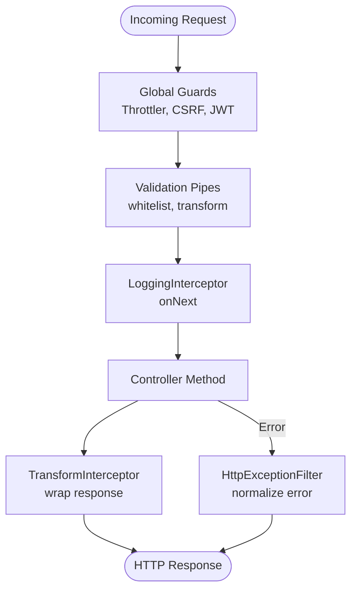
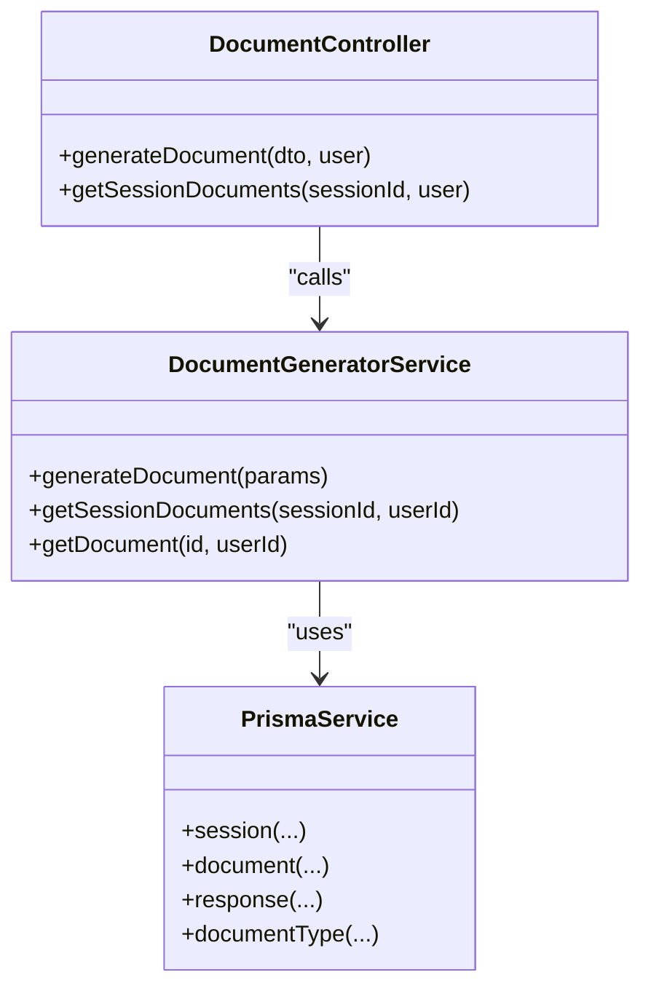
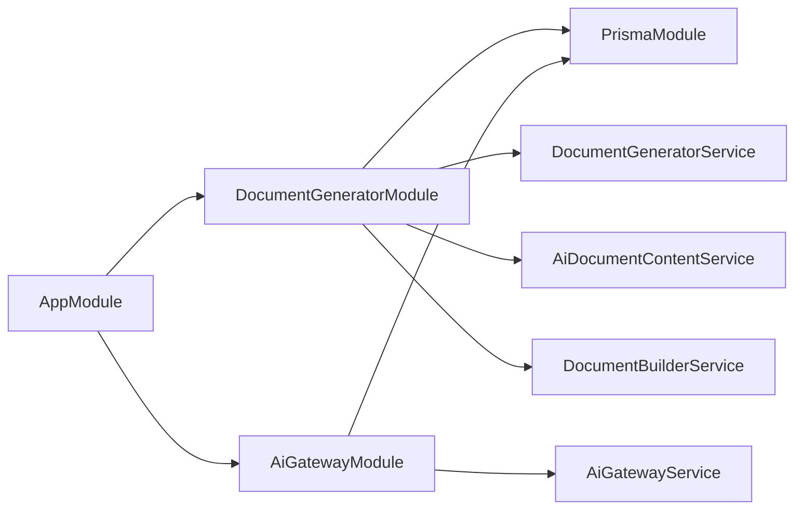

# Data Flow Patterns

<cite>
**Referenced Files in This Document**
- [main.ts](file://apps/api/src/main.ts)
- [app.module.ts](file://apps/api/src/app.module.ts)
- [logging.interceptor.ts](file://apps/api/src/common/interceptors/logging.interceptor.ts)
- [transform.interceptor.ts](file://apps/api/src/common/interceptors/transform.interceptor.ts)
- [http-exception.filter.ts](file://apps/api/src/common/filters/http-exception.filter.ts)
- [document-generator.module.ts](file://apps/api/src/modules/document-generator/document-generator.module.ts)
- [document.controller.ts](file://apps/api/src/modules/document-generator/controllers/document.controller.ts)
- [document-generator.service.ts](file://apps/api/src/modules/document-generator/services/document-generator.service.ts)
- [document-builder.service.ts](file://apps/api/src/modules/document-generator/services/document-builder.service.ts)
- [ai-document-content.service.ts](file://apps/api/src/modules/document-generator/services/ai-document-content.service.ts)
- [ai-gateway.module.ts](file://apps/api/src/modules/ai-gateway/ai-gateway.module.ts)
- [ai-gateway.service.ts](file://apps/api/src/modules/ai-gateway/ai-gateway.service.ts)
</cite>

## Table of Contents
1. [Introduction](#introduction)
2. [Project Structure](#project-structure)
3. [Core Components](#core-components)
4. [Architecture Overview](#architecture-overview)
5. [Detailed Component Analysis](#detailed-component-analysis)
6. [Dependency Analysis](#dependency-analysis)
7. [Performance Considerations](#performance-considerations)
8. [Troubleshooting Guide](#troubleshooting-guide)
9. [Conclusion](#conclusion)

## Introduction
This document explains Quiz-to-Build’s data flow patterns and architectural patterns with a focus on:
- Layered architecture: presentation, business logic, and data access
- Service layer pattern with separation of concerns and dependency inversion
- Repository/data access abstraction via Prisma services
- Event-driven patterns for asynchronous processing (document generation and AI content)
- CQRS-like separation of read and write operations
- Cross-cutting concerns via interceptors and middleware
- Frontend data flow using React Query (conceptual overview)
- Request/response flows, error propagation, validation, performance optimization, caching, and consistency

## Project Structure
The API application follows a modular NestJS structure:
- Bootstrap initializes middleware, guards, interceptors, filters, and Swagger
- AppModule aggregates feature modules and external integrations (Prisma, Redis)
- Feature modules encapsulate domain capabilities (e.g., document generation, AI gateway)
- Controllers orchestrate HTTP endpoints; Services encapsulate business logic; Providers supply reusable utilities

**Diagram sources**
- [main.ts:28-329](file://apps/api/src/main.ts#L28-L329)
- [app.module.ts:53-129](file://apps/api/src/app.module.ts#L53-L129)
- [document.controller.ts:35-278](file://apps/api/src/modules/document-generator/controllers/document.controller.ts#L35-L278)
- [document-generator.service.ts:21-609](file://apps/api/src/modules/document-generator/services/document-generator.service.ts#L21-L609)
- [ai-document-content.service.ts:59-359](file://apps/api/src/modules/document-generator/services/ai-document-content.service.ts#L59-L359)
- [document-builder.service.ts:28-539](file://apps/api/src/modules/document-generator/services/document-builder.service.ts#L28-L539)
- [ai-gateway.service.ts:21-332](file://apps/api/src/modules/ai-gateway/ai-gateway.service.ts#L21-L332)

**Section sources**
- [main.ts:28-329](file://apps/api/src/main.ts#L28-L329)
- [app.module.ts:53-129](file://apps/api/src/app.module.ts#L53-L129)

## Core Components
- Interceptors: LoggingInterceptor and TransformInterceptor standardize request logging and response shaping
- Exception Filter: HttpExceptionFilter centralizes error handling and response formatting
- Document Generator Module: Orchestrates document creation, AI content generation, and storage
- AI Gateway Module: Provides provider abstraction, fallback, streaming, and cost tracking
- Prisma Service: Centralized data access abstraction across modules

Key responsibilities:
- Presentation: Controllers expose endpoints and map DTOs to response DTOs
- Business: Services encapsulate workflows, validations, and orchestration
- Data: Services rely on PrismaService for persistence and queries

**Section sources**
- [logging.interceptor.ts:10-56](file://apps/api/src/common/interceptors/logging.interceptor.ts#L10-L56)
- [transform.interceptor.ts:14-32](file://apps/api/src/common/interceptors/transform.interceptor.ts#L14-L32)
- [http-exception.filter.ts:22-102](file://apps/api/src/common/filters/http-exception.filter.ts#L22-L102)
- [document-generator.module.ts:19-47](file://apps/api/src/modules/document-generator/document-generator.module.ts#L19-L47)
- [ai-gateway.module.ts:19-26](file://apps/api/src/modules/ai-gateway/ai-gateway.module.ts#L19-L26)

## Architecture Overview
The system employs a layered architecture with explicit separation of concerns:
- Presentation: Nest controllers handle HTTP requests and responses
- Business: Services implement domain workflows and enforce business rules
- Data: PrismaService abstracts database operations; modules export providers for reuse

Cross-cutting concerns are handled via:
- Middleware: Helmet, compression, CORS, cookies, request size limits
- Guards: ThrottlerGuard, CsrfGuard, JWT guard
- Interceptors: Logging and response transformation
- Filters: Centralized error handling

[No sources needed since this diagram shows conceptual workflow, not actual code structure]

## Detailed Component Analysis

### Document Generation Workflow
This workflow demonstrates synchronous orchestration within the business layer, with asynchronous triggers conceptually supported for long-running tasks.

**Diagram sources**
- [document.controller.ts:44-65](file://apps/api/src/modules/document-generator/controllers/document.controller.ts#L44-L65)
- [document-generator.service.ts:37-136](file://apps/api/src/modules/document-generator/services/document-generator.service.ts#L37-L136)
- [ai-document-content.service.ts:94-110](file://apps/api/src/modules/document-generator/services/ai-document-content.service.ts#L94-L110)
- [document-builder.service.ts:75-124](file://apps/api/src/modules/document-generator/services/document-builder.service.ts#L75-L124)

**Section sources**
- [document.controller.ts:44-65](file://apps/api/src/modules/document-generator/controllers/document.controller.ts#L44-L65)
- [document-generator.service.ts:37-136](file://apps/api/src/modules/document-generator/services/document-generator.service.ts#L37-L136)
- [ai-document-content.service.ts:94-110](file://apps/api/src/modules/document-generator/services/ai-document-content.service.ts#L94-L110)
- [document-builder.service.ts:75-124](file://apps/api/src/modules/document-generator/services/document-builder.service.ts#L75-L124)

### AI Gateway Service (Provider Abstraction and Fallback)
The AI Gateway routes requests across providers, tracks costs, and supports streaming with fallback.

**Diagram sources**
- [ai-gateway.service.ts:133-188](file://apps/api/src/modules/ai-gateway/ai-gateway.service.ts#L133-L188)
- [ai-gateway.service.ts:192-258](file://apps/api/src/modules/ai-gateway/ai-gateway.service.ts#L192-L258)
- [ai-gateway.module.ts:19-26](file://apps/api/src/modules/ai-gateway/ai-gateway.module.ts#L19-L26)

**Section sources**
- [ai-gateway.service.ts:133-188](file://apps/api/src/modules/ai-gateway/ai-gateway.service.ts#L133-L188)
- [ai-gateway.service.ts:192-258](file://apps/api/src/modules/ai-gateway/ai-gateway.service.ts#L192-L258)
- [ai-gateway.module.ts:19-26](file://apps/api/src/modules/ai-gateway/ai-gateway.module.ts#L19-L26)

### Cross-Cutting Concerns: Interceptors and Filters
- LoggingInterceptor: Captures request metadata and response status/duration
- TransformInterceptor: Wraps responses in a standardized envelope with request correlation
- HttpExceptionFilter: Normalizes error responses and logs unhandled exceptions

**Diagram sources**
- [main.ts:196-212](file://apps/api/src/main.ts#L196-L212)
- [logging.interceptor.ts:14-54](file://apps/api/src/common/interceptors/logging.interceptor.ts#L14-L54)
- [transform.interceptor.ts:15-30](file://apps/api/src/common/interceptors/transform.interceptor.ts#L15-L30)
- [http-exception.filter.ts:26-82](file://apps/api/src/common/filters/http-exception.filter.ts#L26-L82)

**Section sources**
- [main.ts:196-212](file://apps/api/src/main.ts#L196-L212)
- [logging.interceptor.ts:14-54](file://apps/api/src/common/interceptors/logging.interceptor.ts#L14-L54)
- [transform.interceptor.ts:15-30](file://apps/api/src/common/interceptors/transform.interceptor.ts#L15-L30)
- [http-exception.filter.ts:26-82](file://apps/api/src/common/filters/http-exception.filter.ts#L26-L82)

### Data Access Abstraction with Prisma
- Modules import PrismaModule and use PrismaService injected into services
- Services encapsulate queries and mutations, exposing domain-focused methods
- This pattern achieves dependency inversion: controllers and services depend on abstractions (PrismaService), not concrete implementations

**Diagram sources**
- [document.controller.ts:40-105](file://apps/api/src/modules/document-generator/controllers/document.controller.ts#L40-L105)
- [document-generator.service.ts:25-305](file://apps/api/src/modules/document-generator/services/document-generator.service.ts#L25-L305)
- [document-generator.module.ts:19-47](file://apps/api/src/modules/document-generator/document-generator.module.ts#L19-L47)

**Section sources**
- [document-generator.module.ts:19-47](file://apps/api/src/modules/document-generator/document-generator.module.ts#L19-L47)
- [document-generator.service.ts:25-305](file://apps/api/src/modules/document-generator/services/document-generator.service.ts#L25-L305)

### Event-Driven Architecture Notes
- Document generation is executed synchronously in the current implementation
- Notifications are fire-and-forget via the notification service
- Asynchronous processing patterns (queues, events) are not present in the analyzed files; however, the design supports moving long-running work off the request thread by introducing background workers and event publishing

[No sources needed since this section provides general guidance]

### CQRS Pattern Notes
- Read and write operations are mixed in the analyzed services (e.g., DocumentGeneratorService performs reads and writes)
- A CQRS-style separation would split these into distinct handlers/services:
  - Queries: pure reads (e.g., listDocumentTypes, getSessionDocuments)
  - Commands: write/update operations (e.g., generateDocument)
- Benefits include improved scalability, testability, and data consistency controls

[No sources needed since this section provides general guidance]

### Frontend Data Flow Using React Query (Conceptual)
- Typical flow: UI triggers a mutation (e.g., generate document), React Query manages optimistic updates, invalidates queries, and refetches data
- Caching strategies: query keys, stale times, background refetch, and selective invalidation
- Optimistic updates: UI reflects changes immediately while awaiting server confirmation

[No sources needed since this diagram shows conceptual workflow, not actual code structure]

## Dependency Analysis
- AppModule aggregates feature modules and external systems (PrismaModule, RedisModule)
- DocumentGeneratorModule depends on PrismaModule and exposes services for document generation, AI content, and rendering
- AiGatewayModule depends on PrismaModule and exposes AI gateway services and adapters
- Controllers depend on services; services depend on PrismaService and other providers

**Diagram sources**
- [app.module.ts:53-129](file://apps/api/src/app.module.ts#L53-L129)
- [document-generator.module.ts:19-47](file://apps/api/src/modules/document-generator/document-generator.module.ts#L19-L47)
- [ai-gateway.module.ts:19-26](file://apps/api/src/modules/ai-gateway/ai-gateway.module.ts#L19-L26)

**Section sources**
- [app.module.ts:53-129](file://apps/api/src/app.module.ts#L53-L129)
- [document-generator.module.ts:19-47](file://apps/api/src/modules/document-generator/document-generator.module.ts#L19-L47)
- [ai-gateway.module.ts:19-26](file://apps/api/src/modules/ai-gateway/ai-gateway.module.ts#L19-L26)

## Performance Considerations
- Compression: Enabled globally except for streaming endpoints; configurable via compression filter
- CORS: Origin parsing and credential handling; credentials enabled only when origins are not wildcard
- Validation: ValidationPipe enforces whitelisting and transforms inputs
- Rate limiting: ThrottlerModule configured with short/medium/long windows
- Security: Helmet CSP, permissions policy, HSTS in production
- Observability: Application Insights and Sentry initialization; structured logging via Pino

Recommendations:
- Cache frequently accessed read models (e.g., document types) at the service layer
- Use streaming for large responses where applicable
- Implement circuit breakers for external AI providers
- Monitor token usage and costs via cost tracker

**Section sources**
- [main.ts:43-123](file://apps/api/src/main.ts#L43-L123)
- [main.ts:180-191](file://apps/api/src/main.ts#L180-L191)
- [main.ts:196-206](file://apps/api/src/main.ts#L196-L206)
- [main.ts:208-212](file://apps/api/src/main.ts#L208-L212)

## Troubleshooting Guide
- Error propagation: HttpExceptionFilter normalizes responses and logs stack traces for unhandled errors
- Request tracing: LoggingInterceptor captures method, URL, status, duration, IP, and user agent
- Response envelope: TransformInterceptor adds success flag, data, and meta (timestamp, request ID)
- Common issues:
  - Validation failures: caught by ValidationPipe and transformed into structured errors
  - Authentication/authorization: guarded by JWT and CSRF guards
  - Provider failures: AI Gateway attempts fallback providers and records last error

**Section sources**
- [http-exception.filter.ts:26-82](file://apps/api/src/common/filters/http-exception.filter.ts#L26-L82)
- [logging.interceptor.ts:14-54](file://apps/api/src/common/interceptors/logging.interceptor.ts#L14-L54)
- [transform.interceptor.ts:15-30](file://apps/api/src/common/interceptors/transform.interceptor.ts#L15-L30)
- [main.ts:196-212](file://apps/api/src/main.ts#L196-L212)

## Conclusion
Quiz-to-Build implements a clean layered architecture with strong separation of concerns:
- Presentation, business logic, and data access are clearly delineated
- Interceptors and filters standardize cross-cutting concerns
- PrismaService provides robust data access abstraction
- Document generation and AI gateway demonstrate orchestration patterns suitable for both synchronous and asynchronous processing
- CQRS and event-driven patterns are not yet implemented but align with the current design, enabling future scalability and resilience