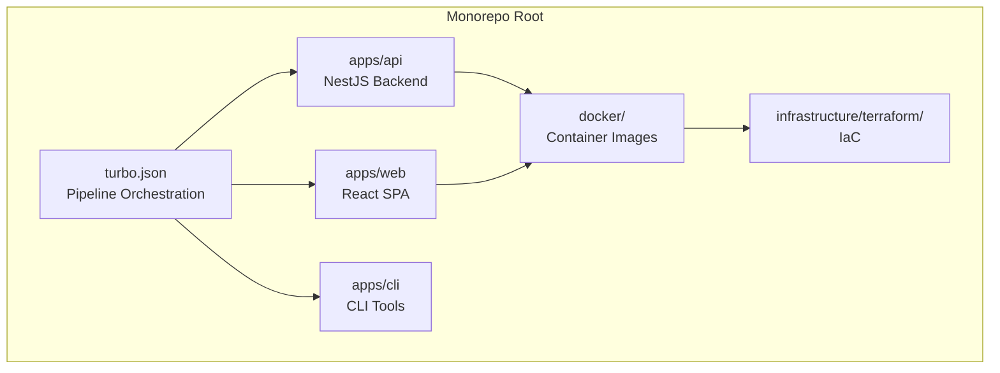
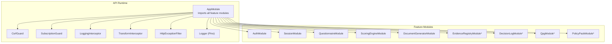
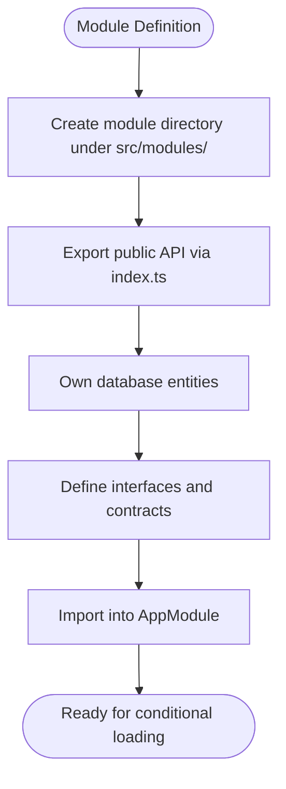
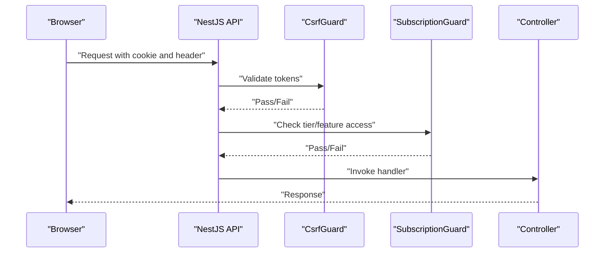
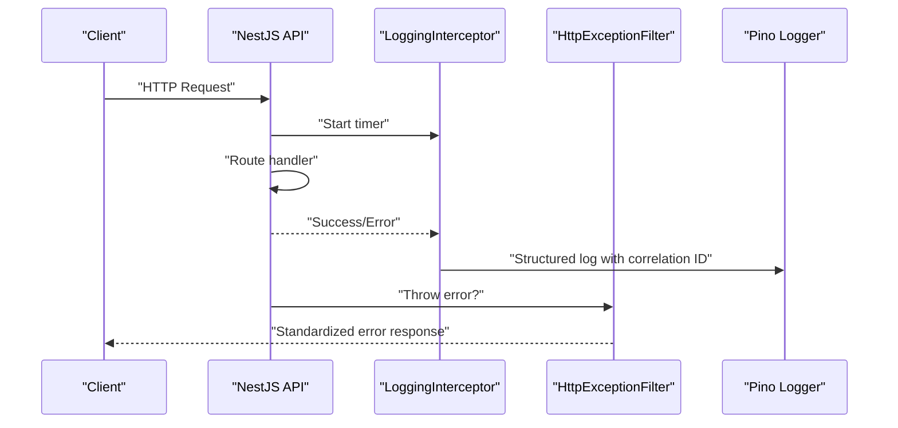
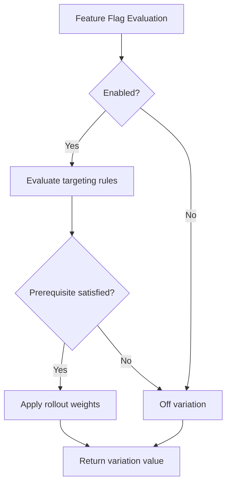
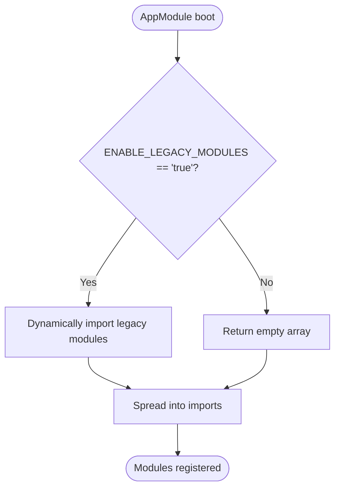
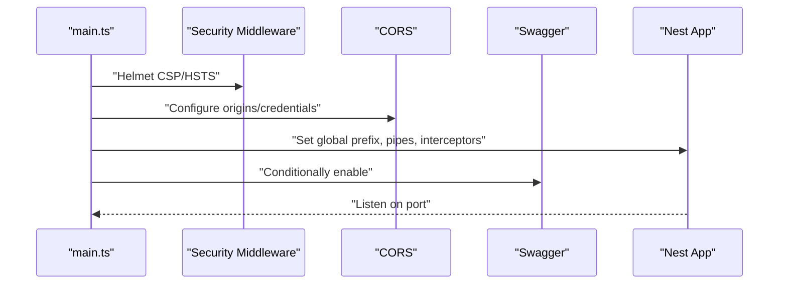
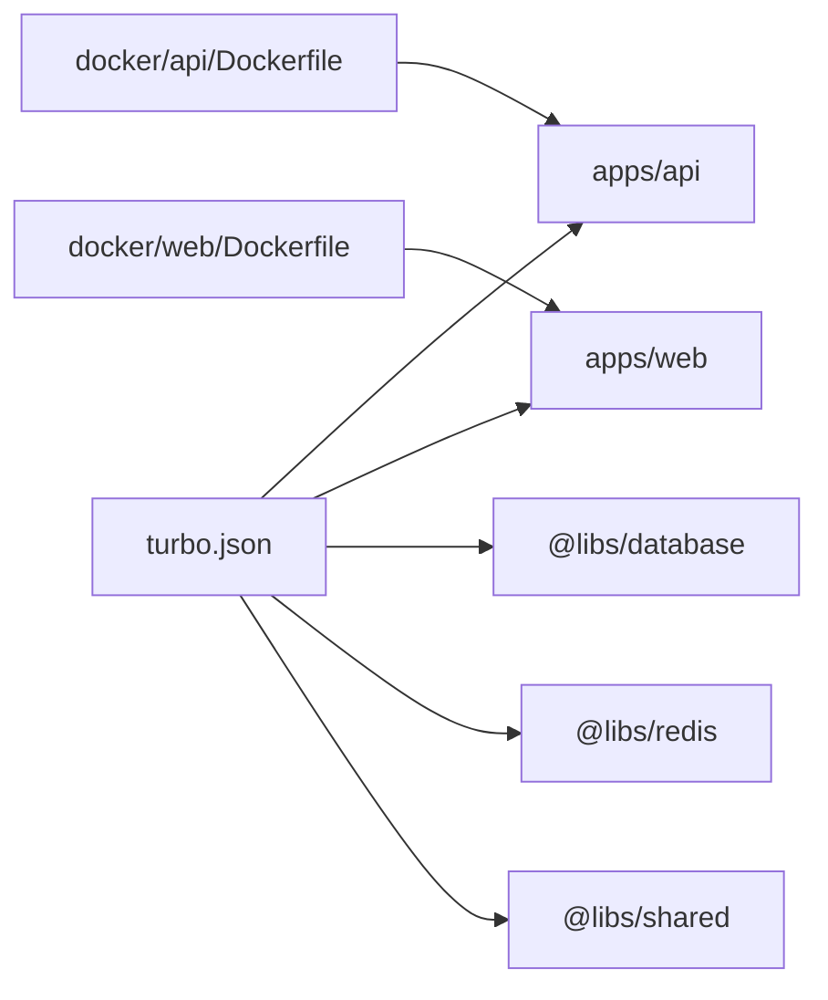

# System Design Philosophy

<cite>
**Referenced Files in This Document**
- [004-monolith-vs-microservices.md](file://docs/adr/004-monolith-vs-microservices.md)
- [app.module.ts](file://apps/api/src/app.module.ts)
- [main.ts](file://apps/api/src/main.ts)
- [feature-flags.config.ts (API)](file://apps/api/src/config/feature-flags.config.ts)
- [feature-flags.config.ts (Web)](file://apps/web/src/config/feature-flags.config.ts)
- [csrf.guard.ts](file://apps/api/src/common/guards/csrf.guard.ts)
- [subscription.guard.ts](file://apps/api/src/common/guards/subscription.guard.ts)
- [logging.interceptor.ts](file://apps/api/src/common/interceptors/logging.interceptor.ts)
- [transform.interceptor.ts](file://apps/api/src/common/interceptors/transform.interceptor.ts)
- [http-exception.filter.ts](file://apps/api/src/common/filters/http-exception.filter.ts)
- [logger.config.ts](file://apps/api/src/config/logger.config.ts)
- [Dockerfile (API)](file://docker/api/Dockerfile)
- [Dockerfile (Web)](file://docker/web/Dockerfile)
- [package.json (API)](file://apps/api/package.json)
- [package.json (Web)](file://apps/web/package.json)
- [turbo.json](file://turbo.json)
</cite>

## Table of Contents
1. [Introduction](#introduction)
2. [Project Structure](#project-structure)
3. [Core Components](#core-components)
4. [Architecture Overview](#architecture-overview)
5. [Detailed Component Analysis](#detailed-component-analysis)
6. [Dependency Analysis](#dependency-analysis)
7. [Performance Considerations](#performance-considerations)
8. [Troubleshooting Guide](#troubleshooting-guide)
9. [Conclusion](#conclusion)
10. [Appendices](#appendices)

## Introduction
This document explains Quiz-to-Build’s system design philosophy with a focus on the modular monolith approach, the rationale for key technologies, and how cross-cutting concerns are implemented. It also documents feature flagging and conditional module loading, and shows how these design choices influence development and deployment practices.

## Project Structure
Quiz-to-Build is organized as a monorepo with three primary applications:
- API (NestJS backend) under apps/api
- Web (React SPA) under apps/web
- CLI (under apps/cli) for offline/offline-related tasks

Infrastructure and deployment artifacts live under docker/, infrastructure/terraform/, and scripts/.

**Diagram sources**
- [Dockerfile (API):1-120](file://docker/api/Dockerfile#L1-L120)
- [Dockerfile (Web):1-85](file://docker/web/Dockerfile#L1-L85)
- [turbo.json:1-65](file://turbo.json#L1-L65)

**Section sources**
- [Dockerfile (API):1-120](file://docker/api/Dockerfile#L1-L120)
- [Dockerfile (Web):1-85](file://docker/web/Dockerfile#L1-L85)
- [turbo.json:1-65](file://turbo.json#L1-L65)

## Core Components
- Modular monolith with explicit module boundaries and a single deployment unit
- Unified logging, security, and observability stack
- Feature flagging for controlled rollouts and gradual feature adoption
- Conditional module loading to minimize footprint and improve startup performance
- Cross-cutting guards and interceptors for security, validation, and diagnostics

**Section sources**
- [004-monolith-vs-microservices.md:43-175](file://docs/adr/004-monolith-vs-microservices.md#L43-L175)
- [app.module.ts:32-51](file://apps/api/src/app.module.ts#L32-L51)
- [main.ts:28-329](file://apps/api/src/main.ts#L28-L329)

## Architecture Overview
The system follows a modular monolith pattern:
- A single NestJS application aggregates multiple feature modules
- Modules communicate via dependency injection and event-based patterns
- Cross-cutting concerns are enforced globally via guards, interceptors, and filters
- Feature flags and conditional loading decouple rollout cadence from deployment frequency

**Diagram sources**
- [app.module.ts:53-129](file://apps/api/src/app.module.ts#L53-L129)
- [main.ts:30-329](file://apps/api/src/main.ts#L30-L329)
- [csrf.guard.ts:47-148](file://apps/api/src/common/guards/csrf.guard.ts#L47-L148)
- [subscription.guard.ts:57-174](file://apps/api/src/common/guards/subscription.guard.ts#L57-L174)
- [logging.interceptor.ts:10-55](file://apps/api/src/common/interceptors/logging.interceptor.ts#L10-L55)
- [transform.interceptor.ts:14-31](file://apps/api/src/common/interceptors/transform.interceptor.ts#L14-L31)
- [http-exception.filter.ts:22-101](file://apps/api/src/common/filters/http-exception.filter.ts#L22-L101)

## Detailed Component Analysis

### Modular Monolith Rationale and Boundaries
- Decision: Adopt a modular monolith to reduce operational complexity, simplify debugging, and maintain clear module boundaries for future extraction
- Benefits: Unified deployment, simplified development workflow, lower latency, and cost-effective initial infrastructure
- Module boundaries: Each module encapsulates DTOs, entities, services, and public exports; inter-module communication uses DI and events

**Diagram sources**
- [004-monolith-vs-microservices.md:75-118](file://docs/adr/004-monolith-vs-microservices.md#L75-L118)

**Section sources**
- [004-monolith-vs-microservices.md:43-175](file://docs/adr/004-monolith-vs-microservices.md#L43-L175)

### Technology Stack Decisions
- Backend: NestJS
  - Strong ecosystem for guards, interceptors, filters, and Swagger
  - Excellent TypeScript support and DI
- Frontend: React 19
  - Modern reactive primitives and improved developer experience
  - Rich ecosystem for UI composition and state management
- Observability and DevOps
  - Docker multi-stage builds for secure, minimal containers
  - Turbo for fast, cached builds across packages
  - Azure Container Apps for managed hosting

**Section sources**
- [package.json (API):21-67](file://apps/api/package.json#L21-L67)
- [package.json (Web):18-36](file://apps/web/package.json#L18-L36)
- [Dockerfile (API):68-120](file://docker/api/Dockerfile#L68-L120)
- [Dockerfile (Web):40-85](file://docker/web/Dockerfile#L40-L85)
- [turbo.json:1-65](file://turbo.json#L1-L65)

### Cross-Cutting Concerns

#### Authentication and Authorization
- CSRF protection via a double-submit cookie pattern with a dedicated guard
- Subscription-based tier enforcement with route decorators and middleware
- JWT-based auth integrated with OAuth providers

**Diagram sources**
- [csrf.guard.ts:47-148](file://apps/api/src/common/guards/csrf.guard.ts#L47-L148)
- [subscription.guard.ts:57-174](file://apps/api/src/common/guards/subscription.guard.ts#L57-L174)

**Section sources**
- [csrf.guard.ts:47-148](file://apps/api/src/common/guards/csrf.guard.ts#L47-L148)
- [subscription.guard.ts:57-174](file://apps/api/src/common/guards/subscription.guard.ts#L57-L174)

#### Logging and Observability
- Structured logging via Pino with correlation IDs
- Centralized configuration for redaction and pretty printing
- HTTP request/response logging via interceptor
- Global exception filtering for consistent error responses

**Diagram sources**
- [logging.interceptor.ts:10-55](file://apps/api/src/common/interceptors/logging.interceptor.ts#L10-L55)
- [http-exception.filter.ts:22-101](file://apps/api/src/common/filters/http-exception.filter.ts#L22-L101)
- [logger.config.ts:9-61](file://apps/api/src/config/logger.config.ts#L9-L61)

**Section sources**
- [logging.interceptor.ts:10-55](file://apps/api/src/common/interceptors/logging.interceptor.ts#L10-L55)
- [http-exception.filter.ts:22-101](file://apps/api/src/common/filters/http-exception.filter.ts#L22-L101)
- [logger.config.ts:9-61](file://apps/api/src/config/logger.config.ts#L9-L61)

#### Feature Flagging and Gradual Rollout
- API-side feature flags with LaunchDarkly integration points and local evaluation
- Web-side feature flags driven by Vite environment variables
- Controlled rollouts via targeting rules and weighted variations

**Diagram sources**
- [feature-flags.config.ts (API):709-800](file://apps/api/src/config/feature-flags.config.ts#L709-L800)
- [feature-flags.config.ts (Web):1-37](file://apps/web/src/config/feature-flags.config.ts#L1-L37)

**Section sources**
- [feature-flags.config.ts (API):198-220](file://apps/api/src/config/feature-flags.config.ts#L198-L220)
- [feature-flags.config.ts (API):229-596](file://apps/api/src/config/feature-flags.config.ts#L229-L596)
- [feature-flags.config.ts (Web):1-37](file://apps/web/src/config/feature-flags.config.ts#L1-L37)

### Conditional Module Loading
- Legacy modules are conditionally loaded behind an environment flag
- Dynamic imports avoid loading unused code when flags are disabled
- Improves cold start and reduces memory footprint

**Diagram sources**
- [app.module.ts:32-51](file://apps/api/src/app.module.ts#L32-L51)

**Section sources**
- [app.module.ts:32-51](file://apps/api/src/app.module.ts#L32-L51)

### API Bootstrapping and Security Hardening
- Helmet CSP, HSTS, and permissions policies
- Compression with streaming endpoint exemptions
- CORS, body limits, and request tracking
- Swagger gated by environment variable

**Diagram sources**
- [main.ts:28-329](file://apps/api/src/main.ts#L28-L329)

**Section sources**
- [main.ts:28-329](file://apps/api/src/main.ts#L28-L329)

## Dependency Analysis
- Build orchestration via Turbo pipeline
- Docker multi-stage builds for API and Web
- Shared libraries under libs/ consumed by API and CLI
- Frontend built and served by nginx in production

**Diagram sources**
- [turbo.json:1-65](file://turbo.json#L1-L65)
- [Dockerfile (API):1-120](file://docker/api/Dockerfile#L1-L120)
- [Dockerfile (Web):1-85](file://docker/web/Dockerfile#L1-L85)

**Section sources**
- [turbo.json:1-65](file://turbo.json#L1-L65)
- [Dockerfile (API):1-120](file://docker/api/Dockerfile#L1-L120)
- [Dockerfile (Web):1-85](file://docker/web/Dockerfile#L1-L85)

## Performance Considerations
- Modular monolith reduces inter-service latency and simplifies caching
- Conditional module loading minimizes memory footprint
- Compression excludes streaming endpoints to preserve throughput
- Structured logging avoids expensive string interpolation
- Turborepo accelerates builds and test coverage

[No sources needed since this section provides general guidance]

## Troubleshooting Guide
- CSRF failures: Ensure cookie and header tokens match and are present
- Tier/feature access denied: Verify organization context and subscription limits
- Unhandled errors: Inspect standardized error responses and correlation IDs
- Logging: Confirm Pino configuration and redaction settings

**Section sources**
- [csrf.guard.ts:95-148](file://apps/api/src/common/guards/csrf.guard.ts#L95-L148)
- [subscription.guard.ts:127-174](file://apps/api/src/common/guards/subscription.guard.ts#L127-L174)
- [http-exception.filter.ts:22-101](file://apps/api/src/common/filters/http-exception.filter.ts#L22-L101)
- [logger.config.ts:9-61](file://apps/api/src/config/logger.config.ts#L9-L61)

## Conclusion
Quiz-to-Build’s modular monolith design balances rapid development, operational simplicity, and future scalability. The explicit module boundaries, cross-cutting concerns, and feature flagging strategy enable controlled evolution toward microservices when justified by growth and team structure. The chosen tech stack and deployment model support this vision while keeping costs low and developer productivity high.

[No sources needed since this section summarizes without analyzing specific files]

## Appendices

### Architectural Decision Records (ADRs)
- Monolith vs microservices: Modular monolith selected with clear extraction criteria
- Database choice: Aligns with monolith and shared infrastructure
- Authentication/authorization: Auth module as cross-cutting concern
- Secrets management, data residency, multi-tenancy, key rotation, API versioning: Documented in ADRs

**Section sources**
- [004-monolith-vs-microservices.md:1-190](file://docs/adr/004-monolith-vs-microservices.md#L1-L190)

### Deployment and Operations
- Containers: API and Web built with multi-stage Dockerfiles and served by nginx
- Health checks: Included in Dockerfiles for managed platforms
- CI/CD: Turbo pipeline orchestrates builds and tests across packages

**Section sources**
- [Dockerfile (API):68-120](file://docker/api/Dockerfile#L68-L120)
- [Dockerfile (Web):40-85](file://docker/web/Dockerfile#L40-L85)
- [turbo.json:1-65](file://turbo.json#L1-L65)