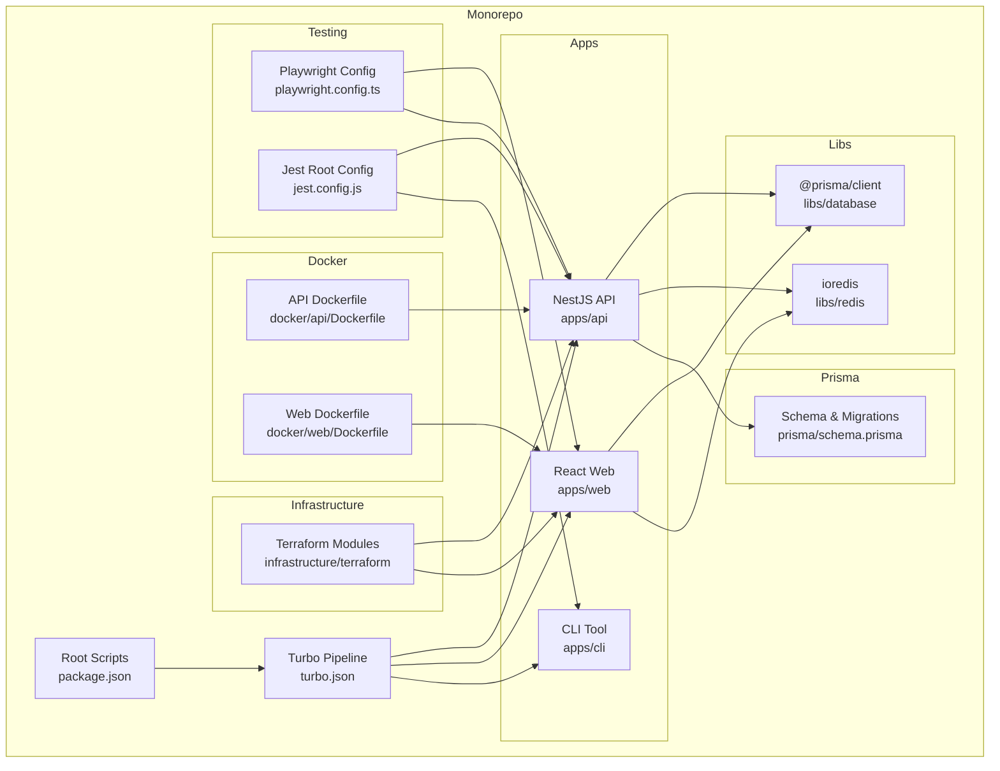
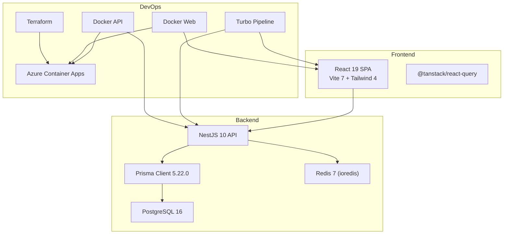
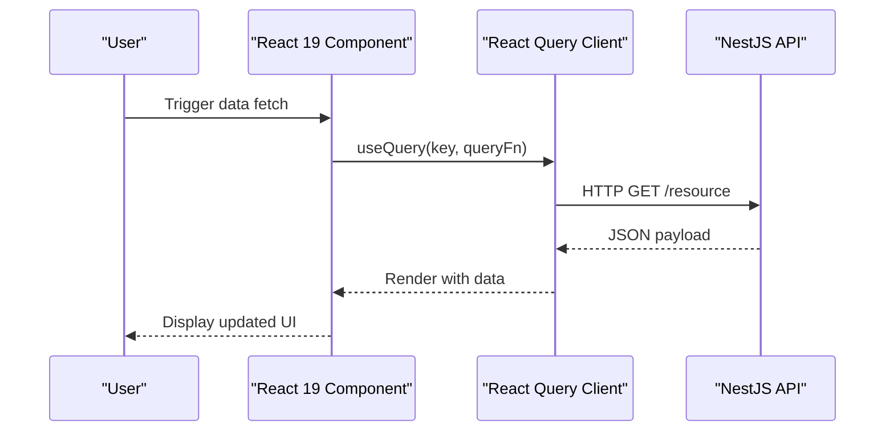
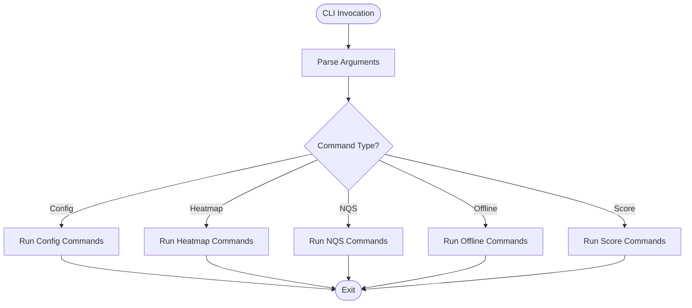
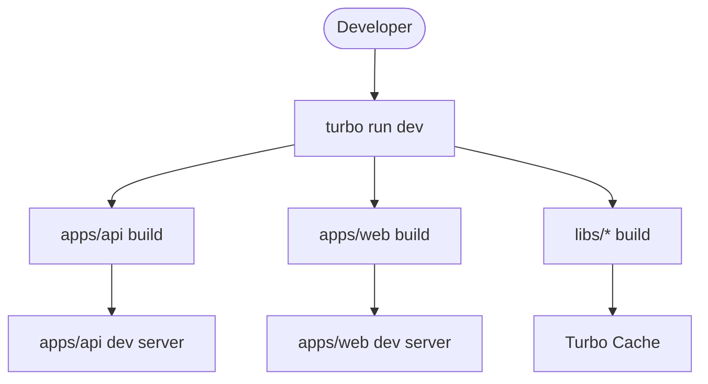
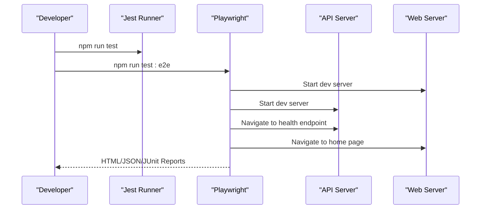
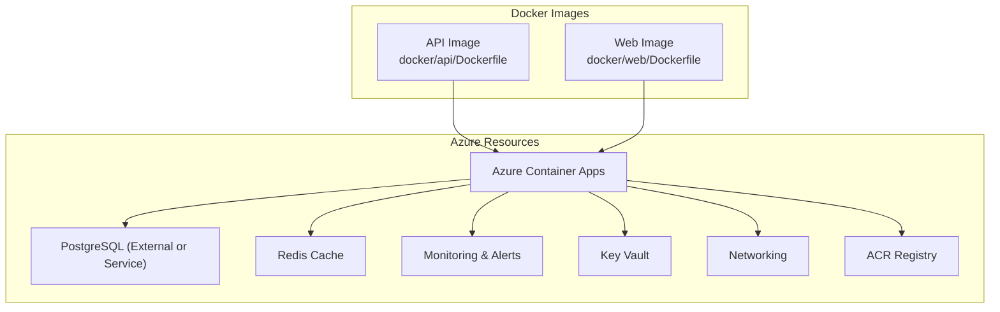
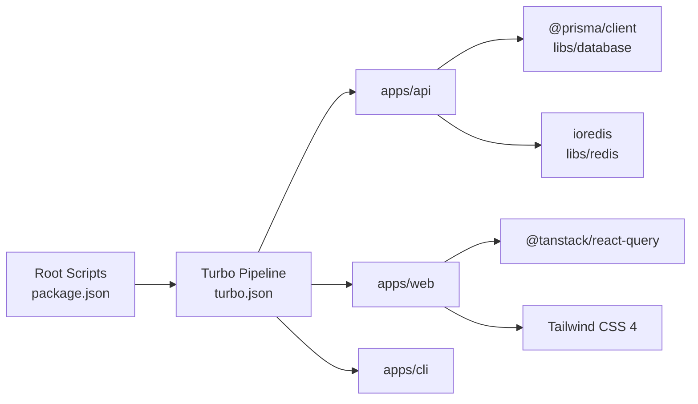

# Technology Stack

<cite>
**Referenced Files in This Document**
- [package.json](file://package.json)
- [turbo.json](file://turbo.json)
- [apps/api/package.json](file://apps/api/package.json)
- [apps/web/package.json](file://apps/web/package.json)
- [apps/cli/package.json](file://apps/cli/package.json)
- [libs/database/package.json](file://libs/database/package.json)
- [libs/redis/package.json](file://libs/redis/package.json)
- [apps/api/tsconfig.json](file://apps/api/tsconfig.json)
- [apps/web/tsconfig.json](file://apps/web/tsconfig.json)
- [apps/web/vite.config.ts](file://apps/web/vite.config.ts)
- [playwright.config.ts](file://playwright.config.ts)
- [jest.config.js](file://jest.config.js)
- [prisma/schema.prisma](file://prisma/schema.prisma)
- [docker/api/Dockerfile](file://docker/api/Dockerfile)
- [docker/web/Dockerfile](file://docker/web/Dockerfile)
- [docker/postgres/init.sql](file://docker/postgres/init.sql)
- [infrastructure/terraform/main.tf](file://infrastructure/terraform/main.tf)
- [infrastructure/terraform/modules/container-apps/main.tf](file://infrastructure/terraform/modules/container-apps/main.tf)
- [infrastructure/terraform/modules/database/main.tf](file://infrastructure/terraform/modules/database/main.tf)
- [infrastructure/terraform/modules/cache/main.tf](file://infrastructure/terraform/modules/cache/main.tf)
- [infrastructure/terraform/modules/monitoring/main.tf](file://infrastructure/terraform/modules/monitoring/main.tf)
- [infrastructure/terraform/modules/networking/main.tf](file://infrastructure/terraform/modules/networking/main.tf)
- [infrastructure/terraform/modules/keyvault/main.tf](file://infrastructure/terraform/modules/keyvault/main.tf)
- [infrastructure/terraform/modules/registry/main.tf](file://infrastructure/terraform/modules/registry/main.tf)
- [infrastructure/terraform/modules/chaos-studio/main.tf](file://infrastructure/terraform/modules/chaos-studio/main.tf)
- [scripts/deploy.sh](file://scripts/deploy.sh)
- [scripts/dev-start.sh](file://scripts/dev-start.sh)
- [scripts/setup-azure.sh](file://scripts/setup-azure.sh)
- [scripts/setup-local.sh](file://scripts/setup-local.sh)
- [scripts/run-testing-framework.ts](file://scripts/run-testing-framework.ts)
- [test/performance/api-load.k6.js](file://test/performance/api-load.k6.js)
- [test/performance/memory-load.k6.js](file://test/performance/memory-load.k6.js)
- [test/performance/stress-tests.test.ts](file://test/performance/stress-tests.test.ts)
- [e2e/global-setup.ts](file://e2e/global-setup.ts)
- [e2e/global-teardown.ts](file://e2e/global-teardown.ts)
- [e2e/auth/login.e2e.test.ts](file://e2e/auth/login.e2e.test.ts)
- [e2e/questionnaire/session-flow.e2e.test.ts](file://e2e/questionnaire/session-flow.e2e.test.ts)
- [e2e/document-generation/generation-flow.e2e.test.ts](file://e2e/document-generation/generation-flow.e2e.test.ts)
- [e2e/chat/chat-flow.e2e.test.ts](file://e2e/chat/chat-flow.e2e.test.ts)
- [e2e/payment/payment.e2e.test.ts](file://e2e/payment/payment.e2e.test.ts)
- [apps/api/src/main.ts](file://apps/api/src/main.ts)
- [apps/web/src/main.tsx](file://apps/web/src/main.tsx)
- [apps/cli/src/index.ts](file://apps/cli/src/index.ts)
- [apps/api/src/app.module.ts](file://apps/api/src/app.module.ts)
- [apps/api/src/modules/auth/auth.module.ts](file://apps/api/src/modules/auth/auth.module.ts)
- [apps/api/src/modules/document-generator/document-generator.module.ts](file://apps/api/src/modules/document-generator/document-generator.module.ts)
- [apps/api/src/modules/chat-engine/chat-engine.module.ts](file://apps/api/src/modules/chat-engine/chat-engine.module.ts)
- [apps/api/src/modules/fact-extraction/fact-extraction.module.ts](file://apps/api/src/modules/fact-extraction/fact-extraction.module.ts)
- [apps/api/src/modules/scoring-engine/scoring-engine.module.ts](file://apps/api/src/modules/scoring-engine/scoring-engine.module.ts)
- [apps/api/src/modules/heatmap/heatmap.module.ts](file://apps/api/src/modules/heatmap/heatmap.module.ts)
- [apps/api/src/modules/decision-log/decision-log.module.ts](file://apps/api/src/modules/decision-log/decision-log.module.ts)
- [apps/api/src/modules/evidence-registry/evidence-registry.module.ts](file://apps/api/src/modules/evidence-registry/evidence-registry.module.ts)
- [apps/api/src/modules/policy-pack/policy-pack.module.ts](file://apps/api/src/modules/policy-pack/policy-pack.module.ts)
- [apps/api/src/modules/projects/projects.module.ts](file://apps/api/src/modules/projects/projects.module.ts)
- [apps/api/src/modules/qpg/qpg.module.ts](file://apps/api/src/modules/qpg/qpg.module.ts)
- [apps/api/src/modules/quality-scoring/quality-scoring.module.ts](file://apps/api/src/modules/quality-scoring/quality-scoring.module.ts)
- [apps/api/src/modules/questionnaire/questionnaire.module.ts](file://apps/api/src/modules/questionnaire/questionnaire.module.ts)
- [apps/api/src/modules/session/session.module.ts](file://apps/api/src/modules/session/session.module.ts)
- [apps/api/src/modules/standards/standards.module.ts](file://apps/api/src/modules/standards/standards.module.ts)
- [apps/api/src/modules/users/users.module.ts](file://apps/api/src/modules/users/users.module.ts)
- [apps/api/src/modules/admin/admin.module.ts](file://apps/api/src/modules/admin/admin.module.ts)
- [apps/api/src/modules/ai-gateway/ai-gateway.module.ts](file://apps/api/src/modules/ai-gateway/ai-gateway.module.ts)
- [apps/api/src/modules/adaptivelogic/adaptive-logic.module.ts](file://apps/api/src/modules/adaptivelogic/adaptive-logic.module.ts)
- [apps/api/src/modules/notification/notification.module.ts](file://apps/api/src/modules/notification/notification.module.ts)
- [apps/api/src/modules/notifications/notifications.module.ts](file://apps/api/src/modules/notifications/notifications.module.ts)
- [apps/api/src/modules/payment/payment.module.ts](file://apps/api/src/modules/payment/payment.module.ts)
- [apps/api/src/modules/document-commerce/document-commerce.module.ts](file://apps/api/src/modules/document-commerce/document-commerce.module.ts)
- [apps/api/src/modules/idea-capture/idea-capture.module.ts](file://apps/api/src/modules/idea-capture/idea-capture.module.ts)
- [apps/api/src/modules/adapter/adapter.module.ts](file://apps/api/src/modules/adapter/adapter.module.ts)
- [apps/api/src/modules/session/session.service.ts](file://apps/api/src/modules/session/session.service.ts)
- [apps/api/src/modules/session/session.controller.ts](file://apps/api/src/modules/session/session.controller.ts)
- [apps/api/src/modules/auth/auth.service.ts](file://apps/api/src/modules/auth/auth.service.ts)
- [apps/api/src/modules/auth/auth.controller.ts](file://apps/api/src/modules/auth/auth.controller.ts)
- [apps/api/src/modules/document-generator/document-generator.service.ts](file://apps/api/src/modules/document-generator/document-generator.service.ts)
- [apps/api/src/modules/document-generator/document-generator.controller.ts](file://apps/api/src/modules/document-generator/document-generator.controller.ts)
- [apps/api/src/modules/chat-engine/chat-engine.service.ts](file://apps/api/src/modules/chat-engine/chat-engine.service.ts)
- [apps/api/src/modules/chat-engine/chat-engine.controller.ts](file://apps/api/src/modules/chat-engine/chat-engine.controller.ts)
- [apps/api/src/modules/fact-extraction/fact-extraction.service.ts](file://apps/api/src/modules/fact-extraction/fact-extraction.service.ts)
- [apps/api/src/modules/fact-extraction/fact-extraction.controller.ts](file://apps/api/src/modules/fact-extraction/fact-extraction.controller.ts)
- [apps/api/src/modules/scoring-engine/scoring-engine.service.ts](file://apps/api/src/modules/scoring-engine/scoring-engine.service.ts)
- [apps/api/src/modules/scoring-engine/scoring-engine.controller.ts](file://apps/api/src/modules/scoring-engine/scoring-engine.controller.ts)
- [apps/api/src/modules/heatmap/heatmap.service.ts](file://apps/api/src/modules/heatmap/heatmap.service.ts)
- [apps/api/src/modules/heatmap/heatmap.controller.ts](file://apps/api/src/modules/heatmap/heatmap.controller.ts)
- [apps/api/src/modules/decision-log/decision-log.service.ts](file://apps/api/src/modules/decision-log/decision-log.service.ts)
- [apps/api/src/modules/decision-log/decision-log.controller.ts](file://apps/api/src/modules/decision-log/decision-log.controller.ts)
- [apps/api/src/modules/evidence-registry/evidence-registry.service.ts](file://apps/api/src/modules/evidence-registry/evidence-registry.service.ts)
- [apps/api/src/modules/evidence-registry/evidence-registry.controller.ts](file://apps/api/src/modules/evidence-registry/evidence-registry.controller.ts)
- [apps/api/src/modules/policy-pack/policy-pack.service.ts](file://apps/api/src/modules/policy-pack/policy-pack.service.ts)
- [apps/api/src/modules/policy-pack/policy-pack.controller.ts](file://apps/api/src/modules/policy-pack/policy-pack.controller.ts)
- [apps/api/src/modules/projects/projects.service.ts](file://apps/api/src/modules/projects/projects.service.ts)
- [apps/api/src/modules/projects/projects.controller.ts](file://apps/api/src/modules/projects/projects.controller.ts)
- [apps/api/src/modules/qpg/qpg.service.ts](file://apps/api/src/modules/qpg/qpg.service.ts)
- [apps/api/src/modules/qpg/qpg.controller.ts](file://apps/api/src/modules/qpg/qpg.controller.ts)
- [apps/api/src/modules/quality-scoring/quality-scoring.service.ts](file://apps/api/src/modules/quality-scoring/quality-scoring.service.ts)
- [apps/api/src/modules/quality-scoring/quality-scoring.controller.ts](file://apps/api/src/modules/quality-scoring/quality-scoring.controller.ts)
- [apps/api/src/modules/questionnaire/questionnaire.service.ts](file://apps/api/src/modules/questionnaire/questionnaire.service.ts)
- [apps/api/src/modules/questionnaire/questionnaire.controller.ts](file://apps/api/src/modules/questionnaire/questionnaire.controller.ts)
- [apps/api/src/modules/session/session.service.ts](file://apps/api/src/modules/session/session.service.ts)
- [apps/api/src/modules/session/session.controller.ts](file://apps/api/src/modules/session/session.controller.ts)
- [apps/api/src/modules/standards/standards.service.ts](file://apps/api/src/modules/standards/standards.service.ts)
- [apps/api/src/modules/standards/standards.controller.ts](file://apps/api/src/modules/standards/standards.controller.ts)
- [apps/api/src/modules/users/users.service.ts](file://apps/api/src/modules/users/users.service.ts)
- [apps/api/src/modules/users/users.controller.ts](file://apps/api/src/modules/users/users.controller.ts)
- [apps/api/src/modules/admin/admin.service.ts](file://apps/api/src/modules/admin/admin.service.ts)
- [apps/api/src/modules/admin/admin.controller.ts](file://apps/api/src/modules/admin/admin.controller.ts)
- [apps/api/src/modules/ai-gateway/ai-gateway.service.ts](file://apps/api/src/modules/ai-gateway/ai-gateway.service.ts)
- [apps/api/src/modules/ai-gateway/ai-gateway.controller.ts](file://apps/api/src/modules/ai-gateway/ai-gateway.controller.ts)
- [apps/api/src/modules/adaptivelogic/adaptive-logic.service.ts](file://apps/api/src/modules/adaptivelogic/adaptive-logic.service.ts)
- [apps/api/src/modules/adaptivelogic/adaptive-logic.controller.ts](file://apps/api/src/modules/adaptivelogic/adaptive-logic.controller.ts)
- [apps/api/src/modules/notification/notification.service.ts](file://apps/api/src/modules/notification/notification.service.ts)
- [apps/api/src/modules/notification/notification.controller.ts](file://apps/api/src/modules/notification/notification.controller.ts)
- [apps/api/src/modules/notifications/notifications.service.ts](file://apps/api/src/modules/notifications/notifications.service.ts)
- [apps/api/src/modules/notifications/notifications.controller.ts](file://apps/api/src/modules/notifications/notifications.controller.ts)
- [apps/api/src/modules/payment/payment.service.ts](file://apps/api/src/modules/payment/payment.service.ts)
- [apps/api/src/modules/payment/payment.controller.ts](file://apps/api/src/modules/payment/payment.controller.ts)
- [apps/api/src/modules/document-commerce/document-commerce.service.ts](file://apps/api/src/modules/document-commerce/document-commerce.service.ts)
- [apps/api/src/modules/document-commerce/document-commerce.controller.ts](file://apps/api/src/modules/document-commerce/document-commerce.controller.ts)
- [apps/api/src/modules/idea-capture/idea-capture.service.ts](file://apps/api/src/modules/idea-capture/idea-capture.service.ts)
- [apps/api/src/modules/idea-capture/idea-capture.controller.ts](file://apps/api/src/modules/idea-capture/idea-capture.controller.ts)
- [apps/api/src/modules/adapter/adapter.service.ts](file://apps/api/src/modules/adapter/adapter.service.ts)
- [apps/api/src/modules/adapter/adapter.controller.ts](file://apps/api/src/modules/adapter/adapter.controller.ts)
</cite>

## Table of Contents
1. [Introduction](#introduction)
2. [Project Structure](#project-structure)
3. [Core Components](#core-components)
4. [Architecture Overview](#architecture-overview)
5. [Detailed Component Analysis](#detailed-component-analysis)
6. [Dependency Analysis](#dependency-analysis)
7. [Performance Considerations](#performance-considerations)
8. [Troubleshooting Guide](#troubleshooting-guide)
9. [Conclusion](#conclusion)
10. [Appendices](#appendices)

## Introduction
This document presents Quiz-to-Build’s comprehensive technology stack across backend, frontend, CLI, monorepo orchestration, testing, and infrastructure. It consolidates version choices, compatibility, upgrade strategies, and selection rationale, while providing practical integration patterns and configuration management across the monorepo.

## Project Structure
The repository is a monorepo organized under workspaces:
- apps/api: NestJS 10 backend with modular domain features
- apps/web: React 19 SPA with Vite 7 and Tailwind CSS 4
- apps/cli: Command-line tool for readiness assessments
- libs: Shared libraries for database and Redis wrappers
- prisma: Data modeling and migrations
- docker: Multi-stage builds for API and Web
- infrastructure/terraform: Infrastructure-as-Code for Azure
- e2e: Playwright end-to-end suites
- test: Jest-based unit/regression/performance suites
- scripts: Dev and deployment automation

**Diagram sources**
- [package.json:11-14](file://package.json#L11-L14)
- [turbo.json:6-64](file://turbo.json#L6-L64)
- [apps/api/package.json:1-144](file://apps/api/package.json#L1-L144)
- [apps/web/package.json:1-75](file://apps/web/package.json#L1-L75)
- [apps/cli/package.json:1-69](file://apps/cli/package.json#L1-L69)
- [libs/database/package.json:1-20](file://libs/database/package.json#L1-L20)
- [libs/redis/package.json:1-21](file://libs/redis/package.json#L1-L21)
- [prisma/schema.prisma:1-12](file://prisma/schema.prisma#L1-L12)
- [docker/api/Dockerfile:1-120](file://docker/api/Dockerfile#L1-L120)
- [docker/web/Dockerfile:1-85](file://docker/web/Dockerfile#L1-L85)
- [infrastructure/terraform/main.tf](file://infrastructure/terraform/main.tf)
- [playwright.config.ts:1-133](file://playwright.config.ts#L1-L133)
- [jest.config.js:1-26](file://jest.config.js#L1-L26)

**Section sources**
- [package.json:11-14](file://package.json#L11-L14)
- [turbo.json:6-64](file://turbo.json#L6-L64)

## Core Components
- Backend: NestJS 10.3.0, TypeScript 5.x, Prisma 5.22.0, PostgreSQL 16, Redis 7 (via ioredis)
- Frontend: React 19, Vite 7, TanStack React Query, Tailwind CSS 4
- CLI: Node-based tooling with Jest for unit tests
- Monorepo: Turbo for build orchestration, caching, and dependency management
- Testing: Jest, Playwright, Cypress-like E2E via Playwright, K6 load testing
- Infrastructure: Docker, Azure Container Apps, Terraform, monitoring modules

**Section sources**
- [apps/api/package.json:21-64](file://apps/api/package.json#L21-L64)
- [apps/web/package.json:18-36](file://apps/web/package.json#L18-L36)
- [apps/cli/package.json:29-47](file://apps/cli/package.json#L29-L47)
- [package.json:68-114](file://package.json#L68-L114)
- [turbo.json:1-65](file://turbo.json#L1-L65)
- [jest.config.js:10-17](file://jest.config.js#L10-L17)
- [playwright.config.ts:1-133](file://playwright.config.ts#L1-L133)
- [test/performance/api-load.k6.js](file://test/performance/api-load.k6.js)
- [test/performance/memory-load.k6.js](file://test/performance/memory-load.k6.js)

## Architecture Overview
The system follows a modular backend with a React SPA frontend, orchestrated by Turbo, containerized with Docker, and deployed via Azure Container Apps using Terraform-managed infrastructure. Prisma manages PostgreSQL persistence, while Redis is integrated for caching.

**Diagram sources**
- [apps/web/package.json:22-35](file://apps/web/package.json#L22-L35)
- [apps/api/package.json:33-61](file://apps/api/package.json#L33-L61)
- [prisma/schema.prisma:4-12](file://prisma/schema.prisma#L4-L12)
- [libs/redis/package.json:12-16](file://libs/redis/package.json#L12-L16)
- [turbo.json:6-64](file://turbo.json#L6-L64)
- [docker/api/Dockerfile:69-120](file://docker/api/Dockerfile#L69-L120)
- [docker/web/Dockerfile:40-85](file://docker/web/Dockerfile#L40-L85)
- [infrastructure/terraform/modules/container-apps/main.tf](file://infrastructure/terraform/modules/container-apps/main.tf)

## Detailed Component Analysis

### Backend: NestJS 10.3.0, TypeScript 5.x, Prisma 5.22.0, PostgreSQL 16, Redis 7
- NestJS modules encapsulate domain capabilities (authentication, document generation, chat engine, scoring, etc.), enabling clear separation of concerns.
- Prisma 5.22.0 defines the data model and migrations; PostgreSQL 16 is configured as the datasource provider.
- Redis 7 is integrated via ioredis for caching and session-related operations.
- TypeScript 5.x ensures strong typing across modules and libraries.

```mermaid
classDiagram
class AppModule {
+imports : Module[]
+controllers : Controller[]
+providers : Provider[]
}
class AuthModule {
+authService
+authController
}
class DocumentGeneratorModule {
+documentGeneratorService
+documentGeneratorController
}
class ChatEngineModule {
+chatEngineService
+chatEngineController
}
class FactExtractionModule {
+factExtractionService
+factExtractionController
}
class ScoringEngineModule {
+scoringEngineService
+scoringEngineController
}
class HeatmapModule {
+heatmapService
+heatmapController
}
class DecisionLogModule {
+decisionLogService
+decisionLogController
}
class EvidenceRegistryModule {
+evidenceRegistryService
+evidenceRegistryController
}
class PolicyPackModule {
+policyPackService
+policyPackController
}
class ProjectsModule {
+projectsService
+projectsController
}
class QPGModule {
+qpgService
+qpgController
}
class QualityScoringModule {
+qualityScoringService
+qualityScoringController
}
class QuestionnaireModule {
+questionnaireService
+questionnaireController
}
class SessionModule {
+sessionService
+sessionController
}
class StandardsModule {
+standardsService
+standardsController
}
class UsersModule {
+usersService
+usersController
}
class AdminModule {
+adminService
+adminController
}
class AiGatewayModule {
+aiGatewayService
+aiGatewayController
}
class AdaptiveLogicModule {
+adaptiveLogicService
+adaptiveLogicController
}
class NotificationModule {
+notificationService
+notificationController
}
class NotificationsModule {
+notificationsService
+notificationsController
}
class PaymentModule {
+paymentService
+paymentController
}
class DocumentCommerceModule {
+documentCommerceService
+documentCommerceController
}
class IdeaCaptureModule {
+ideaCaptureService
+ideaCaptureController
}
class AdapterModule {
+adapterService
+adapterController
}
AppModule --> AuthModule
AppModule --> DocumentGeneratorModule
AppModule --> ChatEngineModule
AppModule --> FactExtractionModule
AppModule --> ScoringEngineModule
AppModule --> HeatmapModule
AppModule --> DecisionLogModule
AppModule --> EvidenceRegistryModule
AppModule --> PolicyPackModule
AppModule --> ProjectsModule
AppModule --> QPGModule
AppModule --> QualityScoringModule
AppModule --> QuestionnaireModule
AppModule --> SessionModule
AppModule --> StandardsModule
AppModule --> UsersModule
AppModule --> AdminModule
AppModule --> AiGatewayModule
AppModule --> AdaptiveLogicModule
AppModule --> NotificationModule
AppModule --> NotificationsModule
AppModule --> PaymentModule
AppModule --> DocumentCommerceModule
AppModule --> IdeaCaptureModule
AppModule --> AdapterModule
```

**Diagram sources**
- [apps/api/src/app.module.ts](file://apps/api/src/app.module.ts)
- [apps/api/src/modules/auth/auth.module.ts](file://apps/api/src/modules/auth/auth.module.ts)
- [apps/api/src/modules/document-generator/document-generator.module.ts](file://apps/api/src/modules/document-generator/document-generator.module.ts)
- [apps/api/src/modules/chat-engine/chat-engine.module.ts](file://apps/api/src/modules/chat-engine/chat-engine.module.ts)
- [apps/api/src/modules/fact-extraction/fact-extraction.module.ts](file://apps/api/src/modules/fact-extraction/fact-extraction.module.ts)
- [apps/api/src/modules/scoring-engine/scoring-engine.module.ts](file://apps/api/src/modules/scoring-engine/scoring-engine.module.ts)
- [apps/api/src/modules/heatmap/heatmap.module.ts](file://apps/api/src/modules/heatmap/heatmap.module.ts)
- [apps/api/src/modules/decision-log/decision-log.module.ts](file://apps/api/src/modules/decision-log/decision-log.module.ts)
- [apps/api/src/modules/evidence-registry/evidence-registry.module.ts](file://apps/api/src/modules/evidence-registry/evidence-registry.module.ts)
- [apps/api/src/modules/policy-pack/policy-pack.module.ts](file://apps/api/src/modules/policy-pack/policy-pack.module.ts)
- [apps/api/src/modules/projects/projects.module.ts](file://apps/api/src/modules/projects/projects.module.ts)
- [apps/api/src/modules/qpg/qpg.module.ts](file://apps/api/src/modules/qpg/qpg.module.ts)
- [apps/api/src/modules/quality-scoring/quality-scoring.module.ts](file://apps/api/src/modules/quality-scoring/quality-scoring.module.ts)
- [apps/api/src/modules/questionnaire/questionnaire.module.ts](file://apps/api/src/modules/questionnaire/questionnaire.module.ts)
- [apps/api/src/modules/session/session.module.ts](file://apps/api/src/modules/session/session.module.ts)
- [apps/api/src/modules/standards/standards.module.ts](file://apps/api/src/modules/standards/standards.module.ts)
- [apps/api/src/modules/users/users.module.ts](file://apps/api/src/modules/users/users.module.ts)
- [apps/api/src/modules/admin/admin.module.ts](file://apps/api/src/modules/admin/admin.module.ts)
- [apps/api/src/modules/ai-gateway/ai-gateway.module.ts](file://apps/api/src/modules/ai-gateway/ai-gateway.module.ts)
- [apps/api/src/modules/adaptivelogic/adaptive-logic.module.ts](file://apps/api/src/modules/adaptivelogic/adaptive-logic.module.ts)
- [apps/api/src/modules/notification/notification.module.ts](file://apps/api/src/modules/notification/notification.module.ts)
- [apps/api/src/modules/notifications/notifications.module.ts](file://apps/api/src/modules/notifications/notifications.module.ts)
- [apps/api/src/modules/payment/payment.module.ts](file://apps/api/src/modules/payment/payment.module.ts)
- [apps/api/src/modules/document-commerce/document-commerce.module.ts](file://apps/api/src/modules/document-commerce/document-commerce.module.ts)
- [apps/api/src/modules/idea-capture/idea-capture.module.ts](file://apps/api/src/modules/idea-capture/idea-capture.module.ts)
- [apps/api/src/modules/adapter/adapter.module.ts](file://apps/api/src/modules/adapter/adapter.module.ts)

**Section sources**
- [apps/api/package.json:21-64](file://apps/api/package.json#L21-L64)
- [prisma/schema.prisma:1-12](file://prisma/schema.prisma#L1-L12)
- [libs/redis/package.json:12-16](file://libs/redis/package.json#L12-L16)
- [apps/api/tsconfig.json:11-30](file://apps/api/tsconfig.json#L11-L30)

### Frontend: React 19, Vite 7, TanStack React Query, Tailwind CSS 4
- React 19 with Vite 7 provides fast development and optimized builds.
- TanStack React Query is used for data fetching, caching, and synchronization.
- Tailwind CSS 4 enables utility-first styling with plugin support.

**Diagram sources**
- [apps/web/package.json:22-35](file://apps/web/package.json#L22-L35)
- [apps/web/vite.config.ts:1-19](file://apps/web/vite.config.ts#L1-L19)

**Section sources**
- [apps/web/package.json:18-36](file://apps/web/package.json#L18-L36)
- [apps/web/vite.config.ts:1-19](file://apps/web/vite.config.ts#L1-L19)
- [apps/web/tsconfig.json:1-8](file://apps/web/tsconfig.json#L1-L8)

### CLI Tooling and Development Utilities
- The CLI is distributed as a package with bin entries for quiz2biz and q2b.
- Development utilities include scripts for local setup, deployment, and infrastructure provisioning.

**Diagram sources**
- [apps/cli/package.json:6-9](file://apps/cli/package.json#L6-L9)
- [apps/cli/src/index.ts](file://apps/cli/src/index.ts)

**Section sources**
- [apps/cli/package.json:1-69](file://apps/cli/package.json#L1-L69)
- [apps/cli/src/index.ts](file://apps/cli/src/index.ts)

### Monorepo Management with Turbo
- Turbo orchestrates build, test, lint, and start tasks across apps and libs.
- Caching and dependency-aware task execution improve developer productivity.
- Global dependencies include environment files.

**Diagram sources**
- [turbo.json:6-64](file://turbo.json#L6-L64)
- [package.json:15-28](file://package.json#L15-L28)

**Section sources**
- [turbo.json:1-65](file://turbo.json#L1-L65)
- [package.json:15-28](file://package.json#L15-L28)

### Testing Stack: Jest, Playwright, Cypress-like E2E, K6 Load Testing
- Jest is used for unit and integration tests across apps and libs.
- Playwright coordinates E2E tests with automatic web server startup for API and Web.
- K6 scripts measure API and memory performance.

**Diagram sources**
- [jest.config.js:10-17](file://jest.config.js#L10-L17)
- [playwright.config.ts:101-123](file://playwright.config.ts#L101-L123)

**Section sources**
- [jest.config.js:1-26](file://jest.config.js#L1-L26)
- [playwright.config.ts:1-133](file://playwright.config.ts#L1-L133)
- [test/performance/api-load.k6.js](file://test/performance/api-load.k6.js)
- [test/performance/memory-load.k6.js](file://test/performance/memory-load.k6.js)

### Infrastructure Stack: Docker, Azure Container Apps, Terraform, Monitoring
- Docker multi-stage builds produce optimized containers for API and Web.
- Terraform provisions Azure resources including Container Apps, PostgreSQL, Redis, monitoring, networking, and key vault.
- Scripts automate deployment and local setup.

**Diagram sources**
- [docker/api/Dockerfile:69-120](file://docker/api/Dockerfile#L69-L120)
- [docker/web/Dockerfile:40-85](file://docker/web/Dockerfile#L40-L85)
- [infrastructure/terraform/modules/container-apps/main.tf](file://infrastructure/terraform/modules/container-apps/main.tf)
- [infrastructure/terraform/modules/database/main.tf](file://infrastructure/terraform/modules/database/main.tf)
- [infrastructure/terraform/modules/cache/main.tf](file://infrastructure/terraform/modules/cache/main.tf)
- [infrastructure/terraform/modules/monitoring/main.tf](file://infrastructure/terraform/modules/monitoring/main.tf)
- [infrastructure/terraform/modules/keyvault/main.tf](file://infrastructure/terraform/modules/keyvault/main.tf)
- [infrastructure/terraform/modules/networking/main.tf](file://infrastructure/terraform/modules/networking/main.tf)
- [infrastructure/terraform/modules/registry/main.tf](file://infrastructure/terraform/modules/registry/main.tf)

**Section sources**
- [docker/api/Dockerfile:1-120](file://docker/api/Dockerfile#L1-L120)
- [docker/web/Dockerfile:1-85](file://docker/web/Dockerfile#L1-L85)
- [infrastructure/terraform/main.tf](file://infrastructure/terraform/main.tf)
- [scripts/deploy.sh](file://scripts/deploy.sh)
- [scripts/dev-start.sh](file://scripts/dev-start.sh)
- [scripts/setup-azure.sh](file://scripts/setup-azure.sh)
- [scripts/setup-local.sh](file://scripts/setup-local.sh)

## Dependency Analysis
- Root workspace scripts delegate to Turbo for cross-app orchestration.
- API depends on Prisma client and ioredis; libs/database and libs/redis provide wrappers.
- Web depends on React Query and Tailwind; Vite config splits vendor bundles.

**Diagram sources**
- [package.json:15-28](file://package.json#L15-L28)
- [turbo.json:6-64](file://turbo.json#L6-L64)
- [apps/api/package.json:33-61](file://apps/api/package.json#L33-L61)
- [libs/database/package.json:12-16](file://libs/database/package.json#L12-L16)
- [libs/redis/package.json:12-16](file://libs/redis/package.json#L12-L16)
- [apps/web/package.json:22-35](file://apps/web/package.json#L22-L35)

**Section sources**
- [package.json:15-28](file://package.json#L15-L28)
- [turbo.json:6-64](file://turbo.json#L6-L64)
- [apps/api/package.json:33-61](file://apps/api/package.json#L33-L61)
- [apps/web/package.json:22-35](file://apps/web/package.json#L22-L35)

## Performance Considerations
- React Query caching reduces redundant network requests; configure stale times and background refetch policies per route.
- Vite’s chunk splitting improves initial load; monitor bundle sizes and code-split routes.
- Prisma client generation and migrations should be part of CI to prevent drift.
- K6 scripts enable baseline performance checks; integrate with CI for regression detection.
- Docker multi-stage builds reduce image size and attack surface.

[No sources needed since this section provides general guidance]

## Troubleshooting Guide
- E2E failures: Use Playwright’s headed mode and report viewer; verify web/API servers start before tests.
- Jest coverage thresholds: Adjust thresholds in app configs as needed.
- Docker health checks: Ensure health endpoints are reachable after container start.
- Local setup: Use provided scripts to provision infrastructure and start services.

**Section sources**
- [playwright.config.ts:34-55](file://playwright.config.ts#L34-L55)
- [playwright.config.ts:101-123](file://playwright.config.ts#L101-L123)
- [apps/api/package.json:107-131](file://apps/api/package.json#L107-L131)
- [docker/api/Dockerfile:114-116](file://docker/api/Dockerfile#L114-L116)
- [scripts/setup-local.sh](file://scripts/setup-local.sh)

## Conclusion
Quiz-to-Build leverages a modern, scalable stack: NestJS for a robust backend, React 19 with Vite for a fast frontend, Prisma for data modeling, Redis for caching, and Turbo for monorepo orchestration. The stack integrates Docker, Azure Container Apps, and Terraform for deployment and infrastructure management, complemented by comprehensive testing with Jest, Playwright, and K6. Version choices balance stability, performance, and community support, with clear upgrade paths and operational safeguards.

[No sources needed since this section summarizes without analyzing specific files]

## Appendices

### Version Compatibility Matrix
- Node.js: >=22.0.0 (root engines)
- NestJS: 10.3.0 (backend)
- TypeScript: ~5.9.x (frontend), ~5.3.x (libs)
- Prisma: 5.22.0 (client and generator)
- PostgreSQL: 16 (datasource provider)
- Redis: 7 (ioredis)
- React: 19.2.0
- Vite: 7.2.4
- TanStack React Query: ^5.60.0
- Tailwind CSS: ^4.1.11
- Turbo: ^1.11.0
- Jest: ^29.7.0
- Playwright: ^1.58.0
- K6: test/performance scripts

**Section sources**
- [package.json:7-10](file://package.json#L7-L10)
- [apps/api/package.json:24-64](file://apps/api/package.json#L24-L64)
- [apps/web/package.json:28-62](file://apps/web/package.json#L28-L62)
- [apps/cli/package.json:61-62](file://apps/cli/package.json#L61-L62)
- [prisma/schema.prisma:4-12](file://prisma/schema.prisma#L4-L12)
- [turbo.json:1-65](file://turbo.json#L1-L65)
- [jest.config.js:1-26](file://jest.config.js#L1-L26)
- [playwright.config.ts:1-133](file://playwright.config.ts#L1-L133)

### Upgrade Strategies
- Node.js: Align root engines with app targets; validate Turbo and toolchain compatibility.
- NestJS: Review breaking changes; update decorators, guards, and interceptors incrementally.
- TypeScript: Keep versions aligned across apps/libs; leverage tsconfig paths for incremental updates.
- Prisma: Pin client and generator to the same version; run migrations in CI before deployments.
- React/Vite/Tailwind: Follow release notes; test build outputs and browser compatibility.
- Redis: Verify connection and serialization settings after upgrades.
- Infrastructure: Use Terraform plan/apply; maintain drift detection and backup strategies.

[No sources needed since this section provides general guidance]

### Technology Selection Criteria
- Developer productivity: Turbo, Vite, Jest, Playwright
- Type safety: TypeScript across backend/frontend
- Data modeling: Prisma for schema evolution and migrations
- Caching: Redis for performance and session state
- Observability: Sentry, Application Insights, monitoring modules
- Deployment: Docker + Azure Container Apps for managed scaling
- Testing: Multi-layered approach (unit, integration, E2E, load)

[No sources needed since this section provides general guidance]

### Practical Integration Patterns
- Monorepo build orchestration: Use Turbo pipeline to build apps and libs in dependency order.
- Path aliases: Configure tsconfig paths to resolve libs consistently across apps.
- Environment injection: Build-time args for Vite and runtime envsubst for nginx.
- Health checks: Implement health endpoints and Docker healthchecks for reliable deployments.
- E2E automation: Use Playwright projects for desktop/mobile; manage web servers via config.

**Section sources**
- [turbo.json:6-64](file://turbo.json#L6-L64)
- [apps/api/tsconfig.json:11-30](file://apps/api/tsconfig.json#L11-L30)
- [apps/web/vite.config.ts:1-19](file://apps/web/vite.config.ts#L1-L19)
- [docker/web/Dockerfile:64-84](file://docker/web/Dockerfile#L64-L84)
- [docker/api/Dockerfile:114-116](file://docker/api/Dockerfile#L114-L116)
- [playwright.config.ts:57-92](file://playwright.config.ts#L57-L92)