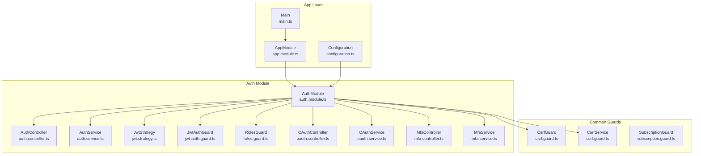
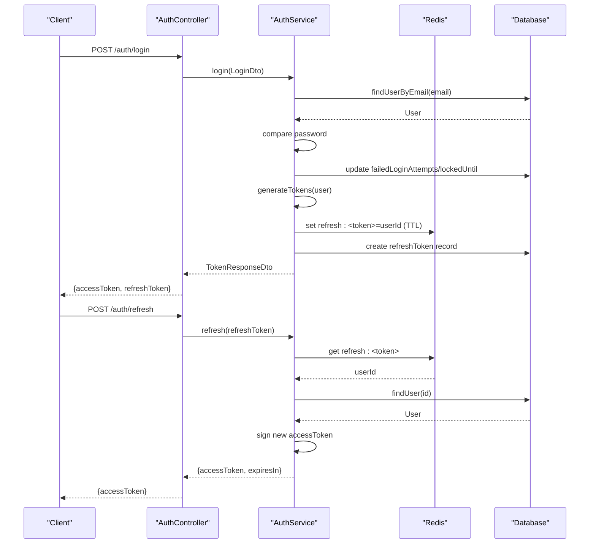
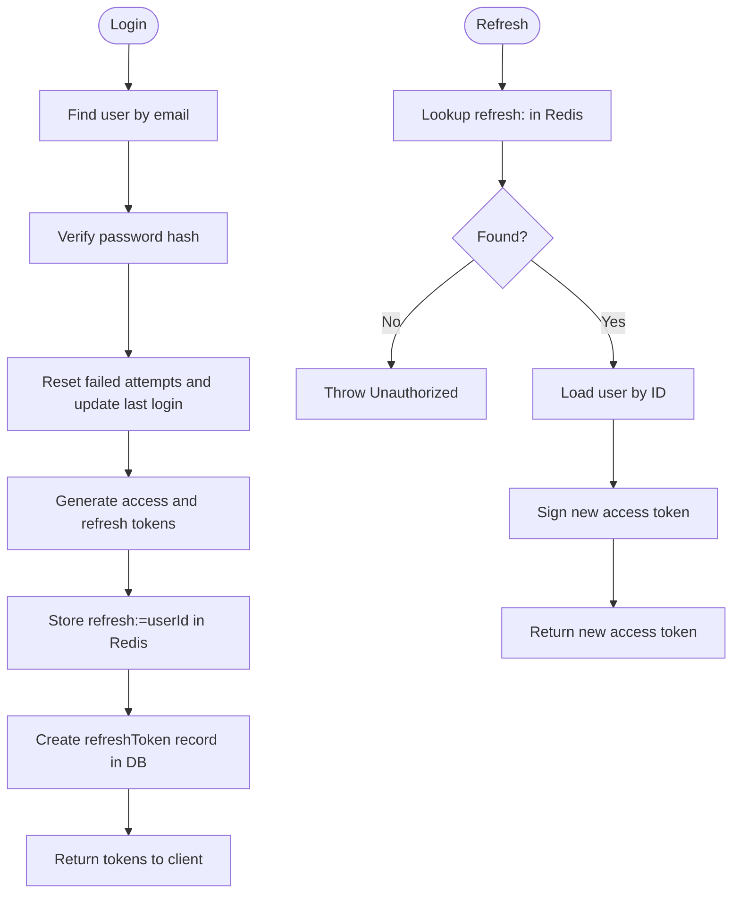
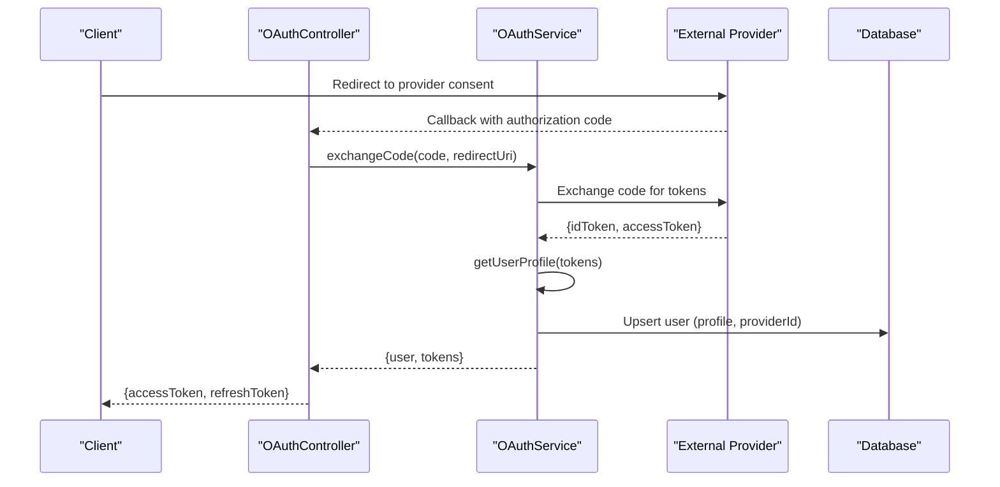
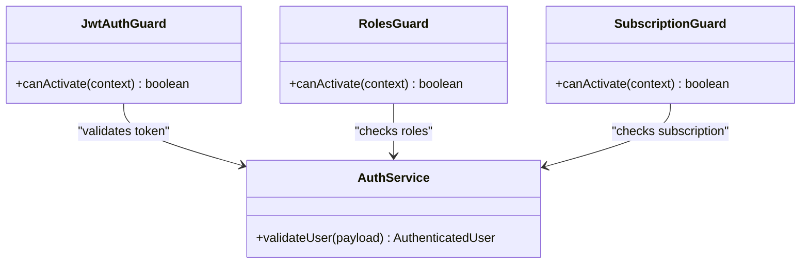
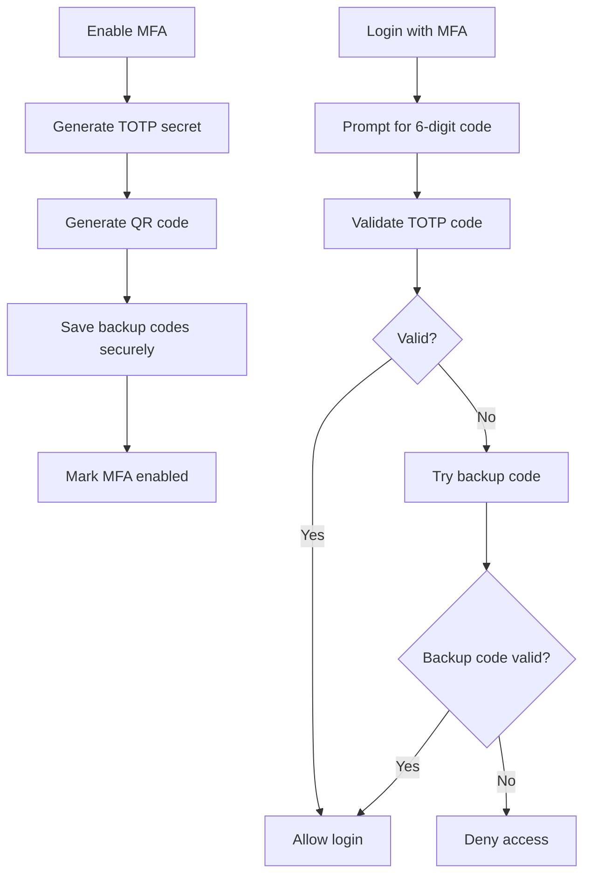
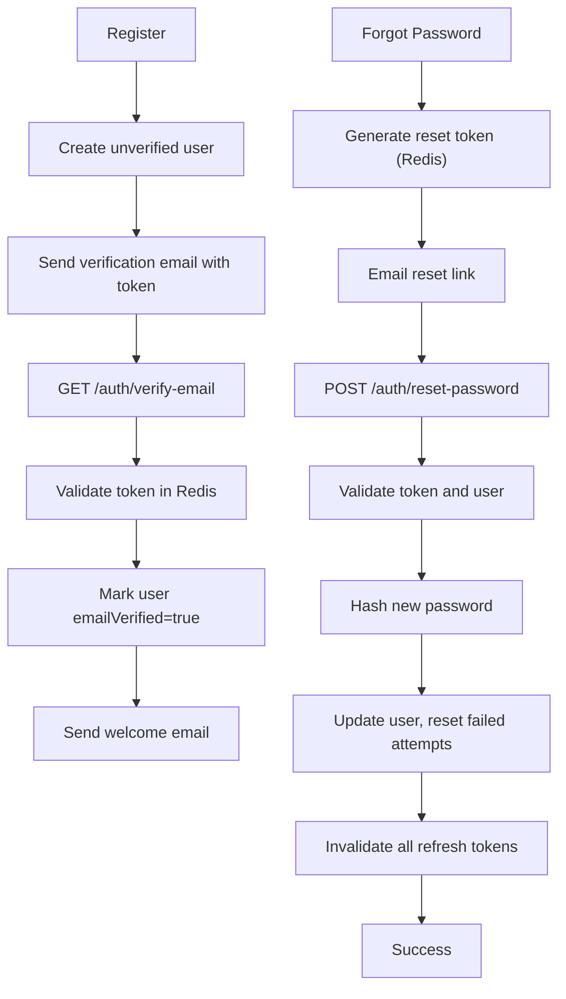
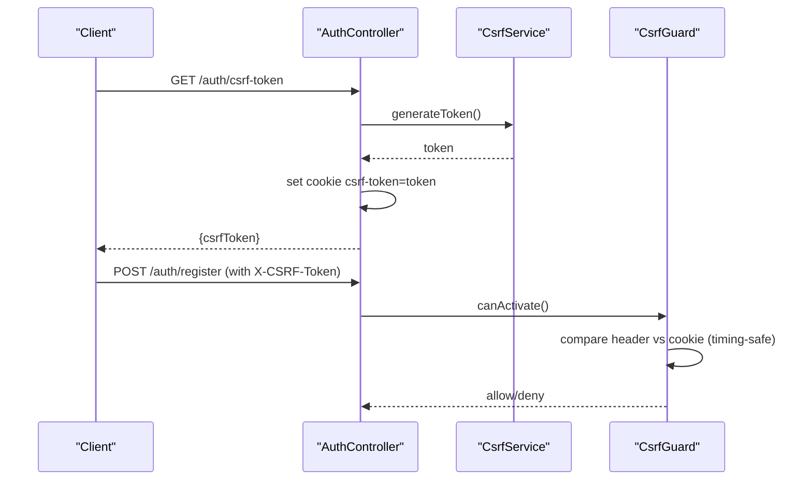
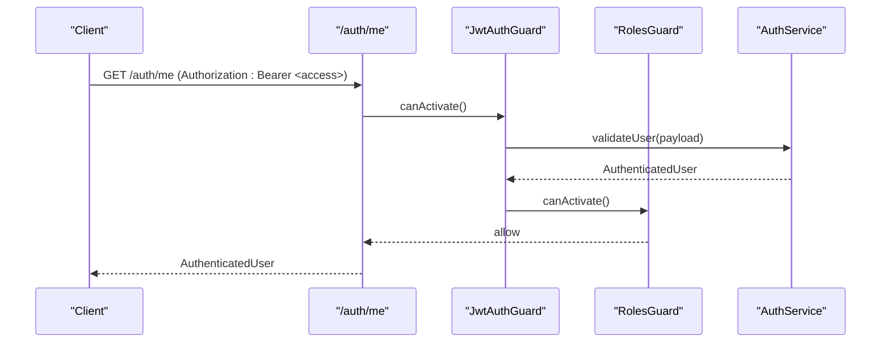
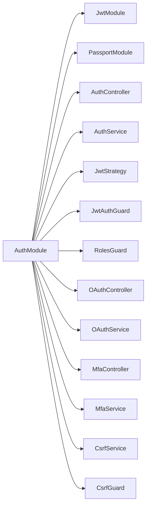

# Authentication & Authorization

<cite>
**Referenced Files in This Document**
- [auth.module.ts](file://apps/api/src/modules/auth/auth.module.ts)
- [auth.service.ts](file://apps/api/src/modules/auth/auth.service.ts)
- [auth.controller.ts](file://apps/api/src/modules/auth/auth.controller.ts)
- [csrf.guard.ts](file://apps/api/src/common/guards/csrf.guard.ts)
- [index.ts](file://apps/api/src/common/guards/index.ts)
- [oauth.controller.ts](file://apps/api/src/modules/auth/oauth/oauth.controller.ts)
- [oauth.service.ts](file://apps/api/src/modules/auth/oauth/oauth.service.ts)
- [jwt.strategy.ts](file://apps/api/src/modules/auth/strategies/jwt.strategy.ts)
- [jwt-auth.guard.ts](file://apps/api/src/modules/auth/guards/jwt-auth.guard.ts)
- [roles.guard.ts](file://apps/api/src/modules/auth/guards/roles.guard.ts)
- [mfa.service.ts](file://apps/api/src/modules/auth/mfa/mfa.service.ts)
- [mfa.controller.ts](file://apps/api/src/modules/auth/mfa/mfa.controller.ts)
- [mfa.dto.ts](file://apps/api/src/modules/auth/mfa/mfa.dto.ts)
- [subscription.guard.ts](file://apps/api/src/common/guards/subscription.guard.ts)
- [configuration.ts](file://apps/api/src/config/configuration.ts)
- [app.module.ts](file://apps/api/src/app.module.ts)
- [main.ts](file://apps/api/src/main.ts)
- [security-config.md](file://security/config/security-config.md)
- [security-policy.md](file://security/policies/security-policy.md)
- [threat-model.md](file://docs/security/threat-model.md)
- [incident-response-runbook.md](file://docs/security/incident-response-runbook.md)
- [auth-e2e-test.ps1](file://test/auth-e2e-test.ps1)
</cite>

## Table of Contents
1. [Introduction](#introduction)
2. [Project Structure](#project-structure)
3. [Core Components](#core-components)
4. [Architecture Overview](#architecture-overview)
5. [Detailed Component Analysis](#detailed-component-analysis)
6. [Dependency Analysis](#dependency-analysis)
7. [Performance Considerations](#performance-considerations)
8. [Troubleshooting Guide](#troubleshooting-guide)
9. [Conclusion](#conclusion)
10. [Appendices](#appendices)

## Introduction
This document provides comprehensive authentication and authorization documentation for Quiz-to-Build. It covers the OAuth2 integration with Google, GitHub, and Microsoft, JWT-based authentication with refresh token rotation, role-based access control (RBAC), CSRF protection, rate limiting, session management, security headers, CORS configuration, secure cookie handling, and multi-factor authentication (MFA). It also outlines password reset workflows, email verification processes, and integration patterns with external identity providers.

## Project Structure
The authentication subsystem is organized under the NestJS AuthModule with clear separation of concerns:
- AuthModule orchestrates JWT, Passport, guards, OAuth, and MFA services.
- AuthController exposes endpoints for registration, login, token refresh/logout, profile retrieval, email verification, password reset, and CSRF token generation.
- AuthService encapsulates business logic for JWT signing, refresh token storage, user validation, email verification, password reset, and token invalidation.
- Guards implement CSRF protection, JWT validation, RBAC, and subscription checks.
- OAuth and MFA modules integrate external identity providers and two-factor authentication flows.

**Diagram sources**
- [auth.module.ts:17-51](file://apps/api/src/modules/auth/auth.module.ts#L17-L51)
- [auth.controller.ts:32-171](file://apps/api/src/modules/auth/auth.controller.ts#L32-L171)
- [auth.service.ts:38-507](file://apps/api/src/modules/auth/auth.service.ts#L38-L507)
- [csrf.guard.ts:48-242](file://apps/api/src/common/guards/csrf.guard.ts#L48-L242)
- [subscription.guard.ts](file://apps/api/src/common/guards/subscription.guard.ts)
- [app.module.ts](file://apps/api/src/app.module.ts)
- [main.ts](file://apps/api/src/main.ts)
- [configuration.ts](file://apps/api/src/config/configuration.ts)

**Section sources**
- [auth.module.ts:1-53](file://apps/api/src/modules/auth/auth.module.ts#L1-L53)
- [auth.controller.ts:1-171](file://apps/api/src/modules/auth/auth.controller.ts#L1-L171)
- [auth.service.ts:1-507](file://apps/api/src/modules/auth/auth.service.ts#L1-L507)
- [csrf.guard.ts:1-242](file://apps/api/src/common/guards/csrf.guard.ts#L1-L242)
- [subscription.guard.ts](file://apps/api/src/common/guards/subscription.guard.ts)
- [app.module.ts](file://apps/api/src/app.module.ts)
- [main.ts](file://apps/api/src/main.ts)
- [configuration.ts](file://apps/api/src/config/configuration.ts)

## Core Components
- JWT-based authentication with access and refresh tokens:
  - Access tokens are short-lived and signed by the server.
  - Refresh tokens are long-lived, stored in Redis with TTL, and audited in the database.
- OAuth2 integration:
  - External provider callbacks and user profile management are handled by OAuthService/OAuthController.
  - Provider-specific flows (Google, GitHub, Microsoft) are integrated via OAuth adapters.
- Role-based access control (RBAC):
  - RolesGuard enforces role-based permissions.
  - JwtAuthGuard validates JWT tokens and extracts user claims.
- CSRF protection:
  - Double submit cookie pattern using CsrfGuard and CsrfService.
- Rate limiting:
  - Built-in throttling decorators on sensitive endpoints.
- Session management:
  - Stateless JWT access tokens; refresh tokens managed server-side in Redis.
- Security headers and CORS:
  - Security policy and configuration define headers and CORS behavior.
- MFA:
  - MfaService and MfaController implement TOTP and backup codes.

**Section sources**
- [auth.service.ts:211-247](file://apps/api/src/modules/auth/auth.service.ts#L211-L247)
- [auth.service.ts:147-183](file://apps/api/src/modules/auth/auth.service.ts#L147-L183)
- [auth.controller.ts:38-136](file://apps/api/src/modules/auth/auth.controller.ts#L38-L136)
- [csrf.guard.ts:48-148](file://apps/api/src/common/guards/csrf.guard.ts#L48-L148)
- [roles.guard.ts](file://apps/api/src/modules/auth/guards/roles.guard.ts)
- [jwt-auth.guard.ts](file://apps/api/src/modules/auth/guards/jwt-auth.guard.ts)
- [mfa.service.ts](file://apps/api/src/modules/auth/mfa/mfa.service.ts)
- [mfa.controller.ts](file://apps/api/src/modules/auth/mfa/mfa.controller.ts)

## Architecture Overview
The authentication architecture combines local credentials with federated identity and MFA. The flow below illustrates the typical login and token refresh process, including CSRF protection and RBAC enforcement.

**Diagram sources**
- [auth.controller.ts:104-107](file://apps/api/src/modules/auth/auth.controller.ts#L104-L107)
- [auth.service.ts:147-183](file://apps/api/src/modules/auth/auth.service.ts#L147-L183)
- [auth.service.ts:211-247](file://apps/api/src/modules/auth/auth.service.ts#L211-L247)

## Detailed Component Analysis

### JWT-Based Authentication and Refresh Token Rotation
- Access token payload includes subject, email, and role.
- Refresh tokens are UUID-based, stored in Redis with TTL, and recorded in the database for audit.
- Token refresh validates the stored refresh token and issues a new access token.
- Logout revokes the refresh token by deleting it from Redis.

**Diagram sources**
- [auth.service.ts:104-145](file://apps/api/src/modules/auth/auth.service.ts#L104-L145)
- [auth.service.ts:147-183](file://apps/api/src/modules/auth/auth.service.ts#L147-L183)
- [auth.service.ts:211-247](file://apps/api/src/modules/auth/auth.service.ts#L211-L247)

**Section sources**
- [auth.service.ts:211-247](file://apps/api/src/modules/auth/auth.service.ts#L211-L247)
- [auth.service.ts:147-183](file://apps/api/src/modules/auth/auth.service.ts#L147-L183)
- [auth.controller.ts:59-81](file://apps/api/src/modules/auth/auth.controller.ts#L59-L81)

### OAuth2 Integration with External Providers
- OAuthController handles provider callbacks and delegates user creation/profile updates to OAuthService.
- OAuthService manages token exchange, user profile retrieval, and mapping to internal user records.
- Providers supported include Google, GitHub, and Microsoft via adapter patterns.

**Diagram sources**
- [oauth.controller.ts](file://apps/api/src/modules/auth/oauth/oauth.controller.ts)
- [oauth.service.ts](file://apps/api/src/modules/auth/oauth/oauth.service.ts)

**Section sources**
- [oauth.controller.ts](file://apps/api/src/modules/auth/oauth/oauth.controller.ts)
- [oauth.service.ts](file://apps/api/src/modules/auth/oauth/oauth.service.ts)

### Role-Based Access Control (RBAC) and Guards
- JwtAuthGuard validates JWT tokens and extracts user claims.
- RolesGuard enforces role-based permissions for protected routes.
- SubscriptionGuard provides tier-based access controls for paid features.

**Diagram sources**
- [jwt-auth.guard.ts](file://apps/api/src/modules/auth/guards/jwt-auth.guard.ts)
- [roles.guard.ts](file://apps/api/src/modules/auth/guards/roles.guard.ts)
- [subscription.guard.ts](file://apps/api/src/common/guards/subscription.guard.ts)
- [auth.service.ts:185-209](file://apps/api/src/modules/auth/auth.service.ts#L185-L209)

**Section sources**
- [jwt-auth.guard.ts](file://apps/api/src/modules/auth/guards/jwt-auth.guard.ts)
- [roles.guard.ts](file://apps/api/src/modules/auth/guards/roles.guard.ts)
- [subscription.guard.ts](file://apps/api/src/common/guards/subscription.guard.ts)
- [auth.service.ts:185-209](file://apps/api/src/modules/auth/auth.service.ts#L185-L209)

### Multi-Factor Authentication (MFA)
- MfaService generates TOTP secrets, validates codes, and manages backup codes.
- MfaController exposes endpoints to enable/disable MFA and verify codes.
- Backup codes are securely stored and validated during login.

**Diagram sources**
- [mfa.service.ts](file://apps/api/src/modules/auth/mfa/mfa.service.ts)
- [mfa.controller.ts](file://apps/api/src/modules/auth/mfa/mfa.controller.ts)
- [mfa.dto.ts](file://apps/api/src/modules/auth/mfa/mfa.dto.ts)

**Section sources**
- [mfa.service.ts](file://apps/api/src/modules/auth/mfa/mfa.service.ts)
- [mfa.controller.ts](file://apps/api/src/modules/auth/mfa/mfa.controller.ts)
- [mfa.dto.ts](file://apps/api/src/modules/auth/mfa/mfa.dto.ts)

### Email Verification and Password Reset Workflows
- Email verification:
  - On registration, a verification token is generated and stored in Redis with expiry.
  - Verification endpoint validates the token, marks the user as verified, and sends a welcome email.
- Password reset:
  - Reset token is generated, stored in Redis, and emailed to the user.
  - Reset endpoint validates the token, updates the password, resets failed attempts, and invalidates all refresh tokens for the user.

**Diagram sources**
- [auth.service.ts:298-358](file://apps/api/src/modules/auth/auth.service.ts#L298-L358)
- [auth.service.ts:390-466](file://apps/api/src/modules/auth/auth.service.ts#L390-L466)

**Section sources**
- [auth.service.ts:298-358](file://apps/api/src/modules/auth/auth.service.ts#L298-L358)
- [auth.service.ts:390-466](file://apps/api/src/modules/auth/auth.service.ts#L390-L466)
- [auth.controller.ts:95-136](file://apps/api/src/modules/auth/auth.controller.ts#L95-L136)

### CSRF Protection and Secure Cookies
- Double submit cookie pattern:
  - Server sets a CSRF token cookie and requires the same value in the X-CSRF-Token header for state-changing requests.
  - Tokens are validated using constant-time comparison to prevent timing attacks.
- Cookie configuration:
  - HttpOnly: false (so JavaScript can read it), SameSite: strict, secure in production, configurable maxAge.

**Diagram sources**
- [auth.controller.ts:140-169](file://apps/api/src/modules/auth/auth.controller.ts#L140-L169)
- [csrf.guard.ts:48-148](file://apps/api/src/common/guards/csrf.guard.ts#L48-L148)
- [csrf.guard.ts:196-242](file://apps/api/src/common/guards/csrf.guard.ts#L196-L242)

**Section sources**
- [csrf.guard.ts:48-148](file://apps/api/src/common/guards/csrf.guard.ts#L48-L148)
- [csrf.guard.ts:196-242](file://apps/api/src/common/guards/csrf.guard.ts#L196-L242)
- [auth.controller.ts:140-169](file://apps/api/src/modules/auth/auth.controller.ts#L140-L169)

### Protected Routes and Authentication Guards
- Example protected route:
  - GET /auth/me guarded by JwtAuthGuard and returns the current user profile.
- Role decorators and guards:
  - Combine JwtAuthGuard with RolesGuard to enforce role-based access.
  - SubscriptionGuard can be layered for premium features.

**Diagram sources**
- [auth.controller.ts:83-91](file://apps/api/src/modules/auth/auth.controller.ts#L83-L91)
- [jwt-auth.guard.ts](file://apps/api/src/modules/auth/guards/jwt-auth.guard.ts)
- [roles.guard.ts](file://apps/api/src/modules/auth/guards/roles.guard.ts)
- [auth.service.ts:185-209](file://apps/api/src/modules/auth/auth.service.ts#L185-L209)

**Section sources**
- [auth.controller.ts:83-91](file://apps/api/src/modules/auth/auth.controller.ts#L83-L91)
- [jwt-auth.guard.ts](file://apps/api/src/modules/auth/guards/jwt-auth.guard.ts)
- [roles.guard.ts](file://apps/api/src/modules/auth/guards/roles.guard.ts)
- [auth.service.ts:185-209](file://apps/api/src/modules/auth/auth.service.ts#L185-L209)

## Dependency Analysis
The AuthModule composes multiple services and guards, with clear import/export boundaries. External dependencies include Redis for refresh token storage and Prisma for user and token persistence.

**Diagram sources**
- [auth.module.ts:17-51](file://apps/api/src/modules/auth/auth.module.ts#L17-L51)

**Section sources**
- [auth.module.ts:17-51](file://apps/api/src/modules/auth/auth.module.ts#L17-L51)

## Performance Considerations
- Redis-backed refresh tokens minimize database load for token refresh operations.
- Bcrypt cost factor is configurable; adjust for acceptable login latency vs. security.
- Rate limiting on sensitive endpoints prevents brute force attacks.
- JWT payload kept minimal to reduce token size and parsing overhead.

## Troubleshooting Guide
- Invalid or expired refresh token:
  - Symptom: Unauthorized on refresh endpoint.
  - Cause: Token not found in Redis or user deleted.
  - Action: Require user to log in again to obtain new tokens.
- CSRF validation failures:
  - Symptom: 403 Forbidden with CSRF token errors.
  - Causes: Missing header/cookie, mismatched values, invalid token format.
  - Action: Ensure client reads cookie and sends matching X-CSRF-Token header; regenerate token via /auth/csrf-token.
- Account locked due to failed login attempts:
  - Symptom: Unauthorized with lock message.
  - Cause: Exceeded max failed attempts.
  - Action: Wait for lock duration or reset password.
- Password reset token invalid/expired:
  - Symptom: Bad request on reset.
  - Action: Initiate password reset again; ensure token freshness.
- Email verification token invalid/expired:
  - Symptom: Bad request on verify.
  - Action: Resend verification email.

**Section sources**
- [auth.service.ts:147-183](file://apps/api/src/modules/auth/auth.service.ts#L147-L183)
- [csrf.guard.ts:99-145](file://apps/api/src/common/guards/csrf.guard.ts#L99-L145)
- [auth.service.ts:298-358](file://apps/api/src/modules/auth/auth.service.ts#L298-L358)
- [auth.service.ts:423-466](file://apps/api/src/modules/auth/auth.service.ts#L423-L466)

## Conclusion
Quiz-to-Build implements a robust, layered authentication and authorization system combining JWT-based stateless access tokens, Redis-backed refresh tokens, OAuth2 federation, RBAC, MFA, CSRF protection, and rate limiting. The modular design ensures maintainability and extensibility while adhering to security best practices.

## Appendices

### Security Headers, CORS, and Cookie Handling
- Security headers and CORS policies are defined in the security configuration and policy documents.
- Cookie attributes (HttpOnly, secure, SameSite) are configured via CsrfService based on environment.

**Section sources**
- [security-config.md](file://security/config/security-config.md)
- [security-policy.md](file://security/policies/security-policy.md)
- [csrf.guard.ts:224-240](file://apps/api/src/common/guards/csrf.guard.ts#L224-L240)

### Configuration Reference
- JWT secret and expiry, refresh token TTL, bcrypt rounds, and token expiries are loaded from configuration.
- CSRF secret enforced in production; otherwise defaults are provided for development.

**Section sources**
- [configuration.ts](file://apps/api/src/config/configuration.ts)
- [auth.module.ts:20-29](file://apps/api/src/modules/auth/auth.module.ts#L20-L29)
- [csrf.guard.ts:56-64](file://apps/api/src/common/guards/csrf.guard.ts#L56-L64)

### Testing and Validation
- End-to-end tests validate authentication flows and security measures.
- Security scan scripts and CI pipelines ensure ongoing compliance.

**Section sources**
- [auth-e2e-test.ps1](file://test/auth-e2e-test.ps1)
- [threat-model.md](file://docs/security/threat-model.md)
- [incident-response-runbook.md](file://docs/security/incident-response-runbook.md)