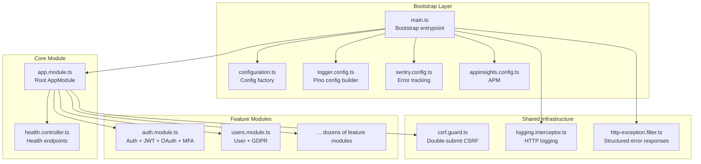
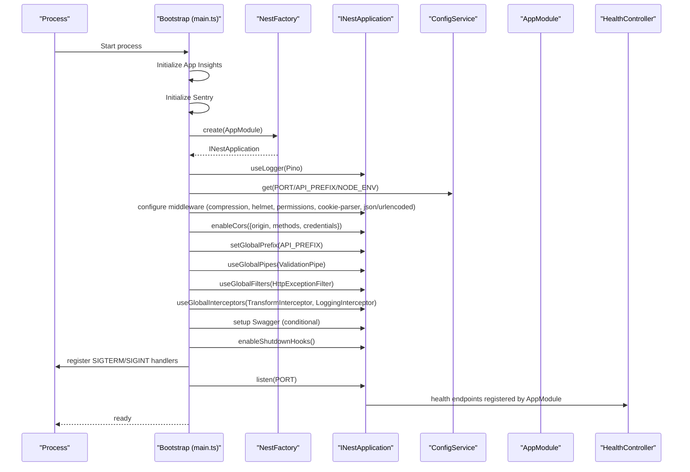
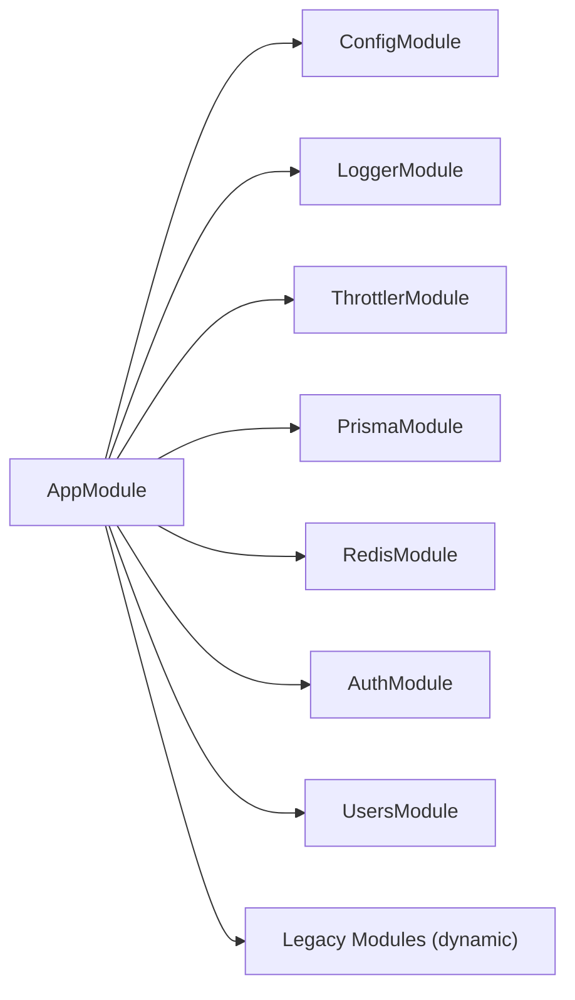
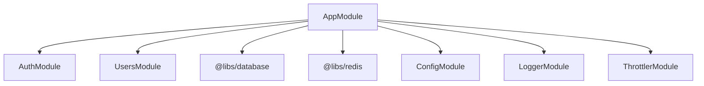

# Application Structure

<cite>
**Referenced Files in This Document**
- [main.ts](file://apps/api/src/main.ts)
- [app.module.ts](file://apps/api/src/app.module.ts)
- [configuration.ts](file://apps/api/src/config/configuration.ts)
- [logger.config.ts](file://apps/api/src/config/logger.config.ts)
- [sentry.config.ts](file://apps/api/src/config/sentry.config.ts)
- [appinsights.config.ts](file://apps/api/src/config/appinsights.config.ts)
- [feature-flags.config.ts](file://apps/api/src/config/feature-flags.config.ts)
- [auth.module.ts](file://apps/api/src/modules/auth/auth.module.ts)
- [auth.service.ts](file://apps/api/src/modules/auth/auth.service.ts)
- [users.module.ts](file://apps/api/src/modules/users/users.module.ts)
- [csrf.guard.ts](file://apps/api/src/common/guards/csrf.guard.ts)
- [logging.interceptor.ts](file://apps/api/src/common/interceptors/logging.interceptor.ts)
- [http-exception.filter.ts](file://apps/api/src/common/filters/http-exception.filter.ts)
- [health.controller.ts](file://apps/api/src/health.controller.ts)
</cite>

## Table of Contents
1. [Introduction](#introduction)
2. [Project Structure](#project-structure)
3. [Core Components](#core-components)
4. [Architecture Overview](#architecture-overview)
5. [Detailed Component Analysis](#detailed-component-analysis)
6. [Dependency Analysis](#dependency-analysis)
7. [Performance Considerations](#performance-considerations)
8. [Troubleshooting Guide](#troubleshooting-guide)
9. [Conclusion](#conclusion)

## Introduction
This document explains the NestJS application structure and initialization for the Quiz2Biz API. It covers the bootstrap process, module composition strategy, dependency injection configuration, environment variable management, dynamic module loading for feature flags, and the application lifecycle including graceful shutdown and error handling. It also provides guidance on integrating new modules into the existing structure.

## Project Structure
The API application follows a layered, feature-based organization under apps/api/src. The root module composes feature modules and shared infrastructure. The bootstrap process initializes observability, configuration, middleware, guards, pipes, interceptors, and health endpoints before listening on the configured port.

**Diagram sources**
- [main.ts:28-329](file://apps/api/src/main.ts#L28-L329)
- [app.module.ts:53-129](file://apps/api/src/app.module.ts#L53-L129)
- [configuration.ts:87-115](file://apps/api/src/config/configuration.ts#L87-L115)
- [logger.config.ts:9-62](file://apps/api/src/config/logger.config.ts#L9-L62)
- [sentry.config.ts:51-127](file://apps/api/src/config/sentry.config.ts#L51-L127)
- [appinsights.config.ts:65-117](file://apps/api/src/config/appinsights.config.ts#L65-L117)
- [health.controller.ts:52-205](file://apps/api/src/health.controller.ts#L52-L205)
- [auth.module.ts:17-52](file://apps/api/src/modules/auth/auth.module.ts#L17-L52)
- [users.module.ts:7-12](file://apps/api/src/modules/users/users.module.ts#L7-L12)
- [csrf.guard.ts:48-148](file://apps/api/src/common/guards/csrf.guard.ts#L48-L148)
- [logging.interceptor.ts:10-56](file://apps/api/src/common/interceptors/logging.interceptor.ts#L10-L56)
- [http-exception.filter.ts:22-102](file://apps/api/src/common/filters/http-exception.filter.ts#L22-L102)

**Section sources**
- [main.ts:28-329](file://apps/api/src/main.ts#L28-L329)
- [app.module.ts:53-129](file://apps/api/src/app.module.ts#L53-L129)

## Core Components
- Bootstrap entrypoint: Initializes Application Insights and Sentry early, creates the Nest application, configures middleware, guards, pipes, interceptors, and health endpoints, then starts listening.
- Root module: Composes configuration, logging, throttling, database, cache, and all feature modules. Registers global guards and providers.
- Configuration factory: Centralizes environment validation and default values for runtime configuration.
- Shared infrastructure: CSRF guard, logging interceptor, and exception filter provide cross-cutting concerns.

**Section sources**
- [main.ts:28-329](file://apps/api/src/main.ts#L28-L329)
- [app.module.ts:53-129](file://apps/api/src/app.module.ts#L53-L129)
- [configuration.ts:87-115](file://apps/api/src/config/configuration.ts#L87-L115)
- [csrf.guard.ts:48-148](file://apps/api/src/common/guards/csrf.guard.ts#L48-L148)
- [logging.interceptor.ts:10-56](file://apps/api/src/common/interceptors/logging.interceptor.ts#L10-L56)
- [http-exception.filter.ts:22-102](file://apps/api/src/common/filters/http-exception.filter.ts#L22-L102)

## Architecture Overview
The application follows a modular architecture with a single root module orchestrating feature modules. Dependency injection resolves services across modules, while configuration drives runtime behavior. Observability is integrated early to capture telemetry and errors.

**Diagram sources**
- [main.ts:28-329](file://apps/api/src/main.ts#L28-L329)
- [app.module.ts:53-129](file://apps/api/src/app.module.ts#L53-L129)
- [health.controller.ts:52-205](file://apps/api/src/health.controller.ts#L52-L205)

## Detailed Component Analysis

### Bootstrap and Initialization (main.ts)
- Early initialization order: Application Insights, then Sentry, then Nest application creation.
- Logger: Uses Pino via nestjs-pino with correlation IDs and redaction.
- Configuration-driven setup: Reads PORT, API_PREFIX, NODE_ENV, CORS_ORIGIN, ENABLE_SWAGGER.
- Security middleware: Helmet CSP, HSTS in production, Permissions-Policy, cookie parsing.
- Body limits: JSON and URL-encoded payloads limited to 1 MB.
- CORS: Origin parsing and credential handling based on environment.
- Global middleware: Compression (with streaming exclusion), request tracking, validation pipe, exception filter, interceptors.
- Swagger: Conditional documentation with bearer auth and tags.
- Shutdown hooks: SIGTERM/SIGINT flush Application Insights telemetry.

**Section sources**
- [main.ts:28-329](file://apps/api/src/main.ts#L28-L329)

### Root Module Composition (app.module.ts)
- Configuration module: Loads configuration factory and environment files.
- Logging: Pino configuration built from ConfigService.
- Throttling: Global rate limiter with named windows.
- Infrastructure: Database (Prisma) and cache (Redis) modules.
- Feature modules: Auth, Users, Questionnaire, Session, Adaptive Logic, Standards, Admin, Document Generator, Scoring Engine, Heatmap, Notifications, Payment, Adapters, Idea Capture, AI Gateway, Chat Engine, Fact Extraction, Quality Scoring, Projects.
- Legacy modules: Dynamically loaded behind ENABLE_LEGACY_MODULES environment flag.
- Global providers: ThrottlerGuard and CSRF guard registered at application level.

**Section sources**
- [app.module.ts:53-129](file://apps/api/src/app.module.ts#L53-L129)

### Configuration Loading and Environment Management (configuration.ts)
- Production hardening: Validates JWT secrets and CORS_ORIGIN presence.
- Builds typed configuration objects for database, Redis, JWT, bcrypt, throttle, email, Claude, tokens, and frontend URL.
- Centralizes defaults and environment overrides.

**Section sources**
- [configuration.ts:5-115](file://apps/api/src/config/configuration.ts#L5-L115)

### Logger Configuration (logger.config.ts)
- Selects pretty printing in development, JSON in production.
- Generates correlation IDs from X-Request-Id or UUID.
- Redacts sensitive headers and cookies.
- Serializers for request/response shapes.

**Section sources**
- [logger.config.ts:9-62](file://apps/api/src/config/logger.config.ts#L9-L62)

### Error Tracking (sentry.config.ts)
- Initializes Sentry with DSN, environment, release, tracing, and profiling.
- Filters sensitive headers and breadcrumbs.
- Ignores benign network errors and health endpoints.
- Exposes helpers to capture exceptions, messages, set user context, add breadcrumbs, and start transactions.

**Section sources**
- [sentry.config.ts:51-127](file://apps/api/src/config/sentry.config.ts#L51-L127)

### Application Performance Monitoring (appinsights.config.ts)
- Initializes Application Insights with connection string or instrumentation key.
- Sets cloud role and instance, sampling percentage, and auto-collection.
- Provides helpers to track metrics, events, dependencies, exceptions, and performance counters.
- Includes request tracking middleware and graceful shutdown flush.

**Section sources**
- [appinsights.config.ts:65-117](file://apps/api/src/config/appinsights.config.ts#L65-L117)

### Feature Flags and A/B Testing (feature-flags.config.ts)
- Defines types for feature flags and A/B tests.
- Provides default flag configurations with targeting rules and rollouts.
- Implements a FeatureFlagService with local evaluation and placeholders for LaunchDarkly integration.
- Includes flag evaluation context and event tracking helpers.

**Section sources**
- [feature-flags.config.ts:198-800](file://apps/api/src/config/feature-flags.config.ts#L198-L800)

### Authentication Module (auth.module.ts)
- Passport default strategy set to JWT.
- JWT module configured via ConfigService for secret and expiration.
- Providers include AuthService, strategies, guards, OAuth/MFA services, and CSRF services/guard.

**Section sources**
- [auth.module.ts:17-52](file://apps/api/src/modules/auth/auth.module.ts#L17-L52)

### Authentication Service (auth.service.ts)
- Handles user registration, login, token generation/refresh/logout.
- Integrates with Prisma, Redis, and NotificationService.
- Manages password hashing, failed login attempts, and token lifetimes.

**Section sources**
- [auth.service.ts:37-507](file://apps/api/src/modules/auth/auth.service.ts#L37-L507)

### Users Module (users.module.ts)
- Exports UsersService for downstream modules.

**Section sources**
- [users.module.ts:7-12](file://apps/api/src/modules/users/users.module.ts#L7-L12)

### CSRF Guard (csrf.guard.ts)
- Implements Double Submit Cookie pattern with constant-time token comparison.
- Enforces CSRF except for safe methods and decorated routes.
- Validates token format and integrity.

**Section sources**
- [csrf.guard.ts:48-148](file://apps/api/src/common/guards/csrf.guard.ts#L48-L148)

### Logging Interceptor (logging.interceptor.ts)
- Structured HTTP logging with correlation IDs, duration, and user agent.

**Section sources**
- [logging.interceptor.ts:10-56](file://apps/api/src/common/interceptors/logging.interceptor.ts#L10-L56)

### Exception Filter (http-exception.filter.ts)
- Produces standardized error responses with codes, timestamps, and request IDs.
- Logs unhandled errors with stack traces.

**Section sources**
- [http-exception.filter.ts:22-102](file://apps/api/src/common/filters/http-exception.filter.ts#L22-L102)

### Health Controller (health.controller.ts)
- Comprehensive health checks: database, Redis, AI gateway, memory, disk.
- Kubernetes probes: live, ready, startup.
- Returns 503 when unhealthy.

**Section sources**
- [health.controller.ts:52-205](file://apps/api/src/health.controller.ts#L52-L205)

### Module Import Hierarchy and Dynamic Loading
- AppModule imports core infrastructure and all feature modules.
- Legacy modules are conditionally included via ENABLE_LEGACY_MODULES environment variable.
- Feature flags can guide module inclusion or behavior at runtime.

**Diagram sources**
- [app.module.ts:53-129](file://apps/api/src/app.module.ts#L53-L129)

**Section sources**
- [app.module.ts:36-51](file://apps/api/src/app.module.ts#L36-L51)

### Dependency Injection Configuration
- Global providers: APP_GUARD bound to ThrottlerGuard and CSRF guard.
- Module-scoped providers: Services, strategies, and guards declared in feature modules.
- Config-driven providers: JWT module registers with values from ConfigService.

**Section sources**
- [app.module.ts:118-127](file://apps/api/src/app.module.ts#L118-L127)
- [auth.module.ts:20-29](file://apps/api/src/modules/auth/auth.module.ts#L20-L29)

### Application Lifecycle and Graceful Shutdown
- Bootstrap enables shutdown hooks and registers SIGTERM/SIGINT handlers.
- On signal, Application Insights telemetry is flushed before process exit.
- Health endpoints support Kubernetes-style probes.

**Section sources**
- [main.ts:300-317](file://apps/api/src/main.ts#L300-L317)
- [health.controller.ts:147-234](file://apps/api/src/health.controller.ts#L147-L234)
- [appinsights.config.ts:547-554](file://apps/api/src/config/appinsights.config.ts#L547-L554)

### Error Handling During Bootstrapping
- Bootstrap wraps initialization in a try/catch block.
- Logs fatal errors and captures them in Sentry.
- Exits with non-zero status on failure.

**Section sources**
- [main.ts:319-328](file://apps/api/src/main.ts#L319-L328)
- [sentry.config.ts:132-136](file://apps/api/src/config/sentry.config.ts#L132-L136)

### Examples of Module Registration Patterns
- Static import: Standard feature modules added to AppModule imports.
- Dynamic import: Legacy modules conditionally imported based on environment variable.
- Async provider: JWT module configured via useFactory with ConfigService injection.
- Global guard/provider: Registered at AppModule level via APP_GUARD injection token.

**Section sources**
- [app.module.ts:36-51](file://apps/api/src/app.module.ts#L36-L51)
- [auth.module.ts:20-29](file://apps/api/src/modules/auth/auth.module.ts#L20-L29)
- [app.module.ts:118-127](file://apps/api/src/app.module.ts#L118-L127)

### Integrating a New Module
- Create a feature module with controllers/services/guards/providers.
- Export services needed by other modules.
- Register the module in AppModule imports.
- If feature-flagged, wrap import in a conditional function similar to legacy modules.
- Add any required guards/providers to the global APP_GUARD array if applicable.

**Section sources**
- [app.module.ts:93-116](file://apps/api/src/app.module.ts#L93-L116)
- [app.module.ts:118-127](file://apps/api/src/app.module.ts#L118-L127)

## Dependency Analysis
The application exhibits low coupling between feature modules through shared infrastructure and configuration. AppModule acts as the central coordinator, while individual modules encapsulate domain logic.

**Diagram sources**
- [app.module.ts:53-129](file://apps/api/src/app.module.ts#L53-L129)

**Section sources**
- [app.module.ts:53-129](file://apps/api/src/app.module.ts#L53-L129)

## Performance Considerations
- Compression excludes streaming endpoints to preserve SSE/real-time responses.
- Application Insights sampling reduces telemetry overhead in production.
- Sentry traces and profiles are configurable; adjust rates to balance insight vs. overhead.
- ValidationPipe transforms inputs and enforces whitelisting to reduce downstream processing errors.
- Health checks include memory and dependency latency signals to detect performance regressions.

[No sources needed since this section provides general guidance]

## Troubleshooting Guide
- Bootstrap failures: Check Sentry capture and logs for initialization errors; verify environment variables and DSNs.
- Health check failures: Inspect database connectivity, Redis availability, and AI gateway provider status.
- CSRF errors: Ensure client sends matching X-CSRF-Token header and csrf-token cookie for non-safe methods.
- Logging: Confirm Pino configuration and redaction settings; verify correlation IDs via X-Request-Id.
- Telemetry: Validate Application Insights connection string or instrumentation key; confirm flush on shutdown.

**Section sources**
- [main.ts:319-328](file://apps/api/src/main.ts#L319-L328)
- [health.controller.ts:240-408](file://apps/api/src/health.controller.ts#L240-L408)
- [csrf.guard.ts:66-148](file://apps/api/src/common/guards/csrf.guard.ts#L66-L148)
- [logger.config.ts:9-62](file://apps/api/src/config/logger.config.ts#L9-L62)
- [appinsights.config.ts:547-554](file://apps/api/src/config/appinsights.config.ts#L547-L554)

## Conclusion
The Quiz2Biz API employs a robust, modular NestJS architecture with early observability initialization, centralized configuration, and comprehensive cross-cutting concerns. AppModule orchestrates feature modules and global middleware, while dynamic loading and feature flags enable controlled rollouts. The bootstrap process, health endpoints, and graceful shutdown procedures ensure reliable operations across environments.