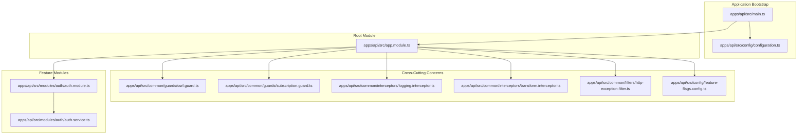
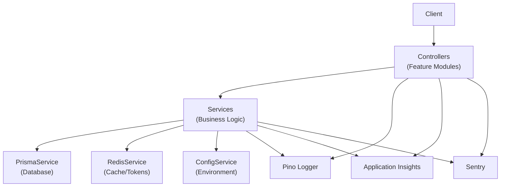
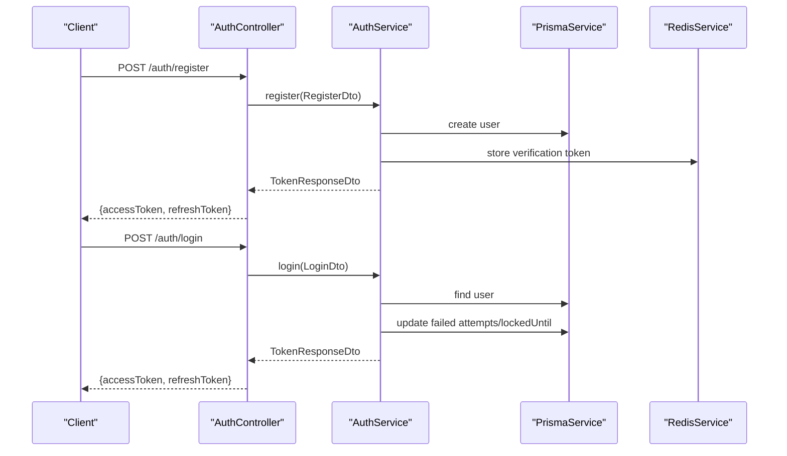
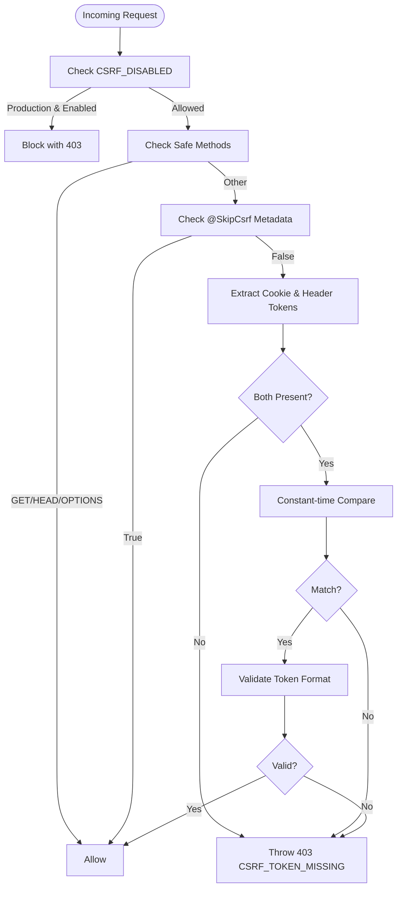
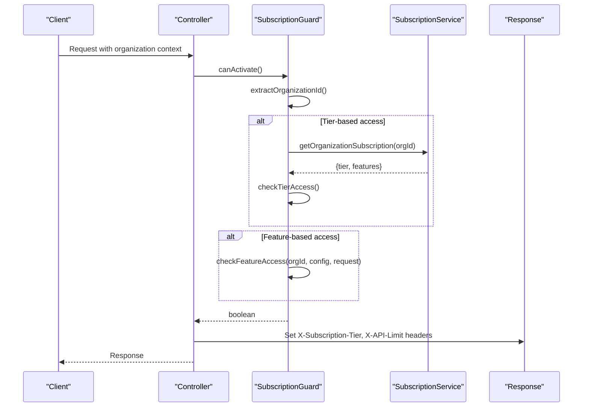
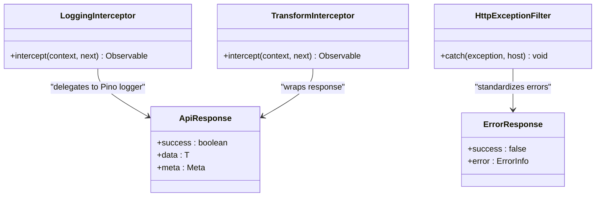
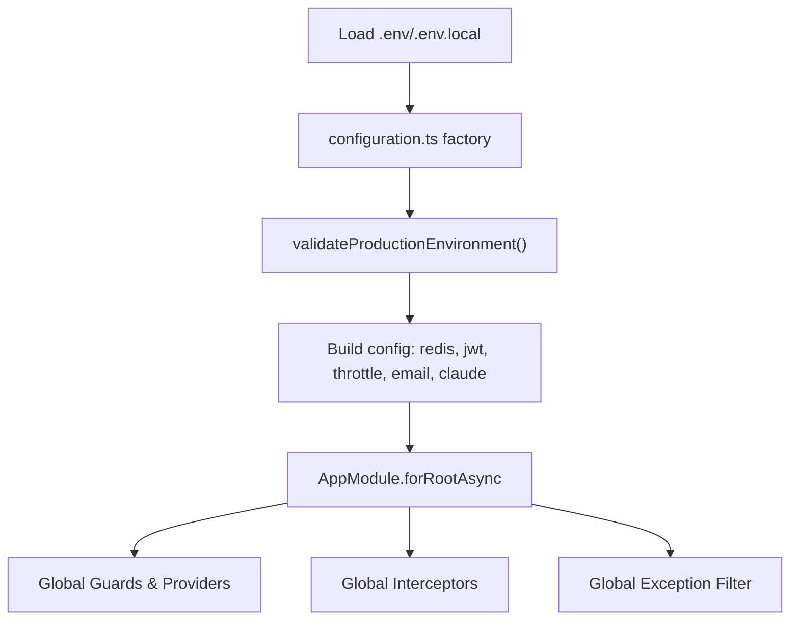
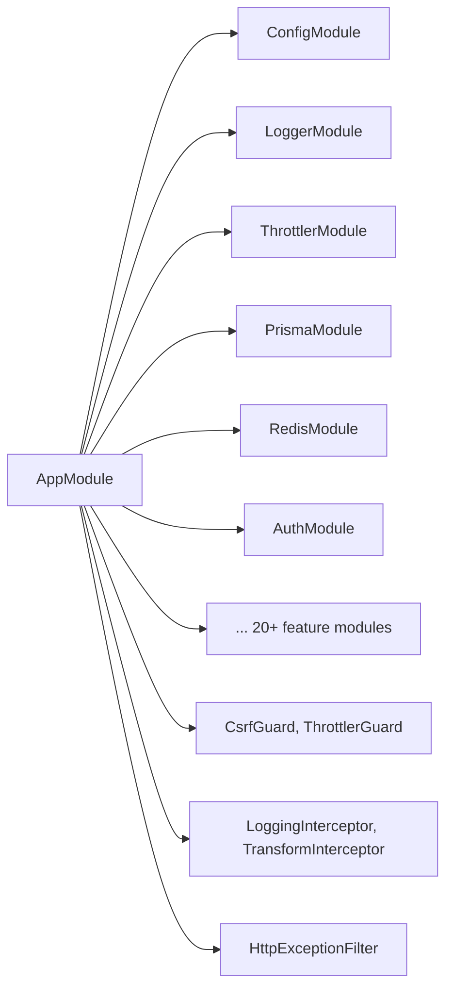

# Backend Architecture

<cite>
**Referenced Files in This Document**
- [main.ts](file://apps/api/src/main.ts)
- [app.module.ts](file://apps/api/src/app.module.ts)
- [configuration.ts](file://apps/api/src/config/configuration.ts)
- [feature-flags.config.ts](file://apps/api/src/config/feature-flags.config.ts)
- [csrf.guard.ts](file://apps/api/src/common/guards/csrf.guard.ts)
- [subscription.guard.ts](file://apps/api/src/common/guards/subscription.guard.ts)
- [logging.interceptor.ts](file://apps/api/src/common/interceptors/logging.interceptor.ts)
- [transform.interceptor.ts](file://apps/api/src/common/interceptors/transform.interceptor.ts)
- [http-exception.filter.ts](file://apps/api/src/common/filters/http-exception.filter.ts)
- [auth.module.ts](file://apps/api/src/modules/auth/auth.module.ts)
- [auth.service.ts](file://apps/api/src/modules/auth/auth.service.ts)
</cite>

## Table of Contents
1. [Introduction](#introduction)
2. [Project Structure](#project-structure)
3. [Core Components](#core-components)
4. [Architecture Overview](#architecture-overview)
5. [Detailed Component Analysis](#detailed-component-analysis)
6. [Dependency Analysis](#dependency-analysis)
7. [Performance Considerations](#performance-considerations)
8. [Troubleshooting Guide](#troubleshooting-guide)
9. [Conclusion](#conclusion)

## Introduction
This document describes the backend architecture of the NestJS-based API server for the Quiz2Biz platform. The system follows a modular monolith pattern with over twenty feature modules covering authentication, questionnaires, adaptive logic, scoring engines, document generation, payments, notifications, and administrative controls. It implements layered architecture with clear separation between presentation, business logic, and data access layers. The backend leverages NestJS dependency injection, guards, interceptors, and exception filters to enforce security, observability, and consistent error handling. Cross-cutting concerns include configuration management, environment-specific settings, feature flags, caching, logging, monitoring, and rate limiting.

## Project Structure
The API server is organized as a NestJS application with:
- A central application entry point that initializes instrumentation, middleware, configuration, and global pipes/filters/interceptors
- A root AppModule that composes feature modules and cross-cutting services
- Feature modules under modules/ for distinct business domains
- Common utilities for guards, interceptors, and filters
- Configuration modules for environment variables, feature flags, and monitoring integrations

**Diagram sources**
- [main.ts:28-329](file://apps/api/src/main.ts#L28-L329)
- [app.module.ts:53-129](file://apps/api/src/app.module.ts#L53-L129)
- [configuration.ts:87-115](file://apps/api/src/config/configuration.ts#L87-L115)
- [csrf.guard.ts:48-148](file://apps/api/src/common/guards/csrf.guard.ts#L48-L148)
- [subscription.guard.ts:58-94](file://apps/api/src/common/guards/subscription.guard.ts#L58-L94)
- [logging.interceptor.ts:11-55](file://apps/api/src/common/interceptors/logging.interceptor.ts#L11-L55)
- [transform.interceptor.ts:15-31](file://apps/api/src/common/interceptors/transform.interceptor.ts#L15-L31)
- [http-exception.filter.ts:23-82](file://apps/api/src/common/filters/http-exception.filter.ts#L23-L82)
- [feature-flags.config.ts:198-220](file://apps/api/src/config/feature-flags.config.ts#L198-L220)
- [auth.module.ts:17-52](file://apps/api/src/modules/auth/auth.module.ts#L17-L52)
- [auth.service.ts:38-62](file://apps/api/src/modules/auth/auth.service.ts#L38-L62)

**Section sources**
- [main.ts:28-329](file://apps/api/src/main.ts#L28-L329)
- [app.module.ts:53-129](file://apps/api/src/app.module.ts#L53-L129)

## Core Components
- Application bootstrap and middleware pipeline: Initializes Application Insights and Sentry, configures compression, security headers, permissions policy, CORS, request limits, global pipes, filters, and interceptors, and exposes Swagger documentation conditionally.
- Root module composition: Loads configuration, logging, throttling, database, cache, core feature modules, and optionally legacy modules behind a feature flag.
- Guards: CSRF protection with double-submit cookie pattern and subscription/feature gating with tier-based access checks.
- Interceptors: Structured HTTP logging and standardized response transformation.
- Exception filter: Centralized error handling with consistent error envelopes and request correlation.
- Configuration: Strong production validation, environment-driven settings, and feature flag defaults with LaunchDarkly integration scaffolding.
- Feature flags: Comprehensive A/B testing and feature flag configuration with targeting rules and rollout weights.

**Section sources**
- [main.ts:28-329](file://apps/api/src/main.ts#L28-L329)
- [app.module.ts:53-129](file://apps/api/src/app.module.ts#L53-L129)
- [csrf.guard.ts:48-148](file://apps/api/src/common/guards/csrf.guard.ts#L48-L148)
- [subscription.guard.ts:58-94](file://apps/api/src/common/guards/subscription.guard.ts#L58-L94)
- [logging.interceptor.ts:11-55](file://apps/api/src/common/interceptors/logging.interceptor.ts#L11-L55)
- [transform.interceptor.ts:15-31](file://apps/api/src/common/interceptors/transform.interceptor.ts#L15-L31)
- [http-exception.filter.ts:23-82](file://apps/api/src/common/filters/http-exception.filter.ts#L23-L82)
- [configuration.ts:5-43](file://apps/api/src/config/configuration.ts#L5-L43)
- [feature-flags.config.ts:198-220](file://apps/api/src/config/feature-flags.config.ts#L198-L220)

## Architecture Overview
The backend follows a layered architecture:
- Presentation Layer: Controllers in feature modules expose REST endpoints and manage request routing.
- Business Logic Layer: Services encapsulate domain logic, orchestrate workflows, and coordinate with external systems.
- Data Access Layer: Prisma service integrates with PostgreSQL; Redis service provides caching and token storage.

Cross-cutting concerns are enforced globally:
- Security: Helmet CSP, permissions policy, CSRF guard, JWT authentication, and subscription guards.
- Observability: Pino structured logging, Application Insights, Sentry, and Swagger documentation.
- Reliability: Validation pipe, exception filter, rate limiting, and graceful shutdown hooks.

**Diagram sources**
- [main.ts:35-329](file://apps/api/src/main.ts#L35-L329)
- [app.module.ts:53-129](file://apps/api/src/app.module.ts#L53-L129)
- [auth.module.ts:17-52](file://apps/api/src/modules/auth/auth.module.ts#L17-L52)
- [auth.service.ts:38-62](file://apps/api/src/modules/auth/auth.service.ts#L38-L62)

## Detailed Component Analysis

### Authentication and Authorization
The authentication subsystem provides:
- JWT-based authentication with refresh token rotation stored in Redis and audited in the database
- Password hashing with configurable bcrypt rounds
- Email verification and password reset flows with time-bound tokens in Redis
- CSRF protection via double-submit cookie pattern
- Role-based and tier-based access control integrated with subscription tiers

**Diagram sources**
- [auth.module.ts:17-52](file://apps/api/src/modules/auth/auth.module.ts#L17-L52)
- [auth.service.ts:64-145](file://apps/api/src/modules/auth/auth.service.ts#L64-L145)

**Section sources**
- [auth.module.ts:17-52](file://apps/api/src/modules/auth/auth.module.ts#L17-L52)
- [auth.service.ts:38-247](file://apps/api/src/modules/auth/auth.service.ts#L38-L247)

### CSRF Protection
The CSRF guard enforces the double-submit cookie pattern:
- Validates presence of both cookie and header tokens
- Uses constant-time comparison to prevent timing attacks
- Supports route-level skipping via decorator metadata
- Requires CSRF_SECRET in production

**Diagram sources**
- [csrf.guard.ts:66-148](file://apps/api/src/common/guards/csrf.guard.ts#L66-L148)

**Section sources**
- [csrf.guard.ts:48-148](file://apps/api/src/common/guards/csrf.guard.ts#L48-L148)

### Subscription and Feature Gating
The subscription guard enforces:
- Tier-based access using metadata decorators
- Feature-based access with usage calculation
- Global middleware for attaching subscription info and usage headers
- Rate limits per tier and feature matrices

**Diagram sources**
- [subscription.guard.ts:65-94](file://apps/api/src/common/guards/subscription.guard.ts#L65-L94)
- [subscription.guard.ts:180-215](file://apps/api/src/common/guards/subscription.guard.ts#L180-L215)

**Section sources**
- [subscription.guard.ts:58-94](file://apps/api/src/common/guards/subscription.guard.ts#L58-L94)
- [subscription.guard.ts:180-215](file://apps/api/src/common/guards/subscription.guard.ts#L180-L215)

### Interceptors and Exception Handling
- Logging interceptor: Structured HTTP logs with correlation IDs, method, URL, status, duration, IP, and user agent.
- Transform interceptor: Wraps responses in a standardized envelope with success flag, data, and optional metadata.
- Exception filter: Converts exceptions to consistent error envelopes with request correlation and error codes.

**Diagram sources**
- [logging.interceptor.ts:11-55](file://apps/api/src/common/interceptors/logging.interceptor.ts#L11-L55)
- [transform.interceptor.ts:15-31](file://apps/api/src/common/interceptors/transform.interceptor.ts#L15-L31)
- [http-exception.filter.ts:23-82](file://apps/api/src/common/filters/http-exception.filter.ts#L23-L82)

**Section sources**
- [logging.interceptor.ts:11-55](file://apps/api/src/common/interceptors/logging.interceptor.ts#L11-L55)
- [transform.interceptor.ts:15-31](file://apps/api/src/common/interceptors/transform.interceptor.ts#L15-L31)
- [http-exception.filter.ts:23-82](file://apps/api/src/common/filters/http-exception.filter.ts#L23-L82)

### Configuration Management and Feature Flags
- Environment configuration: Centralized factory validates production settings, builds Redis/JWT/throttle/email/Claude configs, and loads environment variables.
- Feature flags: Defines flag schemas, targeting rules, rollout weights, and A/B test configurations; includes LaunchDarkly integration scaffolding and local evaluation for development.

**Diagram sources**
- [configuration.ts:5-43](file://apps/api/src/config/configuration.ts#L5-L43)
- [configuration.ts:87-115](file://apps/api/src/config/configuration.ts#L87-L115)
- [app.module.ts:56-66](file://apps/api/src/app.module.ts#L56-L66)

**Section sources**
- [configuration.ts:5-43](file://apps/api/src/config/configuration.ts#L5-L43)
- [configuration.ts:87-115](file://apps/api/src/config/configuration.ts#L87-L115)
- [feature-flags.config.ts:198-220](file://apps/api/src/config/feature-flags.config.ts#L198-L220)

## Dependency Analysis
The root module composes feature modules and cross-cutting services. Guards, interceptors, and filters are registered globally, while feature modules export services consumed by others. Configuration is injected via ConfigService, and database/cache access is provided by PrismaModule and RedisModule.

**Diagram sources**
- [app.module.ts:53-129](file://apps/api/src/app.module.ts#L53-L129)

**Section sources**
- [app.module.ts:53-129](file://apps/api/src/app.module.ts#L53-L129)

## Performance Considerations
- Compression: Gzip/Brotli applied selectively to avoid interfering with Server-Sent Events and streaming AI gateway responses.
- Request limits: JSON/URL-encoded payload size limits to mitigate oversized payload attacks.
- Rate limiting: Built-in throttling with multiple windows and limits; subscription tiers define per-minute allowances.
- Caching: Redis used for refresh tokens, verification/reset tokens, and potential application-level caching.
- Streaming: Special handling in compression filter to bypass compression for streaming endpoints.

[No sources needed since this section provides general guidance]

## Troubleshooting Guide
- Bootstrap failures: Captured and reported with stack traces; Application Insights is flushed on SIGTERM/SIGINT for clean shutdown.
- Unhandled errors: Logged with structured context and returned as unified error envelopes.
- CSRF violations: Detailed 403 responses with hints for missing or mismatched tokens.
- Subscription access denials: Clear messages indicating required tier or exceeded feature limits.

**Section sources**
- [main.ts:319-328](file://apps/api/src/main.ts#L319-L328)
- [http-exception.filter.ts:51-82](file://apps/api/src/common/filters/http-exception.filter.ts#L51-L82)
- [csrf.guard.ts:104-134](file://apps/api/src/common/guards/csrf.guard.ts#L104-L134)
- [subscription.guard.ts:136-143](file://apps/api/src/common/guards/subscription.guard.ts#L136-L143)

## Conclusion
The backend employs a robust, modular monolith architecture with clear separation of concerns, comprehensive security controls, and strong operational practices. The combination of guards, interceptors, filters, configuration management, and feature flags enables scalable, maintainable growth across numerous business domains while preserving performance and reliability.