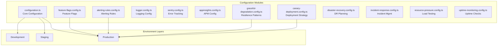
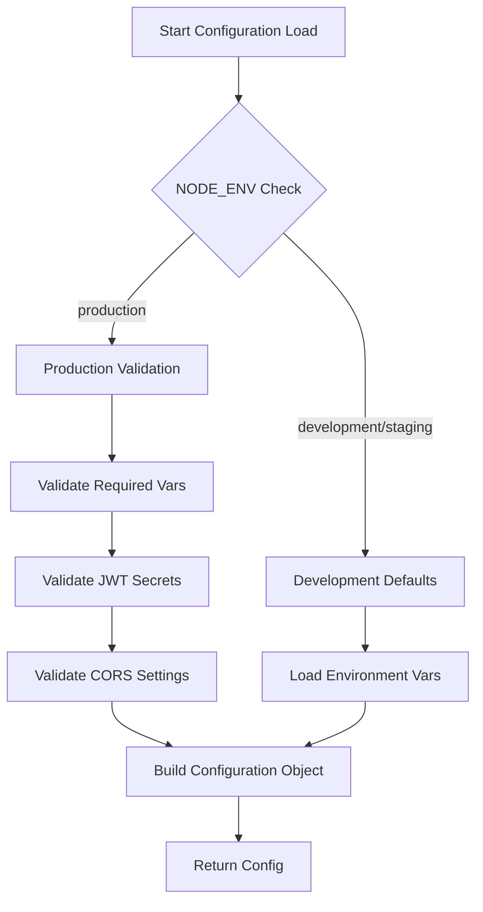
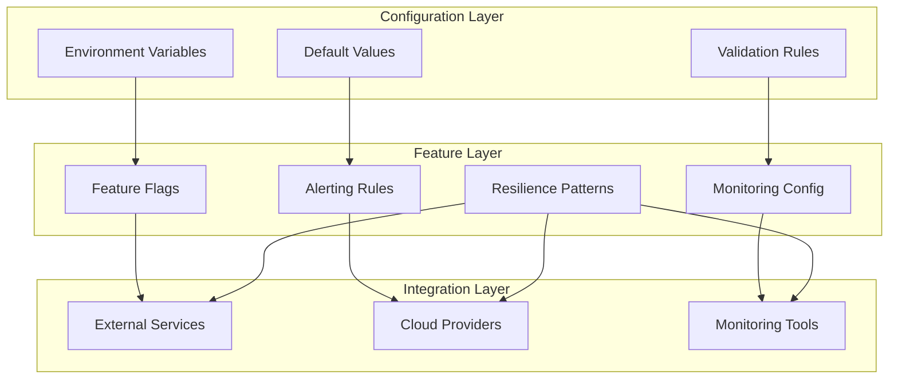
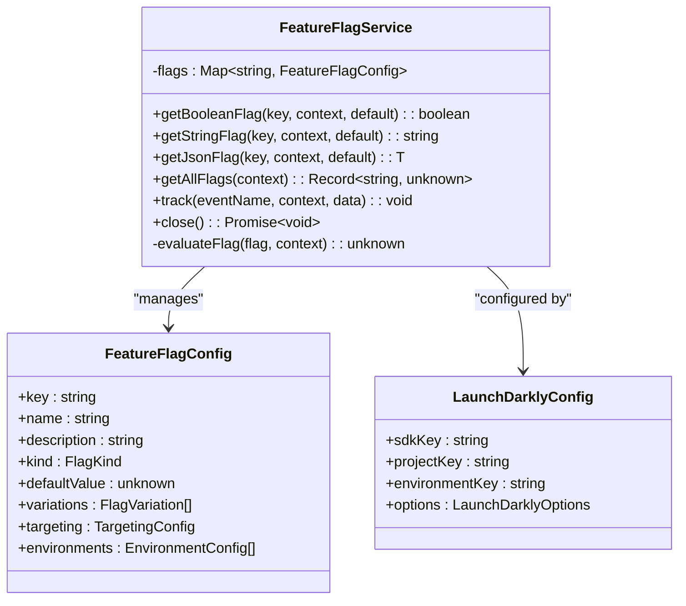
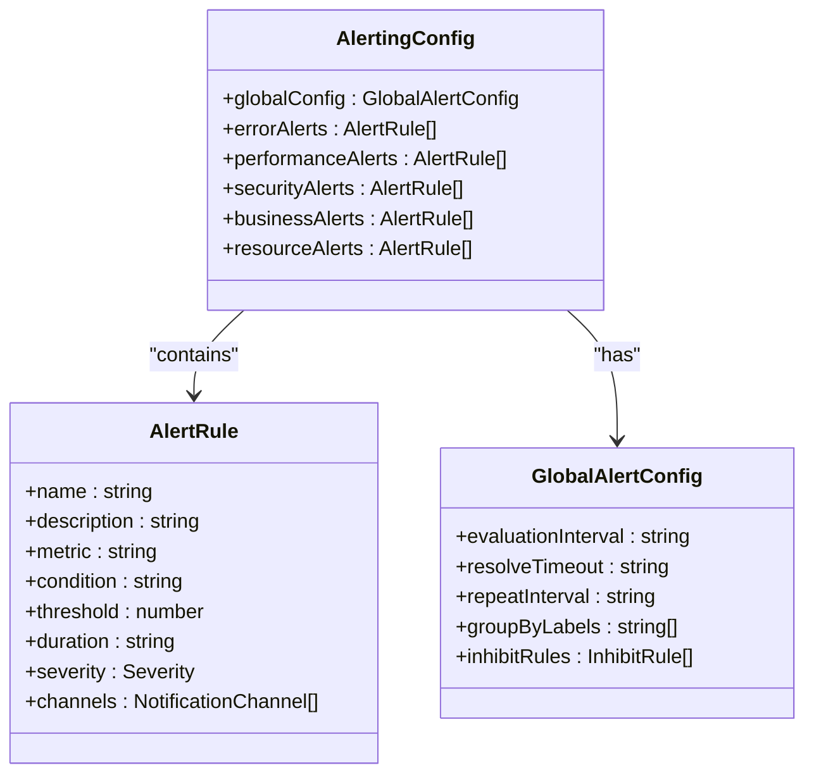
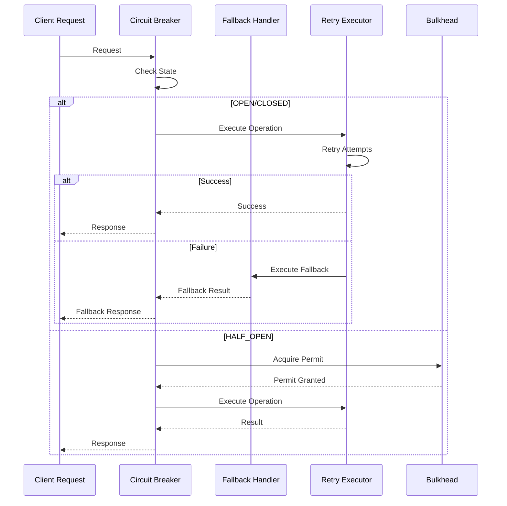
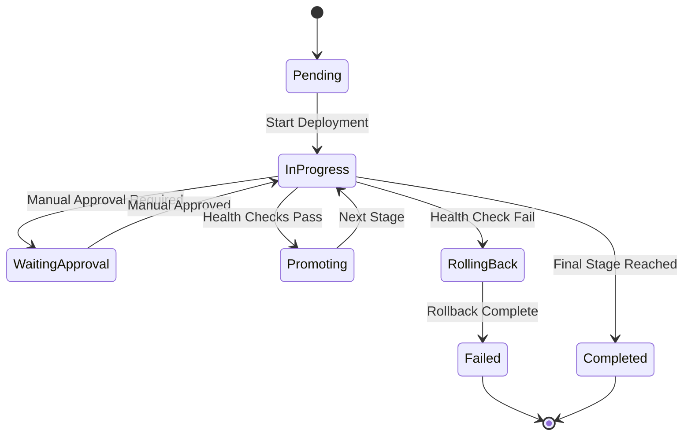
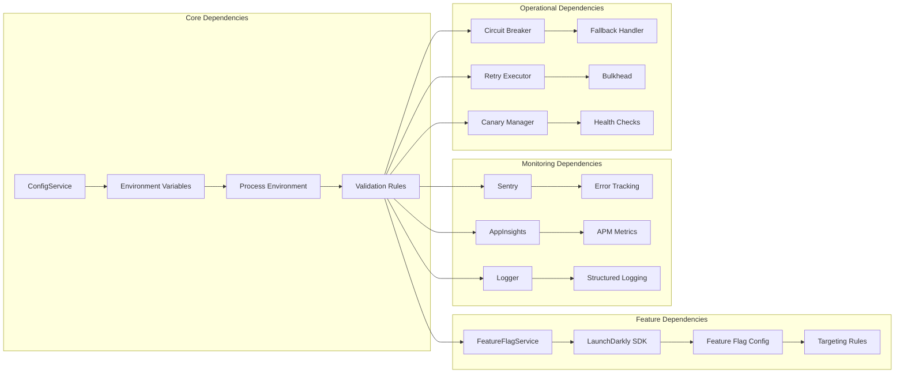

# Configuration Management

<cite>
**Referenced Files in This Document**
- [configuration.ts](file://apps/api/src/config/configuration.ts)
- [feature-flags.config.ts](file://apps/api/src/config/feature-flags.config.ts)
- [alerting-rules.config.ts](file://apps/api/src/config/alerting-rules.config.ts)
- [logger.config.ts](file://apps/api/src/config/logger.config.ts)
- [sentry.config.ts](file://apps/api/src/config/sentry.config.ts)
- [appinsights.config.ts](file://apps/api/src/config/appinsights.config.ts)
- [graceful-degradation.config.ts](file://apps/api/src/config/graceful-degradation.config.ts)
- [canary-deployment.config.ts](file://apps/api/src/config/canary-deployment.config.ts)
- [disaster-recovery.config.ts](file://apps/api/src/config/disaster-recovery.config.ts)
- [incident-response.config.ts](file://apps/api/src/config/incident-response.config.ts)
- [resource-pressure.config.ts](file://apps/api/src/config/resource-pressure.config.ts)
- [uptime-monitoring.config.ts](file://apps/api/src/config/uptime-monitoring.config.ts)
</cite>

## Table of Contents
1. [Introduction](#introduction)
2. [Project Structure](#project-structure)
3. [Core Components](#core-components)
4. [Architecture Overview](#architecture-overview)
5. [Detailed Component Analysis](#detailed-component-analysis)
6. [Dependency Analysis](#dependency-analysis)
7. [Performance Considerations](#performance-considerations)
8. [Troubleshooting Guide](#troubleshooting-guide)
9. [Conclusion](#conclusion)

## Introduction

The Quiz2Biz backend employs a comprehensive configuration management system built around NestJS ConfigModule. This system provides centralized configuration loading, environment-specific settings, and robust validation mechanisms. The configuration architecture supports feature flags, alerting rules, monitoring integrations, and operational resilience patterns.

The system follows a hierarchical configuration approach where environment variables serve as the primary source of truth, with sensible defaults applied for local development. Production environments undergo strict validation to ensure security and reliability requirements are met.

## Project Structure

The configuration management system is organized into specialized modules within the `apps/api/src/config/` directory:

**Diagram sources**
- [configuration.ts:87-115](file://apps/api/src/config/configuration.ts#L87-L115)
- [feature-flags.config.ts:229-596](file://apps/api/src/config/feature-flags.config.ts#L229-L596)
- [graceful-degradation.config.ts:66-211](file://apps/api/src/config/graceful-degradation.config.ts#L66-L211)

**Section sources**
- [configuration.ts:1-115](file://apps/api/src/config/configuration.ts#L1-L115)

## Core Components

### Central Configuration Loader

The core configuration system is defined in the main configuration factory that validates environment variables and constructs the complete configuration object:

**Diagram sources**
- [configuration.ts:5-43](file://apps/api/src/config/configuration.ts#L5-L43)
- [configuration.ts:87-115](file://apps/api/src/config/configuration.ts#L87-L115)

The configuration loader implements fail-fast validation for production environments, ensuring critical security requirements are met before application startup.

**Section sources**
- [configuration.ts:5-43](file://apps/api/src/config/configuration.ts#L5-L43)
- [configuration.ts:87-115](file://apps/api/src/config/configuration.ts#L87-L115)

### Environment-Specific Configuration

The system supports three primary environments with distinct configuration profiles:

| Environment | Purpose | Validation Level | Default Behavior |
|-------------|---------|------------------|------------------|
| Development | Local development and testing | Minimal validation | All features enabled, verbose logging |
| Staging | Pre-production testing | Standard validation | Feature flags enabled, moderate logging |
| Production | Live environment | Strict validation | Security-focused, minimal exposure |

**Section sources**
- [configuration.ts:87-115](file://apps/api/src/config/configuration.ts#L87-L115)

## Architecture Overview

The configuration management system follows a layered architecture with clear separation of concerns:

**Diagram sources**
- [configuration.ts:87-115](file://apps/api/src/config/configuration.ts#L87-L115)
- [feature-flags.config.ts:198-220](file://apps/api/src/config/feature-flags.config.ts#L198-L220)
- [graceful-degradation.config.ts:66-211](file://apps/api/src/config/graceful-degradation.config.ts#L66-L211)

**Section sources**
- [configuration.ts:87-115](file://apps/api/src/config/configuration.ts#L87-L115)

## Detailed Component Analysis

### Feature Flag System

The feature flag implementation provides sophisticated control over module availability and experimental features:

**Diagram sources**
- [feature-flags.config.ts:709-794](file://apps/api/src/config/feature-flags.config.ts#L709-L794)
- [feature-flags.config.ts:14-28](file://apps/api/src/config/feature-flags.config.ts#L14-L28)
- [feature-flags.config.ts:171-193](file://apps/api/src/config/feature-flags.config.ts#L171-L193)

The system supports multiple flag types including boolean flags for feature toggles, string flags for A/B testing variants, and JSON flags for complex configuration objects.

**Section sources**
- [feature-flags.config.ts:709-794](file://apps/api/src/config/feature-flags.config.ts#L709-L794)
- [feature-flags.config.ts:229-596](file://apps/api/src/config/feature-flags.config.ts#L229-L596)

### Alerting Rules Configuration

The alerting system defines comprehensive monitoring rules with severity levels and escalation policies:

**Diagram sources**
- [alerting-rules.config.ts:34-41](file://apps/api/src/config/alerting-rules.config.ts#L34-L41)
- [alerting-rules.config.ts:20-32](file://apps/api/src/config/alerting-rules.config.ts#L20-L32)
- [alerting-rules.config.ts:43-49](file://apps/api/src/config/alerting-rules.config.ts#L43-L49)

The system categorizes alerts into five types: error rates, performance metrics, security incidents, business KPIs, and resource constraints.

**Section sources**
- [alerting-rules.config.ts:61-478](file://apps/api/src/config/alerting-rules.config.ts#L61-L478)

### Graceful Degradation Framework

The resilience system implements multiple patterns for handling system stress and failures:

**Diagram sources**
- [graceful-degradation.config.ts:441-532](file://apps/api/src/config/graceful-degradation.config.ts#L441-L532)
- [graceful-degradation.config.ts:240-326](file://apps/api/src/config/graceful-degradation.config.ts#L240-L326)
- [graceful-degradation.config.ts:595-679](file://apps/api/src/config/graceful-degradation.config.ts#L595-L679)

**Section sources**
- [graceful-degradation.config.ts:66-211](file://apps/api/src/config/graceful-degradation.config.ts#L66-L211)
- [graceful-degradation.config.ts:441-532](file://apps/api/src/config/graceful-degradation.config.ts#L441-L532)

### Canary Deployment Strategy

The deployment system implements progressive rollout with automated health monitoring:

**Diagram sources**
- [canary-deployment.config.ts:521-554](file://apps/api/src/config/canary-deployment.config.ts#L521-L554)
- [canary-deployment.config.ts:746-776](file://apps/api/src/config/canary-deployment.config.ts#L746-L776)
- [canary-deployment.config.ts:781-800](file://apps/api/src/config/canary-deployment.config.ts#L781-L800)

**Section sources**
- [canary-deployment.config.ts:144-232](file://apps/api/src/config/canary-deployment.config.ts#L144-L232)
- [canary-deployment.config.ts:521-595](file://apps/api/src/config/canary-deployment.config.ts#L521-L595)

## Dependency Analysis

The configuration system exhibits loose coupling with clear dependency boundaries:

**Diagram sources**
- [configuration.ts:87-115](file://apps/api/src/config/configuration.ts#L87-L115)
- [feature-flags.config.ts:709-794](file://apps/api/src/config/feature-flags.config.ts#L709-L794)
- [sentry.config.ts:51-127](file://apps/api/src/config/sentry.config.ts#L51-L127)
- [appinsights.config.ts:65-117](file://apps/api/src/config/appinsights.config.ts#L65-L117)

**Section sources**
- [configuration.ts:87-115](file://apps/api/src/config/configuration.ts#L87-L115)

## Performance Considerations

### Configuration Loading Performance

The configuration system optimizes startup performance through lazy initialization and caching mechanisms:

- **Environment Variable Caching**: Process environment variables are cached during application startup
- **Configuration Object Freezing**: Configuration objects are frozen to prevent accidental mutations
- **Selective Module Loading**: Optional modules (like Sentry profiling) are loaded conditionally

### Runtime Performance Impact

Feature flags and monitoring systems are designed to minimize runtime overhead:

- **Feature Flag Evaluation**: Local evaluation with minimal computational overhead
- **Circuit Breaker Metrics**: Lightweight state tracking with configurable intervals
- **Logging Configuration**: Structured logging with minimal serialization overhead

## Troubleshooting Guide

### Common Configuration Issues

**Production Startup Failures**
- Verify all required environment variables are set
- Check JWT secret strength requirements (minimum 32 characters)
- Ensure CORS_ORIGIN is properly configured (not set to wildcard)

**Feature Flag Problems**
- Confirm LaunchDarkly SDK key is properly configured
- Verify feature flag keys match expected values
- Check targeting rules for proper user attribute matching

**Monitoring Integration Issues**
- Validate Sentry DSN format and permissions
- Check AppInsights connection string validity
- Verify logging configuration compatibility with environment

**Section sources**
- [configuration.ts:5-43](file://apps/api/src/config/configuration.ts#L5-L43)
- [feature-flags.config.ts:198-220](file://apps/api/src/config/feature-flags.config.ts#L198-L220)
- [sentry.config.ts:51-127](file://apps/api/src/config/sentry.config.ts#L51-L127)

### Configuration Validation Strategies

The system implements multiple validation layers:

1. **Compile-time Validation**: TypeScript interfaces ensure configuration structure integrity
2. **Runtime Validation**: Environment variable validation during application startup
3. **Integration Validation**: Service-specific validation for external dependencies
4. **Health Check Validation**: Periodic validation of configuration effectiveness

**Section sources**
- [configuration.ts:5-43](file://apps/api/src/config/configuration.ts#L5-L43)
- [graceful-degradation.config.ts:66-211](file://apps/api/src/config/graceful-degradation.config.ts#L66-L211)

## Conclusion

The Quiz2Biz configuration management system provides a robust, scalable foundation for backend configuration. The system's architecture emphasizes security, reliability, and operational excellence through comprehensive validation, feature flagging, and resilience patterns.

Key strengths include:
- **Security-focused production validation** ensuring critical security requirements
- **Flexible feature flag system** enabling controlled feature releases
- **Comprehensive monitoring integration** supporting observability needs
- **Resilient deployment strategies** minimizing risk during updates
- **Operational excellence** through disaster recovery and incident response planning

The modular design allows for easy extension and customization while maintaining consistency across environments. The system successfully balances developer productivity with operational reliability, providing a solid foundation for the application's continued growth and evolution.