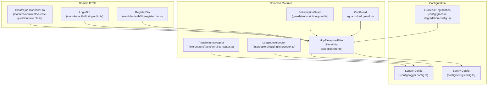
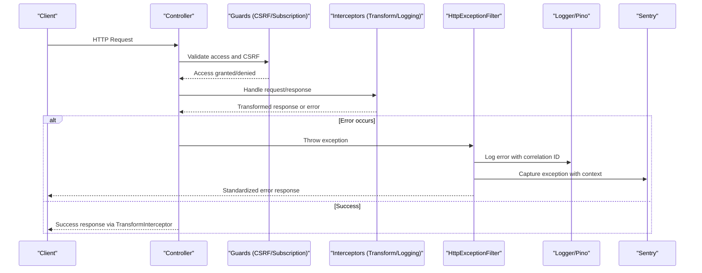
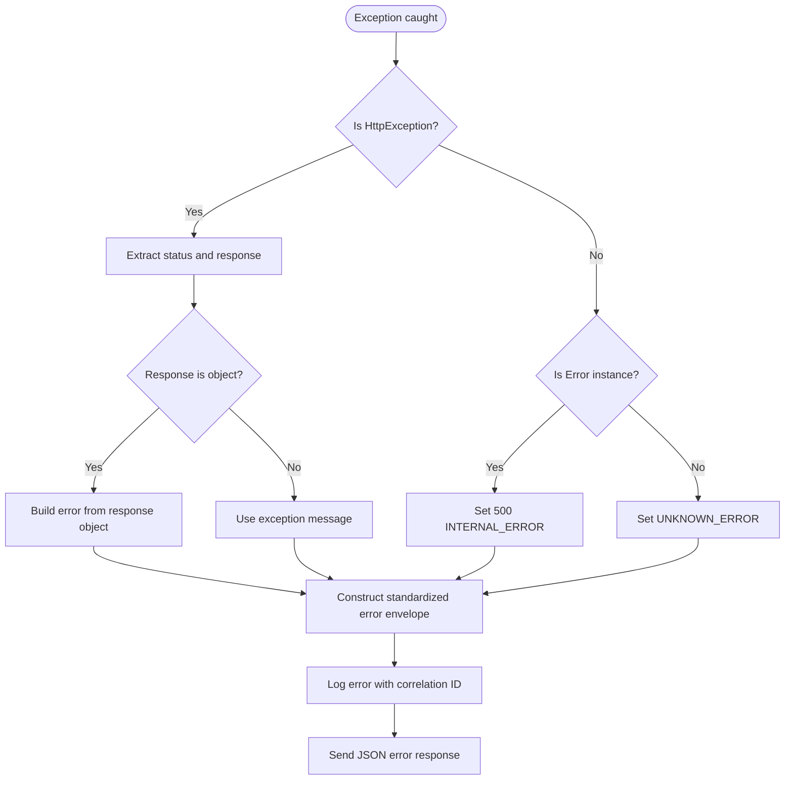
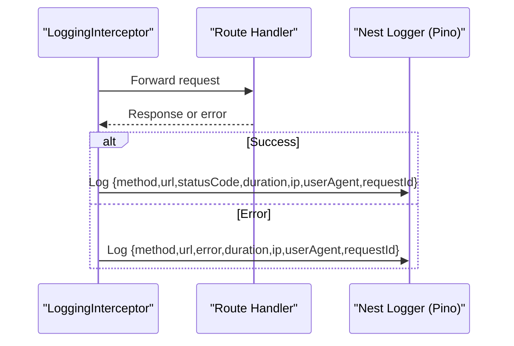
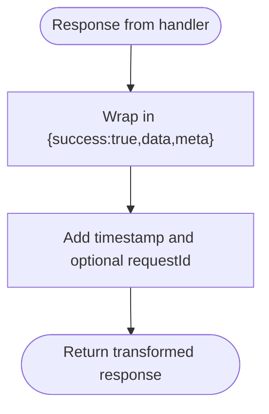
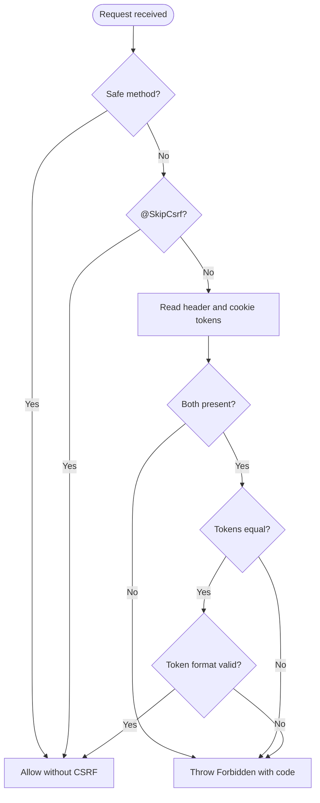
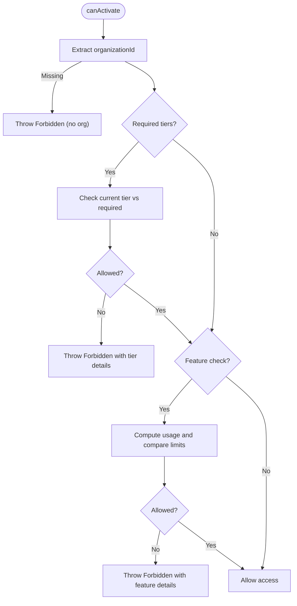
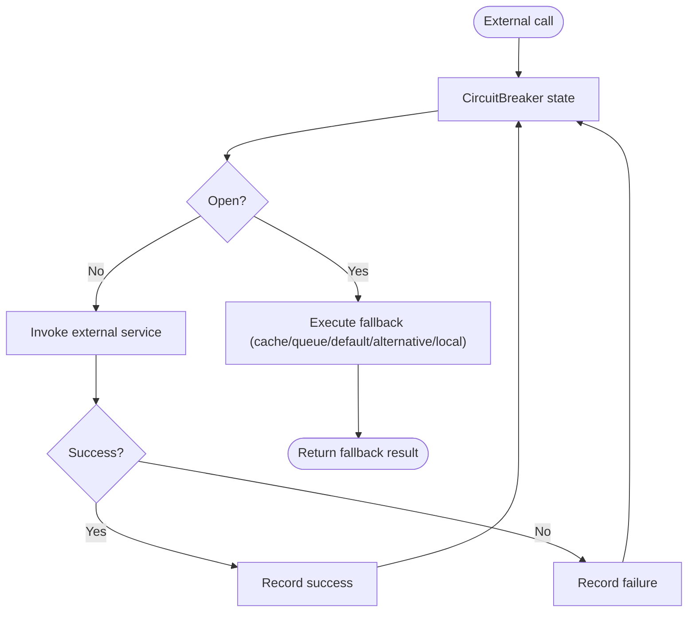
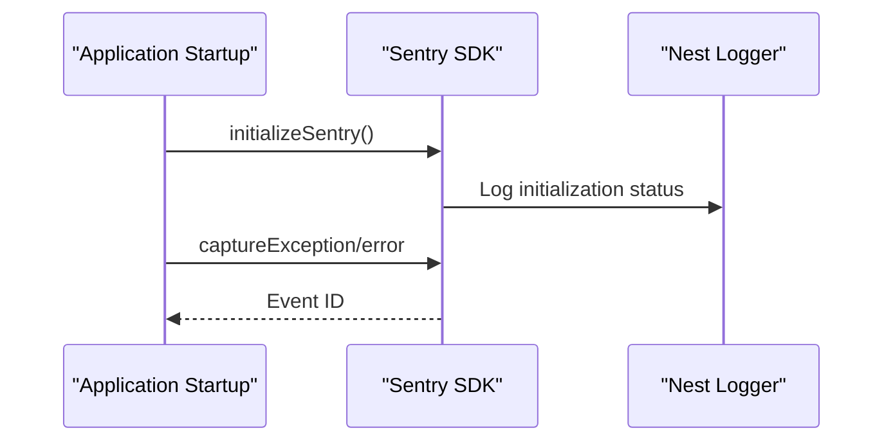
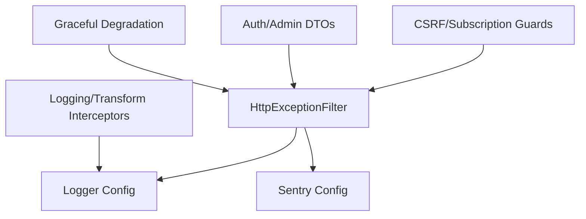

# Error Handling and Validation

<cite>
**Referenced Files in This Document**
- [http-exception.filter.ts](file://apps/api/src/common/filters/http-exception.filter.ts)
- [logging.interceptor.ts](file://apps/api/src/common/interceptors/logging.interceptor.ts)
- [transform.interceptor.ts](file://apps/api/src/common/interceptors/transform.interceptor.ts)
- [logger.config.ts](file://apps/api/src/config/logger.config.ts)
- [sentry.config.ts](file://apps/api/src/config/sentry.config.ts)
- [csrf.guard.ts](file://apps/api/src/common/guards/csrf.guard.ts)
- [subscription.guard.ts](file://apps/api/src/common/guards/subscription.guard.ts)
- [graceful-degradation.config.ts](file://apps/api/src/config/graceful-degradation.config.ts)
- [register.dto.ts](file://apps/api/src/modules/auth/dto/register.dto.ts)
- [login.dto.ts](file://apps/api/src/modules/auth/dto/login.dto.ts)
- [create-questionnaire.dto.ts](file://apps/api/src/modules/admin/dto/create-questionnaire.dto.ts)
- [http-exception.filter.spec.ts](file://apps/api/src/common/filters/http-exception.filter.spec.ts)
</cite>

## Table of Contents
1. [Introduction](#introduction)
2. [Project Structure](#project-structure)
3. [Core Components](#core-components)
4. [Architecture Overview](#architecture-overview)
5. [Detailed Component Analysis](#detailed-component-analysis)
6. [Dependency Analysis](#dependency-analysis)
7. [Performance Considerations](#performance-considerations)
8. [Troubleshooting Guide](#troubleshooting-guide)
9. [Conclusion](#conclusion)

## Introduction
This document explains the error handling and validation patterns implemented in the backend. It covers the custom HTTP exception filter, standardized error response formats, validation pipes, DTO validation rules, custom validation decorators, exception mapping strategies, error categorization, logging integration, graceful degradation, and production monitoring with Sentry. It also provides practical examples for handling different error types and debugging techniques.

## Project Structure
The error handling and validation features are organized across common modules (filters, interceptors, guards), configuration modules (logging, monitoring, graceful degradation), and domain DTOs (validation rules). The following diagram shows the high-level structure and relationships.

**Diagram sources**
- [http-exception.filter.ts:22-82](file://apps/api/src/common/filters/http-exception.filter.ts#L22-L82)
- [logging.interceptor.ts:11-54](file://apps/api/src/common/interceptors/logging.interceptor.ts#L11-L54)
- [transform.interceptor.ts:14-31](file://apps/api/src/common/interceptors/transform.interceptor.ts#L14-L31)
- [csrf.guard.ts:48-148](file://apps/api/src/common/guards/csrf.guard.ts#L48-L148)
- [subscription.guard.ts:57-174](file://apps/api/src/common/guards/subscription.guard.ts#L57-L174)
- [logger.config.ts:9-61](file://apps/api/src/config/logger.config.ts#L9-L61)
- [sentry.config.ts:51-127](file://apps/api/src/config/sentry.config.ts#L51-L127)
- [graceful-degradation.config.ts:66-211](file://apps/api/src/config/graceful-degradation.config.ts#L66-L211)
- [register.dto.ts:4-24](file://apps/api/src/modules/auth/dto/register.dto.ts#L4-L24)
- [login.dto.ts:4-19](file://apps/api/src/modules/auth/dto/login.dto.ts#L4-L19)
- [create-questionnaire.dto.ts:4-36](file://apps/api/src/modules/admin/dto/create-questionnaire.dto.ts#L4-L36)

**Section sources**
- [http-exception.filter.ts:22-102](file://apps/api/src/common/filters/http-exception.filter.ts#L22-L102)
- [logging.interceptor.ts:11-56](file://apps/api/src/common/interceptors/logging.interceptor.ts#L11-L56)
- [transform.interceptor.ts:14-32](file://apps/api/src/common/interceptors/transform.interceptor.ts#L14-L32)
- [csrf.guard.ts:48-242](file://apps/api/src/common/guards/csrf.guard.ts#L48-L242)
- [subscription.guard.ts:57-289](file://apps/api/src/common/guards/subscription.guard.ts#L57-L289)
- [logger.config.ts:9-62](file://apps/api/src/config/logger.config.ts#L9-L62)
- [sentry.config.ts:51-228](file://apps/api/src/config/sentry.config.ts#L51-L228)
- [graceful-degradation.config.ts:66-910](file://apps/api/src/config/graceful-degradation.config.ts#L66-L910)
- [register.dto.ts:4-24](file://apps/api/src/modules/auth/dto/register.dto.ts#L4-L24)
- [login.dto.ts:4-19](file://apps/api/src/modules/auth/dto/login.dto.ts#L4-L19)
- [create-questionnaire.dto.ts:4-36](file://apps/api/src/modules/admin/dto/create-questionnaire.dto.ts#L4-L36)

## Core Components
- Custom HTTP Exception Filter: Centralized error handling that maps exceptions to standardized JSON responses, enriches with correlation IDs, and logs details.
- Logging Interceptor: Structured HTTP request/response logging with correlation IDs and timing.
- Transform Interceptor: Wraps successful responses in a consistent envelope with timestamps and optional request IDs.
- CSRF Guard: Validates CSRF tokens using the double-submit cookie pattern for non-safe HTTP methods.
- Subscription Guard: Enforces tier-based and feature-based access controls, returning rich error payloads for forbidden access.
- Logger Configuration: Pino-backed logger with redaction, correlation ID generation, and environment-aware transport.
- Sentry Configuration: Production-grade error tracking, performance monitoring, alerting rules, and user context management.
- Graceful Degradation: Circuit breaker, fallbacks, retry with exponential backoff, bulkhead isolation, and rate limiting.
- DTO Validation: Strongly-typed DTOs using class-validator decorators for input validation.

**Section sources**
- [http-exception.filter.ts:22-102](file://apps/api/src/common/filters/http-exception.filter.ts#L22-L102)
- [logging.interceptor.ts:11-56](file://apps/api/src/common/interceptors/logging.interceptor.ts#L11-L56)
- [transform.interceptor.ts:14-32](file://apps/api/src/common/interceptors/transform.interceptor.ts#L14-L32)
- [csrf.guard.ts:48-148](file://apps/api/src/common/guards/csrf.guard.ts#L48-L148)
- [subscription.guard.ts:57-174](file://apps/api/src/common/guards/subscription.guard.ts#L57-L174)
- [logger.config.ts:9-62](file://apps/api/src/config/logger.config.ts#L9-L62)
- [sentry.config.ts:51-228](file://apps/api/src/config/sentry.config.ts#L51-L228)
- [graceful-degradation.config.ts:66-910](file://apps/api/src/config/graceful-degradation.config.ts#L66-L910)
- [register.dto.ts:4-24](file://apps/api/src/modules/auth/dto/register.dto.ts#L4-L24)
- [login.dto.ts:4-19](file://apps/api/src/modules/auth/dto/login.dto.ts#L4-L19)
- [create-questionnaire.dto.ts:4-36](file://apps/api/src/modules/admin/dto/create-questionnaire.dto.ts#L4-L36)

## Architecture Overview
The system integrates error handling and validation across the request lifecycle:
- DTOs define validation rules.
- Guards enforce access control and CSRF protection.
- Interceptors standardize logging and response envelopes.
- The exception filter centralizes error responses and integrates with Sentry and structured logging.

**Diagram sources**
- [csrf.guard.ts:66-148](file://apps/api/src/common/guards/csrf.guard.ts#L66-L148)
- [subscription.guard.ts:65-94](file://apps/api/src/common/guards/subscription.guard.ts#L65-L94)
- [transform.interceptor.ts:14-31](file://apps/api/src/common/interceptors/transform.interceptor.ts#L14-L31)
- [logging.interceptor.ts:11-56](file://apps/api/src/common/interceptors/logging.interceptor.ts#L11-L56)
- [http-exception.filter.ts:22-82](file://apps/api/src/common/filters/http-exception.filter.ts#L22-L82)
- [logger.config.ts:9-62](file://apps/api/src/config/logger.config.ts#L9-L62)
- [sentry.config.ts:51-127](file://apps/api/src/config/sentry.config.ts#L51-L127)

## Detailed Component Analysis

### Custom HTTP Exception Filter
The filter intercepts all thrown exceptions, determines appropriate HTTP status codes, and returns a standardized error response envelope. It supports:
- Mapping HTTP exceptions to structured error payloads with optional details arrays.
- Generating error codes from status codes with a predefined mapping.
- Capturing unhandled errors and logging stack traces for debugging.
- Including correlation IDs and timestamps for traceability.

**Diagram sources**
- [http-exception.filter.ts:26-82](file://apps/api/src/common/filters/http-exception.filter.ts#L26-L82)

**Section sources**
- [http-exception.filter.ts:22-102](file://apps/api/src/common/filters/http-exception.filter.ts#L22-L102)
- [http-exception.filter.spec.ts:53-94](file://apps/api/src/common/filters/http-exception.filter.spec.ts#L53-L94)

### Logging Interceptor
The interceptor logs structured HTTP events with correlation IDs, request durations, and error details. It delegates to Pino via NestJS Logger for consistent formatting and redaction.

**Diagram sources**
- [logging.interceptor.ts:14-54](file://apps/api/src/common/interceptors/logging.interceptor.ts#L14-L54)
- [logger.config.ts:9-62](file://apps/api/src/config/logger.config.ts#L9-L62)

**Section sources**
- [logging.interceptor.ts:11-56](file://apps/api/src/common/interceptors/logging.interceptor.ts#L11-L56)
- [logger.config.ts:9-62](file://apps/api/src/config/logger.config.ts#L9-L62)

### Transform Interceptor
The interceptor wraps successful responses in a consistent envelope containing success flags, data, and metadata such as timestamps and optional request IDs.

**Diagram sources**
- [transform.interceptor.ts:14-31](file://apps/api/src/common/interceptors/transform.interceptor.ts#L14-L31)

**Section sources**
- [transform.interceptor.ts:14-32](file://apps/api/src/common/interceptors/transform.interceptor.ts#L14-L32)

### CSRF Guard
The guard implements the double-submit cookie pattern:
- Generates CSRF tokens with embedded HMAC signatures.
- Requires both cookie and header tokens for non-safe methods.
- Uses constant-time comparisons to prevent timing attacks.
- Supports a decorator to skip CSRF checks for specific routes.

**Diagram sources**
- [csrf.guard.ts:66-148](file://apps/api/src/common/guards/csrf.guard.ts#L66-L148)

**Section sources**
- [csrf.guard.ts:48-242](file://apps/api/src/common/guards/csrf.guard.ts#L48-L242)

### Subscription Guard
The guard enforces tier-based and feature-based access:
- Extracts organization context from multiple locations (JWT, query, headers, body).
- Checks required tiers against current subscription.
- Performs feature usage checks with configurable usage calculators.
- Returns rich error payloads for denied access, including upgrade URLs and limits.

**Diagram sources**
- [subscription.guard.ts:65-174](file://apps/api/src/common/guards/subscription.guard.ts#L65-L174)

**Section sources**
- [subscription.guard.ts:57-289](file://apps/api/src/common/guards/subscription.guard.ts#L57-L289)

### DTO Validation Patterns
DTOs define strict validation rules using class-validator decorators:
- RegisterDto: Email format, password length/mixed-case requirements, name length constraints.
- LoginDto: Email format, password minimum length, optional IP field populated by controller.
- CreateQuestionnaireDto: String/boolean/int/object constraints with max/min and optional fields.

These DTOs are designed to integrate with validation pipes to produce structured validation errors compatible with the exception filter.

**Section sources**
- [register.dto.ts:4-24](file://apps/api/src/modules/auth/dto/register.dto.ts#L4-L24)
- [login.dto.ts:4-19](file://apps/api/src/modules/auth/dto/login.dto.ts#L4-L19)
- [create-questionnaire.dto.ts:4-36](file://apps/api/src/modules/admin/dto/create-questionnaire.dto.ts#L4-L36)

### Graceful Degradation
The graceful degradation configuration provides resilience patterns:
- Circuit Breakers: Failure/slow-call thresholds, timeouts, fallbacks (cache, queue, default value, alternative endpoint, local cache).
- Retry Executor: Exponential backoff with jitter, configurable retryable/non-retryable error categories.
- Bulkhead: Concurrency limits, queue sizing, and wait timeouts with metrics.
- Rate Limiter: Per-user, global, login, email sending, and file upload limits.

**Diagram sources**
- [graceful-degradation.config.ts:66-326](file://apps/api/src/config/graceful-degradation.config.ts#L66-L326)

**Section sources**
- [graceful-degradation.config.ts:66-910](file://apps/api/src/config/graceful-degradation.config.ts#L66-L910)

### Sentry Integration
Sentry is initialized early in the application lifecycle with:
- Environment-aware configuration and optional profiling.
- Data redaction for sensitive headers and breadcrumbs.
- Filtering of health check transactions and specific error types.
- Alerting rules for error rates and response times.
- Utilities for capturing exceptions with context, setting user context, adding breadcrumbs, and starting transactions.

**Diagram sources**
- [sentry.config.ts:51-127](file://apps/api/src/config/sentry.config.ts#L51-L127)

**Section sources**
- [sentry.config.ts:51-228](file://apps/api/src/config/sentry.config.ts#L51-L228)

## Dependency Analysis
The components interact as follows:
- Exception Filter depends on structured logging and Sentry for observability.
- Guards depend on configuration services and reflection for metadata.
- Interceptors rely on Pino logger configuration for consistent formatting.
- DTOs are consumed by controllers and validated by validation pipes (not shown here but implied by DTO usage).

**Diagram sources**
- [http-exception.filter.ts:22-102](file://apps/api/src/common/filters/http-exception.filter.ts#L22-L102)
- [logging.interceptor.ts:11-56](file://apps/api/src/common/interceptors/logging.interceptor.ts#L11-L56)
- [transform.interceptor.ts:14-31](file://apps/api/src/common/interceptors/transform.interceptor.ts#L14-L31)
- [csrf.guard.ts:48-148](file://apps/api/src/common/guards/csrf.guard.ts#L48-L148)
- [subscription.guard.ts:57-174](file://apps/api/src/common/guards/subscription.guard.ts#L57-L174)
- [logger.config.ts:9-62](file://apps/api/src/config/logger.config.ts#L9-L62)
- [sentry.config.ts:51-127](file://apps/api/src/config/sentry.config.ts#L51-L127)
- [graceful-degradation.config.ts:66-326](file://apps/api/src/config/graceful-degradation.config.ts#L66-L326)
- [register.dto.ts:4-24](file://apps/api/src/modules/auth/dto/register.dto.ts#L4-L24)
- [login.dto.ts:4-19](file://apps/api/src/modules/auth/dto/login.dto.ts#L4-L19)
- [create-questionnaire.dto.ts:4-36](file://apps/api/src/modules/admin/dto/create-questionnaire.dto.ts#L4-L36)

**Section sources**
- [http-exception.filter.ts:22-102](file://apps/api/src/common/filters/http-exception.filter.ts#L22-L102)
- [logging.interceptor.ts:11-56](file://apps/api/src/common/interceptors/logging.interceptor.ts#L11-L56)
- [transform.interceptor.ts:14-32](file://apps/api/src/common/interceptors/transform.interceptor.ts#L14-L32)
- [csrf.guard.ts:48-148](file://apps/api/src/common/guards/csrf.guard.ts#L48-L148)
- [subscription.guard.ts:57-174](file://apps/api/src/common/guards/subscription.guard.ts#L57-L174)
- [logger.config.ts:9-62](file://apps/api/src/config/logger.config.ts#L9-L62)
- [sentry.config.ts:51-127](file://apps/api/src/config/sentry.config.ts#L51-L127)
- [graceful-degradation.config.ts:66-326](file://apps/api/src/config/graceful-degradation.config.ts#L66-L326)
- [register.dto.ts:4-24](file://apps/api/src/modules/auth/dto/register.dto.ts#L4-L24)
- [login.dto.ts:4-19](file://apps/api/src/modules/auth/dto/login.dto.ts#L4-L19)
- [create-questionnaire.dto.ts:4-36](file://apps/api/src/modules/admin/dto/create-questionnaire.dto.ts#L4-L36)

## Performance Considerations
- Prefer circuit breakers and fallbacks for external dependencies to avoid cascading failures.
- Use exponential backoff with jitter to prevent thundering herds during retries.
- Apply bulkheads to isolate high-latency or high-throughput operations.
- Leverage rate limiting to protect critical resources and maintain SLAs.
- Keep validation logic lightweight and centralized to minimize overhead.

## Troubleshooting Guide
- Unhandled errors: The exception filter logs stack traces and returns standardized error responses. Use correlation IDs from the error payload to trace logs and Sentry events.
- Validation errors: DTO validation produces structured messages compatible with the exception filter. Inspect the details array for field-specific errors.
- CSRF failures: Ensure both cookie and header tokens are present and match. Review guard logs for missing or mismatched tokens.
- Subscription access denied: Check the error payload for required tiers and feature limits. Provide upgrade URLs and adjust feature usage calculations.
- Logging and tracing: Confirm Pino configuration is applied and correlation IDs propagate through the request lifecycle. Use Sentry to correlate events and breadcrumbs.

**Section sources**
- [http-exception.filter.ts:51-82](file://apps/api/src/common/filters/http-exception.filter.ts#L51-L82)
- [logging.interceptor.ts:11-56](file://apps/api/src/common/interceptors/logging.interceptor.ts#L11-L56)
- [csrf.guard.ts:95-148](file://apps/api/src/common/guards/csrf.guard.ts#L95-L148)
- [subscription.guard.ts:128-174](file://apps/api/src/common/guards/subscription.guard.ts#L128-L174)
- [logger.config.ts:9-62](file://apps/api/src/config/logger.config.ts#L9-L62)
- [sentry.config.ts:51-127](file://apps/api/src/config/sentry.config.ts#L51-L127)

## Conclusion
The backend implements a robust, layered approach to error handling and validation:
- Centralized exception filtering ensures consistent error responses.
- Structured logging and Sentry integration provide comprehensive observability.
- Guards enforce security and access control with rich error payloads.
- DTO validation and graceful degradation patterns improve reliability and user experience under failure conditions.
This design enables clear diagnostics, actionable alerts, and graceful handling of diverse error scenarios in production.