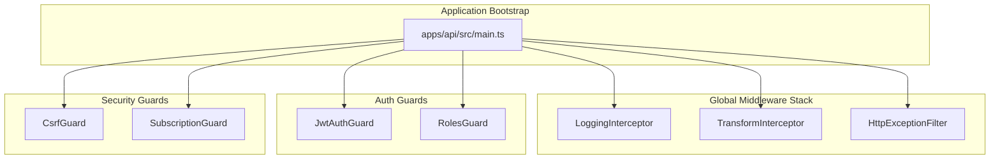
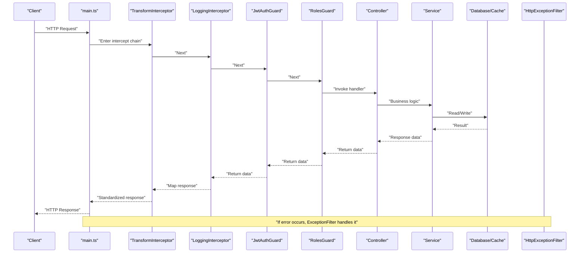
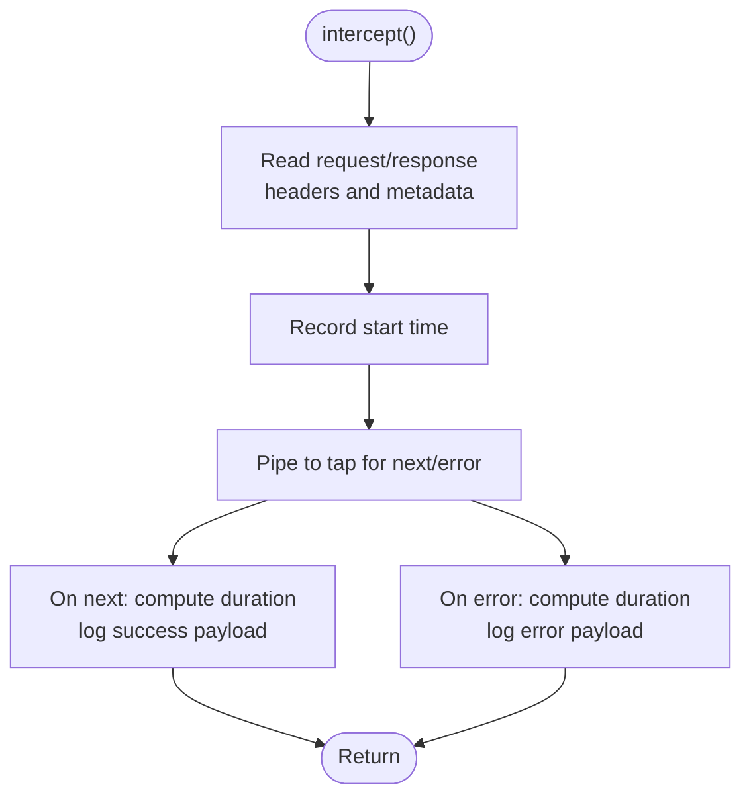
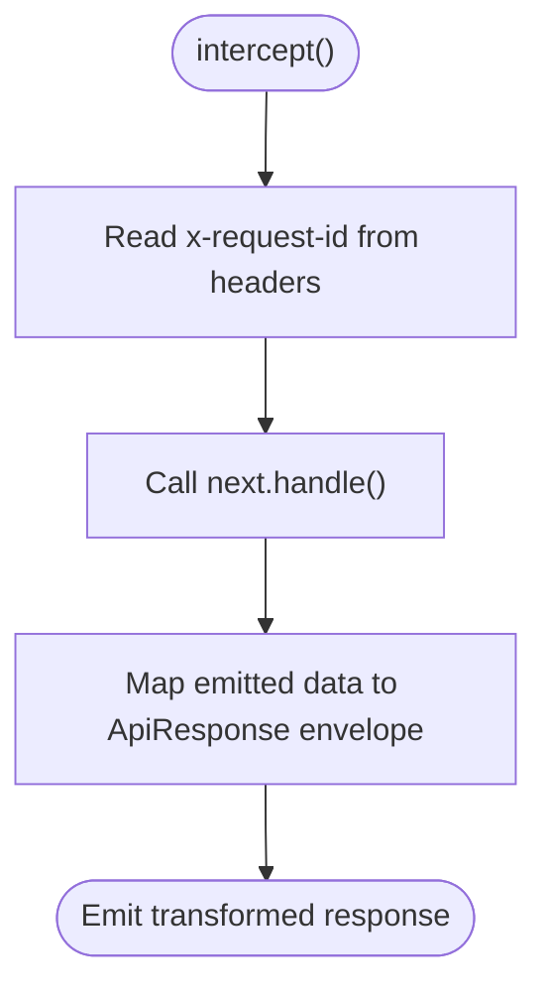
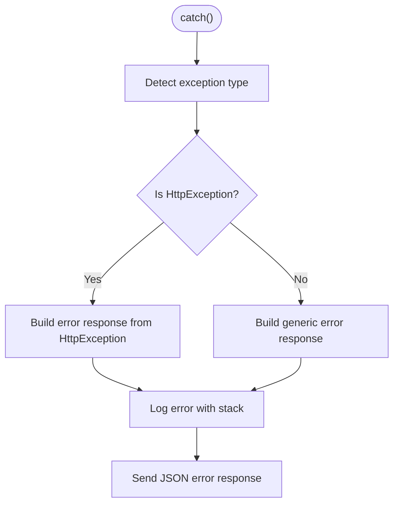
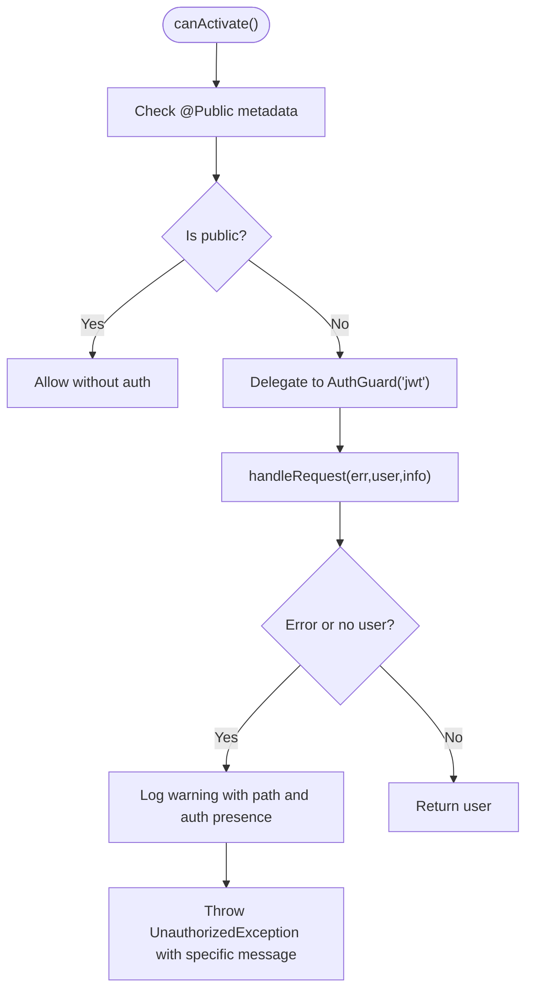
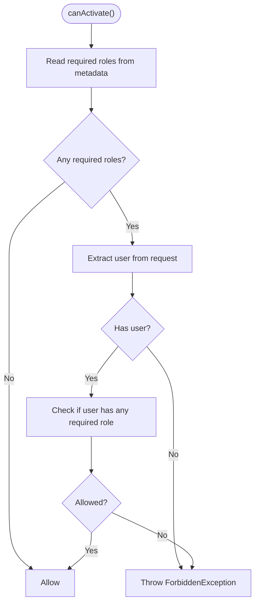
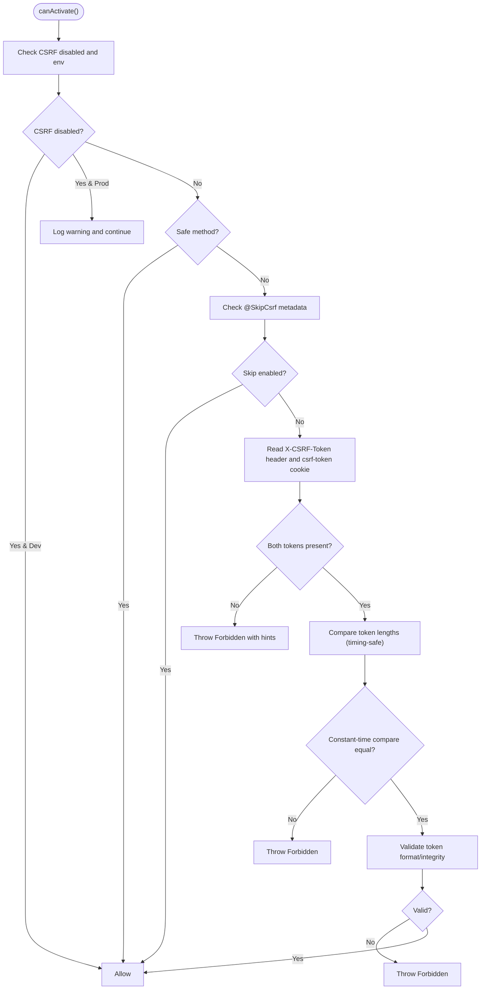
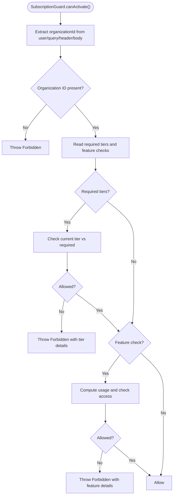
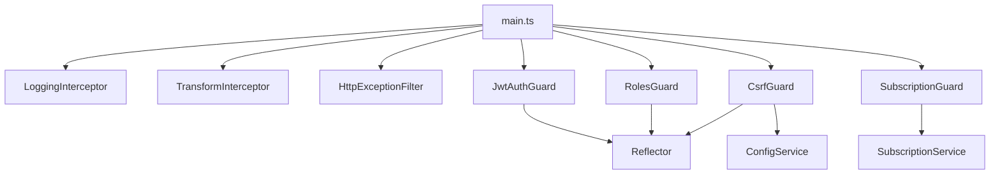

# Middleware and Interceptors

<cite>
**Referenced Files in This Document**
- [main.ts](file://apps/api/src/main.ts)
- [logging.interceptor.ts](file://apps/api/src/common/interceptors/logging.interceptor.ts)
- [transform.interceptor.ts](file://apps/api/src/common/interceptors/transform.interceptor.ts)
- [csrf.guard.ts](file://apps/api/src/common/guards/csrf.guard.ts)
- [subscription.guard.ts](file://apps/api/src/common/guards/subscription.guard.ts)
- [index.ts](file://apps/api/src/common/guards/index.ts)
- [http-exception.filter.ts](file://apps/api/src/common/filters/http-exception.filter.ts)
- [jwt-auth.guard.ts](file://apps/api/src/modules/auth/guards/jwt-auth.guard.ts)
- [roles.guard.ts](file://apps/api/src/modules/auth/guards/roles.guard.ts)
- [public.decorator.ts](file://apps/api/src/modules/auth/decorators/public.decorator.ts)
- [c4-03-component.md](file://docs/architecture/c4-03-component.md)
</cite>

## Table of Contents
1. [Introduction](#introduction)
2. [Project Structure](#project-structure)
3. [Core Components](#core-components)
4. [Architecture Overview](#architecture-overview)
5. [Detailed Component Analysis](#detailed-component-analysis)
6. [Dependency Analysis](#dependency-analysis)
7. [Performance Considerations](#performance-considerations)
8. [Troubleshooting Guide](#troubleshooting-guide)
9. [Conclusion](#conclusion)
10. [Appendices](#appendices)

## Introduction
This document explains the middleware and interceptor implementation in the NestJS application, focusing on:
- Logging interceptor for request/response tracking
- Transform interceptor for standardized response formatting
- Guards for authentication, authorization, CSRF protection, and subscription validation
- Execution order, request/response modification patterns, and error handling strategies
- Practical examples for creating custom interceptors and guards, and chaining middleware
- Performance considerations, security implications, and debugging techniques

## Project Structure
The middleware stack is configured globally in the application bootstrap and includes:
- Global interceptors for logging and response transformation
- Global exception filter for unified error responses
- Auth guards for JWT validation and role-based access control
- Security guards for CSRF protection and subscription-based feature gating

**Diagram sources**
- [main.ts:173-212](file://apps/api/src/main.ts#L173-L212)
- [logging.interceptor.ts:10-55](file://apps/api/src/common/interceptors/logging.interceptor.ts#L10-L55)
- [transform.interceptor.ts:14-31](file://apps/api/src/common/interceptors/transform.interceptor.ts#L14-L31)
- [http-exception.filter.ts:22-101](file://apps/api/src/common/filters/http-exception.filter.ts#L22-L101)
- [jwt-auth.guard.ts:14-63](file://apps/api/src/modules/auth/guards/jwt-auth.guard.ts#L14-L63)
- [roles.guard.ts:7-36](file://apps/api/src/modules/auth/guards/roles.guard.ts#L7-L36)
- [csrf.guard.ts:47-148](file://apps/api/src/common/guards/csrf.guard.ts#L47-L148)
- [subscription.guard.ts:57-174](file://apps/api/src/common/guards/subscription.guard.ts#L57-L174)

**Section sources**
- [main.ts:173-212](file://apps/api/src/main.ts#L173-L212)

## Core Components
- Logging Interceptor: Structured HTTP logging with correlation IDs, duration, and status codes; logs both successes and errors.
- Transform Interceptor: Wraps controller responses into a standardized envelope with success flag, data payload, and metadata (timestamp, optional request ID).
- Exception Filter: Converts thrown exceptions into a consistent JSON error response with correlation and timestamps.
- Auth Guards: JWT authentication guard and roles guard for protected endpoints.
- CSRF Guard: Double-submit cookie pattern for CSRF protection with constant-time token comparison and optional route skipping.
- Subscription Guard: Tier-based and feature-based access control with usage checks and global feature usage middleware.

**Section sources**
- [logging.interceptor.ts:10-55](file://apps/api/src/common/interceptors/logging.interceptor.ts#L10-L55)
- [transform.interceptor.ts:14-31](file://apps/api/src/common/interceptors/transform.interceptor.ts#L14-L31)
- [http-exception.filter.ts:22-101](file://apps/api/src/common/filters/http-exception.filter.ts#L22-L101)
- [jwt-auth.guard.ts:14-63](file://apps/api/src/modules/auth/guards/jwt-auth.guard.ts#L14-L63)
- [roles.guard.ts:7-36](file://apps/api/src/modules/auth/guards/roles.guard.ts#L7-L36)
- [csrf.guard.ts:47-148](file://apps/api/src/common/guards/csrf.guard.ts#L47-L148)
- [subscription.guard.ts:57-174](file://apps/api/src/common/guards/subscription.guard.ts#L57-L174)

## Architecture Overview
The middleware chain executes in a predictable order during request processing:
1. Global interceptors (TransformInterceptor, LoggingInterceptor)
2. Auth guards (JwtAuthGuard, RolesGuard)
3. Route handler/controller
4. Downstream interceptors (LoggingInterceptor, TransformInterceptor)
5. Exception filter for unhandled errors

**Diagram sources**
- [main.ts:173-212](file://apps/api/src/main.ts#L173-L212)
- [logging.interceptor.ts:14-54](file://apps/api/src/common/interceptors/logging.interceptor.ts#L14-L54)
- [transform.interceptor.ts:16-30](file://apps/api/src/common/interceptors/transform.interceptor.ts#L16-L30)
- [jwt-auth.guard.ts:22-33](file://apps/api/src/modules/auth/guards/jwt-auth.guard.ts#L22-L33)
- [roles.guard.ts:11-35](file://apps/api/src/modules/auth/guards/roles.guard.ts#L11-L35)
- [http-exception.filter.ts:26-82](file://apps/api/src/common/filters/http-exception.filter.ts#L26-L82)

## Detailed Component Analysis

### Logging Interceptor
Purpose:
- Capture request metadata (method, URL, IP, user agent, request ID)
- Measure request duration
- Emit structured logs for both success and error outcomes

Execution pattern:
- Reads request and response from ExecutionContext
- Records start time
- Pipes completion to tap to log on next/error

Error handling:
- Logs error message and duration on observable error emission

Performance characteristics:
- Minimal overhead; single pass through tap
- Uses correlation ID from request headers for traceability

**Diagram sources**
- [logging.interceptor.ts:14-54](file://apps/api/src/common/interceptors/logging.interceptor.ts#L14-L54)

**Section sources**
- [logging.interceptor.ts:10-55](file://apps/api/src/common/interceptors/logging.interceptor.ts#L10-L55)

### Transform Interceptor
Purpose:
- Wrap all successful responses into a consistent envelope
- Attach metadata including timestamp and optional request ID

Execution pattern:
- Reads x-request-id from request headers
- Maps emitted data to ApiResponse<T> with success=true

Error handling:
- Does not alter error emissions; exceptions bubble up to the exception filter

Performance characteristics:
- Single map operation; negligible overhead

**Diagram sources**
- [transform.interceptor.ts:16-30](file://apps/api/src/common/interceptors/transform.interceptor.ts#L16-L30)

**Section sources**
- [transform.interceptor.ts:14-31](file://apps/api/src/common/interceptors/transform.interceptor.ts#L14-L31)

### Exception Filter
Purpose:
- Normalize all thrown exceptions into a consistent error response
- Attach correlation ID and timestamp
- Log stack traces for debugging

Execution pattern:
- Inspect HttpException for structured response
- Derive error code from status
- For unhandled errors, log stack and respond with internal error

**Diagram sources**
- [http-exception.filter.ts:26-82](file://apps/api/src/common/filters/http-exception.filter.ts#L26-L82)

**Section sources**
- [http-exception.filter.ts:22-101](file://apps/api/src/common/filters/http-exception.filter.ts#L22-L101)

### JWT Authentication Guard
Purpose:
- Authenticate incoming requests using JWT strategy
- Respect @Public() decorator to bypass authentication
- Provide detailed logging and specific error messages for token expiration/invalidation

Execution pattern:
- Check metadata for public endpoints
- Delegate to Passport AuthGuard('jwt')
- On failure, log context and throw appropriate UnauthorizedException

**Diagram sources**
- [jwt-auth.guard.ts:22-62](file://apps/api/src/modules/auth/guards/jwt-auth.guard.ts#L22-L62)
- [public.decorator.ts:3-4](file://apps/api/src/modules/auth/decorators/public.decorator.ts#L3-L4)

**Section sources**
- [jwt-auth.guard.ts:14-63](file://apps/api/src/modules/auth/guards/jwt-auth.guard.ts#L14-L63)
- [public.decorator.ts:1-5](file://apps/api/src/modules/auth/decorators/public.decorator.ts#L1-L5)

### Roles Guard
Purpose:
- Enforce role-based access control after authentication
- Compare user roles against required roles metadata

Execution pattern:
- Read required roles from metadata
- Validate user object presence
- Check role inclusion

**Diagram sources**
- [roles.guard.ts:11-35](file://apps/api/src/modules/auth/guards/roles.guard.ts#L11-L35)

**Section sources**
- [roles.guard.ts:7-36](file://apps/api/src/modules/auth/guards/roles.guard.ts#L7-L36)

### CSRF Guard
Purpose:
- Prevent Cross-Site Request Forgery using the Double Submit Cookie pattern
- Support route-level skipping via decorator
- Constant-time token comparison and optional token format validation

Execution pattern:
- Environment-aware behavior (production requires CSRF_SECRET)
- Skip for safe methods and decorated routes
- Validate presence and equality of header and cookie tokens
- Optional integrity check of token format

**Diagram sources**
- [csrf.guard.ts:66-148](file://apps/api/src/common/guards/csrf.guard.ts#L66-L148)

**Section sources**
- [csrf.guard.ts:47-148](file://apps/api/src/common/guards/csrf.guard.ts#L47-L148)

### Subscription Guard and Feature Usage Middleware
Purpose:
- Enforce tier-based access and feature usage limits
- Provide global middleware to attach subscription metadata and expose usage headers

Execution pattern:
- Extract organization ID from multiple sources (JWT, query, header, body)
- Check required tiers and feature availability with usage
- Global middleware attaches subscription info and headers for client awareness

**Diagram sources**
- [subscription.guard.ts:65-94](file://apps/api/src/common/guards/subscription.guard.ts#L65-L94)

**Section sources**
- [subscription.guard.ts:57-174](file://apps/api/src/common/guards/subscription.guard.ts#L57-L174)

## Dependency Analysis
- Global interceptors and filter are registered in the application bootstrap and apply to all routes.
- Auth guards depend on NestJS reflection and Passport strategy.
- Security guards depend on configuration service and request metadata.
- Subscription guard depends on subscription service and feature matrices.

**Diagram sources**
- [main.ts:173-212](file://apps/api/src/main.ts#L173-L212)
- [jwt-auth.guard.ts:18-20](file://apps/api/src/modules/auth/guards/jwt-auth.guard.ts#L18-L20)
- [roles.guard.ts](file://apps/api/src/modules/auth/guards/roles.guard.ts#L9)
- [csrf.guard.ts:52-54](file://apps/api/src/common/guards/csrf.guard.ts#L52-L54)
- [subscription.guard.ts:59-63](file://apps/api/src/common/guards/subscription.guard.ts#L59-L63)

**Section sources**
- [main.ts:173-212](file://apps/api/src/main.ts#L173-L212)
- [jwt-auth.guard.ts:14-63](file://apps/api/src/modules/auth/guards/jwt-auth.guard.ts#L14-L63)
- [roles.guard.ts:7-36](file://apps/api/src/modules/auth/guards/roles.guard.ts#L7-L36)
- [csrf.guard.ts:47-148](file://apps/api/src/common/guards/csrf.guard.ts#L47-L148)
- [subscription.guard.ts:57-174](file://apps/api/src/common/guards/subscription.guard.ts#L57-L174)

## Performance Considerations
- Interceptors are lightweight; ensure minimal synchronous work inside interceptors.
- Use correlation IDs (x-request-id) to avoid expensive tracing libraries for basic logging.
- Avoid heavy computations in global interceptors; offload to services or dedicated middlewares.
- For CSRF, constant-time comparisons prevent timing attacks without significant overhead.
- Subscription guard reads metadata and performs one async call per request; cache subscription info at the controller level if needed.
- Exception filter centralizes error handling to reduce duplication and overhead.

## Troubleshooting Guide
Common issues and resolutions:
- Authentication failures:
  - Check JWT guard warnings and ensure Authorization header is present for protected routes.
  - Verify token validity and expiration.
- Role access denials:
  - Confirm user object is attached and contains expected role.
  - Ensure required roles metadata is set on handlers or controllers.
- CSRF validation failures:
  - Ensure both X-CSRF-Token header and csrf-token cookie are present and identical.
  - Use the provided token generator and cookie options for frontend integration.
- Subscription access denials:
  - Verify organizationId is provided via supported sources.
  - Confirm tier and feature limits; inspect usage headers for diagnostics.
- Unhandled errors:
  - Inspect exception filter logs for stack traces and correlation IDs.
  - Confirm global exception filter is registered.

Debugging techniques:
- Enable detailed logging for guards and interceptors.
- Use correlation IDs to trace requests across services.
- Validate environment variables for CSRF_SECRET and CSRF_DISABLED in non-production contexts.

**Section sources**
- [jwt-auth.guard.ts:49-62](file://apps/api/src/modules/auth/guards/jwt-auth.guard.ts#L49-L62)
- [roles.guard.ts:24-32](file://apps/api/src/modules/auth/guards/roles.guard.ts#L24-L32)
- [csrf.guard.ts:99-145](file://apps/api/src/common/guards/csrf.guard.ts#L99-L145)
- [subscription.guard.ts:69-93](file://apps/api/src/common/guards/subscription.guard.ts#L69-L93)
- [http-exception.filter.ts:56-79](file://apps/api/src/common/filters/http-exception.filter.ts#L56-L79)

## Conclusion
The middleware stack provides a robust foundation for request/response processing, authentication, authorization, and security. By leveraging global interceptors, guards, and a centralized exception filter, the application achieves consistent behavior, strong security posture, and maintainable error handling. Proper configuration of correlation IDs, environment variables, and metadata ensures reliable operation across environments.

## Appendices

### Execution Order Reference
- Global interceptors: TransformInterceptor, LoggingInterceptor
- Auth guards: JwtAuthGuard, RolesGuard
- Route handler/controller
- Downstream interceptors: LoggingInterceptor, TransformInterceptor
- Exception filter: HttpExceptionFilter

**Section sources**
- [c4-03-component.md:124-142](file://docs/architecture/c4-03-component.md#L124-L142)
- [main.ts:211-212](file://apps/api/src/main.ts#L211-L212)

### Example: Creating a Custom Interceptor
- Pattern: Implement NestInterceptor with intercept(context, next) and pipe map/tap operators.
- Use-case: Add response caching headers, enrich response with contextual data, or enforce rate limits.

**Section sources**
- [transform.interceptor.ts:14-31](file://apps/api/src/common/interceptors/transform.interceptor.ts#L14-L31)
- [logging.interceptor.ts:14-54](file://apps/api/src/common/interceptors/logging.interceptor.ts#L14-L54)

### Example: Creating a Custom Guard
- Pattern: Implement CanActivate and use Reflector to read metadata.
- Use-case: Add domain-specific authorization rules or integrate external identity providers.

**Section sources**
- [roles.guard.ts:11-35](file://apps/api/src/modules/auth/guards/roles.guard.ts#L11-L35)
- [subscription.guard.ts:74-93](file://apps/api/src/common/guards/subscription.guard.ts#L74-L93)

### Example: Guard Configuration and Chaining
- Register guards globally or per-route/controller using @UseGuards.
- Chain guards to enforce multiple layers (authentication, roles, CSRF, subscription).

**Section sources**
- [main.ts:173-212](file://apps/api/src/main.ts#L173-L212)
- [jwt-auth.guard.ts:22-33](file://apps/api/src/modules/auth/guards/jwt-auth.guard.ts#L22-L33)
- [roles.guard.ts:11-19](file://apps/api/src/modules/auth/guards/roles.guard.ts#L11-L19)
- [csrf.guard.ts:88-93](file://apps/api/src/common/guards/csrf.guard.ts#L88-L93)
- [subscription.guard.ts:74-91](file://apps/api/src/common/guards/subscription.guard.ts#L74-L91)