# Module System

<cite>
**Referenced Files in This Document**
- [app.module.ts](file://apps/api/src/app.module.ts)
- [auth.module.ts](file://apps/api/src/modules/auth/auth.module.ts)
- [questionnaire.module.ts](file://apps/api/src/modules/questionnaire/questionnaire.module.ts)
- [scoring-engine.module.ts](file://apps/api/src/modules/scoring-engine/scoring-engine.module.ts)
- [document-generator.module.ts](file://apps/api/src/modules/document-generator/document-generator.module.ts)
- [admin.module.ts](file://apps/api/src/modules/admin/admin.module.ts)
- [adaptive-logic.module.ts](file://apps/api/src/modules/adaptive-logic/adaptive-logic.module.ts)
- [standards.module.ts](file://apps/api/src/modules/standards/standards.module.ts)
- [notification.module.ts](file://apps/api/src/modules/notifications/notification.module.ts)
- [payment.module.ts](file://apps/api/src/modules/payment/payment.module.ts)
- [heatmap.module.ts](file://apps/api/src/modules/heatmap/heatmap.module.ts)
- [idea-capture.module.ts](file://apps/api/src/modules/idea-capture/idea-capture.module.ts)
- [session.module.ts](file://apps/api/src/modules/session/session.module.ts)
- [users.module.ts](file://apps/api/src/modules/users/users.module.ts)
- [projects.module.ts](file://apps/api/src/modules/projects/projects.module.ts)
- [ai-gateway.module.ts](file://apps/api/src/modules/ai-gateway/ai-gateway.module.ts)
- [feature-flags.config.ts](file://apps/api/src/config/feature-flags.config.ts)
- [memory-optimization.service.ts](file://apps/api/src/common/services/memory-optimization.service.ts)
</cite>

## Table of Contents
1. [Introduction](#introduction)
2. [Project Structure](#project-structure)
3. [Core Components](#core-components)
4. [Architecture Overview](#architecture-overview)
5. [Detailed Component Analysis](#detailed-component-analysis)
6. [Dependency Analysis](#dependency-analysis)
7. [Performance Considerations](#performance-considerations)
8. [Troubleshooting Guide](#troubleshooting-guide)
9. [Conclusion](#conclusion)

## Introduction
This document explains the NestJS module system implementation of the modular monolith. It covers how 20+ feature modules are composed, how dependency injection is applied, and how modules communicate. It also documents module boundaries, shared service registration, controller/service organization, dynamic module loading for feature flags, module-specific configuration management, lifecycle patterns, lazy loading, and performance considerations. The goal is to help both technical and non-technical readers understand how the system encapsulates functionality while maintaining separation of concerns.

## Project Structure
The API application is organized as a single NestJS application with a central module that composes feature modules. Shared infrastructure modules (database and caching) are reused across features. Feature modules are grouped by domain (authentication, questionnaire, scoring, document generation, payments, notifications, etc.). Some modules are conditionally loaded via environment-driven feature flags.

```mermaid
graph TB
subgraph "Application Root"
AppModule["AppModule<br/>Central orchestrator"]
end
subgraph "Shared Infrastructure"
Prisma["PrismaModule"]
Redis["RedisModule"]
Config["ConfigModule"]
Logger["LoggerModule"]
Throttler["ThrottlerModule"]
end
subgraph "Core Modules"
Auth["AuthModule"]
Users["UsersModule"]
Questionnaire["QuestionnaireModule"]
Session["SessionModule"]
Standards["StandardsModule"]
Admin["AdminModule"]
Scoring["ScoringEngineModule"]
Heatmap["HeatmapModule"]
Notifications["NotificationModule"]
Payment["PaymentModule"]
Adapters["AdaptersModule"]
IdeaCapture["IdeaCaptureModule"]
AiGateway["AiGatewayModule"]
ChatEngine["ChatEngineModule"]
FactExtraction["FactExtractionModule"]
QualityScoring["QualityScoringModule"]
Projects["ProjectsModule"]
end
AppModule --> Config
AppModule --> Logger
AppModule --> Throttler
AppModule --> Prisma
AppModule --> Redis
AppModule --> Auth
AppModule --> Users
AppModule --> Questionnaire
AppModule --> Session
AppModule --> Standards
AppModule --> Admin
AppModule --> Scoring
AppModule --> Heatmap
AppModule --> Notifications
AppModule --> Payment
AppModule --> Adapters
AppModule --> IdeaCapture
AppModule --> AiGateway
AppModule --> ChatEngine
AppModule --> FactExtraction
AppModule --> QualityScoring
AppModule --> Projects
```

**Diagram sources**
- [app.module.ts:53-128](file://apps/api/src/app.module.ts#L53-L128)

**Section sources**
- [app.module.ts:1-130](file://apps/api/src/app.module.ts#L1-L130)

## Core Components
- Central application module: Composes configuration, logging, rate limiting, database, cache, and all feature modules. Includes conditional loading of legacy modules behind a feature flag.
- Feature modules: Each encapsulates controllers, services, and exports only what is intended for other modules.
- Shared infrastructure: Database and Redis modules are imported by feature modules that need persistence or caching.
- Guards and middleware: Application-wide guards are registered at the root level.

Key patterns:
- Explicit exports: Modules export services/controllers only when they should be consumed by others.
- Import-only dependencies: Feature modules import shared infrastructure and other feature modules as needed.
- Conditional imports: Legacy modules are dynamically included based on environment variables.

**Section sources**
- [app.module.ts:53-128](file://apps/api/src/app.module.ts#L53-L128)
- [auth.module.ts:17-51](file://apps/api/src/modules/auth/auth.module.ts#L17-L51)
- [questionnaire.module.ts:5-9](file://apps/api/src/modules/questionnaire/questionnaire.module.ts#L5-L9)
- [scoring-engine.module.ts:16-21](file://apps/api/src/modules/scoring-engine/scoring-engine.module.ts#L16-L21)
- [document-generator.module.ts:19-45](file://apps/api/src/modules/document-generator/document-generator.module.ts#L19-L45)
- [admin.module.ts:7-12](file://apps/api/src/modules/admin/admin.module.ts#L7-L12)

## Architecture Overview
The system follows a modular monolith pattern:
- Each domain is a module with clear boundaries.
- Cross-cutting concerns (logging, throttling, CSRF) are configured at the root.
- Inter-module communication occurs via exported services and DTOs.
- Feature flags control whether certain modules are loaded.

```mermaid
graph TB
AppModule["AppModule"]
Config["ConfigModule"]
Logger["LoggerModule"]
Throttler["ThrottlerModule"]
Prisma["PrismaModule"]
Redis["RedisModule"]
Auth["AuthModule"]
Users["UsersModule"]
Questionnaire["QuestionnaireModule"]
Session["SessionModule"]
Standards["StandardsModule"]
Admin["AdminModule"]
Scoring["ScoringEngineModule"]
Heatmap["HeatmapModule"]
Notifications["NotificationModule"]
Payment["PaymentModule"]
Adapters["AdaptersModule"]
IdeaCapture["IdeaCaptureModule"]
AiGateway["AiGatewayModule"]
ChatEngine["ChatEngineModule"]
FactExtraction["FactExtractionModule"]
QualityScoring["QualityScoringModule"]
Projects["ProjectsModule"]
AppModule --> Config
AppModule --> Logger
AppModule --> Throttler
AppModule --> Prisma
AppModule --> Redis
AppModule --> Auth
AppModule --> Users
AppModule --> Questionnaire
AppModule --> Session
AppModule --> Standards
AppModule --> Admin
AppModule --> Scoring
AppModule --> Heatmap
AppModule --> Notifications
AppModule --> Payment
AppModule --> Adapters
AppModule --> IdeaCapture
AppModule --> AiGateway
AppModule --> ChatEngine
AppModule --> FactExtraction
AppModule --> QualityScoring
AppModule --> Projects
```

**Diagram sources**
- [app.module.ts:53-128](file://apps/api/src/app.module.ts#L53-L128)

## Detailed Component Analysis

### Authentication Module
Encapsulates JWT authentication, OAuth, MFA, and CSRF protection. Uses asynchronous configuration to read secrets and expiration settings from the configuration service. Exports guards and services for use by other modules.

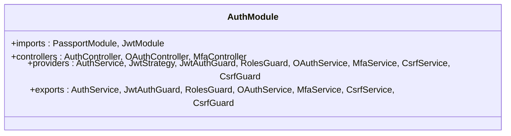

**Diagram sources**
- [auth.module.ts:17-51](file://apps/api/src/modules/auth/auth.module.ts#L17-L51)

**Section sources**
- [auth.module.ts:17-51](file://apps/api/src/modules/auth/auth.module.ts#L17-L51)

### Questionnaire Module
Provides questionnaire domain services and controllers. Exports the questionnaire service for consumption by other modules (e.g., session orchestration).

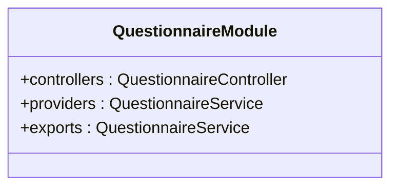

**Diagram sources**
- [questionnaire.module.ts:5-9](file://apps/api/src/modules/questionnaire/questionnaire.module.ts#L5-L9)

**Section sources**
- [questionnaire.module.ts:5-9](file://apps/api/src/modules/questionnaire/questionnaire.module.ts#L5-L9)

### Scoring Engine Module
Implements risk-weighted readiness scoring with explicit formulas. Imports database and cache modules. Exports the scoring engine service for use by other modules.

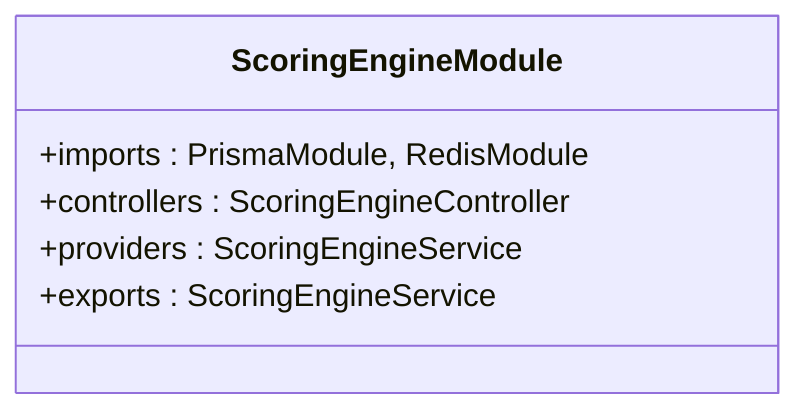

**Diagram sources**
- [scoring-engine.module.ts:16-21](file://apps/api/src/modules/scoring-engine/scoring-engine.module.ts#L16-L21)

**Section sources**
- [scoring-engine.module.ts:16-21](file://apps/api/src/modules/scoring-engine/scoring-engine.module.ts#L16-L21)

### Document Generator Module
Provides document generation, compilation, storage, rendering, and AI content services. Exports multiple specialized services for downstream consumers.

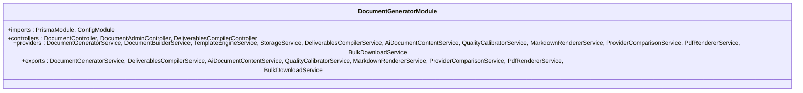

**Diagram sources**
- [document-generator.module.ts:19-45](file://apps/api/src/modules/document-generator/document-generator.module.ts#L19-L45)

**Section sources**
- [document-generator.module.ts:19-45](file://apps/api/src/modules/document-generator/document-generator.module.ts#L19-L45)

### Admin Module
Provides administrative controllers and services for managing questionnaires and auditing. Depends on the database module.

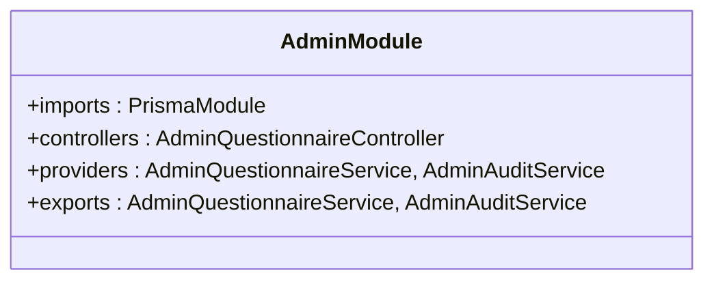

**Diagram sources**
- [admin.module.ts:7-12](file://apps/api/src/modules/admin/admin.module.ts#L7-L12)

**Section sources**
- [admin.module.ts:7-12](file://apps/api/src/modules/admin/admin.module.ts#L7-L12)

### Adaptive Logic Module
Implements adaptive evaluation logic and depends on the session module using forward references to avoid circular dependencies.

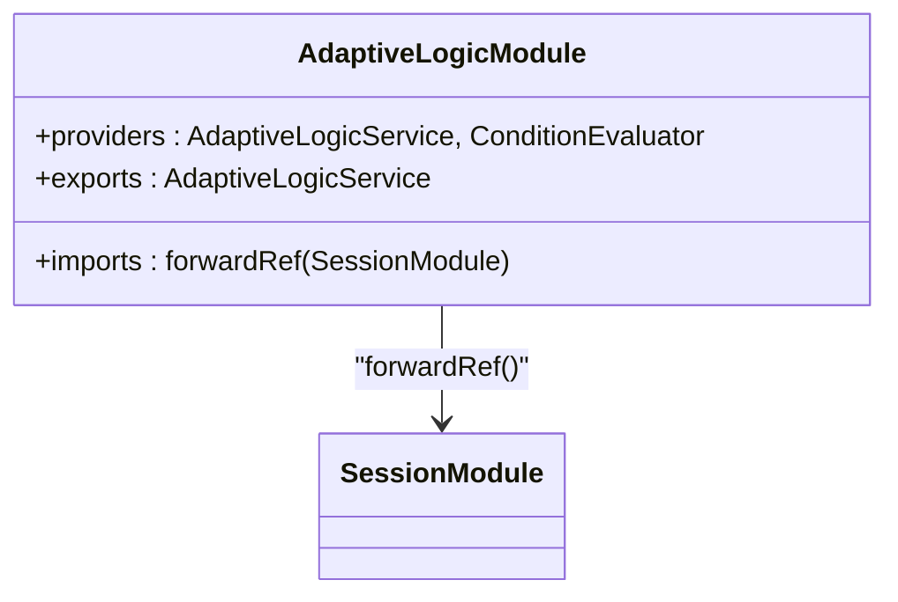

**Diagram sources**
- [adaptive-logic.module.ts:6-10](file://apps/api/src/modules/adaptive-logic/adaptive-logic.module.ts#L6-L10)
- [session.module.ts:12-22](file://apps/api/src/modules/session/session.module.ts#L12-L22)

**Section sources**
- [adaptive-logic.module.ts:6-10](file://apps/api/src/modules/adaptive-logic/adaptive-logic.module.ts#L6-L10)
- [session.module.ts:12-22](file://apps/api/src/modules/session/session.module.ts#L12-L22)

### Standards Module
Provides standards-related services and controllers, backed by the database module.

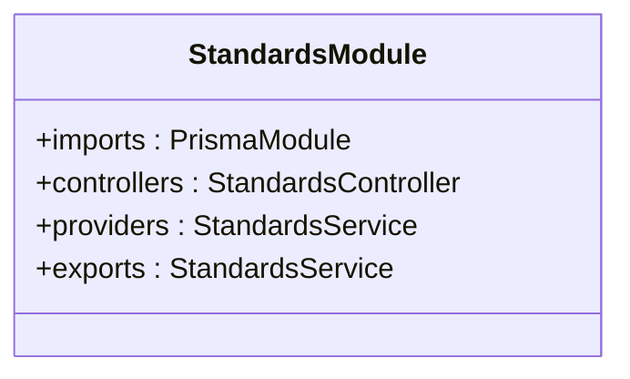

**Diagram sources**
- [standards.module.ts:6-11](file://apps/api/src/modules/standards/standards.module.ts#L6-L11)

**Section sources**
- [standards.module.ts:6-11](file://apps/api/src/modules/standards/standards.module.ts#L6-L11)

### Notification Module
A global module providing notification services, controllers, and job services. Exported globally so other modules can consume them without importing the module directly.

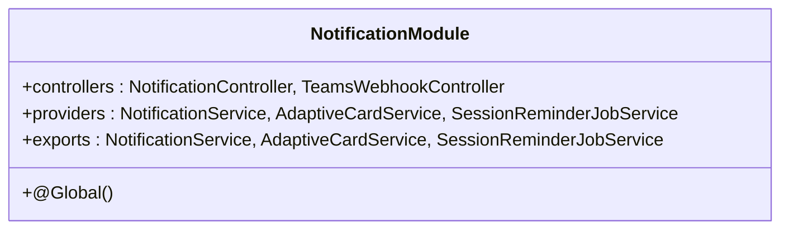

**Diagram sources**
- [notification.module.ts:8-14](file://apps/api/src/modules/notifications/notification.module.ts#L8-L14)

**Section sources**
- [notification.module.ts:8-14](file://apps/api/src/modules/notifications/notification.module.ts#L8-L14)

### Payment Module
Handles Stripe integration for checkout, subscriptions, and billing. Exports payment, subscription, and billing services.

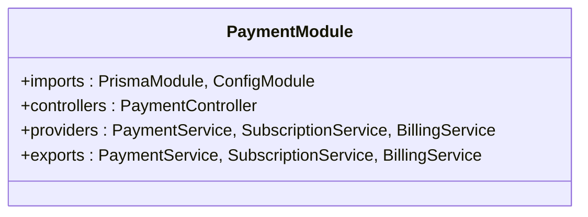

**Diagram sources**
- [payment.module.ts:18-23](file://apps/api/src/modules/payment/payment.module.ts#L18-L23)

**Section sources**
- [payment.module.ts:18-23](file://apps/api/src/modules/payment/payment.module.ts#L18-L23)

### Heatmap Module
Generates gap heatmaps with color-coded cells and export capabilities. Depends on database and cache modules.

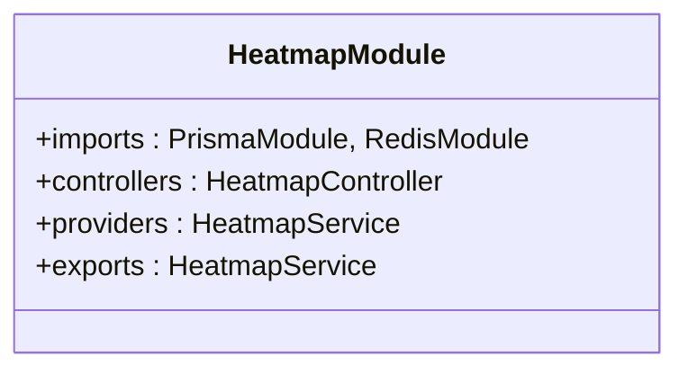

**Diagram sources**
- [heatmap.module.ts:20-25](file://apps/api/src/modules/heatmap/heatmap.module.ts#L20-L25)

**Section sources**
- [heatmap.module.ts:20-25](file://apps/api/src/modules/heatmap/heatmap.module.ts#L20-L25)

### Idea Capture Module
Supports free-form idea submission, AI analysis, and project type recommendations. Depends on configuration for runtime settings.

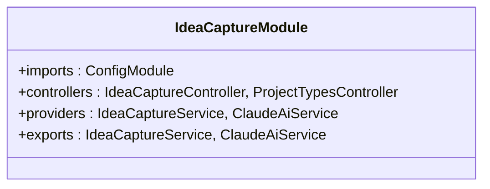

**Diagram sources**
- [idea-capture.module.ts:18-23](file://apps/api/src/modules/idea-capture/idea-capture.module.ts#L18-L23)

**Section sources**
- [idea-capture.module.ts:18-23](file://apps/api/src/modules/idea-capture/idea-capture.module.ts#L18-L23)

### Session Module
Orchestrates questionnaire sessions, conversations, and integrates with adaptive logic, scoring engine, and idea capture modules. Uses forward references to avoid cycles.

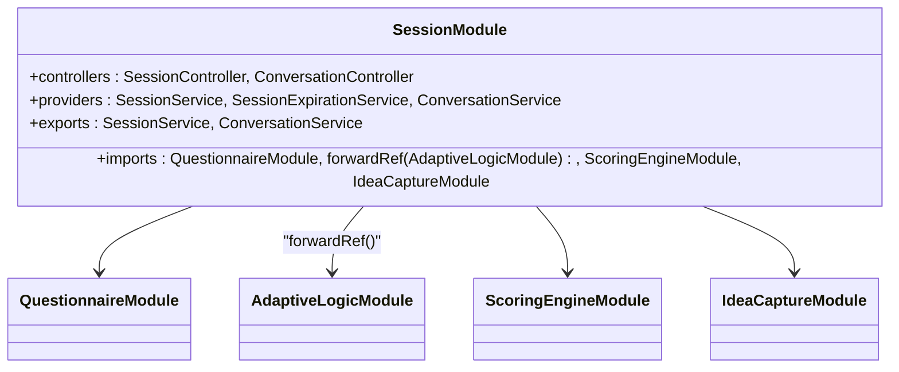

**Diagram sources**
- [session.module.ts:12-22](file://apps/api/src/modules/session/session.module.ts#L12-L22)
- [questionnaire.module.ts:5-9](file://apps/api/src/modules/questionnaire/questionnaire.module.ts#L5-L9)
- [adaptive-logic.module.ts:6-10](file://apps/api/src/modules/adaptive-logic/adaptive-logic.module.ts#L6-L10)
- [scoring-engine.module.ts:16-21](file://apps/api/src/modules/scoring-engine/scoring-engine.module.ts#L16-L21)
- [idea-capture.module.ts:18-23](file://apps/api/src/modules/idea-capture/idea-capture.module.ts#L18-L23)

**Section sources**
- [session.module.ts:12-22](file://apps/api/src/modules/session/session.module.ts#L12-L22)

### Users Module
Provides user management and GDPR-related controllers and services.

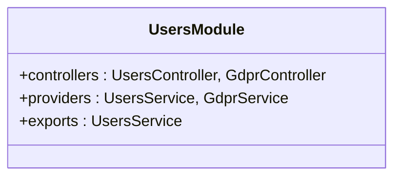

**Diagram sources**
- [users.module.ts:7-11](file://apps/api/src/modules/users/users.module.ts#L7-L11)

**Section sources**
- [users.module.ts:7-11](file://apps/api/src/modules/users/users.module.ts#L7-L11)

### Projects Module
Manages multi-project workspace APIs backed by the database module.

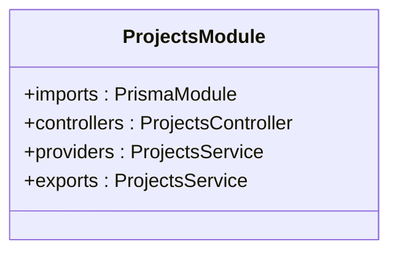

**Diagram sources**
- [projects.module.ts:12-17](file://apps/api/src/modules/projects/projects.module.ts#L12-L17)

**Section sources**
- [projects.module.ts:12-17](file://apps/api/src/modules/projects/projects.module.ts#L12-L17)

### AI Gateway Module
Provides unified AI capabilities across providers, cost tracking, and streaming responses.

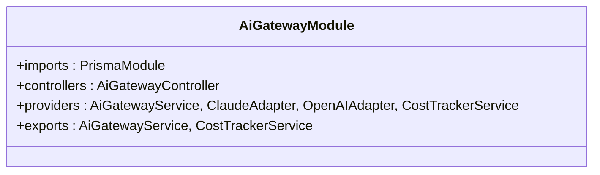

**Diagram sources**
- [ai-gateway.module.ts:19-24](file://apps/api/src/modules/ai-gateway/ai-gateway.module.ts#L19-L24)

**Section sources**
- [ai-gateway.module.ts:19-24](file://apps/api/src/modules/ai-gateway/ai-gateway.module.ts#L19-L24)

### Feature Flags and Dynamic Loading
The application supports dynamic module loading controlled by environment variables and includes a comprehensive feature flags configuration system with LaunchDarkly integration patterns.

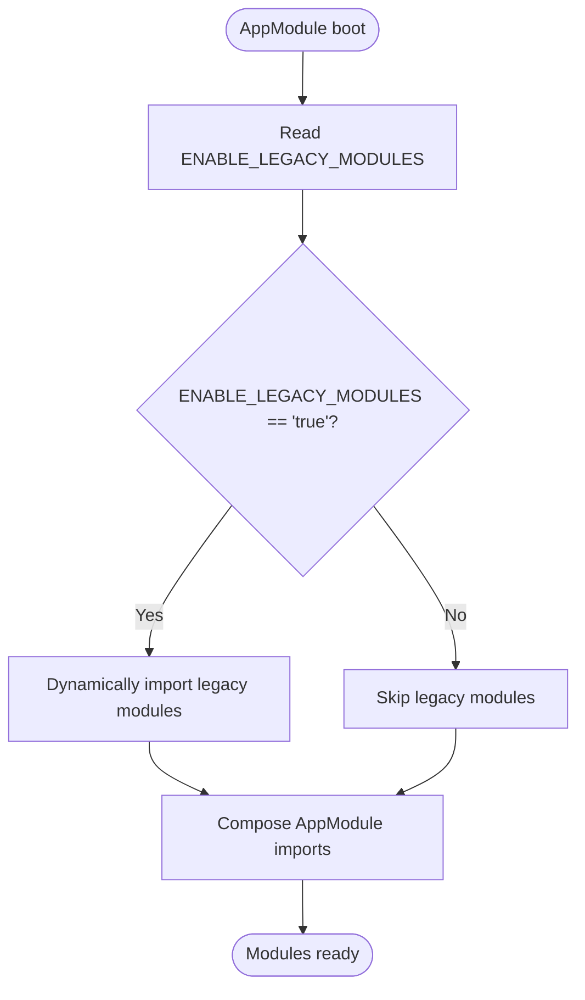

**Diagram sources**
- [app.module.ts:36-51](file://apps/api/src/app.module.ts#L36-L51)

**Section sources**
- [app.module.ts:36-51](file://apps/api/src/app.module.ts#L36-L51)
- [feature-flags.config.ts:198-220](file://apps/api/src/config/feature-flags.config.ts#L198-L220)
- [feature-flags.config.ts:229-596](file://apps/api/src/config/feature-flags.config.ts#L229-L596)

### Module Lifecycle and Memory Management
Modules participate in NestJS lifecycle hooks. A dedicated memory optimization service monitors and manages memory usage during long-running operations.

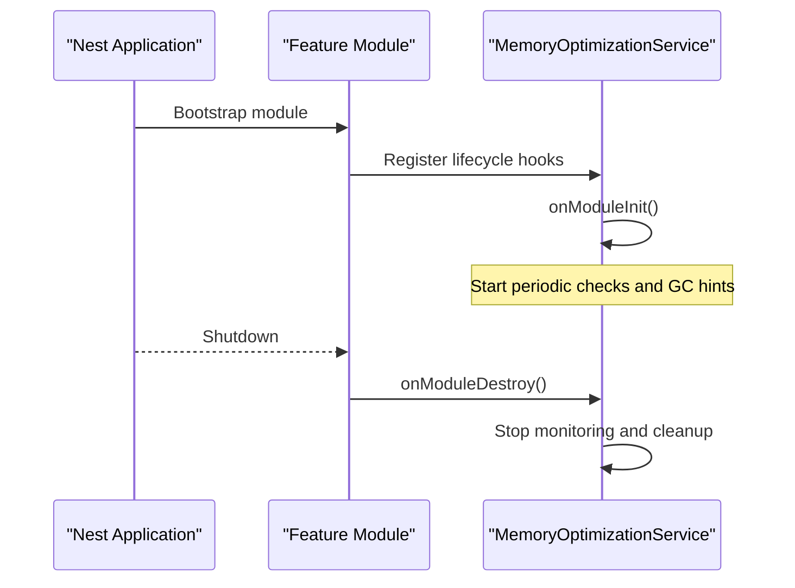

**Diagram sources**
- [memory-optimization.service.ts:28-36](file://apps/api/src/common/services/memory-optimization.service.ts#L28-L36)
- [memory-optimization.service.ts:33-35](file://apps/api/src/common/services/memory-optimization.service.ts#L33-L35)

**Section sources**
- [memory-optimization.service.ts:13-36](file://apps/api/src/common/services/memory-optimization.service.ts#L13-L36)

## Dependency Analysis
Inter-module dependencies are primarily established through imports and exports. Forward references are used to break potential circular dependencies. The central module composes all modules and registers cross-cutting concerns.

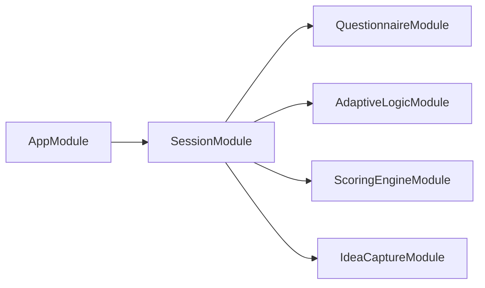

**Diagram sources**
- [session.module.ts:12-22](file://apps/api/src/modules/session/session.module.ts#L12-L22)
- [adaptive-logic.module.ts:6-10](file://apps/api/src/modules/adaptive-logic/adaptive-logic.module.ts#L6-L10)
- [questionnaire.module.ts:5-9](file://apps/api/src/modules/questionnaire/questionnaire.module.ts#L5-L9)
- [scoring-engine.module.ts:16-21](file://apps/api/src/modules/scoring-engine/scoring-engine.module.ts#L16-L21)
- [idea-capture.module.ts:18-23](file://apps/api/src/modules/idea-capture/idea-capture.module.ts#L18-L23)

**Section sources**
- [session.module.ts:12-22](file://apps/api/src/modules/session/session.module.ts#L12-L22)
- [adaptive-logic.module.ts:6-10](file://apps/api/src/modules/adaptive-logic/adaptive-logic.module.ts#L6-L10)

## Performance Considerations
- Lazy loading: Feature modules are only loaded when needed (e.g., conditional legacy modules). This reduces startup time and memory footprint for deployments where certain features are disabled.
- Caching: Modules like the scoring engine and heatmap integrate with Redis for fast computation results and reduced database load.
- Memory optimization: A dedicated service performs periodic GC hints and memory monitoring to prevent leaks in long-running processes.
- Rate limiting: Application-wide throttling guards protect endpoints from abuse.
- Logging: Structured logging with Pino improves observability and helps detect performance bottlenecks.

[No sources needed since this section provides general guidance]

## Troubleshooting Guide
- Feature flags not taking effect: Verify environment variables controlling feature flags and ensure the configuration is loaded at startup.
- Module not found errors: Confirm that conditional modules are enabled via environment variables before importing them.
- Memory pressure: Monitor memory usage via the memory optimization service and adjust GC intervals or cache TTLs as needed.
- Cross-module dependency issues: Use forward references for modules that would otherwise create circular dependencies.

**Section sources**
- [app.module.ts:36-51](file://apps/api/src/app.module.ts#L36-L51)
- [memory-optimization.service.ts:41-107](file://apps/api/src/common/services/memory-optimization.service.ts#L41-L107)

## Conclusion
The module system cleanly separates concerns across 20+ feature domains while enabling controlled inter-module communication. The central application module orchestrates configuration, infrastructure, and feature modules, with dynamic loading and feature flags supporting flexible deployments. Encapsulation is enforced through explicit exports, and lifecycle hooks ensure proper initialization and shutdown. Together, these patterns support a scalable, maintainable, and observable modular monolith.