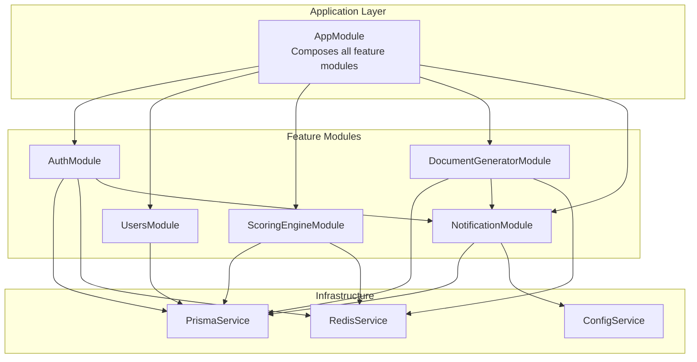
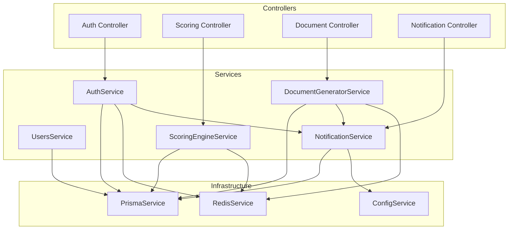
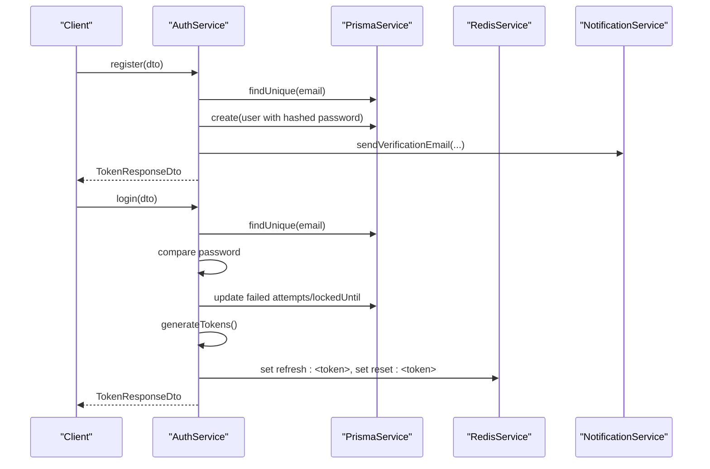
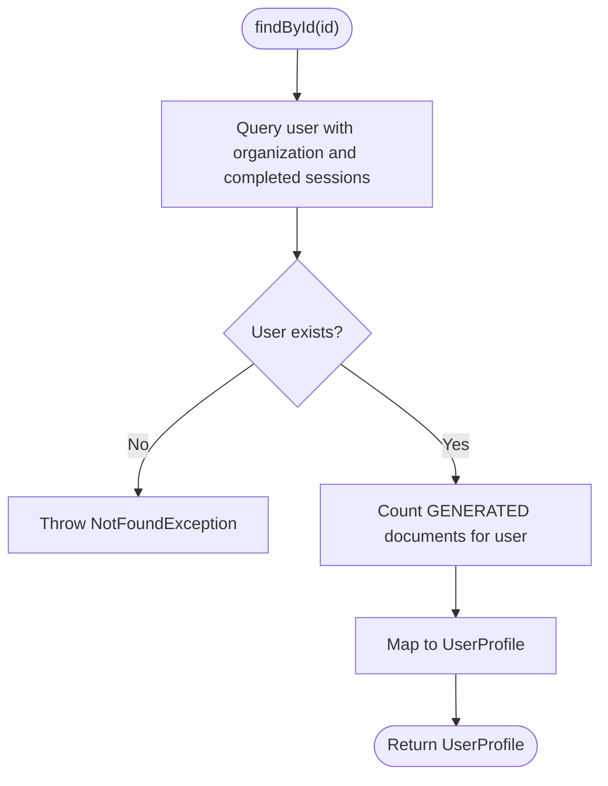
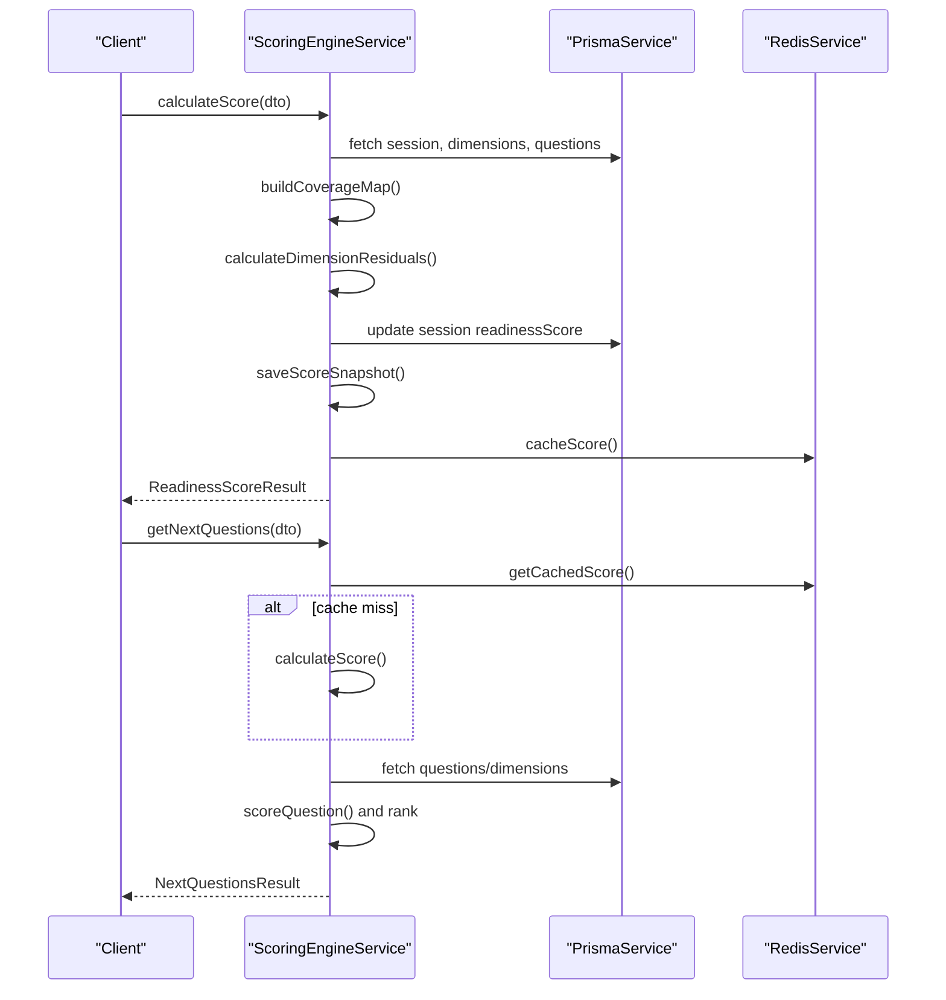
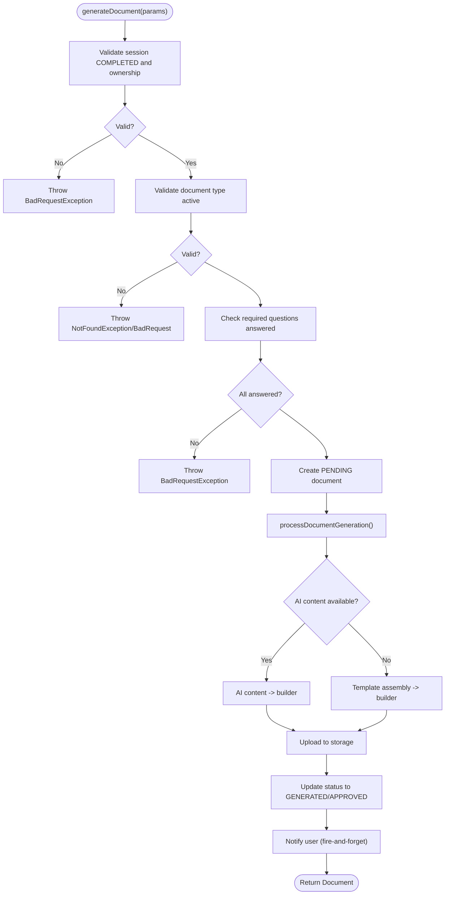
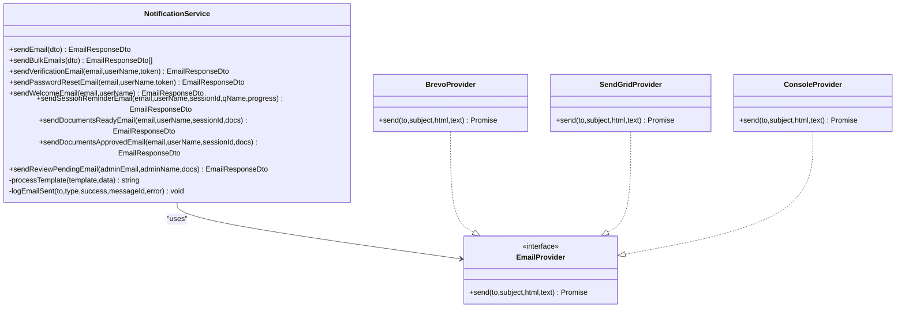
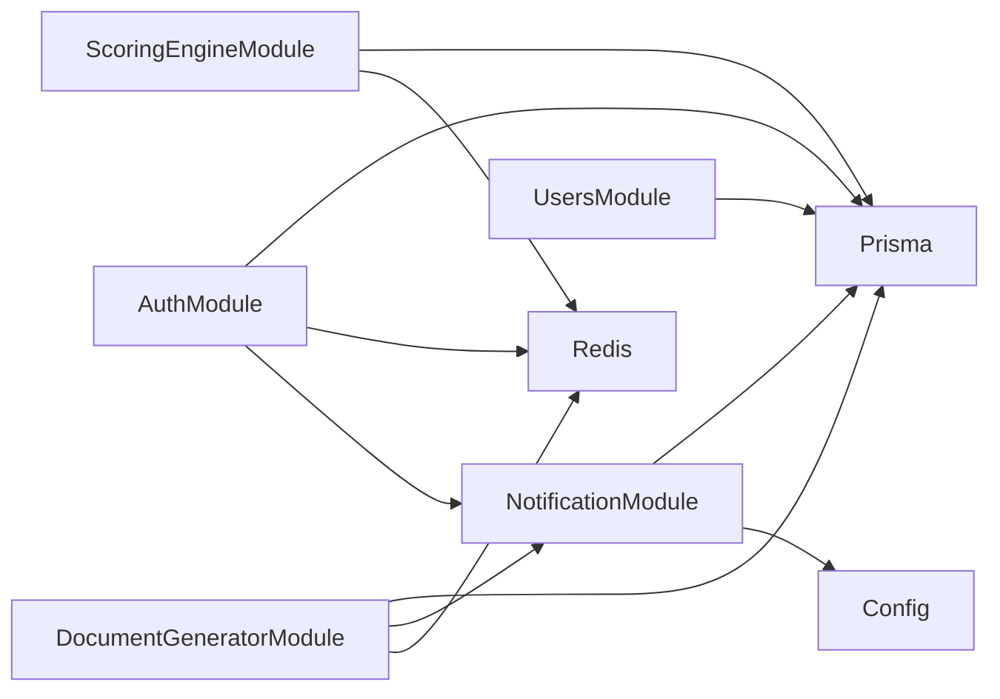

# Service Layer Architecture

<cite>
**Referenced Files in This Document**
- [app.module.ts](file://apps/api/src/app.module.ts)
- [auth.module.ts](file://apps/api/src/modules/auth/auth.module.ts)
- [auth.service.ts](file://apps/api/src/modules/auth/auth.service.ts)
- [users.module.ts](file://apps/api/src/modules/users/users.module.ts)
- [users.service.ts](file://apps/api/src/modules/users/users.service.ts)
- [document-generator.module.ts](file://apps/api/src/modules/document-generator/document-generator.module.ts)
- [document-generator.service.ts](file://apps/api/src/modules/document-generator/services/document-generator.service.ts)
- [scoring-engine.module.ts](file://apps/api/src/modules/scoring-engine/scoring-engine.module.ts)
- [scoring-engine.service.ts](file://apps/api/src/modules/scoring-engine/scoring-engine.service.ts)
- [notification.module.ts](file://apps/api/src/modules/notifications/notification.module.ts)
- [notification.service.ts](file://apps/api/src/modules/notifications/notification.service.ts)
- [task-queue.ts](file://libs/orchestrator/src/engine/task-queue.ts)
- [transaction-concurrency.test.ts](file://apps/api/test/integration/transaction-concurrency.test.ts)
</cite>

## Table of Contents
1. [Introduction](#introduction)
2. [Project Structure](#project-structure)
3. [Core Components](#core-components)
4. [Architecture Overview](#architecture-overview)
5. [Detailed Component Analysis](#detailed-component-analysis)
6. [Dependency Analysis](#dependency-analysis)
7. [Performance Considerations](#performance-considerations)
8. [Troubleshooting Guide](#troubleshooting-guide)
9. [Conclusion](#conclusion)

## Introduction
This document explains the service layer architecture used throughout the backend. It focuses on how business logic is encapsulated in dedicated services with clear interfaces and responsibilities, how dependency injection is applied, how transactions and caching are managed, and how services communicate with each other and external systems. It also covers error handling patterns, service composition, asynchronous operations, background job processing, testing approaches, and performance optimization techniques.

## Project Structure
The backend is organized as a NestJS monolith with modularized feature domains. Each domain exposes a module that declares providers (services), controllers, and DTOs. The central application module composes all feature modules and registers infrastructure providers such as the database and Redis.

**Diagram sources**
- [app.module.ts:53-129](file://apps/api/src/app.module.ts#L53-L129)
- [auth.module.ts:17-51](file://apps/api/src/modules/auth/auth.module.ts#L17-L51)
- [users.module.ts:7-12](file://apps/api/src/modules/users/users.module.ts#L7-L12)
- [scoring-engine.module.ts:16-22](file://apps/api/src/modules/scoring-engine/scoring-engine.module.ts#L16-L22)
- [document-generator.module.ts:19-46](file://apps/api/src/modules/document-generator/document-generator.module.ts#L19-L46)
- [notification.module.ts:8-14](file://apps/api/src/modules/notifications/notification.module.ts#L8-L14)

**Section sources**
- [app.module.ts:1-130](file://apps/api/src/app.module.ts#L1-L130)

## Core Components
- Service responsibilities are clearly scoped to a single business capability:
  - Authentication and session tokens with refresh token storage in Redis and verification/reset flows with email notifications.
  - User profile management with access control and statistics aggregation.
  - Scoring engine orchestrating readiness calculations, caching, and analytics.
  - Document generation pipeline integrating AI content, templating, storage, and notifications.
  - Notification service abstracting email providers and audit logging.

- Dependency injection:
  - Services declare dependencies via constructor injection and are provided by their respective modules.
  - Cross-module dependencies are exported and imported to enable composition.

- Data access:
  - Services use PrismaService for database operations.
  - RedisService is used for caching and short-lived tokens.

- External integrations:
  - NotificationService integrates with external email providers (Brevo/SendGrid) and logs audit events.

**Section sources**
- [auth.service.ts:37-507](file://apps/api/src/modules/auth/auth.service.ts#L37-L507)
- [users.service.ts:37-203](file://apps/api/src/modules/users/users.service.ts#L37-L203)
- [scoring-engine.service.ts:54-387](file://apps/api/src/modules/scoring-engine/scoring-engine.service.ts#L54-L387)
- [document-generator.service.ts:21-609](file://apps/api/src/modules/document-generator/services/document-generator.service.ts#L21-L609)
- [notification.service.ts:159-471](file://apps/api/src/modules/notifications/notification.service.ts#L159-L471)

## Architecture Overview
The service layer follows a layered architecture:
- Controllers orchestrate requests and delegate to services.
- Services encapsulate business logic and coordinate data access and external calls.
- Infrastructure services (Prisma, Redis) are injected into services as needed.
- Cross-cutting concerns (logging, throttling, CSRF protection) are handled by NestJS guards and interceptors.

**Diagram sources**
- [auth.module.ts:17-51](file://apps/api/src/modules/auth/auth.module.ts#L17-L51)
- [scoring-engine.module.ts:16-22](file://apps/api/src/modules/scoring-engine/scoring-engine.module.ts#L16-L22)
- [document-generator.module.ts:19-46](file://apps/api/src/modules/document-generator/document-generator.module.ts#L19-L46)
- [notification.module.ts:8-14](file://apps/api/src/modules/notifications/notification.module.ts#L8-L14)

## Detailed Component Analysis

### Authentication Service
Responsibilities:
- User registration with password hashing and profile creation.
- Login with credential validation, lockout handling, and token generation.
- Refresh token lifecycle management using Redis and database audit.
- Email verification and password reset flows with token storage in Redis.
- User validation for protected routes.

Key patterns:
- Constructor injection of PrismaService, RedisService, JwtService, ConfigService, and NotificationService.
- Redis used for refresh tokens and temporary tokens (verification/reset).
- Structured error handling with domain-specific exceptions.
- Asynchronous, fire-and-forget notifications.

**Diagram sources**
- [auth.service.ts:64-145](file://apps/api/src/modules/auth/auth.service.ts#L64-L145)
- [auth.service.ts:211-247](file://apps/api/src/modules/auth/auth.service.ts#L211-L247)
- [auth.service.ts:298-358](file://apps/api/src/modules/auth/auth.service.ts#L298-L358)
- [auth.service.ts:423-466](file://apps/api/src/modules/auth/auth.service.ts#L423-L466)

**Section sources**
- [auth.module.ts:17-51](file://apps/api/src/modules/auth/auth.module.ts#L17-L51)
- [auth.service.ts:37-507](file://apps/api/src/modules/auth/auth.service.ts#L37-L507)

### Users Service
Responsibilities:
- Retrieve user profiles with related statistics.
- Update user attributes with permission checks.
- Paginated listing with counts derived from database queries.

Key patterns:
- Constructor injection of PrismaService.
- Permission enforcement via role checks and ownership validation.
- Aggregated statistics computed via joins and counts.

**Diagram sources**
- [users.service.ts:41-73](file://apps/api/src/modules/users/users.service.ts#L41-L73)

**Section sources**
- [users.module.ts:7-12](file://apps/api/src/modules/users/users.module.ts#L7-L12)
- [users.service.ts:37-203](file://apps/api/src/modules/users/users.service.ts#L37-L203)

### Scoring Engine Service
Responsibilities:
- Calculate readiness scores using coverage maps and weighted residuals.
- Provide prioritized next questions using an NQS algorithm.
- Cache scores in Redis and persist snapshots to the database.
- Provide analytics (history, benchmarks).

Key patterns:
- Constructor injection of PrismaService and RedisService.
- Caching with TTL and cache invalidation.
- Batch processing with controlled concurrency.
- Analytics delegation to a separate service.

**Diagram sources**
- [scoring-engine.service.ts:70-164](file://apps/api/src/modules/scoring-engine/scoring-engine.service.ts#L70-L164)
- [scoring-engine.service.ts:170-227](file://apps/api/src/modules/scoring-engine/scoring-engine.service.ts#L170-L227)
- [scoring-engine.service.ts:343-363](file://apps/api/src/modules/scoring-engine/scoring-engine.service.ts#L343-L363)

**Section sources**
- [scoring-engine.module.ts:16-22](file://apps/api/src/modules/scoring-engine/scoring-engine.module.ts#L16-L22)
- [scoring-engine.service.ts:54-387](file://apps/api/src/modules/scoring-engine/scoring-engine.service.ts#L54-L387)

### Document Generator Service
Responsibilities:
- Validate session and document type prerequisites.
- Generate documents either via AI content or template-based rendering.
- Persist document metadata, upload artifacts, and notify users.
- Provide document retrieval, versioning, and admin approval workflows.

Key patterns:
- Constructor injection of PrismaService, template engine, builder, storage, notification, and AI content service.
- Fire-and-forget notifications for user actions.
- Robust error handling with status updates to FAILED.

**Diagram sources**
- [document-generator.service.ts:37-136](file://apps/api/src/modules/document-generator/services/document-generator.service.ts#L37-L136)
- [document-generator.service.ts:142-219](file://apps/api/src/modules/document-generator/services/document-generator.service.ts#L142-L219)

**Section sources**
- [document-generator.module.ts:19-46](file://apps/api/src/modules/document-generator/document-generator.module.ts#L19-L46)
- [document-generator.service.ts:21-609](file://apps/api/src/modules/document-generator/services/document-generator.service.ts#L21-L609)

### Notification Service
Responsibilities:
- Send predefined and custom emails using pluggable providers (Brevo, SendGrid, Console).
- Template processing with variable substitution and loops.
- Audit logging of sent emails.

Key patterns:
- Provider abstraction with interface EmailProvider and multiple implementations.
- Config-driven provider selection.
- Structured logging and audit trail persisted to the database.

**Diagram sources**
- [notification.service.ts:159-471](file://apps/api/src/modules/notifications/notification.service.ts#L159-L471)

**Section sources**
- [notification.module.ts:8-14](file://apps/api/src/modules/notifications/notification.module.ts#L8-L14)
- [notification.service.ts:159-471](file://apps/api/src/modules/notifications/notification.service.ts#L159-L471)

## Dependency Analysis
- Module boundaries:
  - Each feature module declares its providers and exports only what is intended for consumption by other modules.
  - Cross-module dependencies are explicit via imports and exports.

- Service-to-service communication:
  - Services depend on infrastructure services (Prisma, Redis) and on each other through module exports.
  - Example: DocumentGeneratorService depends on NotificationService for user notifications.

- External dependencies:
  - Email provider integrations are abstracted behind a common interface.
  - Configuration drives provider selection and behavior.

**Diagram sources**
- [app.module.ts:53-129](file://apps/api/src/app.module.ts#L53-L129)
- [auth.module.ts:17-51](file://apps/api/src/modules/auth/auth.module.ts#L17-L51)
- [scoring-engine.module.ts:16-22](file://apps/api/src/modules/scoring-engine/scoring-engine.module.ts#L16-L22)
- [document-generator.module.ts:19-46](file://apps/api/src/modules/document-generator/document-generator.module.ts#L19-L46)
- [notification.module.ts:8-14](file://apps/api/src/modules/notifications/notification.module.ts#L8-L14)

**Section sources**
- [app.module.ts:1-130](file://apps/api/src/app.module.ts#L1-L130)

## Performance Considerations
- Caching:
  - Redis is used for refresh tokens, temporary verification/reset tokens, and scoring cache with TTL.
  - Cache invalidation is supported for scoring results.

- Asynchronous operations:
  - Notifications are fire-and-forget to avoid blocking request processing.
  - Document generation is initiated synchronously but could be offloaded to a background job queue.

- Background job processing:
  - A task queue exists in the orchestrator library, indicating potential for moving long-running tasks (e.g., document generation) to background workers.

- Concurrency and transactions:
  - Integration tests demonstrate robust handling of concurrent writes, transaction isolation, and connection pool behavior.

- Recommendations:
  - Offload heavy document generation to a background job queue (see task-queue).
  - Add circuit breakers for external email providers.
  - Implement retry/backoff for transient failures in notifications.

**Section sources**
- [scoring-engine.service.ts:290-324](file://apps/api/src/modules/scoring-engine/scoring-engine.service.ts#L290-L324)
- [scoring-engine.service.ts:343-363](file://apps/api/src/modules/scoring-engine/scoring-engine.service.ts#L343-L363)
- [document-generator.service.ts:215-218](file://apps/api/src/modules/document-generator/services/document-generator.service.ts#L215-L218)
- [task-queue.ts:1-1](file://libs/orchestrator/src/engine/task-queue.ts#L1-L1)
- [transaction-concurrency.test.ts:244-652](file://apps/api/test/integration/transaction-concurrency.test.ts#L244-L652)

## Troubleshooting Guide
- Authentication failures:
  - Verify refresh tokens in Redis and database entries.
  - Check lockout thresholds and failed login attempts.
  - Confirm email verification status for new users.

- Document generation errors:
  - Inspect FAILED status updates and generation metadata.
  - Validate required questions and session completion.
  - Check storage upload URLs and file sizes.

- Scoring anomalies:
  - Invalidate cache if stale results are observed.
  - Review dimension weights and question severity inputs.
  - Check snapshot persistence and analytics queries.

- Notification delivery:
  - Confirm provider configuration (Brevo/SendGrid/Console).
  - Review audit logs for delivery outcomes and errors.

**Section sources**
- [auth.service.ts:147-183](file://apps/api/src/modules/auth/auth.service.ts#L147-L183)
- [auth.service.ts:318-358](file://apps/api/src/modules/auth/auth.service.ts#L318-L358)
- [document-generator.service.ts:114-129](file://apps/api/src/modules/document-generator/services/document-generator.service.ts#L114-L129)
- [scoring-engine.service.ts:290-298](file://apps/api/src/modules/scoring-engine/scoring-engine.service.ts#L290-L298)
- [notification.service.ts:192-241](file://apps/api/src/modules/notifications/notification.service.ts#L192-L241)

## Conclusion
The service layer is designed around clear responsibilities, strong dependency injection, and disciplined use of infrastructure services for data access and caching. Cross-cutting concerns are handled centrally via NestJS guards and interceptors. The architecture supports scalability through caching, asynchronous notifications, and the presence of a background job queue. Robust error handling and integration tests ensure reliability under concurrent workloads.