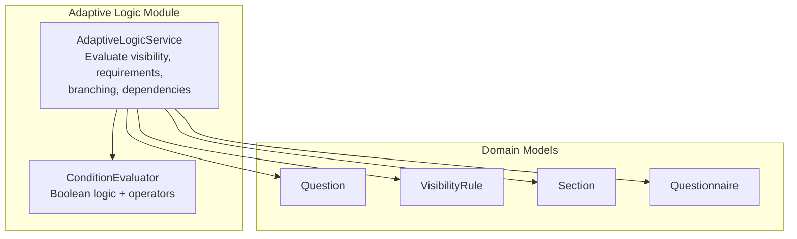
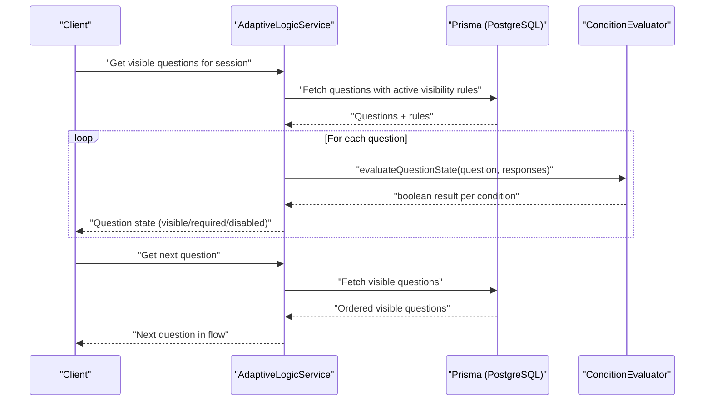
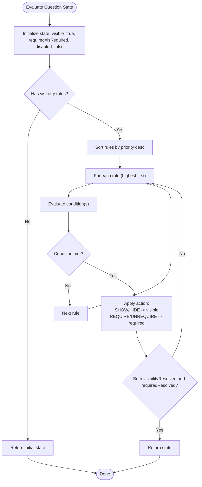
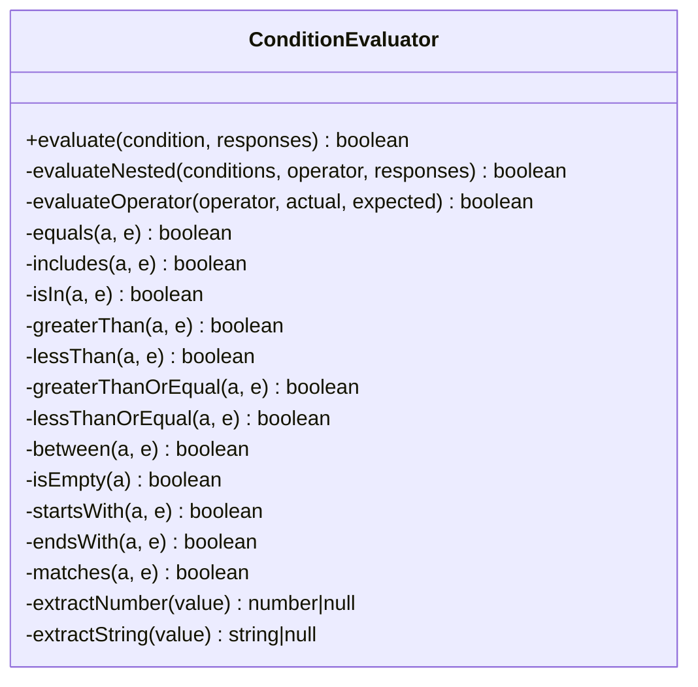
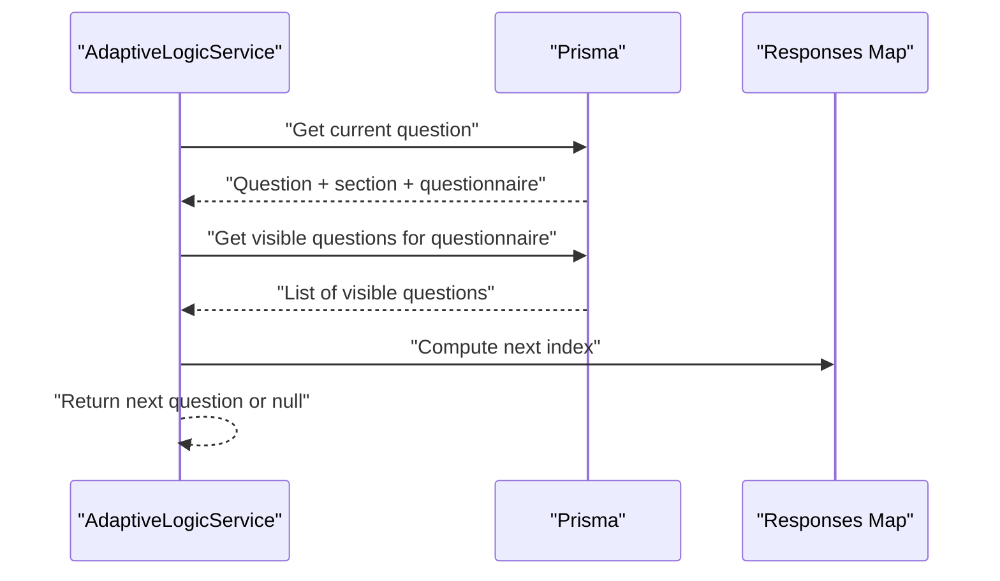
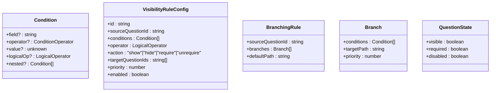
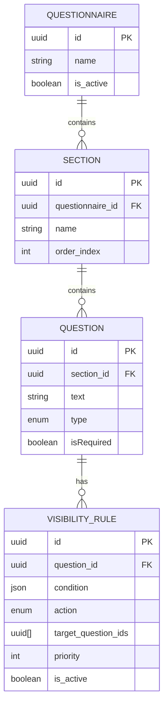
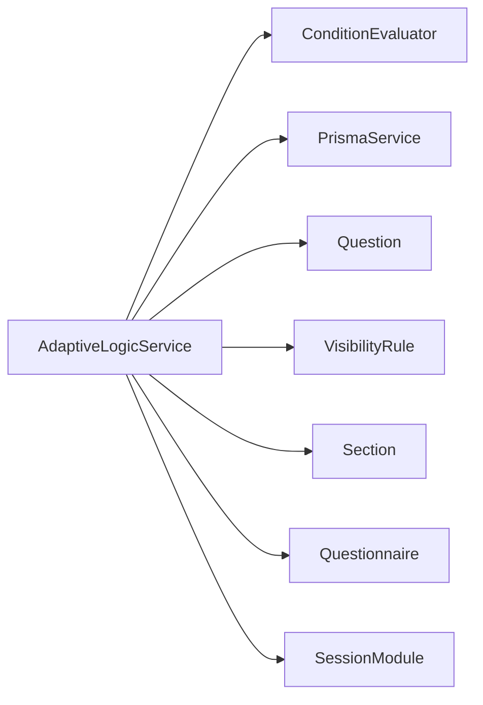

# Adaptive Logic Engine

<cite>
**Referenced Files in This Document**
- [adaptive-logic.module.ts](file://apps/api/src/modules/adaptive-logic/adaptive-logic.module.ts)
- [adaptive-logic.service.ts](file://apps/api/src/modules/adaptive-logic/adaptive-logic.service.ts)
- [condition.evaluator.ts](file://apps/api/src/modules/adaptive-logic/evaluators/condition.evaluator.ts)
- [rule.types.ts](file://apps/api/src/modules/adaptive-logic/types/rule.types.ts)
- [schema.prisma](file://prisma/schema.prisma)
- [adaptive-logic.md](file://docs/questionnaire/adaptive-logic.md)
</cite>

## Table of Contents
1. [Introduction](#introduction)
2. [Project Structure](#project-structure)
3. [Core Components](#core-components)
4. [Architecture Overview](#architecture-overview)
5. [Detailed Component Analysis](#detailed-component-analysis)
6. [Dependency Analysis](#dependency-analysis)
7. [Performance Considerations](#performance-considerations)
8. [Troubleshooting Guide](#troubleshooting-guide)
9. [Conclusion](#conclusion)
10. [Appendices](#appendices)

## Introduction
This document describes the Adaptive Logic Engine responsible for dynamic, rule-driven behavior in the questionnaire system. It covers:
- Condition evaluation with boolean logic and comparison operators
- Visibility rule engine controlling question display
- Conditional branching that redirects users along different paths
- Rule types: simple conditions, complex expressions, and multi-field validations
- Rule syntax, evaluation algorithms, and performance optimization
- Integration with questionnaire builders and real-time rule application during user interaction

## Project Structure
The Adaptive Logic Engine is implemented as a NestJS module with a service and an evaluator, backed by Prisma models and documented in domain specs.

**Diagram sources**
- [adaptive-logic.module.ts:1-12](file://apps/api/src/modules/adaptive-logic/adaptive-logic.module.ts#L1-L12)
- [adaptive-logic.service.ts:19-285](file://apps/api/src/modules/adaptive-logic/adaptive-logic.service.ts#L19-L285)
- [condition.evaluator.ts:1-382](file://apps/api/src/modules/adaptive-logic/evaluators/condition.evaluator.ts#L1-L382)
- [schema.prisma:446-506](file://prisma/schema.prisma#L446-L506)

**Section sources**
- [adaptive-logic.module.ts:1-12](file://apps/api/src/modules/adaptive-logic/adaptive-logic.module.ts#L1-L12)
- [adaptive-logic.service.ts:29-64](file://apps/api/src/modules/adaptive-logic/adaptive-logic.service.ts#L29-L64)
- [schema.prisma:446-506](file://prisma/schema.prisma#L446-L506)

## Core Components
- AdaptiveLogicService: Orchestrates visibility evaluation, requirement resolution, branching, and dependency analysis. It fetches questions and rules from Prisma, evaluates conditions, and computes next steps.
- ConditionEvaluator: Implements operator dispatch and evaluation for single and nested conditions, including numeric comparisons, inclusion checks, emptiness, and regex matching.
- Rule Types: Define conditions, logical operators, visibility actions, branching rules, and question state.

Key responsibilities:
- Visibility evaluation per question based on active rules and priorities
- Requirement toggling (require/unrequire) when conditions are met
- Determining the next visible question in the flow
- Building dependency graphs from rule conditions
- Calculating adaptive changes across response sets

**Section sources**
- [adaptive-logic.service.ts:69-132](file://apps/api/src/modules/adaptive-logic/adaptive-logic.service.ts#L69-L132)
- [condition.evaluator.ts:9-82](file://apps/api/src/modules/adaptive-logic/evaluators/condition.evaluator.ts#L9-L82)
- [rule.types.ts:4-120](file://apps/api/src/modules/adaptive-logic/types/rule.types.ts#L4-L120)

## Architecture Overview
The engine integrates with the questionnaire domain and session context. Rules are persisted as JSONB and associated with questions. The service resolves visibility and requirement states, then computes navigation and dependencies.

**Diagram sources**
- [adaptive-logic.service.ts:29-64](file://apps/api/src/modules/adaptive-logic/adaptive-logic.service.ts#L29-L64)
- [adaptive-logic.service.ts:137-176](file://apps/api/src/modules/adaptive-logic/adaptive-logic.service.ts#L137-L176)
- [condition.evaluator.ts:9-22](file://apps/api/src/modules/adaptive-logic/evaluators/condition.evaluator.ts#L9-L22)

## Detailed Component Analysis

### Visibility Rule Engine
The visibility engine evaluates a question’s state by applying active rules in priority order. It supports:
- Actions: show, hide, require, unrequire
- Conditions: single or nested with logical AND/OR
- Response value extraction supporting multiple formats (text, selected option ids, numbers, ratings)

**Diagram sources**
- [adaptive-logic.service.ts:69-132](file://apps/api/src/modules/adaptive-logic/adaptive-logic.service.ts#L69-L132)

**Section sources**
- [adaptive-logic.service.ts:69-132](file://apps/api/src/modules/adaptive-logic/adaptive-logic.service.ts#L69-L132)

### Condition Evaluation System
The evaluator supports a rich set of operators and handles nested conditions. It normalizes response values and applies operator-specific logic.

Supported operators:
- Equality: equals, not_equals
- Includes/Contains: includes, contains, not_includes, not_contains
- Membership: in, not_in
- Numeric comparisons: greater_than, less_than, greater_than_or_equal, less_than_or_equal
- Range: between
- Emptiness: is_empty, is_not_empty
- String operations: starts_with, ends_with
- Pattern: matches

**Diagram sources**
- [condition.evaluator.ts:1-382](file://apps/api/src/modules/adaptive-logic/evaluators/condition.evaluator.ts#L1-L382)

**Section sources**
- [condition.evaluator.ts:41-82](file://apps/api/src/modules/adaptive-logic/evaluators/condition.evaluator.ts#L41-L82)
- [condition.evaluator.ts:87-112](file://apps/api/src/modules/adaptive-logic/evaluators/condition.evaluator.ts#L87-L112)
- [condition.evaluator.ts:117-144](file://apps/api/src/modules/adaptive-logic/evaluators/condition.evaluator.ts#L117-L144)
- [condition.evaluator.ts:149-170](file://apps/api/src/modules/adaptive-logic/evaluators/condition.evaluator.ts#L149-L170)
- [condition.evaluator.ts:175-244](file://apps/api/src/modules/adaptive-logic/evaluators/condition.evaluator.ts#L175-L244)
- [condition.evaluator.ts:249-285](file://apps/api/src/modules/adaptive-logic/evaluators/condition.evaluator.ts#L249-L285)
- [condition.evaluator.ts:289-331](file://apps/api/src/modules/adaptive-logic/evaluators/condition.evaluator.ts#L289-L331)
- [condition.evaluator.ts:336-380](file://apps/api/src/modules/adaptive-logic/evaluators/condition.evaluator.ts#L336-L380)

### Conditional Branching Mechanism
Branching determines the next question in the flow based on current responses. The service retrieves visible questions and selects the next one in sequence, enabling downstream navigation.

**Diagram sources**
- [adaptive-logic.service.ts:137-176](file://apps/api/src/modules/adaptive-logic/adaptive-logic.service.ts#L137-L176)

**Section sources**
- [adaptive-logic.service.ts:137-176](file://apps/api/src/modules/adaptive-logic/adaptive-logic.service.ts#L137-L176)

### Rule Types and Syntax
Rule types define the structure for conditions, logical operators, visibility actions, branching rules, and question state.

**Diagram sources**
- [rule.types.ts:38-53](file://apps/api/src/modules/adaptive-logic/types/rule.types.ts#L38-L53)
- [rule.types.ts:58-82](file://apps/api/src/modules/adaptive-logic/types/rule.types.ts#L58-L82)
- [rule.types.ts:87-100](file://apps/api/src/modules/adaptive-logic/types/rule.types.ts#L87-L100)
- [rule.types.ts:105-109](file://apps/api/src/modules/adaptive-logic/types/rule.types.ts#L105-L109)

**Section sources**
- [rule.types.ts:4-28](file://apps/api/src/modules/adaptive-logic/types/rule.types.ts#L4-L28)
- [rule.types.ts:38-53](file://apps/api/src/modules/adaptive-logic/types/rule.types.ts#L38-L53)
- [rule.types.ts:58-82](file://apps/api/src/modules/adaptive-logic/types/rule.types.ts#L58-L82)
- [rule.types.ts:87-100](file://apps/api/src/modules/adaptive-logic/types/rule.types.ts#L87-L100)
- [rule.types.ts:105-109](file://apps/api/src/modules/adaptive-logic/types/rule.types.ts#L105-L109)

### Data Model Integration
Rules are stored as JSONB with fields for condition structure, action, target question IDs, priority, and activation flag. The service queries active rules and sorts by priority.

**Diagram sources**
- [schema.prisma:446-489](file://prisma/schema.prisma#L446-L489)
- [schema.prisma:491-506](file://prisma/schema.prisma#L491-L506)
- [schema.prisma:425-444](file://prisma/schema.prisma#L425-L444)
- [schema.prisma:351-376](file://prisma/schema.prisma#L351-L376)

**Section sources**
- [schema.prisma:491-506](file://prisma/schema.prisma#L491-L506)
- [adaptive-logic.service.ts:29-64](file://apps/api/src/modules/adaptive-logic/adaptive-logic.service.ts#L29-L64)

### Example Rule Syntax and Semantics
- Simple condition: equals/not_equals/in/gt/lt/between/is_empty
- Complex expression: nested conditions with logicalOp AND/OR
- Multi-field validations: use multiple conditions combined with AND/OR
- Visibility actions: show/hide; requirement actions: require/unrequire
- Branching: source question plus branches with priorities and default path

These semantics are derived from the service evaluation logic and documented rule definitions.

**Section sources**
- [adaptive-logic.service.ts:181-204](file://apps/api/src/modules/adaptive-logic/adaptive-logic.service.ts#L181-L204)
- [condition.evaluator.ts:27-39](file://apps/api/src/modules/adaptive-logic/evaluators/condition.evaluator.ts#L27-L39)
- [adaptive-logic.md:29-54](file://docs/questionnaire/adaptive-logic.md#L29-L54)
- [adaptive-logic.md:163-170](file://docs/questionnaire/adaptive-logic.md#L163-L170)

## Dependency Analysis
The Adaptive Logic Module depends on the Session module and uses Prisma for persistence. The service composes the evaluator and interacts with domain models.

**Diagram sources**
- [adaptive-logic.module.ts:1-12](file://apps/api/src/modules/adaptive-logic/adaptive-logic.module.ts#L1-L12)
- [adaptive-logic.service.ts:21-24](file://apps/api/src/modules/adaptive-logic/adaptive-logic.service.ts#L21-L24)

**Section sources**
- [adaptive-logic.module.ts:1-12](file://apps/api/src/modules/adaptive-logic/adaptive-logic.module.ts#L1-L12)
- [adaptive-logic.service.ts:21-24](file://apps/api/src/modules/adaptive-logic/adaptive-logic.service.ts#L21-L24)

## Performance Considerations
- Rule ordering and short-circuiting: Rules are sorted by priority and evaluation stops once both visibility and requirement are resolved.
- Single-pass evaluation: Conditions are evaluated once per rule, with nested conditions expanded via recursion.
- Caching and invalidation: The engine exposes a method to compute adaptive changes between response sets, enabling targeted recomputation.
- Dependency graph building: The service constructs a dependency graph from rule conditions to support efficient recomputation when upstream responses change.

Recommendations:
- Cache question states keyed by response fingerprint to avoid repeated evaluations.
- Invalidate caches for questions that depend on changed fields.
- Precompute and persist dependency graphs for frequently accessed questionnaires.
- Limit rule counts and nesting depth to maintain predictable evaluation times.

**Section sources**
- [adaptive-logic.service.ts:86-88](file://apps/api/src/modules/adaptive-logic/adaptive-logic.service.ts#L86-L88)
- [adaptive-logic.service.ts:209-224](file://apps/api/src/modules/adaptive-logic/adaptive-logic.service.ts#L209-L224)
- [adaptive-logic.service.ts:243-273](file://apps/api/src/modules/adaptive-logic/adaptive-logic.service.ts#L243-L273)

## Troubleshooting Guide
Common issues and resolutions:
- Unexpected visibility: Verify rule priority and that earlier rules did not resolve visibility. Check for conflicting rules and ensure operator precedence is correct.
- Requirement not toggling: Confirm the question is visible before requirement evaluation and that the condition matches the response shape.
- Empty or missing responses: Ensure responses are normalized (e.g., selectedOptionId/text/number/rating) and that is_empty checks align with expected shapes.
- Regex errors: Regex operator requires a valid pattern string; invalid patterns return false.
- Numeric comparisons: Non-numeric values coerce to null; comparisons involving null return false.

Operational checks:
- Validate rule JSON structure and active flags.
- Confirm question ordering and section membership.
- Review persona filters if persona-specific questions are involved.

**Section sources**
- [condition.evaluator.ts:318-331](file://apps/api/src/modules/adaptive-logic/evaluators/condition.evaluator.ts#L318-L331)
- [condition.evaluator.ts:336-380](file://apps/api/src/modules/adaptive-logic/evaluators/condition.evaluator.ts#L336-L380)
- [adaptive-logic.service.ts:29-64](file://apps/api/src/modules/adaptive-logic/adaptive-logic.service.ts#L29-L64)

## Conclusion
The Adaptive Logic Engine provides a robust, extensible foundation for dynamic questionnaire behavior. Its modular design, rich operator set, and dependency-aware evaluation enable personalized, efficient user experiences. By leveraging caching, dependency graphs, and clear rule semantics, the system scales to complex branching scenarios while remaining maintainable and testable.

## Appendices

### API Surface for Navigation
- Endpoint pattern for fetching next questions supports optional filters (count, dimension, persona). This enables real-time navigation updates during user interaction.

**Section sources**
- [adaptive-logic.service.ts:137-176](file://apps/api/src/modules/adaptive-logic/adaptive-logic.service.ts#L137-L176)