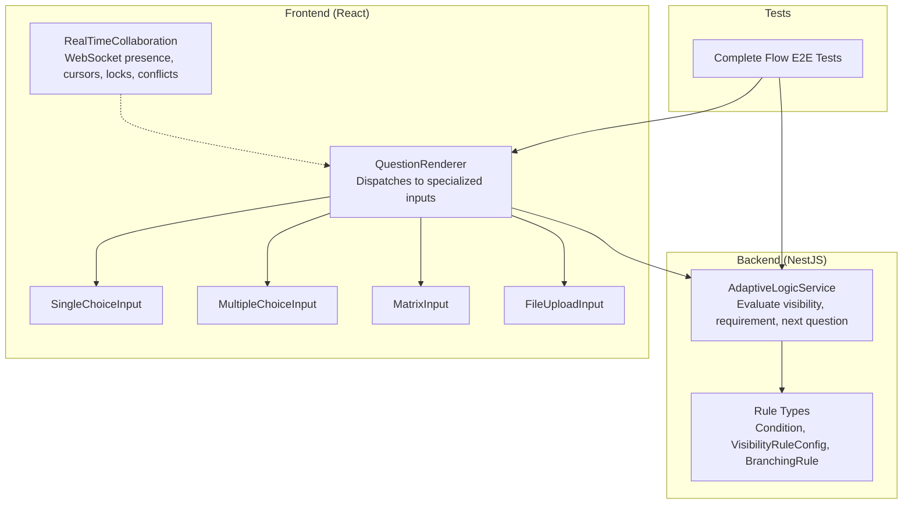
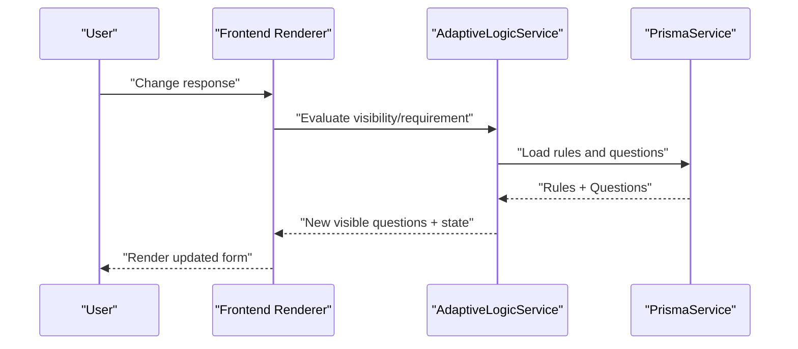
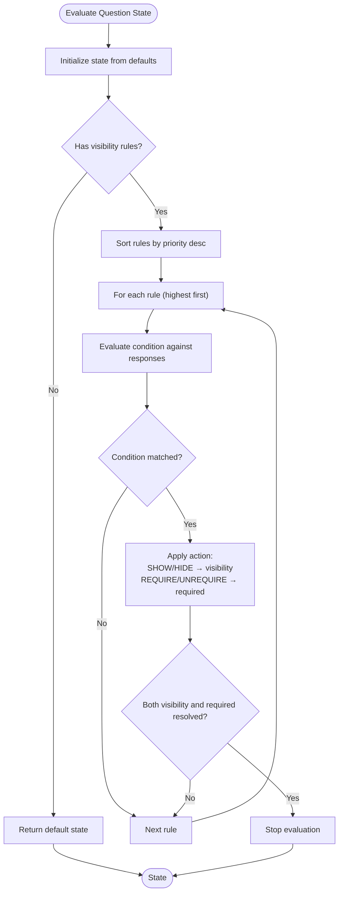
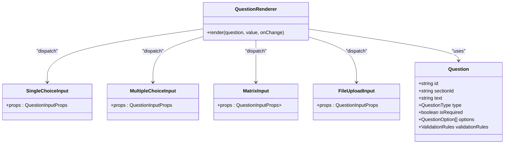
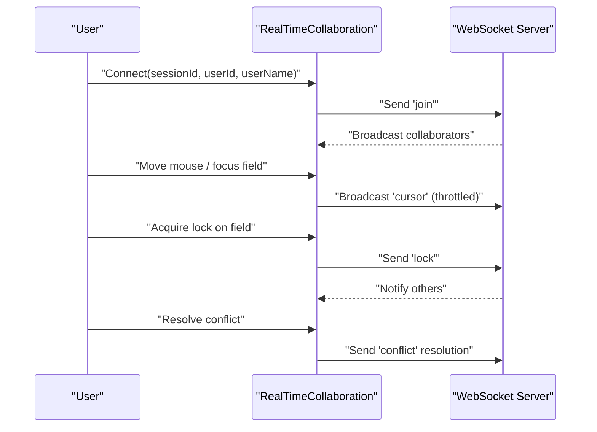
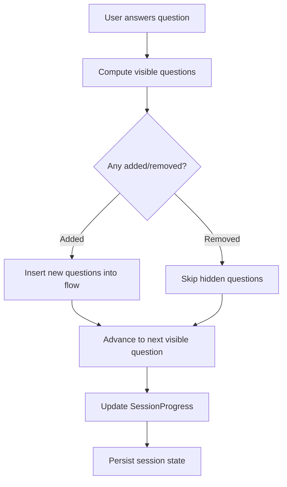
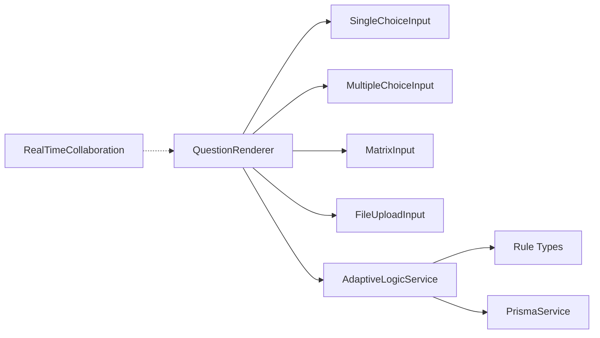

# Adaptive Questionnaire System

<cite>
**Referenced Files in This Document**
- [adaptive-logic.service.ts](file://apps/api/src/modules/adaptive-logic/adaptive-logic.service.ts)
- [rule.types.ts](file://apps/api/src/modules/adaptive-logic/types/rule.types.ts)
- [adaptive-logic.md](file://docs/questionnaire/adaptive-logic.md)
- [questionnaire.ts](file://apps/web/src/types/questionnaire.ts)
- [QuestionRenderer.tsx](file://apps/web/src/components/questionnaire/QuestionRenderer.tsx)
- [SingleChoiceInput.tsx](file://apps/web/src/components/questionnaire/SingleChoiceInput.tsx)
- [MultipleChoiceInput.tsx](file://apps/web/src/components/questionnaire/MultipleChoiceInput.tsx)
- [MatrixInput.tsx](file://apps/web/src/components/questionnaire/MatrixInput.tsx)
- [FileUploadInput.tsx](file://apps/web/src/components/questionnaire/FileUploadInput.tsx)
- [RealTimeCollaboration.tsx](file://apps/web/src/components/collaboration/RealTimeCollaboration.tsx)
- [index.ts](file://apps/web/src/components/collaboration/index.ts)
- [complete-flow.e2e.test.ts](file://e2e/questionnaire/complete-flow.e2e.test.ts)
</cite>

## Table of Contents
1. [Introduction](#introduction)
2. [Project Structure](#project-structure)
3. [Core Components](#core-components)
4. [Architecture Overview](#architecture-overview)
5. [Detailed Component Analysis](#detailed-component-analysis)
6. [Dependency Analysis](#dependency-analysis)
7. [Performance Considerations](#performance-considerations)
8. [Troubleshooting Guide](#troubleshooting-guide)
9. [Conclusion](#conclusion)
10. [Appendices](#appendices)

## Introduction
This document describes the adaptive questionnaire system, covering the 11 supported question types, the adaptive logic engine for conditional branching and dynamic form construction, session management with auto-save and resume, collaborative editing, questionnaire flow and progress tracking, completion analytics, frontend rendering components, backend APIs, and operational best practices for performance, accessibility, and integrations.

## Project Structure
The system comprises:
- Backend (NestJS): Adaptive logic service, rule types, and database queries for visibility, requirement, and branching rules.
- Frontend (React): Question renderer and specialized input components for each question type, plus collaboration utilities.
- E2E tests: Validate end-to-end flows including question types and session progression.

**Diagram sources**
- [adaptive-logic.service.ts:1-285](file://apps/api/src/modules/adaptive-logic/adaptive-logic.service.ts#L1-L285)
- [rule.types.ts:1-120](file://apps/api/src/modules/adaptive-logic/types/rule.types.ts#L1-L120)
- [QuestionRenderer.tsx:106-158](file://apps/web/src/components/questionnaire/QuestionRenderer.tsx#L106-L158)
- [SingleChoiceInput.tsx:1-52](file://apps/web/src/components/questionnaire/SingleChoiceInput.tsx#L1-L52)
- [MultipleChoiceInput.tsx:1-56](file://apps/web/src/components/questionnaire/MultipleChoiceInput.tsx#L1-L56)
- [MatrixInput.tsx:1-69](file://apps/web/src/components/questionnaire/MatrixInput.tsx#L1-L69)
- [FileUploadInput.tsx:1-187](file://apps/web/src/components/questionnaire/FileUploadInput.tsx#L1-L187)
- [RealTimeCollaboration.tsx:1-249](file://apps/web/src/components/collaboration/RealTimeCollaboration.tsx#L1-L249)
- [complete-flow.e2e.test.ts:142-177](file://e2e/questionnaire/complete-flow.e2e.test.ts#L142-L177)

**Section sources**
- [adaptive-logic.service.ts:1-285](file://apps/api/src/modules/adaptive-logic/adaptive-logic.service.ts#L1-L285)
- [rule.types.ts:1-120](file://apps/api/src/modules/adaptive-logic/types/rule.types.ts#L1-L120)
- [questionnaire.ts:1-225](file://apps/web/src/types/questionnaire.ts#L1-L225)
- [QuestionRenderer.tsx:106-158](file://apps/web/src/components/questionnaire/QuestionRenderer.tsx#L106-L158)
- [RealTimeCollaboration.tsx:1-249](file://apps/web/src/components/collaboration/RealTimeCollaboration.tsx#L1-L249)
- [complete-flow.e2e.test.ts:142-177](file://e2e/questionnaire/complete-flow.e2e.test.ts#L142-L177)

## Core Components
- Adaptive Logic Engine (backend):
  - Evaluates visibility, requirement, and branching rules.
  - Builds dependency graphs and calculates adaptive changes between response sets.
- Question Types (frontend):
  - Renderer dispatches to specialized inputs for each question type.
  - Includes single/multiple choice, scale, matrix, file upload, and basic text inputs.
- Collaboration (frontend):
  - Real-time presence, cursor broadcasting, edit locks, and conflict resolution.

**Section sources**
- [adaptive-logic.service.ts:29-132](file://apps/api/src/modules/adaptive-logic/adaptive-logic.service.ts#L29-L132)
- [rule.types.ts:38-120](file://apps/api/src/modules/adaptive-logic/types/rule.types.ts#L38-L120)
- [questionnaire.ts:8-22](file://apps/web/src/types/questionnaire.ts#L8-L22)
- [QuestionRenderer.tsx:106-158](file://apps/web/src/components/questionnaire/QuestionRenderer.tsx#L106-L158)
- [RealTimeCollaboration.tsx:59-76](file://apps/web/src/components/collaboration/RealTimeCollaboration.tsx#L59-L76)

## Architecture Overview
The adaptive engine evaluates rules against current responses to compute question visibility and requirement flags. The frontend renders only visible questions and updates dynamically when responses change. Collaboration augments the editing experience with real-time awareness and conflict handling.

**Diagram sources**
- [adaptive-logic.service.ts:29-132](file://apps/api/src/modules/adaptive-logic/adaptive-logic.service.ts#L29-L132)
- [QuestionRenderer.tsx:106-158](file://apps/web/src/components/questionnaire/QuestionRenderer.tsx#L106-L158)

## Detailed Component Analysis

### Adaptive Logic Engine
- Responsibilities:
  - Compute visible questions given current responses.
  - Determine question requirement flags per rule action.
  - Derive next question in flow among visible questions.
  - Detect added/removed questions across response changes.
  - Build dependency graph of rules for optimization.
- Evaluation model:
  - Conditions support equality, inclusion, numeric comparisons, emptiness, prefix/suffix, and regex-like matching.
  - Logical operators AND/OR combine conditions.
  - Priority-driven rule application with early exit when both visibility and requirement are resolved.

**Diagram sources**
- [adaptive-logic.service.ts:69-132](file://apps/api/src/modules/adaptive-logic/adaptive-logic.service.ts#L69-L132)
- [rule.types.ts:38-53](file://apps/api/src/modules/adaptive-logic/types/rule.types.ts#L38-L53)

**Section sources**
- [adaptive-logic.service.ts:29-132](file://apps/api/src/modules/adaptive-logic/adaptive-logic.service.ts#L29-L132)
- [rule.types.ts:38-120](file://apps/api/src/modules/adaptive-logic/types/rule.types.ts#L38-L120)
- [adaptive-logic.md:1-1865](file://docs/questionnaire/adaptive-logic.md#L1-L1865)

### Question Type Definitions and Rendering
- Supported question types include text, textarea, number, email, url, date, single choice, multiple choice, scale, file upload, and matrix.
- The renderer selects the appropriate input component based on question type.
- Specialized inputs:
  - SingleChoiceInput: radio buttons with option labels/descriptions.
  - MultipleChoiceInput: checkboxes allowing multiple selections.
  - MatrixInput: grid of radio buttons organized by rows/columns.
  - FileUploadInput: drag-and-drop zone with preview thumbnails and removal controls.

**Diagram sources**
- [questionnaire.ts:107-128](file://apps/web/src/types/questionnaire.ts#L107-L128)
- [QuestionRenderer.tsx:106-158](file://apps/web/src/components/questionnaire/QuestionRenderer.tsx#L106-L158)
- [SingleChoiceInput.tsx:1-52](file://apps/web/src/components/questionnaire/SingleChoiceInput.tsx#L1-L52)
- [MultipleChoiceInput.tsx:1-56](file://apps/web/src/components/questionnaire/MultipleChoiceInput.tsx#L1-L56)
- [MatrixInput.tsx:1-69](file://apps/web/src/components/questionnaire/MatrixInput.tsx#L1-L69)
- [FileUploadInput.tsx:1-187](file://apps/web/src/components/questionnaire/FileUploadInput.tsx#L1-L187)

**Section sources**
- [questionnaire.ts:8-22](file://apps/web/src/types/questionnaire.ts#L8-L22)
- [QuestionRenderer.tsx:106-158](file://apps/web/src/components/questionnaire/QuestionRenderer.tsx#L106-L158)
- [SingleChoiceInput.tsx:1-52](file://apps/web/src/components/questionnaire/SingleChoiceInput.tsx#L1-L52)
- [MultipleChoiceInput.tsx:1-56](file://apps/web/src/components/questionnaire/MultipleChoiceInput.tsx#L1-L56)
- [MatrixInput.tsx:1-69](file://apps/web/src/components/questionnaire/MatrixInput.tsx#L1-L69)
- [FileUploadInput.tsx:1-187](file://apps/web/src/components/questionnaire/FileUploadInput.tsx#L1-L187)

### Session Management and Collaboration
- Collaboration module provides:
  - Presence tracking and online status.
  - Cursor broadcasting with throttling.
  - Field-level edit locks with expiration.
  - Conflict detection and resolution (local/remote/merge).
  - Join/leave lifecycle via WebSocket messages.
- Barrels exports for collaboration features.

**Diagram sources**
- [RealTimeCollaboration.tsx:187-244](file://apps/web/src/components/collaboration/RealTimeCollaboration.tsx#L187-L244)
- [index.ts:1-8](file://apps/web/src/components/collaboration/index.ts#L1-L8)

**Section sources**
- [RealTimeCollaboration.tsx:1-249](file://apps/web/src/components/collaboration/RealTimeCollaboration.tsx#L1-L249)
- [index.ts:1-8](file://apps/web/src/components/collaboration/index.ts#L1-L8)

### Questionnaire Flow, Progress Tracking, and Completion Analytics
- Flow management:
  - Backend computes next visible question after current response.
  - Frontend renders only visible questions ordered by section and index.
- Progress tracking:
  - SessionProgress includes percentages, counts, and section-level metrics.
  - Responses keyed by questionId with optional coverage metadata.
- Completion analytics:
  - Rule metrics structures support tracking trigger counts and completion rates (see rule types).

**Diagram sources**
- [adaptive-logic.service.ts:209-224](file://apps/api/src/modules/adaptive-logic/adaptive-logic.service.ts#L209-L224)
- [questionnaire.ts:174-197](file://apps/web/src/types/questionnaire.ts#L174-L197)

**Section sources**
- [adaptive-logic.service.ts:137-176](file://apps/api/src/modules/adaptive-logic/adaptive-logic.service.ts#L137-L176)
- [questionnaire.ts:174-197](file://apps/web/src/types/questionnaire.ts#L174-L197)

### Backend APIs and Data Contracts
- Adaptive logic service methods:
  - getVisibleQuestions(questionnaireId, responses, persona?)
  - evaluateQuestionState(question, responses)
  - getNextQuestion(currentQuestionId, responses, persona?)
  - evaluateCondition(condition, responses)
  - evaluateConditions(conditions, operator, responses)
  - calculateAdaptiveChanges(questionnaireId, prev, curr)
  - getRulesForQuestion(questionId)
  - buildDependencyGraph(questionnaireId)
- Rule types:
  - Condition with operators and nested conditions.
  - VisibilityRuleConfig with actions: show, hide, require, unrequire.
  - BranchingRule for flow routing.

**Section sources**
- [adaptive-logic.service.ts:29-285](file://apps/api/src/modules/adaptive-logic/adaptive-logic.service.ts#L29-L285)
- [rule.types.ts:38-120](file://apps/api/src/modules/adaptive-logic/types/rule.types.ts#L38-L120)
- [adaptive-logic.md:1-1865](file://docs/questionnaire/adaptive-logic.md#L1-L1865)

### Frontend Components and Validation
- QuestionRenderer dispatches to:
  - SingleChoiceInput, MultipleChoiceInput, MatrixInput, FileUploadInput, and others.
- Validation rules:
  - Required, min/max length, numeric bounds, regex patterns with custom messages.
- Accessibility:
  - Proper labeling, keyboard navigation, ARIA attributes, and focus management in inputs.

**Section sources**
- [QuestionRenderer.tsx:106-158](file://apps/web/src/components/questionnaire/QuestionRenderer.tsx#L106-L158)
- [questionnaire.ts:94-102](file://apps/web/src/types/questionnaire.ts#L94-L102)
- [SingleChoiceInput.tsx:1-52](file://apps/web/src/components/questionnaire/SingleChoiceInput.tsx#L1-L52)
- [MultipleChoiceInput.tsx:1-56](file://apps/web/src/components/questionnaire/MultipleChoiceInput.tsx#L1-L56)
- [MatrixInput.tsx:1-69](file://apps/web/src/components/questionnaire/MatrixInput.tsx#L1-L69)
- [FileUploadInput.tsx:1-187](file://apps/web/src/components/questionnaire/FileUploadInput.tsx#L1-L187)

### End-to-End Testing Coverage
- E2E tests exercise:
  - Date, number, matrix, and file upload question types.
  - Navigation and submission across question types.

**Section sources**
- [complete-flow.e2e.test.ts:142-177](file://e2e/questionnaire/complete-flow.e2e.test.ts#L142-L177)

## Dependency Analysis
- Backend depends on Prisma for rule and question retrieval, and on a condition evaluator for rule evaluation.
- Frontend depends on the renderer and specialized input components, which in turn depend on shared types.
- Collaboration is decoupled from rendering via a provider pattern.

**Diagram sources**
- [QuestionRenderer.tsx:106-158](file://apps/web/src/components/questionnaire/QuestionRenderer.tsx#L106-L158)
- [adaptive-logic.service.ts:1-25](file://apps/api/src/modules/adaptive-logic/adaptive-logic.service.ts#L1-L25)
- [rule.types.ts:1-120](file://apps/api/src/modules/adaptive-logic/types/rule.types.ts#L1-L120)
- [RealTimeCollaboration.tsx:1-249](file://apps/web/src/components/collaboration/RealTimeCollaboration.tsx#L1-L249)

**Section sources**
- [adaptive-logic.service.ts:1-25](file://apps/api/src/modules/adaptive-logic/adaptive-logic.service.ts#L1-L25)
- [QuestionRenderer.tsx:106-158](file://apps/web/src/components/questionnaire/QuestionRenderer.tsx#L106-L158)
- [RealTimeCollaboration.tsx:1-249](file://apps/web/src/components/collaboration/RealTimeCollaboration.tsx#L1-L249)

## Performance Considerations
- Adaptive evaluation:
  - Sort rules by priority once per question.
  - Short-circuit evaluation when both visibility and requirement are resolved.
  - Use dependency graphs to precompute rule impact and avoid repeated scans.
- Rendering:
  - Memoize computed visibility and requirement flags per question.
  - Debounce or throttle frequent re-renders during rapid input changes.
- Collaboration:
  - Throttle cursor broadcasts to reduce network overhead.
  - Use optimistic updates with conflict resolution to minimize latency.
- Storage:
  - Persist only visible questions per session to reduce payload sizes.
  - Batch rule evaluations when responses change in bulk.

[No sources needed since this section provides general guidance]

## Troubleshooting Guide
- Symptoms: Question does not appear or disappear unexpectedly.
  - Verify rule priorities and logical operators.
  - Confirm condition fields match question IDs and values.
- Symptoms: Requirement flag not updating.
  - Check that rule action is set to require/unrequire.
  - Ensure rule evaluation short-circuits correctly.
- Symptoms: File upload previews missing or errors removing files.
  - Confirm preview URLs are revoked on removal.
  - Validate accepted MIME types and file size limits.
- Symptoms: Collaborative conflicts occur frequently.
  - Adjust lock timeouts and conflict resolution strategies.
  - Ensure clients apply resolutions consistently.

**Section sources**
- [adaptive-logic.service.ts:69-132](file://apps/api/src/modules/adaptive-logic/adaptive-logic.service.ts#L69-L132)
- [rule.types.ts:38-120](file://apps/api/src/modules/adaptive-logic/types/rule.types.ts#L38-L120)
- [FileUploadInput.tsx:56-65](file://apps/web/src/components/questionnaire/FileUploadInput.tsx#L56-L65)
- [RealTimeCollaboration.tsx:246-249](file://apps/web/src/components/collaboration/RealTimeCollaboration.tsx#L246-L249)

## Conclusion
The adaptive questionnaire system combines a robust backend adaptive logic engine with a flexible, extensible frontend rendering pipeline. Together with collaboration features and structured session/state management, it delivers a scalable, accessible, and efficient solution for dynamic, rule-driven forms.

[No sources needed since this section summarizes without analyzing specific files]

## Appendices

### Question Types Reference
- Text, Textarea, Number, Email, URL, Date
- Single Choice, Multiple Choice
- Scale
- File Upload
- Matrix

**Section sources**
- [questionnaire.ts:8-22](file://apps/web/src/types/questionnaire.ts#L8-L22)
- [QuestionRenderer.tsx:106-158](file://apps/web/src/components/questionnaire/QuestionRenderer.tsx#L106-L158)