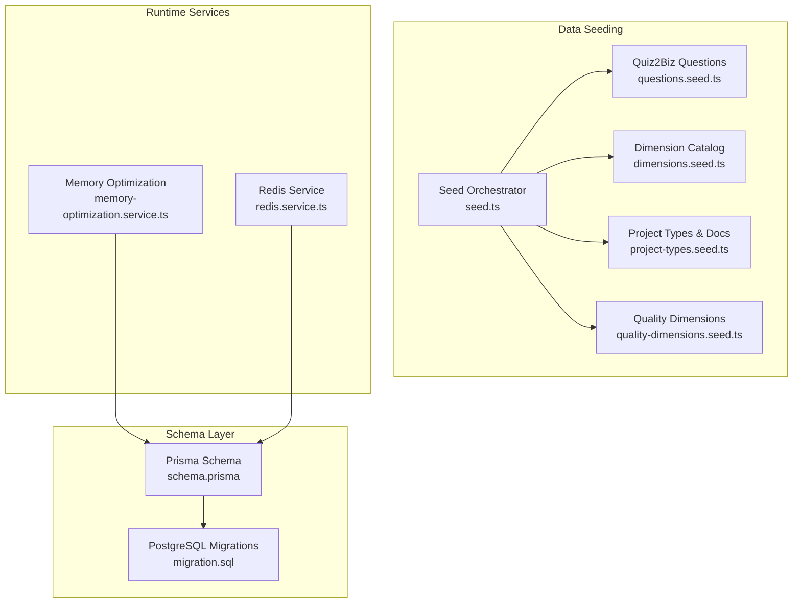
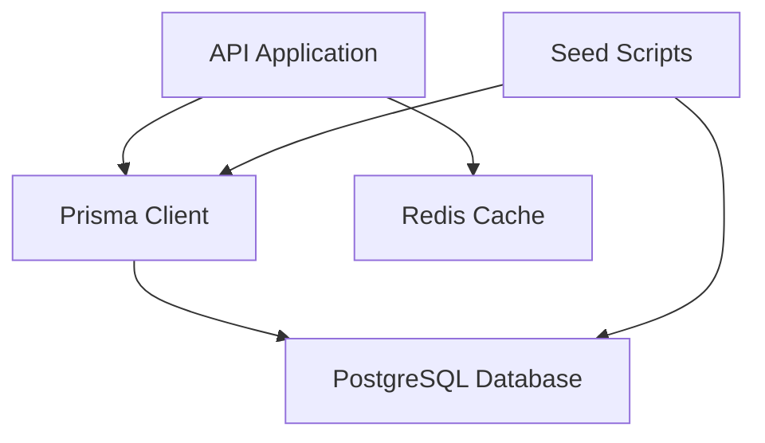
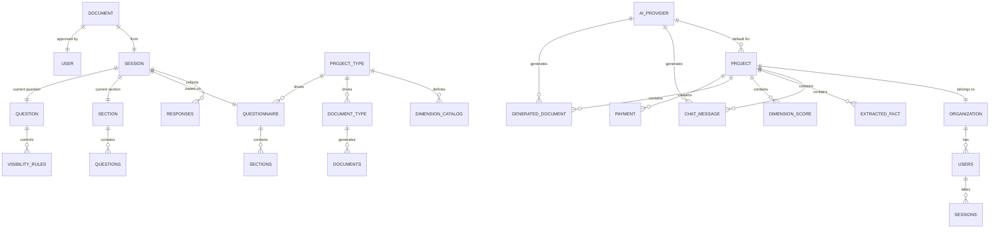
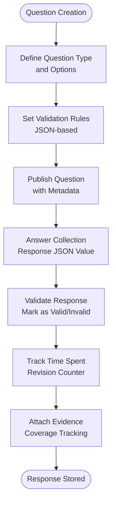
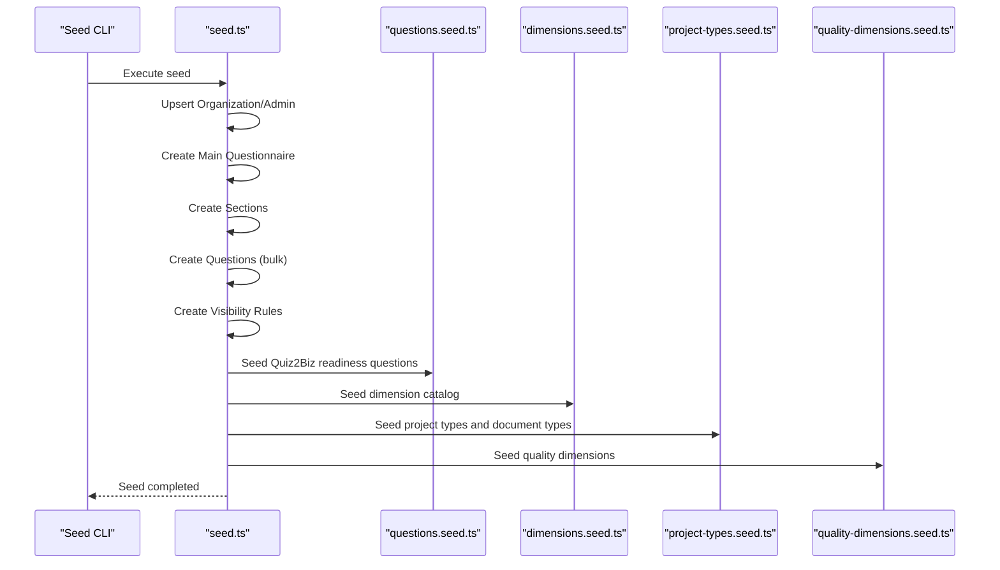
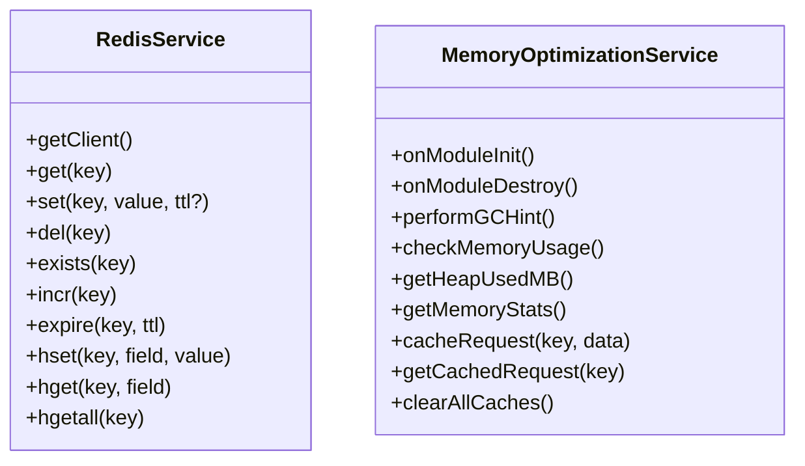
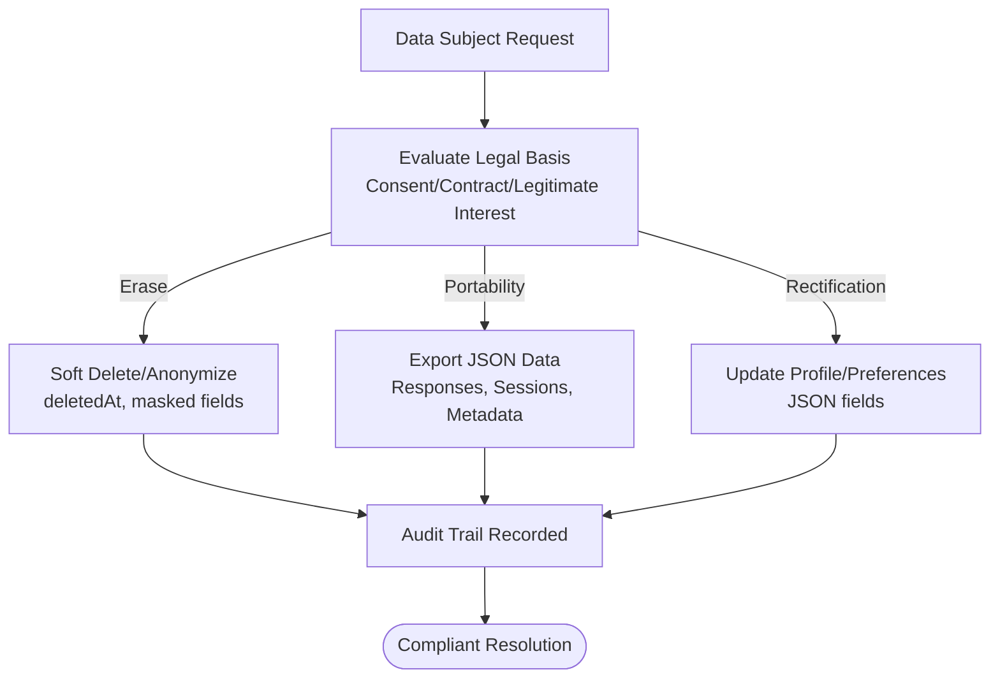
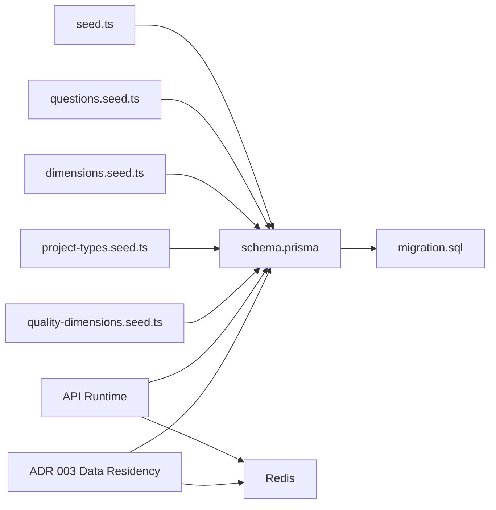

# Data Persistence & Storage

<cite>
**Referenced Files in This Document**
- [schema.prisma](file://prisma/schema.prisma)
- [seed.ts](file://prisma/seed.ts)
- [questions.seed.ts](file://prisma/seeds/questions.seed.ts)
- [dimensions.seed.ts](file://prisma/seeds/dimensions.seed.ts)
- [project-types.seed.ts](file://prisma/seeds/project-types.seed.ts)
- [quality-dimensions.seed.ts](file://prisma/seeds/quality-dimensions.seed.ts)
- [memory-optimization.service.ts](file://apps/api/src/common/services/memory-optimization.service.ts)
- [redis.service.ts](file://libs/redis/src/redis.service.ts)
- [migration.sql](file://prisma/migrations/20260125000000_initial/migration.sql)
- [003-data-residency.md](file://docs/adr/003-data-residency.md)
</cite>

## Table of Contents
1. [Introduction](#introduction)
2. [Project Structure](#project-structure)
3. [Core Components](#core-components)
4. [Architecture Overview](#architecture-overview)
5. [Detailed Component Analysis](#detailed-component-analysis)
6. [Dependency Analysis](#dependency-analysis)
7. [Performance Considerations](#performance-considerations)
8. [Troubleshooting Guide](#troubleshooting-guide)
9. [Conclusion](#conclusion)

## Introduction
This document details the data persistence and storage architecture for the Quiz-to-Build system. It explains the Prisma schema design for questionnaire entities, responses, and metadata tables; the data modeling for questions, answer choices, and response collections; the seeding strategy for initial data including question banks and quality dimensions; storage optimization techniques including memory management and caching; backup and recovery procedures; indexing strategies for query performance; and data retention policies with GDPR compliance features.

## Project Structure
The data persistence layer is primarily defined by:
- Prisma schema for entity modeling and relations
- Seed scripts for initial data setup across multiple domains
- PostgreSQL migration scripts for schema evolution
- Runtime memory optimization and Redis caching services

**Diagram sources**
- [schema.prisma](file://prisma/schema.prisma)
- [migration.sql](file://prisma/migrations/20260125000000_initial/migration.sql)
- [seed.ts](file://prisma/seed.ts)
- [questions.seed.ts](file://prisma/seeds/questions.seed.ts)
- [dimensions.seed.ts](file://prisma/seeds/dimensions.seed.ts)
- [project-types.seed.ts](file://prisma/seeds/project-types.seed.ts)
- [quality-dimensions.seed.ts](file://prisma/seeds/quality-dimensions.seed.ts)
- [memory-optimization.service.ts](file://apps/api/src/common/services/memory-optimization.service.ts)
- [redis.service.ts](file://libs/redis/src/redis.service.ts)

**Section sources**
- [schema.prisma](file://prisma/schema.prisma)
- [seed.ts](file://prisma/seed.ts)
- [migration.sql](file://prisma/migrations/20260125000000_initial/migration.sql)

## Core Components
- Questionnaire domain: Questionnaire, Section, Question, VisibilityRule, Session, Response
- Organization and user domain: Organization, User, RefreshToken, ApiKey, OAuthAccount
- Document and standards domain: DocumentType, Document, EngineeringStandards, DocumentTypeStandards
- Quiz2Biz readiness and quality: DimensionCatalog, EvidenceRegistry, DecisionLog, ScoreSnapshot
- Project types and quality dimensions: ProjectType, QualityDimension
- AI provider and project hub: AiProvider, Project

Key characteristics:
- JSON fields for flexible metadata and configuration
- Strong foreign key relations with cascade and restrict behaviors
- Extensive indexes for query performance on frequently filtered/sorted columns
- Decimal precision for scores and weights to ensure accurate readiness calculations

**Section sources**
- [schema.prisma](file://prisma/schema.prisma)

## Architecture Overview
The system uses PostgreSQL as the primary datastore with Prisma as the ORM. Data is seeded via TypeScript scripts that upsert entities and relationships. At runtime, the API employs memory optimization and Redis caching to reduce database load and improve responsiveness.

**Diagram sources**
- [schema.prisma](file://prisma/schema.prisma)
- [seed.ts](file://prisma/seed.ts)
- [redis.service.ts](file://libs/redis/src/redis.service.ts)

## Detailed Component Analysis

### Prisma Schema Design and Data Modeling
- Enumerations define controlled vocabularies for question types, session states, visibility actions, document categories, and more.
- Entities model the questionnaire lifecycle: Questionnaire → Section → Question → VisibilityRule, and Session → Response.
- Quiz2Biz extensions include DimensionCatalog for readiness scoring, EvidenceRegistry for verifiable artifacts, DecisionLog for append-only records, and Project/ProjectType for multi-project workspace.
- JSON fields store flexible metadata, options, and configuration, enabling dynamic behavior without schema churn.
- Decimal types are used for precise scoring and weights to avoid rounding errors in readiness calculations.

**Diagram sources**
- [schema.prisma](file://prisma/schema.prisma)

**Section sources**
- [schema.prisma](file://prisma/schema.prisma)

### Question and Answer Data Model
- Question supports multiple types (text, textarea, choice variants, file upload, matrix) with JSON options and validation rules.
- Response captures per-session answers with JSON value, validation state, timing, and revision tracking.
- VisibilityRule enables dynamic show/hide/requirment changes based on other answers.
- Persona and dimensionKey connect questions to Quiz2Biz readiness scoring.

**Diagram sources**
- [schema.prisma](file://prisma/schema.prisma)

**Section sources**
- [schema.prisma](file://prisma/schema.prisma)

### Seeding Strategy for Initial Data
The seed orchestrator coordinates:
- Organization and admin user creation
- AI provider configuration
- Main questionnaire with sections and questions
- Visibility rules for adaptive behavior
- Quiz2Biz readiness dimensions and questions
- Project types, document types, and quality dimensions

**Diagram sources**
- [seed.ts](file://prisma/seed.ts)
- [questions.seed.ts](file://prisma/seeds/questions.seed.ts)
- [dimensions.seed.ts](file://prisma/seeds/dimensions.seed.ts)
- [project-types.seed.ts](file://prisma/seeds/project-types.seed.ts)
- [quality-dimensions.seed.ts](file://prisma/seeds/quality-dimensions.seed.ts)

**Section sources**
- [seed.ts](file://prisma/seed.ts)
- [questions.seed.ts](file://prisma/seeds/questions.seed.ts)
- [dimensions.seed.ts](file://prisma/seeds/dimensions.seed.ts)
- [project-types.seed.ts](file://prisma/seeds/project-types.seed.ts)
- [quality-dimensions.seed.ts](file://prisma/seeds/quality-dimensions.seed.ts)

### Indexing Strategies for Query Performance
Indexes are strategically placed to optimize frequent queries:
- Organizations: slug, createdAt
- Users: email, orgId, role, createdAt
- RefreshTokens: token, userId, expiresAt
- ApiKeys: userId, keyPrefix
- OAuthAccounts: userId, provider
- Questionnaires: industry, isActive
- Sections: questionnaireId, (questionnaireId, orderIndex)
- Questions: sectionId, (sectionId, orderIndex), type
- VisibilityRules: questionId
- Sessions: userId, questionnaireId, status, startedAt, (userId, status), readinessScore
- Responses: sessionId, questionId, answeredAt, coverage, coverageLevel
- DocumentTypes: slug, category, isActive
- Documents: sessionId, documentTypeId, status, generatedAt
- AuditLogs: userId, action, (resourceType, resourceId), createdAt
- EngineeringStandards: category, isActive
- DocumentTypeStandards: documentTypeId, standardId

These indexes support:
- Identity and lookup operations
- Filtering by status and time windows
- Join-heavy workflows for questionnaire and response retrieval
- Audit and compliance reporting

**Section sources**
- [schema.prisma](file://prisma/schema.prisma)
- [migration.sql](file://prisma/migrations/20260125000000_initial/migration.sql)

### Caching Layers for Frequently Accessed Questionnaires
The system leverages Redis for caching and memory optimization:
- RedisService provides key-value operations with TTL, hash operations, and existence checks.
- MemoryOptimizationService manages periodic GC hints, memory usage monitoring, and request cache with WeakRef-based eviction and TTL.

**Diagram sources**
- [redis.service.ts](file://libs/redis/src/redis.service.ts)
- [memory-optimization.service.ts](file://apps/api/src/common/services/memory-optimization.service.ts)

**Section sources**
- [redis.service.ts](file://libs/redis/src/redis.service.ts)
- [memory-optimization.service.ts](file://apps/api/src/common/services/memory-optimization.service.ts)

### Backup and Recovery Procedures
Recommended procedures for questionnaire data:
- Database backups: Use managed PostgreSQL backup services to create regular snapshots and point-in-time recovery (PITR).
- Logical exports: Periodically export schema and data using logical backup tools for offsite storage.
- Seed restoration: After restore, re-run seed scripts to populate static catalogs (dimensions, project types, document types) ensuring consistent references.
- Version control: Keep migration scripts and seed data under version control to enable deterministic restores.
- DR site: Maintain a secondary region with synchronized replicas for cross-region recovery.

[No sources needed since this section provides general guidance]

### Data Retention Policies and GDPR Compliance Features
Retention and compliance capabilities:
- Soft deletes: Organization, User, and related entities include deletedAt timestamps for compliance with data subject requests.
- Audit trails: AuditLog captures actions, resource changes, IP address, and user agent for forensic readiness.
- Data subject rights: JSON fields and flexible schemas enable data portability and erasure where applicable.
- Privacy controls: OAuthAccount and user profile fields support consent and preference management.
- Secure defaults: Password hashing, MFA fields, and secure token handling in User and RefreshToken models.

**Section sources**
- [schema.prisma](file://prisma/schema.prisma)

## Dependency Analysis
- Prisma schema defines entities and relations; migrations evolve the schema over time.
- Seed scripts depend on Prisma client to upsert static catalogs and questionnaires.
- API runtime depends on Prisma for data access and Redis/Memory services for performance.
- Infrastructure ADR documents regional data residency and placement of cache and secrets.

**Diagram sources**
- [schema.prisma](file://prisma/schema.prisma)
- [migration.sql](file://prisma/migrations/20260125000000_initial/migration.sql)
- [seed.ts](file://prisma/seed.ts)
- [questions.seed.ts](file://prisma/seeds/questions.seed.ts)
- [dimensions.seed.ts](file://prisma/seeds/dimensions.seed.ts)
- [project-types.seed.ts](file://prisma/seeds/project-types.seed.ts)
- [quality-dimensions.seed.ts](file://prisma/seeds/quality-dimensions.seed.ts)
- [redis.service.ts](file://libs/redis/src/redis.service.ts)
- [003-data-residency.md](file://docs/adr/003-data-residency.md)

**Section sources**
- [schema.prisma](file://prisma/schema.prisma)
- [migration.sql](file://prisma/migrations/20260125000000_initial/migration.sql)
- [seed.ts](file://prisma/seed.ts)
- [003-data-residency.md](file://docs/adr/003-data-residency.md)

## Performance Considerations
- Use indexes on frequently filtered/sorted columns (status, createdAt, userId combinations).
- Normalize joins carefully; JSON fields reduce normalization overhead but require appropriate indexing for filtering.
- Batch operations: leverage bulk upserts in seed scripts to minimize round trips.
- Memory optimization: periodic GC hints and cache TTLs prevent memory bloat during long-running sessions.
- Caching: cache questionnaire metadata and frequently accessed dimensions; invalidate on schema changes.

[No sources needed since this section provides general guidance]

## Troubleshooting Guide
Common issues and resolutions:
- Out-of-memory errors: Monitor heap usage via memory optimization service; trigger GC hints and clear caches after large batch operations.
- Slow queries: Verify indexes exist for filters on sessions, responses, and documents; consider composite indexes for multi-column filters.
- Stale cache: Use Redis service operations to invalidate keys; ensure cache TTL aligns with data volatility.
- Seed failures: Validate seed script dependencies (e.g., dimensions before project types); ensure database connectivity and credentials.

**Section sources**
- [memory-optimization.service.ts](file://apps/api/src/common/services/memory-optimization.service.ts)
- [redis.service.ts](file://libs/redis/src/redis.service.ts)
- [seed.ts](file://prisma/seed.ts)

## Conclusion
The Quiz-to-Build data persistence architecture combines a robust Prisma schema with comprehensive seeding, strong indexing, and runtime caching to support scalable questionnaire workflows. The design balances flexibility (JSON fields) with performance (indexes and caching) and embeds compliance-ready features (soft deletes, audit logs, privacy controls) to meet data protection requirements.