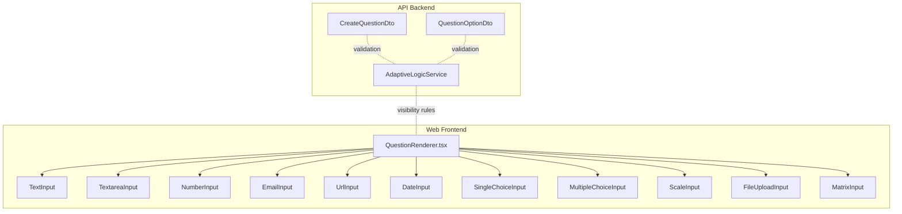
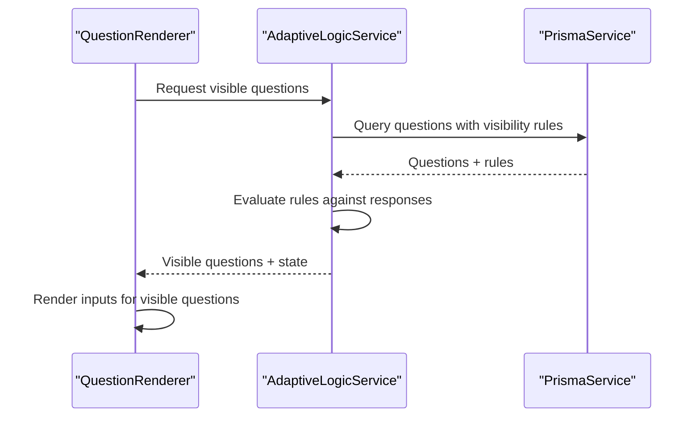
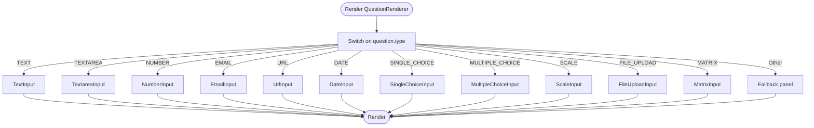
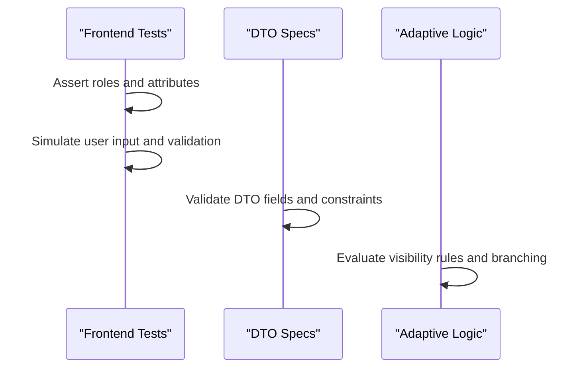
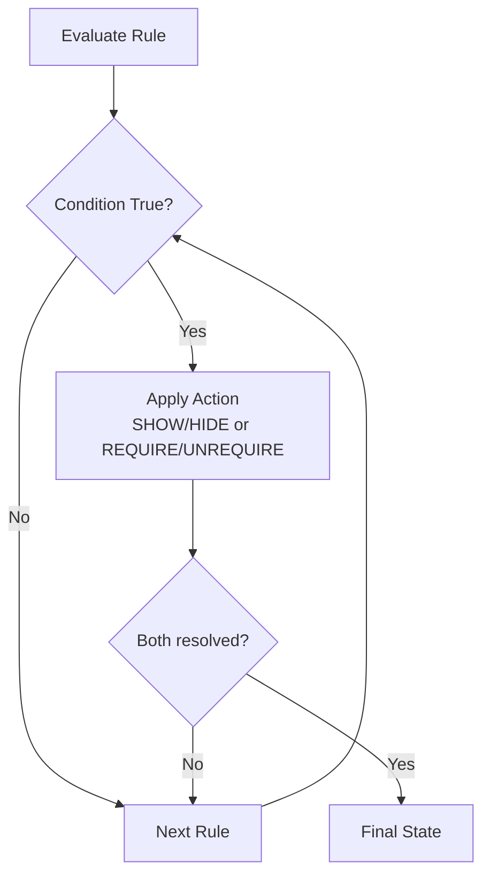
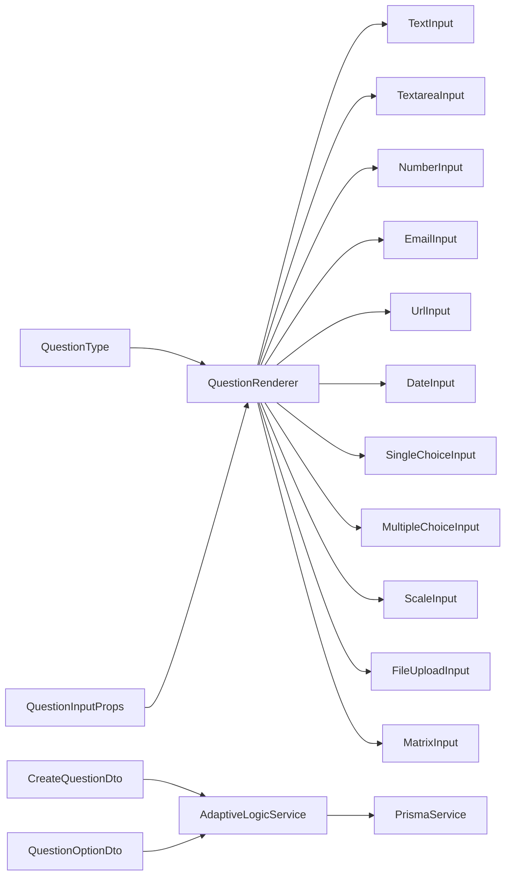

# Question Types System

<cite>
**Referenced Files in This Document**
- [QuestionRenderer.tsx](file://apps/web/src/components/questionnaire/QuestionRenderer.tsx)
- [questionnaire.ts](file://apps/web/src/types/questionnaire.ts)
- [QuestionRenderer.extended.test.tsx](file://apps/web/src/components/questionnaire/QuestionRenderer.extended.test.tsx)
- [QuestionRenderer.a11y.test.tsx](file://apps/web/src/test/a11y/QuestionRenderer.a11y.test.tsx)
- [adaptive-logic.service.ts](file://apps/api/src/modules/adaptive-logic/adaptive-logic.service.ts)
- [create-question.dto.ts](file://apps/api/src/modules/admin/dto/create-question.dto.ts)
- [dto.spec.ts](file://apps/api/src/modules/admin/dto/dto.spec.ts)
- [05-data-models-db-architecture.md](file://docs/cto/05-data-models-db-architecture.md)
- [question-bank.md](file://docs/questionnaire/question-bank.md)
- [complete-flow.e2e.test.ts](file://e2e/questionnaire/complete-flow.e2e.test.ts)
</cite>

## Table of Contents
1. [Introduction](#introduction)
2. [Project Structure](#project-structure)
3. [Core Components](#core-components)
4. [Architecture Overview](#architecture-overview)
5. [Detailed Component Analysis](#detailed-component-analysis)
6. [Dependency Analysis](#dependency-analysis)
7. [Performance Considerations](#performance-considerations)
8. [Troubleshooting Guide](#troubleshooting-guide)
9. [Conclusion](#conclusion)
10. [Appendices](#appendices)

## Introduction
This document describes the Question Types System used to render and validate diverse input types in the application’s questionnaire experience. It covers:
- Frontend rendering and input handling for 11 question types
- Validation patterns and accessibility features
- Backend DTOs and validation schemas
- Examples of custom question types and styling options
- Integration with the adaptive logic system for dynamic visibility and branching

## Project Structure
The system spans frontend React components and backend NestJS DTOs and services:
- Frontend: A central renderer delegates to specialized input components per question type
- Backend: DTOs define validation rules for question creation/update; adaptive logic evaluates visibility and branching

**Diagram sources**
- [QuestionRenderer.tsx:1-245](file://apps/web/src/components/questionnaire/QuestionRenderer.tsx#L1-L245)
- [adaptive-logic.service.ts:1-285](file://apps/api/src/modules/adaptive-logic/adaptive-logic.service.ts#L1-L285)
- [create-question.dto.ts:1-61](file://apps/api/src/modules/admin/dto/create-question.dto.ts#L1-L61)

**Section sources**
- [QuestionRenderer.tsx:1-245](file://apps/web/src/components/questionnaire/QuestionRenderer.tsx#L1-L245)
- [questionnaire.ts:1-225](file://apps/web/src/types/questionnaire.ts#L1-L225)

## Core Components
- Question type enumeration defines the supported question types
- Question model includes metadata, options, and validation rules
- QuestionRenderer dynamically selects the appropriate input component
- AdaptiveLogicService evaluates visibility and branching rules
- Backend DTOs enforce validation for question creation and updates

**Section sources**
- [questionnaire.ts:8-22](file://apps/web/src/types/questionnaire.ts#L8-L22)
- [questionnaire.ts:107-128](file://apps/web/src/types/questionnaire.ts#L107-L128)
- [QuestionRenderer.tsx:51-158](file://apps/web/src/components/questionnaire/QuestionRenderer.tsx#L51-L158)
- [adaptive-logic.service.ts:69-132](file://apps/api/src/modules/adaptive-logic/adaptive-logic.service.ts#L69-L132)
- [create-question.dto.ts:33-61](file://apps/api/src/modules/admin/dto/create-question.dto.ts#L33-L61)

## Architecture Overview
The system integrates frontend rendering with backend validation and adaptive logic:
- Frontend: QuestionRenderer maps question.type to a concrete input component
- Backend: CreateQuestionDto validates question structure and options
- Adaptive Logic: Evaluates visibility rules and determines next question

**Diagram sources**
- [QuestionRenderer.tsx:29-64](file://apps/web/src/components/questionnaire/QuestionRenderer.tsx#L29-L64)
- [adaptive-logic.service.ts:29-64](file://apps/api/src/modules/adaptive-logic/adaptive-logic.service.ts#L29-L64)

## Detailed Component Analysis

### Question Type Enumeration and Models
- QuestionType includes 11 variants: TEXT, TEXTAREA, NUMBER, EMAIL, URL, DATE, SINGLE_CHOICE, MULTIPLE_CHOICE, SCALE, FILE_UPLOAD, MATRIX
- Question model supports help text, placeholders, required flag, options, and validation rules
- ValidationRules include required, minLength, maxLength, numeric bounds, and pattern/patternMessage

**Section sources**
- [questionnaire.ts:8-22](file://apps/web/src/types/questionnaire.ts#L8-L22)
- [questionnaire.ts:94-102](file://apps/web/src/types/questionnaire.ts#L94-L102)
- [questionnaire.ts:107-128](file://apps/web/src/types/questionnaire.ts#L107-L128)

### QuestionRenderer: Dynamic Rendering
- Centralized switch statement routes to the correct input component based on question.type
- Passes common props: question, value, onChange, error, disabled, and explanatory panels
- Renders best practice and practical explainer panels when present

**Diagram sources**
- [QuestionRenderer.tsx:51-158](file://apps/web/src/components/questionnaire/QuestionRenderer.tsx#L51-L158)

**Section sources**
- [QuestionRenderer.tsx:16-24](file://apps/web/src/components/questionnaire/QuestionRenderer.tsx#L16-L24)
- [QuestionRenderer.tsx:51-158](file://apps/web/src/components/questionnaire/QuestionRenderer.tsx#L51-L158)

### Input Components and Props
- All input components share a common prop interface: QuestionInputProps<T>
- Props include question, value, onChange, error, disabled, and flags to toggle explanatory panels
- Each component receives typed values aligned with its question type

**Section sources**
- [questionnaire.ts:202-210](file://apps/web/src/types/questionnaire.ts#L202-L210)
- [QuestionRenderer.tsx:41-49](file://apps/web/src/components/questionnaire/QuestionRenderer.tsx#L41-L49)

### Validation Patterns and Accessibility
- Frontend tests demonstrate role-based rendering and validation behavior for multiple question types
- Accessibility tests verify ARIA attributes and labeling for screen readers
- Backend DTOs enforce constraints such as max length, required fields, and enum validation

**Diagram sources**
- [QuestionRenderer.extended.test.tsx:40-108](file://apps/web/src/components/questionnaire/QuestionRenderer.extended.test.tsx#L40-L108)
- [QuestionRenderer.a11y.test.tsx:39-457](file://apps/web/src/test/a11y/QuestionRenderer.a11y.test.tsx#L39-L457)
- [dto.spec.ts:183-256](file://apps/api/src/modules/admin/dto/dto.spec.ts#L183-L256)
- [adaptive-logic.service.ts:69-132](file://apps/api/src/modules/adaptive-logic/adaptive-logic.service.ts#L69-L132)

**Section sources**
- [QuestionRenderer.extended.test.tsx:40-108](file://apps/web/src/components/questionnaire/QuestionRenderer.extended.test.tsx#L40-L108)
- [QuestionRenderer.a11y.test.tsx:39-457](file://apps/web/src/test/a11y/QuestionRenderer.a11y.test.tsx#L39-L457)
- [dto.spec.ts:183-256](file://apps/api/src/modules/admin/dto/dto.spec.ts#L183-L256)

### Backend DTOs and Validation Schemas
- CreateQuestionDto enforces question text length, type enum, optional fields, and validation rules
- QuestionOptionDto validates option entries for choice-based questions
- Tests assert successful validation with optional fields and failure modes for missing required fields and out-of-range values

**Section sources**
- [create-question.dto.ts:33-61](file://apps/api/src/modules/admin/dto/create-question.dto.ts#L33-L61)
- [create-question.dto.ts:18-31](file://apps/api/src/modules/admin/dto/create-question.dto.ts#L18-L31)
- [dto.spec.ts:183-256](file://apps/api/src/modules/admin/dto/dto.spec.ts#L183-L256)

### Data Model and Response Values
- Database documentation defines JSON schemas for question options, visibility conditions, and response value structures by type
- Response schemas specify expected shapes for each question type (e.g., text, number, selected option IDs, rating, date, file metadata, matrix mapping)

**Section sources**
- [05-data-models-db-architecture.md:1204-1266](file://docs/cto/05-data-models-db-architecture.md#L1204-L1266)

### Adaptive Logic Integration
- AdaptiveLogicService computes visibility and required state based on current responses and configured rules
- Rules support SHOW/HIDE and REQUIRE/UNREQUIRE actions with logical operators and nested conditions
- The service also calculates next question in flow and dependency graphs for questions

**Diagram sources**
- [adaptive-logic.service.ts:69-132](file://apps/api/src/modules/adaptive-logic/adaptive-logic.service.ts#L69-L132)

**Section sources**
- [adaptive-logic.service.ts:69-132](file://apps/api/src/modules/adaptive-logic/adaptive-logic.service.ts#L69-L132)
- [adaptive-logic.service.ts:137-176](file://apps/api/src/modules/adaptive-logic/adaptive-logic.service.ts#L137-L176)

### Examples of Custom Question Types and Styling
- Custom question types can be introduced by extending QuestionType and adding a new case in QuestionRenderer
- Styling options include best practice and practical explainer panels, standard reference badges, and container layout
- Accessibility features include ARIA attributes, labels, and role-based controls validated by automated tests

**Section sources**
- [questionnaire.ts:8-22](file://apps/web/src/types/questionnaire.ts#L8-L22)
- [QuestionRenderer.tsx:160-243](file://apps/web/src/components/questionnaire/QuestionRenderer.tsx#L160-L243)
- [QuestionRenderer.a11y.test.tsx:442-457](file://apps/web/src/test/a11y/QuestionRenderer.a11y.test.tsx#L442-L457)

### End-to-End Validation Examples
- E2E tests demonstrate validation behavior for percentage inputs and text minimum length requirements
- These tests confirm user feedback for invalid inputs align with validation rules

**Section sources**
- [complete-flow.e2e.test.ts:371-394](file://e2e/questionnaire/complete-flow.e2e.test.ts#L371-L394)

## Dependency Analysis
- QuestionRenderer depends on QuestionType and QuestionInputProps to route to specialized inputs
- Specialized inputs receive typed values and onChange handlers
- AdaptiveLogicService depends on PrismaService and condition evaluators to compute visibility and branching
- Backend DTOs depend on class-validator decorators to enforce schema constraints

**Diagram sources**
- [QuestionRenderer.tsx:1-245](file://apps/web/src/components/questionnaire/QuestionRenderer.tsx#L1-L245)
- [adaptive-logic.service.ts:1-285](file://apps/api/src/modules/adaptive-logic/adaptive-logic.service.ts#L1-L285)
- [create-question.dto.ts:1-61](file://apps/api/src/modules/admin/dto/create-question.dto.ts#L1-L61)

**Section sources**
- [QuestionRenderer.tsx:1-245](file://apps/web/src/components/questionnaire/QuestionRenderer.tsx#L1-L245)
- [adaptive-logic.service.ts:1-285](file://apps/api/src/modules/adaptive-logic/adaptive-logic.service.ts#L1-L285)
- [create-question.dto.ts:1-61](file://apps/api/src/modules/admin/dto/create-question.dto.ts#L1-L61)

## Performance Considerations
- Prefer minimal re-renders by passing stable props and memoizing derived values
- Defer heavy computations in adaptive logic evaluation to background threads or batch processing
- Optimize file uploads with chunked uploads and progress indicators
- Use virtualized lists for long questionnaires and matrix inputs

## Troubleshooting Guide
- Unsupported question types: The renderer falls back to a warning panel; ensure QuestionType includes the intended type
- Validation failures: Confirm DTO constraints and frontend validation match; check backend error messages for missing or invalid fields
- Adaptive logic anomalies: Verify rule priorities, logical operators, and condition nesting; ensure response keys match referenced question IDs
- Accessibility issues: Confirm ARIA attributes and roles are set; run automated accessibility tests

**Section sources**
- [QuestionRenderer.tsx:151-157](file://apps/web/src/components/questionnaire/QuestionRenderer.tsx#L151-L157)
- [dto.spec.ts:183-256](file://apps/api/src/modules/admin/dto/dto.spec.ts#L183-L256)
- [adaptive-logic.service.ts:86-132](file://apps/api/src/modules/adaptive-logic/adaptive-logic.service.ts#L86-L132)
- [QuestionRenderer.a11y.test.tsx:39-457](file://apps/web/src/test/a11y/QuestionRenderer.a11y.test.tsx#L39-L457)

## Conclusion
The Question Types System combines a flexible frontend renderer with robust backend validation and adaptive logic to deliver a dynamic, accessible, and extensible questionnaire experience. By adhering to shared interfaces, validation schemas, and accessibility guidelines, developers can confidently introduce new question types and maintain high-quality user interactions.

## Appendices

### Supported Question Types
- TEXT: Short text input with optional help text and placeholder
- TEXTAREA: Multi-line text input with optional help text and placeholder
- NUMBER: Numeric input with optional min/max and required flags
- EMAIL: Email input with built-in validation
- URL: URL input with built-in validation
- DATE: Date picker input
- SINGLE_CHOICE: Radio button selection from options
- MULTIPLE_CHOICE: Checkbox selection of multiple options
- SCALE: Slider with configurable min/max/step and optional labels
- FILE_UPLOAD: File picker with preview and metadata
- MATRIX: Grid of row/column selections mapped to option IDs

**Section sources**
- [questionnaire.ts:8-22](file://apps/web/src/types/questionnaire.ts#L8-L22)
- [question-bank.md:1391-1404](file://docs/questionnaire/question-bank.md#L1391-L1404)