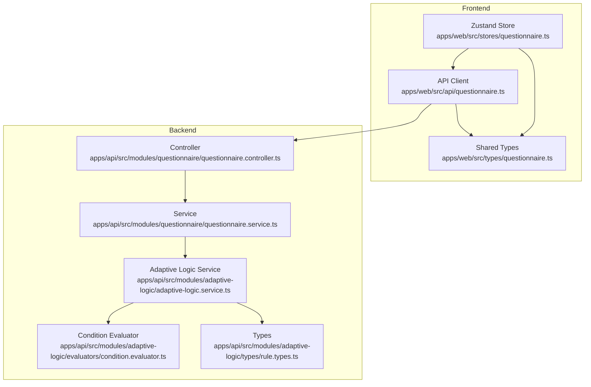
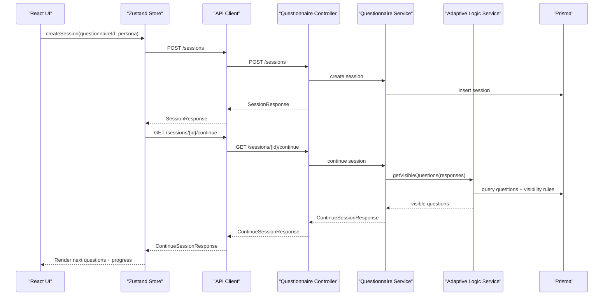
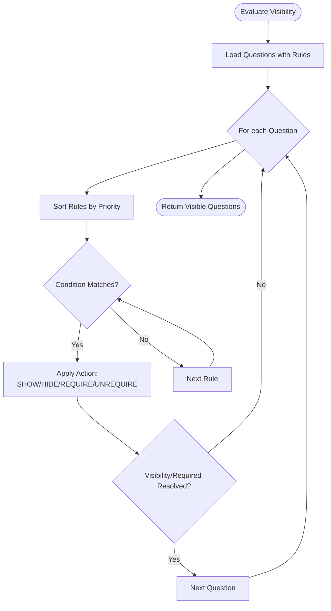
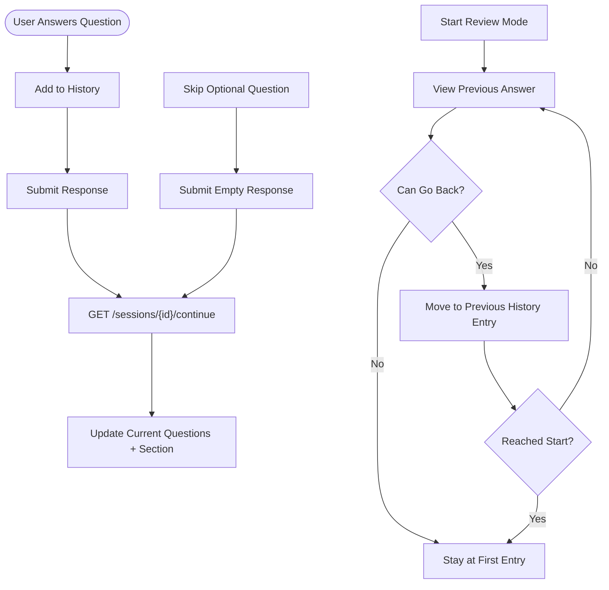
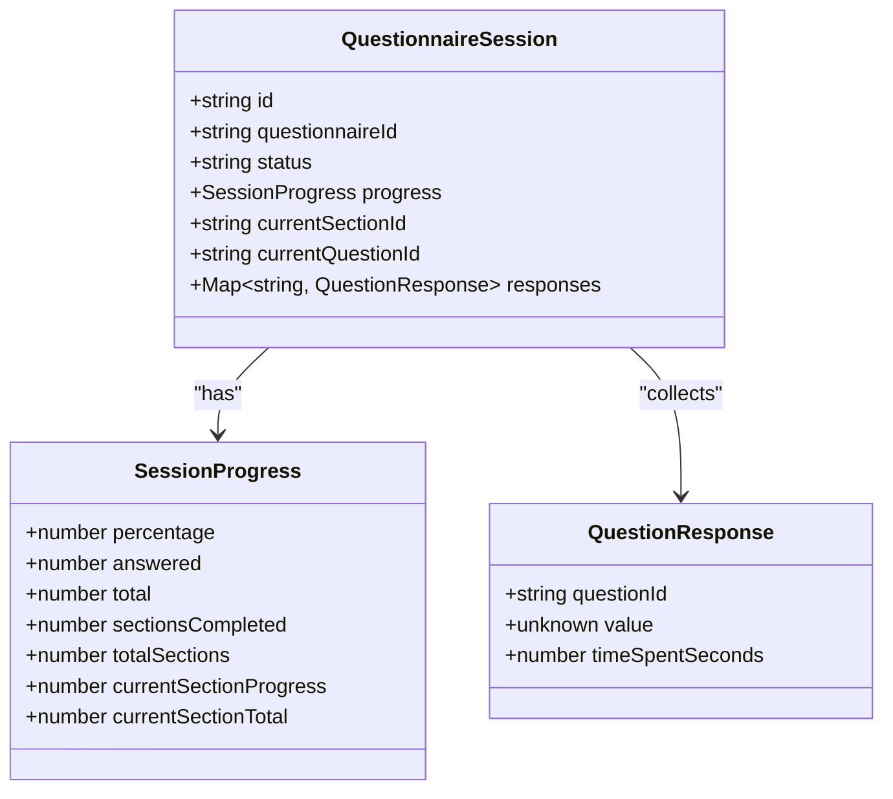
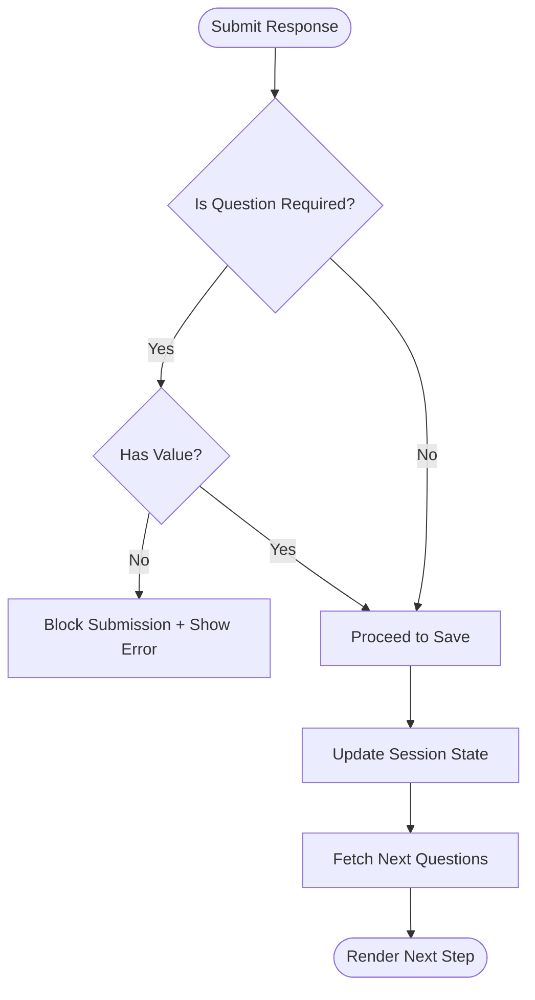
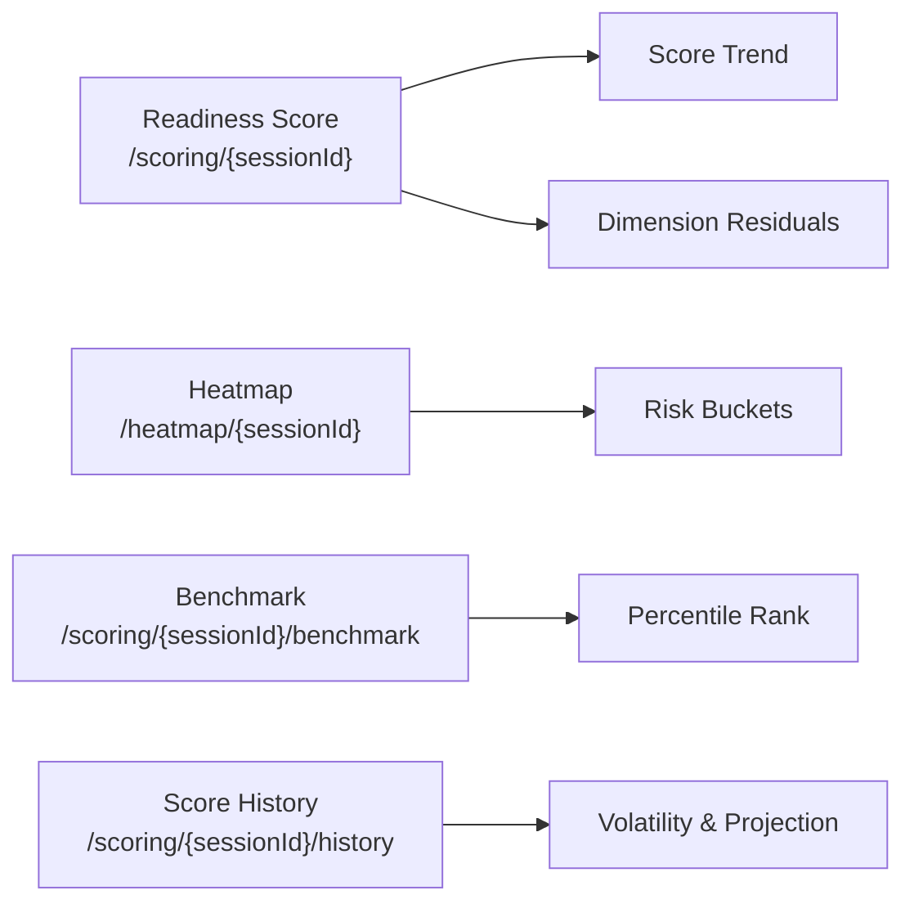
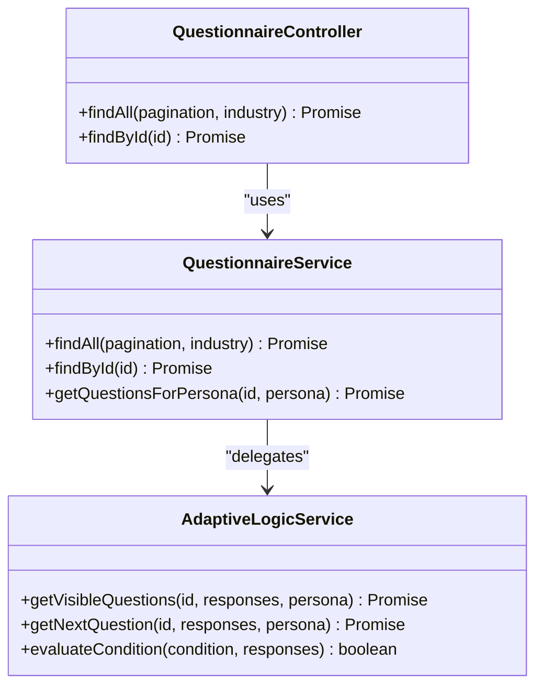
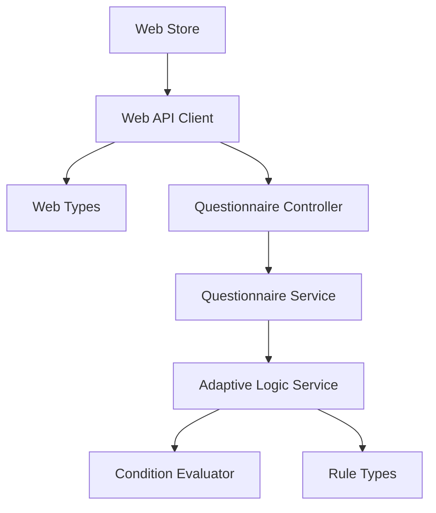

# Questionnaire Flow Management

<cite>
**Referenced Files in This Document**
- [adaptive-logic.service.ts](file://apps/api/src/modules/adaptive-logic/adaptive-logic.service.ts)
- [condition.evaluator.ts](file://apps/api/src/modules/adaptive-logic/evaluators/condition.evaluator.ts)
- [rule.types.ts](file://apps/api/src/modules/adaptive-logic/types/rule.types.ts)
- [questionnaire.controller.ts](file://apps/api/src/modules/questionnaire/questionnaire.controller.ts)
- [questionnaire.service.ts](file://apps/api/src/modules/questionnaire/questionnaire.service.ts)
- [questionnaire.ts](file://apps/web/src/api/questionnaire.ts)
- [questionnaire.ts](file://apps/web/src/stores/questionnaire.ts)
- [questionnaire.ts](file://apps/web/src/types/questionnaire.ts)
</cite>

## Table of Contents
1. [Introduction](#introduction)
2. [Project Structure](#project-structure)
3. [Core Components](#core-components)
4. [Architecture Overview](#architecture-overview)
5. [Detailed Component Analysis](#detailed-component-analysis)
6. [Dependency Analysis](#dependency-analysis)
7. [Performance Considerations](#performance-considerations)
8. [Troubleshooting Guide](#troubleshooting-guide)
9. [Conclusion](#conclusion)

## Introduction
This document describes the questionnaire flow management system that powers dynamic, adaptive, and validated user journeys through assessment questionnaires. It covers:
- Forward/backward navigation through questions
- Progress tracking with completion percentages and milestone markers
- Adaptive routing that changes question visibility and order based on responses
- Validation flow ensuring required questions are completed before advancing
- Completion analytics including time spent, completion rates, and drop-off points
- Frontend components for navigation controls, progress indicators, and user feedback
- Backend services for questionnaire orchestration and state management

## Project Structure
The questionnaire flow spans three primary areas:
- Backend orchestration and adaptive logic in the API module
- Frontend orchestration and state management via a Zustand store
- Shared TypeScript types for consistent data modeling across the stack

**Diagram sources**
- [questionnaire.controller.ts:1-49](file://apps/api/src/modules/questionnaire/questionnaire.controller.ts#L1-L49)
- [questionnaire.service.ts:1-321](file://apps/api/src/modules/questionnaire/questionnaire.service.ts#L1-L321)
- [adaptive-logic.service.ts:1-285](file://apps/api/src/modules/adaptive-logic/adaptive-logic.service.ts#L1-L285)
- [condition.evaluator.ts:1-382](file://apps/api/src/modules/adaptive-logic/evaluators/condition.evaluator.ts#L1-L382)
- [rule.types.ts:1-120](file://apps/api/src/modules/adaptive-logic/types/rule.types.ts#L1-L120)
- [questionnaire.ts:1-476](file://apps/web/src/api/questionnaire.ts#L1-L476)
- [questionnaire.ts:1-357](file://apps/web/src/stores/questionnaire.ts#L1-L357)
- [questionnaire.ts:1-225](file://apps/web/src/types/questionnaire.ts#L1-L225)

**Section sources**
- [questionnaire.controller.ts:1-49](file://apps/api/src/modules/questionnaire/questionnaire.controller.ts#L1-L49)
- [questionnaire.service.ts:1-321](file://apps/api/src/modules/questionnaire/questionnaire.service.ts#L1-L321)
- [adaptive-logic.service.ts:1-285](file://apps/api/src/modules/adaptive-logic/adaptive-logic.service.ts#L1-L285)
- [condition.evaluator.ts:1-382](file://apps/api/src/modules/adaptive-logic/evaluators/condition.evaluator.ts#L1-L382)
- [rule.types.ts:1-120](file://apps/api/src/modules/adaptive-logic/types/rule.types.ts#L1-L120)
- [questionnaire.ts:1-476](file://apps/web/src/api/questionnaire.ts#L1-L476)
- [questionnaire.ts:1-357](file://apps/web/src/stores/questionnaire.ts#L1-L357)
- [questionnaire.ts:1-225](file://apps/web/src/types/questionnaire.ts#L1-L225)

## Core Components
- Adaptive Logic Engine: Evaluates visibility and requirement rules to dynamically adjust the question flow.
- Questionnaire Orchestration: Backend services manage questionnaire metadata, sections, and questions, while the frontend store coordinates session lifecycle and navigation.
- Validation and Navigation: The frontend store enforces required questions and supports backward/forward navigation with review mode.
- Analytics and Insights: Backend APIs expose readiness scores, heatmaps, benchmarks, and score histories to measure completion and drop-off.

**Section sources**
- [adaptive-logic.service.ts:1-285](file://apps/api/src/modules/adaptive-logic/adaptive-logic.service.ts#L1-L285)
- [questionnaire.service.ts:1-321](file://apps/api/src/modules/questionnaire/questionnaire.service.ts#L1-L321)
- [questionnaire.ts:1-357](file://apps/web/src/stores/questionnaire.ts#L1-L357)
- [questionnaire.ts:1-476](file://apps/web/src/api/questionnaire.ts#L1-L476)

## Architecture Overview
The system follows a layered architecture:
- Presentation Layer: React components consume the Zustand store and render navigation, progress, and question inputs.
- API Layer: NestJS controllers expose endpoints for sessions, responses, scoring, and analytics.
- Domain Services: Questionnaire and Adaptive Logic services encapsulate business rules and data retrieval.
- Data Access: Prisma service queries the database for questionnaires, sections, questions, and visibility rules.

**Diagram sources**
- [questionnaire.controller.ts:1-49](file://apps/api/src/modules/questionnaire/questionnaire.controller.ts#L1-L49)
- [questionnaire.service.ts:1-321](file://apps/api/src/modules/questionnaire/questionnaire.service.ts#L1-L321)
- [adaptive-logic.service.ts:1-285](file://apps/api/src/modules/adaptive-logic/adaptive-logic.service.ts#L1-L285)
- [questionnaire.ts:1-476](file://apps/web/src/api/questionnaire.ts#L1-L476)
- [questionnaire.ts:1-357](file://apps/web/src/stores/questionnaire.ts#L1-L357)

## Detailed Component Analysis

### Adaptive Routing and Visibility
The adaptive logic engine evaluates visibility and requirement rules to compute:
- Visible questions for the current session
- Next question in the flow
- Changes when responses change (added/removed questions)

**Diagram sources**
- [adaptive-logic.service.ts:29-132](file://apps/api/src/modules/adaptive-logic/adaptive-logic.service.ts#L29-L132)
- [condition.evaluator.ts:9-82](file://apps/api/src/modules/adaptive-logic/evaluators/condition.evaluator.ts#L9-L82)
- [rule.types.ts:38-53](file://apps/api/src/modules/adaptive-logic/types/rule.types.ts#L38-L53)

**Section sources**
- [adaptive-logic.service.ts:29-132](file://apps/api/src/modules/adaptive-logic/adaptive-logic.service.ts#L29-L132)
- [condition.evaluator.ts:9-82](file://apps/api/src/modules/adaptive-logic/evaluators/condition.evaluator.ts#L9-L82)
- [rule.types.ts:38-53](file://apps/api/src/modules/adaptive-logic/types/rule.types.ts#L38-L53)

### Navigation Logic: Forward/Backward Movement
The frontend store manages navigation history and review mode:
- History entries capture answered questions with timestamps
- Review mode allows moving backward/forward through history
- Skip logic supports optional questions

**Diagram sources**
- [questionnaire.ts:175-233](file://apps/web/src/stores/questionnaire.ts#L175-L233)
- [questionnaire.ts:270-318](file://apps/web/src/stores/questionnaire.ts#L270-L318)
- [questionnaire.ts:320-339](file://apps/web/src/stores/questionnaire.ts#L320-L339)

**Section sources**
- [questionnaire.ts:175-233](file://apps/web/src/stores/questionnaire.ts#L175-L233)
- [questionnaire.ts:270-318](file://apps/web/src/stores/questionnaire.ts#L270-L318)
- [questionnaire.ts:320-339](file://apps/web/src/stores/questionnaire.ts#L320-L339)

### Progress Tracking: Percentages and Milestones
Progress metrics are computed and exposed via the API and store:
- Percentage: answered questions / total questions
- Section-level progress: answered in section / total in section
- Milestone markers: completed sections count vs total sections

**Diagram sources**
- [questionnaire.ts:171-197](file://apps/web/src/types/questionnaire.ts#L171-L197)
- [questionnaire.ts:158-169](file://apps/web/src/types/questionnaire.ts#L158-L169)

**Section sources**
- [questionnaire.ts:171-197](file://apps/web/src/types/questionnaire.ts#L171-L197)
- [questionnaire.ts:158-169](file://apps/web/src/types/questionnaire.ts#L158-L169)

### Validation Flow: Required Questions and Submission Gate
Validation ensures required questions are completed before advancing:
- Required flag per question
- Frontend skip guard prevents skipping required questions
- Backend validation results returned with submission response

**Diagram sources**
- [questionnaire.ts:350-355](file://apps/web/src/stores/questionnaire.ts#L350-L355)
- [questionnaire.ts:78-103](file://apps/web/src/api/questionnaire.ts#L78-L103)

**Section sources**
- [questionnaire.ts:350-355](file://apps/web/src/stores/questionnaire.ts#L350-L355)
- [questionnaire.ts:78-103](file://apps/web/src/api/questionnaire.ts#L78-L103)

### Completion Analytics: Time, Rates, Drop-offs
Analytics surfaces insights for completion and engagement:
- Readiness score with dimension residuals and trends
- Heatmap data for risk and coverage gaps
- Score history and benchmarks for comparative analysis
- Drop-off points inferred from skipped questions and incomplete sessions

**Diagram sources**
- [questionnaire.ts:233-295](file://apps/web/src/api/questionnaire.ts#L233-L295)
- [questionnaire.ts:266-270](file://apps/web/src/api/questionnaire.ts#L266-L270)
- [questionnaire.ts:297-324](file://apps/web/src/api/questionnaire.ts#L297-L324)

**Section sources**
- [questionnaire.ts:233-295](file://apps/web/src/api/questionnaire.ts#L233-L295)
- [questionnaire.ts:266-270](file://apps/web/src/api/questionnaire.ts#L266-L270)
- [questionnaire.ts:297-324](file://apps/web/src/api/questionnaire.ts#L297-L324)

### Backend Orchestration: Controllers, Services, and Data Flow
- Controllers expose endpoints for listing, retrieving, continuing, submitting responses, and completing sessions.
- Services map domain models to API responses and fetch questions with visibility rules.
- Adaptive Logic Service computes visibility and next steps based on current responses.

**Diagram sources**
- [questionnaire.controller.ts:1-49](file://apps/api/src/modules/questionnaire/questionnaire.controller.ts#L1-L49)
- [questionnaire.service.ts:1-321](file://apps/api/src/modules/questionnaire/questionnaire.service.ts#L1-L321)
- [adaptive-logic.service.ts:1-285](file://apps/api/src/modules/adaptive-logic/adaptive-logic.service.ts#L1-L285)

**Section sources**
- [questionnaire.controller.ts:1-49](file://apps/api/src/modules/questionnaire/questionnaire.controller.ts#L1-L49)
- [questionnaire.service.ts:1-321](file://apps/api/src/modules/questionnaire/questionnaire.service.ts#L1-L321)
- [adaptive-logic.service.ts:1-285](file://apps/api/src/modules/adaptive-logic/adaptive-logic.service.ts#L1-L285)

## Dependency Analysis
- Frontend store depends on the API client for all server interactions.
- API client depends on shared types for request/response shapes.
- Questionnaire service depends on Prisma for data access and on adaptive logic service for visibility computations.
- Adaptive logic service depends on condition evaluator and rule types.

**Diagram sources**
- [questionnaire.ts:1-357](file://apps/web/src/stores/questionnaire.ts#L1-L357)
- [questionnaire.ts:1-476](file://apps/web/src/api/questionnaire.ts#L1-L476)
- [questionnaire.ts:1-225](file://apps/web/src/types/questionnaire.ts#L1-L225)
- [questionnaire.controller.ts:1-49](file://apps/api/src/modules/questionnaire/questionnaire.controller.ts#L1-L49)
- [questionnaire.service.ts:1-321](file://apps/api/src/modules/questionnaire/questionnaire.service.ts#L1-L321)
- [adaptive-logic.service.ts:1-285](file://apps/api/src/modules/adaptive-logic/adaptive-logic.service.ts#L1-L285)
- [condition.evaluator.ts:1-382](file://apps/api/src/modules/adaptive-logic/evaluators/condition.evaluator.ts#L1-L382)
- [rule.types.ts:1-120](file://apps/api/src/modules/adaptive-logic/types/rule.types.ts#L1-L120)

**Section sources**
- [questionnaire.ts:1-357](file://apps/web/src/stores/questionnaire.ts#L1-L357)
- [questionnaire.ts:1-476](file://apps/web/src/api/questionnaire.ts#L1-L476)
- [questionnaire.ts:1-225](file://apps/web/src/types/questionnaire.ts#L1-L225)
- [questionnaire.controller.ts:1-49](file://apps/api/src/modules/questionnaire/questionnaire.controller.ts#L1-L49)
- [questionnaire.service.ts:1-321](file://apps/api/src/modules/questionnaire/questionnaire.service.ts#L1-L321)
- [adaptive-logic.service.ts:1-285](file://apps/api/src/modules/adaptive-logic/adaptive-logic.service.ts#L1-L285)
- [condition.evaluator.ts:1-382](file://apps/api/src/modules/adaptive-logic/evaluators/condition.evaluator.ts#L1-L382)
- [rule.types.ts:1-120](file://apps/api/src/modules/adaptive-logic/types/rule.types.ts#L1-L120)

## Performance Considerations
- Adaptive rule evaluation: Sorting and evaluating visibility rules scales with the number of rules per question. Consider caching frequently accessed rule sets and limiting rule counts.
- Database queries: Fetching questions with visibility rules and persona filtering should leverage appropriate indexes on questionnaireId, sectionId, and persona.
- Frontend rendering: Debounce navigation actions and avoid unnecessary re-renders by normalizing question and response objects.
- API round trips: Batch requests where possible and cache session continuations to reduce latency.

## Troubleshooting Guide
Common issues and remedies:
- Navigation stuck after skipping: Ensure optional questions are not marked required; verify skip guards in the store.
- Missing next questions: Confirm that visibility rules resolve to visible questions and that the session continuation endpoint is reachable.
- Validation errors: Check required flags and ensure responses conform to validation rules before submission.
- Analytics not updating: Verify readiness score and heatmap endpoints are called and that session status transitions properly.

**Section sources**
- [questionnaire.ts:320-339](file://apps/web/src/stores/questionnaire.ts#L320-L339)
- [questionnaire.ts:210-231](file://apps/web/src/api/questionnaire.ts#L210-L231)
- [questionnaire.ts:233-295](file://apps/web/src/api/questionnaire.ts#L233-L295)

## Conclusion
The questionnaire flow management system integrates adaptive logic, robust validation, and comprehensive analytics to deliver a dynamic, guided assessment experience. The backend services orchestrate questionnaire metadata and visibility rules, while the frontend store coordinates navigation, progress tracking, and user feedback. Together, they support efficient completion, insightful analytics, and seamless user experiences across diverse personas and industries.