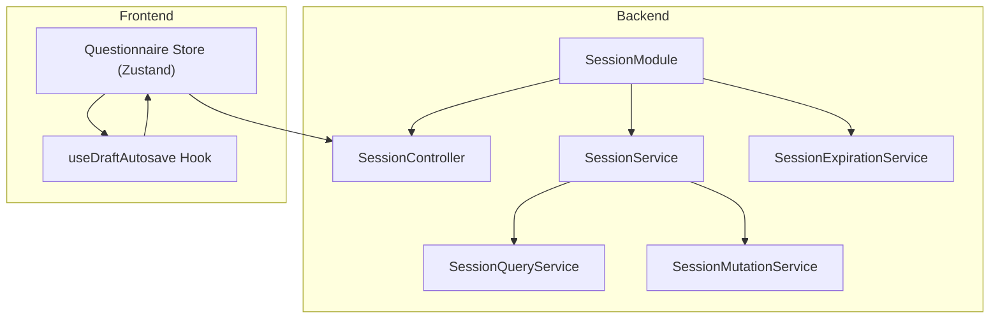
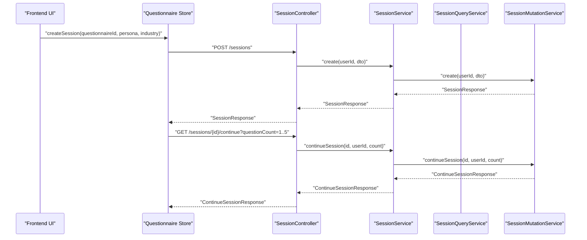
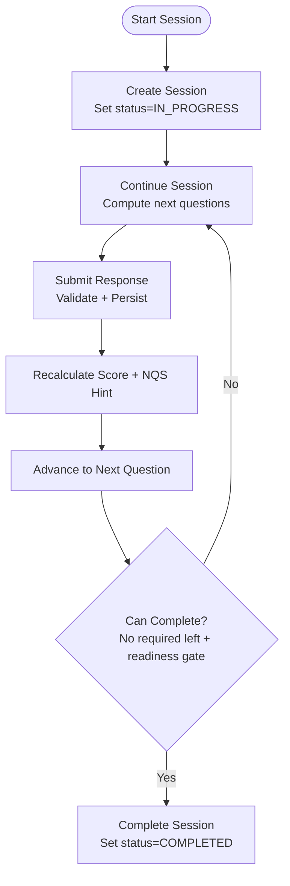
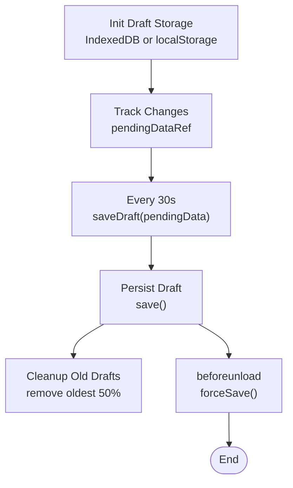
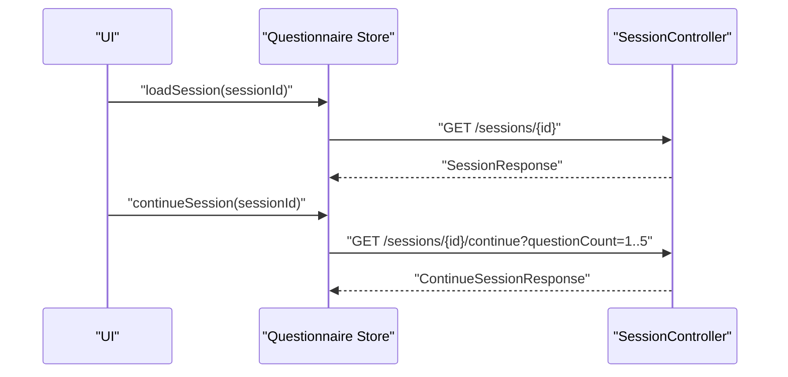
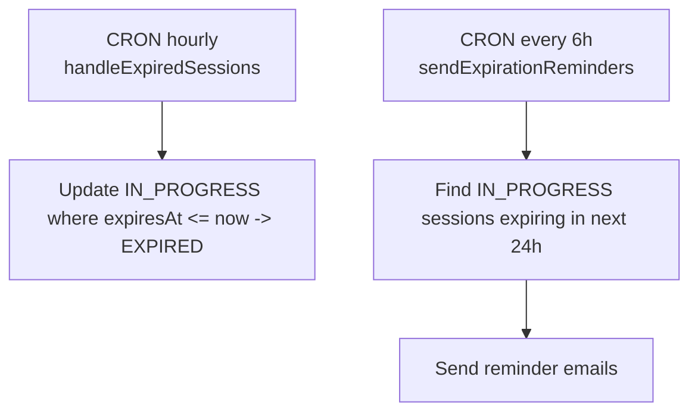
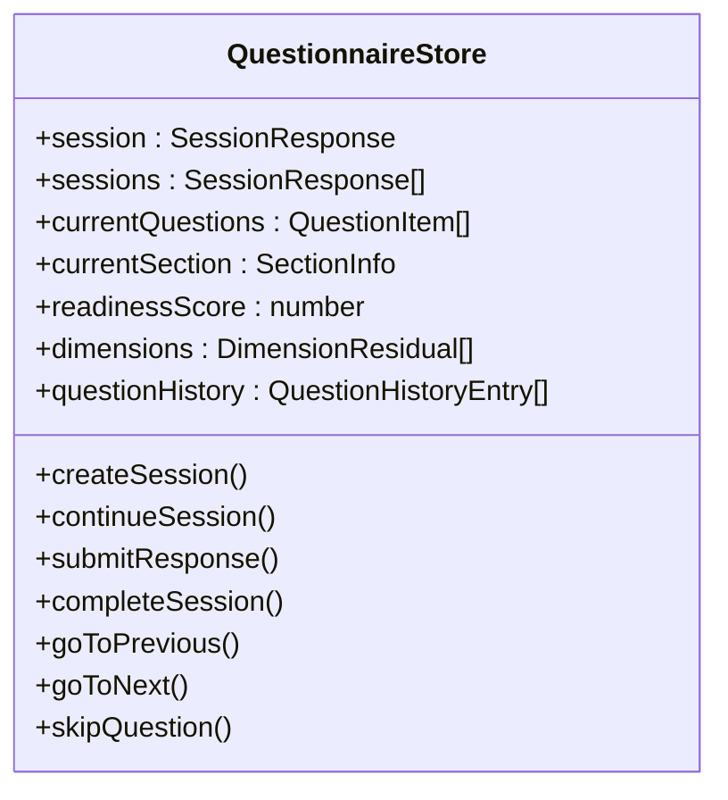
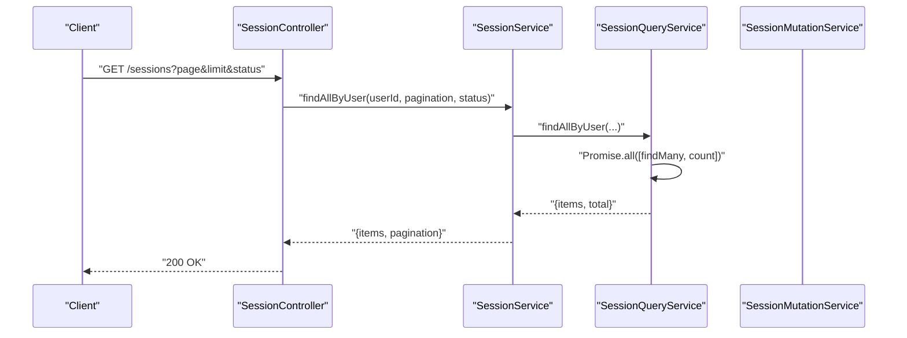
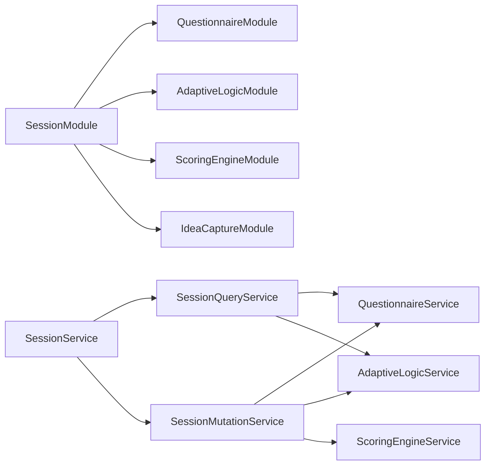

# Session Management

<cite>
**Referenced Files in This Document**
- [session.module.ts](file://apps/api/src/modules/session/session.module.ts)
- [session.controller.ts](file://apps/api/src/modules/session/session.controller.ts)
- [session.service.ts](file://apps/api/src/modules/session/session.service.ts)
- [session-mutation.service.ts](file://apps/api/src/modules/session/services/session-mutation.service.ts)
- [session-query.service.ts](file://apps/api/src/modules/session/services/session-query.service.ts)
- [session-expiration.service.ts](file://apps/api/src/modules/session/session-expiration.service.ts)
- [session-helpers.ts](file://apps/api/src/modules/session/session-helpers.ts)
- [session-types.ts](file://apps/api/src/modules/session/session-types.ts)
- [questionnaire.ts](file://apps/web/src/stores/questionnaire.ts)
- [useDraftAutosave.ts](file://apps/web/src/hooks/useDraftAutosave.ts)
- [questionnaire.ts](file://apps/web/src/api/questionnaire.ts)
</cite>

## Table of Contents
1. [Introduction](#introduction)
2. [Project Structure](#project-structure)
3. [Core Components](#core-components)
4. [Architecture Overview](#architecture-overview)
5. [Detailed Component Analysis](#detailed-component-analysis)
6. [Dependency Analysis](#dependency-analysis)
7. [Performance Considerations](#performance-considerations)
8. [Troubleshooting Guide](#troubleshooting-guide)
9. [Conclusion](#conclusion)

## Introduction
This document explains the session management system for questionnaire assessments. It covers the lifecycle from creation to completion, auto-save and draft persistence, session resumption, real-time collaboration features, expiration policies, and the frontend store management for optimistic updates. It also documents the backend APIs for session CRUD operations, query optimization, and data synchronization patterns.

## Project Structure
The session management spans backend NestJS modules and frontend Zustand stores and React hooks:
- Backend: Session module with controller, service, query/mutation services, helpers, types, and expiration job
- Frontend: Questionnaire store for state management and a draft autosave hook for local persistence

**Diagram sources**
- [session.module.ts:12-23](file://apps/api/src/modules/session/session.module.ts#L12-L23)
- [session.controller.ts:32-37](file://apps/api/src/modules/session/session.controller.ts#L32-L37)
- [session.service.ts:30-50](file://apps/api/src/modules/session/session.service.ts#L30-L50)
- [session-mutation.service.ts:31-44](file://apps/api/src/modules/session/services/session-mutation.service.ts#L31-L44)
- [session-query.service.ts:25-30](file://apps/api/src/modules/session/services/session-query.service.ts#L25-L30)
- [session-expiration.service.ts:6-13](file://apps/api/src/modules/session/session-expiration.service.ts#L6-L13)
- [questionnaire.ts:94-114](file://apps/web/src/stores/questionnaire.ts#L94-L114)
- [useDraftAutosave.ts:261-301](file://apps/web/src/hooks/useDraftAutosave.ts#L261-L301)

**Section sources**
- [session.module.ts:1-24](file://apps/api/src/modules/session/session.module.ts#L1-L24)
- [session.controller.ts:1-166](file://apps/api/src/modules/session/session.controller.ts#L1-L166)
- [session.service.ts:1-116](file://apps/api/src/modules/session/session.service.ts#L1-L116)
- [session-mutation.service.ts:1-553](file://apps/api/src/modules/session/services/session-mutation.service.ts#L1-L553)
- [session-query.service.ts:1-327](file://apps/api/src/modules/session/services/session-query.service.ts#L1-L327)
- [session-expiration.service.ts:1-85](file://apps/api/src/modules/session/session-expiration.service.ts#L1-L85)
- [questionnaire.ts:1-357](file://apps/web/src/stores/questionnaire.ts#L1-L357)
- [useDraftAutosave.ts:1-500](file://apps/web/src/hooks/useDraftAutosave.ts#L1-L500)

## Core Components
- SessionController: Exposes REST endpoints for session creation, listing, retrieval, continuing, getting next questions, submitting/updating responses, and completing sessions.
- SessionService: Thin facade delegating to SessionQueryService and SessionMutationService.
- SessionQueryService: Read-only operations including fetching sessions, listing sessions, getting next questions, analytics, user stats, and exporting sessions.
- SessionMutationService: Write operations including creating sessions, submitting/updating responses, completing sessions, continuing sessions, cloning, archiving/restoring, and bulk deletion.
- SessionExpirationService: Periodic cleanup of expired sessions and sending expiration reminders.
- Frontend Questionnaire Store: Manages session state, current questions, navigation history, scoring, and optimistic updates.
- Draft Autosave Hook: Persists drafts locally with IndexedDB/localStorage fallback and recovery.

**Section sources**
- [session.controller.ts:36-165](file://apps/api/src/modules/session/session.controller.ts#L36-L165)
- [session.service.ts:30-115](file://apps/api/src/modules/session/session.service.ts#L30-L115)
- [session-mutation.service.ts:31-553](file://apps/api/src/modules/session/services/session-mutation.service.ts#L31-L553)
- [session-query.service.ts:25-327](file://apps/api/src/modules/session/services/session-query.service.ts#L25-L327)
- [session-expiration.service.ts:6-85](file://apps/api/src/modules/session/session-expiration.service.ts#L6-L85)
- [questionnaire.ts:26-74](file://apps/web/src/stores/questionnaire.ts#L26-L74)
- [useDraftAutosave.ts:1-500](file://apps/web/src/hooks/useDraftAutosave.ts#L1-L500)

## Architecture Overview
The backend follows a layered architecture with a controller exposing REST endpoints, a service facade delegating to specialized query and mutation services, and shared helpers/types. The frontend uses a state store for optimistic UI updates and a draft autosave hook for local persistence.

**Diagram sources**
- [session.controller.ts:39-113](file://apps/api/src/modules/session/session.controller.ts#L39-L113)
- [session.service.ts:80-94](file://apps/api/src/modules/session/session.service.ts#L80-L94)
- [session-mutation.service.ts:209-311](file://apps/api/src/modules/session/services/session-mutation.service.ts#L209-L311)
- [questionnaire.ts:97-114](file://apps/web/src/stores/questionnaire.ts#L97-L114)

## Detailed Component Analysis

### Backend Session Lifecycle
- Creation: Controller delegates to SessionService.create, which creates a new session with initial progress and adaptive state.
- Continuing: Controller delegates to SessionService.continueSession, which computes next questions, progress, readiness score, and completion eligibility.
- Submitting Responses: Controller delegates to SessionService.submitResponse, which validates, persists, recalculates score, and advances to the next question.
- Completing: Controller delegates to SessionService.completeSession, enforcing readiness score gating if applicable.

**Diagram sources**
- [session-mutation.service.ts:46-86](file://apps/api/src/modules/session/services/session-mutation.service.ts#L46-L86)
- [session-mutation.service.ts:209-311](file://apps/api/src/modules/session/services/session-mutation.service.ts#L209-L311)
- [session-mutation.service.ts:88-181](file://apps/api/src/modules/session/services/session-mutation.service.ts#L88-L181)
- [session-mutation.service.ts:183-207](file://apps/api/src/modules/session/services/session-mutation.service.ts#L183-L207)

**Section sources**
- [session.controller.ts:39-164](file://apps/api/src/modules/session/session.controller.ts#L39-L164)
- [session.service.ts:80-114](file://apps/api/src/modules/session/session.service.ts#L80-L114)
- [session-mutation.service.ts:46-207](file://apps/api/src/modules/session/services/session-mutation.service.ts#L46-L207)
- [session-helpers.ts:15-44](file://apps/api/src/modules/session/session-helpers.ts#L15-L44)

### Auto-Save and Draft Persistence
- Local storage: IndexedDB-backed with localStorage fallback; maintains a draft index and cleans up old drafts.
- Autosave interval: Default 30 seconds; tracks unsaved changes and saves on page unload.
- Recovery: Drafts are recoverable within 7 days; exposes hooks to save/load/clear drafts.

**Diagram sources**
- [useDraftAutosave.ts:71-241](file://apps/web/src/hooks/useDraftAutosave.ts#L71-L241)
- [useDraftAutosave.ts:392-446](file://apps/web/src/hooks/useDraftAutosave.ts#L392-L446)

**Section sources**
- [useDraftAutosave.ts:1-500](file://apps/web/src/hooks/useDraftAutosave.ts#L1-L500)

### Resume Capability
- Frontend resume: The Questionnaire Store loads a session by ID and continues to fetch next questions.
- Draft resume: The autosave hook detects existing drafts and can recover them for continuation.

**Diagram sources**
- [questionnaire.ts:116-173](file://apps/web/src/stores/questionnaire.ts#L116-L173)
- [session.controller.ts:77-113](file://apps/api/src/modules/session/session.controller.ts#L77-L113)

**Section sources**
- [questionnaire.ts:116-173](file://apps/web/src/stores/questionnaire.ts#L116-L173)

### Real-Time Collaboration Features
- Concurrent editing: The backend does not implement explicit real-time collaboration; optimistic updates are managed on the frontend via the store and autosave hook.
- Conflict detection: Not implemented in the backend; conflicts are mitigated by optimistic UI updates and local draft recovery.

[No sources needed since this section provides conceptual guidance]

### Session Expiration Policies and Cleanup
- Expiration: Every hour, sessions with expiresAt less than or equal to now are marked EXPIRED.
- Reminders: Every six hours, reminders are sent for sessions expiring within the next 24 hours.

**Diagram sources**
- [session-expiration.service.ts:15-34](file://apps/api/src/modules/session/session-expiration.service.ts#L15-L34)
- [session-expiration.service.ts:39-83](file://apps/api/src/modules/session/session-expiration.service.ts#L39-L83)

**Section sources**
- [session-expiration.service.ts:1-85](file://apps/api/src/modules/session/session-expiration.service.ts#L1-L85)

### Frontend Store Management and Optimistic Updates
- State model: Tracks current session, sessions list, current questions, section info, readiness score, dimensions, navigation history, and completion flags.
- Optimistic updates: After submitResponse, the store updates readiness score and NQS hint immediately, then refreshes session state.
- Navigation: Supports going back/forward in answered question history and skipping optional questions.

**Diagram sources**
- [questionnaire.ts:26-74](file://apps/web/src/stores/questionnaire.ts#L26-L74)

**Section sources**
- [questionnaire.ts:1-357](file://apps/web/src/stores/questionnaire.ts#L1-L357)

### Backend APIs for Session CRUD and Query Optimization
- Endpoints:
  - POST /sessions: Create session
  - GET /sessions: List sessions with pagination and optional status filter
  - GET /sessions/{id}: Get session details
  - GET /sessions/{id}/continue: Continue session and return next questions and progress
  - GET /sessions/{id}/questions/next: Get next question(s) based on adaptive logic
  - POST /sessions/{id}/responses: Submit response
  - PUT /sessions/{id}/responses/{questionId}: Update response
  - POST /sessions/{id}/complete: Complete session
- Query optimization:
  - Pagination with skip/take and count aggregation
  - Efficient response loading with take limits
  - Adaptive visibility computed with a single pass over responses
  - Progress calculated from stored progress and visible question counts

**Diagram sources**
- [session.controller.ts:49-75](file://apps/api/src/modules/session/session.controller.ts#L49-L75)
- [session-query.service.ts:54-84](file://apps/api/src/modules/session/services/session-query.service.ts#L54-L84)

**Section sources**
- [session.controller.ts:39-164](file://apps/api/src/modules/session/session.controller.ts#L39-L164)
- [session-query.service.ts:54-84](file://apps/api/src/modules/session/services/session-query.service.ts#L54-L84)

## Dependency Analysis
- Backend module wiring: SessionModule imports Questionnaire, AdaptiveLogic, ScoringEngine, and IdeaCapture modules and exports SessionService and ConversationService.
- Service delegation: SessionService composes SessionQueryService and SessionMutationService and forwards all operations.
- Cross-service dependencies: Mutation service depends on QuestionnaireService, AdaptiveLogicService, and ScoringEngineService; Query service depends on QuestionnaireService and AdaptiveLogicService.

**Diagram sources**
- [session.module.ts:12-23](file://apps/api/src/modules/session/session.module.ts#L12-L23)
- [session.service.ts:32-50](file://apps/api/src/modules/session/session.service.ts#L32-L50)
- [session-mutation.service.ts:34-39](file://apps/api/src/modules/session/services/session-mutation.service.ts#L34-L39)
- [session-query.service.ts:26-30](file://apps/api/src/modules/session/services/session-query.service.ts#L26-L30)

**Section sources**
- [session.module.ts:1-24](file://apps/api/src/modules/session/session.module.ts#L1-L24)
- [session.service.ts:1-116](file://apps/api/src/modules/session/session.service.ts#L1-L116)

## Performance Considerations
- Query optimization:
  - Use skip/take with count aggregation for paginated lists
  - Limit response fetches with take thresholds
  - Compute progress and visibility in-memory after fetching bounded sets
- Write operations:
  - Upsert responses with revision increments
  - Invalidate score cache and recalculate on each response submission
- Frontend:
  - Use optimistic updates to avoid round trips for immediate feedback
  - Debounce autosave intervals to balance persistence frequency and battery/network usage

[No sources needed since this section provides general guidance]

## Troubleshooting Guide
- Session not found or access denied:
  - Validation checks ensure session exists and belongs to the requesting user
- Session already completed:
  - Submitting responses or completing a COMPLETED session throws a bad request
- Readiness score gating:
  - Completion requires a minimum score threshold for readiness-gated project types
- Expiration:
  - Sessions become EXPIRED automatically; reminders are sent for upcoming expirations

**Section sources**
- [session-helpers.ts:15-30](file://apps/api/src/modules/session/session-helpers.ts#L15-L30)
- [session-mutation.service.ts:94-96](file://apps/api/src/modules/session/services/session-mutation.service.ts#L94-L96)
- [session-mutation.service.ts:185-196](file://apps/api/src/modules/session/services/session-mutation.service.ts#L185-L196)
- [session-expiration.service.ts:15-34](file://apps/api/src/modules/session/session-expiration.service.ts#L15-L34)

## Conclusion
The session management system provides a robust lifecycle for questionnaire assessments with clear separation of concerns in the backend and optimistic state management in the frontend. Auto-save and draft persistence enable resilient resumption, while expiration policies and reminders support session hygiene. The modular backend design and frontend store facilitate maintainability and extensibility for future collaboration features.