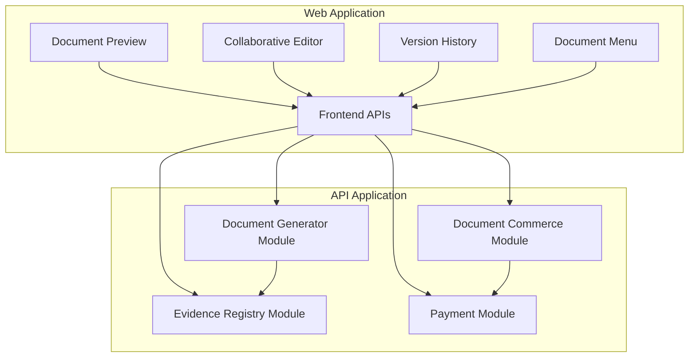
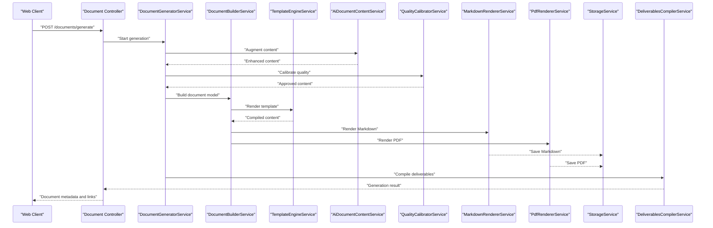
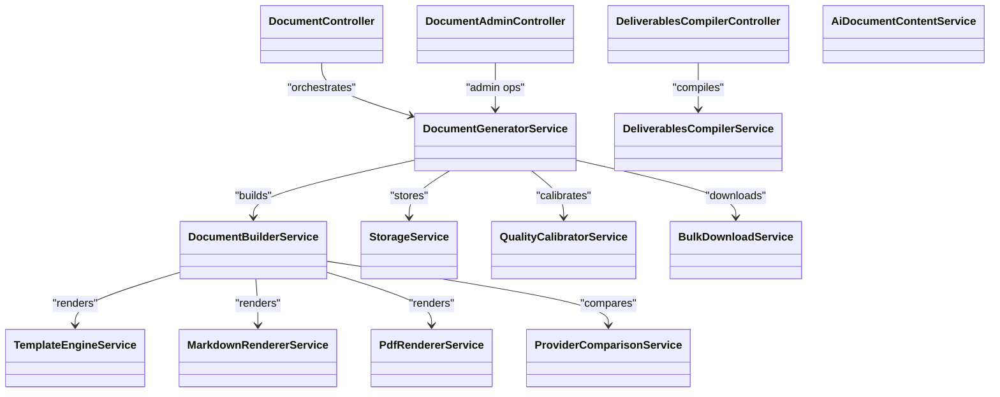
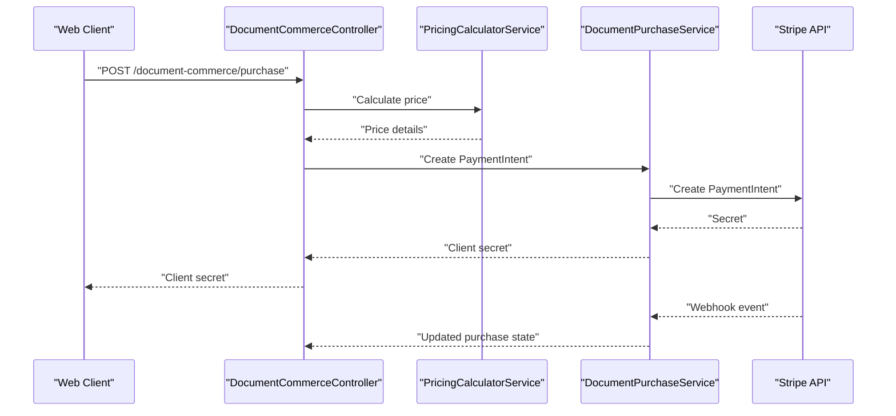
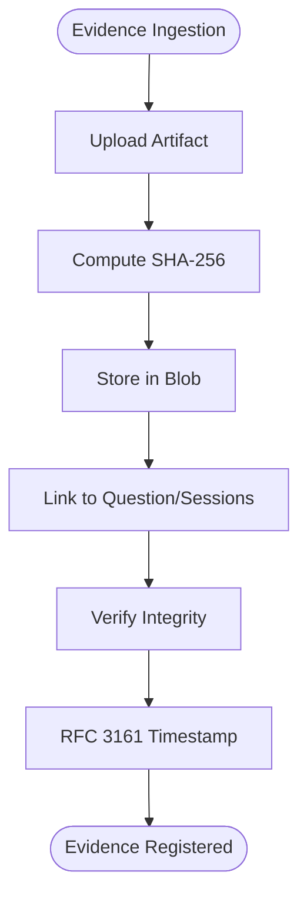
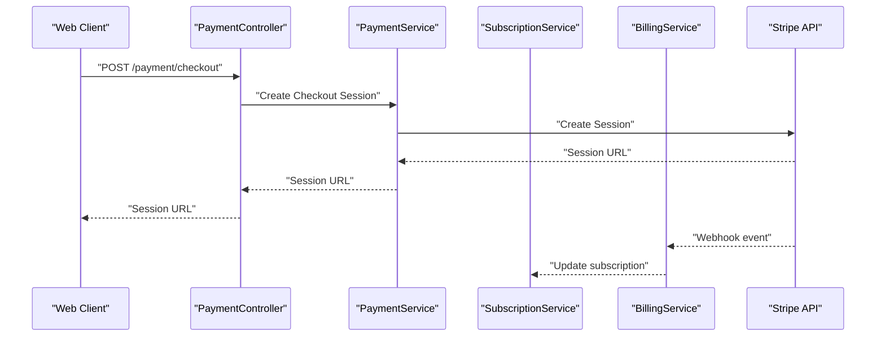
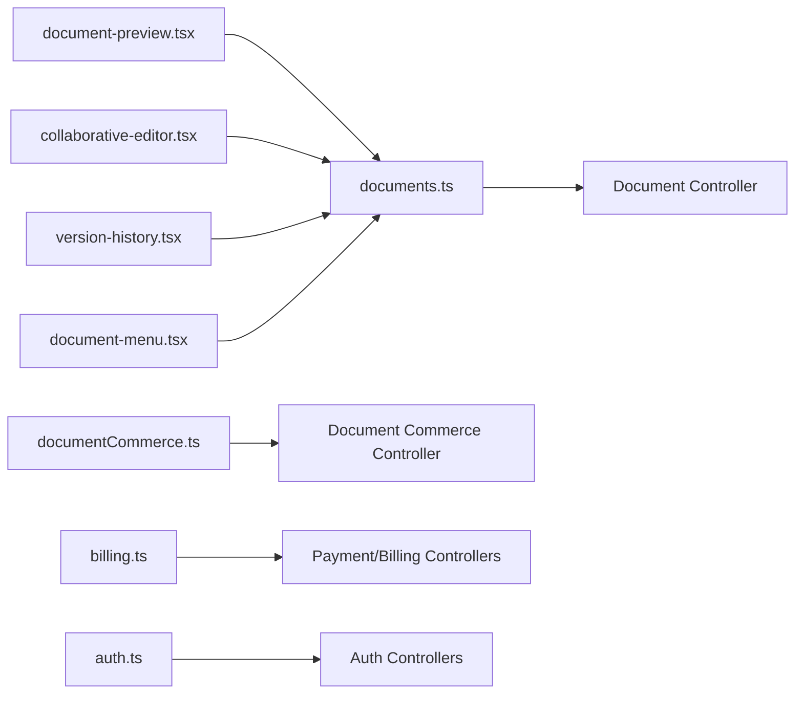
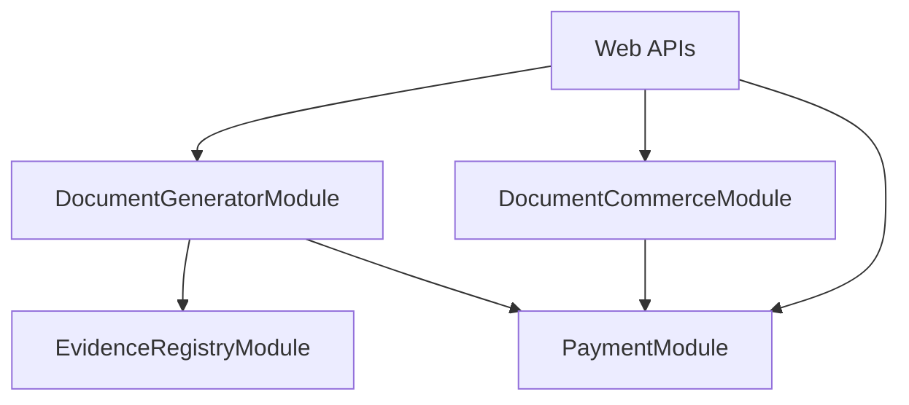

# Automated Document Generation

<cite>
**Referenced Files in This Document**
- [document-generator.module.ts](file://apps/api/src/modules/document-generator/document-generator.module.ts)
- [document-commerce.module.ts](file://apps/api/src/modules/document-commerce/document-commerce.module.ts)
- [evidence-registry.module.ts](file://apps/api/src/modules/evidence-registry/evidence-registry.module.ts)
- [payment.module.ts](file://apps/api/src/modules/payment/payment.module.ts)
- [document.controller.ts](file://apps/api/src/modules/document-generator/controllers/document.controller.ts)
- [document-admin.controller.ts](file://apps/api/src/modules/document-generator/controllers/document-admin.controller.ts)
- [deliverables-compiler.controller.ts](file://apps/api/src/modules/document-generator/controllers/deliverables-compiler.controller.ts)
- [document-commerce.controller.ts](file://apps/api/src/modules/document-commerce/controllers/document-commerce.controller.ts)
- [stripe-webhook.controller.ts](file://apps/api/src/modules/document-commerce/controllers/stripe-webhook.controller.ts)
- [document-generator.service.ts](file://apps/api/src/modules/document-generator/services/document-generator.service.ts)
- [document-builder.service.ts](file://apps/api/src/modules/document-generator/services/document-builder.service.ts)
- [template-engine.service.ts](file://apps/api/src/modules/document-generator/services/template-engine.service.ts)
- [storage.service.ts](file://apps/api/src/modules/document-generator/services/storage.service.ts)
- [deliverables-compiler.service.ts](file://apps/api/src/modules/document-generator/services/deliverables-compiler.service.ts)
- [ai-document-content.service.ts](file://apps/api/src/modules/document-generator/services/ai-document-content.service.ts)
- [quality-calibrator.service.ts](file://apps/api/src/modules/document-generator/services/quality-calibrator.service.ts)
- [markdown-renderer.service.ts](file://apps/api/src/modules/document-generator/services/markdown-renderer.service.ts)
- [pdf-renderer.service.ts](file://apps/api/src/modules/document-generator/services/pdf-renderer.service.ts)
- [pricing-calculator.service.ts](file://apps/api/src/modules/document-commerce/services/pricing-calculator.service.ts)
- [document-purchase.service.ts](file://apps/api/src/modules/document-commerce/services/document-purchase.service.ts)
- [evidence-registry.service.ts](file://apps/api/src/modules/evidence-registry/evidence-registry.service.ts)
- [evidence-integrity.service.ts](file://apps/api/src/modules/evidence-registry/evidence-integrity.service.ts)
- [ci-artifact-ingestion.service.ts](file://apps/api/src/modules/evidence-registry/ci-artifact-ingestion.service.ts)
- [payment.controller.ts](file://apps/api/src/modules/payment/controllers/payment.controller.ts)
- [payment.service.ts](file://apps/api/src/modules/payment/controllers/payment.service.ts)
- [subscription.service.ts](file://apps/api/src/modules/payment/controllers/subscription.service.ts)
- [billing.service.ts](file://apps/api/src/modules/payment/controllers/billing.service.ts)
- [documents.ts](file://apps/web/src/api/documents.ts)
- [documentCommerce.ts](file://apps/web/src/api/documentCommerce.ts)
- [billing.ts](file://apps/web/src/api/billing.ts)
- [auth.ts](file://apps/web/src/api/auth.ts)
- [document-preview.tsx](file://apps/web/src/components/documents/document-preview.tsx)
- [collaborative-editor.tsx](file://apps/web/src/components/collaboration/collaborative-editor.tsx)
- [version-history.tsx](file://apps/web/src/components/collaboration/version-history.tsx)
- [document-menu.tsx](file://apps/web/src/pages/documents/document-menu.tsx)
- [document-generation flow test](file://e2e/document-generation/generation-flow.e2e.test.ts)
- [generation.e2e.test.ts](file://e2e/document-generation/generation.e2e.test.ts)
- [payment.e2e.test.ts](file://e2e/payment/payment.e2e.test.ts)
</cite>

## Table of Contents
1. [Introduction](#introduction)
2. [Project Structure](#project-structure)
3. [Core Components](#core-components)
4. [Architecture Overview](#architecture-overview)
5. [Detailed Component Analysis](#detailed-component-analysis)
6. [Dependency Analysis](#dependency-analysis)
7. [Performance Considerations](#performance-considerations)
8. [Troubleshooting Guide](#troubleshooting-guide)
9. [Conclusion](#conclusion)
10. [Appendices](#appendices)

## Introduction
This document describes the automated document generation system that produces business plans, technical documentation, compliance frameworks, and project deliverables. It covers the template engine architecture, content compilation pipeline, and multi-format output (PDF, Markdown, HTML). It also documents the evidence registry integration, quality calibrator service, and document review workflows; the commerce integration for paid document generation, pricing calculator, and purchase workflows; the frontend document preview components, version history tracking, and collaborative editing features; and the backend APIs for document generation requests, template management, and delivery mechanisms. Finally, it addresses performance optimization, caching strategies, and scalability considerations for large document processing.

## Project Structure
The system is organized into NestJS modules under the API application and React components under the Web application. The key areas are:
- Document Generator Module: orchestration of generation, templating, rendering, storage, and delivery
- Document Commerce Module: pricing and purchase workflows via Stripe
- Evidence Registry Module: integrity, ingestion, and linking of supporting artifacts
- Payment Module: subscriptions and billing
- Frontend APIs and UI components for previews, collaboration, and menus

**Diagram sources**
- [document-generator.module.ts:19-46](file://apps/api/src/modules/document-generator/document-generator.module.ts#L19-L46)
- [document-commerce.module.ts:14-20](file://apps/api/src/modules/document-commerce/document-commerce.module.ts#L14-L20)
- [evidence-registry.module.ts:20-26](file://apps/api/src/modules/evidence-registry/evidence-registry.module.ts#L20-L26)
- [payment.module.ts:18-24](file://apps/api/src/modules/payment/payment.module.ts#L18-L24)

**Section sources**
- [document-generator.module.ts:1-47](file://apps/api/src/modules/document-generator/document-generator.module.ts#L1-L47)
- [document-commerce.module.ts:1-21](file://apps/api/src/modules/document-commerce/document-commerce.module.ts#L1-L21)
- [evidence-registry.module.ts:1-27](file://apps/api/src/modules/evidence-registry/evidence-registry.module.ts#L1-L27)
- [payment.module.ts:1-25](file://apps/api/src/modules/payment/payment.module.ts#L1-L25)

## Core Components
- Document Generator Module: central orchestration of generation, templating, AI content augmentation, quality calibration, rendering, and delivery.
- Document Commerce Module: pricing calculation and purchase workflows using Stripe PaymentIntents and webhooks.
- Evidence Registry Module: integrity verification, CI artifact ingestion, and secure storage integrations.
- Payment Module: Stripe checkout sessions, subscription management, and billing history.
- Frontend APIs and UI: document generation endpoints, preview, collaboration, versioning, and navigation.

Key backend services include:
- DocumentGeneratorService, DocumentBuilderService, TemplateEngineService, StorageService, DeliverablesCompilerService, AiDocumentContentService, QualityCalibratorService, MarkdownRendererService, PdfRendererService, BulkDownloadService
- PricingCalculatorService, DocumentPurchaseService
- EvidenceRegistryService, EvidenceIntegrityService, CIArtifactIngestionService
- PaymentService, SubscriptionService, BillingService

**Section sources**
- [document-generator.module.ts:19-46](file://apps/api/src/modules/document-generator/document-generator.module.ts#L19-L46)
- [document-commerce.module.ts:14-20](file://apps/api/src/modules/document-commerce/document-commerce.module.ts#L14-L20)
- [evidence-registry.module.ts:20-26](file://apps/api/src/modules/evidence-registry/evidence-registry.module.ts#L20-L26)
- [payment.module.ts:18-24](file://apps/api/src/modules/payment/payment.module.ts#L18-L24)

## Architecture Overview
The system integrates frontend requests with backend services to produce documents in multiple formats. Evidence is ingested and verified, AI augments content, quality calibration ensures standards, and renderers produce PDF/HTML/Markdown. Purchasing and delivery are handled by commerce services.

**Diagram sources**
- [document.controller.ts](file://apps/api/src/modules/document-generator/controllers/document.controller.ts)
- [document-generator.service.ts](file://apps/api/src/modules/document-generator/services/document-generator.service.ts)
- [document-builder.service.ts](file://apps/api/src/modules/document-generator/services/document-builder.service.ts)
- [template-engine.service.ts](file://apps/api/src/modules/document-generator/services/template-engine.service.ts)
- [ai-document-content.service.ts](file://apps/api/src/modules/document-generator/services/ai-document-content.service.ts)
- [quality-calibrator.service.ts](file://apps/api/src/modules/document-generator/services/quality-calibrator.service.ts)
- [markdown-renderer.service.ts](file://apps/api/src/modules/document-generator/services/markdown-renderer.service.ts)
- [pdf-renderer.service.ts](file://apps/api/src/modules/document-generator/services/pdf-renderer.service.ts)
- [storage.service.ts](file://apps/api/src/modules/document-generator/services/storage.service.ts)
- [deliverables-compiler.service.ts](file://apps/api/src/modules/document-generator/services/deliverables-compiler.service.ts)

## Detailed Component Analysis

### Document Generator Module
The Document Generator Module coordinates the entire document production pipeline:
- Controllers expose endpoints for generation, admin operations, and deliverables compilation.
- Services handle generation orchestration, building, templating, AI augmentation, quality calibration, rendering, storage, compiler, provider comparison, and bulk downloads.

**Diagram sources**
- [document-generator.module.ts:19-46](file://apps/api/src/modules/document-generator/document-generator.module.ts#L19-L46)
- [document.controller.ts](file://apps/api/src/modules/document-generator/controllers/document.controller.ts)
- [document-admin.controller.ts](file://apps/api/src/modules/document-generator/controllers/document-admin.controller.ts)
- [deliverables-compiler.controller.ts](file://apps/api/src/modules/document-generator/controllers/deliverables-compiler.controller.ts)

**Section sources**
- [document-generator.module.ts:1-47](file://apps/api/src/modules/document-generator/document-generator.module.ts#L1-L47)

### Document Commerce Module
The Document Commerce Module manages per-document pricing and purchases:
- PricingCalculatorService computes costs based on document type and complexity.
- DocumentPurchaseService handles Stripe PaymentIntent creation and purchase lifecycle.
- Controllers expose endpoints for initiating purchases and Stripe webhook handling.

**Diagram sources**
- [document-commerce.module.ts:14-20](file://apps/api/src/modules/document-commerce/document-commerce.module.ts#L14-L20)
- [document-commerce.controller.ts](file://apps/api/src/modules/document-commerce/controllers/document-commerce.controller.ts)
- [stripe-webhook.controller.ts](file://apps/api/src/modules/document-commerce/controllers/stripe-webhook.controller.ts)
- [pricing-calculator.service.ts](file://apps/api/src/modules/document-commerce/services/pricing-calculator.service.ts)
- [document-purchase.service.ts](file://apps/api/src/modules/document-commerce/services/document-purchase.service.ts)

**Section sources**
- [document-commerce.module.ts:1-21](file://apps/api/src/modules/document-commerce/document-commerce.module.ts#L1-L21)

### Evidence Registry Module
The Evidence Registry Module ensures integrity and provenance of supporting artifacts:
- EvidenceRegistryService manages evidence records and links to questions/sessions.
- EvidenceIntegrityService verifies hashes and maintains integrity.
- CIArtifactIngestionService automates ingestion of CI artifacts.

**Diagram sources**
- [evidence-registry.module.ts:20-26](file://apps/api/src/modules/evidence-registry/evidence-registry.module.ts#L20-L26)
- [evidence-registry.service.ts](file://apps/api/src/modules/evidence-registry/evidence-registry.service.ts)
- [evidence-integrity.service.ts](file://apps/api/src/modules/evidence-registry/evidence-integrity.service.ts)
- [ci-artifact-ingestion.service.ts](file://apps/api/src/modules/evidence-registry/ci-artifact-ingestion.service.ts)

**Section sources**
- [evidence-registry.module.ts:1-27](file://apps/api/src/modules/evidence-registry/evidence-registry.module.ts#L1-L27)

### Payment Module
The Payment Module integrates with Stripe for subscriptions and billing:
- PaymentController exposes endpoints for checkout sessions.
- PaymentService, SubscriptionService, and BillingService manage Stripe interactions.

**Diagram sources**
- [payment.module.ts:18-24](file://apps/api/src/modules/payment/payment.module.ts#L18-L24)
- [payment.controller.ts](file://apps/api/src/modules/payment/controllers/payment.controller.ts)
- [payment.service.ts](file://apps/api/src/modules/payment/controllers/payment.service.ts)
- [subscription.service.ts](file://apps/api/src/modules/payment/controllers/subscription.service.ts)
- [billing.service.ts](file://apps/api/src/modules/payment/controllers/billing.service.ts)

**Section sources**
- [payment.module.ts:1-25](file://apps/api/src/modules/payment/payment.module.ts#L1-L25)

### Frontend APIs and Components
Frontend APIs connect to backend services for document generation, commerce, and billing. UI components provide preview, collaboration, version history, and document menu.

**Diagram sources**
- [documents.ts](file://apps/web/src/api/documents.ts)
- [documentCommerce.ts](file://apps/web/src/api/documentCommerce.ts)
- [billing.ts](file://apps/web/src/api/billing.ts)
- [auth.ts](file://apps/web/src/api/auth.ts)
- [document-preview.tsx](file://apps/web/src/components/documents/document-preview.tsx)
- [collaborative-editor.tsx](file://apps/web/src/components/collaboration/collaborative-editor.tsx)
- [version-history.tsx](file://apps/web/src/components/collaboration/version-history.tsx)
- [document-menu.tsx](file://apps/web/src/pages/documents/document-menu.tsx)

**Section sources**
- [documents.ts](file://apps/web/src/api/documents.ts)
- [documentCommerce.ts](file://apps/web/src/api/documentCommerce.ts)
- [billing.ts](file://apps/web/src/api/billing.ts)
- [auth.ts](file://apps/web/src/api/auth.ts)
- [document-preview.tsx](file://apps/web/src/components/documents/document-preview.tsx)
- [collaborative-editor.tsx](file://apps/web/src/components/collaboration/collaborative-editor.tsx)
- [version-history.tsx](file://apps/web/src/components/collaboration/version-history.tsx)
- [document-menu.tsx](file://apps/web/src/pages/documents/document-menu.tsx)

## Dependency Analysis
The modules are loosely coupled and rely on shared database and configuration modules. The Document Generator depends on Evidence Registry for integrity and content provenance. The Document Commerce and Payment modules integrate with Stripe. Frontend APIs depend on backend controllers.

**Diagram sources**
- [document-generator.module.ts:19-46](file://apps/api/src/modules/document-generator/document-generator.module.ts#L19-L46)
- [document-commerce.module.ts:14-20](file://apps/api/src/modules/document-commerce/document-commerce.module.ts#L14-L20)
- [evidence-registry.module.ts:20-26](file://apps/api/src/modules/evidence-registry/evidence-registry.module.ts#L20-L26)
- [payment.module.ts:18-24](file://apps/api/src/modules/payment/payment.module.ts#L18-L24)

**Section sources**
- [document-generator.module.ts:19-46](file://apps/api/src/modules/document-generator/document-generator.module.ts#L19-L46)
- [document-commerce.module.ts:14-20](file://apps/api/src/modules/document-commerce/document-commerce.module.ts#L14-L20)
- [evidence-registry.module.ts:20-26](file://apps/api/src/modules/evidence-registry/evidence-registry.module.ts#L20-L26)
- [payment.module.ts:18-24](file://apps/api/src/modules/payment/payment.module.ts#L18-L24)

## Performance Considerations
- Asynchronous processing: Offload heavy rendering and storage operations to background tasks to avoid blocking API responses.
- Caching: Cache compiled templates and frequently accessed rendered outputs to reduce repeated computation.
- Streaming: Stream PDF/HTML generation to clients to minimize memory usage during large document builds.
- Parallelization: Render multiple formats concurrently when possible.
- Database optimization: Index queries for evidence lookup and document metadata retrieval.
- CDN: Serve static assets and generated documents via CDN for improved latency.
- Memory optimization: Use memory optimization utilities to prevent leaks and limit peak memory during batch operations.
- Horizontal scaling: Scale API instances behind load balancers; persist state in shared databases and blob storage.

[No sources needed since this section provides general guidance]

## Troubleshooting Guide
Common issues and resolutions:
- Generation failures: Verify template availability and content completeness; check AI augmentation and quality calibration logs.
- Rendering errors: Confirm renderer configurations and supported formats; validate input content structure.
- Storage failures: Ensure blob storage credentials and permissions; monitor upload/download retries.
- Purchase failures: Validate Stripe keys and webhook endpoints; confirm PaymentIntent status and currency settings.
- Evidence integrity: Re-hash artifacts and re-ingest if mismatches occur; verify RFC 3161 timestamps.
- Frontend preview: Clear browser cache; ensure CORS and authentication headers are set correctly.

**Section sources**
- [memory-optimization.service.ts](file://apps/api/src/common/services/memory-optimization.service.ts)

## Conclusion
The automated document generation system integrates templating, AI augmentation, quality calibration, and multi-format rendering with secure storage and delivery. Evidence registry ensures integrity and provenance, while commerce and payment modules enable monetization. The frontend provides previews, collaboration, and versioning. With proper caching, streaming, and horizontal scaling, the system can efficiently handle large document workloads.

[No sources needed since this section summarizes without analyzing specific files]

## Appendices

### Document Types Supported
- Business Plans
- Technical Documentation
- Compliance Frameworks
- Project Deliverables
- Requirements Documents
- Functional Specifications
- Process Maps and Flowcharts
- User Stories and Use Cases

[No sources needed since this section provides general guidance]

### Multi-format Output
- PDF: produced via dedicated renderer
- Markdown: produced via dedicated renderer
- HTML: produced via dedicated renderer

**Section sources**
- [pdf-renderer.service.ts](file://apps/api/src/modules/document-generator/services/pdf-renderer.service.ts)
- [markdown-renderer.service.ts](file://apps/api/src/modules/document-generator/services/markdown-renderer.service.ts)

### End-to-End Test Coverage
- Document generation flow tests validate end-to-end generation and delivery.
- Payment flow tests validate purchase and webhook handling.

**Section sources**
- [generation-flow.e2e.test.ts](file://e2e/document-generation/generation-flow.e2e.test.ts)
- [generation.e2e.test.ts](file://e2e/document-generation/generation.e2e.test.ts)
- [payment.e2e.test.ts](file://e2e/payment/payment.e2e.test.ts)