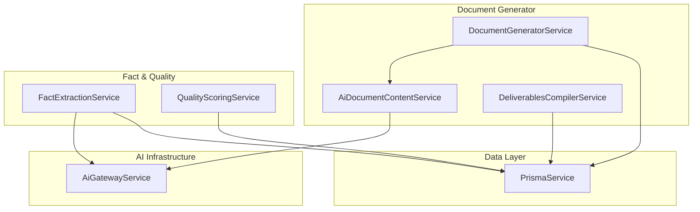
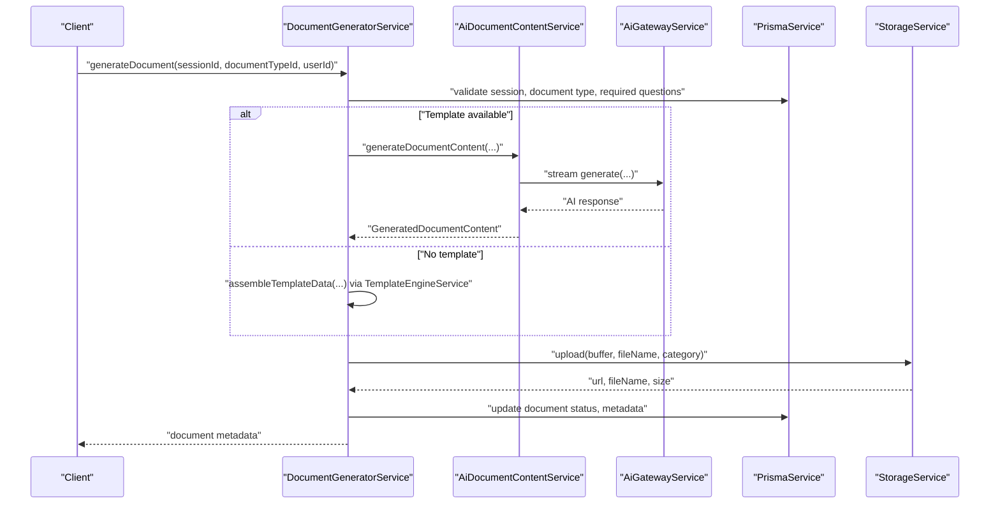
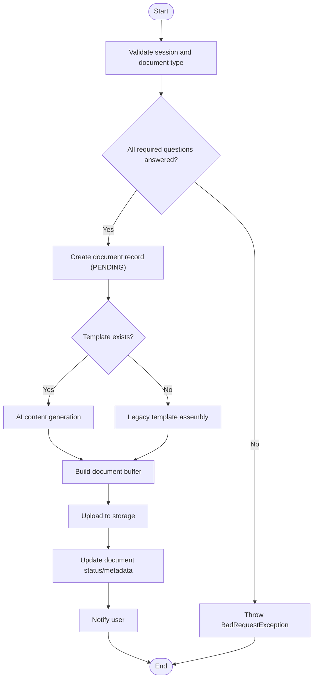
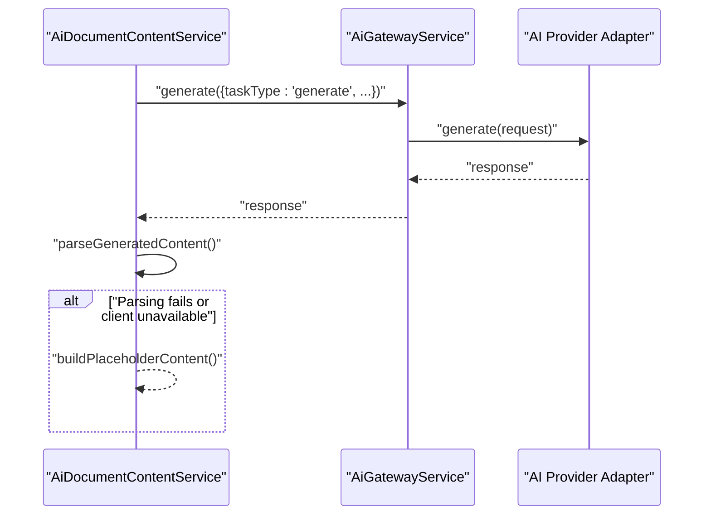
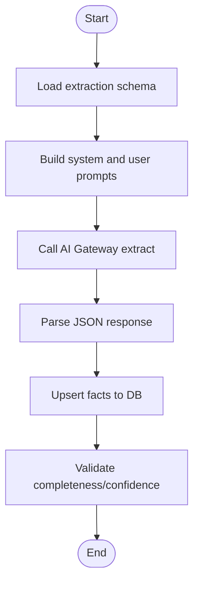
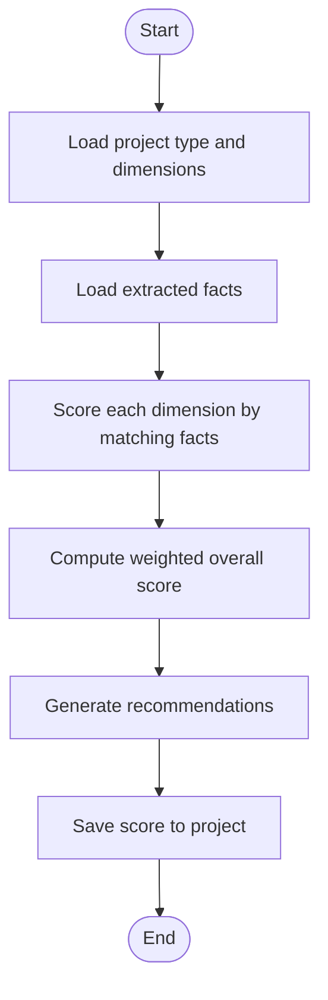
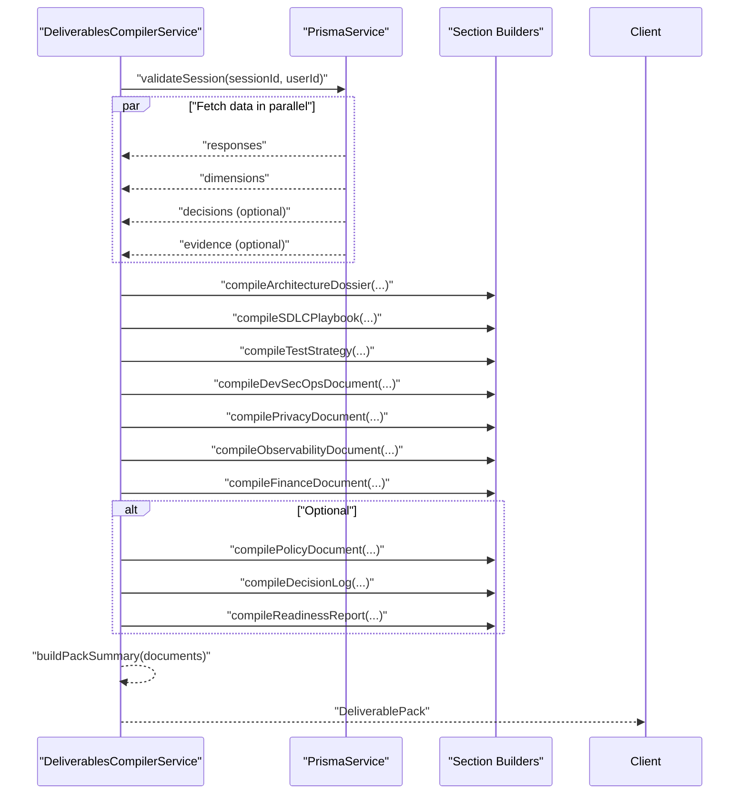
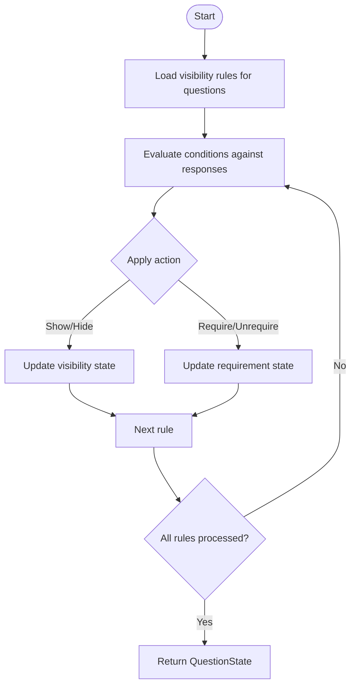
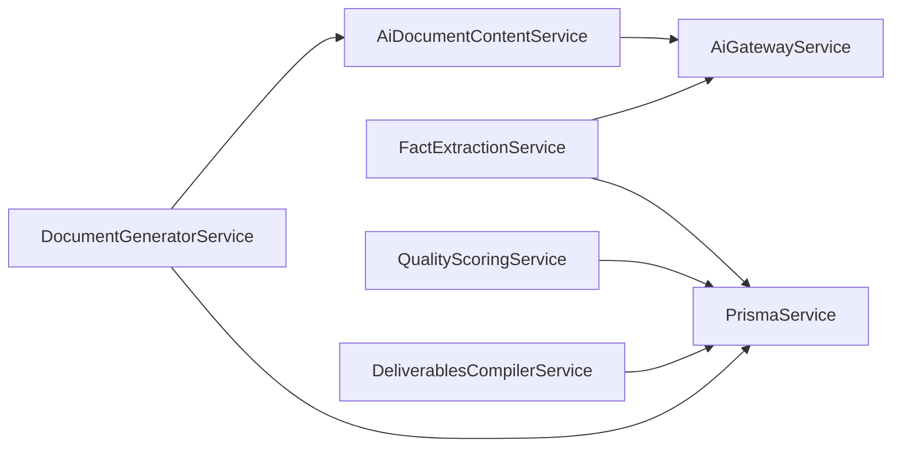

# Content Compilation Pipeline

<cite>
**Referenced Files in This Document**
- [document-generator.module.ts](file://apps/api/src/modules/document-generator/document-generator.module.ts)
- [document-generator.service.ts](file://apps/api/src/modules/document-generator/services/document-generator.service.ts)
- [deliverables-compiler.service.ts](file://apps/api/src/modules/document-generator/services/deliverables-compiler.service.ts)
- [ai-document-content.service.ts](file://apps/api/src/modules/document-generator/services/ai-document-content.service.ts)
- [fact-extraction.service.ts](file://apps/api/src/modules/fact-extraction/services/fact-extraction.service.ts)
- [quality-scoring.service.ts](file://apps/api/src/modules/quality-scoring/services/quality-scoring.service.ts)
- [ai-gateway.service.ts](file://apps/api/src/modules/ai-gateway/ai-gateway.service.ts)
- [adaptive-logic.service.ts](file://apps/api/src/modules/adaptive-logic/adaptive-logic.service.ts)
</cite>

## Table of Contents
1. [Introduction](#introduction)
2. [Project Structure](#project-structure)
3. [Core Components](#core-components)
4. [Architecture Overview](#architecture-overview)
5. [Detailed Component Analysis](#detailed-component-analysis)
6. [Dependency Analysis](#dependency-analysis)
7. [Performance Considerations](#performance-considerations)
8. [Troubleshooting Guide](#troubleshooting-guide)
9. [Conclusion](#conclusion)

## Introduction
This document explains the content compilation pipeline that transforms raw data from user sessions and external sources into structured, validated, and quality-scored deliverables. It covers:
- Document assembly and content aggregation from multiple sources
- Intelligent ordering and orchestration of content
- AI-powered content generation integration
- Fact extraction coordination and quality scoring integration
- Compilation workflow from raw data to final document output
- Validation, formatting rules, and consistency checks
- Examples of multi-source integration, dynamic content insertion, and conditional inclusion
- Error handling, retries, and fallback strategies
- Performance optimization and parallel processing capabilities

## Project Structure
The content compilation pipeline spans several modules:
- Document Generator: orchestrates document creation, integrates AI content, and manages storage
- Fact Extraction: extracts structured facts from conversations and validates completeness/confidence
- Quality Scoring: evaluates project facts against benchmark criteria to compute quality metrics
- AI Gateway: routes AI requests across providers with fallback and cost tracking
- Adaptive Logic: computes visibility and branching rules for questionnaire flows (contextual to content ordering)

**Diagram sources**
- [document-generator.module.ts:19-47](file://apps/api/src/modules/document-generator/document-generator.module.ts#L19-L47)
- [document-generator.service.ts:22-32](file://apps/api/src/modules/document-generator/services/document-generator.service.ts#L22-L32)
- [deliverables-compiler.service.ts:48-51](file://apps/api/src/modules/document-generator/services/deliverables-compiler.service.ts#L48-L51)
- [ai-document-content.service.ts:60-81](file://apps/api/src/modules/document-generator/services/ai-document-content.service.ts#L60-L81)
- [fact-extraction.service.ts:25-31](file://apps/api/src/modules/fact-extraction/services/fact-extraction.service.ts#L25-L31)
- [quality-scoring.service.ts:28-31](file://apps/api/src/modules/quality-scoring/services/quality-scoring.service.ts#L28-L31)
- [ai-gateway.service.ts:22-37](file://apps/api/src/modules/ai-gateway/ai-gateway.service.ts#L22-L37)

**Section sources**
- [document-generator.module.ts:19-47](file://apps/api/src/modules/document-generator/document-generator.module.ts#L19-L47)

## Core Components
- DocumentGeneratorService: Validates sessions and document types, orchestrates AI or template-based generation, builds documents, uploads artifacts, and notifies users.
- AiDocumentContentService: Generates structured document content using AI with streaming and robust fallbacks.
- DeliverablesCompilerService: Compiles a complete deliverables pack from session data, optional decisions, and evidence items.
- FactExtractionService: Extracts structured facts from conversations, validates completeness/confidence, and persists them.
- QualityScoringService: Scores project facts against benchmark criteria to derive overall and dimension scores.
- AiGatewayService: Centralized AI request routing with provider fallback, streaming support, and cost tracking.
- AdaptiveLogicService: Computes visibility and branching rules for questionnaire flows (supports intelligent ordering of content).

**Section sources**
- [document-generator.service.ts:22-32](file://apps/api/src/modules/document-generator/services/document-generator.service.ts#L22-L32)
- [ai-document-content.service.ts:60-81](file://apps/api/src/modules/document-generator/services/ai-document-content.service.ts#L60-L81)
- [deliverables-compiler.service.ts:48-51](file://apps/api/src/modules/document-generator/services/deliverables-compiler.service.ts#L48-L51)
- [fact-extraction.service.ts:25-31](file://apps/api/src/modules/fact-extraction/services/fact-extraction.service.ts#L25-L31)
- [quality-scoring.service.ts:28-31](file://apps/api/src/modules/quality-scoring/services/quality-scoring.service.ts#L28-L31)
- [ai-gateway.service.ts:22-37](file://apps/api/src/modules/ai-gateway/ai-gateway.service.ts#L22-L37)
- [adaptive-logic.service.ts:20-24](file://apps/api/src/modules/adaptive-logic/adaptive-logic.service.ts#L20-L24)

## Architecture Overview
The pipeline follows a staged flow:
1. Input validation and preparation
2. Content sourcing (session answers, facts, decisions, evidence)
3. AI-powered content generation or template-based composition
4. Formatting and rendering
5. Storage and distribution
6. Notifications and approvals

**Diagram sources**
- [document-generator.service.ts:37-219](file://apps/api/src/modules/document-generator/services/document-generator.service.ts#L37-L219)
- [ai-document-content.service.ts:94-153](file://apps/api/src/modules/document-generator/services/ai-document-content.service.ts#L94-L153)
- [ai-gateway.service.ts:133-188](file://apps/api/src/modules/ai-gateway/ai-gateway.service.ts#L133-L188)

## Detailed Component Analysis

### Document Assembly and Aggregation
- Validates session completion and ownership, document type availability, and required questions.
- Loads session answers and project type name for context.
- Chooses AI-powered generation when a template exists; otherwise falls back to legacy template assembly.
- Builds document buffers and uploads artifacts to storage with metadata.
- Emits notifications upon completion.

**Diagram sources**
- [document-generator.service.ts:37-219](file://apps/api/src/modules/document-generator/services/document-generator.service.ts#L37-L219)

**Section sources**
- [document-generator.service.ts:37-219](file://apps/api/src/modules/document-generator/services/document-generator.service.ts#L37-L219)

### AI-Powered Content Generation Integration
- Uses AiDocumentContentService to generate structured content via AI.
- Streams responses to avoid timeouts and supports extended thinking for quality.
- Parses JSON responses and validates schema; falls back to placeholder content when unavailable or invalid.
- Integrates with AiGatewayService for provider selection and fallback.

**Diagram sources**
- [ai-document-content.service.ts:94-153](file://apps/api/src/modules/document-generator/services/ai-document-content.service.ts#L94-L153)
- [ai-gateway.service.ts:133-188](file://apps/api/src/modules/ai-gateway/ai-gateway.service.ts#L133-L188)

**Section sources**
- [ai-document-content.service.ts:94-153](file://apps/api/src/modules/document-generator/services/ai-document-content.service.ts#L94-L153)
- [ai-gateway.service.ts:133-188](file://apps/api/src/modules/ai-gateway/ai-gateway.service.ts#L133-L188)

### Fact Extraction Coordination
- Extracts structured facts from conversation content using AI with schema-driven prompts.
- Avoids duplicates by comparing with existing facts.
- Persists facts with confidence levels and allows manual overrides.
- Validates completeness and confidence against schema requirements.

**Diagram sources**
- [fact-extraction.service.ts:36-77](file://apps/api/src/modules/fact-extraction/services/fact-extraction.service.ts#L36-L77)
- [fact-extraction.service.ts:144-187](file://apps/api/src/modules/fact-extraction/services/fact-extraction.service.ts#L144-L187)
- [fact-extraction.service.ts:211-243](file://apps/api/src/modules/fact-extraction/services/fact-extraction.service.ts#L211-L243)

**Section sources**
- [fact-extraction.service.ts:36-77](file://apps/api/src/modules/fact-extraction/services/fact-extraction.service.ts#L36-L77)
- [fact-extraction.service.ts:144-187](file://apps/api/src/modules/fact-extraction/services/fact-extraction.service.ts#L144-L187)
- [fact-extraction.service.ts:211-243](file://apps/api/src/modules/fact-extraction/services/fact-extraction.service.ts#L211-L243)

### Quality Scoring Integration
- Calculates per-dimension scores by matching facts to benchmark criteria.
- Computes overall score as a weighted average and generates recommendations.
- Provides improvement suggestions and saves scores to the project record.

**Diagram sources**
- [quality-scoring.service.ts:36-94](file://apps/api/src/modules/quality-scoring/services/quality-scoring.service.ts#L36-L94)
- [quality-scoring.service.ts:276-302](file://apps/api/src/modules/quality-scoring/services/quality-scoring.service.ts#L276-L302)

**Section sources**
- [quality-scoring.service.ts:36-94](file://apps/api/src/modules/quality-scoring/services/quality-scoring.service.ts#L36-L94)
- [quality-scoring.service.ts:276-302](file://apps/api/src/modules/quality-scoring/services/quality-scoring.service.ts#L276-L302)

### Deliverables Compilation Workflow
- Compiles a complete deliverables pack by orchestrating multiple document builders.
- Fetches session responses, dimension scores, decisions, and evidence items in parallel.
- Applies conditional inclusion (policy pack, decision log, readiness report) based on options.
- Produces a summary and metadata for downstream use.

**Diagram sources**
- [deliverables-compiler.service.ts:56-137](file://apps/api/src/modules/document-generator/services/deliverables-compiler.service.ts#L56-L137)

**Section sources**
- [deliverables-compiler.service.ts:56-137](file://apps/api/src/modules/document-generator/services/deliverables-compiler.service.ts#L56-L137)

### Intelligent Content Ordering and Conditional Inclusion
- AdaptiveLogicService computes visibility and branching rules for questionnaire flows, enabling dynamic inclusion of questions and sections.
- This contextual logic supports intelligent ordering during content assembly by determining which sections should appear based on prior answers.

**Diagram sources**
- [adaptive-logic.service.ts:69-132](file://apps/api/src/modules/adaptive-logic/adaptive-logic.service.ts#L69-L132)

**Section sources**
- [adaptive-logic.service.ts:69-132](file://apps/api/src/modules/adaptive-logic/adaptive-logic.service.ts#L69-L132)

### Content Validation, Formatting, and Consistency Checks
- Document generation validates session status, ownership, and required questions before proceeding.
- AI content generation enforces JSON schema compliance and parses structured output; invalid responses fall back to placeholder content.
- Fact extraction validates completeness and confidence against schema requirements and avoids duplicates.
- Quality scoring ensures benchmark criteria alignment and calculates weighted scores with recommendations.

**Section sources**
- [document-generator.service.ts:40-100](file://apps/api/src/modules/document-generator/services/document-generator.service.ts#L40-L100)
- [ai-document-content.service.ts:251-291](file://apps/api/src/modules/document-generator/services/ai-document-content.service.ts#L251-L291)
- [fact-extraction.service.ts:211-243](file://apps/api/src/modules/fact-extraction/services/fact-extraction.service.ts#L211-L243)
- [quality-scoring.service.ts:100-151](file://apps/api/src/modules/quality-scoring/services/quality-scoring.service.ts#L100-L151)

### Multi-Source Content Integration and Dynamic Insertion
- Session answers are grouped by dimension keys to provide contextual content for AI generation.
- Deliverables compilation aggregates responses, decisions, and evidence items to construct comprehensive documents.
- Placeholder content dynamically inserts relevant session answers when AI generation is unavailable.

**Section sources**
- [document-generator.service.ts:224-246](file://apps/api/src/modules/document-generator/services/document-generator.service.ts#L224-L246)
- [deliverables-compiler.service.ts:71-76](file://apps/api/src/modules/document-generator/services/deliverables-compiler.service.ts#L71-L76)
- [ai-document-content.service.ts:317-357](file://apps/api/src/modules/document-generator/services/ai-document-content.service.ts#L317-L357)

### Compilation Error Handling, Retries, and Fallback Strategies
- Document generation wraps processing in try/catch, marking documents as failed with metadata and rethrowing errors.
- AiDocumentContentService falls back to placeholder content when the AI client is unavailable or parsing fails.
- AiGatewayService implements provider fallback order and tracks cost on successful calls; streams yield error chunks when all providers fail.
- Fact extraction returns empty results gracefully and logs errors; saves facts with upsert semantics to avoid duplication.

**Section sources**
- [document-generator.service.ts:114-129](file://apps/api/src/modules/document-generator/services/document-generator.service.ts#L114-L129)
- [ai-document-content.service.ts:97-110](file://apps/api/src/modules/document-generator/services/ai-document-content.service.ts#L97-L110)
- [ai-gateway.service.ts:139-188](file://apps/api/src/modules/ai-gateway/ai-gateway.service.ts#L139-L188)
- [fact-extraction.service.ts:71-77](file://apps/api/src/modules/fact-extraction/services/fact-extraction.service.ts#L71-L77)
- [fact-extraction.service.ts:154-175](file://apps/api/src/modules/fact-extraction/services/fact-extraction.service.ts#L154-L175)

## Dependency Analysis
- DocumentGeneratorService depends on TemplateEngineService, DocumentBuilderService, StorageService, NotificationService, and AiDocumentContentService.
- AiDocumentContentService depends on ConfigService and AiGatewayService.
- DeliverablesCompilerService depends on PrismaService and multiple section builder functions.
- FactExtractionService depends on AiGatewayService and PrismaService.
- QualityScoringService depends on PrismaService.
- AiGatewayService depends on provider adapters and CostTrackerService.

**Diagram sources**
- [document-generator.service.ts:25-31](file://apps/api/src/modules/document-generator/services/document-generator.service.ts#L25-L31)
- [ai-document-content.service.ts:66-69](file://apps/api/src/modules/document-generator/services/ai-document-content.service.ts#L66-L69)
- [fact-extraction.service.ts:28-31](file://apps/api/src/modules/fact-extraction/services/fact-extraction.service.ts#L28-L31)
- [quality-scoring.service.ts:31](file://apps/api/src/modules/quality-scoring/services/quality-scoring.service.ts#L31)
- [deliverables-compiler.service.ts:51](file://apps/api/src/modules/document-generator/services/deliverables-compiler.service.ts#L51)

**Section sources**
- [document-generator.module.ts:19-47](file://apps/api/src/modules/document-generator/document-generator.module.ts#L19-L47)

## Performance Considerations
- Parallel data fetching: Deliverables compilation fetches responses, dimensions, decisions, and evidence items concurrently to reduce latency.
- Streaming AI generation: AiDocumentContentService streams responses to avoid timeouts and improve throughput.
- Provider fallback: AiGatewayService attempts providers in order and tracks costs, minimizing downtime and optimizing resource usage.
- Placeholder content: When AI is unavailable, AiDocumentContentService still produces structured content to keep the pipeline moving.
- Asynchronous processing: Document generation updates status and emits notifications after asynchronous work completes.

[No sources needed since this section provides general guidance]

## Troubleshooting Guide
- Document generation failures: Check session status, ownership, and required questions. Review generation metadata for error details and timestamps.
- AI content generation issues: Verify ANTHROPIC_API_KEY configuration and model settings; inspect fallback behavior and placeholder content generation.
- Fact extraction errors: Confirm schema availability for project type, review AI gateway health, and check parsing logs for malformed responses.
- Quality scoring anomalies: Validate benchmark criteria JSON, ensure sufficient facts exist, and confirm dimension weights.
- Provider unavailability: Inspect AiGatewayService health status and provider availability; adjust default provider and model mappings.

**Section sources**
- [document-generator.service.ts:114-129](file://apps/api/src/modules/document-generator/services/document-generator.service.ts#L114-L129)
- [ai-document-content.service.ts:71-81](file://apps/api/src/modules/document-generator/services/ai-document-content.service.ts#L71-L81)
- [fact-extraction.service.ts:71-77](file://apps/api/src/modules/fact-extraction/services/fact-extraction.service.ts#L71-L77)
- [quality-scoring.service.ts:307-317](file://apps/api/src/modules/quality-scoring/services/quality-scoring.service.ts#L307-L317)
- [ai-gateway.service.ts:290-314](file://apps/api/src/modules/ai-gateway/ai-gateway.service.ts#L290-L314)

## Conclusion
The content compilation pipeline integrates session data, AI-generated content, extracted facts, and quality metrics into a cohesive set of deliverables. It emphasizes robustness through fallbacks, scalability via parallelism and streaming, and consistency through validation and schema enforcement. By leveraging adaptive logic and quality scoring, the system supports intelligent ordering and continuous improvement of document outputs.