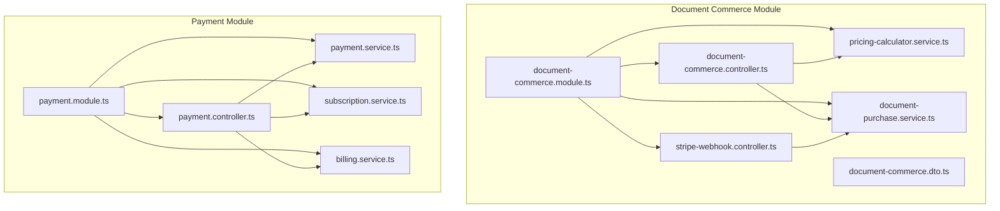
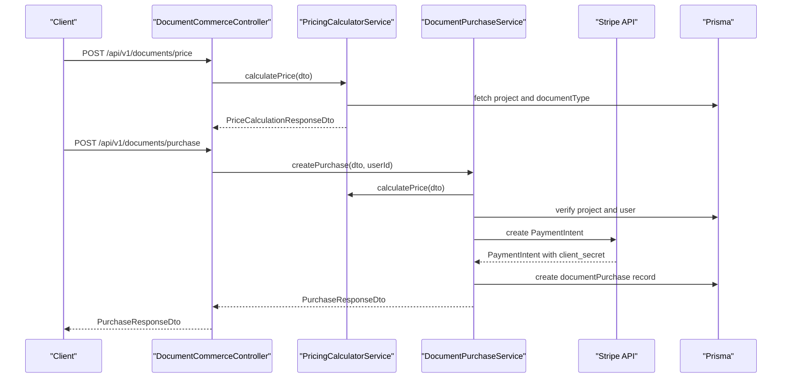
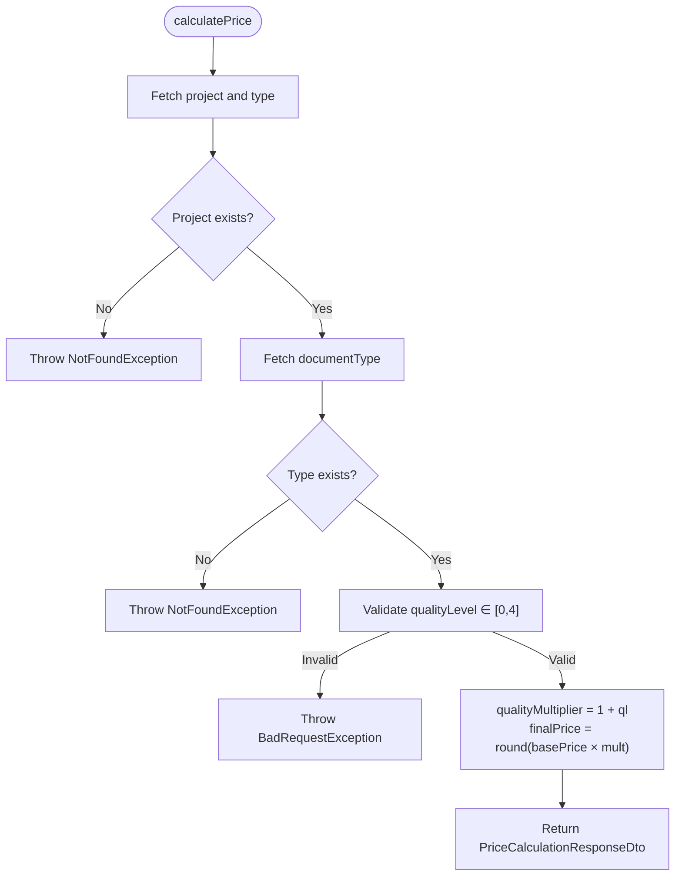
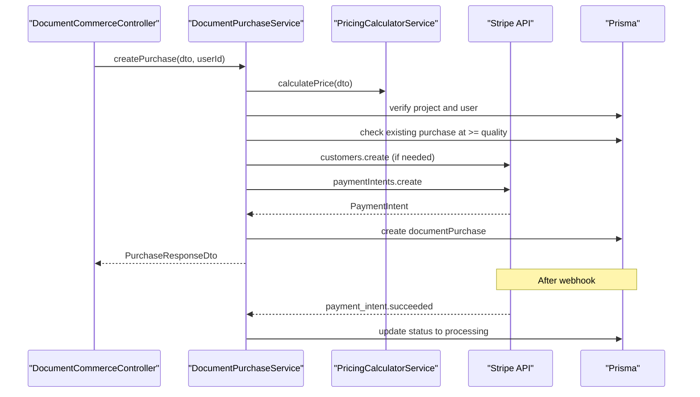
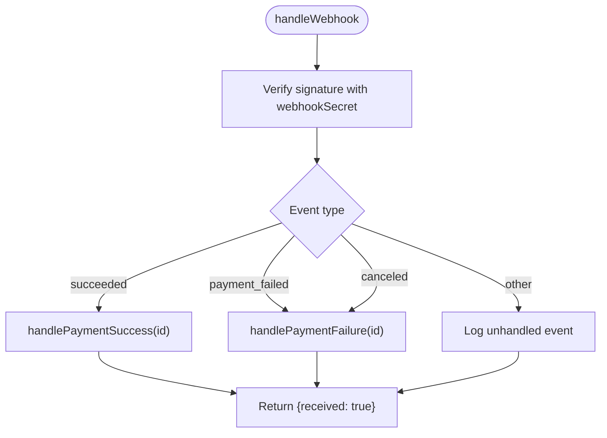
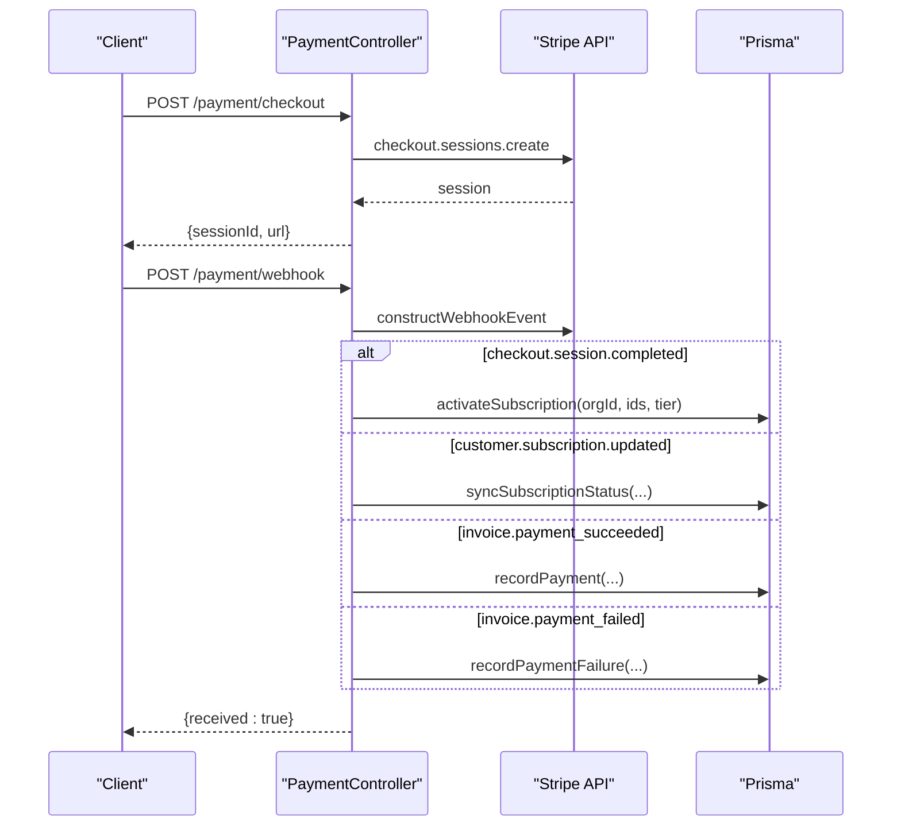
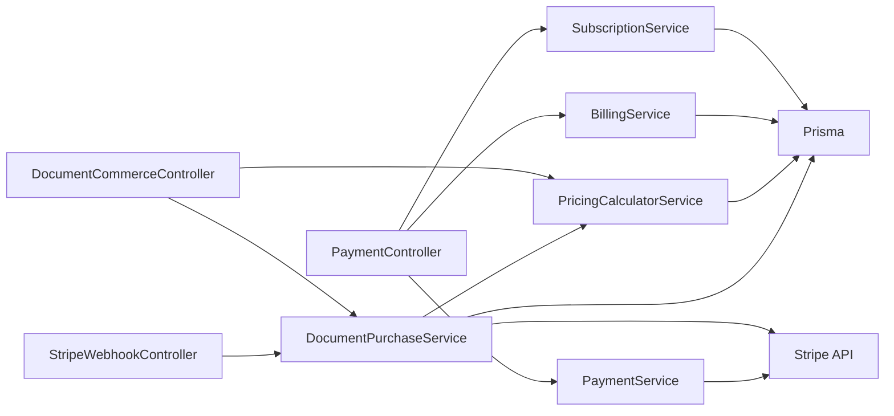

# Document Commerce & Monetization

<cite>
**Referenced Files in This Document**
- [document-commerce.module.ts](file://apps/api/src/modules/document-commerce/document-commerce.module.ts)
- [document-commerce.controller.ts](file://apps/api/src/modules/document-commerce/document-commerce.controller.ts)
- [stripe-webhook.controller.ts](file://apps/api/src/modules/document-commerce/stripe-webhook.controller.ts)
- [pricing-calculator.service.ts](file://apps/api/src/modules/document-commerce/services/pricing-calculator.service.ts)
- [document-purchase.service.ts](file://apps/api/src/modules/document-commerce/services/document-purchase.service.ts)
- [document-commerce.dto.ts](file://apps/api/src/modules/document-commerce/dto/document-commerce.dto.ts)
- [payment.module.ts](file://apps/api/src/modules/payment/payment.module.ts)
- [payment.controller.ts](file://apps/api/src/modules/payment/payment.controller.ts)
- [payment.service.ts](file://apps/api/src/modules/payment/payment.service.ts)
- [subscription.service.ts](file://apps/api/src/modules/payment/subscription.service.ts)
- [billing.service.ts](file://apps/api/src/modules/payment/billing.service.ts)
</cite>

## Table of Contents
1. [Introduction](#introduction)
2. [Project Structure](#project-structure)
3. [Core Components](#core-components)
4. [Architecture Overview](#architecture-overview)
5. [Detailed Component Analysis](#detailed-component-analysis)
6. [Dependency Analysis](#dependency-analysis)
7. [Performance Considerations](#performance-considerations)
8. [Troubleshooting Guide](#troubleshooting-guide)
9. [Conclusion](#conclusion)
10. [Appendices](#appendices)

## Introduction
This document describes the document commerce and monetization system, covering:
- Pricing calculator service for per-document purchases
- Subscription management for recurring billing
- Monetization models: per-document pay-as-you-go and subscription tiers
- Document purchase workflow and payment processing integration with Stripe
- Revenue tracking, billing reconciliation, and invoice generation
- Order management, fulfillment, and access control
- Promotional pricing strategies and discount handling
- Fraud detection, payment security, and compliance considerations

## Project Structure
The commerce system is split into two primary modules:
- Document Commerce: per-document pricing, purchase orchestration, and Stripe PaymentIntents
- Payment: subscription tiers, checkout sessions, billing history, and webhook handling

**Diagram sources**
- [document-commerce.module.ts:14-20](file://apps/api/src/modules/document-commerce/document-commerce.module.ts#L14-L20)
- [payment.module.ts:18-24](file://apps/api/src/modules/payment/payment.module.ts#L18-L24)

**Section sources**
- [document-commerce.module.ts:1-21](file://apps/api/src/modules/document-commerce/document-commerce.module.ts#L1-L21)
- [payment.module.ts:1-25](file://apps/api/src/modules/payment/payment.module.ts#L1-L25)

## Core Components
- PricingCalculatorService: Computes per-document prices based on quality levels and document types, and enumerates project-specific available documents.
- DocumentPurchaseService: Creates Stripe PaymentIntents for purchases, manages purchase lifecycle, and handles webhook outcomes.
- StripeWebhookController: Validates and routes Stripe webhook events to the appropriate handlers.
- PaymentController: Manages subscription tiers, checkout sessions, billing portal, invoices, usage, cancellation/resumption, and subscription webhooks.
- PaymentService: Central Stripe integration for checkout sessions, customer portal, subscriptions, invoices, and webhook verification.
- SubscriptionService: Maps Stripe subscription state to organization records and enforces feature access.
- BillingService: Records payment successes/failures, retrieves invoices, and maintains billing summaries.

**Section sources**
- [pricing-calculator.service.ts:57-107](file://apps/api/src/modules/document-commerce/services/pricing-calculator.service.ts#L57-L107)
- [document-purchase.service.ts:39-161](file://apps/api/src/modules/document-commerce/services/document-purchase.service.ts#L39-L161)
- [stripe-webhook.controller.ts:55-103](file://apps/api/src/modules/document-commerce/stripe-webhook.controller.ts#L55-L103)
- [payment.controller.ts:73-395](file://apps/api/src/modules/payment/payment.controller.ts#L73-L395)
- [payment.service.ts:56-315](file://apps/api/src/modules/payment/payment.service.ts#L56-L315)
- [subscription.service.ts:29-132](file://apps/api/src/modules/payment/subscription.service.ts#L29-L132)
- [billing.service.ts:32-190](file://apps/api/src/modules/payment/billing.service.ts#L32-L190)

## Architecture Overview
The system integrates NestJS controllers and services with Stripe for payment processing and billing reconciliation. Document purchases use PaymentIntents; subscriptions use Checkout sessions and subscription updates. Webhooks keep the database synchronized with Stripe events.

**Diagram sources**
- [document-commerce.controller.ts:46-75](file://apps/api/src/modules/document-commerce/document-commerce.controller.ts#L46-L75)
- [pricing-calculator.service.ts:65-107](file://apps/api/src/modules/document-commerce/services/pricing-calculator.service.ts#L65-L107)
- [document-purchase.service.ts:39-161](file://apps/api/src/modules/document-commerce/services/document-purchase.service.ts#L39-L161)

## Detailed Component Analysis

### Pricing Calculator Service
- Implements quality-based pricing: finalPrice = basePrice × (1 + qualityLevel)
- Quality levels: 0=Basic(1x), 1=Standard(2x), 2=Enhanced(3x), 3=Premium(4x), 4=Enterprise(5x)
- Provides features and estimated pages per quality tier
- Calculates required facts per document type to gate availability
- Returns pricing breakdown and available documents for a project

**Diagram sources**
- [pricing-calculator.service.ts:65-107](file://apps/api/src/modules/document-commerce/services/pricing-calculator.service.ts#L65-L107)

**Section sources**
- [pricing-calculator.service.ts:57-107](file://apps/api/src/modules/document-commerce/services/pricing-calculator.service.ts#L57-L107)
- [document-commerce.dto.ts:25-36](file://apps/api/src/modules/document-commerce/dto/document-commerce.dto.ts#L25-L36)

### Document Purchase Service
- Orchestrates the purchase lifecycle:
  - Validates project ownership and document type
  - Prevents re-purchasing at equal/higher quality
  - Ensures Stripe customer exists (creates if missing)
  - Creates PaymentIntent with metadata for downstream processing
  - Persists purchase record and returns clientSecret for frontend
- Webhook handlers:
  - On success: transitions purchase to processing
  - On failure/cancellation: marks purchase as failed

**Diagram sources**
- [document-purchase.service.ts:39-161](file://apps/api/src/modules/document-commerce/services/document-purchase.service.ts#L39-L161)
- [stripe-webhook.controller.ts:85-103](file://apps/api/src/modules/document-commerce/stripe-webhook.controller.ts#L85-L103)

**Section sources**
- [document-purchase.service.ts:39-161](file://apps/api/src/modules/document-commerce/services/document-purchase.service.ts#L39-L161)
- [document-purchase.service.ts:231-272](file://apps/api/src/modules/document-commerce/services/document-purchase.service.ts#L231-L272)
- [stripe-webhook.controller.ts:55-103](file://apps/api/src/modules/document-commerce/stripe-webhook.controller.ts#L55-L103)

### Stripe Webhook Controller
- Validates webhook signatures using configured secret
- Routes events to handlers:
  - payment_intent.succeeded → success handler
  - payment_intent.payment_failed → failure handler
  - payment_intent.canceled → failure handler
- Emits acknowledgment for accepted events

**Diagram sources**
- [stripe-webhook.controller.ts:57-103](file://apps/api/src/modules/document-commerce/stripe-webhook.controller.ts#L57-L103)

**Section sources**
- [stripe-webhook.controller.ts:24-49](file://apps/api/src/modules/document-commerce/stripe-webhook.controller.ts#L24-L49)
- [stripe-webhook.controller.ts:108-142](file://apps/api/src/modules/document-commerce/stripe-webhook.controller.ts#L108-L142)

### Payment Controller (Subscriptions)
- Exposes endpoints for:
  - Retrieving subscription tiers
  - Creating checkout sessions for upgrades
  - Customer portal sessions
  - Subscription status queries
  - Billing history retrieval
  - Usage stats per organization
  - Scheduling cancellation and resuming subscriptions
  - Webhook handling for checkout, subscription, and invoice events
- Enforces organization access controls for sensitive operations

**Diagram sources**
- [payment.controller.ts:84-96](file://apps/api/src/modules/payment/payment.controller.ts#L84-L96)
- [payment.controller.ts:274-324](file://apps/api/src/modules/payment/payment.controller.ts#L274-L324)

**Section sources**
- [payment.controller.ts:73-395](file://apps/api/src/modules/payment/payment.controller.ts#L73-L395)

### Payment Service (Stripe Integration)
- Provides Stripe operations:
  - Checkout sessions for subscription upgrades
  - Customer portal sessions
  - Subscription CRUD (cancel/resume/update)
  - Invoice retrieval and upcoming invoice preview
  - Webhook signature verification
- Tier pricing is resolved from environment variables with fallback defaults

**Section sources**
- [payment.service.ts:56-315](file://apps/api/src/modules/payment/payment.service.ts#L56-L315)

### Subscription Service
- Maps Stripe customer/subscriptions to organization records
- Enforces feature access based on tier limits
- Supports tier comparison for upgrade/downgrade logic

**Section sources**
- [subscription.service.ts:29-132](file://apps/api/src/modules/payment/subscription.service.ts#L29-L132)
- [subscription.service.ts:170-189](file://apps/api/src/modules/payment/subscription.service.ts#L170-L189)

### Billing Service
- Retrieves invoices and formats them for clients
- Records payment successes/failures into organization settings
- Maintains billing summaries and usage stats placeholders

**Section sources**
- [billing.service.ts:32-190](file://apps/api/src/modules/payment/billing.service.ts#L32-L190)
- [billing.service.ts:194-268](file://apps/api/src/modules/payment/billing.service.ts#L194-L268)

## Dependency Analysis
- Document Commerce depends on:
  - PricingCalculatorService for pricing logic
  - DocumentPurchaseService for purchase orchestration
  - Stripe for PaymentIntents
  - Prisma for persistence
- Payment depends on:
  - PaymentService for Stripe operations
  - SubscriptionService for organization subscription state
  - BillingService for invoice and payment recording
  - Prisma for persistence

**Diagram sources**
- [document-commerce.controller.ts:37-40](file://apps/api/src/modules/document-commerce/document-commerce.controller.ts#L37-L40)
- [document-purchase.service.ts:22-26](file://apps/api/src/modules/document-commerce/services/document-purchase.service.ts#L22-L26)
- [payment.controller.ts:45-50](file://apps/api/src/modules/payment/payment.controller.ts#L45-L50)

**Section sources**
- [document-commerce.controller.ts:18-27](file://apps/api/src/modules/document-commerce/document-commerce.controller.ts#L18-L27)
- [payment.controller.ts:25-34](file://apps/api/src/modules/payment/payment.controller.ts#L25-L34)

## Performance Considerations
- Stripe API calls are synchronous in purchase creation and webhook handling; consider asynchronous processing for heavy operations (e.g., document generation) to avoid blocking.
- Pagination and limits:
  - Purchase listing capped at 200 items
  - Invoice retrieval capped at 10 by default
- Currency conversion: Prices are stored and returned in USD; ensure consistent rounding and precision across services.
- Webhook verification always validates signatures; avoid development bypasses to maintain security.

[No sources needed since this section provides general guidance]

## Troubleshooting Guide
Common issues and resolutions:
- Missing Stripe configuration:
  - Payments disabled warnings indicate missing STRIPE_SECRET_KEY or STRIPE_WEBHOOK_SECRET.
  - Ensure environment variables are set and restart the service.
- Invalid webhook signature:
  - Signature verification failures result in BadRequestException; confirm webhook secret matches Stripe Dashboard configuration.
- Payment intent creation failures:
  - Customer creation or PaymentIntent creation errors lead to initialization failures; inspect Stripe logs and retry.
- Purchase conflicts:
  - Re-purchasing at equal/higher quality is blocked; adjust quality level or wait for processing to complete.
- Access control:
  - Organization access checks prevent unauthorized billing operations; verify user association and organization membership.

**Section sources**
- [stripe-webhook.controller.ts:36-48](file://apps/api/src/modules/document-commerce/stripe-webhook.controller.ts#L36-L48)
- [document-purchase.service.ts:89-108](file://apps/api/src/modules/document-commerce/services/document-purchase.service.ts#L89-L108)
- [document-purchase.service.ts:75-77](file://apps/api/src/modules/document-commerce/services/document-purchase.service.ts#L75-L77)
- [payment.controller.ts:59-68](file://apps/api/src/modules/payment/payment.controller.ts#L59-L68)

## Conclusion
The commerce system combines per-document pay-as-you-go with subscription tiers, leveraging Stripe for secure payment processing and reconciliation. The design emphasizes clear separation of concerns, robust webhook handling, and organization-level access control. Extending the system to support promotions, revenue sharing, and advanced compliance features requires minimal architectural changes while preserving current interfaces.

[No sources needed since this section summarizes without analyzing specific files]

## Appendices

### API Endpoints Summary
- Document Commerce
  - POST /api/v1/documents/price → PriceCalculationResponseDto
  - GET /api/v1/documents/project/:projectId → ProjectDocumentsDto
  - POST /api/v1/documents/purchase → PurchaseResponseDto
  - GET /api/v1/documents/purchase/:purchaseId → DocumentPurchaseStatusDto
  - GET /api/v1/documents/purchases → DocumentPurchaseStatusDto[]
- Stripe Webhooks
  - POST /api/v1/stripe/webhook → { received: boolean }
- Payment (Subscriptions)
  - GET /payment/tiers → Tiers map
  - POST /payment/checkout → { sessionId, url }
  - POST /payment/portal → { url }
  - GET /payment/subscription/:organizationId → SubscriptionResponseDto
  - GET /payment/invoices/:customerId → InvoiceResponseDto[]
  - GET /payment/usage/:organizationId → Usage stats
  - POST /payment/cancel/:organizationId → { message }
  - POST /payment/resume/:organizationId → { message }
  - POST /payment/webhook → { received: true }

**Section sources**
- [document-commerce.controller.ts:46-96](file://apps/api/src/modules/document-commerce/document-commerce.controller.ts#L46-L96)
- [stripe-webhook.controller.ts:55-103](file://apps/api/src/modules/document-commerce/stripe-webhook.controller.ts#L55-L103)
- [payment.controller.ts:73-395](file://apps/api/src/modules/payment/payment.controller.ts#L73-L395)

### Pricing Tiers and Discount Strategies
- Pricing tiers:
  - Free: $0/month with limited features
  - Professional: Paid tier with configurable price ID
  - Enterprise: Paid tier with configurable price ID
- Discounts and promotions:
  - Not implemented in the current codebase; potential extension points include coupon/redemption logic in PaymentService and tier overrides in SubscriptionService.

**Section sources**
- [payment.service.ts:10-49](file://apps/api/src/modules/payment/payment.service.ts#L10-L49)

### Licensing Models and Access Control
- Document access control:
  - Controllers enforce JWT authentication and project ownership checks
  - Purchase status and user purchase lists restrict visibility to the requesting user
- Subscription access control:
  - Organization membership validated before billing operations
  - Feature gating based on tier limits

**Section sources**
- [document-commerce.controller.ts:34-36](file://apps/api/src/modules/document-commerce/document-commerce.controller.ts#L34-L36)
- [document-commerce.controller.ts:56-62](file://apps/api/src/modules/document-commerce/document-commerce.controller.ts#L56-L62)
- [document-commerce.controller.ts:81-96](file://apps/api/src/modules/document-commerce/document-commerce.controller.ts#L81-L96)
- [payment.controller.ts:59-68](file://apps/api/src/modules/payment/payment.controller.ts#L59-L68)

### Billing Integration, Invoicing, and Reconciliation
- Stripe Checkout sessions for upgrades
- Customer Portal for self-service billing management
- Invoice retrieval and previews
- Payment success/failure recording into organization settings
- Subscription synchronization and cancellation/resumption

**Section sources**
- [payment.controller.ts:105-129](file://apps/api/src/modules/payment/payment.controller.ts#L105-L129)
- [payment.controller.ts:148-177](file://apps/api/src/modules/payment/payment.controller.ts#L148-L177)
- [payment.controller.ts:226-267](file://apps/api/src/modules/payment/payment.controller.ts#L226-L267)
- [billing.service.ts:44-60](file://apps/api/src/modules/payment/billing.service.ts#L44-L60)
- [billing.service.ts:91-140](file://apps/api/src/modules/payment/billing.service.ts#L91-L140)
- [billing.service.ts:145-190](file://apps/api/src/modules/payment/billing.service.ts#L145-L190)

### Subscription Billing Cycles, Proration, and Cancellations
- Proration behavior configured during subscription updates
- Cancellation at period end vs immediate cancellation supported
- Resume clears cancellation flag

**Section sources**
- [payment.service.ts:267-268](file://apps/api/src/modules/payment/payment.service.ts#L267-L268)
- [payment.controller.ts:226-267](file://apps/api/src/modules/payment/payment.controller.ts#L226-L267)

### Fraud Detection, Security, and Compliance
- Webhook signature verification mandatory
- Stripe customer creation and metadata linkage
- Environment-driven secrets and price IDs
- Access control enforced at controller boundaries

**Section sources**
- [stripe-webhook.controller.ts:77-82](file://apps/api/src/modules/document-commerce/stripe-webhook.controller.ts#L77-L82)
- [payment.controller.ts:288-294](file://apps/api/src/modules/payment/payment.controller.ts#L288-L294)
- [document-purchase.service.ts:92-107](file://apps/api/src/modules/document-commerce/services/document-purchase.service.ts#L92-L107)