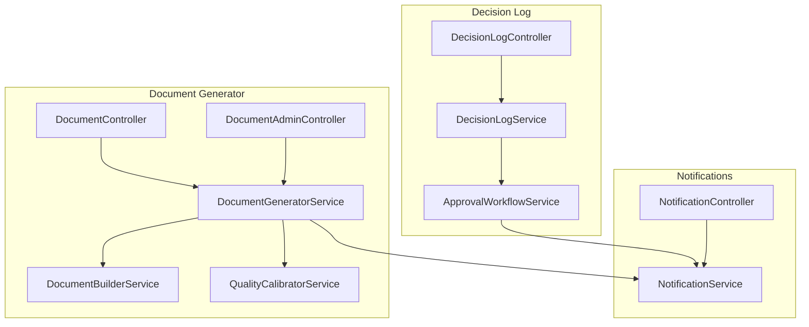
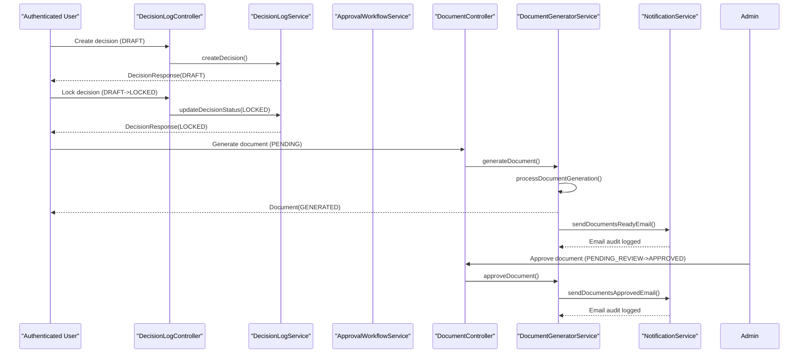
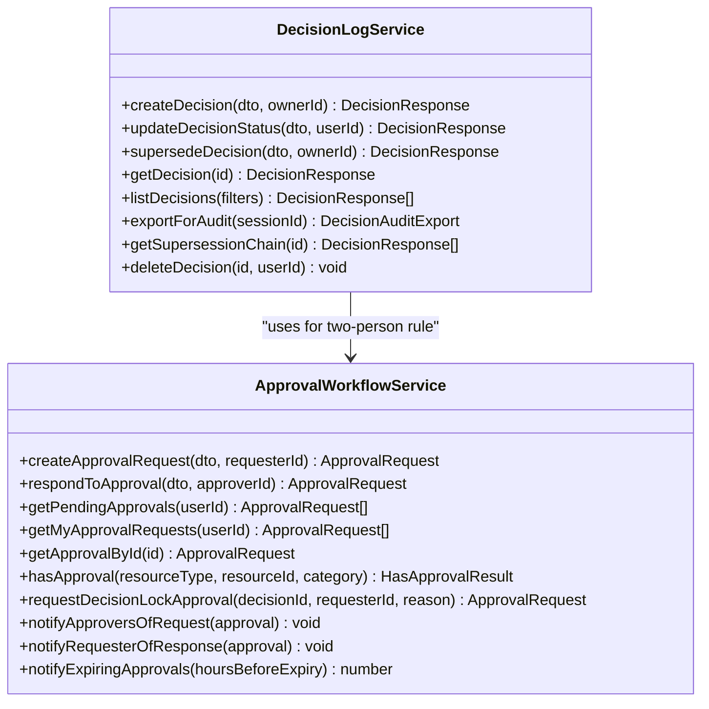
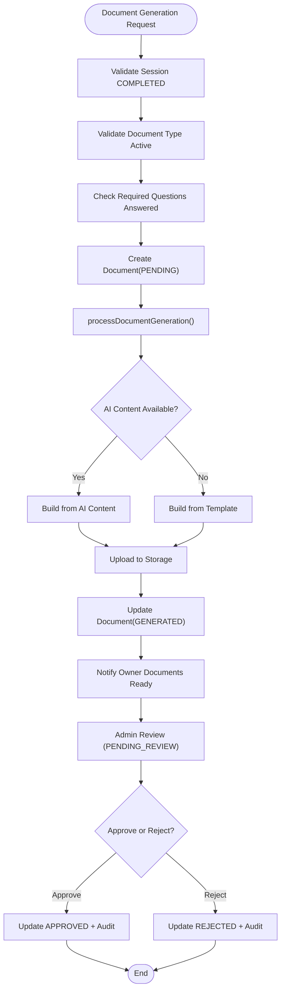
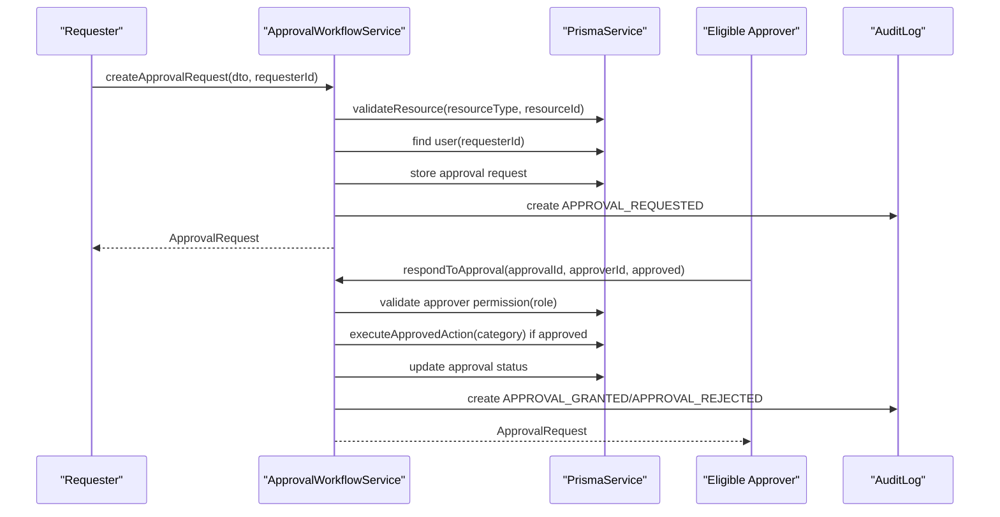
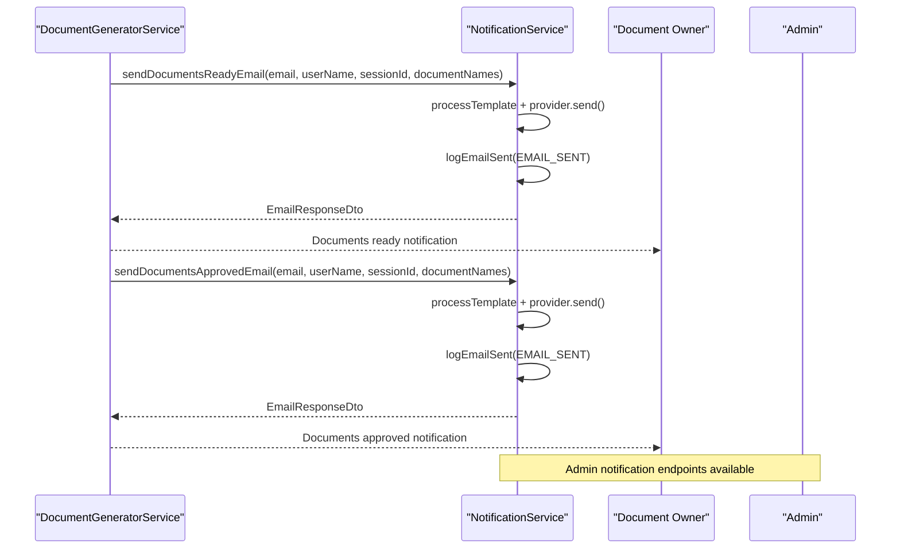
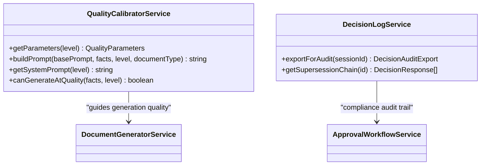
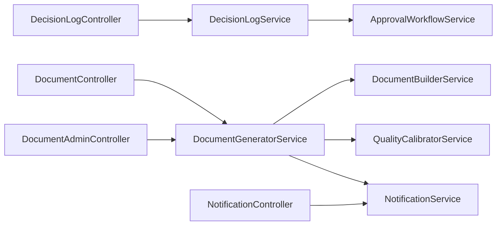

# Document Review & Approval Workflow

<cite>
**Referenced Files in This Document**
- [approval-workflow.service.ts](file://apps/api/src/modules/decision-log/approval-workflow.service.ts)
- [decision-log.service.ts](file://apps/api/src/modules/decision-log/decision-log.service.ts)
- [decision-log.controller.ts](file://apps/api/src/modules/decision-log/decision-log.controller.ts)
- [document-generator.service.ts](file://apps/api/src/modules/document-generator/services/document-generator.service.ts)
- [document.controller.ts](file://apps/api/src/modules/document-generator/controllers/document.controller.ts)
- [document-admin.controller.ts](file://apps/api/src/modules/document-generator/controllers/document-admin.controller.ts)
- [document-builder.service.ts](file://apps/api/src/modules/document-generator/services/document-builder.service.ts)
- [quality-calibrator.service.ts](file://apps/api/src/modules/document-generator/services/quality-calibrator.service.ts)
- [notification.service.ts](file://apps/api/src/modules/notifications/notification.service.ts)
- [notification.controller.ts](file://apps/api/src/modules/notifications/notification.controller.ts)
- [document-generator.module.ts](file://apps/api/src/modules/document-generator/document-generator.module.ts)
- [decision-log.module.ts](file://apps/api/src/modules/decision-log/decision-log.module.ts)
</cite>

## Table of Contents
1. [Introduction](#introduction)
2. [Project Structure](#project-structure)
3. [Core Components](#core-components)
4. [Architecture Overview](#architecture-overview)
5. [Detailed Component Analysis](#detailed-component-analysis)
6. [Dependency Analysis](#dependency-analysis)
7. [Performance Considerations](#performance-considerations)
8. [Troubleshooting Guide](#troubleshooting-guide)
9. [Conclusion](#conclusion)

## Introduction
This document describes the comprehensive document review and approval workflow system. It covers multi-stage approval processes, reviewer assignment, automation, status tracking, version control integration, audit trails, approval routing logic, conditional workflows, escalation mechanisms, reviewer interfaces, comment systems, collaborative features, complex approval scenarios, parallel reviews, consensus building, integration with decision logs, quality scoring, compliance validation, workflow customization, template-based approvals, automated decision triggers, notification systems, reminders, and workflow analytics.

## Project Structure
The workflow spans three primary modules:
- Decision Log: Forensic append-only decision records with two-person rule approvals
- Document Generator: Document lifecycle from generation to review and approval
- Notifications: Email delivery and audit logging for workflow events

**Diagram sources**
- [decision-log.controller.ts:1-279](file://apps/api/src/modules/decision-log/decision-log.controller.ts#L1-279)
- [decision-log.service.ts:1-396](file://apps/api/src/modules/decision-log/decision-log.service.ts#L1-396)
- [approval-workflow.service.ts:1-653](file://apps/api/src/modules/decision-log/approval-workflow.service.ts#L1-653)
- [document.controller.ts:1-278](file://apps/api/src/modules/document-generator/controllers/document.controller.ts#L1-278)
- [document-generator.service.ts:1-609](file://apps/api/src/modules/document-generator/services/document-generator.service.ts#L1-609)
- [document-admin.controller.ts:172-264](file://apps/api/src/modules/document-generator/controllers/document-admin.controller.ts#L172-264)
- [document-builder.service.ts:1-539](file://apps/api/src/modules/document-generator/services/document-builder.service.ts#L1-539)
- [quality-calibrator.service.ts:1-356](file://apps/api/src/modules/document-generator/services/quality-calibrator.service.ts#L1-356)
- [notification.service.ts:1-471](file://apps/api/src/modules/notifications/notification.service.ts#L1-471)
- [notification.controller.ts:1-37](file://apps/api/src/modules/notifications/notification.controller.ts#L1-37)

**Section sources**
- [decision-log.module.ts:1-24](file://apps/api/src/modules/decision-log/decision-log.module.ts#L1-24)
- [document-generator.module.ts:1-47](file://apps/api/src/modules/document-generator/document-generator.module.ts#L1-47)

## Core Components
- DecisionLogService: Enforces append-only decision lifecycle (DRAFT → LOCKED → SUPERSEDED/AMENDED), maintains audit trails, supports supersession chains, and export for compliance.
- ApprovalWorkflowService: Implements two-person rule for high-risk decisions, manages approval categories, routing, expiration, and audit logging.
- DocumentGeneratorService: Manages document lifecycle (PENDING → GENERATING → GENERATED/FAILED → PENDING_REVIEW → APPROVED/REJECTED), integrates with storage and notifications.
- NotificationService: Provides email delivery with template support, provider abstraction, and audit logging for workflow events.
- DocumentBuilderService: Constructs DOCX documents from templates or AI-generated content.
- QualityCalibratorService: Controls generation quality levels and prompts for document content.

**Section sources**
- [decision-log.service.ts:19-36](file://apps/api/src/modules/decision-log/decision-log.service.ts#L19-36)
- [approval-workflow.service.ts:76-88](file://apps/api/src/modules/decision-log/approval-workflow.service.ts#L76-88)
- [document-generator.service.ts:34-136](file://apps/api/src/modules/document-generator/services/document-generator.service.ts#L34-136)
- [notification.service.ts:149-158](file://apps/api/src/modules/notifications/notification.service.ts#L149-158)
- [document-builder.service.ts:28-69](file://apps/api/src/modules/document-generator/services/document-builder.service.ts#L28-69)
- [quality-calibrator.service.ts:12-11](file://apps/api/src/modules/document-generator/services/quality-calibrator.service.ts#L12-11)

## Architecture Overview
The system enforces strict workflow boundaries:
- Decision creation and locking are append-only and auditable.
- Document generation is asynchronous with robust error handling and versioning.
- Approval workflows enforce separation of duties and maintain audit trails.
- Notifications are triggered for key lifecycle events.

**Diagram sources**
- [decision-log.controller.ts:43-98](file://apps/api/src/modules/decision-log/decision-log.controller.ts#L43-98)
- [decision-log.service.ts:49-123](file://apps/api/src/modules/decision-log/decision-log.service.ts#L49-123)
- [document.controller.ts:45-65](file://apps/api/src/modules/document-generator/controllers/document.controller.ts#L45-65)
- [document-generator.service.ts:37-219](file://apps/api/src/modules/document-generator/services/document-generator.service.ts#L37-219)
- [notification.service.ts:347-391](file://apps/api/src/modules/notifications/notification.service.ts#L347-391)

## Detailed Component Analysis

### Decision Log and Two-Person Rule
The Decision Log module implements an append-only decision record with explicit status transitions and a two-person rule for high-risk decisions.

**Diagram sources**
- [decision-log.service.ts:38-396](file://apps/api/src/modules/decision-log/decision-log.service.ts#L38-396)
- [approval-workflow.service.ts:90-653](file://apps/api/src/modules/decision-log/approval-workflow.service.ts#L90-653)

Key behaviors:
- Append-only enforcement prevents modification of LOCKED decisions; supersession is the only amendment mechanism.
- Two-person rule requires separate approver for high-risk categories (policy lock, ADR approval, high-risk decision).
- Approval expiration and audit logging ensure compliance and traceability.
- Pending approvals are filtered by requester identity and expiration.

**Section sources**
- [decision-log.service.ts:19-36](file://apps/api/src/modules/decision-log/decision-log.service.ts#L19-36)
- [approval-workflow.service.ts:108-243](file://apps/api/src/modules/decision-log/approval-workflow.service.ts#L108-243)

### Document Generation and Review Lifecycle
The Document Generator module orchestrates document creation, generation, storage, and review/approval.

**Diagram sources**
- [document-generator.service.ts:37-219](file://apps/api/src/modules/document-generator/services/document-generator.service.ts#L37-219)
- [document.controller.ts:45-65](file://apps/api/src/modules/document-generator/controllers/document.controller.ts#L45-65)

Operational highlights:
- Session ownership validation and required question checks prevent unauthorized or incomplete generations.
- Asynchronous generation with error handling marks documents FAILED when generation fails.
- Version history retrieval supports historical analysis and compliance.
- Admin endpoints enable batch approval/rejection with audit logging.

**Section sources**
- [document-generator.service.ts:37-136](file://apps/api/src/modules/document-generator/services/document-generator.service.ts#L37-136)
- [document-generator.service.ts:445-571](file://apps/api/src/modules/document-generator/services/document-generator.service.ts#L445-571)
- [document.controller.ts:199-226](file://apps/api/src/modules/document-generator/controllers/document.controller.ts#L199-226)

### Approval Routing Logic and Escalation
Approval routing is role-based and category-specific, with automatic actions upon approval and comprehensive audit logging.

**Diagram sources**
- [approval-workflow.service.ts:108-243](file://apps/api/src/modules/decision-log/approval-workflow.service.ts#L108-243)
- [approval-workflow.service.ts:468-495](file://apps/api/src/modules/decision-log/approval-workflow.service.ts#L468-495)

Routing and permissions:
- Categories include policy lock, ADR approval, high-risk decision, security exception, and data access.
- Role-based eligibility ensures approvers meet minimum authority thresholds.
- Automatic actions (e.g., locking decisions) occur upon approval.

**Section sources**
- [approval-workflow.service.ts:15-31](file://apps/api/src/modules/decision-log/approval-workflow.service.ts#L15-31)
- [approval-workflow.service.ts:444-463](file://apps/api/src/modules/decision-log/approval-workflow.service.ts#L444-463)

### Notification System and Reminders
Notifications are integrated across decision and document workflows, with audit logging for compliance.

**Diagram sources**
- [document-generator.service.ts:576-607](file://apps/api/src/modules/document-generator/services/document-generator.service.ts#L576-607)
- [notification.service.ts:347-391](file://apps/api/src/modules/notifications/notification.service.ts#L347-391)
- [notification.controller.ts:17-35](file://apps/api/src/modules/notifications/notification.controller.ts#L17-35)

**Section sources**
- [notification.service.ts:159-471](file://apps/api/src/modules/notifications/notification.service.ts#L159-471)
- [document-generator.service.ts:576-607](file://apps/api/src/modules/document-generator/services/document-generator.service.ts#L576-607)

### Collaborative Review and Comment Systems
While the repository does not expose a dedicated collaborative review/comment API in the reviewed files, the frontend components indicate collaboration features planned for future sprints, including real-time collaboration, version history, undo/redo, and comments.

**Section sources**
- [document-builder.service.ts:1-539](file://apps/api/src/modules/document-generator/services/document-builder.service.ts#L1-539)

### Quality Scoring and Compliance Validation
Quality scoring and compliance validation are supported through:
- QualityCalibratorService: Controls generation quality levels and prompt construction.
- DecisionLogService: Maintains append-only decision records with supersession chains for compliance audits.

**Diagram sources**
- [quality-calibrator.service.ts:200-356](file://apps/api/src/modules/document-generator/services/quality-calibrator.service.ts#L200-356)
- [decision-log.service.ts:235-316](file://apps/api/src/modules/decision-log/decision-log.service.ts#L235-316)

**Section sources**
- [quality-calibrator.service.ts:12-197](file://apps/api/src/modules/document-generator/services/quality-calibrator.service.ts#L12-197)
- [decision-log.service.ts:235-316](file://apps/api/src/modules/decision-log/decision-log.service.ts#L235-316)

### Version Control Integration and Audit Trails
Version control and audit trails are implemented as follows:
- Document version history retrieval enables historical analysis and compliance.
- Decision supersession chains preserve immutable decision history.
- Audit logs capture all critical actions (email sent, approval requested/granted/rejected, decision locked/superseded).

**Section sources**
- [document-generator.service.ts:311-366](file://apps/api/src/modules/document-generator/services/document-generator.service.ts#L311-366)
- [decision-log.service.ts:276-316](file://apps/api/src/modules/decision-log/decision-log.service.ts#L276-316)
- [approval-workflow.service.ts:500-516](file://apps/api/src/modules/decision-log/approval-workflow.service.ts#L500-516)
- [notification.service.ts:444-469](file://apps/api/src/modules/notifications/notification.service.ts#L444-469)

### Workflow Customization and Automated Decision Triggers
Customization points include:
- Approval categories and role-based routing.
- Document quality levels and prompt modifiers.
- Notification templates and provider selection.

Automated triggers:
- Approval expiration warnings.
- Document ready and approval notifications.
- Decision lock upon two-person approval.

**Section sources**
- [approval-workflow.service.ts:589-651](file://apps/api/src/modules/decision-log/approval-workflow.service.ts#L589-651)
- [quality-calibrator.service.ts:221-282](file://apps/api/src/modules/document-generator/services/quality-calibrator.service.ts#L221-282)
- [document-generator.service.ts:215-218](file://apps/api/src/modules/document-generator/services/document-generator.service.ts#L215-218)

## Dependency Analysis
The modules exhibit clear separation of concerns with explicit dependencies:
- DecisionLogController depends on DecisionLogService.
- DecisionLogService depends on PrismaService and ApprovalWorkflowService for two-person rule.
- DocumentController and DocumentAdminController depend on DocumentGeneratorService.
- DocumentGeneratorService depends on DocumentBuilderService, QualityCalibratorService, StorageService, and NotificationService.
- NotificationController depends on NotificationService.

**Diagram sources**
- [decision-log.controller.ts:40-41](file://apps/api/src/modules/decision-log/decision-log.controller.ts#L40-41)
- [decision-log.service.ts:39-41](file://apps/api/src/modules/decision-log/decision-log.service.ts#L39-41)
- [approval-workflow.service.ts](file://apps/api/src/modules/decision-log/approval-workflow.service.ts#L99)
- [document.controller.ts:39-43](file://apps/api/src/modules/document-generator/controllers/document.controller.ts#L39-43)
- [document-generator.service.ts:25-32](file://apps/api/src/modules/document-generator/services/document-generator.service.ts#L25-32)
- [notification.controller.ts:14-15](file://apps/api/src/modules/notifications/notification.controller.ts#L14-15)

**Section sources**
- [document-generator.module.ts:19-46](file://apps/api/src/modules/document-generator/document-generator.module.ts#L19-46)
- [decision-log.module.ts:18-23](file://apps/api/src/modules/decision-log/decision-log.module.ts#L18-23)

## Performance Considerations
- Asynchronous document generation reduces latency; failures are captured with metadata for diagnostics.
- Batch operations for document approval/rejection minimize repeated database calls.
- Audit logging is lightweight and occurs after successful operations to reduce overhead.
- Email provider selection allows scaling across environments without code changes.

## Troubleshooting Guide
Common issues and resolutions:
- Decision status transitions: Only DRAFT → LOCKED is permitted; locked decisions must be superseded for changes.
- Approval requests: Ensure requester and approver identities differ; verify approver roles match category requirements.
- Document generation: Confirm session completion, required questions answered, and document type availability.
- Email delivery: Verify provider credentials; console provider logs messages for development.

**Section sources**
- [decision-log.service.ts:99-110](file://apps/api/src/modules/decision-log/decision-log.service.ts#L99-110)
- [approval-workflow.service.ts:191-196](file://apps/api/src/modules/decision-log/approval-workflow.service.ts#L191-196)
- [document-generator.service.ts:53-57](file://apps/api/src/modules/document-generator/services/document-generator.service.ts#L53-57)
- [notification.service.ts:169-187](file://apps/api/src/modules/notifications/notification.service.ts#L169-187)

## Conclusion
The system provides a robust, auditable, and extensible framework for document review and approval. It enforces separation of duties, maintains immutable records, supports quality-driven generation, and integrates comprehensive notifications and audit logging. Future enhancements can leverage the existing modular architecture to introduce collaborative features and advanced analytics.