# Evidence Registry Integration

<cite>
**Referenced Files in This Document**
- [evidence-registry.module.ts](file://apps/api/src/modules/evidence-registry/evidence-registry.module.ts)
- [evidence-registry.controller.ts](file://apps/api/src/modules/evidence-registry/evidence-registry.controller.ts)
- [evidence-registry.service.ts](file://apps/api/src/modules/evidence-registry/evidence-registry.service.ts)
- [evidence-integrity.service.ts](file://apps/api/src/modules/evidence-registry/evidence-integrity.service.ts)
- [ci-artifact-ingestion.service.ts](file://apps/api/src/modules/evidence-registry/ci-artifact-ingestion.service.ts)
- [evidence.dto.ts](file://apps/api/src/modules/evidence-registry/dto/evidence.dto.ts)
- [schema.prisma](file://prisma/schema.prisma)
- [evidence-document-generator.flow.test.ts](file://apps/api/test/integration/evidence-document-generator.flow.test.ts)
</cite>

## Table of Contents
1. [Introduction](#introduction)
2. [System Architecture](#system-architecture)
3. [Core Components](#core-components)
4. [Evidence Registry Service](#evidence-registry-service)
5. [Evidence Integrity Service](#evidence-integrity-service)
6. [CI Artifact Ingestion Service](#ci-artifact-ingestion-service)
7. [API Endpoints and Integration](#api-endpoints-and-integration)
8. [Evidence-to-Document Mapping](#evidence-to-document-mapping)
9. [Traceability and Compliance](#traceability-and-compliance)
10. [Quality Assurance Evidence Collection](#quality-assurance-evidence-collection)
11. [Data Storage and Retrieval](#data-storage-and-retrieval)
12. [Performance and Scalability](#performance-and-scalability)
13. [Troubleshooting and Monitoring](#troubleshooting-and-monitoring)
14. [Conclusion](#conclusion)

## Introduction

The Evidence Registry Integration system in Quiz-to-Build provides a comprehensive framework for managing, validating, and tracing evidence artifacts throughout the organizational readiness assessment process. This system serves as the central hub for connecting generated documents with supporting evidence, integrating with CI/CD pipelines for automated evidence collection, and maintaining quality assurance evidence for compliance purposes.

The system implements advanced cryptographic integrity verification, blockchain-style evidence chaining, and RFC 3161 timestamp authority integration to ensure evidence authenticity and non-repudiation. It seamlessly connects evidence artifacts to document generation workflows while maintaining strict audit trails and compliance evidence requirements.

## System Architecture

The Evidence Registry Integration follows a modular NestJS architecture with three primary service layers working in concert:

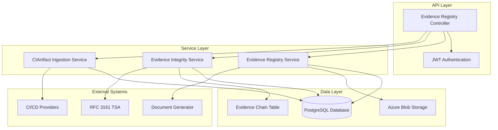

**Diagram sources**
- [evidence-registry.module.ts:1-27](file://apps/api/src/modules/evidence-registry/evidence-registry.module.ts#L1-L27)
- [evidence-registry.controller.ts:47-61](file://apps/api/src/modules/evidence-registry/evidence-registry.controller.ts#L47-L61)

The architecture ensures separation of concerns with clear boundaries between evidence management, integrity verification, and CI/CD integration, while maintaining robust data persistence and external system integration capabilities.

## Core Components

### Evidence Registry Module

The Evidence Registry Module serves as the central orchestrator, importing and exporting all essential services while establishing the foundational infrastructure for evidence management.

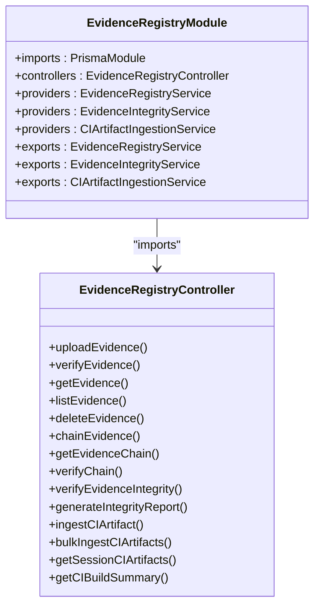

**Diagram sources**
- [evidence-registry.module.ts:20-25](file://apps/api/src/modules/evidence-registry/evidence-registry.module.ts#L20-L25)
- [evidence-registry.controller.ts:61-66](file://apps/api/src/modules/evidence-registry/evidence-registry.controller.ts#L61-L66)

**Section sources**
- [evidence-registry.module.ts:1-27](file://apps/api/src/modules/evidence-registry/evidence-registry.module.ts#L1-L27)

### Evidence Types and Classification

The system supports nine distinct evidence artifact types, each serving specific compliance and quality assurance purposes:

| Evidence Type | Description | Typical Usage |
|---------------|-------------|---------------|
| FILE | Generic file uploads | General documentation and reports |
| IMAGE | Image files (PNG, JPEG, GIF) | Screenshots, diagrams, visual evidence |
| LINK | External URLs | Hyperlinks to external resources |
| LOG | Log files | Application and system logs |
| SBOM | Software Bill of Materials | Dependency and component tracking |
| REPORT | Test and quality reports | Automated testing results |
| TEST_RESULT | Individual test outcomes | Unit and integration test results |
| SCREENSHOT | Application screenshots | UI and functional validation |
| DOCUMENT | Office documents | PDFs, Word docs, spreadsheets |

**Section sources**
- [schema.prisma:92-102](file://prisma/schema.prisma#L92-L102)

## Evidence Registry Service

The Evidence Registry Service provides comprehensive evidence lifecycle management, from initial upload through verification and archival.

### Core Functionality

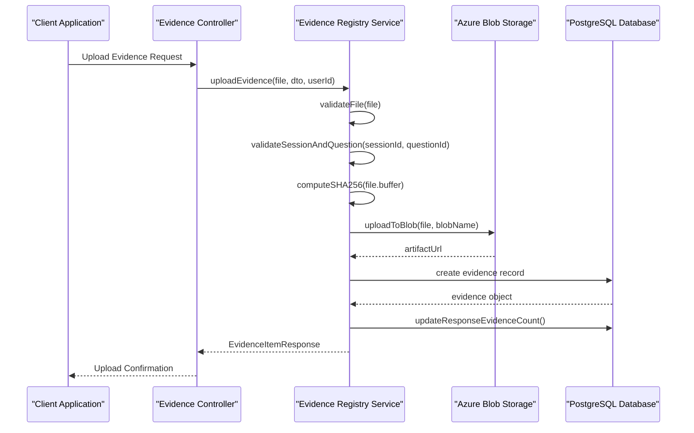

**Diagram sources**
- [evidence-registry.controller.ts:135-141](file://apps/api/src/modules/evidence-registry/evidence-registry.controller.ts#L135-L141)
- [evidence-registry.service.ts:165-208](file://apps/api/src/modules/evidence-registry/evidence-registry.service.ts#L165-L208)

### File Management and Validation

The service implements comprehensive file validation including MIME type restrictions, size limits, and content integrity verification:

**Allowed MIME Types:**
- Documents: PDF, Word, Excel, JSON, Markdown
- Images: PNG, JPEG, GIF, WebP
- Logs and data: CSV, XML, SBOM formats
- Security formats: CycloneDX, SPDX

**Validation Rules:**
- Maximum file size: 50MB
- Required session and question existence
- SHA-256 hash computation for integrity verification
- Unique blob naming with timestamp-based organization

**Section sources**
- [evidence-registry.service.ts:100-127](file://apps/api/src/modules/evidence-registry/evidence-registry.service.ts#L100-L127)
- [evidence-registry.service.ts:419-434](file://apps/api/src/modules/evidence-registry/evidence-registry.service.ts#L419-L434)

### Coverage Management

The system implements a sophisticated five-level coverage assessment system:

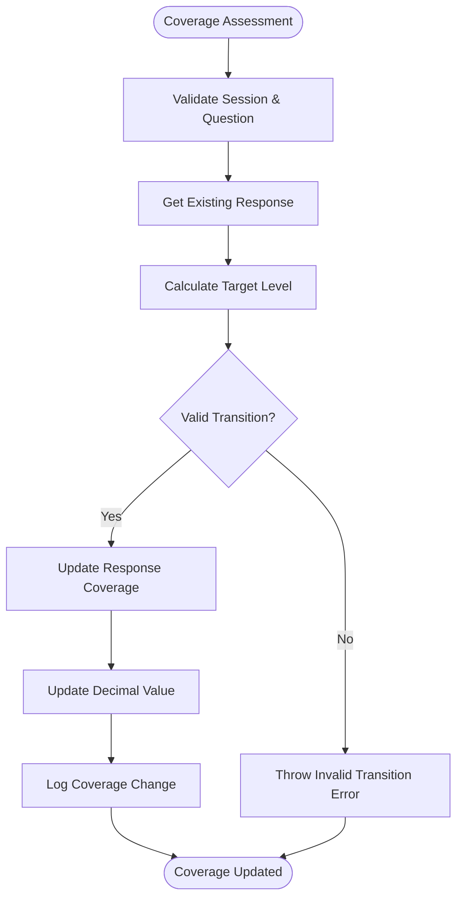

**Diagram sources**
- [evidence-registry.service.ts:475-510](file://apps/api/src/modules/evidence-registry/evidence-registry.service.ts#L475-L510)

**Coverage Levels:**
- NONE (0.0): No evidence, no coverage
- PARTIAL (0.25): Some evidence exists but incomplete
- HALF (0.50): Moderate coverage, work in progress
- SUBSTANTIAL (0.75): Most requirements met, minor gaps
- FULL (1.00): Complete coverage with verified evidence

**Section sources**
- [evidence-registry.service.ts:26-44](file://apps/api/src/modules/evidence-registry/evidence-registry.service.ts#L26-L44)

## Evidence Integrity Service

The Evidence Integrity Service implements cryptographic evidence chaining and RFC 3161 timestamp authority integration for tamper-proof evidence management.

### Blockchain-Style Evidence Chaining

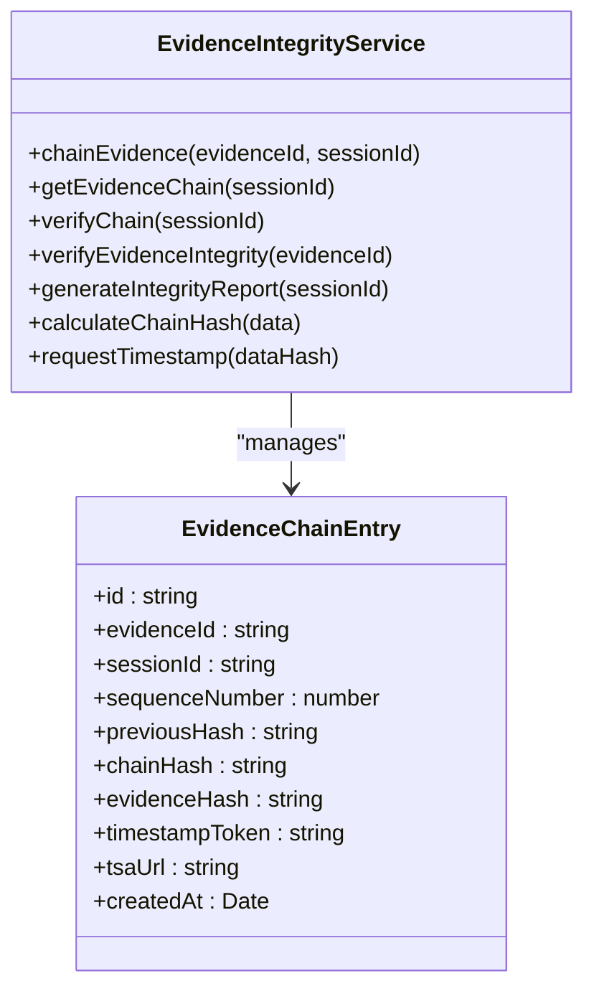

**Diagram sources**
- [evidence-integrity.service.ts:518-529](file://apps/api/src/modules/evidence-registry/evidence-integrity.service.ts#L518-L529)
- [evidence-integrity.service.ts:36-53](file://apps/api/src/modules/evidence-registry/evidence-integrity.service.ts#L36-L53)

### Cryptographic Integrity Verification

The system implements multi-layered integrity verification:

1. **File Hash Verification**: SHA-256 hash computation and comparison
2. **Chain Link Validation**: Blockchain-style hash chain verification
3. **Timestamp Authority Integration**: RFC 3161 compliant timestamp tokens
4. **Evidence Modification Detection**: Real-time change detection

**Integrity Status Levels:**
- UNVERIFIED: No hash stored
- HASH_ONLY: Hash stored, not chained
- CHAIN_VERIFIED: Linked to chain, no timestamp
- FULLY_VERIFIED: Complete verification with timestamp

**Section sources**
- [evidence-integrity.service.ts:396-444](file://apps/api/src/modules/evidence-registry/evidence-integrity.service.ts#L396-L444)

### RFC 3161 Timestamp Authority Integration

The system integrates with RFC 3161 compliant timestamp authorities for cryptographically verifiable timestamps:

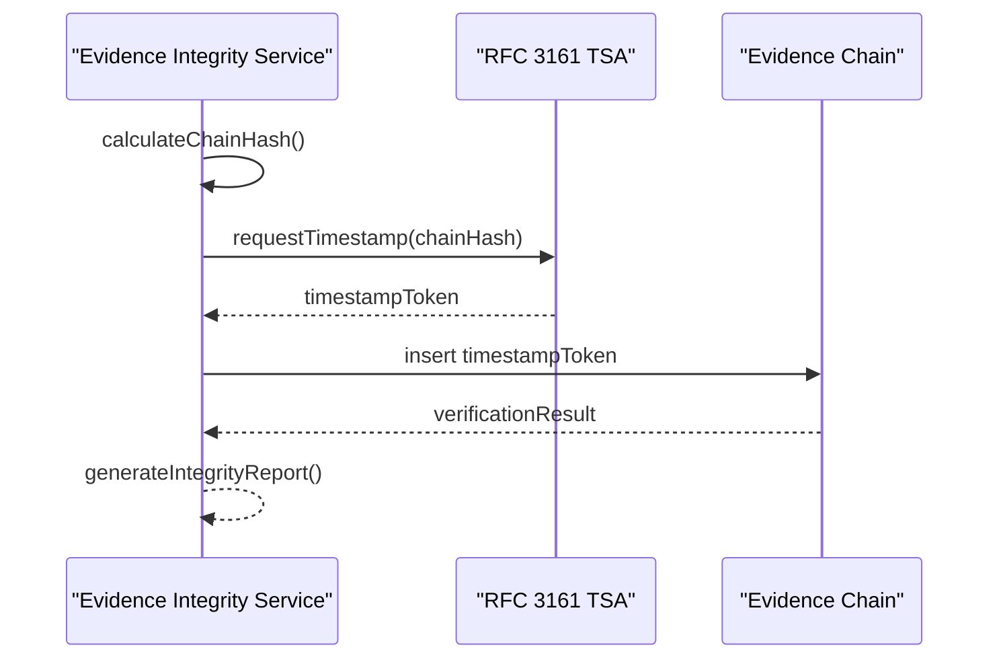

**Diagram sources**
- [evidence-integrity.service.ts:291-337](file://apps/api/src/modules/evidence-registry/evidence-integrity.service.ts#L291-L337)

**Section sources**
- [evidence-integrity.service.ts:288-387](file://apps/api/src/modules/evidence-registry/evidence-integrity.service.ts#L288-L387)

## CI Artifact Ingestion Service

The CI Artifact Ingestion Service automates evidence collection from CI/CD pipelines, supporting multiple artifact types and providers.

### Supported CI/CD Artifacts

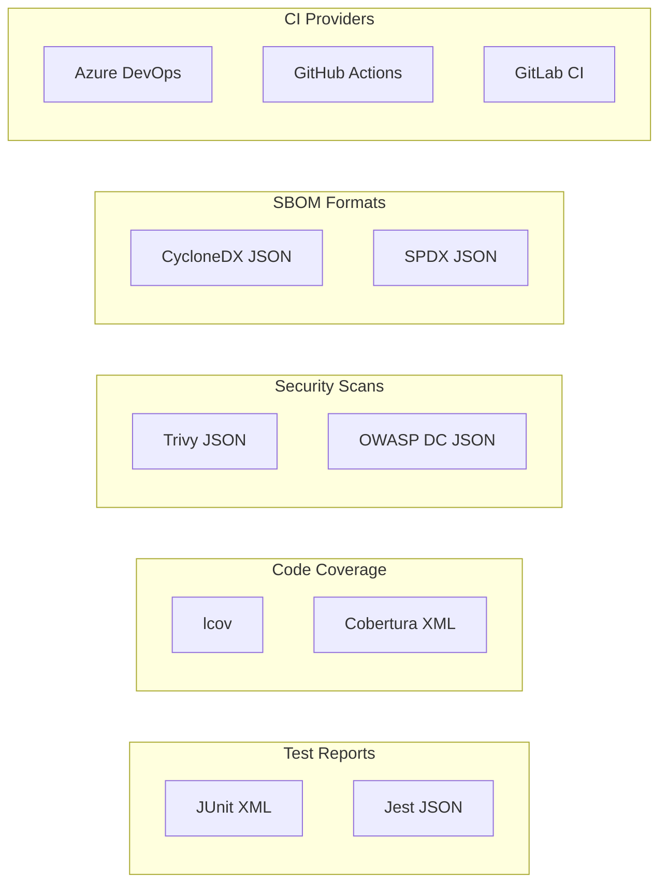

**Diagram sources**
- [ci-artifact-ingestion.service.ts:41-86](file://apps/api/src/modules/evidence-registry/ci-artifact-ingestion.service.ts#L41-L86)

### Artifact Parsing and Analysis

The service implements specialized parsers for each artifact type:

**Test Report Parsing:**
- JUnit XML: Extracts test counts, durations, and pass/fail rates
- Jest JSON: Parses test suites, individual test results, and timing metrics

**Coverage Report Parsing:**
- lcov: Computes line, function, and branch coverage percentages
- Cobertura XML: Extracts line and branch coverage rates

**Security Scan Parsing:**
- Trivy: Categorizes vulnerabilities by severity and counts
- OWASP: Processes dependency vulnerability reports

**SBOM Parsing:**
- CycloneDX: Extracts component counts, license information, and serial numbers
- SPDX: Parses package information and license declarations

**Section sources**
- [ci-artifact-ingestion.service.ts:205-567](file://apps/api/src/modules/evidence-registry/ci-artifact-ingestion.service.ts#L205-L567)

### Automatic Evidence Assignment

The system automatically maps CI artifacts to appropriate questions based on content analysis and semantic matching:

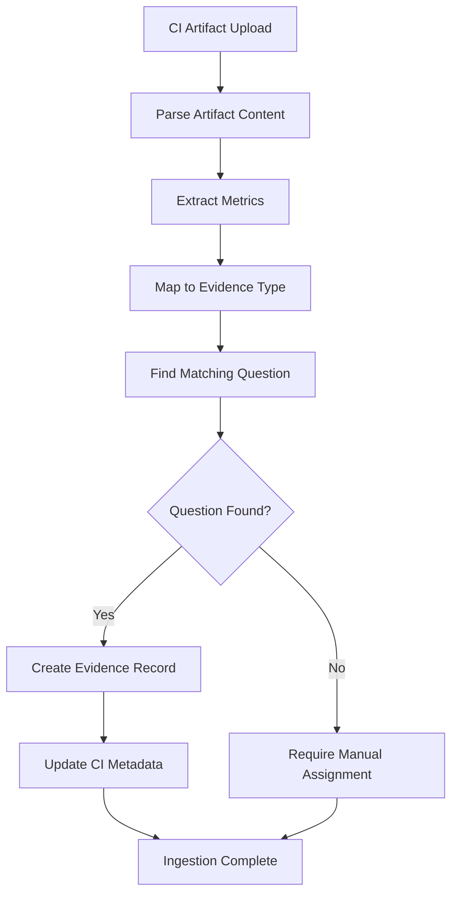

**Diagram sources**
- [ci-artifact-ingestion.service.ts:573-610](file://apps/api/src/modules/evidence-registry/ci-artifact-ingestion.service.ts#L573-L610)

**Section sources**
- [ci-artifact-ingestion.service.ts:569-610](file://apps/api/src/modules/evidence-registry/ci-artifact-ingestion.service.ts#L569-L610)

## API Endpoints and Integration

The Evidence Registry exposes a comprehensive REST API with clear endpoint categorization for different operational domains.

### Evidence Management Endpoints

| Endpoint | Method | Description | Authentication |
|----------|--------|-------------|----------------|
| `/evidence/upload` | POST | Upload evidence file with SHA-256 hashing | JWT Required |
| `/evidence/verify` | POST | Verify evidence and update coverage | JWT Required |
| `/evidence/:evidenceId` | GET | Retrieve evidence by ID | JWT Required |
| `/evidence` | GET | List evidence with filters | JWT Required |
| `/evidence/stats/:sessionId` | GET | Get evidence statistics | JWT Required |
| `/evidence/:evidenceId` | DELETE | Delete unverified evidence | JWT Required |

### Evidence Integrity Endpoints

| Endpoint | Method | Description | Authentication |
|----------|--------|-------------|----------------|
| `/evidence/:evidenceId/chain` | POST | Add evidence to integrity chain | JWT Required |
| `/evidence/chain/:sessionId` | GET | Get evidence chain for session | JWT Required |
| `/evidence/chain/:sessionId/verify` | GET | Verify chain integrity | JWT Required |
| `/evidence/:evidenceId/integrity` | GET | Verify single evidence integrity | JWT Required |
| `/evidence/integrity-report/:sessionId` | GET | Generate integrity report | JWT Required |

### CI Artifact Integration Endpoints

| Endpoint | Method | Description | Authentication |
|----------|--------|-------------|----------------|
| `/evidence/ci/ingest` | POST | Ingest CI artifact as evidence | JWT Required |
| `/evidence/ci/bulk-ingest` | POST | Bulk ingest CI artifacts | JWT Required |
| `/evidence/ci/session/:sessionId` | GET | Get session CI artifacts | JWT Required |
| `/evidence/ci/build/:sessionId/:buildId` | GET | Get CI build summary | JWT Required |

**Section sources**
- [evidence-registry.controller.ts:68-462](file://apps/api/src/modules/evidence-registry/evidence-registry.controller.ts#L68-L462)

## Evidence-to-Document Mapping

The Evidence Registry seamlessly integrates with the document generation system to create comprehensive, evidence-backed documentation.

### Document Generation Workflow

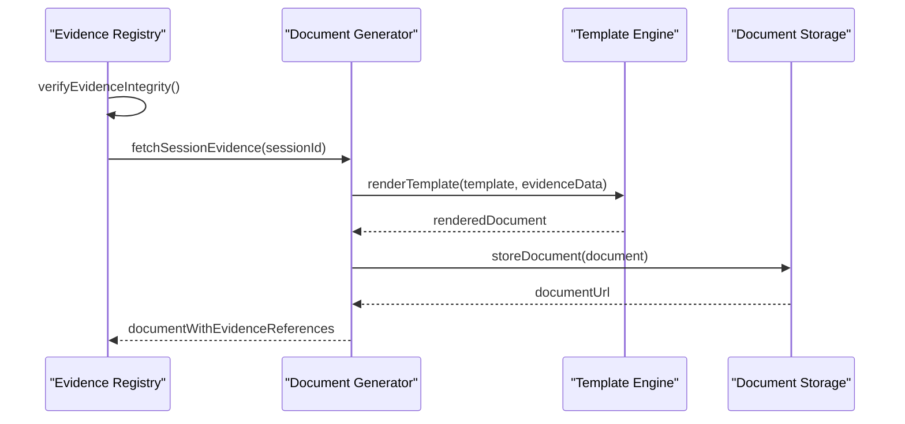

**Diagram sources**
- [evidence-document-generator.flow.test.ts:198-237](file://apps/api/test/integration/evidence-document-generator.flow.test.ts#L198-L237)

### Evidence Reference Structure

The system maintains structured evidence references within document metadata:

| Field | Description | Example |
|-------|-------------|---------|
| evidenceId | Unique identifier | `550e8400-e29b-41d4-a716-446655440000` |
| fileName | Original file name | `security-policy.pdf` |
| fileUrl | Storage location | `https://storage.example.com/evidence/...` |
| questionText | Associated question | `Do you have documented security policies?` |
| responseLevel | Coverage level | `SUBSTANTIAL` |
| integrityHash | SHA-256 hash | `sha256:2f3f2f3f...` |
| verifiedAt | Verification timestamp | `2026-01-15T10:30:00Z` |

**Section sources**
- [evidence-document-generator.flow.test.ts:199-237](file://apps/api/test/integration/evidence-document-generator.flow.test.ts#L199-L237)

### Document Evidence Index Generation

The system automatically generates comprehensive evidence indexes for each document:

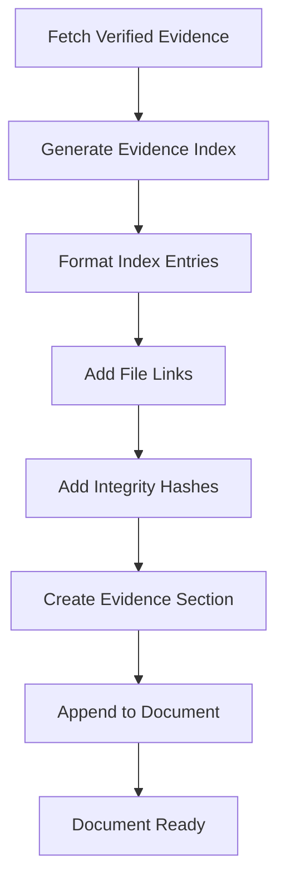

**Diagram sources**
- [evidence-document-generator.flow.test.ts:509-531](file://apps/api/test/integration/evidence-document-generator.flow.test.ts#L509-L531)

**Section sources**
- [evidence-document-generator.flow.test.ts:481-531](file://apps/api/test/integration/evidence-document-generator.flow.test.ts#L481-L531)

## Traceability and Compliance

The Evidence Registry implements comprehensive traceability mechanisms to support compliance requirements and audit trails.

### Audit Trail Generation

The system maintains detailed audit trails for all evidence-related activities:

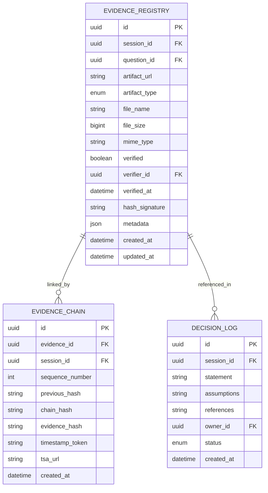

**Diagram sources**
- [schema.prisma:636-674](file://prisma/schema.prisma#L636-L674)
- [schema.prisma:869-891](file://prisma/schema.prisma#L869-L891)

### Compliance Evidence Generation

The system generates compliance-ready evidence packages with:

- **Complete Chain of Custody**: Timestamped evidence chain with RFC 3161 timestamps
- **Audit Trail Records**: Comprehensive activity logs for all evidence modifications
- **Integrity Verification**: Cryptographic proof of evidence authenticity
- **Version History**: Track changes and superseded evidence versions
- **Cross-Reference Links**: Direct links between evidence and supporting documentation

**Section sources**
- [evidence-integrity.service.ts:449-486](file://apps/api/src/modules/evidence-registry/evidence-integrity.service.ts#L449-L486)

## Quality Assurance Evidence Collection

The Evidence Registry implements automated quality assurance evidence collection through CI/CD pipeline integration.

### Automated Evidence Collection Process

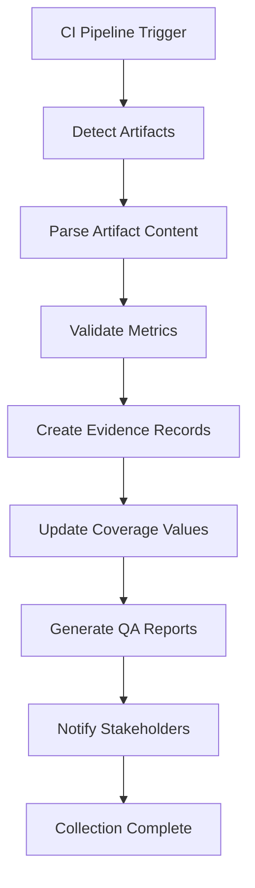

**Diagram sources**
- [ci-artifact-ingestion.service.ts:98-163](file://apps/api/src/modules/evidence-registry/ci-artifact-ingestion.service.ts#L98-L163)

### Quality Metrics Extraction

The system extracts comprehensive quality metrics from various artifact types:

**Test Quality Metrics:**
- Test execution counts and pass rates
- Execution durations and trends
- Failure and error categorization
- Test suite organization and coverage

**Code Quality Metrics:**
- Line, function, and branch coverage percentages
- Complexity analysis and maintainability indicators
- Code duplication detection
- Static analysis results

**Security Quality Metrics:**
- Vulnerability counts by severity
- Compliance violation detection
- Security control effectiveness
- Risk assessment scores

**Section sources**
- [ci-artifact-ingestion.service.ts:205-567](file://apps/api/src/modules/evidence-registry/ci-artifact-ingestion.service.ts#L205-L567)

## Data Storage and Retrieval

The Evidence Registry implements a multi-tiered storage architecture combining cloud object storage with relational database persistence.

### Storage Architecture

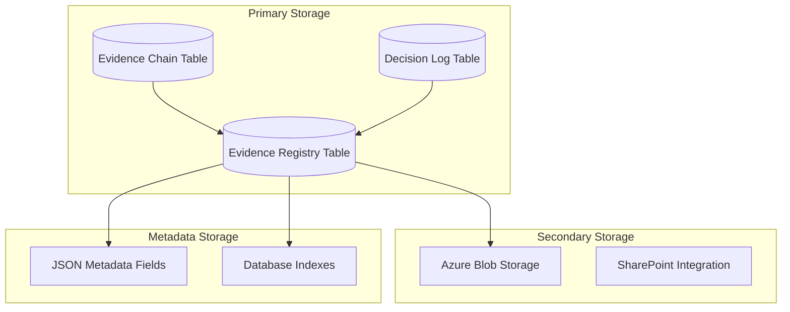

**Diagram sources**
- [schema.prisma:636-674](file://prisma/schema.prisma#L636-L674)
- [schema.prisma:869-891](file://prisma/schema.prisma#L869-L891)

### Evidence Retrieval Patterns

The system optimizes for common retrieval patterns:

**Session-Based Queries:**
- Evidence lists filtered by session ID
- Coverage statistics aggregation
- Evidence chain reconstruction

**Question-Based Queries:**
- Evidence per question analysis
- Coverage level determination
- Evidence type distribution

**Verification-Based Queries:**
- Verified vs pending evidence filtering
- Verifier assignment tracking
- Quality assessment reporting

**Section sources**
- [evidence-registry.service.ts:265-324](file://apps/api/src/modules/evidence-registry/evidence-registry.service.ts#L265-L324)

### Secure Access Control

The system implements granular access control for evidence data:

- **Session-Level Security**: Evidence access tied to session membership
- **Role-Based Permissions**: Verifier roles for evidence approval
- **Signed URL Generation**: Temporary access tokens for file downloads
- **Audit Logging**: Complete access and modification tracking

**Section sources**
- [evidence-registry.service.ts:825-865](file://apps/api/src/modules/evidence-registry/evidence-registry.service.ts#L825-L865)

## Performance and Scalability

The Evidence Registry is designed for high-performance operation with careful attention to scalability considerations.

### Database Optimization

**Index Strategy:**
- Evidence Registry: Session ID, Question ID, Verification status, Artifact type
- Evidence Chain: Evidence ID, Session ID, Chain hash
- Decision Log: Session ID, Creation timestamp

**Query Optimization:**
- Batch operations for bulk verification
- Efficient pagination with take/orderBy patterns
- Selective field retrieval to minimize payload sizes

**Connection Pooling:**
- Optimized Prisma connection management
- Transaction batching for atomic operations
- Read replica support for analytical queries

### Storage Performance

**Blob Storage Optimization:**
- Hierarchical blob naming for efficient listing
- CDN integration for global access
- Compression for large file storage
- Lifecycle policies for cost optimization

**Memory Management:**
- Streaming file uploads for large artifacts
- Buffer management for hash computation
- Garbage collection optimization
- Memory profiling for long-running operations

## Troubleshooting and Monitoring

The Evidence Registry implements comprehensive monitoring and error handling mechanisms.

### Error Handling Patterns

**Common Error Scenarios:**
- File validation failures (size, type, corruption)
- Storage connectivity issues
- Database constraint violations
- Authentication and authorization failures
- External service integration problems

**Error Response Structure:**
- Consistent HTTP status codes
- Detailed error messages
- Correlation IDs for tracing
- Recovery suggestions where applicable

**Monitoring and Logging:**
- Structured logging with correlation IDs
- Performance metrics collection
- Error rate monitoring
- External service health checks

### Debugging Tools

**Audit Trail Analysis:**
- Complete evidence lifecycle tracking
- Verification workflow inspection
- Chain integrity validation
- User action attribution

**Performance Diagnostics:**
- Query execution time monitoring
- Storage access pattern analysis
- Memory usage profiling
- External service latency tracking

**Section sources**
- [evidence-registry.service.ts:626-694](file://apps/api/src/modules/evidence-registry/evidence-registry.service.ts#L626-L694)

## Conclusion

The Evidence Registry Integration system provides a robust foundation for comprehensive evidence management in organizational readiness assessments. Through its multi-layered architecture, the system successfully addresses the complex requirements of evidence collection, validation, integrity verification, and compliance reporting.

Key strengths of the implementation include:

- **Comprehensive Evidence Lifecycle Management**: From automated CI/CD collection to manual uploads and verification
- **Advanced Integrity Protection**: Blockchain-style chaining with RFC 3161 timestamp integration
- **Seamless Document Integration**: Direct evidence-to-document mapping with automated reference generation
- **Scalable Architecture**: Optimized for performance with careful indexing and storage strategies
- **Compliance-Ready Design**: Complete audit trails and traceability for regulatory requirements

The system's modular design ensures maintainability and extensibility, while its comprehensive error handling and monitoring capabilities support reliable operation in production environments. The integration with external CI/CD systems and document generation workflows demonstrates the system's ability to fit seamlessly into modern development and compliance processes.

Future enhancements could include expanded CI/CD provider support, advanced analytics capabilities, and enhanced collaborative features for multi-user evidence review workflows.