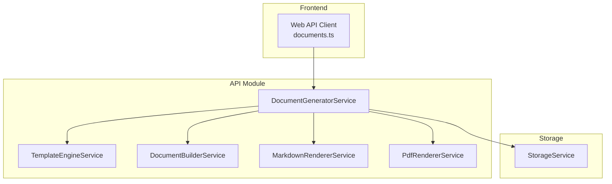
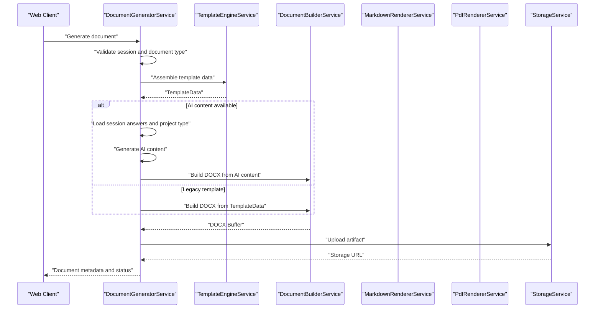
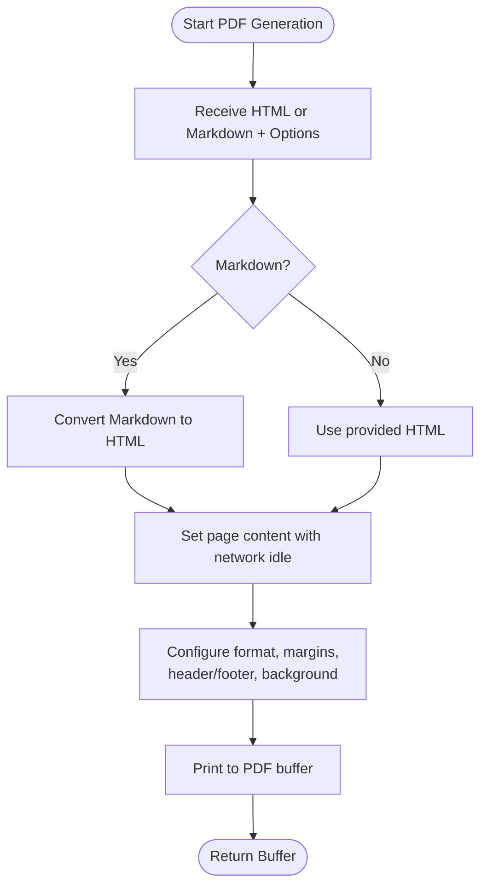
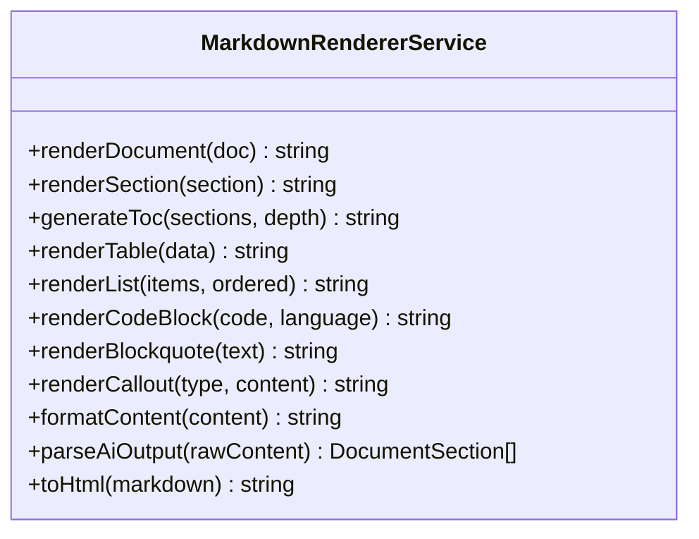
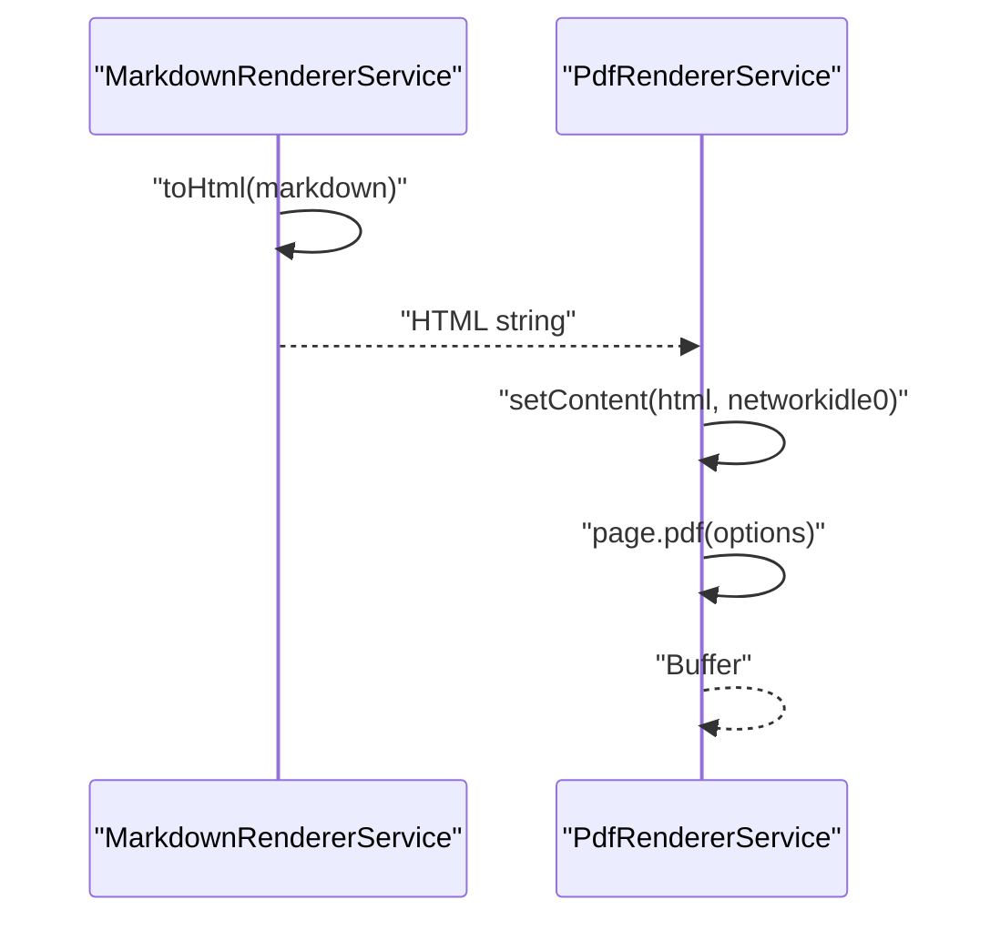
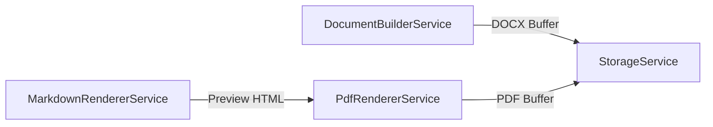
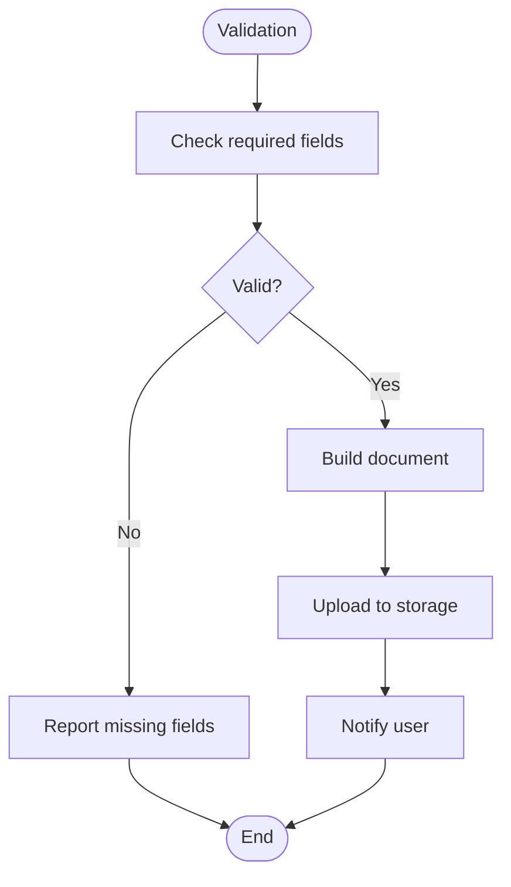
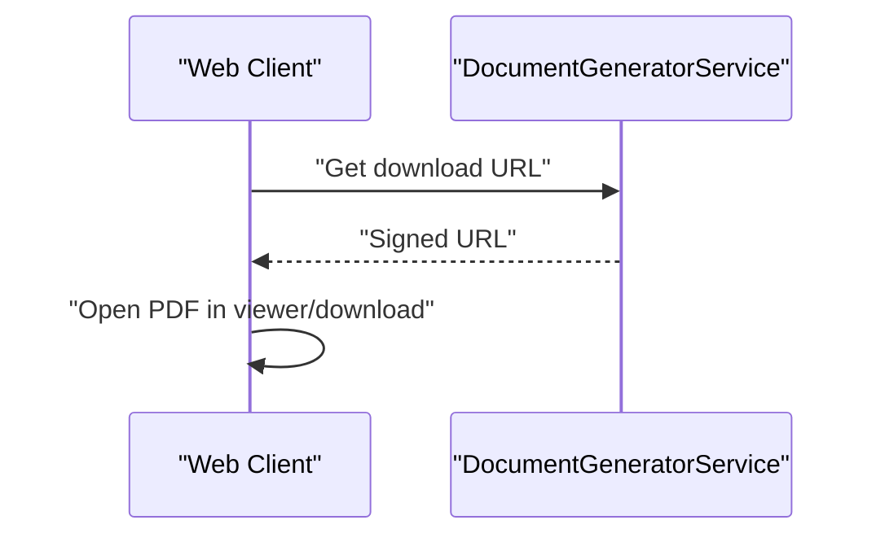
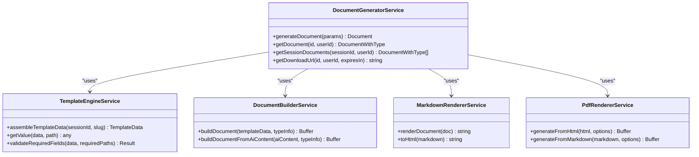

# Multi-Format Output System

<cite>
**Referenced Files in This Document**
- [03-product-architecture.md](file://docs/cto/03-product-architecture.md)
- [document-generator.module.ts](file://apps/api/src/modules/document-generator/document-generator.module.ts)
- [document-generator.service.ts](file://apps/api/src/modules/document-generator/services/document-generator.service.ts)
- [template-engine.service.ts](file://apps/api/src/modules/document-generator/services/template-engine.service.ts)
- [document-builder.service.ts](file://apps/api/src/modules/document-generator/services/document-builder.service.ts)
- [markdown-renderer.service.ts](file://apps/api/src/modules/document-generator/services/markdown-renderer.service.ts)
- [pdf-renderer.service.ts](file://apps/api/src/modules/document-generator/services/pdf-renderer.service.ts)
- [documents.ts](file://apps/web/src/api/documents.ts)
</cite>

## Table of Contents
1. [Introduction](#introduction)
2. [Project Structure](#project-structure)
3. [Core Components](#core-components)
4. [Architecture Overview](#architecture-overview)
5. [Detailed Component Analysis](#detailed-component-analysis)
6. [Dependency Analysis](#dependency-analysis)
7. [Performance Considerations](#performance-considerations)
8. [Troubleshooting Guide](#troubleshooting-guide)
9. [Conclusion](#conclusion)

## Introduction
This document explains the multi-format output system that generates documents in DOCX, PDF, and Markdown formats. It covers the generation pipeline, rendering engines, formatting libraries, customization options, storage and retrieval, and frontend integration. It also addresses security considerations, accessibility, responsive design, and performance optimization for large documents.

## Project Structure
The output system resides in the API application under the document generator module. The key components are:
- Document generation orchestration
- Template assembly and mapping
- Document building (DOCX)
- Markdown rendering
- PDF rendering (HTML/Markdown to PDF)
- Storage and retrieval
- Frontend API integration

**Diagram sources**
- [document-generator.module.ts:19-46](file://apps/api/src/modules/document-generator/document-generator.module.ts#L19-L46)
- [document-generator.service.ts:25-32](file://apps/api/src/modules/document-generator/services/document-generator.service.ts#L25-L32)
- [template-engine.service.ts:27-30](file://apps/api/src/modules/document-generator/services/template-engine.service.ts#L27-L30)
- [document-builder.service.ts:29-31](file://apps/api/src/modules/document-generator/services/document-builder.service.ts#L29-L31)
- [markdown-renderer.service.ts:30-31](file://apps/api/src/modules/document-generator/services/markdown-renderer.service.ts#L30-L31)
- [pdf-renderer.service.ts:23-24](file://apps/api/src/modules/document-generator/services/pdf-renderer.service.ts#L23-L24)
- [documents.ts:1-53](file://apps/web/src/api/documents.ts#L1-L53)

**Section sources**
- [document-generator.module.ts:19-46](file://apps/api/src/modules/document-generator/document-generator.module.ts#L19-L46)
- [03-product-architecture.md:296-328](file://docs/cto/03-product-architecture.md#L296-L328)

## Core Components
- DocumentGeneratorService: Validates sessions and document types, orchestrates generation, persists results, and notifies users.
- TemplateEngineService: Assembles template data from session responses and applies safe mapping to nested content.
- DocumentBuilderService: Builds DOCX documents using a structured builder library with styles, headers, footers, and categorized sections.
- MarkdownRendererService: Renders structured Markdown documents, including tables, lists, code blocks, and callouts; also converts Markdown to HTML for previews.
- PdfRendererService: Converts HTML or Markdown to PDF using a headless browser engine with configurable paper sizes, margins, and headers/footers.

**Section sources**
- [document-generator.service.ts:21-32](file://apps/api/src/modules/document-generator/services/document-generator.service.ts#L21-L32)
- [template-engine.service.ts:27-30](file://apps/api/src/modules/document-generator/services/template-engine.service.ts#L27-L30)
- [document-builder.service.ts:29-31](file://apps/api/src/modules/document-generator/services/document-builder.service.ts#L29-L31)
- [markdown-renderer.service.ts:30-31](file://apps/api/src/modules/document-generator/services/markdown-renderer.service.ts#L30-L31)
- [pdf-renderer.service.ts:23-24](file://apps/api/src/modules/document-generator/services/pdf-renderer.service.ts#L23-L24)

## Architecture Overview
The generation pipeline transforms collected questionnaire responses into structured content, renders it into requested formats, and stores artifacts for later retrieval.

**Diagram sources**
- [document-generator.service.ts:37-219](file://apps/api/src/modules/document-generator/services/document-generator.service.ts#L37-L219)
- [template-engine.service.ts:44-103](file://apps/api/src/modules/document-generator/services/template-engine.service.ts#L44-L103)
- [document-builder.service.ts:35-124](file://apps/api/src/modules/document-generator/services/document-builder.service.ts#L35-L124)

**Section sources**
- [03-product-architecture.md:296-328](file://docs/cto/03-product-architecture.md#L296-L328)

## Detailed Component Analysis

### PDF Generation Pipeline
PDF generation accepts either HTML or Markdown, converts Markdown to HTML internally, sets content, and produces a PDF buffer with configurable options.

**Diagram sources**
- [pdf-renderer.service.ts:141-205](file://apps/api/src/modules/document-generator/services/pdf-renderer.service.ts#L141-L205)

Key options:
- Paper format (A4, Letter)
- Margins (top/right/bottom/left)
- Header/Footer templates
- Display header/footer toggle

**Section sources**
- [pdf-renderer.service.ts:4-16](file://apps/api/src/modules/document-generator/services/pdf-renderer.service.ts#L4-L16)
- [pdf-renderer.service.ts:141-205](file://apps/api/src/modules/document-generator/services/pdf-renderer.service.ts#L141-L205)

### Markdown Export Capabilities
MarkdownRendererService builds full Markdown documents from structured data, including:
- Title, subtitle, metadata frontmatter
- Table of contents
- Hierarchical sections with nested subsections
- Tables, lists, code blocks, blockquotes, and callouts
- Parsing raw AI output into structured sections
- Converting Markdown to HTML for preview

**Diagram sources**
- [markdown-renderer.service.ts:30-279](file://apps/api/src/modules/document-generator/services/markdown-renderer.service.ts#L30-L279)

**Section sources**
- [markdown-renderer.service.ts:34-74](file://apps/api/src/modules/document-generator/services/markdown-renderer.service.ts#L34-L74)
- [markdown-renderer.service.ts:117-141](file://apps/api/src/modules/document-generator/services/markdown-renderer.service.ts#L117-L141)
- [markdown-renderer.service.ts:211-247](file://apps/api/src/modules/document-generator/services/markdown-renderer.service.ts#L211-L247)
- [markdown-renderer.service.ts:252-277](file://apps/api/src/modules/document-generator/services/markdown-renderer.service.ts#L252-L277)

### HTML Rendering Processes
HTML rendering is used for PDF generation and preview. The system:
- Converts Markdown to HTML for preview
- Uses a headless browser to render HTML to PDF with configurable headers/footers and margins

**Diagram sources**
- [markdown-renderer.service.ts:252-277](file://apps/api/src/modules/document-generator/services/markdown-renderer.service.ts#L252-L277)
- [pdf-renderer.service.ts:157-190](file://apps/api/src/modules/document-generator/services/pdf-renderer.service.ts#L157-L190)

**Section sources**
- [pdf-renderer.service.ts:157-190](file://apps/api/src/modules/document-generator/services/pdf-renderer.service.ts#L157-L190)

### Rendering Engines and Formatting Libraries
- DOCX rendering: Built with a structured document builder library for paragraphs, headings, tables, and page properties.
- PDF rendering: Implemented with a headless browser engine for robust HTML/CSS/JS rendering.
- Markdown rendering: Pure-text transformations for preview and export.

**Diagram sources**
- [document-builder.service.ts:35-69](file://apps/api/src/modules/document-generator/services/document-builder.service.ts#L35-L69)
- [pdf-renderer.service.ts:141-205](file://apps/api/src/modules/document-generator/services/pdf-renderer.service.ts#L141-L205)

**Section sources**
- [document-builder.service.ts:40-68](file://apps/api/src/modules/document-generator/services/document-builder.service.ts#L40-L68)
- [pdf-renderer.service.ts:141-205](file://apps/api/src/modules/document-generator/services/pdf-renderer.service.ts#L141-L205)

### Output Customization Options
- PDF options: format, margins, header/footer templates, and visibility.
- DOCX options: page margins, headers/footers, and built-in styles.
- Markdown options: metadata, tables, lists, callouts, and parsing rules.

**Section sources**
- [pdf-renderer.service.ts:4-16](file://apps/api/src/modules/document-generator/services/pdf-renderer.service.ts#L4-L16)
- [document-builder.service.ts:47-62](file://apps/api/src/modules/document-generator/services/document-builder.service.ts#L47-L62)
- [markdown-renderer.service.ts:46-73](file://apps/api/src/modules/document-generator/services/markdown-renderer.service.ts#L46-L73)

### PDF Security Features, Digital Signatures, and Certificate Management
- The PDF pipeline uses a headless browser to render content. Security controls should be applied at the browser launch and page configuration stages.
- Digital signature and certificate management are not implemented in the referenced code. If required, integrate a signing library and secure certificate storage outside the scope of the current services.

[No sources needed since this section provides general guidance]

### Responsive Design Rendering, Print Optimization, and Accessibility Compliance
- Print optimization: The PDF renderer enables background printing and configurable margins for print-friendly output.
- Accessibility: The Markdown renderer focuses on semantic text formatting. Enhance accessibility by ensuring sufficient contrast, readable fonts, and logical heading hierarchy in templates and styles.

**Section sources**
- [pdf-renderer.service.ts:173-174](file://apps/api/src/modules/document-generator/services/pdf-renderer.service.ts#L173-L174)
- [document-builder.service.ts:511-527](file://apps/api/src/modules/document-generator/services/document-builder.service.ts#L511-L527)

### Examples of Custom Output Formats, Branding Integration, and Template-Specific Rendering
- Custom output formats: Extend the builder services to emit additional formats (e.g., ODT) by adding new renderers and updating the generation orchestration.
- Branding integration: Customize DOCX styles and PDF headers/footers to include logos, brand colors, and company information.
- Template-specific rendering: Use category-aware builders to tailor content sections per document type.

**Section sources**
- [document-builder.service.ts:139-156](file://apps/api/src/modules/document-generator/services/document-builder.service.ts#L139-L156)
- [pdf-renderer.service.ts:175-189](file://apps/api/src/modules/document-generator/services/pdf-renderer.service.ts#L175-L189)

### Output Validation, Quality Checking, and Error Handling
- Validation: TemplateEngineService validates required fields using dot-notation paths.
- Quality checks: MarkdownRendererService normalizes content formatting and ensures consistent paragraph/list rendering.
- Error handling: DocumentGeneratorService marks documents as failed with metadata and propagates errors.

**Diagram sources**
- [template-engine.service.ts:299-316](file://apps/api/src/modules/document-generator/services/template-engine.service.ts#L299-L316)
- [document-generator.service.ts:114-129](file://apps/api/src/modules/document-generator/services/document-generator.service.ts#L114-L129)

**Section sources**
- [template-engine.service.ts:299-316](file://apps/api/src/modules/document-generator/services/template-engine.service.ts#L299-L316)
- [document-generator.service.ts:114-129](file://apps/api/src/modules/document-generator/services/document-generator.service.ts#L114-L129)

### Performance Optimization for Large Document Rendering, Memory Management, and Concurrent Processing
- Browser reuse: The PDF renderer launches a new browser per request. Consider pooling browsers or using a dedicated rendering worker to reduce overhead.
- Memory limits: Configure headless browser arguments to limit memory usage and enable sandboxing.
- Concurrency: Offload generation to background queues or workers to avoid blocking the API.

**Section sources**
- [pdf-renderer.service.ts:146-155](file://apps/api/src/modules/document-generator/services/pdf-renderer.service.ts#L146-L155)

### Frontend PDF Viewer Integration, Document Download Mechanisms, and Offline Viewing
- Frontend API: The web client exposes document types and download URLs.
- Download URLs: The API service generates signed URLs for downloads with expiration.
- Offline viewing: Encourage storing PDFs in the object store and serving via signed URLs for offline access.

**Diagram sources**
- [documents.ts:48-53](file://apps/web/src/api/documents.ts#L48-L53)
- [document-generator.service.ts:371-388](file://apps/api/src/modules/document-generator/services/document-generator.service.ts#L371-L388)

**Section sources**
- [documents.ts:1-53](file://apps/web/src/api/documents.ts#L1-L53)
- [document-generator.service.ts:371-388](file://apps/api/src/modules/document-generator/services/document-generator.service.ts#L371-L388)

## Dependency Analysis
The document generator module composes multiple services and integrates with storage and notifications.

**Diagram sources**
- [document-generator.module.ts:22-42](file://apps/api/src/modules/document-generator/document-generator.module.ts#L22-L42)
- [document-generator.service.ts:25-32](file://apps/api/src/modules/document-generator/services/document-generator.service.ts#L25-L32)
- [template-engine.service.ts:44-103](file://apps/api/src/modules/document-generator/services/template-engine.service.ts#L44-L103)
- [document-builder.service.ts:35-124](file://apps/api/src/modules/document-generator/services/document-builder.service.ts#L35-L124)
- [markdown-renderer.service.ts:34-74](file://apps/api/src/modules/document-generator/services/markdown-renderer.service.ts#L34-L74)
- [pdf-renderer.service.ts:141-205](file://apps/api/src/modules/document-generator/services/pdf-renderer.service.ts#L141-L205)

**Section sources**
- [document-generator.module.ts:19-46](file://apps/api/src/modules/document-generator/document-generator.module.ts#L19-L46)

## Performance Considerations
- Use a rendering worker or queue to handle heavy PDF conversions asynchronously.
- Limit concurrent browser instances and tune headless flags for minimal footprint.
- Cache frequently used templates and normalize content to reduce processing time.
- Monitor memory usage and set timeouts for long-running operations.

[No sources needed since this section provides general guidance]

## Troubleshooting Guide
- PDF generation failures: Inspect browser launch arguments and page content settings. Ensure networkidle conditions and adequate margins.
- Missing required fields: Use the validation helper to identify missing paths and prompt users to complete responses.
- Download URL errors: Confirm document status and storage URL presence before generating signed URLs.

**Section sources**
- [pdf-renderer.service.ts:195-204](file://apps/api/src/modules/document-generator/services/pdf-renderer.service.ts#L195-L204)
- [template-engine.service.ts:299-316](file://apps/api/src/modules/document-generator/services/template-engine.service.ts#L299-L316)
- [document-generator.service.ts:371-388](file://apps/api/src/modules/document-generator/services/document-generator.service.ts#L371-L388)

## Conclusion
The multi-format output system provides a robust pipeline for transforming questionnaire responses into DOCX, PDF, and Markdown documents. It leverages safe template mapping, structured DOCX building, and headless-browser-based PDF rendering. Extending the system to support additional formats, enhancing security and accessibility, and optimizing performance will further strengthen the platform’s document generation capabilities.