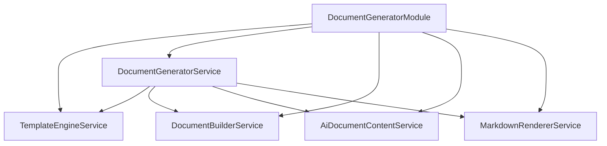
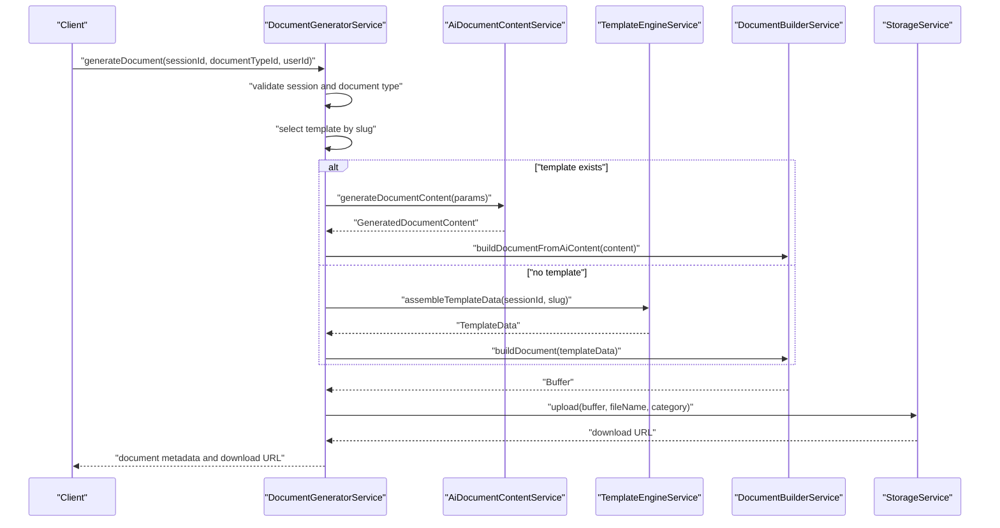
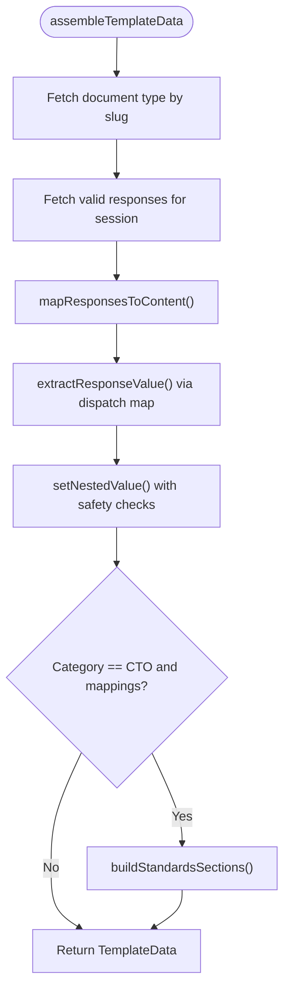
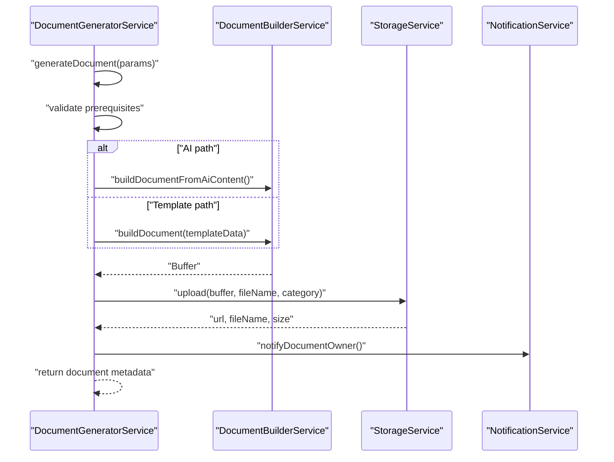
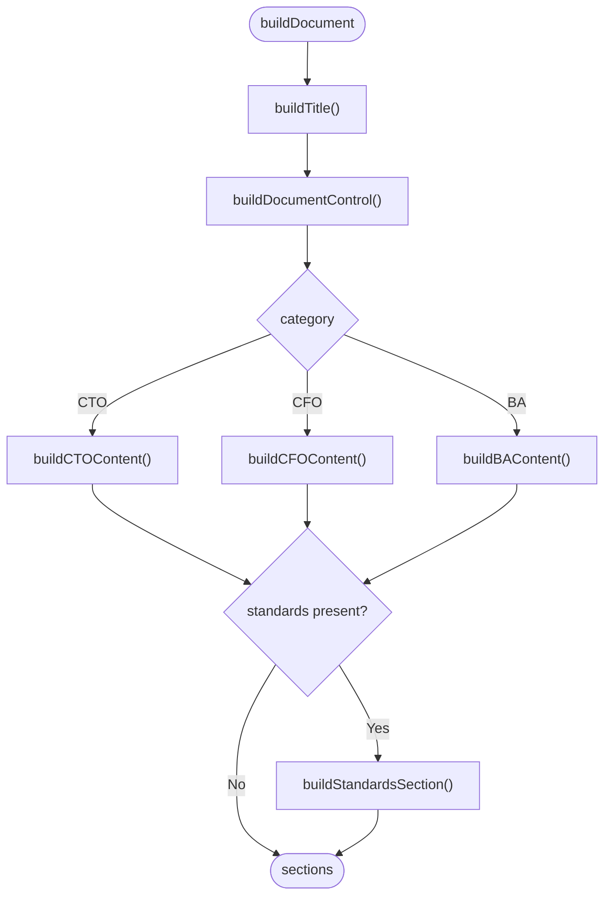
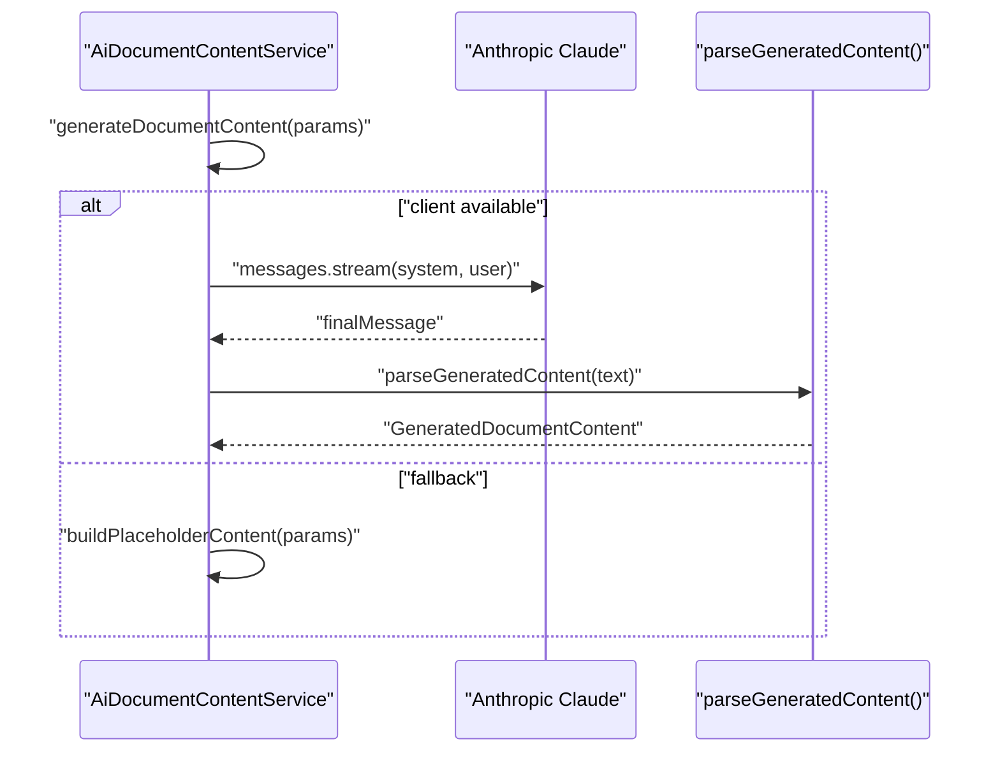
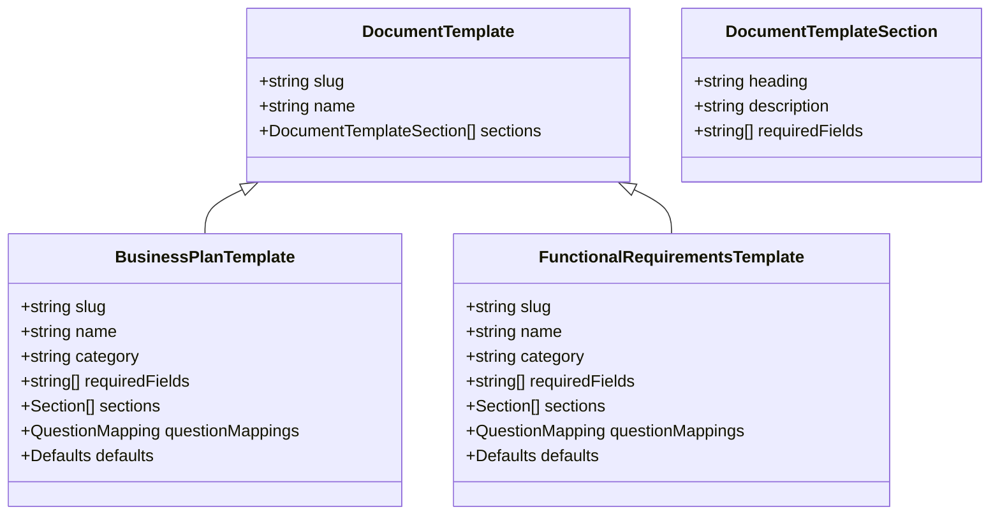
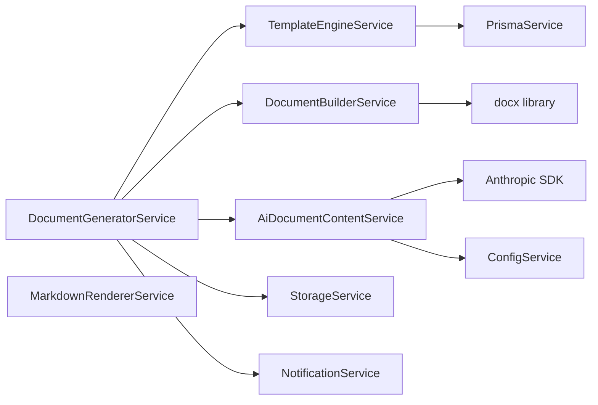

# Template Engine & Management

<cite>
**Referenced Files in This Document**
- [document-generator.module.ts](file://apps/api/src/modules/document-generator/document-generator.module.ts)
- [template-engine.service.ts](file://apps/api/src/modules/document-generator/services/template-engine.service.ts)
- [document-generator.service.ts](file://apps/api/src/modules/document-generator/services/document-generator.service.ts)
- [document-builder.service.ts](file://apps/api/src/modules/document-generator/services/document-builder.service.ts)
- [ai-document-content.service.ts](file://apps/api/src/modules/document-generator/services/ai-document-content.service.ts)
- [markdown-renderer.service.ts](file://apps/api/src/modules/document-generator/services/markdown-renderer.service.ts)
- [document-templates.ts](file://apps/api/src/modules/document-generator/templates/document-templates.ts)
- [business-plan.template.ts](file://apps/api/src/modules/document-generator/templates/business-plan.template.ts)
- [functional-requirements.template.ts](file://apps/api/src/modules/document-generator/templates/functional-requirements.template.ts)
- [index.ts](file://apps/api/src/modules/document-generator/templates/index.ts)
</cite>

## Table of Contents
1. [Introduction](#introduction)
2. [Project Structure](#project-structure)
3. [Core Components](#core-components)
4. [Architecture Overview](#architecture-overview)
5. [Detailed Component Analysis](#detailed-component-analysis)
6. [Dependency Analysis](#dependency-analysis)
7. [Performance Considerations](#performance-considerations)
8. [Troubleshooting Guide](#troubleshooting-guide)
9. [Conclusion](#conclusion)
10. [Appendices](#appendices)

## Introduction
This document describes the template engine and document generation system used by the application. It explains how questionnaire responses are transformed into structured documents across multiple categories (business, technical, compliance, and project deliverables). The system supports both AI-driven generation and traditional template-based assembly, with robust validation, versioning, and extensibility.

## Project Structure
The template engine lives in the document generator module and is composed of:
- Template registry and definitions for 20+ document types
- A template engine service that assembles content from session responses
- A document builder that renders content into DOCX
- An AI content service that generates structured content via an LLM
- A markdown renderer for alternate formats and previews

**Diagram sources**
- [document-generator.module.ts:19-45](file://apps/api/src/modules/document-generator/document-generator.module.ts#L19-L45)

**Section sources**
- [document-generator.module.ts:1-47](file://apps/api/src/modules/document-generator/document-generator.module.ts#L1-L47)

## Core Components
- TemplateEngineService: Extracts and normalizes questionnaire responses into a structured TemplateData object, validates required fields, and supports safe nested path assignment.
- DocumentGeneratorService: Orchestrates document generation, validates prerequisites, selects AI vs template path, and manages storage and notifications.
- DocumentBuilderService: Renders structured content into DOCX using a consistent style and layout.
- AiDocumentContentService: Generates structured content via an LLM with fallback behavior when the API key is not configured.
- MarkdownRendererService: Renders AI content into Markdown and HTML for previews and alternate delivery.

**Section sources**
- [template-engine.service.ts:27-318](file://apps/api/src/modules/document-generator/services/template-engine.service.ts#L27-L318)
- [document-generator.service.ts:22-609](file://apps/api/src/modules/document-generator/services/document-generator.service.ts#L22-L609)
- [document-builder.service.ts:29-539](file://apps/api/src/modules/document-generator/services/document-builder.service.ts#L29-L539)
- [ai-document-content.service.ts:60-359](file://apps/api/src/modules/document-generator/services/ai-document-content.service.ts#L60-L359)
- [markdown-renderer.service.ts:30-279](file://apps/api/src/modules/document-generator/services/markdown-renderer.service.ts#L30-L279)

## Architecture Overview
The system follows a layered architecture:
- Input: Completed questionnaire session with mapped responses
- Assembly: TemplateEngineService builds a normalized TemplateData object
- Rendering: DocumentBuilderService creates DOCX; MarkdownRendererService supports Markdown/HTML
- AI Path: AiDocumentContentService generates structured sections when enabled
- Orchestration: DocumentGeneratorService coordinates generation, storage, and notifications

**Diagram sources**
- [document-generator.service.ts:142-219](file://apps/api/src/modules/document-generator/services/document-generator.service.ts#L142-L219)
- [ai-document-content.service.ts:94-153](file://apps/api/src/modules/document-generator/services/ai-document-content.service.ts#L94-L153)
- [template-engine.service.ts:44-103](file://apps/api/src/modules/document-generator/services/template-engine.service.ts#L44-L103)
- [document-builder.service.ts:75-124](file://apps/api/src/modules/document-generator/services/document-builder.service.ts#L75-L124)

## Detailed Component Analysis

### Template Engine Service
Responsibilities:
- Assemble TemplateData from a session and document type slug
- Map question responses to nested content paths
- Extract values from diverse question types (single/multiple choice, matrix, file uploads)
- Validate required fields using dot-notation paths
- Safely set nested values while blocking unsafe property names

Key behaviors:
- Response extraction handlers for TEXT, TEXTAREA, EMAIL, URL, NUMBER, DATE, SCALE, SINGLE_CHOICE, MULTIPLE_CHOICE, FILE_UPLOAD, MATRIX
- Dot-notation path parsing with safety checks against prototype pollution vectors
- Standards section building for CTO documents using standard mappings

**Diagram sources**
- [template-engine.service.ts:44-103](file://apps/api/src/modules/document-generator/services/template-engine.service.ts#L44-L103)
- [template-engine.service.ts:108-137](file://apps/api/src/modules/document-generator/services/template-engine.service.ts#L108-L137)
- [template-engine.service.ts:142-199](file://apps/api/src/modules/document-generator/services/template-engine.service.ts#L142-L199)
- [template-engine.service.ts:204-250](file://apps/api/src/modules/document-generator/services/template-engine.service.ts#L204-L250)
- [template-engine.service.ts:255-277](file://apps/api/src/modules/document-generator/services/template-engine.service.ts#L255-L277)

**Section sources**
- [template-engine.service.ts:27-318](file://apps/api/src/modules/document-generator/services/template-engine.service.ts#L27-L318)

### Document Generator Service
Responsibilities:
- Validate session completion and ownership
- Enforce required questions per document type
- Choose AI generation when a template definition exists; otherwise fall back to template assembly
- Build documents, upload to storage, update metadata, and notify users

Highlights:
- Supports both AI-generated and template-based content
- Versioning and history retrieval
- Download URL generation with expiry
- Admin workflows for approvals and rejections

**Diagram sources**
- [document-generator.service.ts:142-219](file://apps/api/src/modules/document-generator/services/document-generator.service.ts#L142-L219)
- [document-builder.service.ts:35-69](file://apps/api/src/modules/document-generator/services/document-builder.service.ts#L35-L69)
- [document-builder.service.ts:75-124](file://apps/api/src/modules/document-generator/services/document-builder.service.ts#L75-L124)

**Section sources**
- [document-generator.service.ts:22-609](file://apps/api/src/modules/document-generator/services/document-generator.service.ts#L22-L609)

### Document Builder Service
Responsibilities:
- Build DOCX documents from either TemplateData or AI-generated content
- Apply consistent styles, headers, footers, and spacing
- Render hierarchical content into headings, paragraphs, and bullet lists
- Support category-specific content layouts (CTO, CFO, BA)

Rendering logic:
- Title, Document Control, and category-specific sections
- Standards section appended for CTO documents
- Content recursion for nested objects and arrays

**Diagram sources**
- [document-builder.service.ts:129-157](file://apps/api/src/modules/document-generator/services/document-builder.service.ts#L129-L157)
- [document-builder.service.ts:196-227](file://apps/api/src/modules/document-generator/services/document-builder.service.ts#L196-L227)
- [document-builder.service.ts:232-267](file://apps/api/src/modules/document-generator/services/document-builder.service.ts#L232-L267)
- [document-builder.service.ts:272-307](file://apps/api/src/modules/document-generator/services/document-builder.service.ts#L272-L307)
- [document-builder.service.ts:312-328](file://apps/api/src/modules/document-generator/services/document-builder.service.ts#L312-L328)

**Section sources**
- [document-builder.service.ts:29-539](file://apps/api/src/modules/document-generator/services/document-builder.service.ts#L29-L539)

### AI Document Content Service
Responsibilities:
- Generate structured document content using an LLM (Anthropic Claude)
- Stream responses to avoid timeouts and improve reliability
- Parse and validate JSON output; fallback to placeholder content when unavailable
- Group session answers by dimension for contextual generation

Behavior:
- System prompt enforces professional, structured output
- User message includes questionnaire answers and template sections
- Placeholder content preserves structure and indicates missing AI configuration

**Diagram sources**
- [ai-document-content.service.ts:94-153](file://apps/api/src/modules/document-generator/services/ai-document-content.service.ts#L94-L153)
- [ai-document-content.service.ts:251-291](file://apps/api/src/modules/document-generator/services/ai-document-content.service.ts#L251-L291)

**Section sources**
- [ai-document-content.service.ts:60-359](file://apps/api/src/modules/document-generator/services/ai-document-content.service.ts#L60-L359)

### Markdown Renderer Service
Responsibilities:
- Render structured documents to Markdown with TOC, tables, lists, and callouts
- Parse raw AI output into structured sections
- Convert Markdown to HTML for previews

Capabilities:
- Document-level metadata and footer
- Hierarchical sections with configurable heading levels
- Table rendering and content formatting helpers

**Section sources**
- [markdown-renderer.service.ts:30-279](file://apps/api/src/modules/document-generator/services/markdown-renderer.service.ts#L30-L279)

### Template Definitions and Registry
The system ships with 20+ built-in document templates organized by category and slug. Templates define:
- Slug and name
- Required fields per section
- Section hierarchy and content paths
- Question-to-content mappings
- Defaults for optional fields

Examples of included templates:
- Business Plan (CFO)
- Functional Requirements (BA)
- Technology Roadmap (CTO)
- Information Security Policy (Compliance)
- Incident Response Plan (Compliance)
- Engineering Handbook (CTO)
- Vendor Management (Compliance)
- Onboarding/Offboarding (Compliance)
- IP Assignment NDA (Compliance)
- Business Requirements (BA)
- Process Maps (BA)
- User Stories (BA)
- Requirements Traceability (BA)
- Stakeholder Analysis (BA)
- Business Case (CFO)
- Wireframes/Mockups (BA)
- Change Request (BA)
- API Documentation (CTO)
- Data Models (CTO)
- Product Architecture (CTO)
- User Flow Maps (BA)
- Technical Debt Register (CTO)
- Data Protection Policy (Compliance)
- Disaster Recovery Plan (Compliance)

Registry pattern:
- Centralized index exports all templates
- Dynamic import per template slug for lazy loading
- Type-safe template slugs

**Diagram sources**
- [document-templates.ts:6-16](file://apps/api/src/modules/document-generator/templates/document-templates.ts#L6-L16)
- [business-plan.template.ts:146-497](file://apps/api/src/modules/document-generator/templates/business-plan.template.ts#L146-L497)
- [functional-requirements.template.ts:132-380](file://apps/api/src/modules/document-generator/templates/functional-requirements.template.ts#L132-L380)

**Section sources**
- [document-templates.ts:18-319](file://apps/api/src/modules/document-generator/templates/document-templates.ts#L18-L319)
- [business-plan.template.ts:11-497](file://apps/api/src/modules/document-generator/templates/business-plan.template.ts#L11-L497)
- [functional-requirements.template.ts:11-380](file://apps/api/src/modules/document-generator/templates/functional-requirements.template.ts#L11-L380)
- [index.ts:37-90](file://apps/api/src/modules/document-generator/templates/index.ts#L37-L90)

## Dependency Analysis
- TemplateEngineService depends on PrismaService for data access and uses a response value extractor map for question types.
- DocumentGeneratorService composes TemplateEngineService, DocumentBuilderService, StorageService, NotificationService, and AiDocumentContentService.
- DocumentBuilderService depends on docx for rendering and uses category-specific builders.
- AiDocumentContentService depends on Anthropic SDK and configuration service; falls back gracefully.
- MarkdownRendererService is standalone and used for Markdown/HTML rendering.

**Diagram sources**
- [template-engine.service.ts:30-318](file://apps/api/src/modules/document-generator/services/template-engine.service.ts#L30-L318)
- [document-generator.service.ts:25-32](file://apps/api/src/modules/document-generator/services/document-generator.service.ts#L25-L32)
- [document-builder.service.ts:18-69](file://apps/api/src/modules/document-generator/services/document-builder.service.ts#L18-L69)
- [ai-document-content.service.ts:62-81](file://apps/api/src/modules/document-generator/services/ai-document-content.service.ts#L62-L81)
- [markdown-renderer.service.ts:30-279](file://apps/api/src/modules/document-generator/services/markdown-renderer.service.ts#L30-L279)

**Section sources**
- [document-generator.module.ts:19-45](file://apps/api/src/modules/document-generator/document-generator.module.ts#L19-L45)

## Performance Considerations
- Lazy template loading: Templates are dynamically imported by slug to reduce initial bundle size.
- Streaming AI generation: Uses Anthropic’s streaming to avoid timeouts and improve responsiveness.
- Minimal DOM-like rendering: docx-based builder avoids heavy DOM manipulation.
- Safe path assignment: Prevents prototype pollution and reduces risk of runtime errors.
- Versioning and history: Efficient retrieval of prior versions without regenerating content.

[No sources needed since this section provides general guidance]

## Troubleshooting Guide
Common issues and resolutions:
- Missing required questions: Generation fails early with a descriptive message when required questions are not answered for a given document type.
- Session not completed: Generation requires a completed session; otherwise a bad request error is thrown.
- AI content disabled: If the API key is not configured, the system returns placeholder content but logs a warning.
- Unsafe path mapping: Responses with unsafe property names are blocked and logged.
- Download URL errors: Ensure the document is in a downloadable state (generated or approved) and that storage metadata is present.

**Section sources**
- [document-generator.service.ts:49-100](file://apps/api/src/modules/document-generator/services/document-generator.service.ts#L49-L100)
- [template-engine.service.ts:32-39](file://apps/api/src/modules/document-generator/services/template-engine.service.ts#L32-L39)
- [ai-document-content.service.ts:71-81](file://apps/api/src/modules/document-generator/services/ai-document-content.service.ts#L71-L81)

## Conclusion
The template engine system provides a scalable, extensible framework for transforming questionnaire responses into professional documents. It supports AI-driven generation with graceful fallbacks, robust validation, and consistent rendering across formats. The modular design enables easy addition of new templates and categories.

[No sources needed since this section summarizes without analyzing specific files]

## Appendices

### Template Syntax and Variable Substitution
- Dot-notation paths map question responses to content fields.
- Response value extractors normalize diverse input types into consistent primitives.
- Safe path assignment prevents prototype pollution and invalid property names.

**Section sources**
- [template-engine.service.ts:108-137](file://apps/api/src/modules/document-generator/services/template-engine.service.ts#L108-L137)
- [template-engine.service.ts:142-199](file://apps/api/src/modules/document-generator/services/template-engine.service.ts#L142-L199)
- [template-engine.service.ts:204-250](file://apps/api/src/modules/document-generator/services/template-engine.service.ts#L204-L250)

### Conditional Logic and Dynamic Content
- Templates define required fields per section; validation ensures completeness.
- AI content generation adapts to available answers and recommended follow-ups.
- Category-specific builders render content hierarchies consistently.

**Section sources**
- [document-templates.ts:6-16](file://apps/api/src/modules/document-generator/templates/document-templates.ts#L6-L16)
- [ai-document-content.service.ts:298-311](file://apps/api/src/modules/document-generator/services/ai-document-content.service.ts#L298-L311)

### Template Validation, Versioning, and Inheritance Patterns
- Required fields validation occurs before generation.
- Version history retrieval supports auditing and compliance.
- Template inheritance: Base template structure with category-specific overrides.

**Section sources**
- [template-engine.service.ts:299-316](file://apps/api/src/modules/document-generator/services/template-engine.service.ts#L299-L316)
- [document-generator.service.ts:311-325](file://apps/api/src/modules/document-generator/services/document-generator.service.ts#L311-L325)
- [business-plan.template.ts:146-497](file://apps/api/src/modules/document-generator/templates/business-plan.template.ts#L146-L497)

### Examples: Customization, Parameter Binding, and Content Injection
- Customize templates by extending question mappings and adding defaults.
- Bind parameters via document type slugs and category scoping.
- Inject AI-generated content by providing template sections and session answers.

**Section sources**
- [business-plan.template.ts:439-496](file://apps/api/src/modules/document-generator/templates/business-plan.template.ts#L439-L496)
- [functional-requirements.template.ts:346-379](file://apps/api/src/modules/document-generator/templates/functional-requirements.template.ts#L346-L379)
- [document-templates.ts:18-319](file://apps/api/src/modules/document-generator/templates/document-templates.ts#L18-L319)

### Compilation Pipeline, Error Handling, and Debugging
- Compilation pipeline: assembleTemplateData → buildDocument/buildDocumentFromAiContent → upload → notify.
- Error handling: Early validation, try/catch around AI calls, fallback to placeholders, and detailed logging.
- Debugging: Logs include generation method, section counts, and parsing outcomes.

**Section sources**
- [document-generator.service.ts:142-219](file://apps/api/src/modules/document-generator/services/document-generator.service.ts#L142-L219)
- [ai-document-content.service.ts:102-110](file://apps/api/src/modules/document-generator/services/ai-document-content.service.ts#L102-L110)
- [document-builder.service.ts:35-69](file://apps/api/src/modules/document-generator/services/document-builder.service.ts#L35-L69)

### Performance Optimization, Caching, and Memory Management
- Lazy template imports reduce startup overhead.
- Streaming AI generation improves throughput and reduces memory pressure.
- Category-specific builders minimize branching and improve readability.
- Versioning avoids redundant regeneration of identical content.

[No sources needed since this section provides general guidance]