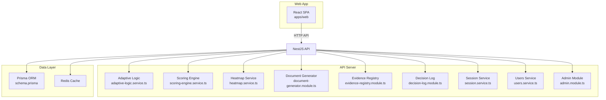
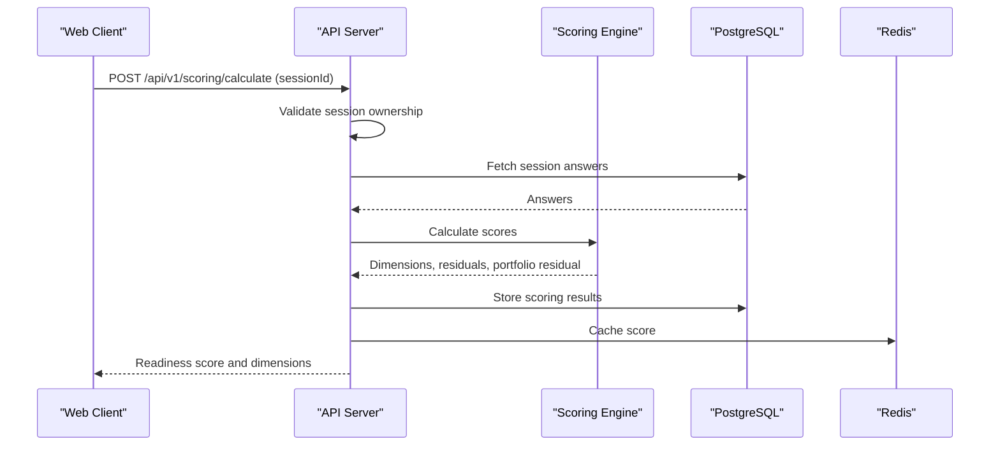
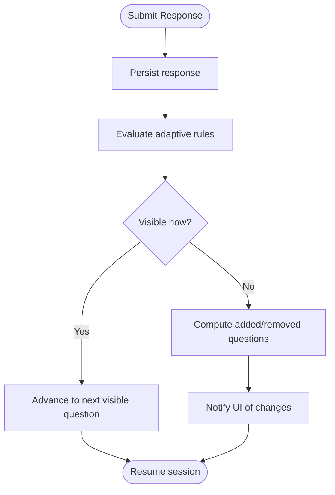
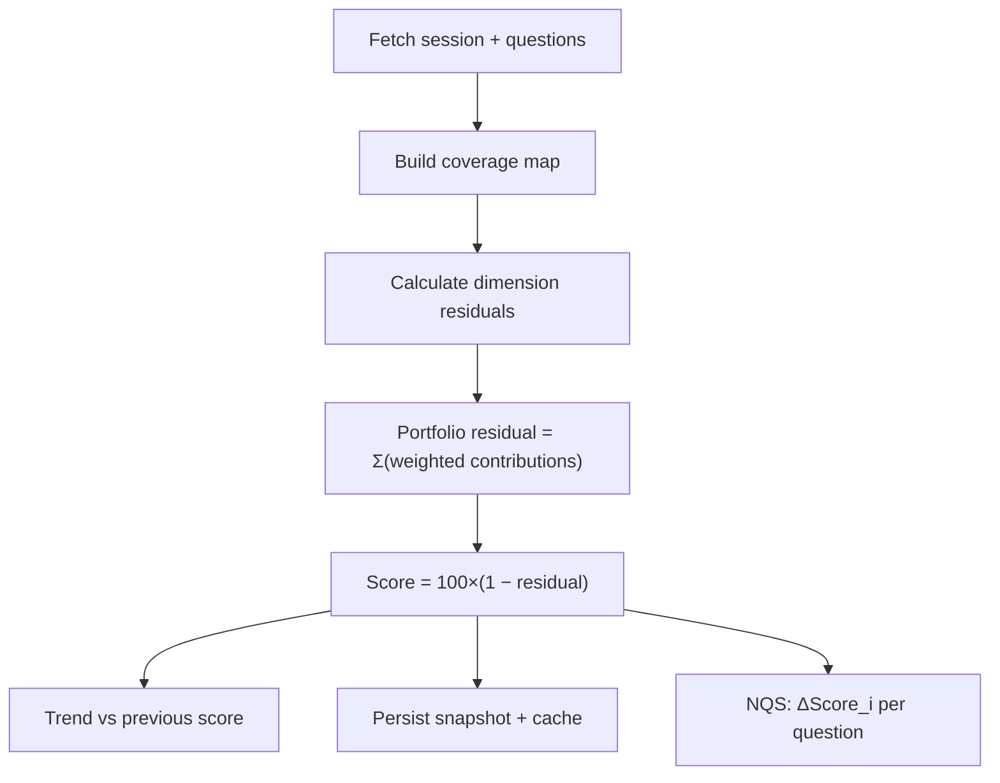
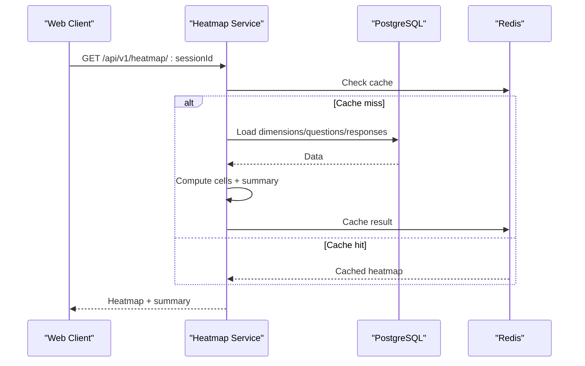
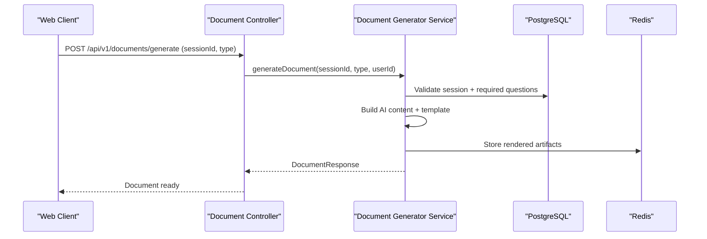
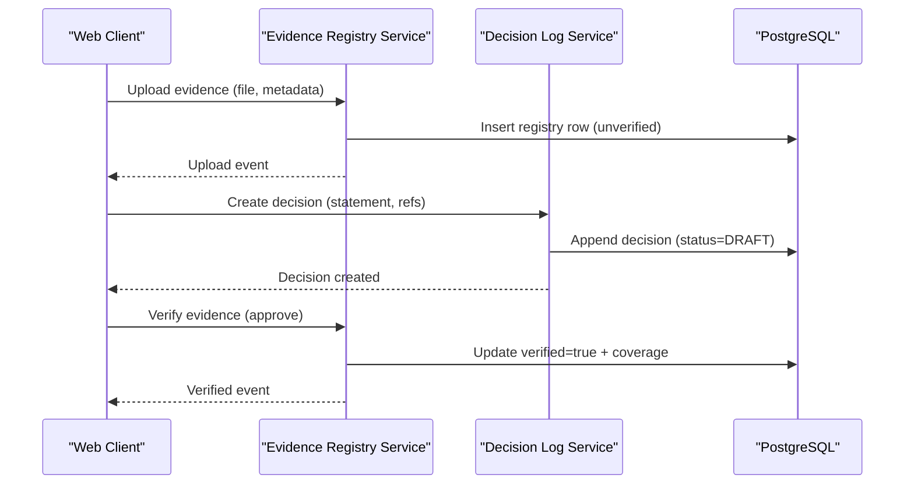
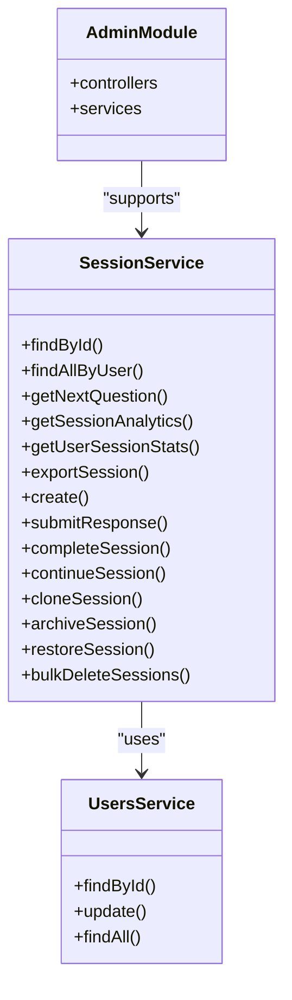
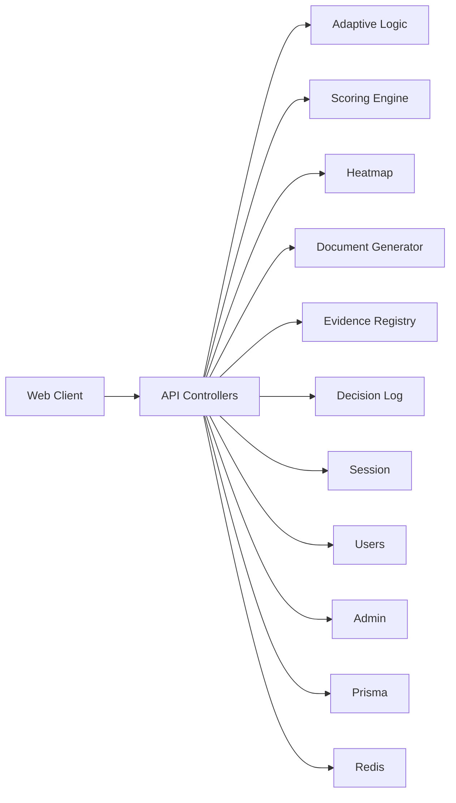

# Core Features

<cite>
**Referenced Files in This Document**
- [adaptive-logic.service.ts](file://apps/api/src/modules/adaptive-logic/adaptive-logic.service.ts)
- [scoring-engine.service.ts](file://apps/api/src/modules/scoring-engine/scoring-engine.service.ts)
- [scoring-calculator.ts](file://apps/api/src/modules/scoring-engine/scoring-calculator.ts)
- [document-generator.module.ts](file://apps/api/src/modules/document-generator/document-generator.module.ts)
- [document.controller.ts](file://apps/api/src/modules/document-generator/controllers/document.controller.ts)
- [documents.ts](file://apps/web/src/api/documents.ts)
- [evidence-registry.module.ts](file://apps/api/src/modules/evidence-registry/evidence-registry.module.ts)
- [decision-log.module.ts](file://apps/api/src/modules/decision-log/decision-log.module.ts)
- [heatmap.service.ts](file://apps/api/src/modules/heatmap/heatmap.service.ts)
- [session.service.ts](file://apps/api/src/modules/session/session.service.ts)
- [users.service.ts](file://apps/api/src/modules/users/users.service.ts)
- [admin.module.ts](file://apps/api/src/modules/admin/admin.module.ts)
- [data-flow-trust-boundaries.md](file://docs/architecture/data-flow-trust-boundaries.md)
- [adaptive-logic.md](file://docs/questionnaire/adaptive-logic.md)
- [FR-205: Progress Tracking and FR-206: Save and Resume](file://docs/ba/02-functional-requirements-document.md)
- [schema.prisma](file://prisma/schema.prisma)
- [migration.sql](file://prisma/migrations/20260126000000_quiz2biz_readiness/migration.sql)
- [V1-Gap-Analysis-2026-02-21.md](file://docs/phase-kits/V1-GAP-ANALYSIS-2026-02-21.md)
- [document-builder.service.spec.ts](file://apps/api/src/modules/document-generator/services/document-builder.service.spec.ts)
- [standards.service.spec.ts](file://apps/api/src/modules/standards/standards.service.spec.ts)
- [evidence-registry.service.spec.ts](file://apps/api/src/modules/evidence-registry/evidence-registry.service.spec.ts)
</cite>

## Table of Contents
1. [Introduction](#introduction)
2. [Project Structure](#project-structure)
3. [Core Components](#core-components)
4. [Architecture Overview](#architecture-overview)
5. [Detailed Component Analysis](#detailed-component-analysis)
6. [Dependency Analysis](#dependency-analysis)
7. [Performance Considerations](#performance-considerations)
8. [Troubleshooting Guide](#troubleshooting-guide)
9. [Conclusion](#conclusion)
10. [Appendices](#appendices)

## Introduction
This document explains the core features of Quiz-to-Build with a focus on:
- Adaptive questionnaire system with 11 question types, smart logic, auto-save, and resume
- Intelligent scoring engine across 7 technical dimensions, real-time visualization, and gap analysis
- Automated documentation generation producing 8+ document types averaging 45+ pages each
- Evidence registry, decision log with approval workflows, and compliance tracking
- Session management, user management, and administrative capabilities
- Feature interactions, data flows, integration patterns, limitations, performance characteristics, and customization options

## Project Structure
Quiz-to-Build is a NestJS monorepo with three primary apps:
- API server implementing domain services (adaptive logic, scoring, heatmaps, documents, evidence, decisions, sessions, users, admin)
- Web client for user-facing flows (questionnaire, documents, evidence, decisions, analytics)
- CLI for offline and batch operations

**Diagram sources**
- [adaptive-logic.service.ts:1-285](file://apps/api/src/modules/adaptive-logic/adaptive-logic.service.ts#L1-L285)
- [scoring-engine.service.ts:1-387](file://apps/api/src/modules/scoring-engine/scoring-engine.service.ts#L1-L387)
- [heatmap.service.ts:1-851](file://apps/api/src/modules/heatmap/heatmap.service.ts#L1-L851)
- [document-generator.module.ts:1-47](file://apps/api/src/modules/document-generator/document-generator.module.ts#L1-L47)
- [evidence-registry.module.ts:1-27](file://apps/api/src/modules/evidence-registry/evidence-registry.module.ts#L1-L27)
- [decision-log.module.ts:1-25](file://apps/api/src/modules/decision-log/decision-log.module.ts#L1-L25)
- [session.service.ts:1-116](file://apps/api/src/modules/session/session.service.ts#L1-L116)
- [users.service.ts:1-203](file://apps/api/src/modules/users/users.service.ts#L1-L203)
- [admin.module.ts:1-14](file://apps/api/src/modules/admin/admin.module.ts#L1-L14)
- [schema.prisma:651-681](file://prisma/schema.prisma#L651-L681)

**Section sources**
- [adaptive-logic.service.ts:1-285](file://apps/api/src/modules/adaptive-logic/adaptive-logic.service.ts#L1-L285)
- [scoring-engine.service.ts:1-387](file://apps/api/src/modules/scoring-engine/scoring-engine.service.ts#L1-L387)
- [heatmap.service.ts:1-851](file://apps/api/src/modules/heatmap/heatmap.service.ts#L1-L851)
- [document-generator.module.ts:1-47](file://apps/api/src/modules/document-generator/document-generator.module.ts#L1-L47)
- [evidence-registry.module.ts:1-27](file://apps/api/src/modules/evidence-registry/evidence-registry.module.ts#L1-L27)
- [decision-log.module.ts:1-25](file://apps/api/src/modules/decision-log/decision-log.module.ts#L1-L25)
- [session.service.ts:1-116](file://apps/api/src/modules/session/session.service.ts#L1-L116)
- [users.service.ts:1-203](file://apps/api/src/modules/users/users.service.ts#L1-L203)
- [admin.module.ts:1-14](file://apps/api/src/modules/admin/admin.module.ts#L1-L14)
- [schema.prisma:651-681](file://prisma/schema.prisma#L651-L681)

## Core Components
- Adaptive Questionnaire System
  - Evaluates visibility, requirement, and branching rules based on user responses
  - Supports persona-aware and project-type-aware question filtering
  - Provides next-question navigation and adaptive change detection
- Intelligent Scoring Engine
  - Computes readiness score across 7+ technical dimensions
  - Calculates dimension residual risk, portfolio residual, and trend analysis
  - Exposes prioritized next questions (NQS) and benchmarks
- Gap Analysis and Visualization
  - Generates dimension × severity heatmaps with color-coded risk
  - Produces drilldowns, summaries, CSV/Markdown exports, and action plans
- Automated Documentation Generation
  - Produces 8+ document types (e.g., User Stories, ADRs) with AI-assisted content
  - Supports templates, standards mapping, and deliverables compilation
- Evidence Registry and Decision Log
  - Append-only decision records with status workflow and approval guard
  - Evidence integrity, verification, and audit trails
- Session and User Management
  - Full lifecycle management: create, submit, complete, continue, clone, archive, restore
  - User profiles, stats, and permissions
- Administration
  - Admin module for questionnaire and audit operations

**Section sources**
- [adaptive-logic.service.ts:29-132](file://apps/api/src/modules/adaptive-logic/adaptive-logic.service.ts#L29-L132)
- [scoring-engine.service.ts:70-164](file://apps/api/src/modules/scoring-engine/scoring-engine.service.ts#L70-L164)
- [heatmap.service.ts:56-91](file://apps/api/src/modules/heatmap/heatmap.service.ts#L56-L91)
- [document-generator.module.ts:19-46](file://apps/api/src/modules/document-generator/document-generator.module.ts#L19-L46)
- [evidence-registry.module.ts:8-26](file://apps/api/src/modules/evidence-registry/evidence-registry.module.ts#L8-L26)
- [decision-log.module.ts:8-23](file://apps/api/src/modules/decision-log/decision-log.module.ts#L8-L23)
- [session.service.ts:30-115](file://apps/api/src/modules/session/session.service.ts#L30-L115)
- [users.service.ts:37-202](file://apps/api/src/modules/users/users.service.ts#L37-L202)
- [admin.module.ts:7-13](file://apps/api/src/modules/admin/admin.module.ts#L7-L13)

## Architecture Overview
The system integrates HTTP clients, API services, caching, and persistence. Data flows are delineated by trust boundaries, with sensitive scoring logic protected behind appropriate layers.

**Diagram sources**
- [data-flow-trust-boundaries.md:183-219](file://docs/architecture/data-flow-trust-boundaries.md#L183-L219)
- [scoring-engine.service.ts:70-164](file://apps/api/src/modules/scoring-engine/scoring-engine.service.ts#L70-L164)

**Section sources**
- [data-flow-trust-boundaries.md:181-229](file://docs/architecture/data-flow-trust-boundaries.md#L181-L229)
- [scoring-engine.service.ts:70-164](file://apps/api/src/modules/scoring-engine/scoring-engine.service.ts#L70-L164)

## Detailed Component Analysis

### Adaptive Questionnaire System
- Smart Logic
  - Visibility rules (show/hide), requirement rules (require/unrequire), branching, and persona/project-type scoping
  - Conditions support equality, inequality, numeric comparisons, list membership, string matching, and emptiness checks
- Auto-save and Resume
  - Responses saved immediately upon submission; drafts persisted periodically; current position tracked
- Interaction Flow
  - Client requests next question; server evaluates rules against current responses and returns next visible question

**Diagram sources**
- [adaptive-logic.service.ts:181-224](file://apps/api/src/modules/adaptive-logic/adaptive-logic.service.ts#L181-L224)
- [FR-205: Progress Tracking and FR-206: Save and Resume:1033-1063](file://docs/ba/02-functional-requirements-document.md#L1033-L1063)

**Section sources**
- [adaptive-logic.service.ts:29-132](file://apps/api/src/modules/adaptive-logic/adaptive-logic.service.ts#L29-L132)
- [adaptive-logic.md:23-85](file://docs/questionnaire/adaptive-logic.md#L23-L85)
- [FR-205: Progress Tracking and FR-206: Save and Resume:1033-1063](file://docs/ba/02-functional-requirements-document.md#L1033-L1063)

### Intelligent Scoring Engine
- Dimensions and Coverage
  - Builds coverage map per question, computes dimension residual risk, and portfolio residual
  - Calculates readiness score = 100 × (1 − portfolio residual)
- Trend and Benchmarks
  - Trend analysis compares to previous score; supports first-time, up, down, stable
  - Industry benchmarks and dimension benchmarks exposed for comparative insights
- Prioritized Next Questions (NQS)
  - Estimates expected score lift per question and ranks top candidates

**Diagram sources**
- [scoring-engine.service.ts:109-164](file://apps/api/src/modules/scoring-engine/scoring-engine.service.ts#L109-L164)
- [scoring-calculator.ts:149-196](file://apps/api/src/modules/scoring-engine/scoring-calculator.ts#L149-L196)

**Section sources**
- [scoring-engine.service.ts:70-164](file://apps/api/src/modules/scoring-engine/scoring-engine.service.ts#L70-L164)
- [scoring-calculator.ts:149-196](file://apps/api/src/modules/scoring-engine/scoring-calculator.ts#L149-L196)

### Gap Analysis and Visualization
- Heatmap Generation
  - Computes residual risk per dimension × severity bucket, color-coded (green/amber/red)
  - Provides drilldown, CSV/Markdown exports, and visualization-ready JSON
- Priority Gaps and Action Plans
  - Ranks gaps by priority score and generates phased action plans with estimated impacts

**Diagram sources**
- [heatmap.service.ts:56-91](file://apps/api/src/modules/heatmap/heatmap.service.ts#L56-L91)

**Section sources**
- [heatmap.service.ts:56-91](file://apps/api/src/modules/heatmap/heatmap.service.ts#L56-L91)
- [V1-GAP-ANALYSIS-2026-02-21.md:52-61](file://docs/phase-kits/V1-GAP-ANALYSIS-2026-02-21.md#L52-L61)

### Automated Documentation Generation
- Modules and Services
  - DocumentGeneratorModule aggregates controllers and services for generation, building, templating, storage, rendering, and bulk download
- API and Client
  - Web client lists document types and triggers generation; API validates session completion and required questions before generating
- Output
  - Produces multiple document categories (e.g., BA, CTO) with AI-assisted content and standardized sections

**Diagram sources**
- [document.controller.ts:45-76](file://apps/api/src/modules/document-generator/controllers/document.controller.ts#L45-L76)
- [documents.ts:48-53](file://apps/web/src/api/documents.ts#L48-L53)

**Section sources**
- [document-generator.module.ts:19-46](file://apps/api/src/modules/document-generator/document-generator.module.ts#L19-L46)
- [document.controller.ts:45-76](file://apps/api/src/modules/document-generator/controllers/document.controller.ts#L45-L76)
- [documents.ts:1-53](file://apps/web/src/api/documents.ts#L1-L53)
- [document-builder.service.spec.ts:589-621](file://apps/api/src/modules/document-generator/services/document-builder.service.spec.ts#L589-L621)
- [standards.service.spec.ts:192-266](file://apps/api/src/modules/standards/standards.service.spec.ts#L192-L266)

### Evidence Registry and Decision Log
- Evidence Registry
  - Tracks uploaded artifacts, integrity (hash), verification workflow, and coverage contribution
  - Provides audit trail combining upload, verification, and decision log events
- Decision Log
  - Append-only forensic record with status workflow (DRAFT → LOCKED → AMENDED/SUPERSEDED)
  - Approval guard and supersession tracking

**Diagram sources**
- [evidence-registry.module.ts:8-26](file://apps/api/src/modules/evidence-registry/evidence-registry.module.ts#L8-L26)
- [decision-log.module.ts:8-23](file://apps/api/src/modules/decision-log/decision-log.module.ts#L8-L23)
- [schema.prisma:677-681](file://prisma/schema.prisma#L677-L681)
- [migration.sql:82-92](file://prisma/migrations/20260126000000_quiz2biz_readiness/migration.sql#L82-L92)
- [evidence-registry.service.spec.ts:1082-1179](file://apps/api/src/modules/evidence-registry/evidence-registry.service.spec.ts#L1082-L1179)

**Section sources**
- [evidence-registry.module.ts:8-26](file://apps/api/src/modules/evidence-registry/evidence-registry.module.ts#L8-L26)
- [decision-log.module.ts:8-23](file://apps/api/src/modules/decision-log/decision-log.module.ts#L8-L23)
- [schema.prisma:651-681](file://prisma/schema.prisma#L651-L681)
- [migration.sql:66-92](file://prisma/migrations/20260126000000_quiz2biz_readiness/migration.sql#L66-L92)
- [evidence-registry.service.spec.ts:1082-1179](file://apps/api/src/modules/evidence-registry/evidence-registry.service.spec.ts#L1082-L1179)

### Session Management, User Management, and Administration
- Session Lifecycle
  - Create, submit response, complete, continue, clone, archive, restore, bulk delete
  - Analytics, export, and progress tracking
- User Management
  - Profile retrieval/update, statistics, pagination, and role-based access
- Administration
  - Admin module for questionnaire and audit operations

**Diagram sources**
- [session.service.ts:30-115](file://apps/api/src/modules/session/session.service.ts#L30-L115)
- [users.service.ts:37-202](file://apps/api/src/modules/users/users.service.ts#L37-L202)
- [admin.module.ts:7-13](file://apps/api/src/modules/admin/admin.module.ts#L7-L13)

**Section sources**
- [session.service.ts:30-115](file://apps/api/src/modules/session/session.service.ts#L30-L115)
- [users.service.ts:37-202](file://apps/api/src/modules/users/users.service.ts#L37-L202)
- [admin.module.ts:7-13](file://apps/api/src/modules/admin/admin.module.ts#L7-L13)

## Dependency Analysis
- Coupling and Cohesion
  - Services are cohesive around domain capabilities (adaptive logic, scoring, heatmaps, documents, evidence, decisions)
  - Low coupling via clear interfaces (DTOs, services, controllers)
- External Dependencies
  - Prisma for ORM, Redis for caching, NestJS for DI and HTTP
- Trust Boundaries
  - Data flows are separated by trust zones; sensitive scoring logic is encapsulated within the scoring engine and analytics services

**Diagram sources**
- [adaptive-logic.service.ts:1-285](file://apps/api/src/modules/adaptive-logic/adaptive-logic.service.ts#L1-L285)
- [scoring-engine.service.ts:1-387](file://apps/api/src/modules/scoring-engine/scoring-engine.service.ts#L1-L387)
- [heatmap.service.ts:1-851](file://apps/api/src/modules/heatmap/heatmap.service.ts#L1-L851)
- [document-generator.module.ts:1-47](file://apps/api/src/modules/document-generator/document-generator.module.ts#L1-L47)
- [evidence-registry.module.ts:1-27](file://apps/api/src/modules/evidence-registry/evidence-registry.module.ts#L1-L27)
- [decision-log.module.ts:1-25](file://apps/api/src/modules/decision-log/decision-log.module.ts#L1-L25)
- [session.service.ts:1-116](file://apps/api/src/modules/session/session.service.ts#L1-L116)
- [users.service.ts:1-203](file://apps/api/src/modules/users/users.service.ts#L1-L203)
- [admin.module.ts:1-14](file://apps/api/src/modules/admin/admin.module.ts#L1-L14)
- [schema.prisma:651-681](file://prisma/schema.prisma#L651-L681)

**Section sources**
- [adaptive-logic.service.ts:1-285](file://apps/api/src/modules/adaptive-logic/adaptive-logic.service.ts#L1-L285)
- [scoring-engine.service.ts:1-387](file://apps/api/src/modules/scoring-engine/scoring-engine.service.ts#L1-L387)
- [heatmap.service.ts:1-851](file://apps/api/src/modules/heatmap/heatmap.service.ts#L1-L851)
- [document-generator.module.ts:1-47](file://apps/api/src/modules/document-generator/document-generator.module.ts#L1-L47)
- [evidence-registry.module.ts:1-27](file://apps/api/src/modules/evidence-registry/evidence-registry.module.ts#L1-L27)
- [decision-log.module.ts:1-25](file://apps/api/src/modules/decision-log/decision-log.module.ts#L1-L25)
- [session.service.ts:1-116](file://apps/api/src/modules/session/session.service.ts#L1-L116)
- [users.service.ts:1-203](file://apps/api/src/modules/users/users.service.ts#L1-L203)
- [admin.module.ts:1-14](file://apps/api/src/modules/admin/admin.module.ts#L1-L14)
- [schema.prisma:651-681](file://prisma/schema.prisma#L651-L681)

## Performance Considerations
- Caching
  - Redis caches scoring results and heatmaps to reduce latency and DB load
- Batch Operations
  - Scoring engine supports batch score calculation with controlled concurrency
- Indexes and Queries
  - Database indexes on evidence registry and decision log improve lookup performance
- Recommendations
  - Use pagination for large lists
  - Prefer cached results when available
  - Limit concurrent document generation for large outputs

[No sources needed since this section provides general guidance]

## Troubleshooting Guide
- Adaptive Logic
  - Verify rule priorities and operators; ensure conditions align with question IDs and expected data types
- Scoring Engine
  - Confirm session completion and required questions; check coverage overrides and dimension filters
- Heatmap
  - Validate persona/project-type filters; confirm cache invalidation when data changes
- Documents
  - Ensure session is completed and required questions are answered; check document type availability
- Evidence and Decisions
  - Review audit trail for upload/verification/decision events; confirm approval workflow adherence
- Sessions and Users
  - Check ownership and permissions; validate user roles and session statuses

**Section sources**
- [adaptive-logic.service.ts:86-132](file://apps/api/src/modules/adaptive-logic/adaptive-logic.service.ts#L86-L132)
- [scoring-engine.service.ts:300-324](file://apps/api/src/modules/scoring-engine/scoring-engine.service.ts#L300-L324)
- [heatmap.service.ts:299-304](file://apps/api/src/modules/heatmap/heatmap.service.ts#L299-L304)
- [document.controller.ts:45-76](file://apps/api/src/modules/document-generator/controllers/document.controller.ts#L45-L76)
- [evidence-registry.service.spec.ts:1082-1179](file://apps/api/src/modules/evidence-registry/evidence-registry.service.spec.ts#L1082-L1179)
- [session.service.ts:52-115](file://apps/api/src/modules/session/session.service.ts#L52-L115)
- [users.service.ts:75-127](file://apps/api/src/modules/users/users.service.ts#L75-L127)

## Conclusion
Quiz-to-Build delivers a robust, extensible platform for adaptive assessment, intelligent scoring, actionable gap analysis, automated documentation, and compliance-enabled workflows. Its modular architecture, strong data modeling, and caching strategies enable scalable performance while maintaining clear separation of concerns and trust boundaries.

[No sources needed since this section summarizes without analyzing specific files]

## Appendices

### Feature Limitations and Known Gaps
- Per-document readiness thresholds are not yet implemented in the document generation pipeline
- Some admin routes remain under development (e.g., activity feed, admin navigation)

**Section sources**
- [V1-GAP-ANALYSIS-2026-02-21.md:56-61](file://docs/phase-kits/V1-GAP-ANALYSIS-2026-02-21.md#L56-L61)
- [e2e/admin/dashboard.e2e.test.ts:33-100](file://e2e/admin/dashboard.e2e.test.ts#L33-L100)

### Customization Options
- Rule-based adaptive logic supports persona and project-type scoping
- Scoring engine allows dimension weighting and coverage overrides
- Heatmap severity buckets and color scales are configurable
- Document generator supports multiple categories and standards mapping

**Section sources**
- [adaptive-logic.service.ts:35-51](file://apps/api/src/modules/adaptive-logic/adaptive-logic.service.ts#L35-L51)
- [scoring-engine.service.ts:85-94](file://apps/api/src/modules/scoring-engine/scoring-engine.service.ts#L85-L94)
- [heatmap.service.ts:38-41](file://apps/api/src/modules/heatmap/heatmap.service.ts#L38-L41)
- [standards.service.spec.ts:225-266](file://apps/api/src/modules/standards/standards.service.spec.ts#L225-L266)