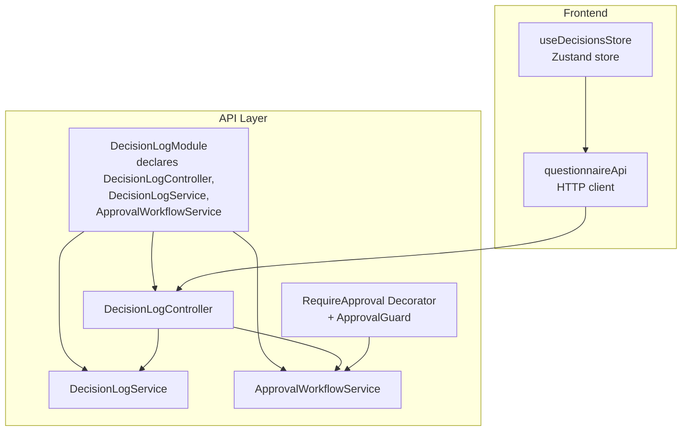
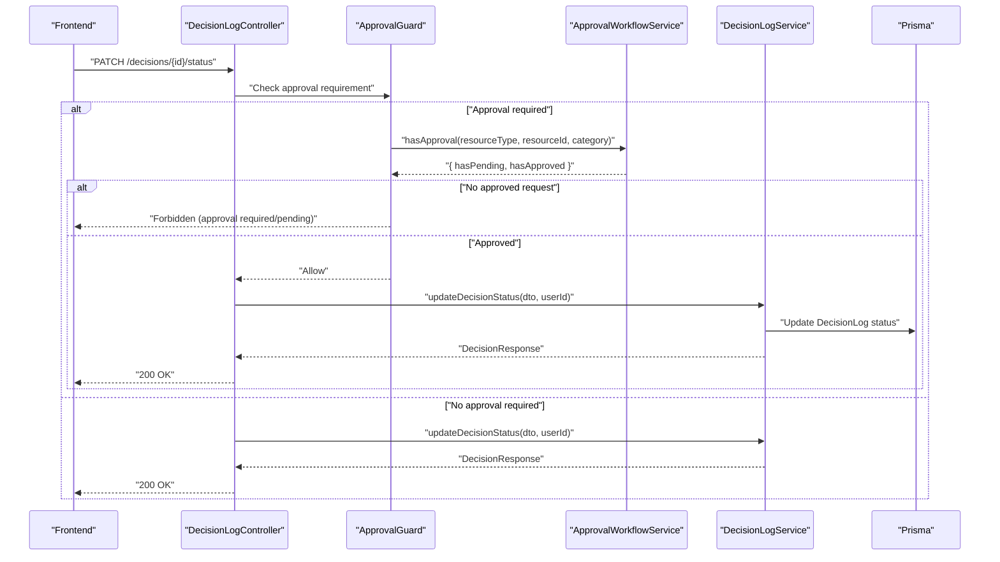
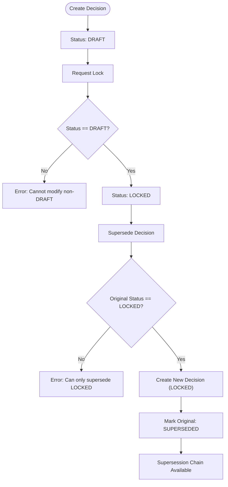
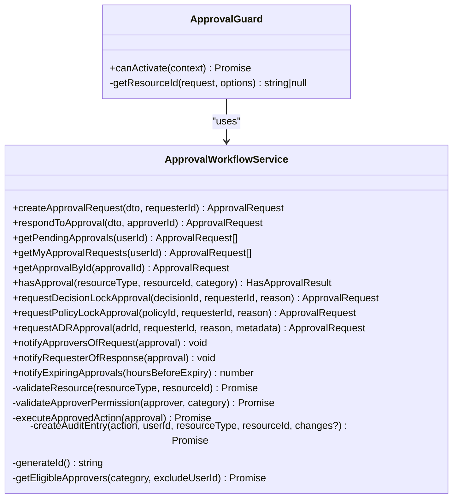
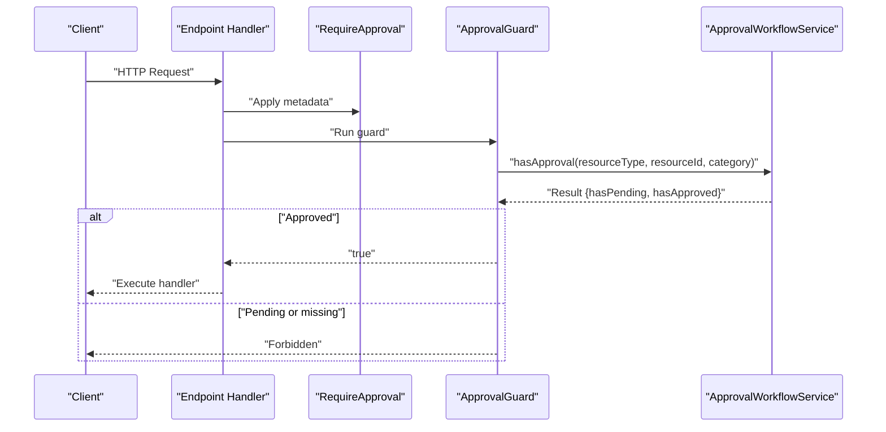
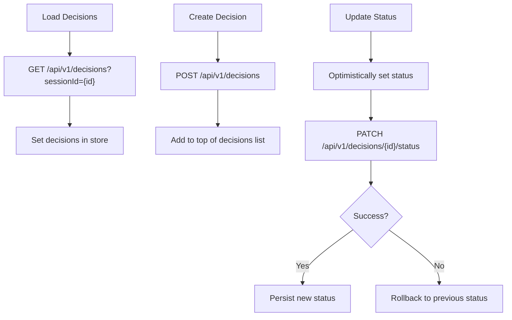
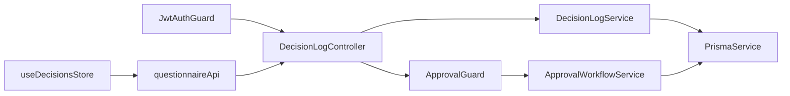

# Decision Log & Approval Workflows

<cite>
**Referenced Files in This Document**
- [decision-log.module.ts](file://apps/api/src/modules/decision-log/decision-log.module.ts)
- [approval-workflow.service.ts](file://apps/api/src/modules/decision-log/approval-workflow.service.ts)
- [decision-log.service.ts](file://apps/api/src/modules/decision-log/decision-log.service.ts)
- [decision-log.controller.ts](file://apps/api/src/modules/decision-log/decision-log.controller.ts)
- [require-approval.decorator.ts](file://apps/api/src/modules/decision-log/decorators/require-approval.decorator.ts)
- [decision.dto.ts](file://apps/api/src/modules/decision-log/dto/decision.dto.ts)
- [decisions.ts](file://apps/web/src/stores/decisions.ts)
- [questionnaire.ts](file://apps/web/src/api/questionnaire.ts)
</cite>

## Table of Contents
1. [Introduction](#introduction)
2. [Project Structure](#project-structure)
3. [Core Components](#core-components)
4. [Architecture Overview](#architecture-overview)
5. [Detailed Component Analysis](#detailed-component-analysis)
6. [Dependency Analysis](#dependency-analysis)
7. [Performance Considerations](#performance-considerations)
8. [Troubleshooting Guide](#troubleshooting-guide)
9. [Conclusion](#conclusion)

## Introduction
This document describes the decision log and approval workflow system implemented in the Quiz2Biz platform. It covers:
- The append-only decision log with immutable status transitions and supersession mechanics
- The two-person rule approval workflow for high-risk actions
- The require-approval decorator system for enforcing governance controls across API endpoints
- Decision log tracking with timestamped records, approver assignments, and status transitions
- The frontend decision management interface with approval queues, review workflows, and audit dashboards
- Approval workflow configuration, role-based access controls, and compliance reporting
- Integration with external approval systems, webhook notifications, and audit trail generation
- Workflow automation, exception handling, and compliance monitoring

## Project Structure
The decision log and approval workflow functionality is organized under the decision-log module in the NestJS API application. The frontend integrates via a dedicated store and API client.

**Diagram sources**
- [decision-log.module.ts:18-24](file://apps/api/src/modules/decision-log/decision-log.module.ts#L18-L24)
- [decision-log.controller.ts:39-41](file://apps/api/src/modules/decision-log/decision-log.controller.ts#L39-L41)
- [decision-log.service.ts:37-41](file://apps/api/src/modules/decision-log/decision-log.service.ts#L37-L41)
- [approval-workflow.service.ts:89-99](file://apps/api/src/modules/decision-log/approval-workflow.service.ts#L89-L99)
- [require-approval.decorator.ts:59-61](file://apps/api/src/modules/decision-log/decorators/require-approval.decorator.ts#L59-L61)
- [decisions.ts:26-90](file://apps/web/src/stores/decisions.ts#L26-L90)
- [questionnaire.ts:395-446](file://apps/web/src/api/questionnaire.ts#L395-L446)

**Section sources**
- [decision-log.module.ts:1-25](file://apps/api/src/modules/decision-log/decision-log.module.ts#L1-L25)
- [decision-log.controller.ts:36-40](file://apps/api/src/modules/decision-log/decision-log.controller.ts#L36-L40)

## Core Components
- DecisionLogModule: Declares and wires the decision log domain, including controller, service, and approval workflow service.
- DecisionLogController: Exposes REST endpoints for creating, locking, superseding, listing, exporting, and deleting decisions.
- DecisionLogService: Implements append-only decision semantics, status transitions, supersession, and audit exports.
- ApprovalWorkflowService: Implements two-person rule approvals, role-based permissions, expiration, notifications, and automatic actions upon approval.
- RequireApproval Decorator + ApprovalGuard: Enforce governance by ensuring required approvals exist before endpoint execution.
- DTOs: Strongly typed request/response models for decision operations.
- Frontend integration: Zustand store and API client for decision CRUD and status updates.

**Section sources**
- [decision-log.module.ts:18-24](file://apps/api/src/modules/decision-log/decision-log.module.ts#L18-L24)
- [decision-log.controller.ts:46-277](file://apps/api/src/modules/decision-log/decision-log.controller.ts#L46-L277)
- [decision-log.service.ts:49-395](file://apps/api/src/modules/decision-log/decision-log.service.ts#L49-L395)
- [approval-workflow.service.ts:108-243](file://apps/api/src/modules/decision-log/approval-workflow.service.ts#L108-L243)
- [require-approval.decorator.ts:59-153](file://apps/api/src/modules/decision-log/decorators/require-approval.decorator.ts#L59-L153)
- [decision.dto.ts:11-150](file://apps/api/src/modules/decision-log/dto/decision.dto.ts#L11-L150)
- [decisions.ts:26-90](file://apps/web/src/stores/decisions.ts#L26-L90)
- [questionnaire.ts:395-446](file://apps/web/src/api/questionnaire.ts#L395-L446)

## Architecture Overview
The system enforces governance through a layered approach:
- API endpoints are protected by JWT authentication.
- Sensitive operations are gated by the RequireApproval decorator and ApprovalGuard.
- ApprovalWorkflowService validates permissions, enforces expiration, and triggers notifications.
- DecisionLogService enforces append-only semantics and maintains immutable audit trails.
- Frontend interacts via a store and API client, with optimistic UI updates and rollback on failures.

**Diagram sources**
- [decision-log.controller.ts:103-122](file://apps/api/src/modules/decision-log/decision-log.controller.ts#L103-L122)
- [require-approval.decorator.ts:76-126](file://apps/api/src/modules/decision-log/decorators/require-approval.decorator.ts#L76-L126)
- [approval-workflow.service.ts:307-331](file://apps/api/src/modules/decision-log/approval-workflow.service.ts#L307-L331)
- [decision-log.service.ts:87-123](file://apps/api/src/modules/decision-log/decision-log.service.ts#L87-L123)

## Detailed Component Analysis

### Decision Log Service
Implements append-only decision records with strict status transitions and supersession:
- Creation: DRAFT status with immutable content fields.
- Locking: Only DRAFT → LOCKED transitions are permitted; locked decisions are immutable.
- Supersession: New decision created to supersede a locked decision; original marked SUPERSEDED.
- Listing and filtering: Supports session, owner, and status filters.
- Audit export: Full chain of decisions with supersession mapping for compliance.
- Deletion: Only DRAFT decisions can be removed.

**Diagram sources**
- [decision-log.service.ts:49-188](file://apps/api/src/modules/decision-log/decision-log.service.ts#L49-L188)

**Section sources**
- [decision-log.service.ts:49-395](file://apps/api/src/modules/decision-log/decision-log.service.ts#L49-L395)

### Approval Workflow Service
Enforces two-person rule and role-based approvals:
- Categories: Policy lock, ADR approval, high-risk decision, security exception, data access.
- Expiration: Configurable hours; expired requests marked EXPIRED.
- Permissions: Role-based validation per category.
- Notifications: Notifies approvers on creation, requester on response, and warns about expiring approvals.
- Automatic actions: Executes category-specific actions upon approval (e.g., locking a decision).
- Audit logs: Comprehensive audit trail for all approval events.

**Diagram sources**
- [approval-workflow.service.ts:108-651](file://apps/api/src/modules/decision-log/approval-workflow.service.ts#L108-L651)
- [require-approval.decorator.ts:69-153](file://apps/api/src/modules/decision-log/decorators/require-approval.decorator.ts#L69-L153)

**Section sources**
- [approval-workflow.service.ts:108-651](file://apps/api/src/modules/decision-log/approval-workflow.service.ts#L108-L651)

### Require-Approval Decorator System
Enforces governance at the endpoint level:
- Metadata-driven configuration specifying approval category, resource type, and resource ID parameter.
- ApprovalGuard extracts resource ID from params/body/query and checks approval status.
- Supports admin bypass configuration and custom error messages.
- Shorthand decorators for common categories (policy, ADR, decision, security exception).

**Diagram sources**
- [require-approval.decorator.ts:59-126](file://apps/api/src/modules/decision-log/decorators/require-approval.decorator.ts#L59-L126)
- [approval-workflow.service.ts:307-331](file://apps/api/src/modules/decision-log/approval-workflow.service.ts#L307-L331)

**Section sources**
- [require-approval.decorator.ts:59-203](file://apps/api/src/modules/decision-log/decorators/require-approval.decorator.ts#L59-L203)

### Decision Management Frontend
The frontend provides:
- Zustand store for decisions with optimistic updates and rollback on failure.
- API client methods for listing, creating, and updating decision statuses.
- Integration with the backend decision endpoints.

**Diagram sources**
- [decisions.ts:31-87](file://apps/web/src/stores/decisions.ts#L31-L87)
- [questionnaire.ts:395-446](file://apps/web/src/api/questionnaire.ts#L395-L446)

**Section sources**
- [decisions.ts:26-90](file://apps/web/src/stores/decisions.ts#L26-L90)
- [questionnaire.ts:395-446](file://apps/web/src/api/questionnaire.ts#L395-L446)

## Dependency Analysis
- DecisionLogModule imports PrismaModule and exports DecisionLogService and ApprovalWorkflowService.
- DecisionLogController depends on DecisionLogService and JWT guard for authentication.
- ApprovalGuard depends on Reflector and ApprovalWorkflowService.
- DecisionLogService depends on PrismaService for persistence.
- Frontend store and API client depend on questionnaire API endpoints.

**Diagram sources**
- [decision-log.controller.ts:25-41](file://apps/api/src/modules/decision-log/decision-log.controller.ts#L25-L41)
- [require-approval.decorator.ts:71-74](file://apps/api/src/modules/decision-log/decorators/require-approval.decorator.ts#L71-L74)
- [decision-log.module.ts:6-22](file://apps/api/src/modules/decision-log/decision-log.module.ts#L6-L22)
- [decisions.ts:1-2](file://apps/web/src/stores/decisions.ts#L1-L2)
- [questionnaire.ts:177-178](file://apps/web/src/api/questionnaire.ts#L177-L178)

**Section sources**
- [decision-log.module.ts:6-22](file://apps/api/src/modules/decision-log/decision-log.module.ts#L6-L22)
- [decision-log.controller.ts:25-41](file://apps/api/src/modules/decision-log/decision-log.controller.ts#L25-L41)
- [require-approval.decorator.ts:71-74](file://apps/api/src/modules/decision-log/decorators/require-approval.decorator.ts#L71-L74)

## Performance Considerations
- Approval in-memory storage: The service uses an in-memory map for approvals. For production, replace with persistent storage to avoid state loss and enable horizontal scaling.
- Pending approvals scan: Scanning all approvals for pending lists is O(n). Consider indexing by status and expiration time for large workloads.
- Audit log writes: Each approval and decision change creates an audit log entry. Batch or debounce audit writes if throughput is high.
- Frontend optimistic updates: Reduce perceived latency but ensure robust rollback on server errors.

## Troubleshooting Guide
Common issues and resolutions:
- Authentication required: Ensure JWT bearer token is included in requests.
- Forbidden: Two-person rule violation or insufficient permissions. Verify approver role and approval status.
- Not found: Resource (decision/session/policy/ADR) does not exist or ID mismatch.
- Bad request: Invalid status transition or expired approval request.
- Expiration warnings: Approvals nearing expiry trigger audit entries; schedule periodic notifications.

Operational checks:
- Verify approval existence and status before invoking sensitive endpoints.
- Confirm role-based permissions align with approval categories.
- Monitor audit logs for approval notifications and responses.

**Section sources**
- [approval-workflow.service.ts:172-243](file://apps/api/src/modules/decision-log/approval-workflow.service.ts#L172-L243)
- [decision-log.service.ts:95-123](file://apps/api/src/modules/decision-log/decision-log.service.ts#L95-L123)
- [require-approval.decorator.ts:112-126](file://apps/api/src/modules/decision-log/decorators/require-approval.decorator.ts#L112-L126)

## Conclusion
The decision log and approval workflow system enforces strong governance through:
- Immutable decision records with append-only semantics
- Two-person rule approvals with role-based permissions
- Decorator-driven enforcement at the API boundary
- Comprehensive audit trails and compliance exports
- Frontend integration with optimistic updates and rollback

To enhance production readiness, persist approvals, optimize scans, and integrate notification channels for escalations and reminders.