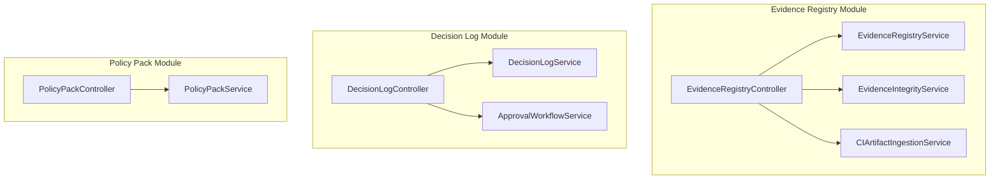
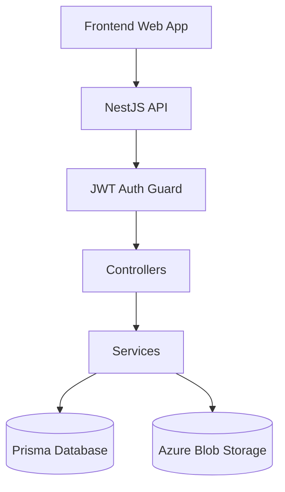
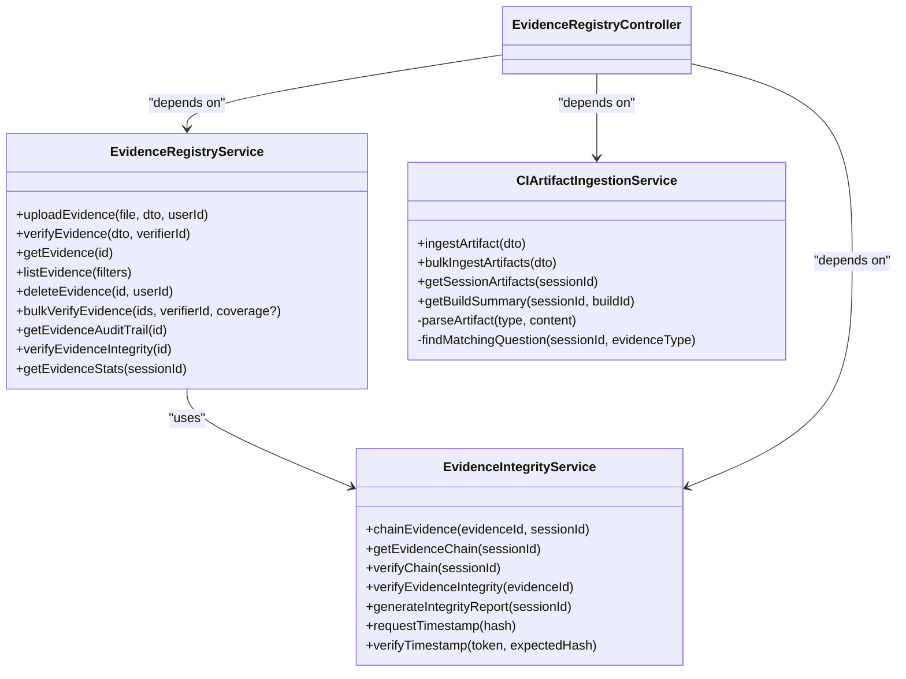
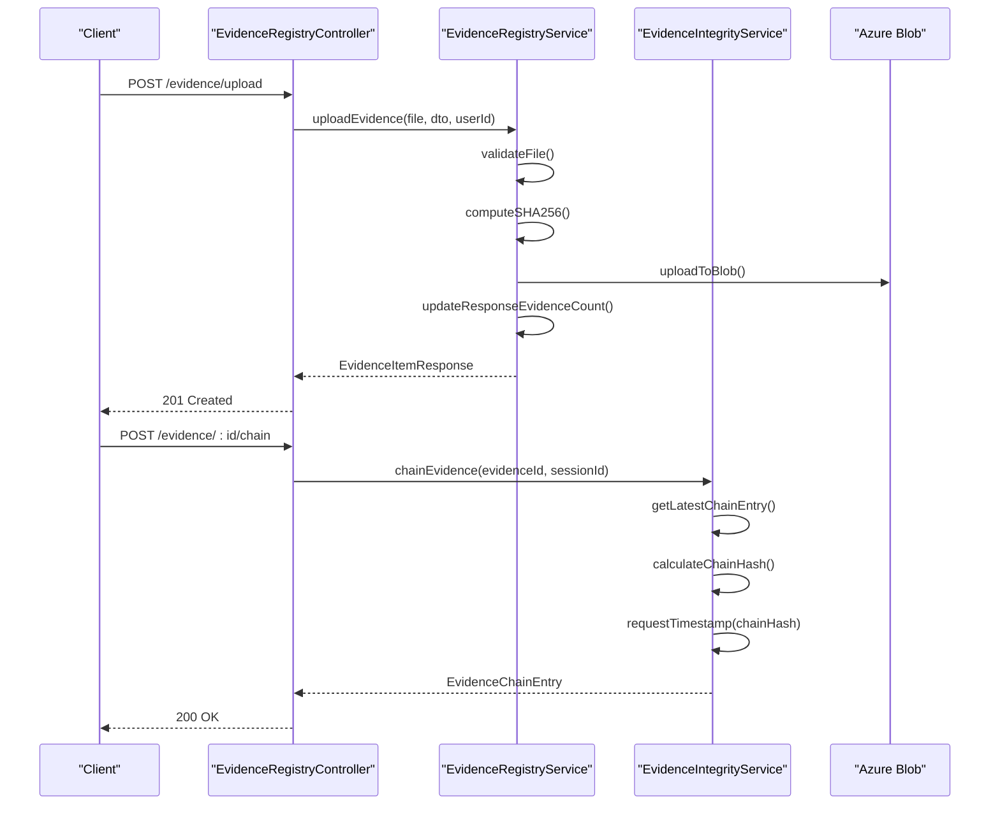
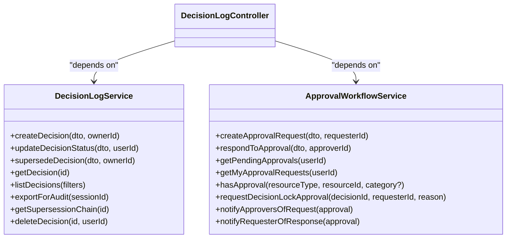
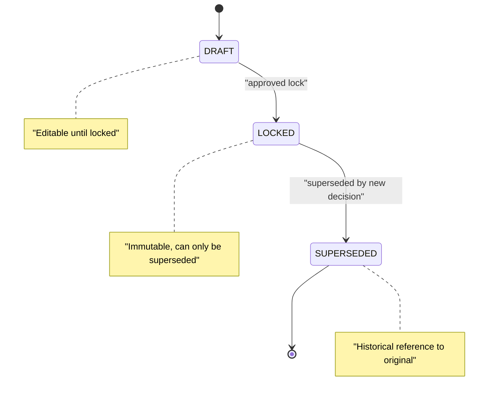
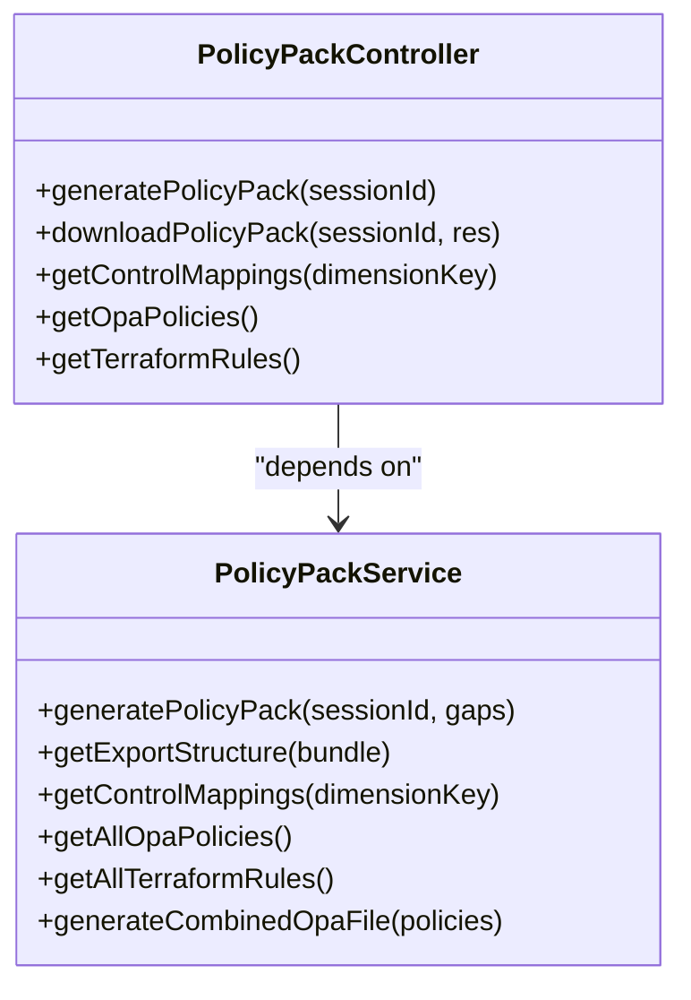
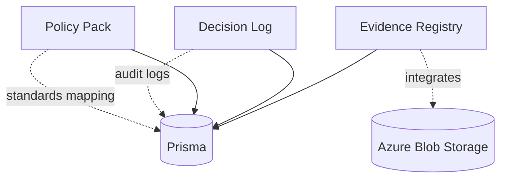

# Evidence & Decision Management

<cite>
**Referenced Files in This Document**
- [evidence-registry.module.ts](file://apps/api/src/modules/evidence-registry/evidence-registry.module.ts)
- [evidence-registry.service.ts](file://apps/api/src/modules/evidence-registry/evidence-registry.service.ts)
- [evidence-integrity.service.ts](file://apps/api/src/modules/evidence-registry/evidence-integrity.service.ts)
- [ci-artifact-ingestion.service.ts](file://apps/api/src/modules/evidence-registry/ci-artifact-ingestion.service.ts)
- [evidence-registry.controller.ts](file://apps/api/src/modules/evidence-registry/evidence-registry.controller.ts)
- [decision-log.module.ts](file://apps/api/src/modules/decision-log/decision-log.module.ts)
- [decision-log.service.ts](file://apps/api/src/modules/decision-log/decision-log.service.ts)
- [approval-workflow.service.ts](file://apps/api/src/modules/decision-log/approval-workflow.service.ts)
- [decision-log.controller.ts](file://apps/api/src/modules/decision-log/decision-log.controller.ts)
- [policy-pack.module.ts](file://apps/api/src/modules/policy-pack/policy-pack.module.ts)
- [policy-pack.service.ts](file://apps/api/src/modules/policy-pack/policy-pack.service.ts)
- [policy-pack.controller.ts](file://apps/api/src/modules/policy-pack/policy-pack.controller.ts)
</cite>

## Table of Contents
1. [Introduction](#introduction)
2. [Project Structure](#project-structure)
3. [Core Components](#core-components)
4. [Architecture Overview](#architecture-overview)
5. [Detailed Component Analysis](#detailed-component-analysis)
6. [Dependency Analysis](#dependency-analysis)
7. [Performance Considerations](#performance-considerations)
8. [Troubleshooting Guide](#troubleshooting-guide)
9. [Conclusion](#conclusion)

## Introduction
This document describes the Evidence & Decision Management system that powers Quiz2Biz compliance and governance workflows. It covers three pillars:
- Evidence Registry: artifact ingestion, integrity verification, metadata extraction, and CI artifact processing
- Decision Log: append-only decision records, approval workflows, audit trails, and compliance tracking
- Policy Pack: control mapping, OPA policy enforcement, and regulatory compliance generation

The system integrates frontend interfaces with backend APIs to support automated validation workflows, cryptographic evidence chaining, and comprehensive auditability for enterprise-grade governance.

## Project Structure
The system is organized into three primary modules within the NestJS API application:

**Diagram sources**
- [evidence-registry.module.ts:1-27](file://apps/api/src/modules/evidence-registry/evidence-registry.module.ts#L1-L27)
- [decision-log.module.ts:1-25](file://apps/api/src/modules/decision-log/decision-log.module.ts#L1-L25)
- [policy-pack.module.ts:1-33](file://apps/api/src/modules/policy-pack/policy-pack.module.ts#L1-L33)

**Section sources**
- [evidence-registry.module.ts:1-27](file://apps/api/src/modules/evidence-registry/evidence-registry.module.ts#L1-L27)
- [decision-log.module.ts:1-25](file://apps/api/src/modules/decision-log/decision-log.module.ts#L1-L25)
- [policy-pack.module.ts:1-33](file://apps/api/src/modules/policy-pack/policy-pack.module.ts#L1-L33)

## Core Components
This section outlines the primary components and their responsibilities across the three modules.

- Evidence Registry
  - Uploads files to Azure Blob Storage with SHA-256 hashing
  - Verifies evidence and updates coverage levels
  - Provides audit trails and integrity verification
  - Processes CI artifacts (test reports, SBOMs, security scans)
  - Maintains hash chains and RFC 3161 timestamps

- Decision Log
  - Append-only decision lifecycle: DRAFT → LOCKED → (SUPERSEDED via supersession)
  - Two-person rule approval workflows for high-risk decisions
  - Full audit export for compliance
  - Supersession chain tracking

- Policy Pack
  - Generates policy documents aligned with standards (ISO 27001, NIST CSF, OWASP ASVS)
  - Produces OPA/Rego policies and terraform-compliance rules
  - Exports structured bundles for download

**Section sources**
- [evidence-registry.service.ts:86-95](file://apps/api/src/modules/evidence-registry/evidence-registry.service.ts#L86-L95)
- [evidence-integrity.service.ts:22-34](file://apps/api/src/modules/evidence-registry/evidence-integrity.service.ts#L22-L34)
- [ci-artifact-ingestion.service.ts:21-35](file://apps/api/src/modules/evidence-registry/ci-artifact-ingestion.service.ts#L21-L35)
- [decision-log.service.ts:19-36](file://apps/api/src/modules/decision-log/decision-log.service.ts#L19-L36)
- [approval-workflow.service.ts:75-88](file://apps/api/src/modules/decision-log/approval-workflow.service.ts#L75-L88)
- [policy-pack.service.ts:1-27](file://apps/api/src/modules/policy-pack/policy-pack.service.ts#L1-L27)

## Architecture Overview
The system follows a layered architecture with clear separation of concerns:

**Diagram sources**
- [evidence-registry.controller.ts:57-61](file://apps/api/src/modules/evidence-registry/evidence-registry.controller.ts#L57-L61)
- [decision-log.controller.ts:36-40](file://apps/api/src/modules/decision-log/decision-log.controller.ts#L36-L40)
- [policy-pack.controller.ts:13-17](file://apps/api/src/modules/policy-pack/policy-pack.controller.ts#L13-L17)

## Detailed Component Analysis

### Evidence Registry Analysis
The Evidence Registry manages all forms of compliance artifacts with strong integrity guarantees and CI automation.

**Diagram sources**
- [evidence-registry.service.ts:96-133](file://apps/api/src/modules/evidence-registry/evidence-registry.service.ts#L96-L133)
- [evidence-integrity.service.ts:36-53](file://apps/api/src/modules/evidence-registry/evidence-integrity.service.ts#L36-L53)
- [ci-artifact-ingestion.service.ts:37-91](file://apps/api/src/modules/evidence-registry/ci-artifact-ingestion.service.ts#L37-L91)
- [evidence-registry.controller.ts:61-66](file://apps/api/src/modules/evidence-registry/evidence-registry.controller.ts#L61-L66)

Key capabilities:
- File upload pipeline with SHA-256 hashing and Azure Blob Storage integration
- Coverage-level transitions enforcing monotonic progress
- Audit trail combining evidence events and related decisions
- CI artifact ingestion supporting multiple formats (JUnit, Jest, lcov, Cobertura, CycloneDX, SPDX, Trivy, OWASP)
- Cryptographic evidence chaining with RFC 3161 timestamp authority

**Diagram sources**
- [evidence-registry.controller.ts:135-141](file://apps/api/src/modules/evidence-registry/evidence-registry.controller.ts#L135-L141)
- [evidence-registry.controller.ts:300-305](file://apps/api/src/modules/evidence-registry/evidence-registry.controller.ts#L300-L305)
- [evidence-registry.service.ts:165-208](file://apps/api/src/modules/evidence-registry/evidence-registry.service.ts#L165-L208)
- [evidence-integrity.service.ts:63-133](file://apps/api/src/modules/evidence-registry/evidence-integrity.service.ts#L63-L133)

**Section sources**
- [evidence-registry.service.ts:86-95](file://apps/api/src/modules/evidence-registry/evidence-registry.service.ts#L86-L95)
- [evidence-integrity.service.ts:22-34](file://apps/api/src/modules/evidence-registry/evidence-integrity.service.ts#L22-L34)
- [ci-artifact-ingestion.service.ts:21-35](file://apps/api/src/modules/evidence-registry/ci-artifact-ingestion.service.ts#L21-L35)
- [evidence-registry.controller.ts:47-56](file://apps/api/src/modules/evidence-registry/evidence-registry.controller.ts#L47-L56)

### Decision Log Analysis
The Decision Log enforces an append-only, forensic record of decisions with robust approval workflows.

**Diagram sources**
- [decision-log.service.ts:38-41](file://apps/api/src/modules/decision-log/decision-log.service.ts#L38-L41)
- [approval-workflow.service.ts:90-99](file://apps/api/src/modules/decision-log/approval-workflow.service.ts#L90-L99)
- [decision-log.controller.ts:40-41](file://apps/api/src/modules/decision-log/decision-log.controller.ts#L40-L41)

Decision lifecycle:
- Creation in DRAFT status
- Locking (DRAFT → LOCKED) with two-person rule for high-risk categories
- Supersession to amend locked decisions (creating a new LOCKED decision and marking the original as SUPERSEDED)
- Audit export capturing the full supersession chain

**Diagram sources**
- [decision-log.service.ts:19-36](file://apps/api/src/modules/decision-log/decision-log.service.ts#L19-L36)

**Section sources**
- [decision-log.service.ts:19-36](file://apps/api/src/modules/decision-log/decision-log.service.ts#L19-L36)
- [approval-workflow.service.ts:75-88](file://apps/api/src/modules/decision-log/approval-workflow.service.ts#L75-L88)
- [decision-log.controller.ts:27-35](file://apps/api/src/modules/decision-log/decision-log.controller.ts#L27-L35)

### Policy Pack Analysis
Policy Pack generates compliance-ready materials from readiness gaps and integrates control mappings and OPA policies.

**Diagram sources**
- [policy-pack.service.ts:16-27](file://apps/api/src/modules/policy-pack/policy-pack.service.ts#L16-L27)
- [policy-pack.controller.ts:16-23](file://apps/api/src/modules/policy-pack/policy-pack.controller.ts#L16-L23)

Policy generation pipeline:
- Build gap contexts from a session
- Generate policies per gap
- Aggregate OPA policies and terraform-compliance rules for covered dimensions
- Produce README and export structure
- Download as ZIP archive

**Section sources**
- [policy-pack.service.ts:29-96](file://apps/api/src/modules/policy-pack/policy-pack.service.ts#L29-L96)
- [policy-pack.controller.ts:25-61](file://apps/api/src/modules/policy-pack/policy-pack.controller.ts#L25-L61)

## Dependency Analysis
The modules are loosely coupled and rely on shared database access via Prisma.

**Diagram sources**
- [evidence-registry.module.ts:20-25](file://apps/api/src/modules/evidence-registry/evidence-registry.module.ts#L20-L25)
- [decision-log.module.ts:18-23](file://apps/api/src/modules/decision-log/decision-log.module.ts#L18-L23)
- [policy-pack.module.ts:19-31](file://apps/api/src/modules/policy-pack/policy-pack.module.ts#L19-L31)

**Section sources**
- [evidence-registry.module.ts:1-27](file://apps/api/src/modules/evidence-registry/evidence-registry.module.ts#L1-L27)
- [decision-log.module.ts:1-25](file://apps/api/src/modules/decision-log/decision-log.module.ts#L1-L25)
- [policy-pack.module.ts:1-33](file://apps/api/src/modules/policy-pack/policy-pack.module.ts#L1-L33)

## Performance Considerations
- Evidence upload throughput: SHA-256 hashing and Azure Blob uploads are CPU and network bound; consider connection pooling and streaming for large files.
- Bulk verification: The service batches updates to minimize round trips and uses transactions to maintain consistency.
- CI ingestion: Parsing artifacts (especially XML/JSON) should be optimized; consider streaming parsers for very large reports.
- Decision supersession: Transactional updates ensure atomicity during supersession; keep the chain short to reduce traversal overhead.
- Policy pack generation: Aggregation of OPA and terraform rules scales linearly with the number of gaps; precompute frequently used mappings.

## Troubleshooting Guide
Common issues and resolutions:
- File upload failures
  - Verify Azure Blob configuration and container availability
  - Check file size limits and allowed MIME types
  - Confirm JWT authentication and authorization scopes
- Evidence verification errors
  - Ensure evidence is not already verified before attempting deletion
  - Validate coverage transitions follow monotonic progression
- CI artifact ingestion errors
  - Confirm artifact type is supported and content is valid JSON/XML
  - Ensure question resolution succeeds when questionId is omitted
- Decision lock failures
  - Only DRAFT decisions can be locked; use supersession for changes
  - Two-person rule violations require appropriate approver permissions
- Approval workflow timeouts
  - Approvals expire after configurable hours; resend requests if expired
  - Verify approver roles meet category requirements

**Section sources**
- [evidence-registry.service.ts:328-355](file://apps/api/src/modules/evidence-registry/evidence-registry.service.ts#L328-L355)
- [evidence-registry.service.ts:490-496](file://apps/api/src/modules/evidence-registry/evidence-registry.service.ts#L490-L496)
- [ci-artifact-ingestion.service.ts:607-610](file://apps/api/src/modules/evidence-registry/ci-artifact-ingestion.service.ts#L607-L610)
- [decision-log.service.ts:99-110](file://apps/api/src/modules/decision-log/decision-log.service.ts#L99-L110)
- [approval-workflow.service.ts:184-189](file://apps/api/src/modules/decision-log/approval-workflow.service.ts#L184-L189)

## Conclusion
The Evidence & Decision Management system provides a comprehensive foundation for compliance and governance:
- Evidence Registry ensures tamper-evident artifact management with cryptographic chaining and CI automation
- Decision Log maintains append-only, auditable decision records with robust approval workflows
- Policy Pack delivers standardized, regulatory-aligned policy outputs with OPA and terraform rules

Together, these components enable automated validation workflows, strong integrity guarantees, and seamless integration with external governance systems.