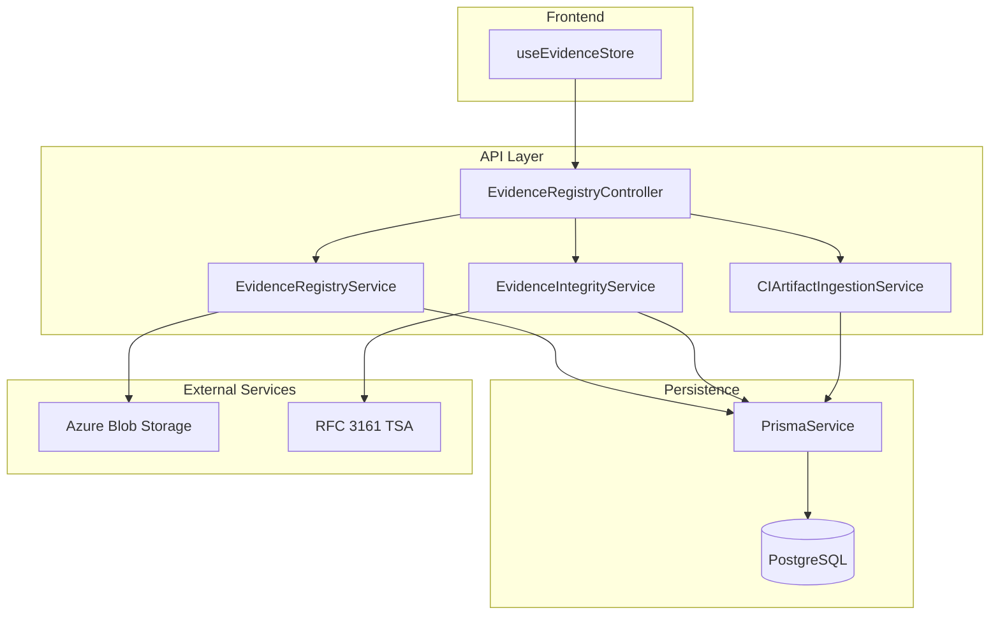
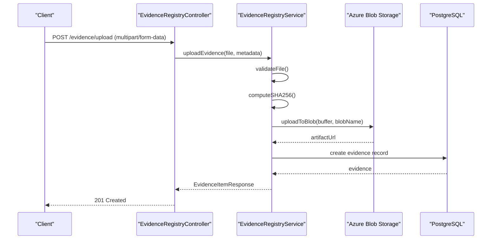
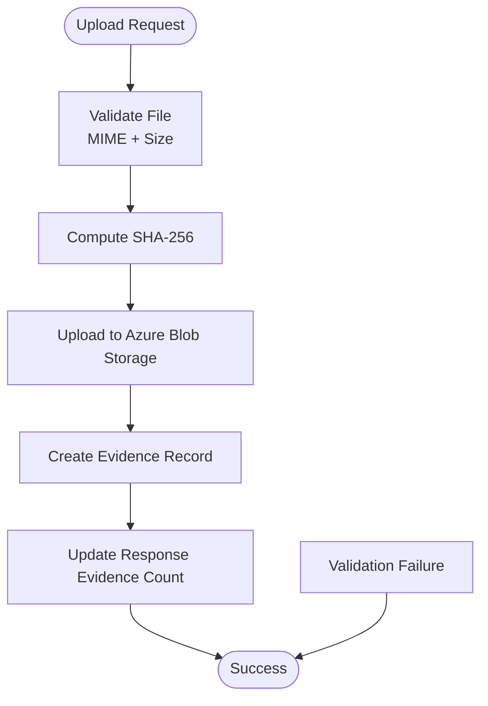
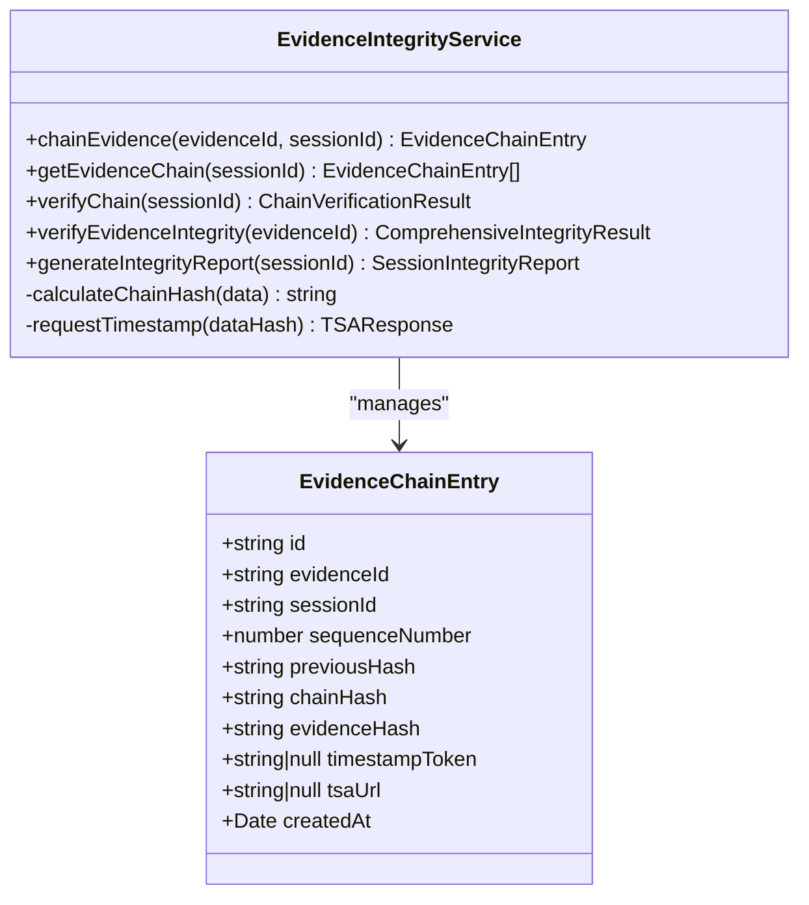
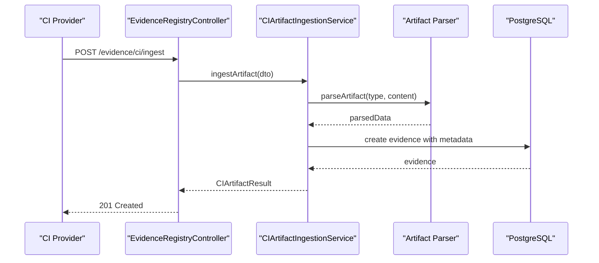
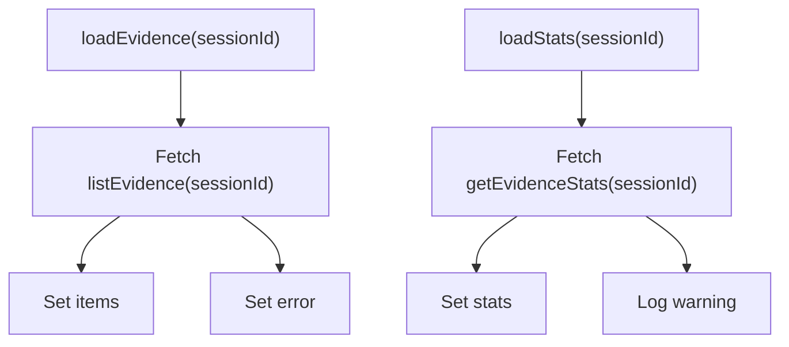
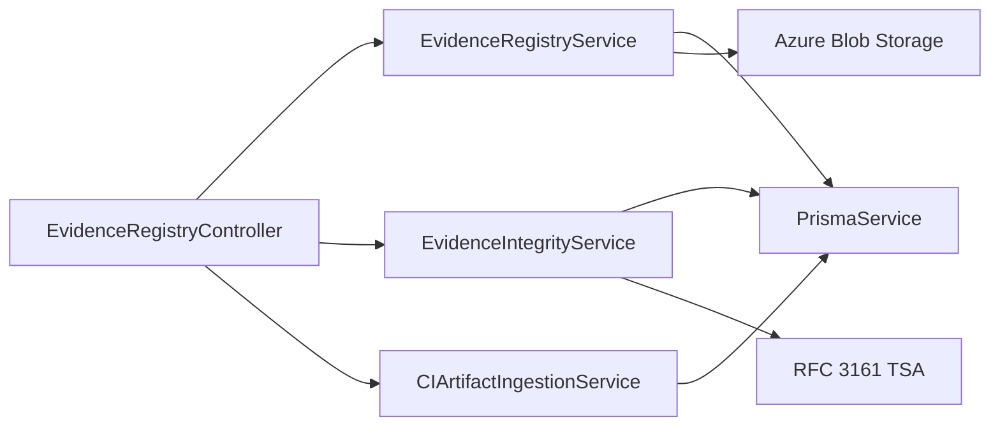

# Evidence Registry

<cite>
**Referenced Files in This Document**
- [evidence-registry.module.ts](file://apps/api/src/modules/evidence-registry/evidence-registry.module.ts)
- [evidence-registry.controller.ts](file://apps/api/src/modules/evidence-registry/evidence-registry.controller.ts)
- [evidence-registry.service.ts](file://apps/api/src/modules/evidence-registry/evidence-registry.service.ts)
- [evidence-integrity.service.ts](file://apps/api/src/modules/evidence-registry/evidence-integrity.service.ts)
- [ci-artifact-ingestion.service.ts](file://apps/api/src/modules/evidence-registry/ci-artifact-ingestion.service.ts)
- [evidence.dto.ts](file://apps/api/src/modules/evidence-registry/dto/evidence.dto.ts)
- [evidence.ts](file://apps/web/src/stores/evidence.ts)
</cite>

## Table of Contents
1. [Introduction](#introduction)
2. [Project Structure](#project-structure)
3. [Core Components](#core-components)
4. [Architecture Overview](#architecture-overview)
5. [Detailed Component Analysis](#detailed-component-analysis)
6. [Dependency Analysis](#dependency-analysis)
7. [Performance Considerations](#performance-considerations)
8. [Troubleshooting Guide](#troubleshooting-guide)
9. [Conclusion](#conclusion)
10. [Appendices](#appendices)

## Introduction
The Evidence Registry system provides a comprehensive solution for managing, validating, and auditing evidence artifacts within Quiz2Biz readiness assessments. It integrates CI/CD artifact ingestion, cryptographic integrity chaining, and a robust frontend evidence management interface. The system ensures evidence integrity through SHA-256 hashing, optional RFC 3161 timestamping, and chain-of-custody tracking. It supports CRUD operations, advanced filtering, batch verification, and compliance reporting.

## Project Structure
The Evidence Registry is implemented as a NestJS module with dedicated services for evidence management, integrity verification, and CI artifact ingestion. The API exposes Swagger-enabled endpoints secured by JWT authentication. The frontend leverages a Zustand store to fetch and display evidence lists and statistics.

**Diagram sources**
- [evidence-registry.controller.ts:61-462](file://apps/api/src/modules/evidence-registry/evidence-registry.controller.ts#L61-L462)
- [evidence-registry.service.ts:96-953](file://apps/api/src/modules/evidence-registry/evidence-registry.service.ts#L96-L953)
- [evidence-integrity.service.ts:36-608](file://apps/api/src/modules/evidence-registry/evidence-integrity.service.ts#L36-L608)
- [ci-artifact-ingestion.service.ts:37-871](file://apps/api/src/modules/evidence-registry/ci-artifact-ingestion.service.ts#L37-L871)
- [evidence-registry.module.ts:20-26](file://apps/api/src/modules/evidence-registry/evidence-registry.module.ts#L20-L26)

**Section sources**
- [evidence-registry.module.ts:1-27](file://apps/api/src/modules/evidence-registry/evidence-registry.module.ts#L1-L27)
- [evidence-registry.controller.ts:1-463](file://apps/api/src/modules/evidence-registry/evidence-registry.controller.ts#L1-L463)

## Core Components
- EvidenceRegistryController: Exposes REST endpoints for evidence CRUD, verification, listing, statistics, integrity checks, and CI artifact ingestion.
- EvidenceRegistryService: Handles file upload to Azure Blob Storage, SHA-256 hashing, verification workflow, coverage updates, and audit trails.
- EvidenceIntegrityService: Implements blockchain-style hash chaining, RFC 3161 timestamping, and comprehensive integrity verification.
- CIArtifactIngestionService: Parses CI artifacts (JUnit, Jest, lcov, Cobertura, CycloneDX, SPDX, Trivy, OWASP) and creates evidence records with metadata.
- DTOs: Strongly-typed request/response models for validation and API documentation.
- Frontend Store: Zustand store for loading evidence items and statistics in the web UI.

**Section sources**
- [evidence-registry.controller.ts:61-462](file://apps/api/src/modules/evidence-registry/evidence-registry.controller.ts#L61-L462)
- [evidence-registry.service.ts:96-953](file://apps/api/src/modules/evidence-registry/evidence-registry.service.ts#L96-L953)
- [evidence-integrity.service.ts:36-608](file://apps/api/src/modules/evidence-registry/evidence-integrity.service.ts#L36-L608)
- [ci-artifact-ingestion.service.ts:37-871](file://apps/api/src/modules/evidence-registry/ci-artifact-ingestion.service.ts#L37-L871)
- [evidence.dto.ts:1-124](file://apps/api/src/modules/evidence-registry/dto/evidence.dto.ts#L1-L124)
- [evidence.ts:1-68](file://apps/web/src/stores/evidence.ts#L1-L68)

## Architecture Overview
The system follows a layered architecture:
- Presentation: NestJS controller handles HTTP requests and Swagger documentation.
- Application: Services encapsulate business logic for evidence management, integrity, and CI ingestion.
- Persistence: Prisma ORM connects to PostgreSQL; Azure Blob Storage persists artifacts.
- External Integrations: RFC 3161 TSA for timestamping; CI providers for artifact ingestion.

**Diagram sources**
- [evidence-registry.controller.ts:135-141](file://apps/api/src/modules/evidence-registry/evidence-registry.controller.ts#L135-L141)
- [evidence-registry.service.ts:165-208](file://apps/api/src/modules/evidence-registry/evidence-registry.service.ts#L165-L208)
- [evidence-registry.service.ts:376-395](file://apps/api/src/modules/evidence-registry/evidence-registry.service.ts#L376-L395)

## Detailed Component Analysis

### Evidence Management Service
Handles file uploads, integrity checks, verification workflow, and coverage updates. It validates allowed MIME types and enforces file size limits. SHA-256 hashing is computed and stored alongside the artifact URL. Verification updates both verification status and associated response coverage while enforcing monotonic coverage transitions.

**Diagram sources**
- [evidence-registry.service.ts:165-208](file://apps/api/src/modules/evidence-registry/evidence-registry.service.ts#L165-L208)
- [evidence-registry.service.ts:419-434](file://apps/api/src/modules/evidence-registry/evidence-registry.service.ts#L419-L434)

**Section sources**
- [evidence-registry.service.ts:100-127](file://apps/api/src/modules/evidence-registry/evidence-registry.service.ts#L100-L127)
- [evidence-registry.service.ts:165-208](file://apps/api/src/modules/evidence-registry/evidence-registry.service.ts#L165-L208)
- [evidence-registry.service.ts:216-245](file://apps/api/src/modules/evidence-registry/evidence-registry.service.ts#L216-L245)
- [evidence-registry.service.ts:475-510](file://apps/api/src/modules/evidence-registry/evidence-registry.service.ts#L475-L510)

### Evidence Integrity Service
Implements a blockchain-style hash chain linking evidence items. Each chain entry combines canonical JSON of chain data and is hashed to form a merkle-like chain. Optional RFC 3161 timestamp tokens are requested and stored with the chain entry. Integrity verification checks chain links, computed hashes, and evidence hash consistency.

**Diagram sources**
- [evidence-integrity.service.ts:36-608](file://apps/api/src/modules/evidence-registry/evidence-integrity.service.ts#L36-L608)
- [evidence-integrity.service.ts:518-529](file://apps/api/src/modules/evidence-registry/evidence-integrity.service.ts#L518-L529)

**Section sources**
- [evidence-integrity.service.ts:63-133](file://apps/api/src/modules/evidence-registry/evidence-integrity.service.ts#L63-L133)
- [evidence-integrity.service.ts:200-274](file://apps/api/src/modules/evidence-registry/evidence-integrity.service.ts#L200-L274)
- [evidence-integrity.service.ts:396-444](file://apps/api/src/modules/evidence-registry/evidence-integrity.service.ts#L396-L444)
- [evidence-integrity.service.ts:449-486](file://apps/api/src/modules/evidence-registry/evidence-integrity.service.ts#L449-L486)

### CI Artifact Ingestion Service
Automates ingestion of CI/CD artifacts from Azure DevOps, GitHub Actions, and GitLab CI. Supports parsing of test reports, code coverage, SBOMs, and security scans. Artifacts are mapped to evidence types, parsed into structured summaries, and stored with metadata including provider, build identifiers, and parsed data.

**Diagram sources**
- [evidence-registry.controller.ts:412-414](file://apps/api/src/modules/evidence-registry/evidence-registry.controller.ts#L412-L414)
- [ci-artifact-ingestion.service.ts:98-163](file://apps/api/src/modules/evidence-registry/ci-artifact-ingestion.service.ts#L98-L163)
- [ci-artifact-ingestion.service.ts:205-228](file://apps/api/src/modules/evidence-registry/ci-artifact-ingestion.service.ts#L205-L228)

**Section sources**
- [ci-artifact-ingestion.service.ts:41-86](file://apps/api/src/modules/evidence-registry/ci-artifact-ingestion.service.ts#L41-L86)
- [ci-artifact-ingestion.service.ts:98-163](file://apps/api/src/modules/evidence-registry/ci-artifact-ingestion.service.ts#L98-L163)
- [ci-artifact-ingestion.service.ts:615-709](file://apps/api/src/modules/evidence-registry/ci-artifact-ingestion.service.ts#L615-L709)

### Frontend Evidence Management Interface
The web frontend uses a Zustand store to load evidence items and statistics for a session. The store fetches data via questionnaire API and manages loading states and errors.

**Diagram sources**
- [evidence.ts:40-64](file://apps/web/src/stores/evidence.ts#L40-L64)

**Section sources**
- [evidence.ts:1-68](file://apps/web/src/stores/evidence.ts#L1-L68)

## Dependency Analysis
The Evidence Registry module composes three core services and integrates with Prisma for persistence and Azure Blob Storage for artifact storage. Integrity operations rely on RFC 3161 TSA for timestamping. The controller delegates to services, ensuring separation of concerns and testability.

**Diagram sources**
- [evidence-registry.module.ts:20-26](file://apps/api/src/modules/evidence-registry/evidence-registry.module.ts#L20-L26)
- [evidence-registry.controller.ts:62-66](file://apps/api/src/modules/evidence-registry/evidence-registry.controller.ts#L62-L66)

**Section sources**
- [evidence-registry.module.ts:1-27](file://apps/api/src/modules/evidence-registry/evidence-registry.module.ts#L1-L27)
- [evidence-registry.controller.ts:61-66](file://apps/api/src/modules/evidence-registry/evidence-registry.controller.ts#L61-L66)

## Performance Considerations
- File Uploads: SHA-256 hashing and Azure Blob Storage uploads occur synchronously during upload. Consider asynchronous processing for large files to improve responsiveness.
- Bulk Operations: Bulk verification uses a single transaction to minimize round trips and maintain consistency.
- Pagination: Listing endpoints limit results to prevent excessive memory usage.
- Caching: Integrity verification results and CI build summaries can benefit from caching to reduce repeated computations.

[No sources needed since this section provides general guidance]

## Troubleshooting Guide
Common issues and resolutions:
- File Upload Failures: Validate allowed MIME types and file size limits. Ensure Azure Blob Storage connection string is configured.
- Verification Errors: Confirm evidence exists and is unverified before attempting deletion. Coverage transitions must be monotonic.
- Integrity Verification: If chain verification fails, inspect invalid entries for broken links or modified evidence hashes.
- CI Ingestion: Verify artifact type mapping and content format. Ensure session exists and question mapping resolves correctly.

**Section sources**
- [evidence-registry.service.ts:419-434](file://apps/api/src/modules/evidence-registry/evidence-registry.service.ts#L419-L434)
- [evidence-registry.service.ts:329-355](file://apps/api/src/modules/evidence-registry/evidence-registry.service.ts#L329-L355)
- [evidence-integrity.service.ts:214-274](file://apps/api/src/modules/evidence-registry/evidence-integrity.service.ts#L214-L274)
- [ci-artifact-ingestion.service.ts:109-112](file://apps/api/src/modules/evidence-registry/ci-artifact-ingestion.service.ts#L109-L112)

## Conclusion
The Evidence Registry system provides a secure, auditable, and scalable foundation for managing readiness assessment evidence. It automates CI artifact ingestion, enforces cryptographic integrity, and offers comprehensive verification and reporting capabilities. The modular architecture supports future enhancements such as asynchronous processing, caching, and expanded CI provider integrations.

[No sources needed since this section summarizes without analyzing specific files]

## Appendices

### API Endpoints
- POST /evidence/upload: Upload evidence file with SHA-256 hashing and Azure Blob Storage integration.
- POST /evidence/verify: Verify evidence and optionally update coverage on associated response.
- GET /evidence/:evidenceId: Retrieve evidence by ID.
- GET /evidence: List evidence with filters (session, question, type, verification status).
- GET /evidence/stats/:sessionId: Get aggregated statistics for a session.
- DELETE /evidence/:evidenceId: Delete unverified evidence.
- POST /evidence/:evidenceId/chain: Link evidence to integrity chain with optional timestamp.
- GET /evidence/chain/:sessionId: Retrieve full hash chain for a session.
- GET /evidence/chain/:sessionId/verify: Verify integrity of the entire chain.
- GET /evidence/:evidenceId/integrity: Comprehensive integrity check for single evidence.
- GET /evidence/integrity-report/:sessionId: Generate integrity report for a session.
- POST /evidence/ci/ingest: Ingest CI artifact as evidence with metadata and parsed data.
- POST /evidence/ci/bulk-ingest: Bulk ingest multiple CI artifacts from a single build.
- GET /evidence/ci/session/:sessionId: Get all CI artifacts ingested for a session.
- GET /evidence/ci/build/:sessionId/:buildId: Get aggregated metrics and artifacts for a CI build.

**Section sources**
- [evidence-registry.controller.ts:68-462](file://apps/api/src/modules/evidence-registry/evidence-registry.controller.ts#L68-L462)

### Data Models
- Evidence Item: Includes identifiers, URLs, type, file metadata, hash signature, verification status, and timestamps.
- Integrity Chain Entry: Tracks sequence number, previous and chain hashes, evidence hash, and timestamp token.
- CI Metadata: Embeds provider, build identifiers, parsed data, and ingestion status.

**Section sources**
- [evidence.dto.ts:59-98](file://apps/api/src/modules/evidence-registry/dto/evidence.dto.ts#L59-L98)
- [evidence-integrity.service.ts:518-529](file://apps/api/src/modules/evidence-registry/evidence-integrity.service.ts#L518-L529)
- [ci-artifact-ingestion.service.ts:7-19](file://apps/api/src/modules/evidence-registry/ci-artifact-ingestion.service.ts#L7-L19)