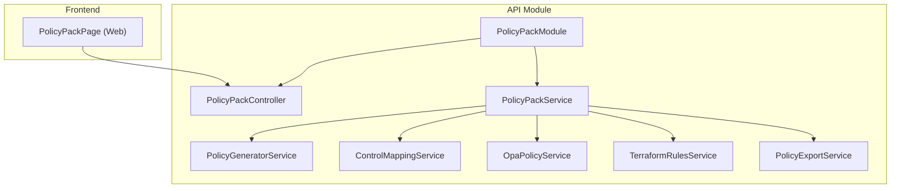
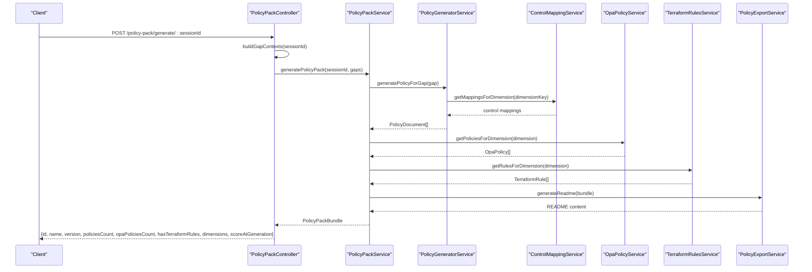
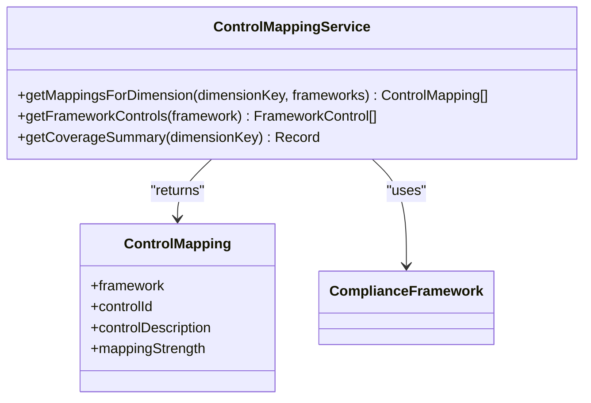
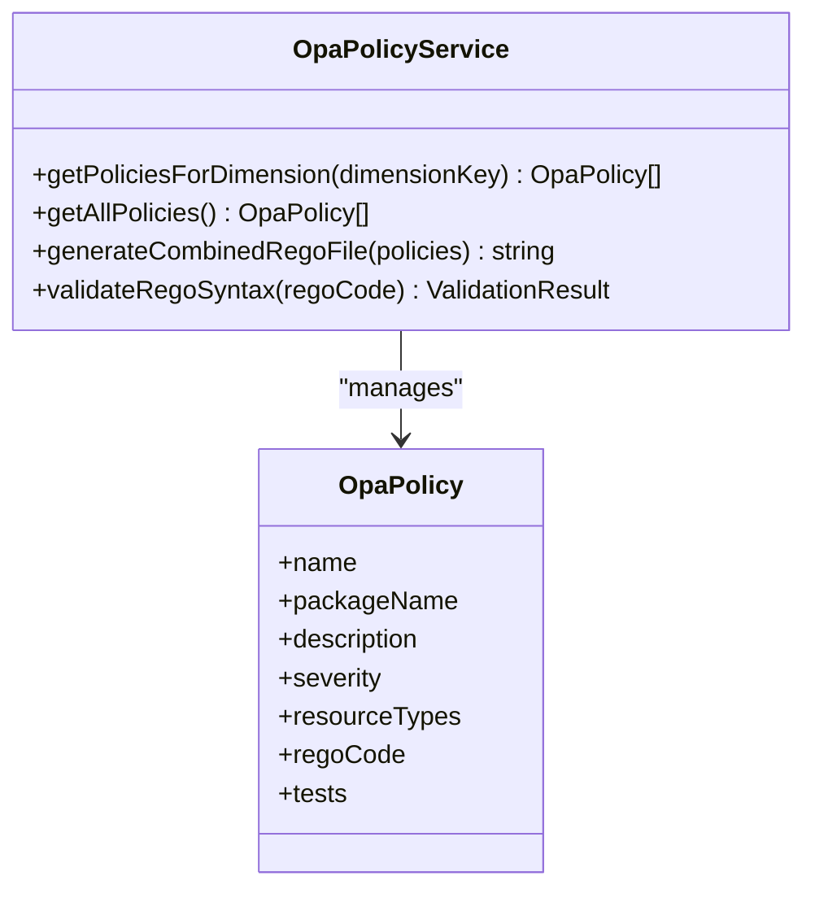
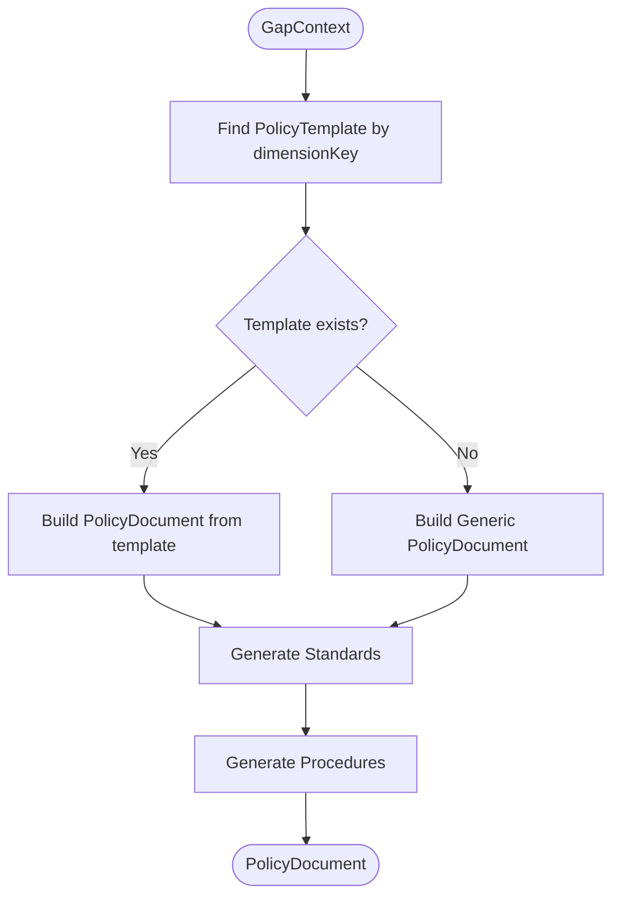
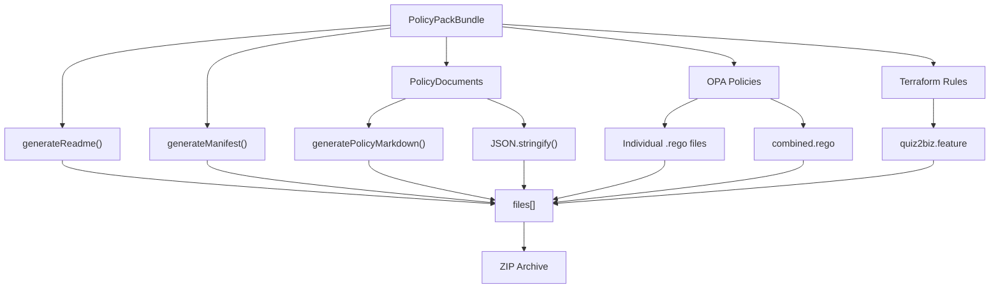
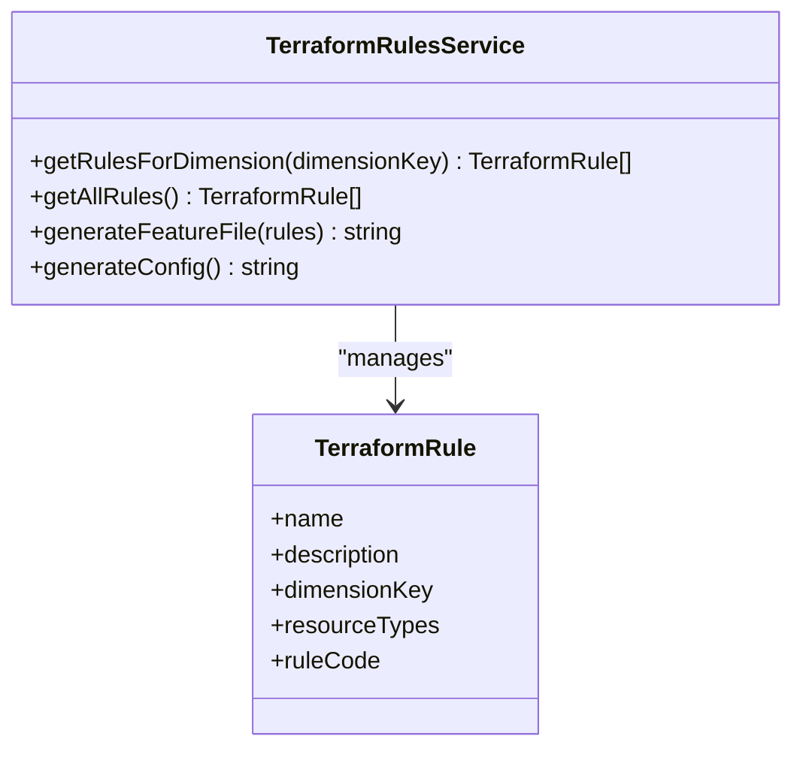
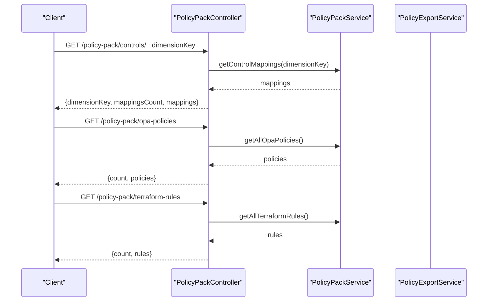
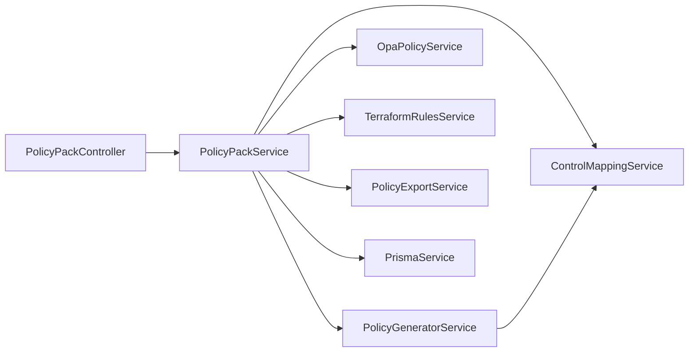

# Policy Pack & Compliance Engine

<cite>
**Referenced Files in This Document**
- [policy-pack.controller.ts](file://apps/api/src/modules/policy-pack/policy-pack.controller.ts)
- [policy-pack.service.ts](file://apps/api/src/modules/policy-pack/policy-pack.service.ts)
- [policy-pack.module.ts](file://apps/api/src/modules/policy-pack/policy-pack.module.ts)
- [control-mapping.service.ts](file://apps/api/src/modules/policy-pack/services/control-mapping.service.ts)
- [policy-generator.service.ts](file://apps/api/src/modules/policy-pack/services/policy-generator.service.ts)
- [opa-policy.service.ts](file://apps/api/src/modules/policy-pack/services/opa-policy.service.ts)
- [policy-export.service.ts](file://apps/api/src/modules/policy-pack/services/policy-export.service.ts)
- [terraform-rules.service.ts](file://apps/api/src/modules/policy-pack/services/terraform-rules.service.ts)
- [index.ts](file://apps/api/src/modules/policy-pack/index.ts)
- [PolicyPackPage.tsx](file://apps/web/src/pages/policy-pack/PolicyPackPage.tsx)
</cite>

## Table of Contents
1. [Introduction](#introduction)
2. [Project Structure](#project-structure)
3. [Core Components](#core-components)
4. [Architecture Overview](#architecture-overview)
5. [Detailed Component Analysis](#detailed-component-analysis)
6. [Dependency Analysis](#dependency-analysis)
7. [Performance Considerations](#performance-considerations)
8. [Troubleshooting Guide](#troubleshooting-guide)
9. [Conclusion](#conclusion)
10. [Appendices](#appendices)

## Introduction
This document describes the Policy Pack & Compliance Engine system that generates compliance-ready policy documents from assessment gaps and aligns them with international frameworks. It covers:
- Control mapping service with regulatory alignment (ISO 27001, NIST CSF, OWASP ASVS)
- OPA (Open Policy Agent) policy service for runtime policy evaluation
- Policy generator service for automated policy creation and compliance rule generation
- Policy pack types and data structures for policy representation and validation
- Frontend policy management interface for visualization and monitoring
- API endpoints for policy CRUD operations, compliance checking, and export
- Governance, versioning, and integration with external compliance systems

## Project Structure
The Policy Pack module is implemented as a NestJS module with a controller, service, and supporting services for generation, mapping, OPA policies, Terraform rules, and export. The frontend provides a dedicated page for policy pack management.

**Diagram sources**
- [policy-pack.module.ts:19-31](file://apps/api/src/modules/policy-pack/policy-pack.module.ts#L19-L31)
- [policy-pack.controller.ts:16-23](file://apps/api/src/modules/policy-pack/policy-pack.controller.ts#L16-L23)
- [policy-pack.service.ts:16-27](file://apps/api/src/modules/policy-pack/policy-pack.service.ts#L16-L27)
- [PolicyPackPage.tsx](file://apps/web/src/pages/policy-pack/PolicyPackPage.tsx)

**Section sources**
- [policy-pack.module.ts:1-33](file://apps/api/src/modules/policy-pack/policy-pack.module.ts#L1-L33)

## Core Components
- PolicyPackController: Exposes REST endpoints for generating, downloading, and querying policy packs and compliance artifacts.
- PolicyPackService: Orchestrates policy generation, OPA and Terraform rule collection, and packaging/export.
- PolicyGeneratorService: Produces Policy → Standard → Procedure documents from readiness gaps with framework-aligned statements.
- ControlMappingService: Maps policies to ISO 27001, NIST CSF, and OWASP ASVS controls.
- OpaPolicyService: Provides OPA/Rego policies for infrastructure validation and combines them into a single file.
- TerraformRulesService: Generates terraform-compliance feature files for infrastructure validation.
- PolicyExportService: Creates ZIP bundles, README, manifests, and Markdown outputs.

**Section sources**
- [policy-pack.controller.ts:1-171](file://apps/api/src/modules/policy-pack/policy-pack.controller.ts#L1-L171)
- [policy-pack.service.ts:1-133](file://apps/api/src/modules/policy-pack/policy-pack.service.ts#L1-L133)
- [policy-generator.service.ts:1-312](file://apps/api/src/modules/policy-pack/services/policy-generator.service.ts#L1-L312)
- [control-mapping.service.ts:1-478](file://apps/api/src/modules/policy-pack/services/control-mapping.service.ts#L1-L478)
- [opa-policy.service.ts:1-245](file://apps/api/src/modules/policy-pack/services/opa-policy.service.ts#L1-L245)
- [terraform-rules.service.ts:1-195](file://apps/api/src/modules/policy-pack/services/terraform-rules.service.ts#L1-L195)
- [policy-export.service.ts:1-273](file://apps/api/src/modules/policy-pack/services/policy-export.service.ts#L1-L273)

## Architecture Overview
The system follows a layered architecture:
- Presentation: PolicyPackController handles HTTP requests and delegates to PolicyPackService.
- Application: PolicyPackService coordinates generation and packaging.
- Domain Services: PolicyGeneratorService, ControlMappingService, OpaPolicyService, TerraformRulesService encapsulate domain logic.
- Export: PolicyExportService formats and packages outputs.

**Diagram sources**
- [policy-pack.controller.ts:28-61](file://apps/api/src/modules/policy-pack/policy-pack.controller.ts#L28-L61)
- [policy-pack.service.ts:32-96](file://apps/api/src/modules/policy-pack/policy-pack.service.ts#L32-L96)
- [policy-generator.service.ts:161-204](file://apps/api/src/modules/policy-pack/services/policy-generator.service.ts#L161-L204)
- [control-mapping.service.ts:429-454](file://apps/api/src/modules/policy-pack/services/control-mapping.service.ts#L429-L454)
- [opa-policy.service.ts:183-185](file://apps/api/src/modules/policy-pack/services/opa-policy.service.ts#L183-L185)
- [terraform-rules.service.ts:147-149](file://apps/api/src/modules/policy-pack/services/terraform-rules.service.ts#L147-L149)
- [policy-export.service.ts:13-87](file://apps/api/src/modules/policy-pack/services/policy-export.service.ts#L13-L87)

## Detailed Component Analysis

### Control Mapping Service
Responsibilities:
- Maintain control catalogs per compliance framework (ISO 27001, NIST CSF, OWASP ASVS).
- Map controls to dimension keys to align policies with standards.
- Provide coverage summaries and filter mappings by framework.

Implementation highlights:
- FrameworkControl entries define control IDs, descriptions, and associated dimension keys.
- getMappingsForDimension returns ControlMapping[] filtered by dimension and optional frameworks.
- getCoverageSummary aggregates counts per framework for a given dimension.

**Diagram sources**
- [control-mapping.service.ts:14-478](file://apps/api/src/modules/policy-pack/services/control-mapping.service.ts#L14-L478)

**Section sources**
- [control-mapping.service.ts:1-478](file://apps/api/src/modules/policy-pack/services/control-mapping.service.ts#L1-L478)

### OPA Policy Service
Responsibilities:
- Store OPA/Rego policy templates organized by dimension.
- Combine multiple OPA policies into a single Rego file for evaluation.
- Validate Rego syntax (basic checks).

Implementation highlights:
- policyTemplates keyed by dimensionKey with OpaPolicy entries containing name, package, description, severity, resourceTypes, and regoCode.
- getPoliciesForDimension returns applicable policies for a dimension.
- generateCombinedRegoFile concatenates policies with headers and separators.
- validateRegoSyntax performs minimal Rego validation.

**Diagram sources**
- [opa-policy.service.ts:9-245](file://apps/api/src/modules/policy-pack/services/opa-policy.service.ts#L9-L245)

**Section sources**
- [opa-policy.service.ts:1-245](file://apps/api/src/modules/policy-pack/services/opa-policy.service.ts#L1-L245)

### Policy Generator Service
Responsibilities:
- Generate Policy → Standard → Procedure documents from GapContext.
- Interpolate templates with gap-specific data.
- Align standards and procedures with control mappings.

Implementation highlights:
- templates array defines PolicyTemplate per dimension with title, objective, scope, statements, standards, and procedures.
- generatePolicyForGap selects template by dimensionKey or falls back to a generic policy.
- generateStandards and generateProcedures construct nested documents.
- interpolate replaces placeholders in templates with GapContext values.

**Diagram sources**
- [policy-generator.service.ts:161-204](file://apps/api/src/modules/policy-pack/services/policy-generator.service.ts#L161-L204)
- [policy-generator.service.ts:209-266](file://apps/api/src/modules/policy-pack/services/policy-generator.service.ts#L209-L266)

**Section sources**
- [policy-generator.service.ts:1-312](file://apps/api/src/modules/policy-pack/services/policy-generator.service.ts#L1-L312)

### Policy Export Service
Responsibilities:
- Generate human-readable README and manifests.
- Produce Markdown and JSON outputs for policies.
- Package all artifacts into a ZIP structure for download.

Implementation highlights:
- generateReadme summarizes bundle contents and provides usage instructions.
- generatePolicyMarkdown renders policy documents with statements, standards, and control mappings.
- generateManifest creates a machine-readable manifest.
- getExportStructure builds file paths and contents for ZIP packaging.

**Diagram sources**
- [policy-export.service.ts:13-87](file://apps/api/src/modules/policy-pack/services/policy-export.service.ts#L13-L87)
- [policy-export.service.ts:218-271](file://apps/api/src/modules/policy-pack/services/policy-export.service.ts#L218-L271)

**Section sources**
- [policy-export.service.ts:1-273](file://apps/api/src/modules/policy-pack/services/policy-export.service.ts#L1-L273)

### Terraform Rules Service
Responsibilities:
- Define terraform-compliance feature rules per dimension.
- Generate combined feature file for compliance testing.

Implementation highlights:
- rules array enumerates TerraformRule entries with name, description, dimensionKey, resourceTypes, and ruleCode.
- getRulesForDimension filters rules by dimension.
- generateFeatureFile concatenates rules with headers.

**Diagram sources**
- [terraform-rules.service.ts:15-195](file://apps/api/src/modules/policy-pack/services/terraform-rules.service.ts#L15-L195)

**Section sources**
- [terraform-rules.service.ts:1-195](file://apps/api/src/modules/policy-pack/services/terraform-rules.service.ts#L1-L195)

### Policy Pack Controller
Responsibilities:
- Provide REST endpoints for policy pack generation, download, and discovery of controls, OPA policies, and Terraform rules.
- Enforce JWT authentication via JwtAuthGuard.

Endpoints:
- POST /policy-pack/generate/:sessionId
- GET /policy-pack/download/:sessionId
- GET /policy-pack/controls/:dimensionKey
- GET /policy-pack/opa-policies
- GET /policy-pack/terraform-rules

**Diagram sources**
- [policy-pack.controller.ts:111-169](file://apps/api/src/modules/policy-pack/policy-pack.controller.ts#L111-L169)

**Section sources**
- [policy-pack.controller.ts:1-171](file://apps/api/src/modules/policy-pack/policy-pack.controller.ts#L1-L171)

### Policy Pack Service
Responsibilities:
- Orchestrate policy generation from gaps.
- Aggregate OPA policies and Terraform rules for covered dimensions.
- Compute score at generation and produce a PolicyPackBundle.

Key behaviors:
- Iterates gaps, generates policies, collects OPA policies, collects Terraform rules, computes score, and builds bundle.
- Delegates export structure generation to PolicyExportService.

**Section sources**
- [policy-pack.service.ts:1-133](file://apps/api/src/modules/policy-pack/policy-pack.service.ts#L1-L133)

## Dependency Analysis
The Policy Pack module composes multiple services and integrates with external systems:
- PolicyPackController depends on PolicyPackService and ContextBuilderService.
- PolicyPackService depends on PrismaService, PolicyGeneratorService, ControlMappingService, OpaPolicyService, TerraformRulesService, and PolicyExportService.
- PolicyGeneratorService depends on ControlMappingService.
- OpaPolicyService and TerraformRulesService are self-contained.
- PolicyExportService depends on PolicyPackBundle types.

**Diagram sources**
- [policy-pack.controller.ts:20-23](file://apps/api/src/modules/policy-pack/policy-pack.controller.ts#L20-L23)
- [policy-pack.service.ts:20-27](file://apps/api/src/modules/policy-pack/policy-pack.service.ts#L20-L27)

**Section sources**
- [policy-pack.module.ts:19-31](file://apps/api/src/modules/policy-pack/policy-pack.module.ts#L19-L31)

## Performance Considerations
- Batch processing: The service iterates gaps sequentially; consider parallelizing policy generation per gap when safe and scalable.
- Export overhead: ZIP generation and file assembly can be memory-intensive; stream outputs where possible.
- OPA/Regent evaluation: Keep Rego policies concise and avoid heavy computation in deny rules.
- Terraform feature file size: Consolidate rules efficiently to minimize parsing overhead.

## Troubleshooting Guide
Common issues and resolutions:
- Missing JWT token: Ensure JwtAuthGuard is applied and clients include Authorization header.
- Empty policy pack: Verify session exists and gaps were computed; check PolicyPackService error logging for per-gap failures.
- OPA syntax errors: Use OpaPolicyService.validateRegoSyntax to detect missing package declarations or missing deny/allow rules.
- Terraform-compliance failures: Confirm terraform-compliance is installed and feature file path matches export structure.

**Section sources**
- [policy-pack.controller.ts:14-16](file://apps/api/src/modules/policy-pack/policy-pack.controller.ts#L14-L16)
- [policy-pack.service.ts:44-48](file://apps/api/src/modules/policy-pack/policy-pack.service.ts#L44-L48)
- [opa-policy.service.ts:225-243](file://apps/api/src/modules/policy-pack/services/opa-policy.service.ts#L225-L243)

## Conclusion
The Policy Pack & Compliance Engine provides a robust, extensible system for transforming readiness gaps into structured, framework-aligned policies and compliance artifacts. It integrates OPA and terraform-compliance for runtime enforcement and offers a comprehensive export pipeline for distribution and governance.

## Appendices

### API Endpoints Summary
- POST /policy-pack/generate/:sessionId
  - Description: Generate policy pack from session gaps.
  - Response: PolicyPack summary (id, name, version, generatedAt, policiesCount, opaPoliciesCount, hasTerraformRules, dimensions, scoreAtGeneration).
- GET /policy-pack/download/:sessionId
  - Description: Download policy pack as ZIP with policies, OPA rules, and Terraform features.
  - Response: application/zip attachment.
- GET /policy-pack/controls/:dimensionKey
  - Description: Get control mappings for a dimension aligned with ISO 27001, NIST CSF, and OWASP ASVS.
  - Response: {dimensionKey, mappingsCount, mappings}.
- GET /policy-pack/opa-policies
  - Description: List available OPA/Rego policies with metadata.
  - Response: {count, policies: [name, description, severity, resourceTypes]}.
- GET /policy-pack/terraform-rules
  - Description: List available terraform-compliance rules with metadata.
  - Response: {count, rules: [name, description, dimensionKey, resourceTypes]}.

**Section sources**
- [policy-pack.controller.ts:28-169](file://apps/api/src/modules/policy-pack/policy-pack.controller.ts#L28-L169)

### Frontend Policy Management Interface
- Page: PolicyPackPage (Web)
  - Purpose: Visualize policy packs, compliance dashboards, and enforcement monitoring.
  - Integration: Consumes API endpoints exposed by PolicyPackController.

**Section sources**
- [PolicyPackPage.tsx](file://apps/web/src/pages/policy-pack/PolicyPackPage.tsx)

### Policy Pack Types and Data Structures
- PolicyDocument: Policy entity with title, type, statements, standards, controlMappings, effective/review dates, owner, status, tags, and source session.
- StandardDocument: Technical standard derived from a policy with requirements and procedures.
- ProcedureDocument: Step-by-step operating procedures linked to standards.
- OpaPolicy: Rego policy with name, package, description, severity, resourceTypes, regoCode, and tests.
- TerraformRule: Feature rule with name, description, dimensionKey, resourceTypes, and ruleCode.
- PolicyPackBundle: Aggregated output including policies, OPA policies, Terraform rules, README, manifest, and metadata.

Note: These types are exported via the module index and used across services for serialization and packaging.

**Section sources**
- [index.ts:1-6](file://apps/api/src/modules/policy-pack/index.ts#L1-L6)

### Governance, Versioning, and External Integrations
- Versioning: PolicyDocument, StandardDocument, ProcedureDocument, and PolicyPackBundle include version fields; maintain semantic versioning for policy updates.
- Governance: Policies carry status (e.g., DRAFT), owner, effective/review dates, and tags for lifecycle management.
- External integrations:
  - OPA: Rego evaluation via opa eval with combined data.
  - terraform-compliance: Feature files for infrastructure validation.
  - Export: ZIP bundles with README and manifests for distribution.

**Section sources**
- [policy-pack.service.ts:75-95](file://apps/api/src/modules/policy-pack/policy-pack.service.ts#L75-L95)
- [policy-export.service.ts:218-271](file://apps/api/src/modules/policy-pack/services/policy-export.service.ts#L218-L271)
- [opa-policy.service.ts:201-220](file://apps/api/src/modules/policy-pack/services/opa-policy.service.ts#L201-L220)
- [terraform-rules.service.ts:161-178](file://apps/api/src/modules/policy-pack/services/terraform-rules.service.ts#L161-L178)