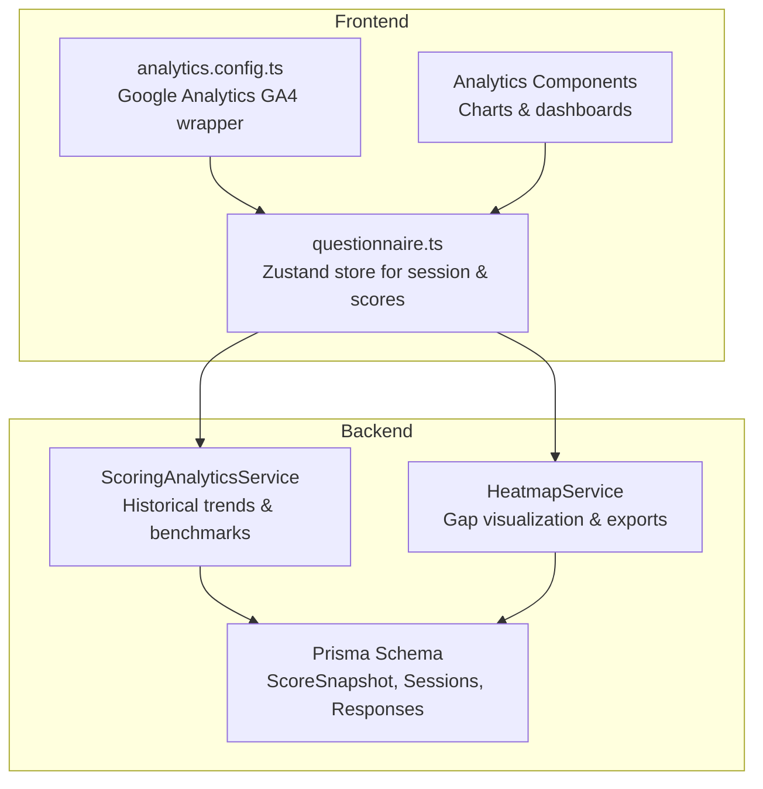
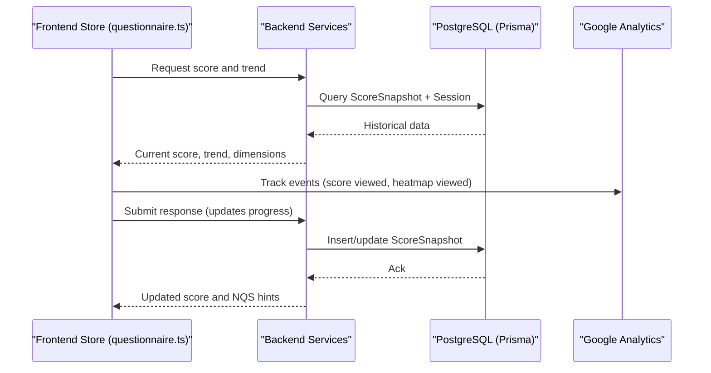
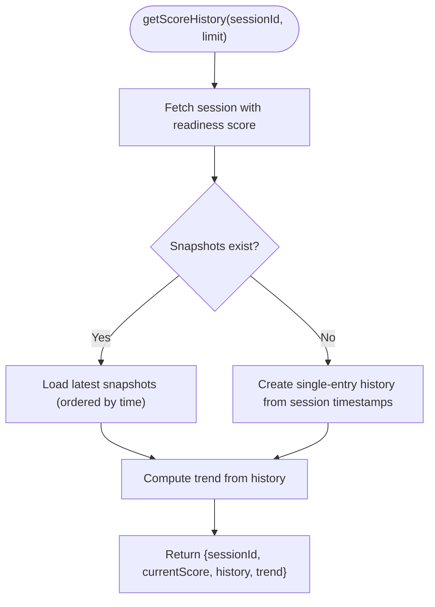
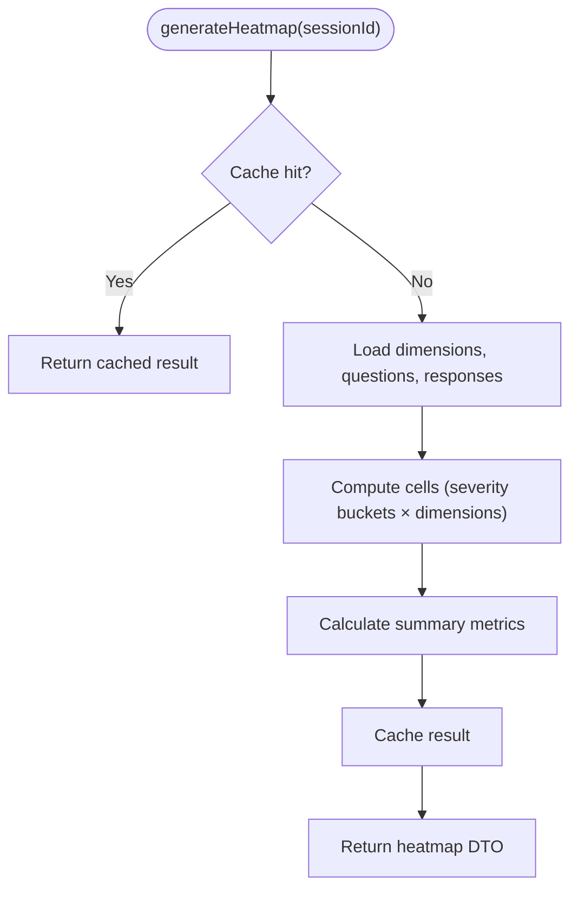
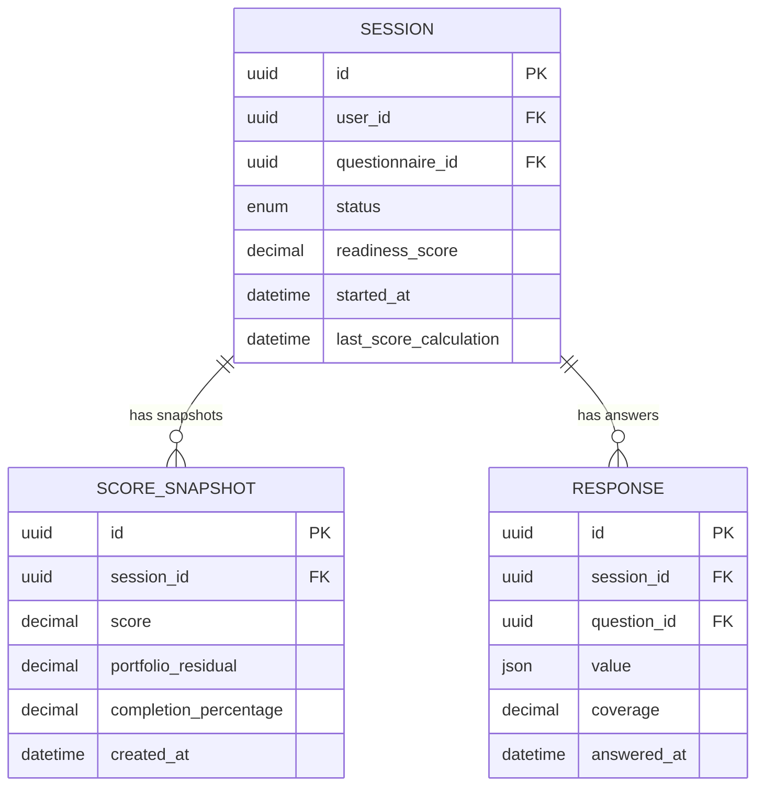
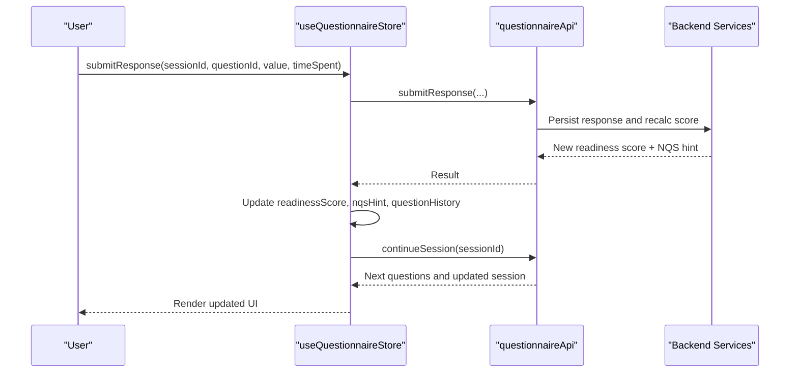
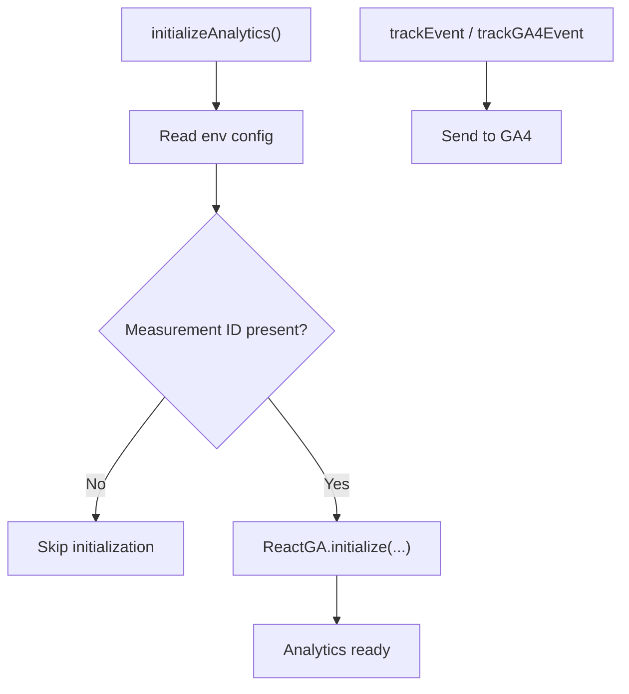
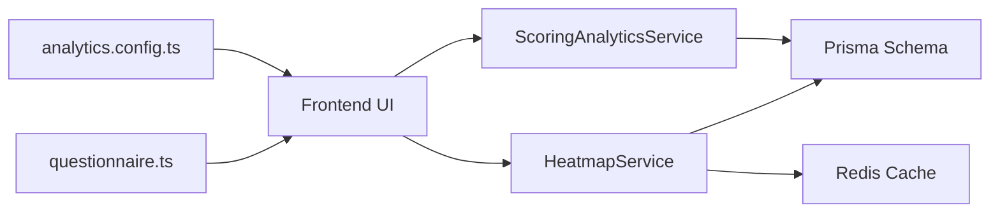

# Analytics & Historical Tracking

<cite>
**Referenced Files in This Document**
- [scoring-analytics.ts](file://apps/api/src/modules/scoring-engine/strategies/scoring-analytics.ts)
- [heatmap.service.ts](file://apps/api/src/modules/heatmap/heatmap.service.ts)
- [schema.prisma](file://prisma/schema.prisma)
- [analytics.config.ts](file://apps/web/src/config/analytics.config.ts)
- [questionnaire.ts](file://apps/web/src/stores/questionnaire.ts)
- [index.ts](file://apps/web/src/components/analytics/index.ts)
</cite>

## Table of Contents
1. [Introduction](#introduction)
2. [Project Structure](#project-structure)
3. [Core Components](#core-components)
4. [Architecture Overview](#architecture-overview)
5. [Detailed Component Analysis](#detailed-component-analysis)
6. [Dependency Analysis](#dependency-analysis)
7. [Performance Considerations](#performance-considerations)
8. [Troubleshooting Guide](#troubleshooting-guide)
9. [Conclusion](#conclusion)

## Introduction
This document explains the analytics and historical tracking capabilities across the backend and frontend systems. It covers:
- Backend scoring analytics: historical data collection, trend analysis, and benchmarking
- Data persistence and query optimization for analytics
- Frontend analytics store management and real-time score updates
- Draft autosave and session tracking mechanisms
- Analytics dashboard components, filtering, and export capabilities
- Data retention and performance optimization for large datasets
- Integration with external analytics platforms

## Project Structure
The analytics and historical tracking span three primary areas:
- Backend scoring engine and analytics service
- Database schema supporting historical snapshots and benchmarks
- Frontend analytics configuration and state management

**Diagram sources**
- [scoring-analytics.ts:17-268](file://apps/api/src/modules/scoring-engine/strategies/scoring-analytics.ts#L17-L268)
- [heatmap.service.ts:43-851](file://apps/api/src/modules/heatmap/heatmap.service.ts#L43-L851)
- [schema.prisma:562-577](file://prisma/schema.prisma#L562-L577)
- [analytics.config.ts:1-567](file://apps/web/src/config/analytics.config.ts#L1-L567)
- [questionnaire.ts:1-357](file://apps/web/src/stores/questionnaire.ts#L1-L357)
- [index.ts:1-10](file://apps/web/src/components/analytics/index.ts#L1-L10)

**Section sources**
- [scoring-analytics.ts:17-268](file://apps/api/src/modules/scoring-engine/strategies/scoring-analytics.ts#L17-L268)
- [heatmap.service.ts:43-851](file://apps/api/src/modules/heatmap/heatmap.service.ts#L43-L851)
- [schema.prisma:562-577](file://prisma/schema.prisma#L562-L577)
- [analytics.config.ts:1-567](file://apps/web/src/config/analytics.config.ts#L1-L567)
- [questionnaire.ts:1-357](file://apps/web/src/stores/questionnaire.ts#L1-L357)
- [index.ts:1-10](file://apps/web/src/components/analytics/index.ts#L1-L10)

## Core Components
- ScoringAnalyticsService: Computes historical score trends, industry benchmarks, and dimension-level benchmarks for comparative reporting.
- HeatmapService: Generates readiness gap heatmaps, supports filtering, drilldown, and export formats (CSV, Markdown, JSON).
- Prisma Schema: Defines ScoreSnapshot and related entities enabling historical tracking and trend analysis.
- analytics.config.ts: Wraps Google Analytics GA4 for page views, custom events, user identity, and conversions.
- questionnaire.ts: Frontend Zustand store managing session state, readiness score, dimension breakdowns, and navigation history.

**Section sources**
- [scoring-analytics.ts:17-268](file://apps/api/src/modules/scoring-engine/strategies/scoring-analytics.ts#L17-L268)
- [heatmap.service.ts:43-851](file://apps/api/src/modules/heatmap/heatmap.service.ts#L43-L851)
- [schema.prisma:562-577](file://prisma/schema.prisma#L562-L577)
- [analytics.config.ts:1-567](file://apps/web/src/config/analytics.config.ts#L1-L567)
- [questionnaire.ts:1-357](file://apps/web/src/stores/questionnaire.ts#L1-L357)

## Architecture Overview
The backend services persist and compute analytics, while the frontend integrates with both internal analytics and external GA4. The store synchronizes real-time score updates and maintains session progress.

**Diagram sources**
- [questionnaire.ts:252-264](file://apps/web/src/stores/questionnaire.ts#L252-L264)
- [scoring-analytics.ts:24-67](file://apps/api/src/modules/scoring-engine/strategies/scoring-analytics.ts#L24-L67)
- [schema.prisma:562-577](file://prisma/schema.prisma#L562-L577)
- [analytics.config.ts:260-278](file://apps/web/src/config/analytics.config.ts#L260-L278)

## Detailed Component Analysis

### Backend Scoring Analytics Service
Responsibilities:
- Historical score retrieval and trend computation
- Industry benchmarking with percentile ranking
- Dimension-level residual benchmarking and recommendations

Key behaviors:
- getScoreHistory: Loads recent snapshots and computes trend; falls back to session timestamps if no snapshots exist.
- getIndustryBenchmark: Aggregates industry statistics and calculates percentile rank and performance category.
- getDimensionBenchmarks: Computes dimension residual averages and gap metrics for comparative insights.

**Diagram sources**
- [scoring-analytics.ts:24-67](file://apps/api/src/modules/scoring-engine/strategies/scoring-analytics.ts#L24-L67)

**Section sources**
- [scoring-analytics.ts:17-268](file://apps/api/src/modules/scoring-engine/strategies/scoring-analytics.ts#L17-L268)
- [schema.prisma:562-577](file://prisma/schema.prisma#L562-L577)

### Heatmap Service (Gap Visualization and Exports)
Responsibilities:
- Generate dimension × severity matrix for readiness gaps
- Provide filtering, drilldown, and export to CSV/Markdown/JSON
- Offer priority gaps and action plans for remediation
- Cache results for performance

Key behaviors:
- generateHeatmap: Loads dimensions, questions, and responses; computes cells and summary; caches results.
- exportToCsv/exportToMarkdown/exportToVisualizationFormat: Formats data for downstream consumption.
- compareHeatmaps: Compares two sessions to show improvement/degradation.
- getPriorityGaps/generateActionPlan: Ranks gaps by impact and proposes phased remediation.

**Diagram sources**
- [heatmap.service.ts:56-91](file://apps/api/src/modules/heatmap/heatmap.service.ts#L56-L91)

**Section sources**
- [heatmap.service.ts:43-851](file://apps/api/src/modules/heatmap/heatmap.service.ts#L43-L851)

### Database Schema for Historical Tracking
Entities and indexes supporting analytics:
- ScoreSnapshot: Stores periodic readiness score, portfolio residual, completion percentage, and creation timestamp.
- Session: Tracks started/completed/expired status and readiness score timestamps.
- Response: Captures answers, coverage, and timestamps for trend and benchmark computations.

**Diagram sources**
- [schema.prisma:512-577](file://prisma/schema.prisma#L512-L577)

**Section sources**
- [schema.prisma:512-577](file://prisma/schema.prisma#L512-L577)

### Frontend Analytics Store and Real-Time Updates
The questionnaire store manages:
- Session lifecycle: create, continue, complete
- Scoring: readiness score, dimension breakdowns, trend
- Navigation history for review and skip
- Real-time updates: after submitting responses, the store refreshes session state and score

**Diagram sources**
- [questionnaire.ts:175-233](file://apps/web/src/stores/questionnaire.ts#L175-L233)

**Section sources**
- [questionnaire.ts:1-357](file://apps/web/src/stores/questionnaire.ts#L1-L357)

### Frontend Analytics Configuration (GA4)
The analytics configuration module:
- Initializes GA4 with measurement ID and options
- Tracks page views, custom events, user identity, and conversions
- Provides helpers for timing, exceptions, and consent management

**Diagram sources**
- [analytics.config.ts:44-73](file://apps/web/src/config/analytics.config.ts#L44-L73)

**Section sources**
- [analytics.config.ts:1-567](file://apps/web/src/config/analytics.config.ts#L1-L567)

### Analytics Dashboard Components and Filtering
The analytics barrel export exposes:
- CompletionRateChart
- UserGrowthChart
- RetentionChart and mock data generator
- DropOffFunnelChart and mock data generator

These components integrate with the frontend store to render charts and support filtering by dimensions and severity buckets.

**Section sources**
- [index.ts:1-10](file://apps/web/src/components/analytics/index.ts#L1-L10)

## Dependency Analysis
- Backend depends on Prisma for data access and Redis for caching (in heatmap service).
- Frontend store depends on backend APIs for session and scoring operations.
- External analytics platform (GA4) is integrated via a thin wrapper.

**Diagram sources**
- [analytics.config.ts:1-567](file://apps/web/src/config/analytics.config.ts#L1-L567)
- [questionnaire.ts:1-357](file://apps/web/src/stores/questionnaire.ts#L1-L357)
- [scoring-analytics.ts:17-268](file://apps/api/src/modules/scoring-engine/strategies/scoring-analytics.ts#L17-L268)
- [heatmap.service.ts:43-851](file://apps/api/src/modules/heatmap/heatmap.service.ts#L43-L851)
- [schema.prisma:562-577](file://prisma/schema.prisma#L562-L577)

**Section sources**
- [scoring-analytics.ts:17-268](file://apps/api/src/modules/scoring-engine/strategies/scoring-analytics.ts#L17-L268)
- [heatmap.service.ts:43-851](file://apps/api/src/modules/heatmap/heatmap.service.ts#L43-L851)
- [schema.prisma:562-577](file://prisma/schema.prisma#L562-L577)
- [analytics.config.ts:1-567](file://apps/web/src/config/analytics.config.ts#L1-L567)
- [questionnaire.ts:1-357](file://apps/web/src/stores/questionnaire.ts#L1-L357)

## Performance Considerations
- Backend
  - Use database indexes on frequently queried fields (e.g., session status, timestamps).
  - Cache heatmap results in Redis to avoid recomputation for repeated requests.
  - Limit result sets (take/limit) for historical queries to control payload sizes.
- Frontend
  - Debounce or throttle analytics event emissions.
  - Batch store updates after bulk operations (e.g., completing a session).
- Large datasets
  - Paginate historical analytics queries and apply time-range filters.
  - Precompute aggregates where feasible and expose summary endpoints.

[No sources needed since this section provides general guidance]

## Troubleshooting Guide
- Historical trends show unexpected flat lines
  - Verify ScoreSnapshot entries are being created during score recalculations.
  - Confirm session timestamps (started_at, last_score_calculation) are populated.
- Industry benchmark returns zeros
  - Ensure completed sessions with readiness scores exist and questionnaire metadata includes industry.
  - Check percentile rank calculation and fallback values.
- Heatmap cache not updating
  - Invalidate cache after scoring changes or session updates.
  - Confirm Redis connectivity and TTL settings.
- GA4 events not recorded
  - Verify measurement ID is configured and initialization succeeds.
  - Check consent settings and opt-out flags.

**Section sources**
- [scoring-analytics.ts:24-67](file://apps/api/src/modules/scoring-engine/strategies/scoring-analytics.ts#L24-L67)
- [heatmap.service.ts:299-304](file://apps/api/src/modules/heatmap/heatmap.service.ts#L299-L304)
- [analytics.config.ts:44-73](file://apps/web/src/config/analytics.config.ts#L44-L73)

## Conclusion
The system combines robust backend analytics (historical trends, benchmarks, and gap heatmaps) with a reactive frontend store and GA4 integration. Historical data is persisted via ScoreSnapshot and indexed for efficient querying. Performance is optimized through caching and pagination, while the frontend ensures real-time updates and user-friendly analytics experiences.