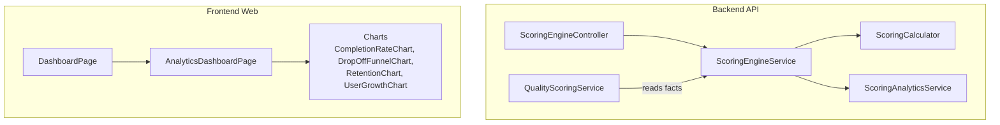
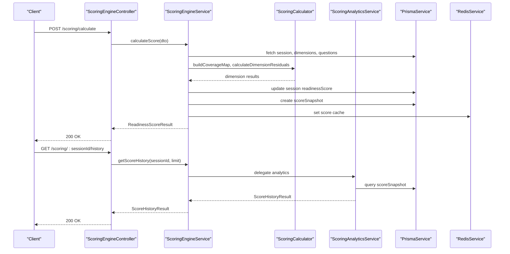
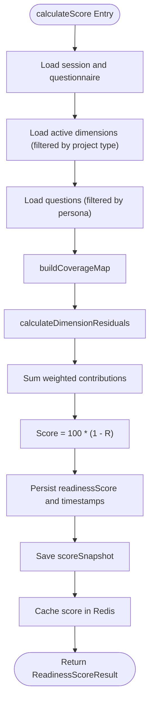
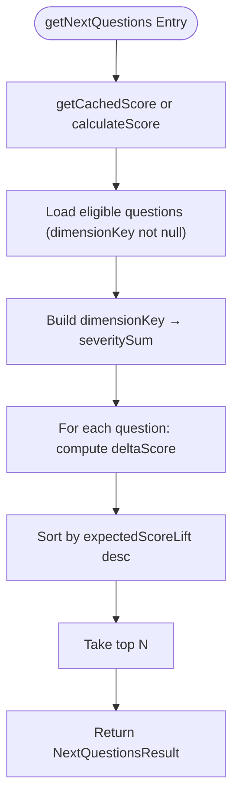
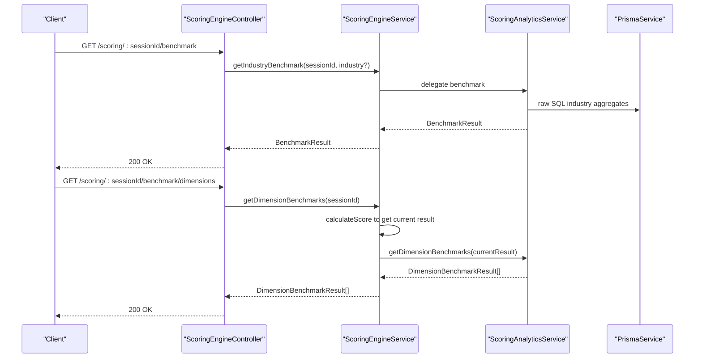
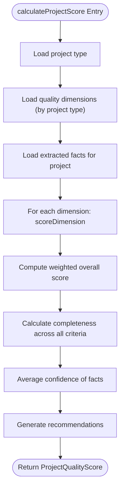
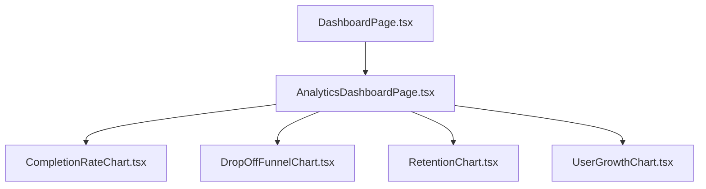
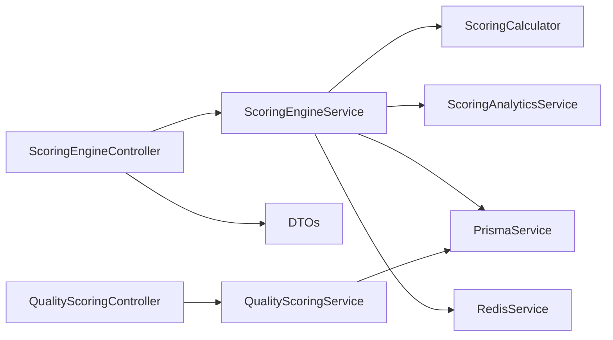

# Intelligent Scoring Engine

<cite>
**Referenced Files in This Document**
- [scoring-engine.controller.ts](file://apps/api/src/modules/scoring-engine/scoring-engine.controller.ts)
- [scoring-engine.service.ts](file://apps/api/src/modules/scoring-engine/scoring-engine.service.ts)
- [scoring-calculator.ts](file://apps/api/src/modules/scoring-engine/scoring-calculator.ts)
- [scoring-types.ts](file://apps/api/src/modules/scoring-engine/scoring-types.ts)
- [scoring-analytics.ts](file://apps/api/src/modules/scoring-engine/strategies/scoring-analytics.ts)
- [quality-scoring.service.ts](file://apps/api/src/modules/quality-scoring/services/quality-scoring.service.ts)
- [quality-scoring.dto.ts](file://apps/api/src/modules/quality-scoring/dto/quality-scoring.dto.ts)
- [quality-dimensions.seed.ts](file://prisma/seeds/quality-dimensions.seed.ts)
- [DashboardPage.tsx](file://apps/web/src/pages/dashboard/DashboardPage.tsx)
- [AnalyticsDashboardPage.tsx](file://apps/web/src/pages/analytics/AnalyticsDashboardPage.tsx)
- [CompletionRateChart.tsx](file://apps/web/src/components/analytics/CompletionRateChart.tsx)
- [DropOffFunnelChart.tsx](file://apps/web/src/components/analytics/DropOffFunnelChart.tsx)
- [RetentionChart.tsx](file://apps/web/src/components/analytics/RetentionChart.tsx)
- [UserGrowthChart.tsx](file://apps/web/src/components/analytics/UserGrowthChart.tsx)
</cite>

## Table of Contents
1. [Introduction](#introduction)
2. [Project Structure](#project-structure)
3. [Core Components](#core-components)
4. [Architecture Overview](#architecture-overview)
5. [Detailed Component Analysis](#detailed-component-analysis)
6. [Dependency Analysis](#dependency-analysis)
7. [Performance Considerations](#performance-considerations)
8. [Troubleshooting Guide](#troubleshooting-guide)
9. [Conclusion](#conclusion)
10. [Appendices](#appendices)

## Introduction
This document describes the Intelligent Scoring Engine that powers two complementary scoring systems:
- Quiz2Biz readiness scoring for questionnaire sessions
- Quality scoring for document generation projects

It covers scoring algorithms, weight distribution, real-time visualization, analytics and benchmarking, validation rules, and integration points with the frontend dashboard and backend APIs.

## Project Structure
The scoring engine spans backend NestJS modules and frontend React components:
- Backend scoring engine: controllers, services, calculators, analytics strategies, and DTOs
- Quality scoring: dedicated module for project quality evaluation against benchmark criteria
- Frontend dashboard: analytics charts and progress visualization

**Diagram sources**
- [scoring-engine.controller.ts:46-268](file://apps/api/src/modules/scoring-engine/scoring-engine.controller.ts#L46-L268)
- [scoring-engine.service.ts:54-387](file://apps/api/src/modules/scoring-engine/scoring-engine.service.ts#L54-L387)
- [scoring-calculator.ts:1-208](file://apps/api/src/modules/scoring-engine/scoring-calculator.ts#L1-L208)
- [scoring-analytics.ts:17-268](file://apps/api/src/modules/scoring-engine/strategies/scoring-analytics.ts#L17-L268)
- [quality-scoring.service.ts:27-339](file://apps/api/src/modules/quality-scoring/services/quality-scoring.service.ts#L27-L339)
- [DashboardPage.tsx](file://apps/web/src/pages/dashboard/DashboardPage.tsx)
- [AnalyticsDashboardPage.tsx](file://apps/web/src/pages/analytics/AnalyticsDashboardPage.tsx)
- [CompletionRateChart.tsx](file://apps/web/src/components/analytics/CompletionRateChart.tsx)
- [DropOffFunnelChart.tsx](file://apps/web/src/components/analytics/DropOffFunnelChart.tsx)
- [RetentionChart.tsx](file://apps/web/src/components/analytics/RetentionChart.tsx)
- [UserGrowthChart.tsx](file://apps/web/src/components/analytics/UserGrowthChart.tsx)

**Section sources**
- [scoring-engine.controller.ts:46-268](file://apps/api/src/modules/scoring-engine/scoring-engine.controller.ts#L46-L268)
- [scoring-engine.service.ts:54-387](file://apps/api/src/modules/scoring-engine/scoring-engine.service.ts#L54-L387)
- [quality-scoring.service.ts:27-339](file://apps/api/src/modules/quality-scoring/services/quality-scoring.service.ts#L27-L339)

## Core Components
- ScoringEngineController: Exposes REST endpoints for readiness scoring, next questions, caching, history, and benchmarks.
- ScoringEngineService: Orchestrates scoring, caches results, persists snapshots, and delegates analytics.
- ScoringCalculator: Pure calculation helpers for coverage mapping, dimension residuals, trend analysis, and rationale generation.
- ScoringAnalyticsService: Benchmarks, percentiles, dimension comparisons, and trend computation from historical snapshots.
- QualityScoringService: Evaluates project facts against quality dimensions and benchmark criteria to compute quality scores and recommendations.
- Frontend Dashboard: Renders analytics charts and progress dashboards for real-time insights.

**Section sources**
- [scoring-engine.controller.ts:49-266](file://apps/api/src/modules/scoring-engine/scoring-engine.controller.ts#L49-L266)
- [scoring-engine.service.ts:66-386](file://apps/api/src/modules/scoring-engine/scoring-engine.service.ts#L66-L386)
- [scoring-calculator.ts:20-208](file://apps/api/src/modules/scoring-engine/scoring-calculator.ts#L20-L208)
- [scoring-analytics.ts:17-268](file://apps/api/src/modules/scoring-engine/strategies/scoring-analytics.ts#L17-L268)
- [quality-scoring.service.ts:33-339](file://apps/api/src/modules/quality-scoring/services/quality-scoring.service.ts#L33-L339)

## Architecture Overview
The system separates concerns across calculation, persistence, caching, and analytics while exposing clean REST endpoints.

**Diagram sources**
- [scoring-engine.controller.ts:55-190](file://apps/api/src/modules/scoring-engine/scoring-engine.controller.ts#L55-L190)
- [scoring-engine.service.ts:70-164](file://apps/api/src/modules/scoring-engine/scoring-engine.service.ts#L70-L164)
- [scoring-calculator.ts:24-130](file://apps/api/src/modules/scoring-engine/scoring-calculator.ts#L24-L130)
- [scoring-analytics.ts:24-67](file://apps/api/src/modules/scoring-engine/strategies/scoring-analytics.ts#L24-L67)

## Detailed Component Analysis

### Quiz2Biz Readiness Scoring Engine
Implements risk-weighted readiness scoring with explicit formulas:
- Coverage per question: C_i ∈ [0,1]
- Dimension residual risk: R_d = Σ(S_i × (1 - C_i)) / (Σ S_i + ε)
- Portfolio residual: R = Σ(W_d × R_d)
- Readiness Score: Score = 100 × (1 - R)

**Diagram sources**
- [scoring-engine.service.ts:70-164](file://apps/api/src/modules/scoring-engine/scoring-engine.service.ts#L70-L164)
- [scoring-calculator.ts:24-130](file://apps/api/src/modules/scoring-engine/scoring-calculator.ts#L24-L130)

**Section sources**
- [scoring-engine.controller.ts:49-82](file://apps/api/src/modules/scoring-engine/scoring-engine.controller.ts#L49-L82)
- [scoring-engine.service.ts:66-164](file://apps/api/src/modules/scoring-engine/scoring-engine.service.ts#L66-L164)
- [scoring-calculator.ts:67-130](file://apps/api/src/modules/scoring-engine/scoring-calculator.ts#L67-L130)
- [scoring-types.ts:8-52](file://apps/api/src/modules/scoring-engine/scoring-types.ts#L8-L52)

### Next Questions (NQS) Algorithm
Prioritizes questions by expected score improvement:
ΔScore_i = 100 × W_d(i) × S_i × (1 - C_i) / (Σ S_j + ε)

**Diagram sources**
- [scoring-engine.service.ts:170-227](file://apps/api/src/modules/scoring-engine/scoring-engine.service.ts#L170-L227)
- [scoring-calculator.ts:133-147](file://apps/api/src/modules/scoring-engine/scoring-calculator.ts#L133-L147)

**Section sources**
- [scoring-engine.controller.ts:84-110](file://apps/api/src/modules/scoring-engine/scoring-engine.controller.ts#L84-L110)
- [scoring-engine.service.ts:170-227](file://apps/api/src/modules/scoring-engine/scoring-engine.service.ts#L170-L227)

### Real-Time Scoring Visualization and Analytics
- Score history and trend: stored as snapshots and analyzed for direction, volatility, and projection.
- Industry benchmarking: percentile ranks, categories, and gap analysis against industry averages.
- Dimension benchmarks: residual risk comparison and recommendations.

**Diagram sources**
- [scoring-engine.controller.ts:192-266](file://apps/api/src/modules/scoring-engine/scoring-engine.controller.ts#L192-L266)
- [scoring-engine.service.ts:326-339](file://apps/api/src/modules/scoring-engine/scoring-engine.service.ts#L326-L339)
- [scoring-analytics.ts:73-240](file://apps/api/src/modules/scoring-engine/strategies/scoring-analytics.ts#L73-L240)

**Section sources**
- [scoring-analytics.ts:24-67](file://apps/api/src/modules/scoring-engine/strategies/scoring-analytics.ts#L24-L67)
- [scoring-analytics.ts:73-165](file://apps/api/src/modules/scoring-engine/strategies/scoring-analytics.ts#L73-L165)
- [scoring-analytics.ts:171-240](file://apps/api/src/modules/scoring-engine/strategies/scoring-analytics.ts#L171-L240)

### Quality Scoring Engine
Computes quality scores for project documents using standards-based dimensions and benchmark criteria.

**Diagram sources**
- [quality-scoring.service.ts:36-94](file://apps/api/src/modules/quality-scoring/services/quality-scoring.service.ts#L36-L94)
- [quality-scoring.service.ts:99-151](file://apps/api/src/modules/quality-scoring/services/quality-scoring.service.ts#L99-L151)
- [quality-dimensions.seed.ts:361-422](file://prisma/seeds/quality-dimensions.seed.ts#L361-L422)

**Section sources**
- [quality-scoring.service.ts:33-339](file://apps/api/src/modules/quality-scoring/services/quality-scoring.service.ts#L33-L339)
- [quality-scoring.dto.ts:9-100](file://apps/api/src/modules/quality-scoring/dto/quality-scoring.dto.ts#L9-L100)
- [quality-dimensions.seed.ts:14-433](file://prisma/seeds/quality-dimensions.seed.ts#L14-L433)

### Frontend Dashboard Components
The web application provides:
- Dashboard page for session progress and readiness
- Analytics dashboard with specialized charts for completion rate, drop-off funnel, retention, and user growth

**Diagram sources**
- [DashboardPage.tsx](file://apps/web/src/pages/dashboard/DashboardPage.tsx)
- [AnalyticsDashboardPage.tsx](file://apps/web/src/pages/analytics/AnalyticsDashboardPage.tsx)
- [CompletionRateChart.tsx](file://apps/web/src/components/analytics/CompletionRateChart.tsx)
- [DropOffFunnelChart.tsx](file://apps/web/src/components/analytics/DropOffFunnelChart.tsx)
- [RetentionChart.tsx](file://apps/web/src/components/analytics/RetentionChart.tsx)
- [UserGrowthChart.tsx](file://apps/web/src/components/analytics/UserGrowthChart.tsx)

**Section sources**
- [DashboardPage.tsx](file://apps/web/src/pages/dashboard/DashboardPage.tsx)
- [AnalyticsDashboardPage.tsx](file://apps/web/src/pages/analytics/AnalyticsDashboardPage.tsx)
- [CompletionRateChart.tsx](file://apps/web/src/components/analytics/CompletionRateChart.tsx)
- [DropOffFunnelChart.tsx](file://apps/web/src/components/analytics/DropOffFunnelChart.tsx)
- [RetentionChart.tsx](file://apps/web/src/components/analytics/RetentionChart.tsx)
- [UserGrowthChart.tsx](file://apps/web/src/components/analytics/UserGrowthChart.tsx)

## Dependency Analysis
The scoring engine relies on:
- Prisma for data access and raw SQL analytics
- Redis for caching
- Swagger for API documentation
- DTOs for input/output validation

**Diagram sources**
- [scoring-engine.controller.ts:25-46](file://apps/api/src/modules/scoring-engine/scoring-engine.controller.ts#L25-L46)
- [scoring-engine.service.ts:59-64](file://apps/api/src/modules/scoring-engine/scoring-engine.service.ts#L59-L64)
- [scoring-calculator.ts:5-15](file://apps/api/src/modules/scoring-engine/scoring-calculator.ts#L5-L15)
- [scoring-analytics.ts:17-18](file://apps/api/src/modules/scoring-engine/strategies/scoring-analytics.ts#L17-L18)
- [quality-scoring.service.ts:31](file://apps/api/src/modules/quality-scoring/services/quality-scoring.service.ts#L31)

**Section sources**
- [scoring-engine.controller.ts:25-46](file://apps/api/src/modules/scoring-engine/scoring-engine.controller.ts#L25-L46)
- [scoring-engine.service.ts:59-64](file://apps/api/src/modules/scoring-engine/scoring-engine.service.ts#L59-L64)
- [quality-scoring.service.ts:31](file://apps/api/src/modules/quality-scoring/services/quality-scoring.service.ts#L31)

## Performance Considerations
- Caching: Scores are cached in Redis with a TTL to reduce repeated calculations.
- Batch processing: Service supports batch calculation with controlled concurrency.
- Epsilon: Small constant prevents division by zero in residual and NQS calculations.
- Indexing: Queries filter by session, questionnaire, and persona to minimize dataset size.
- Trend analysis: Efficiently computed from historical snapshots.

**Section sources**
- [scoring-engine.service.ts:343-385](file://apps/api/src/modules/scoring-engine/scoring-engine.service.ts#L343-L385)
- [scoring-engine.service.ts:300-324](file://apps/api/src/modules/scoring-engine/scoring-engine.service.ts#L300-L324)
- [scoring-types.ts:8-15](file://apps/api/src/modules/scoring-engine/scoring-types.ts#L8-L15)
- [scoring-calculator.ts:149-187](file://apps/api/src/modules/scoring-engine/scoring-calculator.ts#L149-L187)

## Troubleshooting Guide
Common issues and resolutions:
- Session not found: Controllers and analytics throw/not found errors when sessions are missing; verify session IDs and lifecycle.
- Cache invalidation failures: Service logs warnings when cache deletion fails; check Redis connectivity.
- Persistence errors: Snapshot creation errors are logged; inspect database connection and permissions.
- DTO validation errors: Quality scoring DTOs enforce array and nested validations; ensure payload structure matches DTOs.

**Section sources**
- [scoring-engine.controller.ts:79, 130, 223:79-79](file://apps/api/src/modules/scoring-engine/scoring-engine.controller.ts#L79-L79)
- [scoring-engine.service.ts:290-298](file://apps/api/src/modules/scoring-engine/scoring-engine.service.ts#L290-L298)
- [scoring-engine.service.ts:365-385](file://apps/api/src/modules/scoring-engine/scoring-engine.service.ts#L365-L385)
- [quality-scoring.dto.ts:9-100](file://apps/api/src/modules/quality-scoring/dto/quality-scoring.dto.ts#L9-L100)

## Conclusion
The Intelligent Scoring Engine provides robust, standards-aligned scoring for readiness and quality. It balances accuracy with performance through caching, batch processing, and efficient analytics. The frontend dashboards enable real-time progress tracking, gap analysis, and trend reporting, while the backend APIs support scalable integration and extensibility.

## Appendices

### Scoring Rule Configuration and Weight Distribution
- Readiness scoring: Dimensions are weighted and residual risk aggregated to compute portfolio risk and readiness score.
- Quality scoring: Dimensions are defined per project type with benchmark criteria; weights are validated during seeding to sum to 1.0 per project type.

**Section sources**
- [scoring-engine.service.ts:112-116](file://apps/api/src/modules/scoring-engine/scoring-engine.service.ts#L112-L116)
- [quality-dimensions.seed.ts:377-382](file://prisma/seeds/quality-dimensions.seed.ts#L377-L382)

### Validation Rules and Consistency Checks
- Coverage levels: Discrete coverage levels mapped to decimals; overrides convert to nearest level.
- Epsilon: Prevents numerical instability in residual and NQS computations.
- DTO validation: Quality scoring DTOs validate arrays and nested structures.

**Section sources**
- [scoring-types.ts:21-52](file://apps/api/src/modules/scoring-engine/scoring-types.ts#L21-L52)
- [scoring-types.ts:8-12](file://apps/api/src/modules/scoring-engine/scoring-types.ts#L8-L12)
- [quality-scoring.dto.ts:9-100](file://apps/api/src/modules/quality-scoring/dto/quality-scoring.dto.ts#L9-L100)

### Backend Scoring Calculation APIs
- Calculate readiness score: POST /scoring/calculate
- Get session score: GET /scoring/{sessionId}
- Invalidate cache: POST /scoring/{sessionId}/invalidate
- Get score history: GET /scoring/{sessionId}/history
- Get industry benchmark: GET /scoring/{sessionId}/benchmark
- Get dimension benchmarks: GET /scoring/{sessionId}/benchmark/dimensions
- Get next priority questions: POST /scoring/next-questions

**Section sources**
- [scoring-engine.controller.ts:55-266](file://apps/api/src/modules/scoring-engine/scoring-engine.controller.ts#L55-L266)

### Frontend Real-Time Updates and Feedback Mechanisms
- Dashboard and analytics pages render charts and progress indicators.
- Charts include completion rate, drop-off funnel, retention, and user growth visualizations.
- Recommendations and rationale are surfaced from backend scoring results.

**Section sources**
- [DashboardPage.tsx](file://apps/web/src/pages/dashboard/DashboardPage.tsx)
- [AnalyticsDashboardPage.tsx](file://apps/web/src/pages/analytics/AnalyticsDashboardPage.tsx)
- [CompletionRateChart.tsx](file://apps/web/src/components/analytics/CompletionRateChart.tsx)
- [DropOffFunnelChart.tsx](file://apps/web/src/components/analytics/DropOffFunnelChart.tsx)
- [RetentionChart.tsx](file://apps/web/src/components/analytics/RetentionChart.tsx)
- [UserGrowthChart.tsx](file://apps/web/src/components/analytics/UserGrowthChart.tsx)