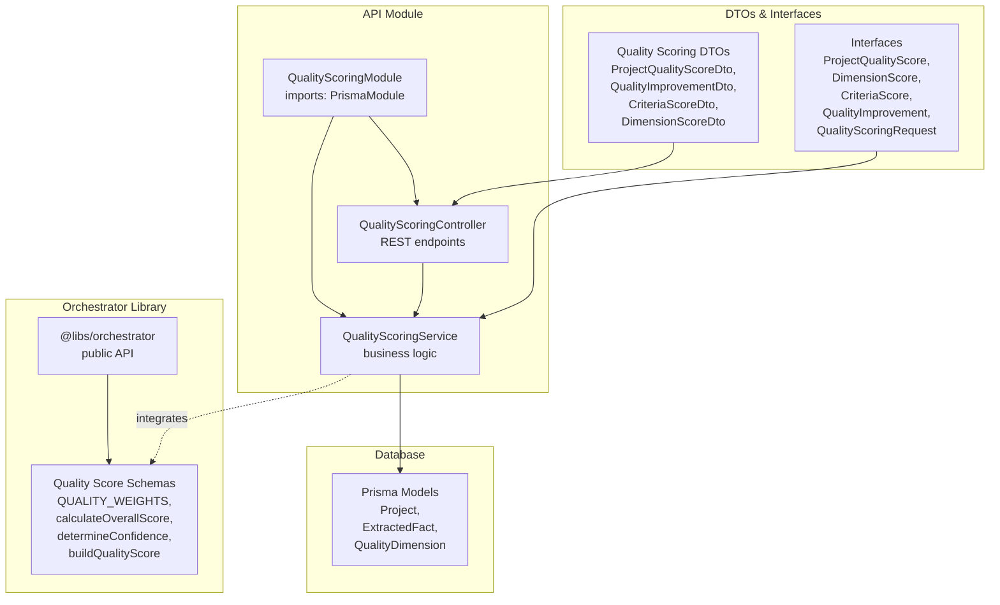
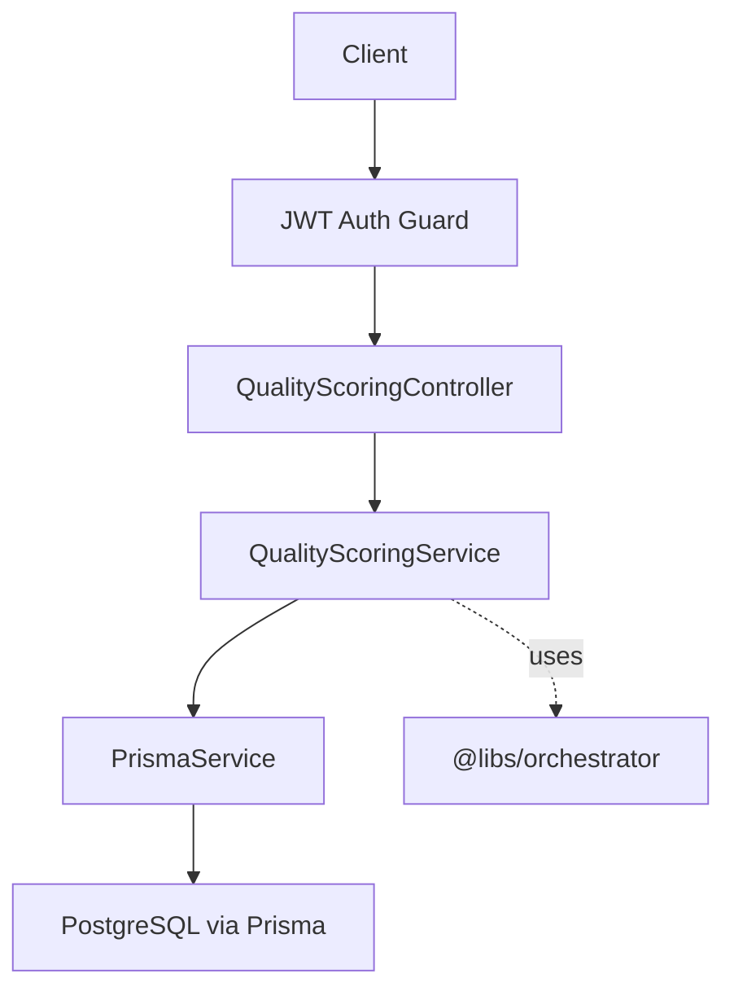
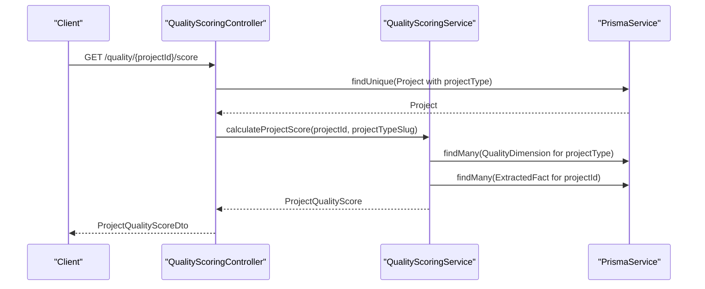
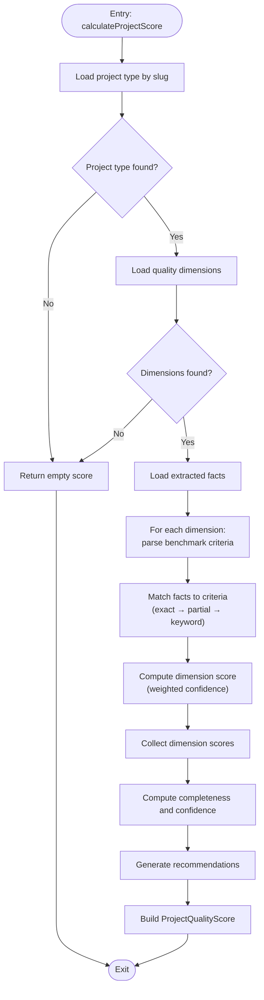
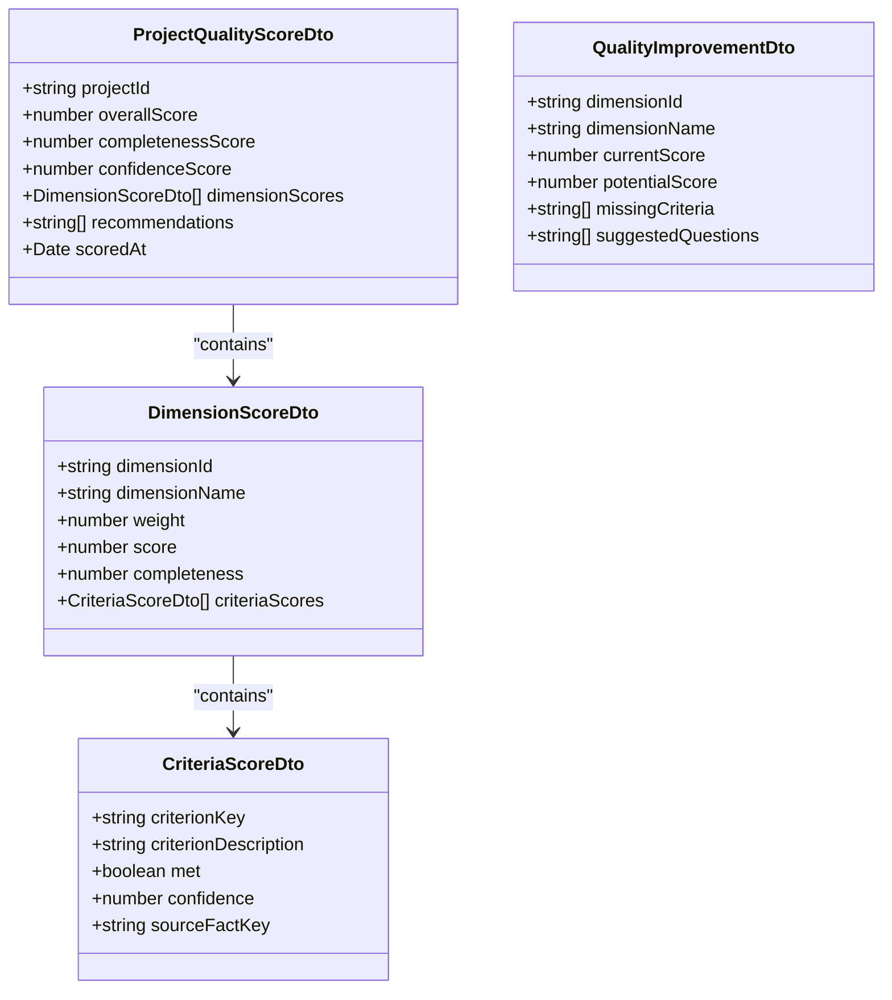
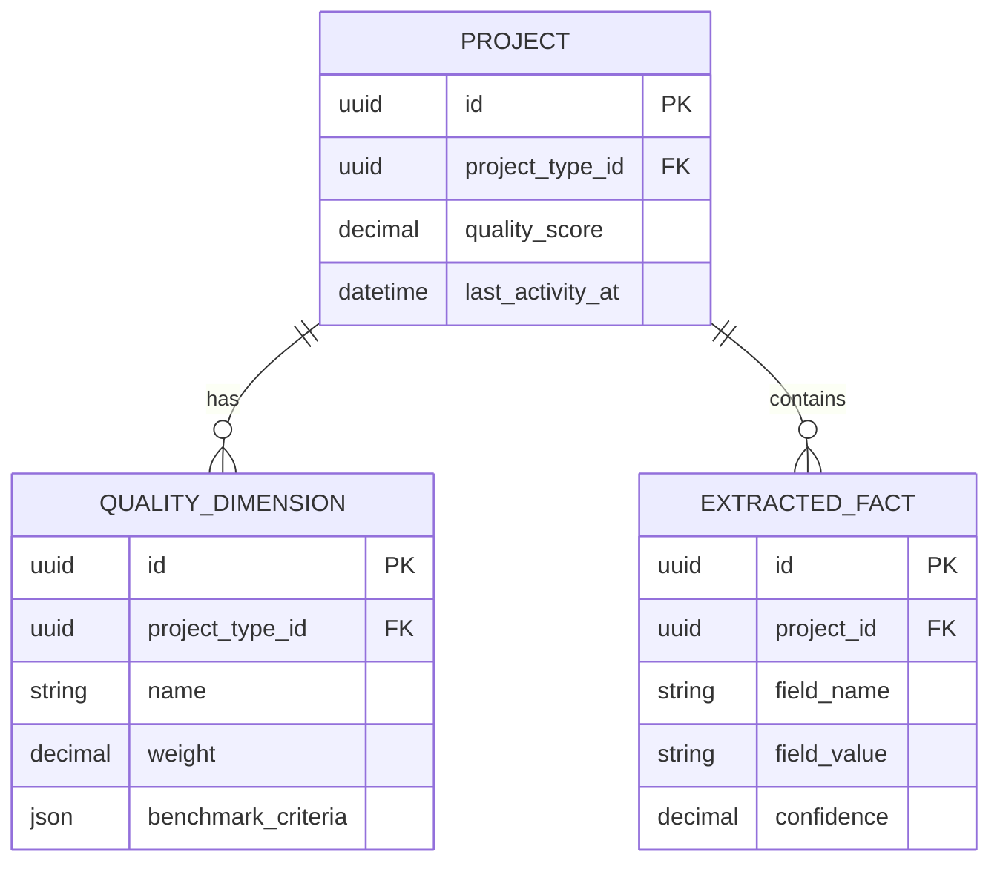
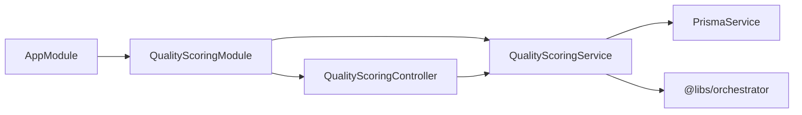

# Quality Scoring Integration

<cite>
**Referenced Files in This Document**
- [app.module.ts](file://apps/api/src/app.module.ts)
- [quality-scoring.module.ts](file://apps/api/src/modules/quality-scoring/quality-scoring.module.ts)
- [quality-scoring.controller.ts](file://apps/api/src/modules/quality-scoring/quality-scoring.controller.ts)
- [quality-scoring.service.ts](file://apps/api/src/modules/quality-scoring/services/quality-scoring.service.ts)
- [quality-scoring.dto.ts](file://apps/api/src/modules/quality-scoring/dto/quality-scoring.dto.ts)
- [interfaces.ts](file://apps/api/src/modules/quality-scoring/interfaces.ts)
- [index.ts](file://apps/api/src/modules/quality-scoring/index.ts)
- [quality-score.ts](file://libs/orchestrator/src/schemas/quality-score.ts)
- [index.ts](file://libs/orchestrator/src/index.ts)
- [schema.prisma](file://prisma/schema.prisma)
</cite>

## Table of Contents
1. [Introduction](#introduction)
2. [Project Structure](#project-structure)
3. [Core Components](#core-components)
4. [Architecture Overview](#architecture-overview)
5. [Detailed Component Analysis](#detailed-component-analysis)
6. [Dependency Analysis](#dependency-analysis)
7. [Performance Considerations](#performance-considerations)
8. [Troubleshooting Guide](#troubleshooting-guide)
9. [Conclusion](#conclusion)

## Introduction
This document describes the quality scoring integration system that evaluates project quality against defined dimensions and benchmark criteria. It covers the REST API endpoints, DTO structures, validation rules, scoring algorithms, consistency checks, and integration patterns with the main scoring engine and external quality metrics. The system supports real-time scoring, improvement suggestions, and persistence of quality scores for document generation pricing.

## Project Structure
The quality scoring feature is organized as a NestJS module with a controller, service, DTOs, interfaces, and internal schemas for validation and scoring.

**Diagram sources**
- [quality-scoring.module.ts:13-19](file://apps/api/src/modules/quality-scoring/quality-scoring.module.ts#L13-L19)
- [quality-scoring.controller.ts:16-183](file://apps/api/src/modules/quality-scoring/quality-scoring.controller.ts#L16-L183)
- [quality-scoring.service.ts:28-339](file://apps/api/src/modules/quality-scoring/services/quality-scoring.service.ts#L28-L339)
- [quality-scoring.dto.ts:1-100](file://apps/api/src/modules/quality-scoring/dto/quality-scoring.dto.ts#L1-L100)
- [interfaces.ts:1-63](file://apps/api/src/modules/quality-scoring/interfaces.ts#L1-L63)
- [quality-score.ts:1-119](file://libs/orchestrator/src/schemas/quality-score.ts#L1-L119)
- [schema.prisma:204-243](file://prisma/schema.prisma#L204-L243)

**Section sources**
- [app.module.ts:27](file://apps/api/src/app.module.ts#L27)
- [quality-scoring.module.ts:1-20](file://apps/api/src/modules/quality-scoring/quality-scoring.module.ts#L1-L20)
- [index.ts:1-6](file://apps/api/src/modules/quality-scoring/index.ts#L1-L6)

## Core Components
- QualityScoringModule: Declares dependencies on PrismaModule and registers the controller and service.
- QualityScoringController: Exposes REST endpoints for retrieving scores, improvement suggestions, and recalculating scores.
- QualityScoringService: Implements scoring logic, dimension evaluation, completeness/confidence calculations, and persistence.
- DTOs and Interfaces: Define input/output structures and typed contracts for the quality scoring domain.
- Orchestrator Quality Score Schemas: Provide reusable quality scoring math and validation for broader orchestration.

Key responsibilities:
- Validate and normalize benchmark criteria from JSON.
- Match extracted facts to criteria using exact, partial, and keyword-based strategies.
- Compute dimension scores as weighted confidence averages and overall weighted scores.
- Generate actionable recommendations and improvement suggestions.
- Persist quality scores to the Project entity.

**Section sources**
- [quality-scoring.module.ts:13-19](file://apps/api/src/modules/quality-scoring/quality-scoring.module.ts#L13-L19)
- [quality-scoring.controller.ts:16-183](file://apps/api/src/modules/quality-scoring/quality-scoring.controller.ts#L16-L183)
- [quality-scoring.service.ts:28-339](file://apps/api/src/modules/quality-scoring/services/quality-scoring.service.ts#L28-L339)
- [quality-scoring.dto.ts:1-100](file://apps/api/src/modules/quality-scoring/dto/quality-scoring.dto.ts#L1-L100)
- [interfaces.ts:1-63](file://apps/api/src/modules/quality-scoring/interfaces.ts#L1-L63)
- [quality-score.ts:1-119](file://libs/orchestrator/src/schemas/quality-score.ts#L1-L119)

## Architecture Overview
The quality scoring system integrates with the main application via a dedicated module and leverages Prisma for data access. It also reuses quality scoring schemas from the orchestrator library for consistent scoring semantics.

**Diagram sources**
- [quality-scoring.controller.ts:16-183](file://apps/api/src/modules/quality-scoring/quality-scoring.controller.ts#L16-L183)
- [quality-scoring.service.ts:28-339](file://apps/api/src/modules/quality-scoring/services/quality-scoring.service.ts#L28-L339)
- [app.module.ts:27](file://apps/api/src/app.module.ts#L27)
- [index.ts:49-54](file://libs/orchestrator/src/index.ts#L49-L54)

## Detailed Component Analysis

### REST API Endpoints
Endpoints exposed by QualityScoringController:
- GET /quality/:projectId/score → Returns a ProjectQualityScoreDto with overall, completeness, and confidence scores, plus dimension breakdowns and recommendations.
- GET /quality/:projectId/improvements → Returns QualityImprovementDto suggestions with missing criteria and follow-up questions.
- POST /quality/:projectId/recalculate → Recalculates and persists the score to the Project entity.

Security and validation:
- All endpoints are protected by JWT authentication.
- DTOs define validation rules (types, arrays, nested validation) enforced by NestJS pipes.

**Diagram sources**
- [quality-scoring.controller.ts:30-53](file://apps/api/src/modules/quality-scoring/quality-scoring.controller.ts#L30-L53)
- [quality-scoring.service.ts:36-94](file://apps/api/src/modules/quality-scoring/services/quality-scoring.service.ts#L36-L94)

**Section sources**
- [quality-scoring.controller.ts:27-117](file://apps/api/src/modules/quality-scoring/quality-scoring.controller.ts#L27-L117)
- [quality-scoring.dto.ts:49-75](file://apps/api/src/modules/quality-scoring/dto/quality-scoring.dto.ts#L49-L75)

### Quality Scoring Service Implementation
Responsibilities:
- Load project type and associated quality dimensions.
- Retrieve extracted facts for the project.
- Parse benchmark criteria from JSON stored in QualityDimension.
- Match facts to criteria using multiple strategies (exact, partial, keyword).
- Compute dimension scores as weighted confidence averages.
- Aggregate completeness and confidence scores.
- Generate recommendations prioritizing low-scoring dimensions.
- Persist quality score to Project.

Consistency checks and validation:
- Empty project type or dimensions return an empty score with guidance.
- Missing project returns an empty score response.
- Confidence and completeness are bounded and rounded appropriately.

**Diagram sources**
- [quality-scoring.service.ts:36-94](file://apps/api/src/modules/quality-scoring/services/quality-scoring.service.ts#L36-L94)
- [quality-scoring.service.ts:99-151](file://apps/api/src/modules/quality-scoring/services/quality-scoring.service.ts#L99-L151)
- [quality-scoring.service.ts:176-207](file://apps/api/src/modules/quality-scoring/services/quality-scoring.service.ts#L176-L207)
- [quality-scoring.service.ts:212-242](file://apps/api/src/modules/quality-scoring/services/quality-scoring.service.ts#L212-L242)

**Section sources**
- [quality-scoring.service.ts:36-339](file://apps/api/src/modules/quality-scoring/services/quality-scoring.service.ts#L36-L339)

### DTO Structures and Validation Rules
DTOs define the contract for input/output:
- ProjectQualityScoreDto: Overall score, completeness, confidence, dimension breakdowns, recommendations, and timestamp.
- DimensionScoreDto: Dimension-level details including weight, score, completeness, and criteria scores.
- CriteriaScoreDto: Individual criterion metadata with confidence and optional source fact key.
- QualityImprovementDto: Improvement suggestions with current/potential scores, missing criteria, and suggested questions.

Validation rules:
- Arrays are validated with @IsArray and @ValidateNested.
- Nested DTOs are deserialized using @Type to ensure proper transformation.
- Swagger annotations provide property documentation.

**Diagram sources**
- [quality-scoring.dto.ts:9-99](file://apps/api/src/modules/quality-scoring/dto/quality-scoring.dto.ts#L9-L99)

**Section sources**
- [quality-scoring.dto.ts:1-100](file://apps/api/src/modules/quality-scoring/dto/quality-scoring.dto.ts#L1-L100)

### Interfaces and Domain Contracts
Interfaces formalize the internal domain model:
- ProjectQualityScore: Top-level score with metadata and dimension collections.
- DimensionScore: Per-dimension aggregation with completeness and criteria details.
- CriteriaScore: Criterion-level pass/fail with confidence and optional source.
- QualityImprovement: Improvement opportunity with potential score and suggestions.
- QualityScoringRequest: Request envelope for scoring operations.

These interfaces guide service implementation and ensure consistent data shapes across the system.

**Section sources**
- [interfaces.ts:1-63](file://apps/api/src/modules/quality-scoring/interfaces.ts#L1-L63)

### Integration with Orchestrator Quality Score Schemas
The system reuses orchestrator quality scoring utilities for consistent scoring semantics:
- QUALITY_WEIGHTS: Enforces that weights sum to 1.0 at module load time.
- calculateOverallScore: Computes weighted overall score from component scores.
- determineConfidence: Assigns HIGH/MEDIUM/LOW confidence based on correction cycles and model agreement.
- buildQualityScore: Constructs a complete quality score object from components.

Integration pattern:
- The service calculates component scores and delegates to orchestrator utilities for consistency and validation.

**Section sources**
- [quality-score.ts:12-40](file://libs/orchestrator/src/schemas/quality-score.ts#L12-L40)
- [quality-score.ts:53-61](file://libs/orchestrator/src/schemas/quality-score.ts#L53-L61)
- [quality-score.ts:76-83](file://libs/orchestrator/src/schemas/quality-score.ts#L76-L83)
- [quality-score.ts:98-118](file://libs/orchestrator/src/schemas/quality-score.ts#L98-L118)
- [index.ts:49-54](file://libs/orchestrator/src/index.ts#L49-L54)

### Data Model and Persistence
The Project entity stores the quality score and last activity timestamp. QualityDimension defines benchmark criteria per project type, and ExtractedFact provides the factual basis for scoring.

**Diagram sources**
- [schema.prisma:204-243](file://prisma/schema.prisma#L204-L243)
- [schema.prisma:378-401](file://prisma/schema.prisma#L378-L401)
- [schema.prisma:635-674](file://prisma/schema.prisma#L635-L674)

**Section sources**
- [schema.prisma:204-243](file://prisma/schema.prisma#L204-L243)
- [schema.prisma:378-401](file://prisma/schema.prisma#L378-L401)
- [schema.prisma:635-674](file://prisma/schema.prisma#L635-L674)

## Dependency Analysis
Module-level dependencies:
- QualityScoringModule depends on PrismaModule.
- QualityScoringController depends on QualityScoringService and PrismaService.
- QualityScoringService depends on PrismaService and orchestrator quality score utilities.

External integrations:
- JWT authentication guard secures endpoints.
- Swagger annotations describe API contracts.
- Orchestrator library provides reusable quality scoring math.

**Diagram sources**
- [app.module.ts:27](file://apps/api/src/app.module.ts#L27)
- [quality-scoring.module.ts:13-19](file://apps/api/src/modules/quality-scoring/quality-scoring.module.ts#L13-L19)
- [index.ts:49-54](file://libs/orchestrator/src/index.ts#L49-L54)

**Section sources**
- [app.module.ts:27](file://apps/api/src/app.module.ts#L27)
- [quality-scoring.module.ts:13-19](file://apps/api/src/modules/quality-scoring/quality-scoring.module.ts#L13-L19)
- [index.ts:49-54](file://libs/orchestrator/src/index.ts#L49-L54)

## Performance Considerations
- Query limits: The service fetches up to 200 dimensions and 1000 facts to prevent excessive loads.
- Matching strategy: Uses ordered fallbacks (exact → partial → keyword) to balance accuracy and performance.
- Aggregation: Computes weighted averages and percentages in-memory; ensure dimension counts remain reasonable.
- Persistence: Updates the Project entity atomically with the calculated score.

Recommendations:
- Index database queries on frequently filtered fields (projectTypeId, projectId).
- Consider caching dimension lists per project type when dimensions are static.
- Monitor endpoint latency under high concurrency and adjust rate limits accordingly.

[No sources needed since this section provides general guidance]

## Troubleshooting Guide
Common issues and resolutions:
- Missing project type or dimensions: The service returns an empty score with guidance; verify project type slugs and dimension configurations.
- No extracted facts: Completeness and confidence default to zero; ensure facts are extracted and stored.
- Weight validation errors: The orchestrator validates that quality weights sum to 1.0; incorrect weights cause module load failures.
- Persistence errors: Saving the score logs and rethrows errors; check database connectivity and permissions.

Operational tips:
- Use the recalculate endpoint to refresh scores after data updates.
- Review recommendations to identify low-scoring dimensions and missing criteria.
- Monitor logs for warnings about missing data or empty results.

**Section sources**
- [quality-scoring.service.ts:47-50](file://apps/api/src/modules/quality-scoring/services/quality-scoring.service.ts#L47-L50)
- [quality-scoring.service.ts:59-62](file://apps/api/src/modules/quality-scoring/services/quality-scoring.service.ts#L59-L62)
- [quality-scoring.controller.ts:43-45](file://apps/api/src/modules/quality-scoring/quality-scoring.controller.ts#L43-L45)
- [quality-scoring.controller.ts:70-72](file://apps/api/src/modules/quality-scoring/quality-scoring.controller.ts#L70-L72)
- [quality-score.ts:31-40](file://libs/orchestrator/src/schemas/quality-score.ts#L31-L40)
- [quality-scoring.service.ts:322-337](file://apps/api/src/modules/quality-scoring/services/quality-scoring.service.ts#L322-L337)

## Conclusion
The quality scoring integration provides a robust, extensible framework for evaluating project quality against defined dimensions and benchmark criteria. It offers real-time scoring, actionable recommendations, and consistent scoring semantics through the orchestrator library. By leveraging DTOs, interfaces, and Prisma-backed persistence, the system ensures data integrity, scalability, and maintainability while supporting future enhancements such as batch processing, advanced analytics, and compliance framework integrations.