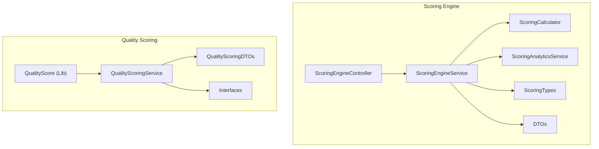
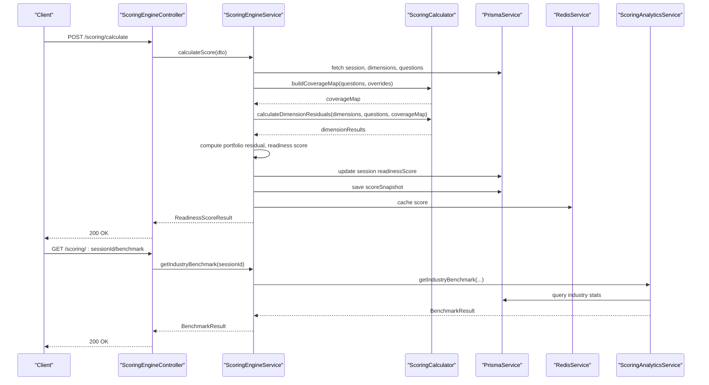
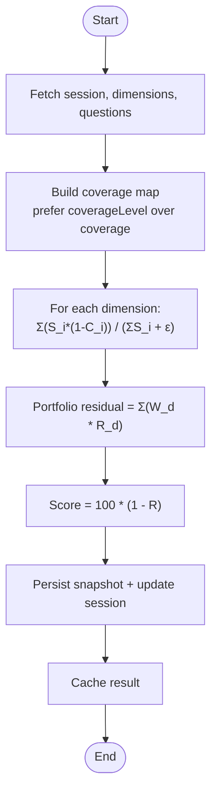
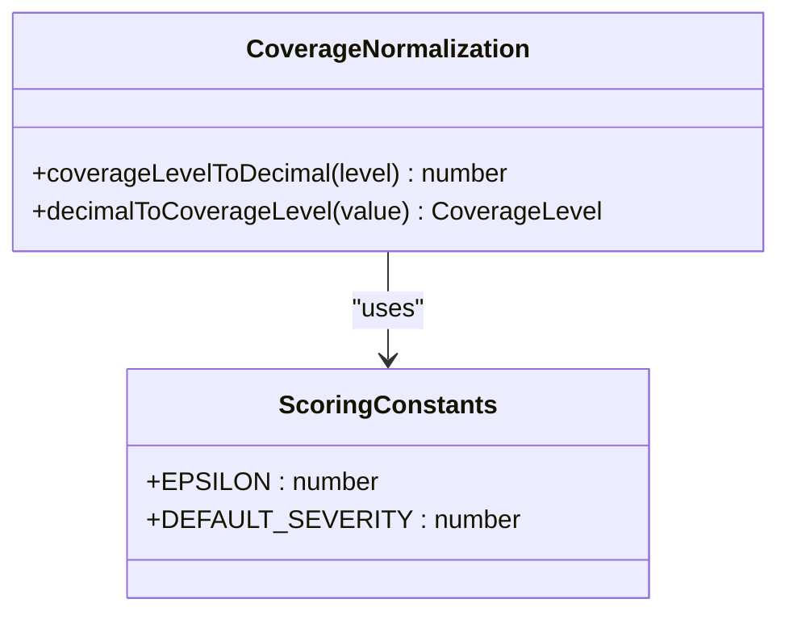
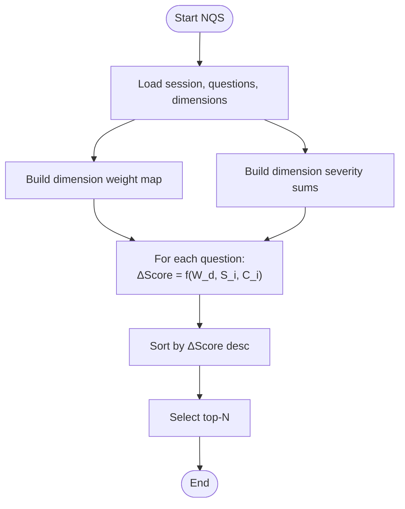
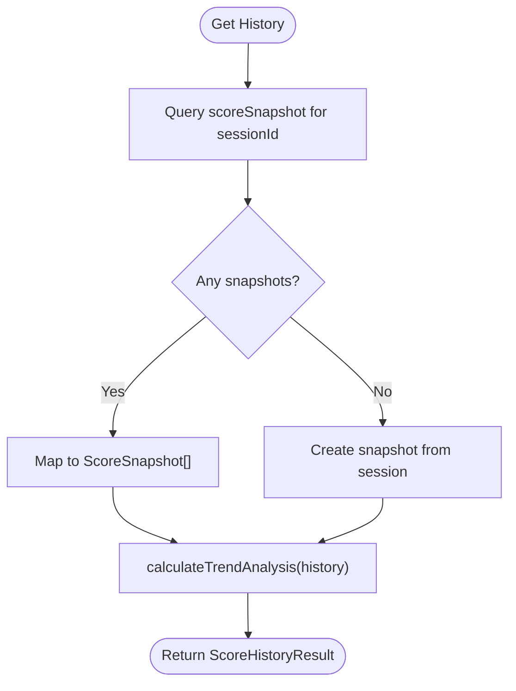
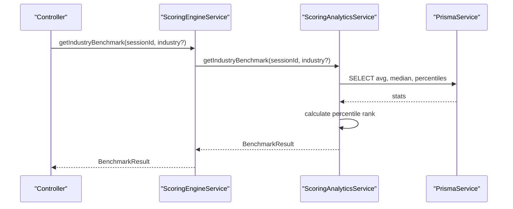
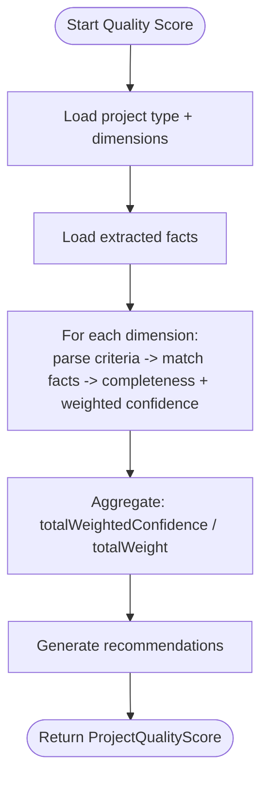
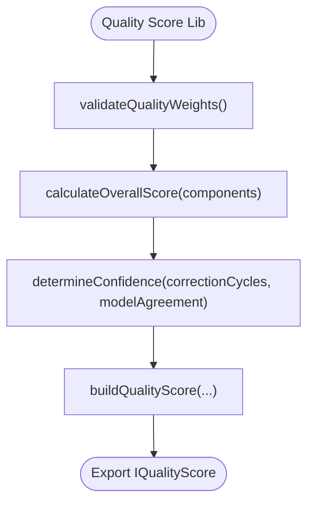
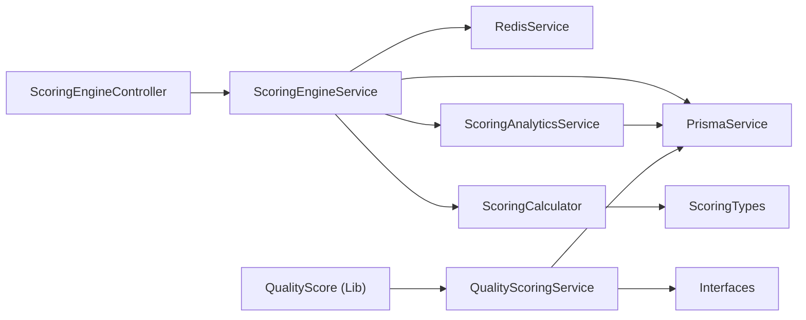

# Scoring Algorithms & Calculations

<cite>
**Referenced Files in This Document**
- [scoring-calculator.ts](file://apps/api/src/modules/scoring-engine/scoring-calculator.ts)
- [scoring-engine.service.ts](file://apps/api/src/modules/scoring-engine/scoring-engine.service.ts)
- [scoring-engine.controller.ts](file://apps/api/src/modules/scoring-engine/scoring-engine.controller.ts)
- [scoring-types.ts](file://apps/api/src/modules/scoring-engine/scoring-types.ts)
- [calculate-score.dto.ts](file://apps/api/src/modules/scoring-engine/dto/calculate-score.dto.ts)
- [scoring-analytics.ts](file://apps/api/src/modules/scoring-engine/strategies/scoring-analytics.ts)
- [quality-scoring.service.ts](file://apps/api/src/modules/quality-scoring/services/quality-scoring.service.ts)
- [quality-scoring.dto.ts](file://apps/api/src/modules/quality-scoring/dto/quality-scoring.dto.ts)
- [interfaces.ts](file://apps/api/src/modules/quality-scoring/interfaces.ts)
- [quality-score.ts](file://libs/orchestrator/src/schemas/quality-score.ts)
</cite>

## Table of Contents
1. [Introduction](#introduction)
2. [Project Structure](#project-structure)
3. [Core Components](#core-components)
4. [Architecture Overview](#architecture-overview)
5. [Detailed Component Analysis](#detailed-component-analysis)
6. [Dependency Analysis](#dependency-analysis)
7. [Performance Considerations](#performance-considerations)
8. [Troubleshooting Guide](#troubleshooting-guide)
9. [Conclusion](#conclusion)
10. [Appendices](#appendices)

## Introduction
This document explains the scoring algorithms and calculation engine powering Quiz2Biz readiness scoring and quality evaluation. It covers:
- Mathematical formulas for dimension-based scoring, weight distribution, and normalization
- Implementation of the scoring calculator (weighted averages, residuals, trends)
- Calculation DTO structures, input validation, and error handling
- Analytics strategies for historical tracking, comparative analysis, and benchmarking
- Optimization techniques (batch processing, caching, real-time performance)
- Rule configuration, custom weights, and integration with external quality metrics systems

## Project Structure
The scoring system spans two primary domains:
- Readiness scoring (risk-weighted quiz answers) under the Scoring Engine
- Quality scoring (document generation pricing) under Quality Scoring

**Diagram sources**
- [scoring-engine.controller.ts:46-267](file://apps/api/src/modules/scoring-engine/scoring-engine.controller.ts#L46-L267)
- [scoring-engine.service.ts:54-386](file://apps/api/src/modules/scoring-engine/scoring-engine.service.ts#L54-L386)
- [scoring-calculator.ts:1-208](file://apps/api/src/modules/scoring-engine/scoring-calculator.ts#L1-L208)
- [scoring-analytics.ts:17-267](file://apps/api/src/modules/scoring-engine/strategies/scoring-analytics.ts#L17-L267)
- [scoring-types.ts:1-110](file://apps/api/src/modules/scoring-engine/scoring-types.ts#L1-L110)
- [calculate-score.dto.ts:1-298](file://apps/api/src/modules/scoring-engine/dto/calculate-score.dto.ts#L1-L298)
- [quality-scoring.service.ts:27-338](file://apps/api/src/modules/quality-scoring/services/quality-scoring.service.ts#L27-L338)
- [quality-scoring.dto.ts:1-100](file://apps/api/src/modules/quality-scoring/dto/quality-scoring.dto.ts#L1-L100)
- [interfaces.ts:8-63](file://apps/api/src/modules/quality-scoring/interfaces.ts#L8-L63)
- [quality-score.ts:1-119](file://libs/orchestrator/src/schemas/quality-score.ts#L1-L119)

**Section sources**
- [scoring-engine.controller.ts:46-267](file://apps/api/src/modules/scoring-engine/scoring-engine.controller.ts#L46-L267)
- [scoring-engine.service.ts:54-386](file://apps/api/src/modules/scoring-engine/scoring-engine.service.ts#L54-L386)
- [quality-scoring.service.ts:27-338](file://apps/api/src/modules/quality-scoring/services/quality-scoring.service.ts#L27-L338)

## Core Components
- Scoring Calculator: Stateless helpers implementing core formulas (coverage mapping, dimension residuals, trend analysis).
- Scoring Engine Service: Orchestrates data fetching, calculation delegation, caching, persistence, and analytics.
- Scoring Engine Controller: Exposes REST endpoints for scoring, prioritization, cache invalidation, and benchmark retrieval.
- Scoring Types: Shared constants, enums, and DTO interfaces for readiness scoring.
- Quality Scoring Service: Computes weighted quality scores from extracted facts and benchmark criteria.
- Quality Score Library: Defines quality weights, confidence determination, and overall score computation.

**Section sources**
- [scoring-calculator.ts:1-208](file://apps/api/src/modules/scoring-engine/scoring-calculator.ts#L1-L208)
- [scoring-engine.service.ts:54-386](file://apps/api/src/modules/scoring-engine/scoring-engine.service.ts#L54-L386)
- [scoring-engine.controller.ts:46-267](file://apps/api/src/modules/scoring-engine/scoring-engine.controller.ts#L46-L267)
- [scoring-types.ts:1-110](file://apps/api/src/modules/scoring-engine/scoring-types.ts#L1-L110)
- [quality-scoring.service.ts:27-338](file://apps/api/src/modules/quality-scoring/services/quality-scoring.service.ts#L27-L338)
- [quality-score.ts:1-119](file://libs/orchestrator/src/schemas/quality-score.ts#L1-L119)

## Architecture Overview
The readiness scoring pipeline:
- Controller validates requests and delegates to the service.
- Service fetches session, dimensions, and questions; builds coverage map; computes dimension residuals; aggregates portfolio residual; derives readiness score; persists snapshot; caches result.
- Analytics service computes trend, industry benchmarks, and dimension benchmarks.

**Diagram sources**
- [scoring-engine.controller.ts:49-110](file://apps/api/src/modules/scoring-engine/scoring-engine.controller.ts#L49-L110)
- [scoring-engine.service.ts:70-164](file://apps/api/src/modules/scoring-engine/scoring-engine.service.ts#L70-L164)
- [scoring-calculator.ts:24-130](file://apps/api/src/modules/scoring-engine/scoring-calculator.ts#L24-L130)
- [scoring-analytics.ts:73-165](file://apps/api/src/modules/scoring-engine/strategies/scoring-analytics.ts#L73-L165)

## Detailed Component Analysis

### Readiness Scoring Formulas and Implementation
- Coverage mapping: Discrete coverage levels preferred; continuous values normalized to nearest discrete level.
- Dimension residual: Weighted average of severity-adjusted uncovered risk per dimension.
- Portfolio residual: Sum of weighted dimension residuals.
- Readiness score: Percentage complement of portfolio residual.
- Trend analysis: Direction, average change, volatility, and projection derived from history.

**Diagram sources**
- [scoring-engine.service.ts:70-164](file://apps/api/src/modules/scoring-engine/scoring-engine.service.ts#L70-L164)
- [scoring-calculator.ts:24-130](file://apps/api/src/modules/scoring-engine/scoring-calculator.ts#L24-L130)
- [scoring-types.ts:8-15](file://apps/api/src/modules/scoring-engine/scoring-types.ts#L8-L15)

**Section sources**
- [scoring-calculator.ts:67-130](file://apps/api/src/modules/scoring-engine/scoring-calculator.ts#L67-L130)
- [scoring-engine.service.ts:112-116](file://apps/api/src/modules/scoring-engine/scoring-engine.service.ts#L112-L116)

### Coverage Normalization and Weight Distribution
- Coverage levels: Five-level discrete scale mapped to decimals; continuous coverage normalized to nearest level.
- Severity defaults: Questions without severity use a default value to maintain balanced weighting.
- Dimension weights: Provided per dimension; residuals are weighted before aggregation.

**Diagram sources**
- [scoring-types.ts:21-52](file://apps/api/src/modules/scoring-engine/scoring-types.ts#L21-L52)
- [calculate-score.dto.ts:41-55](file://apps/api/src/modules/scoring-engine/dto/calculate-score.dto.ts#L41-L55)

**Section sources**
- [scoring-types.ts:21-52](file://apps/api/src/modules/scoring-engine/scoring-types.ts#L21-L52)
- [calculate-score.dto.ts:41-96](file://apps/api/src/modules/scoring-engine/dto/calculate-score.dto.ts#L41-L96)

### Priority Question Scoring (NQS)
- Expected score lift per question: Proportional to dimension weight, question severity, and uncovered portion.
- Ranking: Questions sorted by expected score lift; ties resolved by additional heuristics if needed.
- Rationale generation: Human-readable explanations for prioritization.

**Diagram sources**
- [scoring-engine.service.ts:170-227](file://apps/api/src/modules/scoring-engine/scoring-engine.service.ts#L170-L227)
- [scoring-calculator.ts:133-147](file://apps/api/src/modules/scoring-engine/scoring-calculator.ts#L133-L147)

**Section sources**
- [scoring-engine.service.ts:230-274](file://apps/api/src/modules/scoring-engine/scoring-engine.service.ts#L230-L274)

### Trend Analysis and Historical Tracking
- History retrieval: Loads snapshots ordered by recency; falls back to current score if no snapshots.
- Trend metrics: Average change, volatility, direction classification, and projected score.
- Persistence: Snapshots stored with dimension breakdowns for downstream analytics.

**Diagram sources**
- [scoring-analytics.ts:24-67](file://apps/api/src/modules/scoring-engine/strategies/scoring-analytics.ts#L24-L67)
- [scoring-calculator.ts:149-187](file://apps/api/src/modules/scoring-engine/scoring-calculator.ts#L149-L187)

**Section sources**
- [scoring-analytics.ts:24-67](file://apps/api/src/modules/scoring-engine/strategies/scoring-analytics.ts#L24-L67)
- [scoring-calculator.ts:149-187](file://apps/api/src/modules/scoring-engine/scoring-calculator.ts#L149-L187)

### Industry Benchmarking and Comparative Analysis
- Industry statistics: Average, median, min, max, and quartiles computed from completed sessions.
- Percentile ranking: Computed using window functions over industry population.
- Dimension benchmarks: Average residual risk per dimension; gap analysis and recommendations.

**Diagram sources**
- [scoring-engine.controller.ts:192-231](file://apps/api/src/modules/scoring-engine/scoring-engine.controller.ts#L192-L231)
- [scoring-analytics.ts:73-165](file://apps/api/src/modules/scoring-engine/strategies/scoring-analytics.ts#L73-L165)

**Section sources**
- [scoring-analytics.ts:73-165](file://apps/api/src/modules/scoring-engine/strategies/scoring-analytics.ts#L73-L165)

### Quality Scoring (Document Pricing)
- Input: Project facts and quality dimensions with benchmark criteria.
- Calculation: Completeness (ratio of criteria met), weighted confidence of met criteria, and overall score.
- Recommendations: Prioritization of dimensions needing improvement.

**Diagram sources**
- [quality-scoring.service.ts:36-94](file://apps/api/src/modules/quality-scoring/services/quality-scoring.service.ts#L36-L94)
- [quality-scoring.service.ts:99-151](file://apps/api/src/modules/quality-scoring/services/quality-scoring.service.ts#L99-L151)

**Section sources**
- [quality-scoring.service.ts:36-151](file://apps/api/src/modules/quality-scoring/services/quality-scoring.service.ts#L36-L151)

### Quality Score Library (Weights, Confidence, Builder)
- Weights validation: Ensures sum equals 1.0 at module load time.
- Overall score: Weighted sum of component scores.
- Confidence: Determined by correction cycles and model agreement.

**Diagram sources**
- [quality-score.ts:31-40](file://libs/orchestrator/src/schemas/quality-score.ts#L31-L40)
- [quality-score.ts:53-61](file://libs/orchestrator/src/schemas/quality-score.ts#L53-L61)
- [quality-score.ts:76-83](file://libs/orchestrator/src/schemas/quality-score.ts#L76-L83)
- [quality-score.ts:98-118](file://libs/orchestrator/src/schemas/quality-score.ts#L98-L118)

**Section sources**
- [quality-score.ts:13-61](file://libs/orchestrator/src/schemas/quality-score.ts#L13-L61)

## Dependency Analysis
- ScoringEngineService depends on PrismaService, RedisService, ScoringCalculator, and ScoringAnalyticsService.
- ScoringEngineController depends on ScoringEngineService and DTOs.
- ScoringAnalyticsService depends on PrismaService and reuses calculator functions.
- QualityScoringService depends on PrismaService and interfaces; integrates with library for confidence scoring.

**Diagram sources**
- [scoring-engine.controller.ts:20-32](file://apps/api/src/modules/scoring-engine/scoring-engine.controller.ts#L20-L32)
- [scoring-engine.service.ts:59-64](file://apps/api/src/modules/scoring-engine/scoring-engine.service.ts#L59-L64)
- [scoring-analytics.ts:17-18](file://apps/api/src/modules/scoring-engine/strategies/scoring-analytics.ts#L17-L18)
- [quality-scoring.service.ts:27-31](file://apps/api/src/modules/quality-scoring/services/quality-scoring.service.ts#L27-L31)
- [quality-score.ts:6-6](file://libs/orchestrator/src/schemas/quality-score.ts#L6-L6)

**Section sources**
- [scoring-engine.service.ts:59-64](file://apps/api/src/modules/scoring-engine/scoring-engine.service.ts#L59-L64)
- [scoring-analytics.ts:17-18](file://apps/api/src/modules/scoring-engine/strategies/scoring-analytics.ts#L17-L18)
- [quality-scoring.service.ts:27-31](file://apps/api/src/modules/quality-scoring/services/quality-scoring.service.ts#L27-L31)

## Performance Considerations
- Caching: Scores cached in Redis with a TTL to reduce repeated computation.
- Batch processing: Controlled concurrency batches for bulk score calculations.
- Database queries: Parameterized queries and optimized joins for analytics.
- Real-time performance: Logging of calculation duration; cache-first retrieval for next-questions endpoint.

Recommendations:
- Monitor cache hit ratio and adjust TTL based on usage patterns.
- Use pagination for history and benchmark queries.
- Consider precomputing dimension severity sums for very large questionnaires.

**Section sources**
- [scoring-engine.service.ts:300-324](file://apps/api/src/modules/scoring-engine/scoring-engine.service.ts#L300-L324)
- [scoring-engine.service.ts:343-363](file://apps/api/src/modules/scoring-engine/scoring-engine.service.ts#L343-L363)
- [scoring-types.ts:14-15](file://apps/api/src/modules/scoring-engine/scoring-types.ts#L14-L15)

## Troubleshooting Guide
Common issues and resolutions:
- Session not found: Controller throws a not-found error when session does not exist.
- Division by zero protection: Epsilon prevents division by zero in residual and trend calculations.
- Cache failures: Logging and graceful fallback to recalculation.
- Data validation errors: DTO validation ensures coverage levels and ranges are correct.

Operational checks:
- Verify DTO constraints for coverageLevel and coverage.
- Confirm dimension weights and severity defaults align with expectations.
- Inspect Redis connectivity for caching operations.

**Section sources**
- [scoring-engine.controller.ts:77-82](file://apps/api/src/modules/scoring-engine/scoring-engine.controller.ts#L77-L82)
- [scoring-types.ts:8-12](file://apps/api/src/modules/scoring-engine/scoring-types.ts#L8-L12)
- [scoring-engine.service.ts:291-298](file://apps/api/src/modules/scoring-engine/scoring-engine.service.ts#L291-L298)
- [calculate-score.dto.ts:72-96](file://apps/api/src/modules/scoring-engine/dto/calculate-score.dto.ts#L72-L96)

## Conclusion
The scoring system combines precise mathematical formulas with robust engineering practices:
- Readiness scoring uses risk-weighted residuals with clear normalization and trend analytics.
- Quality scoring leverages benchmark criteria and confidence to support pricing decisions.
- Strong input validation, caching, batching, and analytics enable scalable, real-time performance.

## Appendices

### Mathematical Formulas Reference
- Coverage normalization: Discrete levels preferred; continuous normalized to nearest level.
- Dimension residual: R_d = Σ(S_i × (1 - C_i)) / (Σ S_i + ε)
- Portfolio residual: R = Σ(W_d × R_d)
- Readiness score: Score = 100 × (1 - R)
- Priority lift: ΔScore_i ∝ W_d(i) × S_i × (1 - C_i) / (Σ S_j + ε)

**Section sources**
- [scoring-calculator.ts:67-130](file://apps/api/src/modules/scoring-engine/scoring-calculator.ts#L67-L130)
- [scoring-engine.service.ts:254-255](file://apps/api/src/modules/scoring-engine/scoring-engine.service.ts#L254-L255)

### DTO and Type Definitions
- Readiness DTOs: Inputs, outputs, dimension breakdowns, prioritized questions.
- Quality DTOs: Dimension and criteria scores, project quality score, recommendations.
- Shared types: Coverage levels, trend analysis, benchmark results.

**Section sources**
- [calculate-score.dto.ts:101-298](file://apps/api/src/modules/scoring-engine/dto/calculate-score.dto.ts#L101-L298)
- [quality-scoring.dto.ts:9-100](file://apps/api/src/modules/quality-scoring/dto/quality-scoring.dto.ts#L9-L100)
- [interfaces.ts:8-63](file://apps/api/src/modules/quality-scoring/interfaces.ts#L8-L63)
- [scoring-types.ts:56-110](file://apps/api/src/modules/scoring-engine/scoring-types.ts#L56-L110)