# Scoring Visualization & Dashboards

<cite>
**Referenced Files in This Document**
- [DashboardPage.tsx](file://apps/web/src/pages/dashboard/DashboardPage.tsx)
- [AnalyticsDashboardPage.tsx](file://apps/web/src/pages/analytics/AnalyticsDashboardPage.tsx)
- [Analytics.tsx](file://apps/web/src/components/analytics/Analytics.tsx)
- [CompletionRateChart.tsx](file://apps/web/src/components/analytics/CompletionRateChart.tsx)
- [DropOffFunnelChart.tsx](file://apps/web/src/components/analytics/DropOffFunnelChart.tsx)
- [UserGrowthChart.tsx](file://apps/web/src/components/analytics/UserGrowthChart.tsx)
- [RetentionChart.tsx](file://apps/web/src/components/analytics/RetentionChart.tsx)
- [client.ts](file://apps/web/src/api/client.ts)
- [ScoreDashboard.test.tsx](file://apps/web/src/components/questionnaire/ScoreDashboard.test.tsx)
- [ScoreDashboard.a11y.test.tsx](file://apps/web/src/test/a11y/ScoreDashboard.a11y.test.tsx)
</cite>

## Table of Contents
1. [Introduction](#introduction)
2. [Project Structure](#project-structure)
3. [Core Components](#core-components)
4. [Architecture Overview](#architecture-overview)
5. [Detailed Component Analysis](#detailed-component-analysis)
6. [Dependency Analysis](#dependency-analysis)
7. [Performance Considerations](#performance-considerations)
8. [Troubleshooting Guide](#troubleshooting-guide)
9. [Conclusion](#conclusion)

## Introduction
This document describes the scoring visualization and dashboard implementation for the Quiz-to-Build application. It focuses on:
- Real-time progress tracking and dimension-specific score displays for quality scoring
- Trend visualization for completion rates, drop-off funnels, user growth, and retention
- Frontend state management for scoring data, real-time updates, and user interactions
- Chart implementations and responsive design patterns
- Accessibility compliance and cross-browser compatibility
- Integration with backend APIs via a robust HTTP client
- Performance optimization strategies for large datasets and interactive controls

## Project Structure
The scoring and analytics dashboards are implemented across two primary areas:
- Project dashboard: displays project readiness scores, chat progress, and quick actions
- Analytics dashboard: aggregates and visualizes session completion, drop-off funnels, user growth, and retention metrics

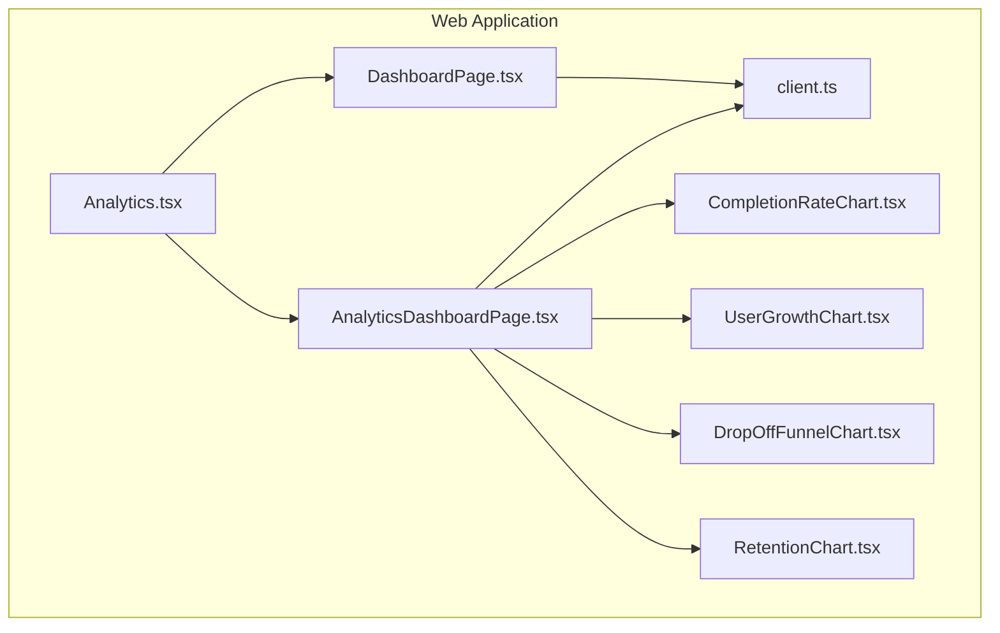

**Diagram sources**
- [DashboardPage.tsx:153-502](file://apps/web/src/pages/dashboard/DashboardPage.tsx#L153-L502)
- [AnalyticsDashboardPage.tsx:299-482](file://apps/web/src/pages/analytics/AnalyticsDashboardPage.tsx#L299-L482)
- [Analytics.tsx:232-801](file://apps/web/src/components/analytics/Analytics.tsx#L232-L801)
- [CompletionRateChart.tsx:17-155](file://apps/web/src/components/analytics/CompletionRateChart.tsx#L17-L155)
- [DropOffFunnelChart.tsx:35-220](file://apps/web/src/components/analytics/DropOffFunnelChart.tsx#L35-L220)
- [UserGrowthChart.tsx:17-204](file://apps/web/src/components/analytics/UserGrowthChart.tsx#L17-L204)
- [RetentionChart.tsx:33-185](file://apps/web/src/components/analytics/RetentionChart.tsx#L33-L185)
- [client.ts:95-325](file://apps/web/src/api/client.ts#L95-L325)

**Section sources**
- [DashboardPage.tsx:1-503](file://apps/web/src/pages/dashboard/DashboardPage.tsx#L1-L503)
- [AnalyticsDashboardPage.tsx:1-483](file://apps/web/src/pages/analytics/AnalyticsDashboardPage.tsx#L1-L483)

## Core Components
- DashboardPage: Renders project readiness metrics, chat progress indicators, and quick actions. It fetches project lists and computes quality score statistics for the user’s projects.
- AnalyticsDashboardPage: Aggregates and renders analytics charts, including completion rates, user growth, retention, and drop-off funnels. It integrates with the backend API and falls back to mock data when unavailable.
- Analytics provider: Provides session tracking, heatmaps, funnels, and metrics calculation utilities for analytics-driven dashboards.
- CompletionRateChart: Stacked bar chart showing completed vs abandoned sessions over time with hover tooltips and average completion rate.
- DropOffFunnelChart: Visualizes questionnaire drop-off points by dimension and section, with color-coded risk levels and worst-drop-off highlights.
- UserGrowthChart: Line chart for cumulative users with overlaid bars for new users and gradient fills.
- RetentionChart: Cohort-based retention table with color-coded retention percentages and average rows.

**Section sources**
- [DashboardPage.tsx:153-502](file://apps/web/src/pages/dashboard/DashboardPage.tsx#L153-L502)
- [AnalyticsDashboardPage.tsx:299-482](file://apps/web/src/pages/analytics/AnalyticsDashboardPage.tsx#L299-L482)
- [Analytics.tsx:232-801](file://apps/web/src/components/analytics/Analytics.tsx#L232-L801)
- [CompletionRateChart.tsx:17-155](file://apps/web/src/components/analytics/CompletionRateChart.tsx#L17-L155)
- [DropOffFunnelChart.tsx:35-220](file://apps/web/src/components/analytics/DropOffFunnelChart.tsx#L35-L220)
- [UserGrowthChart.tsx:17-204](file://apps/web/src/components/analytics/UserGrowthChart.tsx#L17-L204)
- [RetentionChart.tsx:33-185](file://apps/web/src/components/analytics/RetentionChart.tsx#L33-L185)

## Architecture Overview
The dashboards integrate frontend components with a centralized HTTP client and backend services. The analytics provider encapsulates session recording and metric computation, while the analytics dashboard composes reusable chart components.

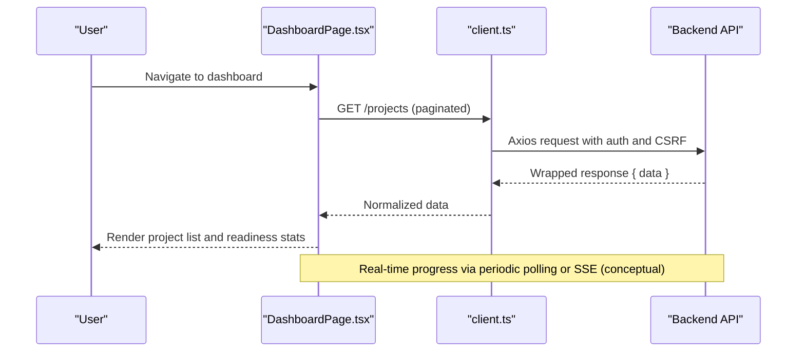

**Diagram sources**
- [DashboardPage.tsx:160-172](file://apps/web/src/pages/dashboard/DashboardPage.tsx#L160-L172)
- [client.ts:95-325](file://apps/web/src/api/client.ts#L95-L325)

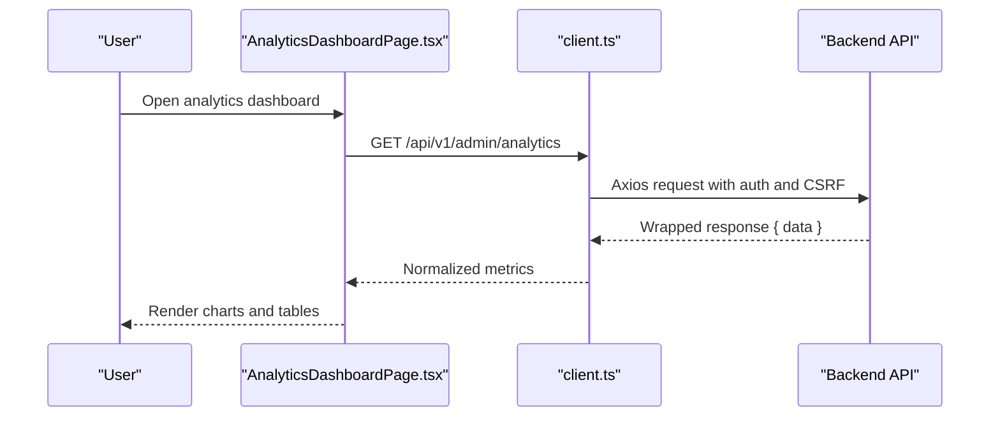

**Diagram sources**
- [AnalyticsDashboardPage.tsx:67-75](file://apps/web/src/pages/analytics/AnalyticsDashboardPage.tsx#L67-L75)
- [client.ts:95-325](file://apps/web/src/api/client.ts#L95-L325)

## Detailed Component Analysis

### DashboardPage: Project Readiness and Chat Progress
- Purpose: Display active and completed projects, compute best and average quality scores, show chat progress, and provide quick actions.
- Key features:
  - Project list pagination and filtering by status
  - Quality score computation from scored projects
  - Animated stat cards and progress indicators
  - Interactive project rows with keyboard navigation support
- Real-time progress tracking:
  - Chat progress bar reflects message count against a fixed limit
  - Progress ring dynamically updates based on average quality score
- Responsive design:
  - Grid layouts adapt from single-column on small screens to multi-column on larger screens
- Accessibility:
  - Proper focus order, ARIA roles, and keyboard activation for interactive elements

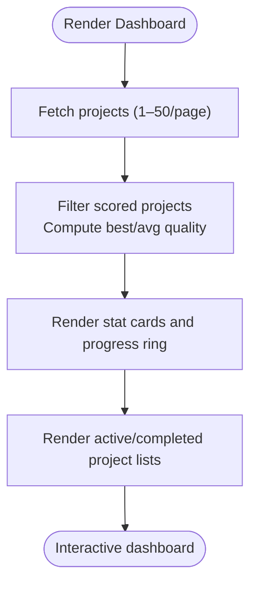

**Diagram sources**
- [DashboardPage.tsx:160-187](file://apps/web/src/pages/dashboard/DashboardPage.tsx#L160-L187)
- [DashboardPage.tsx:244-280](file://apps/web/src/pages/dashboard/DashboardPage.tsx#L244-L280)

**Section sources**
- [DashboardPage.tsx:153-502](file://apps/web/src/pages/dashboard/DashboardPage.tsx#L153-L502)

### AnalyticsDashboardPage: Analytics Composition and Controls
- Purpose: Aggregate and present analytics metrics and visualizations with time-range selection and skeleton loaders.
- Data fetching:
  - Uses React Query to fetch analytics data from the backend
  - Falls back to mock data when the backend is unavailable
- Composition:
  - Metric cards for key indicators
  - CompletionRateChart and UserGrowthChart side-by-side
  - User registration trends grid
  - RetentionChart table
  - DropOffFunnelChart with worst-drop-off highlights
- Controls:
  - Time range selector toggles data windows (7d, 30d, 90d, 1y)

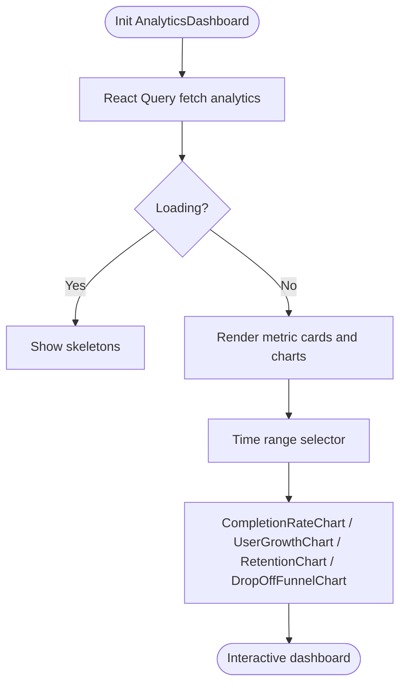

**Diagram sources**
- [AnalyticsDashboardPage.tsx:299-482](file://apps/web/src/pages/analytics/AnalyticsDashboardPage.tsx#L299-L482)

**Section sources**
- [AnalyticsDashboardPage.tsx:299-482](file://apps/web/src/pages/analytics/AnalyticsDashboardPage.tsx#L299-L482)

### Analytics Provider: Session Tracking and Metrics
- Purpose: Centralized analytics context for session lifecycle, event tracking, and computed metrics.
- Features:
  - Session creation, persistence, and resumption
  - Auto-tracking of clicks, scrolls, and navigation
  - Heatmap aggregation and funnel computations
  - Metrics calculation including bounce rate, conversion, and top pages/actions
- Privacy mode and storage:
  - Optional privacy mode to anonymize user IDs
  - Local storage persistence with limits and resume logic

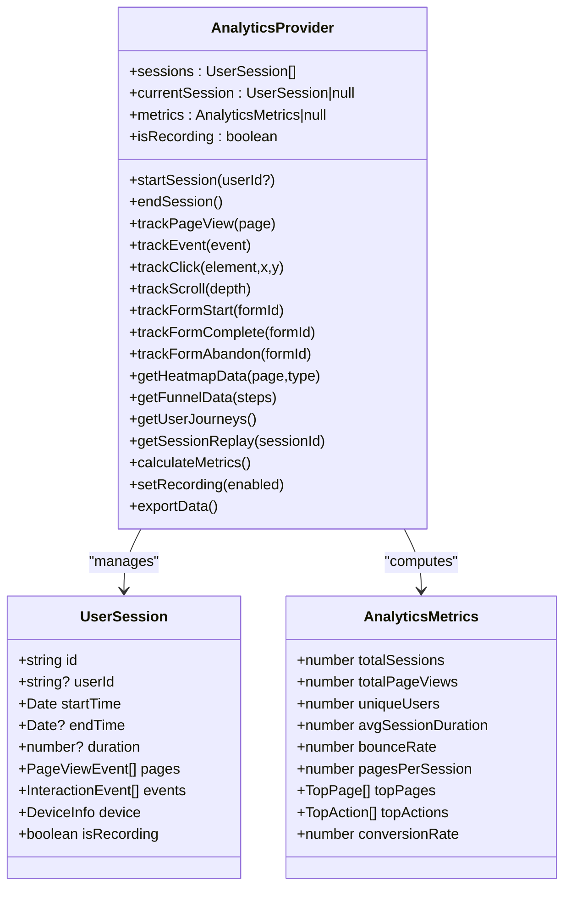

**Diagram sources**
- [Analytics.tsx:232-801](file://apps/web/src/components/analytics/Analytics.tsx#L232-L801)

**Section sources**
- [Analytics.tsx:232-801](file://apps/web/src/components/analytics/Analytics.tsx#L232-L801)

### CompletionRateChart: Stacked Completion vs Abandonment
- Purpose: Visualize session completion trends over time with stacked bars and hover tooltips.
- Implementation highlights:
  - Memoized data transformations for performance
  - Average completion rate calculation
  - Responsive layout with axis labels and grid lines
  - Tooltips with formatted dates and counts

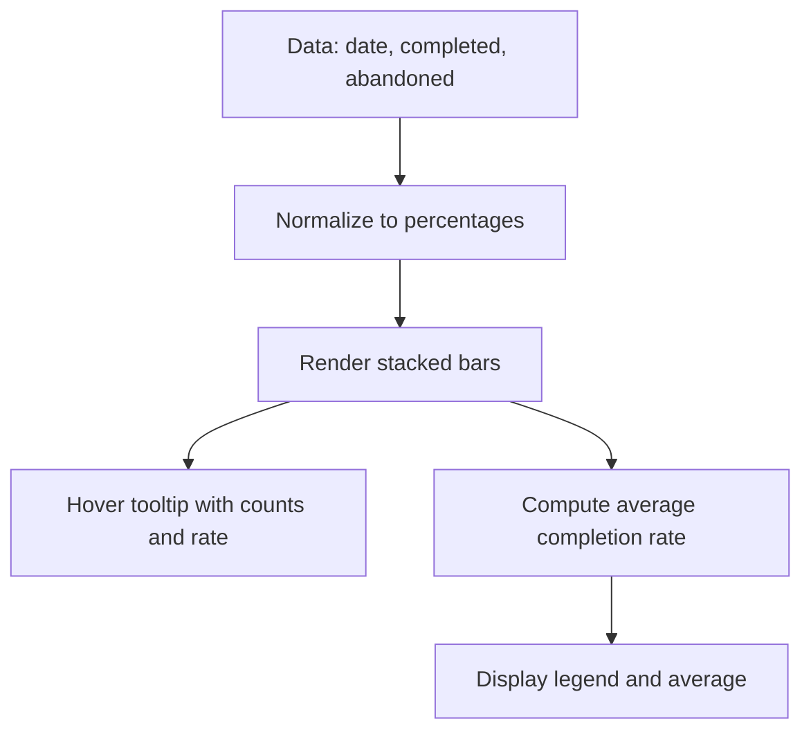

**Diagram sources**
- [CompletionRateChart.tsx:17-155](file://apps/web/src/components/analytics/CompletionRateChart.tsx#L17-L155)

**Section sources**
- [CompletionRateChart.tsx:17-155](file://apps/web/src/components/analytics/CompletionRateChart.tsx#L17-L155)

### DropOffFunnelChart: Questionnaire Drop-off Analysis
- Purpose: Identify high-drop-off points in questionnaire flows, grouped by section and dimension.
- Implementation highlights:
  - Color-coded risk levels based on drop-off rates
  - Worst-drop-off points ranking
  - Section-wise aggregation and completion rate computation
  - Visual funnel bars with directional indicators

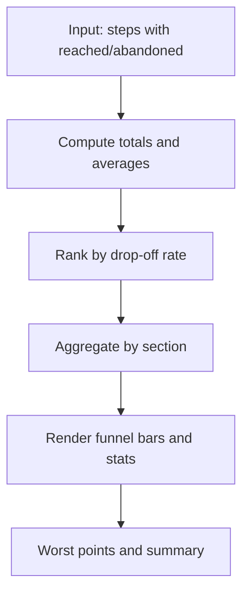

**Diagram sources**
- [DropOffFunnelChart.tsx:35-220](file://apps/web/src/components/analytics/DropOffFunnelChart.tsx#L35-L220)

**Section sources**
- [DropOffFunnelChart.tsx:35-220](file://apps/web/src/components/analytics/DropOffFunnelChart.tsx#L35-L220)

### UserGrowthChart: Cumulative Users and New Users
- Purpose: Display cumulative user growth over time with overlaid bars for new users and gradient-filled area.
- Implementation highlights:
  - SVG-based line chart with path generation
  - Gradient fill under the curve
  - Hover overlays with detailed tooltips
  - Responsive x-axis labels

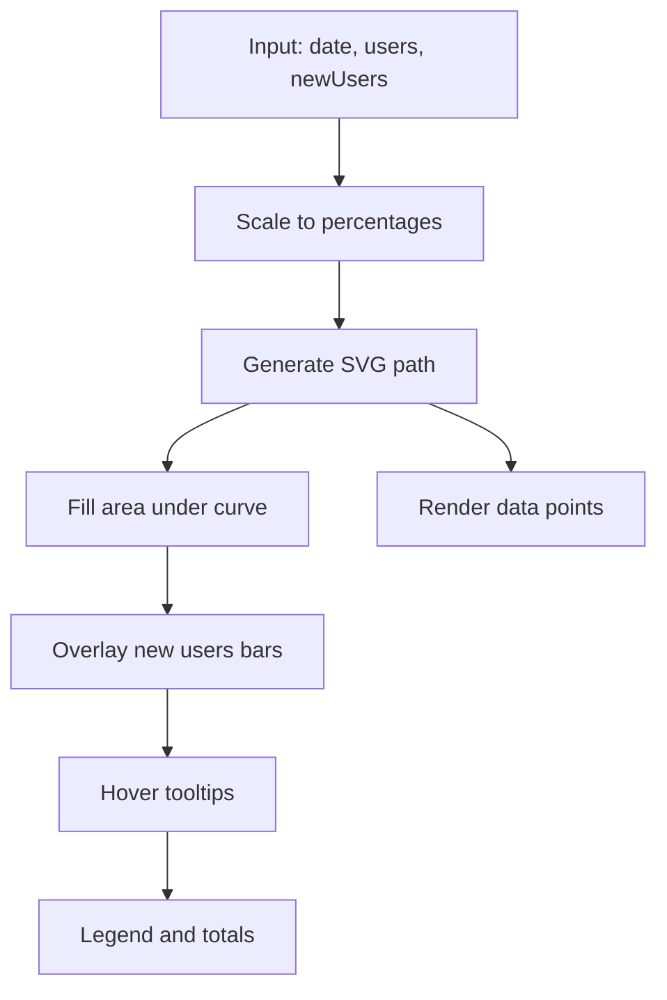

**Diagram sources**
- [UserGrowthChart.tsx:17-204](file://apps/web/src/components/analytics/UserGrowthChart.tsx#L17-L204)

**Section sources**
- [UserGrowthChart.tsx:17-204](file://apps/web/src/components/analytics/UserGrowthChart.tsx#L17-L204)

### RetentionChart: Cohort Retention Table
- Purpose: Present week-over-week retention cohorts with color-coded retention percentages and averages.
- Implementation highlights:
  - Dynamic table rendering with variable periods
  - Color scale mapping retention percentages to semantic colors
  - Average row computation across cohorts

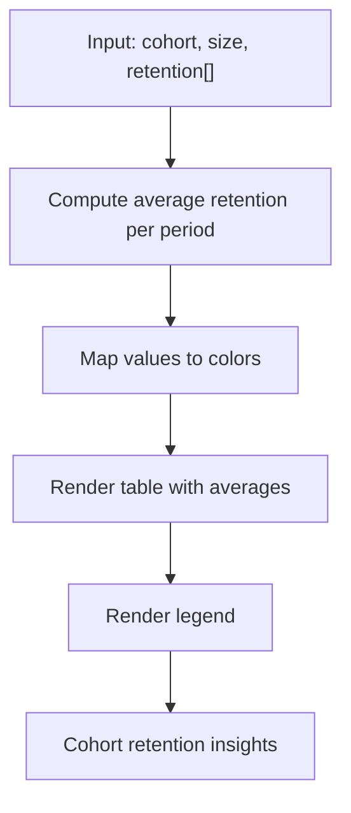

**Diagram sources**
- [RetentionChart.tsx:33-185](file://apps/web/src/components/analytics/RetentionChart.tsx#L33-L185)

**Section sources**
- [RetentionChart.tsx:33-185](file://apps/web/src/components/analytics/RetentionChart.tsx#L33-L185)

### API Integration: HTTP Client and Authentication
- Purpose: Provide a unified HTTP client with automatic auth token injection, CSRF handling, and response normalization.
- Key behaviors:
  - Environment-aware base URL resolution
  - Auth token retrieval from in-memory store or localStorage
  - CSRF token acquisition and injection for state-changing requests
  - Automatic token refresh and retry logic
  - Response unwrapping for consistent data access

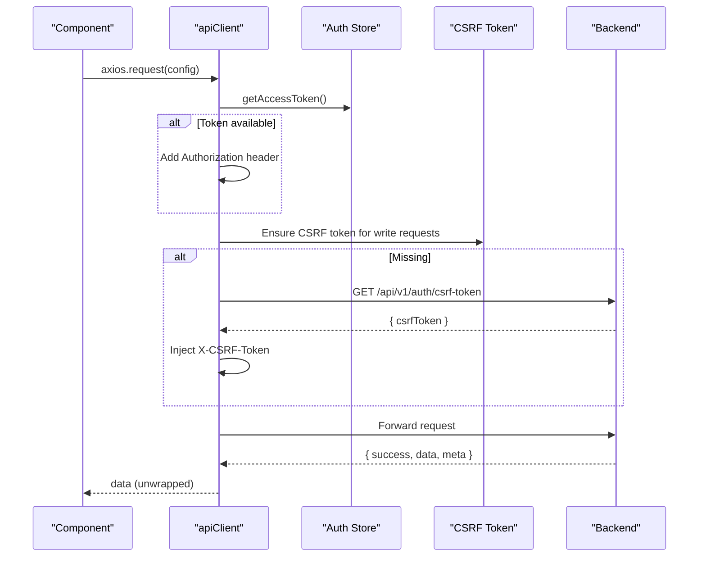

**Diagram sources**
- [client.ts:95-325](file://apps/web/src/api/client.ts#L95-L325)

**Section sources**
- [client.ts:95-325](file://apps/web/src/api/client.ts#L95-L325)

## Dependency Analysis
- DashboardPage depends on:
  - Project API client for fetching paginated project lists
  - Auth store for user context
  - UI primitives and icons for rendering
- AnalyticsDashboardPage depends on:
  - React Query for data fetching and caching
  - Chart components for visualization
  - API client for analytics endpoint
  - Mock data generators for fallback scenarios
- Analytics provider depends on:
  - Local storage for session persistence
  - Browser APIs for device info and scroll tracking
  - Event listeners for auto-tracking

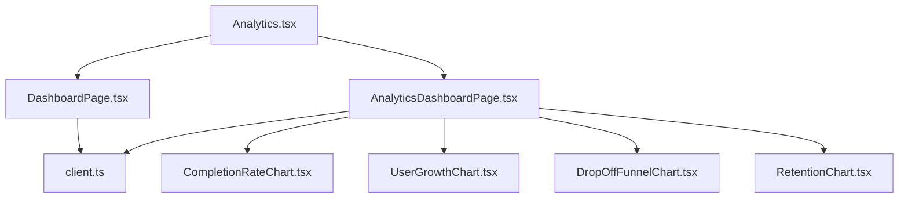

**Diagram sources**
- [DashboardPage.tsx:10-11](file://apps/web/src/pages/dashboard/DashboardPage.tsx#L10-L11)
- [AnalyticsDashboardPage.tsx:20-29](file://apps/web/src/pages/analytics/AnalyticsDashboardPage.tsx#L20-L29)
- [Analytics.tsx:218-226](file://apps/web/src/components/analytics/Analytics.tsx#L218-L226)

**Section sources**
- [DashboardPage.tsx:10-11](file://apps/web/src/pages/dashboard/DashboardPage.tsx#L10-L11)
- [AnalyticsDashboardPage.tsx:20-29](file://apps/web/src/pages/analytics/AnalyticsDashboardPage.tsx#L20-L29)
- [Analytics.tsx:218-226](file://apps/web/src/components/analytics/Analytics.tsx#L218-L226)

## Performance Considerations
- Memoization and derived data:
  - Use useMemo in charts to avoid recomputation on re-renders
  - Defer heavy computations until data is available
- Lazy loading and virtualization:
  - For large project lists, consider virtualized lists to reduce DOM nodes
  - Split analytics charts into tabs or lazy-loaded sections
- Efficient rendering:
  - Prefer SVG-based charts for smooth scaling and reduced layout thrashing
  - Use CSS transitions for animated progress indicators
- Network optimization:
  - Leverage React Query caching and background refetching
  - Batch requests where possible and avoid redundant queries
- Real-time updates:
  - Implement polling intervals or server-sent events for near-real-time metrics
  - Debounce frequent UI updates to maintain responsiveness

## Troubleshooting Guide
- Analytics data not loading:
  - Verify backend endpoint availability and CORS configuration
  - Check API client configuration and environment variables
  - Confirm CSRF token presence for write operations
- Authentication issues:
  - Ensure auth store hydration completes before making requests
  - Handle token refresh failures gracefully and redirect to login
- Chart rendering anomalies:
  - Validate input data shapes and ensure non-empty arrays
  - Check responsive breakpoints and container sizes affecting layout
- Accessibility and cross-browser compatibility:
  - Use semantic HTML and ARIA attributes consistently
  - Test with screen readers and keyboard-only navigation
  - Validate color contrast and hover/focus states across browsers

**Section sources**
- [client.ts:160-323](file://apps/web/src/api/client.ts#L160-L323)
- [AnalyticsDashboardPage.tsx:67-75](file://apps/web/src/pages/analytics/AnalyticsDashboardPage.tsx#L67-L75)

## Conclusion
The scoring visualization and dashboard system combines project readiness insights with comprehensive analytics. The modular architecture enables scalable enhancements, while the analytics provider and chart components offer robust, accessible, and performant visualizations. Integrating real-time updates, responsive design, and strict accessibility standards ensures a reliable user experience across diverse environments.