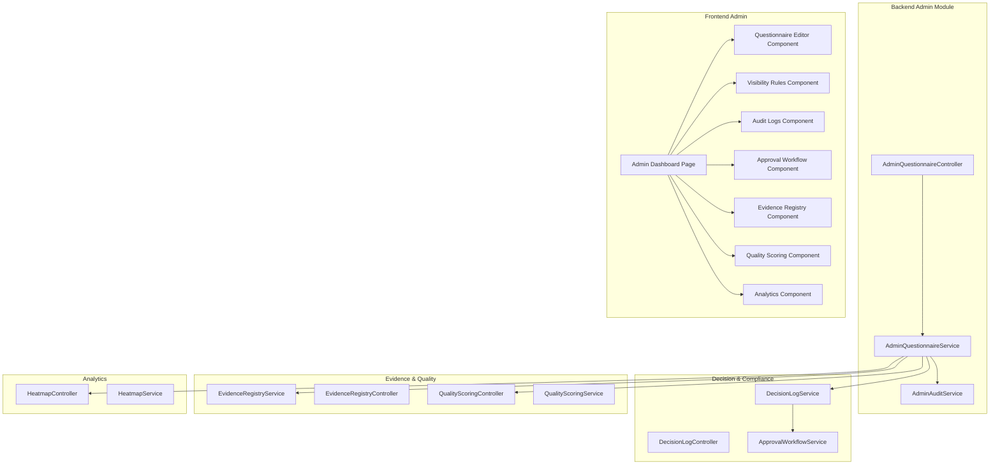
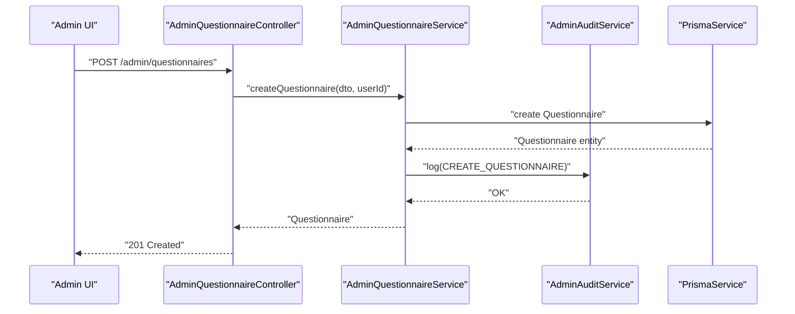
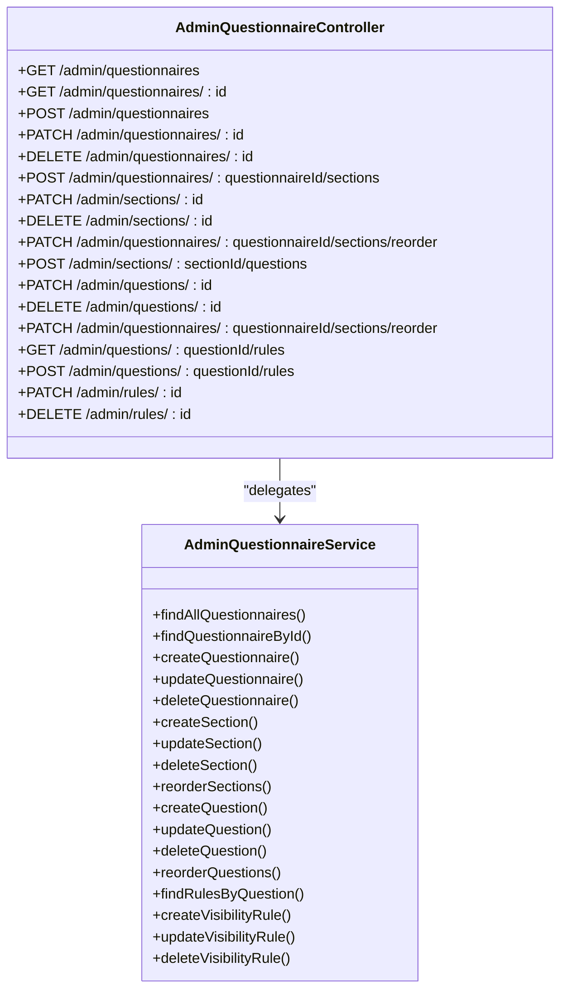
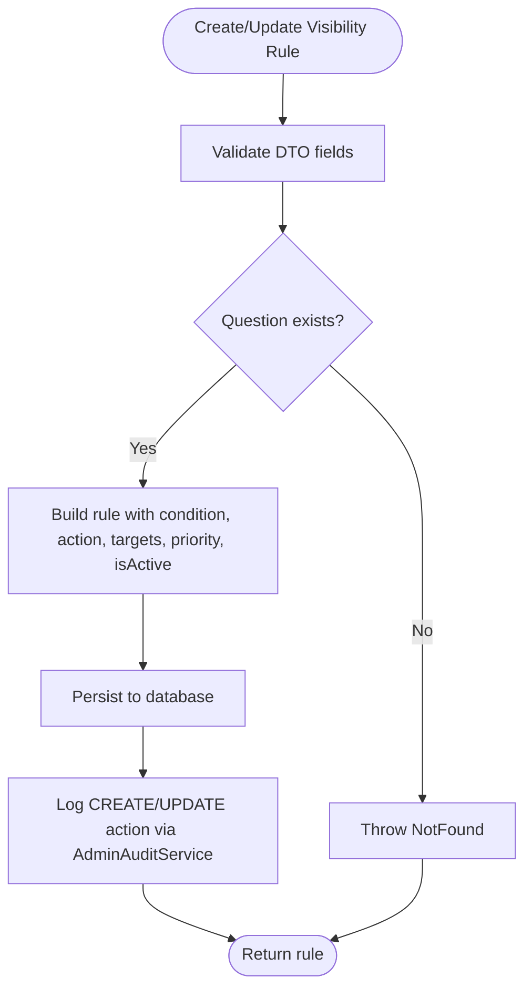
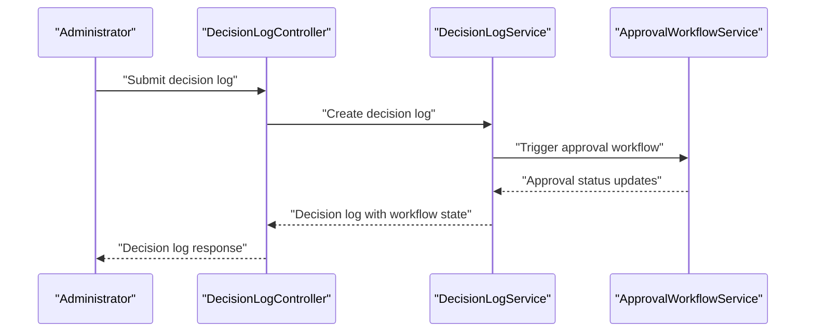
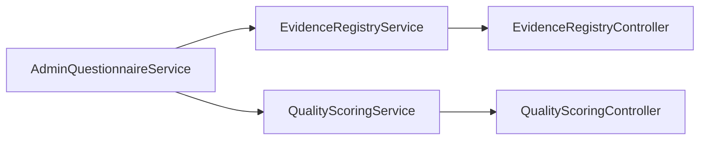
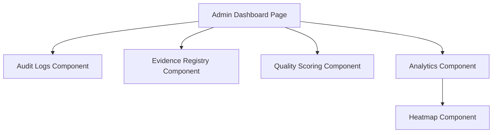
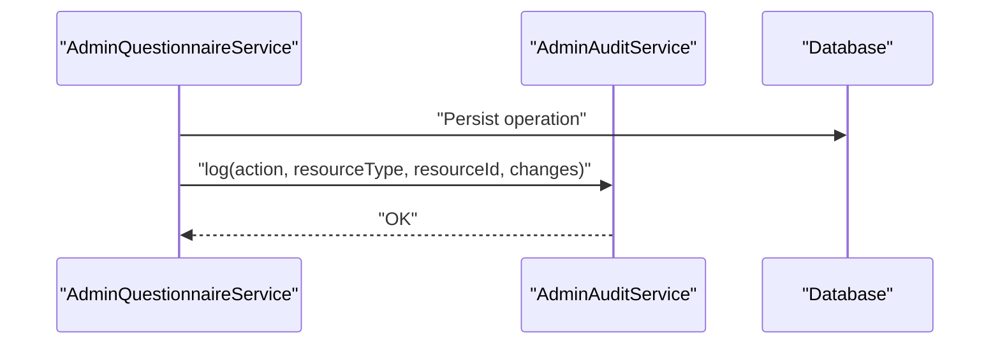
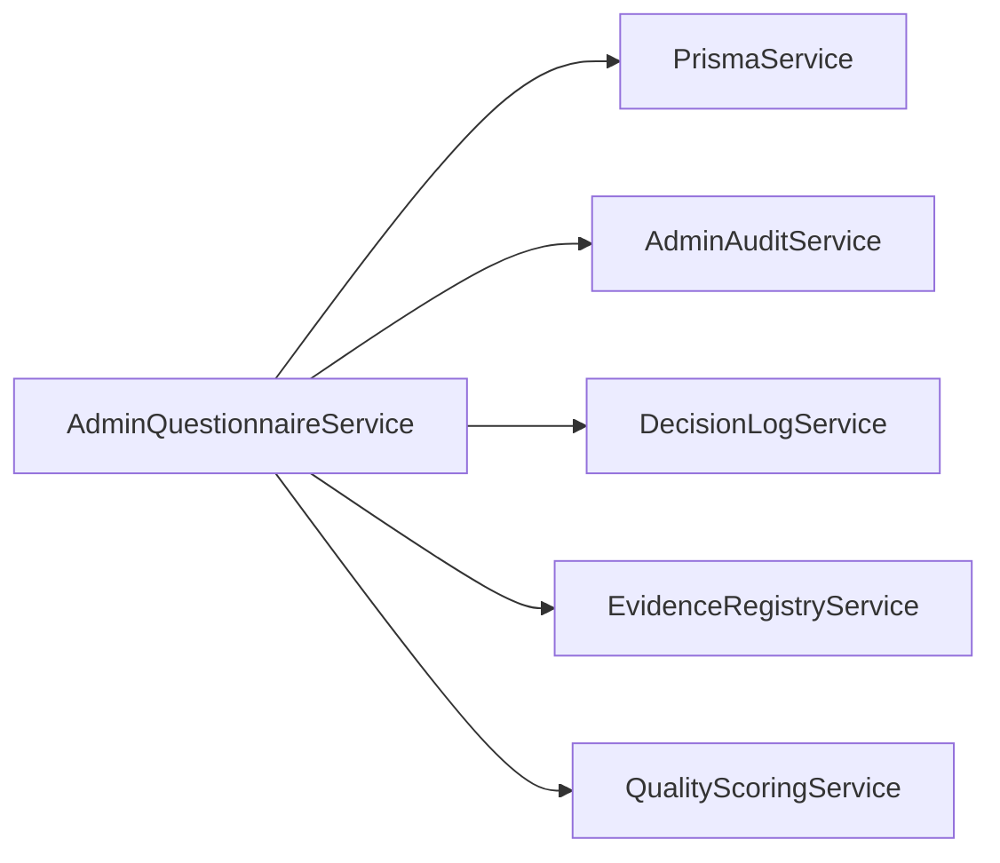

# Administrative Capabilities

<cite>
**Referenced Files in This Document**
- [admin.module.ts](file://apps/api/src/modules/admin/admin.module.ts)
- [admin-questionnaire.controller.ts](file://apps/api/src/modules/admin/controllers/admin-questionnaire.controller.ts)
- [admin-questionnaire.service.ts](file://apps/api/src/modules/admin/services/admin-questionnaire.service.ts)
- [admin-audit.service.ts](file://apps/api/src/modules/admin/services/admin-audit.service.ts)
- [create-questionnaire.dto.ts](file://apps/api/src/modules/admin/dto/create-questionnaire.dto.ts)
- [update-questionnaire.dto.ts](file://apps/api/src/modules/admin/dto/update-questionnaire.dto.ts)
- [create-visibility-rule.dto.ts](file://apps/api/src/modules/admin/dto/create-visibility-rule.dto.ts)
- [decision-log.service.ts](file://apps/api/src/modules/decision-log/decision-log.service.ts)
- [decision-log.controller.ts](file://apps/api/src/modules/decision-log/decision-log.controller.ts)
- [approval-workflow.service.ts](file://apps/api/src/modules/decision-log/approval-workflow.service.ts)
- [evidence-registry.service.ts](file://apps/api/src/modules/evidence-registry/evidence-registry.service.ts)
- [evidence-registry.controller.ts](file://apps/api/src/modules/evidence-registry/evidence-registry.controller.ts)
- [quality-scoring.service.ts](file://apps/api/src/modules/quality-scoring/quality-scoring.service.ts)
- [quality-scoring.controller.ts](file://apps/api/src/modules/quality-scoring/quality-scoring.controller.ts)
- [heatmap.controller.ts](file://apps/api/src/modules/heatmap/heatmap.controller.ts)
- [heatmap.service.ts](file://apps/api/src/modules/heatmap/heatmap.service.ts)
- [admin.ts](file://apps/web/src/api/admin.ts)
- [admin-dashboard.tsx](file://apps/web/src/pages/admin/dashboard.tsx)
- [admin-questionnaire-editor.tsx](file://apps/web/src/components/admin/questionnaire-editor.tsx)
- [admin-visibility-rules.tsx](file://apps/web/src/components/admin/visibility-rules.tsx)
- [admin-audit-logs.tsx](file://apps/web/src/components/admin/audit-logs.tsx)
- [admin-approval-workflow.tsx](file://apps/web/src/components/admin/approval-workflow.tsx)
- [admin-evidence-registry.tsx](file://apps/web/src/components/admin/evidence-registry.tsx)
- [admin-quality-scoring.tsx](file://apps/web/src/components/admin/quality-scoring.tsx)
- [admin-analytics.tsx](file://apps/web/src/components/admin/analytics.tsx)
- [admin-permissions.tsx](file://apps/web/src/components/admin/permissions.tsx)
</cite>

## Table of Contents
1. [Introduction](#introduction)
2. [Project Structure](#project-structure)
3. [Core Components](#core-components)
4. [Architecture Overview](#architecture-overview)
5. [Detailed Component Analysis](#detailed-component-analysis)
6. [Dependency Analysis](#dependency-analysis)
7. [Performance Considerations](#performance-considerations)
8. [Troubleshooting Guide](#troubleshooting-guide)
9. [Conclusion](#conclusion)

## Introduction
This document describes the administrative system capabilities of the Quiz-to-Build platform. It focuses on questionnaire administration (creation, modification, visibility rules), document review and approval workflows, administrative decision-making tools, evidence registry administration, quality scoring oversight, compliance monitoring, administrative dashboards and reporting, backend administrative services, workflow automation, and audit trails. It also covers frontend administrative interfaces, bulk operations, administrative user interfaces, approval workflow systems, escalation procedures, administrative permissions, integration with decision logging, quality assurance, and compliance frameworks.

## Project Structure
The administrative domain is primarily implemented in the NestJS backend under apps/api/src/modules/admin, with supporting modules for decision logging, evidence registry, quality scoring, and heatmap analytics. The frontend provides administrative pages and components under apps/web/src/pages/admin and apps/web/src/components/admin.

**Diagram sources**
- [admin-questionnaire.controller.ts:1-275](file://apps/api/src/modules/admin/controllers/admin-questionnaire.controller.ts#L1-L275)
- [admin-questionnaire.service.ts:1-575](file://apps/api/src/modules/admin/services/admin-questionnaire.service.ts#L1-L575)
- [admin-audit.service.ts](file://apps/api/src/modules/admin/services/admin-audit.service.ts)
- [decision-log.service.ts](file://apps/api/src/modules/decision-log/decision-log.service.ts)
- [decision-log.controller.ts](file://apps/api/src/modules/decision-log/decision-log.controller.ts)
- [approval-workflow.service.ts](file://apps/api/src/modules/decision-log/approval-workflow.service.ts)
- [evidence-registry.service.ts](file://apps/api/src/modules/evidence-registry/evidence-registry.service.ts)
- [evidence-registry.controller.ts](file://apps/api/src/modules/evidence-registry/evidence-registry.controller.ts)
- [quality-scoring.controller.ts](file://apps/api/src/modules/quality-scoring/quality-scoring.controller.ts)
- [quality-scoring.service.ts](file://apps/api/src/modules/quality-scoring/quality-scoring.service.ts)
- [heatmap.controller.ts](file://apps/api/src/modules/heatmap/heatmap.controller.ts)
- [heatmap.service.ts](file://apps/api/src/modules/heatmap/heatmap.service.ts)
- [admin-dashboard.tsx](file://apps/web/src/pages/admin/dashboard.tsx)
- [admin-questionnaire-editor.tsx](file://apps/web/src/components/admin/questionnaire-editor.tsx)
- [admin-visibility-rules.tsx](file://apps/web/src/components/admin/visibility-rules.tsx)
- [admin-audit-logs.tsx](file://apps/web/src/components/admin/audit-logs.tsx)
- [admin-approval-workflow.tsx](file://apps/web/src/components/admin/approval-workflow.tsx)
- [admin-evidence-registry.tsx](file://apps/web/src/components/admin/evidence-registry.tsx)
- [admin-quality-scoring.tsx](file://apps/web/src/components/admin/quality-scoring.tsx)
- [admin-analytics.tsx](file://apps/web/src/components/admin/analytics.tsx)

**Section sources**
- [admin.module.ts:1-14](file://apps/api/src/modules/admin/admin.module.ts#L1-L14)
- [admin-questionnaire.controller.ts:1-275](file://apps/api/src/modules/admin/controllers/admin-questionnaire.controller.ts#L1-L275)
- [admin-questionnaire.service.ts:1-575](file://apps/api/src/modules/admin/services/admin-questionnaire.service.ts#L1-L575)

## Core Components
- AdminQuestionnaireController: Exposes REST endpoints for questionnaire, section, question, and visibility rule administration with role-based access control.
- AdminQuestionnaireService: Implements CRUD operations, ordering, soft deletion, and audit logging for administrative resources.
- AdminAuditService: Centralized audit logging for administrative actions.
- DecisionLogService and ApprovalWorkflowService: Provide decision logging and approval workflow orchestration.
- EvidenceRegistryService and QualityScoringService: Support evidence administration and quality scoring oversight.
- HeatmapService: Provides analytics for response distribution and engagement metrics.
- Frontend Admin Pages and Components: Offer administrative dashboards, editors, and monitoring views.

**Section sources**
- [admin-questionnaire.controller.ts:35-275](file://apps/api/src/modules/admin/controllers/admin-questionnaire.controller.ts#L35-L275)
- [admin-questionnaire.service.ts:35-575](file://apps/api/src/modules/admin/services/admin-questionnaire.service.ts#L35-L575)
- [admin-audit.service.ts](file://apps/api/src/modules/admin/services/admin-audit.service.ts)
- [decision-log.service.ts](file://apps/api/src/modules/decision-log/decision-log.service.ts)
- [approval-workflow.service.ts](file://apps/api/src/modules/decision-log/approval-workflow.service.ts)
- [evidence-registry.service.ts](file://apps/api/src/modules/evidence-registry/evidence-registry.service.ts)
- [quality-scoring.service.ts](file://apps/api/src/modules/quality-scoring/quality-scoring.service.ts)
- [heatmap.service.ts](file://apps/api/src/modules/heatmap/heatmap.service.ts)

## Architecture Overview
The administrative system follows a layered architecture:
- Controllers enforce authentication and roles, delegate to services.
- Services encapsulate business logic, coordinate with Prisma, and trigger audit logs.
- DTOs validate and document request/response schemas.
- Supporting modules integrate decision logging, evidence registry, quality scoring, and analytics.
- Frontend provides admin pages and components for editing, reviewing, and monitoring.

**Diagram sources**
- [admin-questionnaire.controller.ts:72-81](file://apps/api/src/modules/admin/controllers/admin-questionnaire.controller.ts#L72-L81)
- [admin-questionnaire.service.ts:94-116](file://apps/api/src/modules/admin/services/admin-questionnaire.service.ts#L94-L116)
- [admin-audit.service.ts](file://apps/api/src/modules/admin/services/admin-audit.service.ts)

## Detailed Component Analysis

### Questionnaire Administration
Administrative capabilities include listing, retrieving, creating, updating, and soft-deleting questionnaires, sections, and questions, plus reordering and managing visibility rules.

Key features:
- List and paginate questionnaires with counts for sections and sessions.
- Retrieve full questionnaire details including nested sections and questions with visibility rules.
- Create/update questionnaires with metadata, industry, estimated time, and default flags.
- Manage sections and questions with auto-ordering and metadata support.
- Reorder sections and questions within their containers.
- Soft-delete questionnaires and sections/questions with constraints to prevent data corruption.
- Visibility rules management with JSON conditions, actions, priorities, and activation flags.

**Diagram sources**
- [admin-questionnaire.controller.ts:46-273](file://apps/api/src/modules/admin/controllers/admin-questionnaire.controller.ts#L46-L273)
- [admin-questionnaire.service.ts:46-573](file://apps/api/src/modules/admin/services/admin-questionnaire.service.ts#L46-L573)

**Section sources**
- [admin-questionnaire.controller.ts:46-273](file://apps/api/src/modules/admin/controllers/admin-questionnaire.controller.ts#L46-L273)
- [admin-questionnaire.service.ts:46-573](file://apps/api/src/modules/admin/services/admin-questionnaire.service.ts#L46-L573)
- [create-questionnaire.dto.ts:4-36](file://apps/api/src/modules/admin/dto/create-questionnaire.dto.ts#L4-L36)
- [update-questionnaire.dto.ts:6-11](file://apps/api/src/modules/admin/dto/update-questionnaire.dto.ts#L6-L11)

### Visibility Rule Management
Visibility rules enable dynamic show/hide logic for questions based on answers to other questions. Rules support:
- JSON condition structures with logical operators and question comparisons.
- Actions (e.g., SHOW/HIDE).
- Target question IDs affected by the rule.
- Priority and activation flags.

**Diagram sources**
- [admin-questionnaire.controller.ts:241-247](file://apps/api/src/modules/admin/controllers/admin-questionnaire.controller.ts#L241-L247)
- [admin-questionnaire.service.ts:485-518](file://apps/api/src/modules/admin/services/admin-questionnaire.service.ts#L485-L518)
- [create-visibility-rule.dto.ts:17-50](file://apps/api/src/modules/admin/dto/create-visibility-rule.dto.ts#L17-L50)

**Section sources**
- [admin-questionnaire.controller.ts:227-273](file://apps/api/src/modules/admin/controllers/admin-questionnaire.controller.ts#L227-L273)
- [admin-questionnaire.service.ts:470-573](file://apps/api/src/modules/admin/services/admin-questionnaire.service.ts#L470-L573)
- [create-visibility-rule.dto.ts:17-50](file://apps/api/src/modules/admin/dto/create-visibility-rule.dto.ts#L17-L50)

### Document Review Workflow and Approval Processes
Decision logging and approval workflows provide structured review and approval processes for administrative actions and generated documents.

**Diagram sources**
- [decision-log.controller.ts](file://apps/api/src/modules/decision-log/decision-log.controller.ts)
- [decision-log.service.ts](file://apps/api/src/modules/decision-log/decision-log.service.ts)
- [approval-workflow.service.ts](file://apps/api/src/modules/decision-log/approval-workflow.service.ts)

**Section sources**
- [decision-log.controller.ts](file://apps/api/src/modules/decision-log/decision-log.controller.ts)
- [decision-log.service.ts](file://apps/api/src/modules/decision-log/decision-log.service.ts)
- [approval-workflow.service.ts](file://apps/api/src/modules/decision-log/approval-workflow.service.ts)

### Evidence Registry Administration and Quality Scoring Oversight
Evidence registry and quality scoring modules support oversight of evidence administration and quality metrics.

**Diagram sources**
- [evidence-registry.service.ts](file://apps/api/src/modules/evidence-registry/evidence-registry.service.ts)
- [evidence-registry.controller.ts](file://apps/api/src/modules/evidence-registry/evidence-registry.controller.ts)
- [quality-scoring.service.ts](file://apps/api/src/modules/quality-scoring/quality-scoring.service.ts)
- [quality-scoring.controller.ts](file://apps/api/src/modules/quality-scoring/quality-scoring.controller.ts)
- [admin-questionnaire.service.ts:37-40](file://apps/api/src/modules/admin/services/admin-questionnaire.service.ts#L37-L40)

**Section sources**
- [evidence-registry.service.ts](file://apps/api/src/modules/evidence-registry/evidence-registry.service.ts)
- [quality-scoring.service.ts](file://apps/api/src/modules/quality-scoring/quality-scoring.service.ts)

### Administrative Dashboard and Reporting
The administrative dashboard aggregates key insights and operational controls:
- Overview charts and summaries
- Recent activity and audit logs
- Evidence registry status
- Quality scoring metrics
- Heatmap analytics for engagement

**Diagram sources**
- [admin-dashboard.tsx](file://apps/web/src/pages/admin/dashboard.tsx)
- [admin-audit-logs.tsx](file://apps/web/src/components/admin/audit-logs.tsx)
- [admin-evidence-registry.tsx](file://apps/web/src/components/admin/evidence-registry.tsx)
- [admin-quality-scoring.tsx](file://apps/web/src/components/admin/quality-scoring.tsx)
- [admin-analytics.tsx](file://apps/web/src/components/admin/analytics.tsx)
- [heatmap.controller.ts](file://apps/api/src/modules/heatmap/heatmap.controller.ts)
- [heatmap.service.ts](file://apps/api/src/modules/heatmap/heatmap.service.ts)

**Section sources**
- [admin-dashboard.tsx](file://apps/web/src/pages/admin/dashboard.tsx)
- [admin-audit-logs.tsx](file://apps/web/src/components/admin/audit-logs.tsx)
- [admin-evidence-registry.tsx](file://apps/web/src/components/admin/evidence-registry.tsx)
- [admin-quality-scoring.tsx](file://apps/web/src/components/admin/quality-scoring.tsx)
- [admin-analytics.tsx](file://apps/web/src/components/admin/analytics.tsx)
- [heatmap.service.ts](file://apps/api/src/modules/heatmap/heatmap.service.ts)

### Backend Administrative Services and Audit Trail
Administrative actions are logged centrally to maintain an audit trail:
- CREATE/UPDATE/DELETE actions for questionnaires, sections, questions, and visibility rules.
- Changes captured before and after for updates.
- Soft deletes recorded with prior state.

**Diagram sources**
- [admin-questionnaire.service.ts:107-113](file://apps/api/src/modules/admin/services/admin-questionnaire.service.ts#L107-L113)
- [admin-questionnaire.service.ts:144-150](file://apps/api/src/modules/admin/services/admin-questionnaire.service.ts#L144-L150)
- [admin-questionnaire.service.ts:171-177](file://apps/api/src/modules/admin/services/admin-questionnaire.service.ts#L171-L177)
- [admin-audit.service.ts](file://apps/api/src/modules/admin/services/admin-audit.service.ts)

**Section sources**
- [admin-questionnaire.service.ts:107-177](file://apps/api/src/modules/admin/services/admin-questionnaire.service.ts#L107-L177)
- [admin-audit.service.ts](file://apps/api/src/modules/admin/services/admin-audit.service.ts)

### Frontend Administrative Interfaces and Bulk Operations
Frontend components provide:
- Questionnaire editor for creating and modifying questionnaires, sections, and questions.
- Visibility rules editor for configuring dynamic visibility logic.
- Audit logs viewer for reviewing administrative actions.
- Evidence registry management interface.
- Quality scoring dashboard.
- Analytics and heatmap visualizations.
- Permissions and role management components.

Bulk operations are supported through:
- Reorder endpoints for sections and questions.
- Batch updates via transactional operations in services.

**Section sources**
- [admin-questionnaire-editor.tsx](file://apps/web/src/components/admin/questionnaire-editor.tsx)
- [admin-visibility-rules.tsx](file://apps/web/src/components/admin/visibility-rules.tsx)
- [admin-audit-logs.tsx](file://apps/web/src/components/admin/audit-logs.tsx)
- [admin-evidence-registry.tsx](file://apps/web/src/components/admin/evidence-registry.tsx)
- [admin-quality-scoring.tsx](file://apps/web/src/components/admin/quality-scoring.tsx)
- [admin-analytics.tsx](file://apps/web/src/components/admin/analytics.tsx)
- [admin-permissions.tsx](file://apps/web/src/components/admin/permissions.tsx)

### Approval Workflow System and Escalation Procedures
Approval workflows integrate with decision logging to manage administrative approvals:
- Submission of decisions triggers workflow initiation.
- Workflow service manages approval stages and escalations.
- Decision log records current workflow state and history.

**Section sources**
- [decision-log.controller.ts](file://apps/api/src/modules/decision-log/decision-log.controller.ts)
- [decision-log.service.ts](file://apps/api/src/modules/decision-log/decision-log.service.ts)
- [approval-workflow.service.ts](file://apps/api/src/modules/decision-log/approval-workflow.service.ts)

### Administrative Permissions
Controllers enforce role-based access control:
- ADMIN and SUPER_ADMIN roles for most operations.
- SUPER_ADMIN required for destructive operations (soft-delete).
- JWT authentication guard and roles guard applied to all admin endpoints.

**Section sources**
- [admin-questionnaire.controller.ts:47-98](file://apps/api/src/modules/admin/controllers/admin-questionnaire.controller.ts#L47-L98)

### Integration with Decision Logging, QA, and Compliance
- Decision logging captures administrative decisions and workflow states.
- Quality scoring integrates with administrative oversight for compliance metrics.
- Audit trail supports compliance by maintaining immutable logs of administrative actions.

**Section sources**
- [decision-log.service.ts](file://apps/api/src/modules/decision-log/decision-log.service.ts)
- [quality-scoring.service.ts](file://apps/api/src/modules/quality-scoring/quality-scoring.service.ts)
- [admin-questionnaire.service.ts:107-177](file://apps/api/src/modules/admin/services/admin-questionnaire.service.ts#L107-L177)

### Administrative APIs and Bulk Data Operations
Representative API endpoints:
- GET /admin/questionnaires (paginated)
- GET /admin/questionnaires/:id
- POST /admin/questionnaires
- PATCH /admin/questionnaires/:id
- DELETE /admin/questionnaires/:id (SUPER_ADMIN)
- POST /admin/questionnaires/:questionnaireId/sections
- PATCH /admin/sections/:id
- DELETE /admin/sections/:id (SUPER_ADMIN)
- PATCH /admin/questionnaires/:questionnaireId/sections/reorder
- POST /admin/sections/:sectionId/questions
- PATCH /admin/questions/:id
- DELETE /admin/questions/:id (SUPER_ADMIN)
- PATCH /admin/questionnaires/:questionnaireId/sections/reorder
- GET /admin/questions/:questionId/rules
- POST /admin/questions/:questionId/rules
- PATCH /admin/rules/:id
- DELETE /admin/rules/:id

Bulk operations:
- Reorder endpoints accept arrays of items to update order indices atomically.
- Transactional updates ensure consistency during bulk changes.

**Section sources**
- [admin-questionnaire.controller.ts:46-273](file://apps/api/src/modules/admin/controllers/admin-questionnaire.controller.ts#L46-L273)
- [admin-questionnaire.service.ts:295-302](file://apps/api/src/modules/admin/services/admin-questionnaire.service.ts#L295-L302)
- [admin-questionnaire.service.ts:446-453](file://apps/api/src/modules/admin/services/admin-questionnaire.service.ts#L446-L453)

## Dependency Analysis
Administrative services depend on:
- PrismaService for database operations.
- AdminAuditService for centralized logging.
- DecisionLogService and ApprovalWorkflowService for compliance workflows.
- EvidenceRegistryService and QualityScoringService for oversight.

**Diagram sources**
- [admin-questionnaire.service.ts:37-40](file://apps/api/src/modules/admin/services/admin-questionnaire.service.ts#L37-L40)

**Section sources**
- [admin-questionnaire.service.ts:37-40](file://apps/api/src/modules/admin/services/admin-questionnaire.service.ts#L37-L40)

## Performance Considerations
- Use pagination for listing endpoints to avoid large payloads.
- Prefer batch reorder operations to minimize round trips.
- Leverage database transactions for bulk updates to ensure atomicity.
- Cache frequently accessed questionnaire metadata where appropriate.
- Monitor audit log volume and retention policies for storage efficiency.

## Troubleshooting Guide
Common issues and resolutions:
- Not Found errors when operating on missing resources (questionnaire, section, question, rule).
- Bad Request errors when attempting to delete entities with dependent records (sections with questions, questions with responses).
- Role/permission errors when using SUPER_ADMIN-only endpoints.
- Validation errors due to DTO constraints (e.g., min/max values, UUID format, enum values).

Operational checks:
- Verify JWT authentication and role assignment.
- Confirm Prisma connectivity and migrations.
- Review audit logs for recent administrative actions.
- Inspect decision log workflow states for approval bottlenecks.

**Section sources**
- [admin-questionnaire.service.ts:265-269](file://apps/api/src/modules/admin/services/admin-questionnaire.service.ts#L265-L269)
- [admin-questionnaire.service.ts:416-420](file://apps/api/src/modules/admin/services/admin-questionnaire.service.ts#L416-L420)
- [admin-questionnaire.controller.ts:96-107](file://apps/api/src/modules/admin/controllers/admin-questionnaire.controller.ts#L96-L107)
- [admin-questionnaire.controller.ts:139-151](file://apps/api/src/modules/admin/controllers/admin-questionnaire.controller.ts#L139-L151)
- [admin-questionnaire.controller.ts:196-208](file://apps/api/src/modules/admin/controllers/admin-questionnaire.controller.ts#L196-L208)

## Conclusion
The administrative system provides comprehensive capabilities for questionnaire lifecycle management, dynamic visibility rule configuration, decision logging and approval workflows, evidence registry oversight, quality scoring metrics, and analytics-driven dashboards. With centralized audit logging, role-based access control, and transactional operations, it ensures data integrity, compliance, and operational transparency. The frontend components deliver efficient administrative interfaces for day-to-day management and oversight.