# Authentication & Authorization

<cite>
**Referenced Files in This Document**
- [auth.module.ts](file://apps/api/src/modules/auth/auth.module.ts)
- [auth.service.ts](file://apps/api/src/modules/auth/auth.service.ts)
- [auth.controller.ts](file://apps/api/src/modules/auth/auth.controller.ts)
- [jwt.strategy.ts](file://apps/api/src/modules/auth/strategies/jwt.strategy.ts)
- [jwt-auth.guard.ts](file://apps/api/src/modules/auth/guards/jwt-auth.guard.ts)
- [roles.guard.ts](file://apps/api/src/modules/auth/guards/roles.guard.ts)
- [oauth.service.ts](file://apps/api/src/modules/auth/oauth/oauth.service.ts)
- [oauth.controller.ts](file://apps/api/src/modules/auth/oauth/oauth.controller.ts)
- [mfa.service.ts](file://apps/api/src/modules/auth/mfa/mfa.service.ts)
- [csrf.guard.ts](file://apps/api/src/common/guards/csrf.guard.ts)
- [index.ts](file://apps/api/src/common/guards/index.ts)
- [subscription.guard.ts](file://apps/api/src/common/guards/subscription.guard.ts)
- [configuration.ts](file://apps/api/src/config/configuration.ts)
- [app.module.ts](file://apps/api/src/app.module.ts)
- [auth.ts](file://apps/web/src/api/auth.ts)
- [stores/auth.ts](file://apps/web/src/stores/auth.ts)
- [pages/auth/LoginPage.tsx](file://apps/web/src/pages/auth/LoginPage.tsx)
- [pages/auth/RegisterPage.tsx](file://apps/web/src/pages/auth/RegisterPage.tsx)
- [pages/auth/ForgotPasswordPage.tsx](file://apps/web/src/pages/auth/ForgotPasswordPage.tsx)
- [pages/auth/ResetPasswordPage.tsx](file://apps/web/src/pages/auth/ResetPasswordPage.tsx)
- [pages/auth/MfaLoginPage.tsx](file://apps/web/src/pages/auth/MfaLoginPage.tsx)
- [pages/auth/SettingsPage.tsx](file://apps/web/src/pages/auth/SettingsPage.tsx)
- [schema.prisma](file://prisma/schema.prisma)
</cite>

## Table of Contents
1. [Introduction](#introduction)
2. [Project Structure](#project-structure)
3. [Core Components](#core-components)
4. [Architecture Overview](#architecture-overview)
5. [Detailed Component Analysis](#detailed-component-analysis)
6. [Dependency Analysis](#dependency-analysis)
7. [Performance Considerations](#performance-considerations)
8. [Troubleshooting Guide](#troubleshooting-guide)
9. [Conclusion](#conclusion)
10. [Appendices](#appendices)

## Introduction
This document provides comprehensive documentation for the authentication and authorization system. It covers JWT-based authentication, token lifecycle management, refresh token mechanisms, OAuth integration with external providers, social login capabilities, Multi-Factor Authentication (MFA) with TOTP verification, role-based access control (RBAC), authentication strategies, middleware integration, and security considerations. It also documents frontend authentication components, login/logout flows, session management, protected routes, role decorators, and authentication guards, along with best practices for token expiration handling and secure credential storage.

## Project Structure
The authentication subsystem is primarily implemented in the NestJS backend under apps/api/src/modules/auth and integrated with common guards and configuration. Frontend components reside in apps/web/src/pages/auth and supporting stores/api clients.

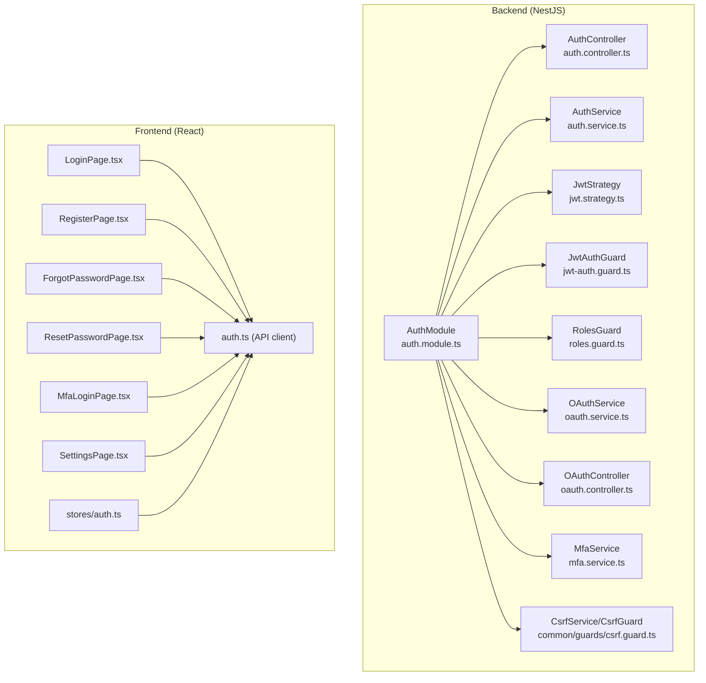

**Diagram sources**
- [auth.module.ts:17-52](file://apps/api/src/modules/auth/auth.module.ts#L17-L52)
- [auth.controller.ts:31-171](file://apps/api/src/modules/auth/auth.controller.ts#L31-L171)
- [auth.service.ts:37-507](file://apps/api/src/modules/auth/auth.service.ts#L37-L507)
- [jwt.strategy.ts:7-34](file://apps/api/src/modules/auth/strategies/jwt.strategy.ts#L7-L34)
- [jwt-auth.guard.ts:14-64](file://apps/api/src/modules/auth/guards/jwt-auth.guard.ts#L14-L64)
- [roles.guard.ts:7-37](file://apps/api/src/modules/auth/guards/roles.guard.ts#L7-L37)
- [oauth.service.ts:56-357](file://apps/api/src/modules/auth/oauth/oauth.service.ts#L56-L357)
- [oauth.controller.ts:51-144](file://apps/api/src/modules/auth/oauth/oauth.controller.ts#L51-L144)
- [mfa.service.ts:22-250](file://apps/api/src/modules/auth/mfa/mfa.service.ts#L22-L250)
- [csrf.guard.ts:1-200](file://apps/api/src/common/guards/csrf.guard.ts#L1-L200)
- [auth.ts](file://apps/web/src/api/auth.ts)
- [stores/auth.ts](file://apps/web/src/stores/auth.ts)
- [pages/auth/LoginPage.tsx](file://apps/web/src/pages/auth/LoginPage.tsx)
- [pages/auth/RegisterPage.tsx](file://apps/web/src/pages/auth/RegisterPage.tsx)
- [pages/auth/ForgotPasswordPage.tsx](file://apps/web/src/pages/auth/ForgotPasswordPage.tsx)
- [pages/auth/ResetPasswordPage.tsx](file://apps/web/src/pages/auth/ResetPasswordPage.tsx)
- [pages/auth/MfaLoginPage.tsx](file://apps/web/src/pages/auth/MfaLoginPage.tsx)
- [pages/auth/SettingsPage.tsx](file://apps/web/src/pages/auth/SettingsPage.tsx)

**Section sources**
- [auth.module.ts:17-52](file://apps/api/src/modules/auth/auth.module.ts#L17-L52)
- [auth.controller.ts:31-171](file://apps/api/src/modules/auth/auth.controller.ts#L31-L171)
- [auth.service.ts:37-507](file://apps/api/src/modules/auth/auth.service.ts#L37-L507)
- [jwt.strategy.ts:7-34](file://apps/api/src/modules/auth/strategies/jwt.strategy.ts#L7-L34)
- [jwt-auth.guard.ts:14-64](file://apps/api/src/modules/auth/guards/jwt-auth.guard.ts#L14-L64)
- [roles.guard.ts:7-37](file://apps/api/src/modules/auth/guards/roles.guard.ts#L7-L37)
- [oauth.service.ts:56-357](file://apps/api/src/modules/auth/oauth/oauth.service.ts#L56-L357)
- [oauth.controller.ts:51-144](file://apps/api/src/modules/auth/oauth/oauth.controller.ts#L51-L144)
- [mfa.service.ts:22-250](file://apps/api/src/modules/auth/mfa/mfa.service.ts#L22-L250)
- [csrf.guard.ts:1-200](file://apps/api/src/common/guards/csrf.guard.ts#L1-L200)

## Core Components
- AuthModule initializes Passport, JWT, and registers providers/controllers for authentication, OAuth, and MFA.
- AuthService handles registration, login, token generation, refresh, logout, email verification, password reset, and security helpers.
- AuthController exposes endpoints for registration, login, token refresh, logout, profile retrieval, email verification, password reset, and CSRF token generation.
- JwtStrategy validates JWT tokens and delegates user lookup to AuthService.
- JwtAuthGuard integrates JWT validation into NestJS guards and logs detailed failure information.
- RolesGuard enforces role-based access control using decorators.
- OAuthService supports Google and Microsoft OAuth, linking/unlinking accounts, and generating JWT tokens.
- OAuthController exposes endpoints for OAuth login, listing linked accounts, linking new accounts, and unlinking accounts.
- MfaService implements TOTP setup, verification, backup codes, and MFA status queries.
- CSRF protection is provided via CsrfService/CsrfGuard for state-changing requests.

**Section sources**
- [auth.module.ts:17-52](file://apps/api/src/modules/auth/auth.module.ts#L17-L52)
- [auth.service.ts:37-507](file://apps/api/src/modules/auth/auth.service.ts#L37-L507)
- [auth.controller.ts:31-171](file://apps/api/src/modules/auth/auth.controller.ts#L31-L171)
- [jwt.strategy.ts:7-34](file://apps/api/src/modules/auth/strategies/jwt.strategy.ts#L7-L34)
- [jwt-auth.guard.ts:14-64](file://apps/api/src/modules/auth/guards/jwt-auth.guard.ts#L14-L64)
- [roles.guard.ts:7-37](file://apps/api/src/modules/auth/guards/roles.guard.ts#L7-L37)
- [oauth.service.ts:56-357](file://apps/api/src/modules/auth/oauth/oauth.service.ts#L56-L357)
- [oauth.controller.ts:51-144](file://apps/api/src/modules/auth/oauth/oauth.controller.ts#L51-L144)
- [mfa.service.ts:22-250](file://apps/api/src/modules/auth/mfa/mfa.service.ts#L22-L250)
- [csrf.guard.ts:1-200](file://apps/api/src/common/guards/csrf.guard.ts#L1-L200)

## Architecture Overview
The system uses bearer token authentication with JWT for access tokens and Redis-backed refresh tokens. OAuth integrates with Google and Microsoft, while MFA adds TOTP-based second factor. Guards enforce authentication and authorization, and CSRF protection secures sensitive operations.

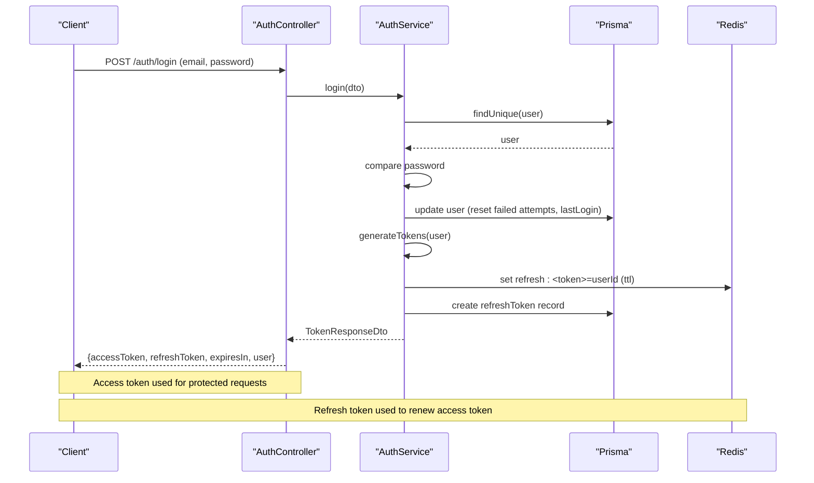

**Diagram sources**
- [auth.controller.ts:47-57](file://apps/api/src/modules/auth/auth.controller.ts#L47-L57)
- [auth.service.ts:104-145](file://apps/api/src/modules/auth/auth.service.ts#L104-L145)
- [auth.service.ts:211-247](file://apps/api/src/modules/auth/auth.service.ts#L211-L247)

**Section sources**
- [auth.controller.ts:47-57](file://apps/api/src/modules/auth/auth.controller.ts#L47-L57)
- [auth.service.ts:104-145](file://apps/api/src/modules/auth/auth.service.ts#L104-L145)
- [auth.service.ts:211-247](file://apps/api/src/modules/auth/auth.service.ts#L211-L247)

## Detailed Component Analysis

### JWT-Based Authentication Flow
- Registration: Creates user with hashed password, sets default role, sends verification email asynchronously, and issues tokens.
- Login: Validates credentials, enforces lockout policy, updates login metrics, and issues tokens.
- Token Generation: Access token signed with short TTL; refresh token stored in Redis and DB with configured TTL.
- Token Refresh: Validates refresh token presence in Redis, generates new access token, returns fixed expiresIn.
- Logout: Deletes refresh token from Redis.

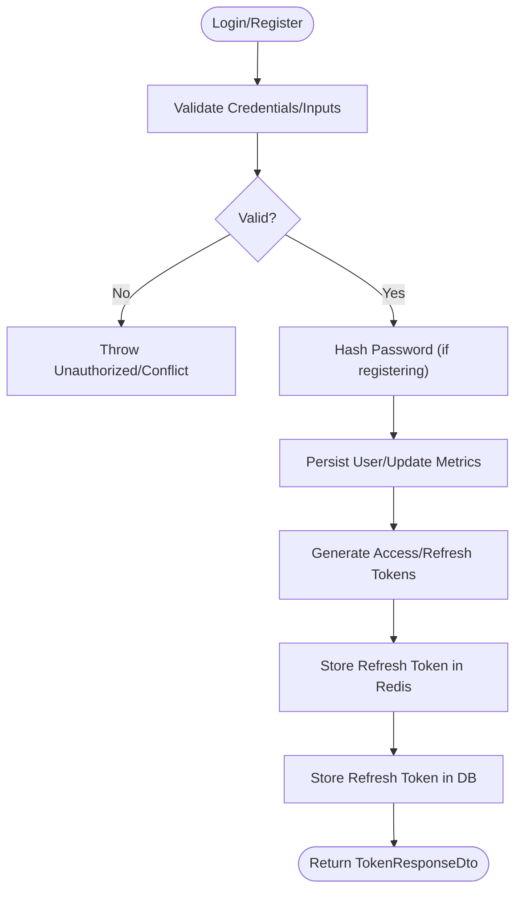

**Diagram sources**
- [auth.service.ts:64-102](file://apps/api/src/modules/auth/auth.service.ts#L64-L102)
- [auth.service.ts:104-145](file://apps/api/src/modules/auth/auth.service.ts#L104-L145)
- [auth.service.ts:211-247](file://apps/api/src/modules/auth/auth.service.ts#L211-L247)

**Section sources**
- [auth.service.ts:64-102](file://apps/api/src/modules/auth/auth.service.ts#L64-L102)
- [auth.service.ts:104-145](file://apps/api/src/modules/auth/auth.service.ts#L104-L145)
- [auth.service.ts:211-247](file://apps/api/src/modules/auth/auth.service.ts#L211-L247)

### Token Management and Refresh Mechanisms
- Access token TTL is configured and returned with each token issuance.
- Refresh token TTL is parsed from configuration and stored in Redis with TTL and in DB with expiry timestamp.
- Refresh endpoint verifies Redis presence, loads user, and signs a new access token.
- Logout revokes refresh token by deleting it from Redis.

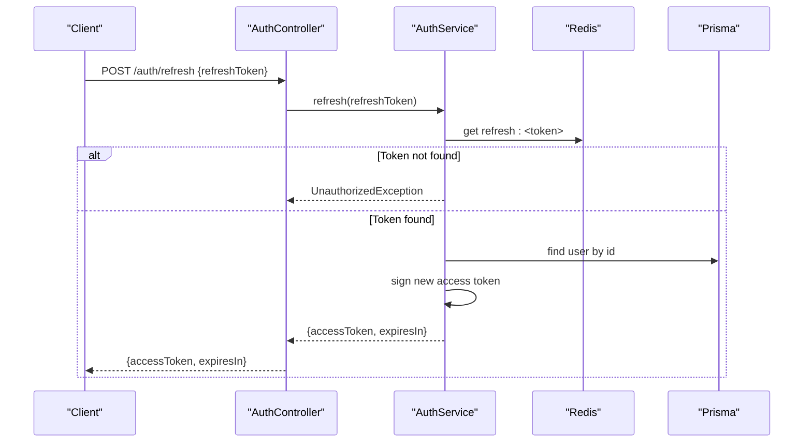

**Diagram sources**
- [auth.controller.ts:59-71](file://apps/api/src/modules/auth/auth.controller.ts#L59-L71)
- [auth.service.ts:147-177](file://apps/api/src/modules/auth/auth.service.ts#L147-L177)

**Section sources**
- [auth.controller.ts:59-71](file://apps/api/src/modules/auth/auth.controller.ts#L59-L71)
- [auth.service.ts:147-177](file://apps/api/src/modules/auth/auth.service.ts#L147-L177)

### OAuth Integration and Social Login
- Google OAuth: Verifies ID token, extracts profile, links or creates user, and issues JWT tokens.
- Microsoft OAuth: Fetches profile from Graph API using access token, links or creates user, and issues JWT tokens.
- Account linking/unlinking: Allows authenticated users to link additional OAuth accounts or unlink existing ones with safety checks.

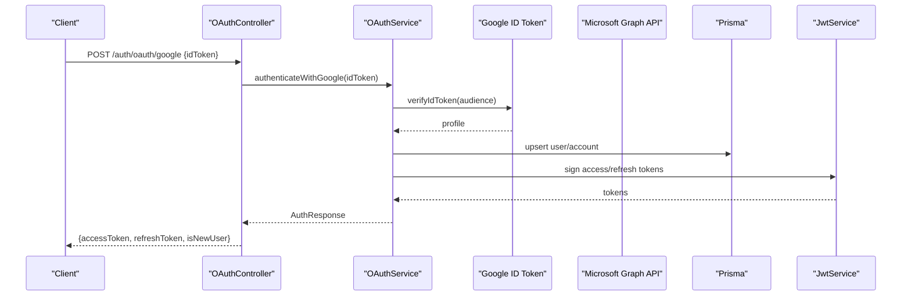

**Diagram sources**
- [oauth.controller.ts:58-65](file://apps/api/src/modules/auth/oauth/oauth.controller.ts#L58-L65)
- [oauth.service.ts:76-108](file://apps/api/src/modules/auth/oauth/oauth.service.ts#L76-L108)

**Section sources**
- [oauth.controller.ts:58-65](file://apps/api/src/modules/auth/oauth/oauth.controller.ts#L58-L65)
- [oauth.service.ts:76-108](file://apps/api/src/modules/auth/oauth/oauth.service.ts#L76-L108)

### Multi-Factor Authentication (MFA) with TOTP
- Setup: Generates TOTP secret, prepares QR code and manual key, stores secret temporarily until verification.
- Verification: Validates TOTP code; on success, enables MFA and generates backup codes.
- Backup Codes: Used as fallbacks; consumed upon use.
- Disable/Regenerate: Requires current MFA verification before changes.

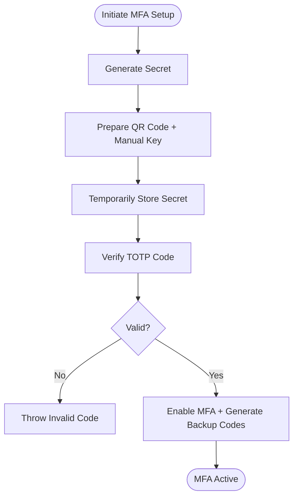

**Diagram sources**
- [mfa.service.ts:29-102](file://apps/api/src/modules/auth/mfa/mfa.service.ts#L29-L102)

**Section sources**
- [mfa.service.ts:29-102](file://apps/api/src/modules/auth/mfa/mfa.service.ts#L29-L102)
- [mfa.service.ts:107-140](file://apps/api/src/modules/auth/mfa/mfa.service.ts#L107-L140)
- [mfa.service.ts:145-169](file://apps/api/src/modules/auth/mfa/mfa.service.ts#L145-L169)
- [mfa.service.ts:174-199](file://apps/api/src/modules/auth/mfa/mfa.service.ts#L174-L199)

### Role-Based Access Control (RBAC)
- RolesGuard enforces required roles using decorators and reflects them from route handlers/classes.
- JwtAuthGuard respects a @Public() decorator to bypass authentication for specific endpoints.

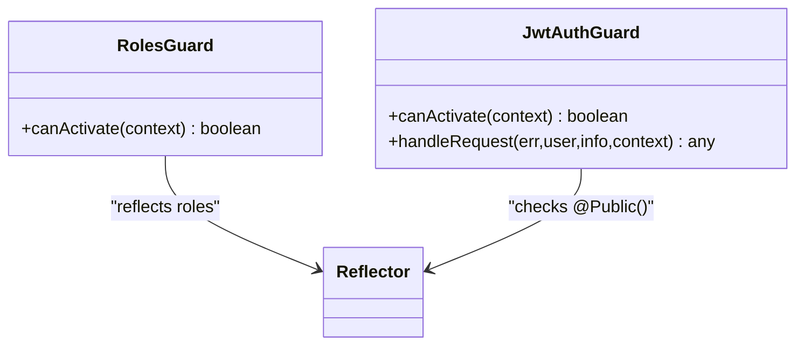

**Diagram sources**
- [roles.guard.ts:7-37](file://apps/api/src/modules/auth/guards/roles.guard.ts#L7-L37)
- [jwt-auth.guard.ts:14-64](file://apps/api/src/modules/auth/guards/jwt-auth.guard.ts#L14-L64)

**Section sources**
- [roles.guard.ts:7-37](file://apps/api/src/modules/auth/guards/roles.guard.ts#L7-L37)
- [jwt-auth.guard.ts:14-64](file://apps/api/src/modules/auth/guards/jwt-auth.guard.ts#L14-L64)

### Authentication Strategies and Middleware Integration
- JwtStrategy uses passport-jwt to extract and validate bearer tokens against configured secret.
- JwtAuthGuard integrates strategy into NestJS pipeline and enriches logs for failures.
- CsrfService/CsrfGuard provides CSRF token generation and enforcement for state-changing requests.

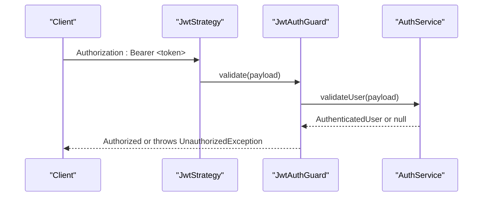

**Diagram sources**
- [jwt.strategy.ts:24-32](file://apps/api/src/modules/auth/strategies/jwt.strategy.ts#L24-L32)
- [jwt-auth.guard.ts:22-62](file://apps/api/src/modules/auth/guards/jwt-auth.guard.ts#L22-L62)
- [auth.service.ts:185-209](file://apps/api/src/modules/auth/auth.service.ts#L185-L209)

**Section sources**
- [jwt.strategy.ts:24-32](file://apps/api/src/modules/auth/strategies/jwt.strategy.ts#L24-L32)
- [jwt-auth.guard.ts:22-62](file://apps/api/src/modules/auth/guards/jwt-auth.guard.ts#L22-L62)
- [auth.service.ts:185-209](file://apps/api/src/modules/auth/auth.service.ts#L185-L209)

### Security Considerations
- Password hashing: bcrypt with configurable rounds.
- Token storage: Refresh tokens stored in Redis with TTL and audited in DB.
- Email verification: Secure tokens with expiry, non-reveal on resend.
- Password reset: Secure tokens with expiry, immediate invalidation of refresh tokens post-reset.
- Rate limiting: Throttler applied to sensitive endpoints.
- CSRF protection: Dedicated endpoint to obtain CSRF token and enforcement via guard.
- Lockout policy: Failed login attempts tracked and temporary lockout enforced.

**Section sources**
- [auth.service.ts:40-62](file://apps/api/src/modules/auth/auth.service.ts#L40-L62)
- [auth.service.ts:147-177](file://apps/api/src/modules/auth/auth.service.ts#L147-L177)
- [auth.service.ts:293-383](file://apps/api/src/modules/auth/auth.service.ts#L293-L383)
- [auth.service.ts:385-466](file://apps/api/src/modules/auth/auth.service.ts#L385-L466)
- [auth.controller.ts:50,108,120,130](file://apps/api/src/modules/auth/auth.controller.ts#L50,L108,L120,L130)
- [csrf.guard.ts:1-200](file://apps/api/src/common/guards/csrf.guard.ts#L1-L200)
- [auth.service.ts:249-268](file://apps/api/src/modules/auth/auth.service.ts#L249-L268)

### Frontend Authentication Components and Flows
- API client: Centralized auth API module for login, register, forgot/reset password, MFA, and settings.
- Stores: Auth store manages tokens, user state, and session persistence.
- Pages: Dedicated pages for login, registration, forgot password, reset password, MFA login, and settings.

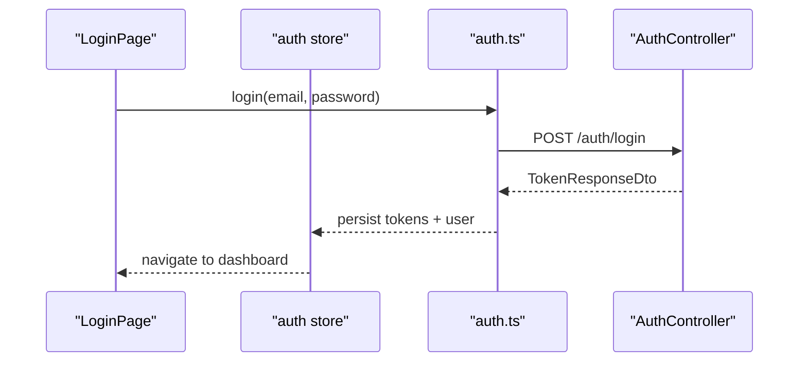

**Diagram sources**
- [pages/auth/LoginPage.tsx](file://apps/web/src/pages/auth/LoginPage.tsx)
- [stores/auth.ts](file://apps/web/src/stores/auth.ts)
- [auth.ts](file://apps/web/src/api/auth.ts)
- [auth.controller.ts:47-57](file://apps/api/src/modules/auth/auth.controller.ts#L47-L57)

**Section sources**
- [auth.ts](file://apps/web/src/api/auth.ts)
- [stores/auth.ts](file://apps/web/src/stores/auth.ts)
- [pages/auth/LoginPage.tsx](file://apps/web/src/pages/auth/LoginPage.tsx)
- [pages/auth/RegisterPage.tsx](file://apps/web/src/pages/auth/RegisterPage.tsx)
- [pages/auth/ForgotPasswordPage.tsx](file://apps/web/src/pages/auth/ForgotPasswordPage.tsx)
- [pages/auth/ResetPasswordPage.tsx](file://apps/web/src/pages/auth/ResetPasswordPage.tsx)
- [pages/auth/MfaLoginPage.tsx](file://apps/web/src/pages/auth/MfaLoginPage.tsx)
- [pages/auth/SettingsPage.tsx](file://apps/web/src/pages/auth/SettingsPage.tsx)

### Protected Routes, Role Decorators, and Guards
- Protected routes: Use JwtAuthGuard to require valid bearer tokens.
- Role decorators: Apply role-based restrictions using RolesGuard with reflected role keys.
- Public endpoints: Use @Public() decorator to bypass authentication.

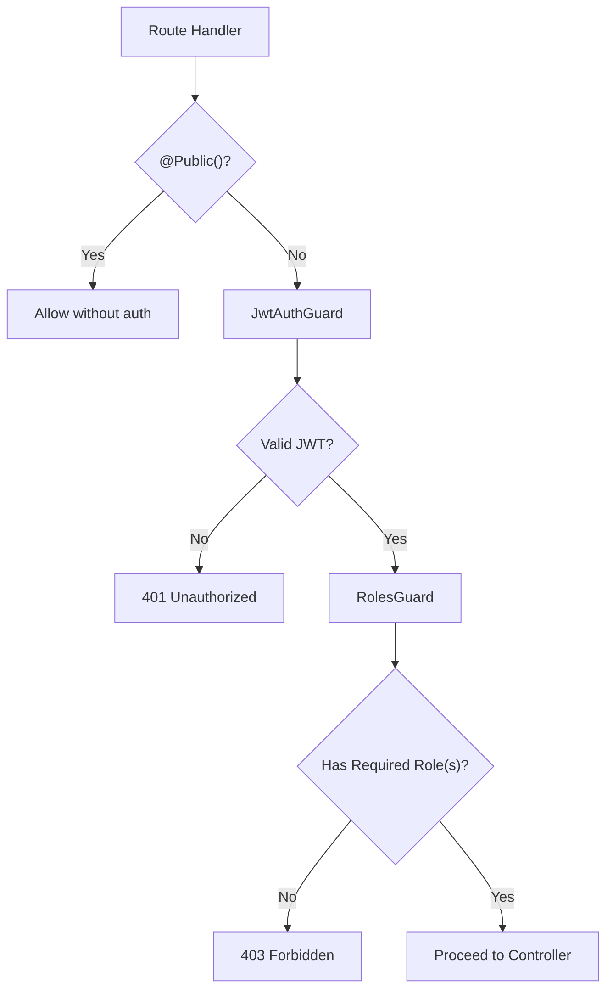

**Diagram sources**
- [jwt-auth.guard.ts:22-33](file://apps/api/src/modules/auth/guards/jwt-auth.guard.ts#L22-L33)
- [roles.guard.ts:11-35](file://apps/api/src/modules/auth/guards/roles.guard.ts#L11-L35)

**Section sources**
- [jwt-auth.guard.ts:22-33](file://apps/api/src/modules/auth/guards/jwt-auth.guard.ts#L22-L33)
- [roles.guard.ts:11-35](file://apps/api/src/modules/auth/guards/roles.guard.ts#L11-L35)

### Session Management
- Stateless JWT access tokens; refresh tokens managed server-side in Redis with DB audit trail.
- Frontend stores tokens and user data in local store; logout clears tokens and resets state.

**Section sources**
- [auth.service.ts:211-247](file://apps/api/src/modules/auth/auth.service.ts#L211-L247)
- [auth.service.ts:147-183](file://apps/api/src/modules/auth/auth.service.ts#L147-L183)
- [stores/auth.ts](file://apps/web/src/stores/auth.ts)

### Database Schema Notes
- Users, OAuth accounts, and refresh tokens are represented in the Prisma schema. Relevant fields include user roles, email verification flags, MFA flags and secrets, and refresh token records with expiry.

**Section sources**
- [schema.prisma](file://prisma/schema.prisma)

## Dependency Analysis
- AuthModule composes JwtModule, PassportModule, and registers AuthService, JwtStrategy, guards, OAuthService, MfaService, and CSRF utilities.
- Controllers depend on services; guards depend on reflector and request context.
- Services depend on Prisma, Redis, ConfigService, and JwtService.

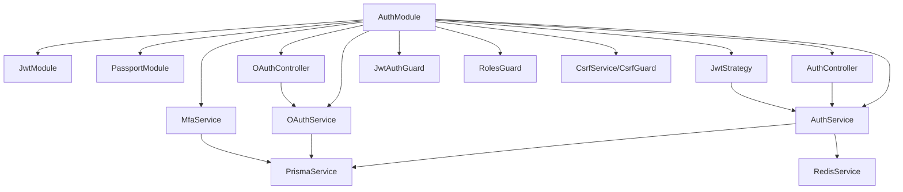

**Diagram sources**
- [auth.module.ts:17-52](file://apps/api/src/modules/auth/auth.module.ts#L17-L52)
- [auth.controller.ts:31-171](file://apps/api/src/modules/auth/auth.controller.ts#L31-L171)
- [oauth.controller.ts:51-144](file://apps/api/src/modules/auth/oauth/oauth.controller.ts#L51-L144)
- [jwt.strategy.ts:7-34](file://apps/api/src/modules/auth/strategies/jwt.strategy.ts#L7-L34)
- [jwt-auth.guard.ts:14-64](file://apps/api/src/modules/auth/guards/jwt-auth.guard.ts#L14-L64)
- [roles.guard.ts:7-37](file://apps/api/src/modules/auth/guards/roles.guard.ts#L7-L37)
- [oauth.service.ts:56-357](file://apps/api/src/modules/auth/oauth/oauth.service.ts#L56-L357)
- [mfa.service.ts:22-250](file://apps/api/src/modules/auth/mfa/mfa.service.ts#L22-L250)

**Section sources**
- [auth.module.ts:17-52](file://apps/api/src/modules/auth/auth.module.ts#L17-L52)

## Performance Considerations
- Use Redis for refresh token storage to minimize DB load and enable fast TTL-based invalidation.
- Keep access token TTL short to reduce exposure window; rely on refresh tokens for session continuity.
- Apply throttling to sensitive endpoints to mitigate brute force attacks.
- Asynchronous email operations prevent blocking user actions during registration and verification.

[No sources needed since this section provides general guidance]

## Troubleshooting Guide
- Authentication failures: JwtAuthGuard logs detailed information including request path and presence of Authorization header; differentiate expired vs invalid tokens.
- Invalid refresh token: Ensure token exists in Redis and user is active; verify TTL and DB audit entries.
- OAuth errors: Validate provider-specific tokens and scopes; check provider APIs for profile retrieval.
- MFA issues: Confirm TOTP sync and backup codes; ensure MFA is enabled before verification.
- CSRF problems: Obtain CSRF token from dedicated endpoint and include it in X-CSRF-Token header for state-changing requests.

**Section sources**
- [jwt-auth.guard.ts:49-60](file://apps/api/src/modules/auth/guards/jwt-auth.guard.ts#L49-L60)
- [auth.service.ts:147-153](file://apps/api/src/modules/auth/auth.service.ts#L147-L153)
- [oauth.service.ts:104-108](file://apps/api/src/modules/auth/oauth/oauth.service.ts#L104-L108)
- [mfa.service.ts:73-87](file://apps/api/src/modules/auth/mfa/mfa.service.ts#L73-L87)
- [auth.controller.ts:140-169](file://apps/api/src/modules/auth/auth.controller.ts#L140-L169)

## Conclusion
The authentication and authorization system combines robust JWT-based access control, secure refresh token management, OAuth integrations, and MFA support. Guards enforce authentication and RBAC, while CSRF protection and rate limiting enhance security. The frontend integrates seamlessly with backend endpoints to deliver a secure and user-friendly authentication experience.

[No sources needed since this section summarizes without analyzing specific files]

## Appendices

### Configuration Keys
- jwt.secret: JWT signing secret.
- jwt.expiresIn: Access token TTL.
- jwt.refreshExpiresIn: Refresh token TTL.
- bcrypt.rounds: bcrypt cost factor.
- tokens.verificationExpiry: Email verification token TTL.
- tokens.passwordResetExpiry: Password reset token TTL.
- GOOGLE_CLIENT_ID, GOOGLE_CLIENT_SECRET: Google OAuth credentials.

**Section sources**
- [configuration.ts](file://apps/api/src/config/configuration.ts)
- [auth.module.ts:20-29](file://apps/api/src/modules/auth/auth.module.ts#L20-L29)
- [auth.service.ts:40-62](file://apps/api/src/modules/auth/auth.service.ts#L40-L62)
- [oauth.service.ts:66-71](file://apps/api/src/modules/auth/oauth/oauth.service.ts#L66-L71)

### Example Protected Route and Guards
- Use JwtAuthGuard on routes requiring authentication.
- Use RolesGuard with role decorators to restrict access by role.

**Section sources**
- [auth.controller.ts:83-91](file://apps/api/src/modules/auth/auth.controller.ts#L83-L91)
- [roles.guard.ts:11-35](file://apps/api/src/modules/auth/guards/roles.guard.ts#L11-L35)

### Security Best Practices
- Enforce HTTPS in production.
- Rotate JWT secrets regularly and manage them securely.
- Use short-lived access tokens and long-lived refresh tokens with strict storage.
- Store only hashed passwords and avoid plaintext credentials.
- Implement rate limiting and monitoring for suspicious activities.
- Regularly review and rotate OAuth client secrets.

[No sources needed since this section provides general guidance]