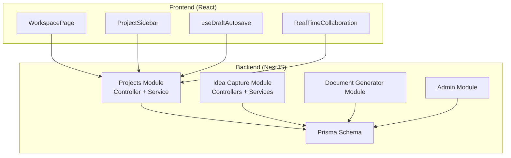
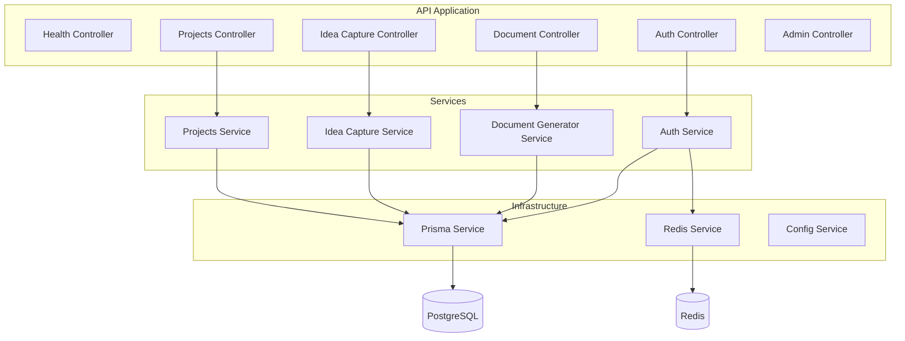
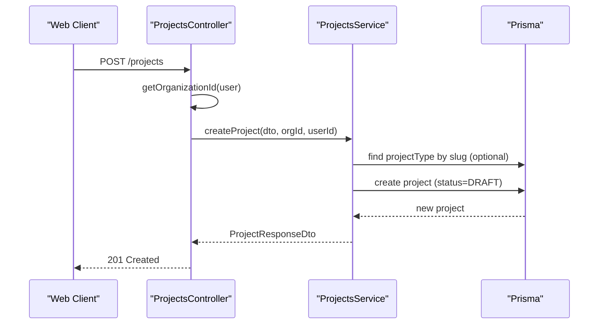
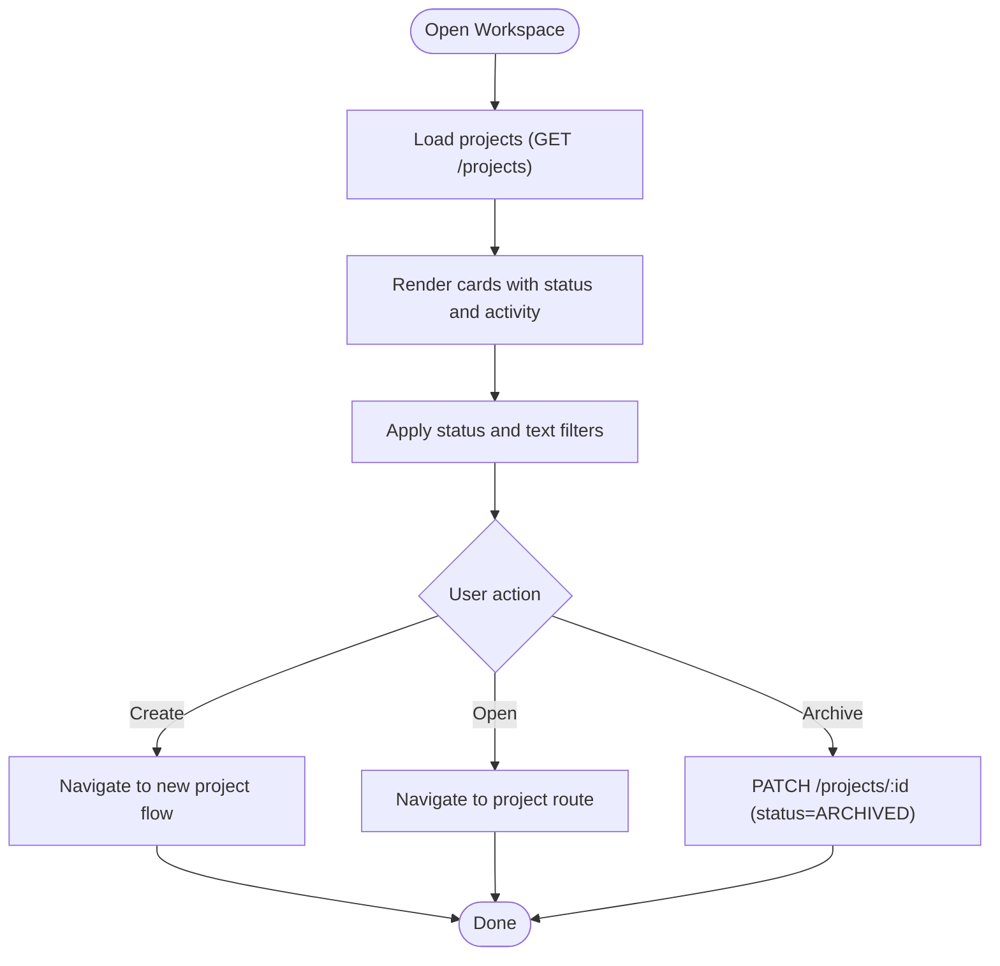
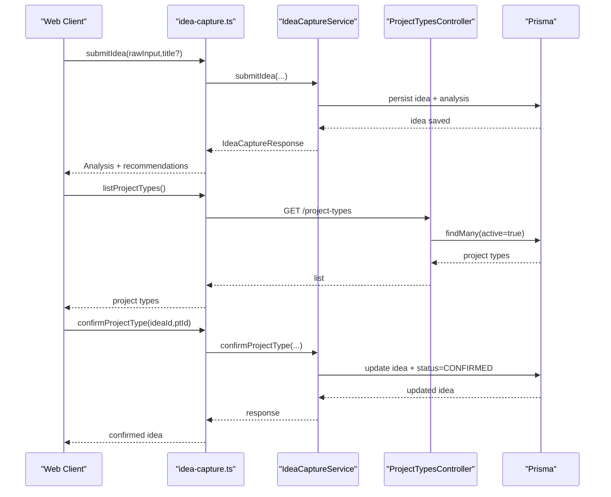
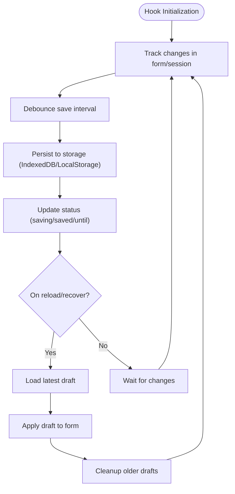
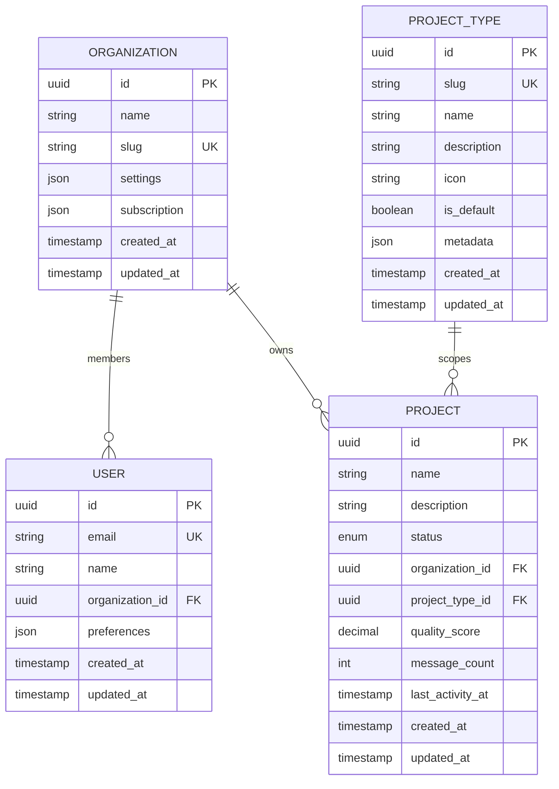
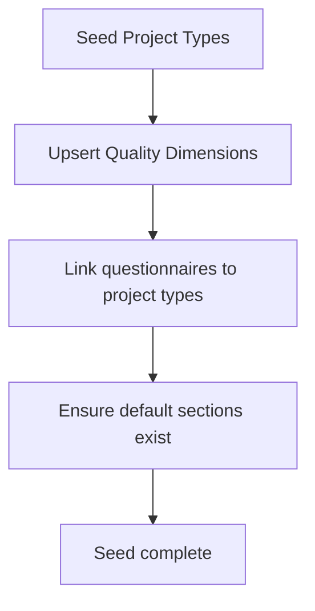
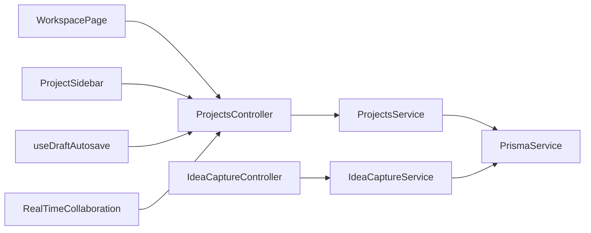

# Project & Workspace Administration

<cite>
**Referenced Files in This Document**
- [projects.controller.ts](file://apps/api/src/modules/projects/projects.controller.ts)
- [projects.service.ts](file://apps/api/src/modules/projects/projects.service.ts)
- [projects.module.ts](file://apps/api/src/modules/projects/projects.module.ts)
- [create-project.dto.ts](file://apps/api/src/modules/projects/dto/create-project.dto.ts)
- [WorkspacePage.tsx](file://apps/web/src/pages/workspace/WorkspacePage.tsx)
- [ProjectSidebar.tsx](file://apps/web/src/components/layout/ProjectSidebar.tsx)
- [idea-capture.ts](file://apps/web/src/api/idea-capture.ts)
- [idea-capture.service.ts](file://apps/api/src/modules/idea-capture/services/idea-capture.service.ts)
- [project-types.controller.ts](file://apps/api/src/modules/idea-capture/project-types.controller.ts)
- [project-types.seed.ts](file://prisma/seeds/project-types.seed.ts)
- [PHASE-02-data-model.md](file://docs/phase-kits/PHASE-02-data-model.md)
- [useDraftAutosave.ts](file://apps/web/src/hooks/useDraftAutosave.ts)
- [DraftBanner.tsx](file://apps/web/src/components/ux/DraftBanner.tsx)
- [RealTimeCollaboration.tsx](file://apps/web/src/components/collaboration/RealTimeCollaboration.tsx)
- [schema.prisma](file://prisma/schema.prisma)
- [001-authentication-authorization.md](file://docs/adr/001-authentication-authorization.md)
- [03-product-architecture.md](file://docs/cto/03-product-architecture.md)
- [c4-03-component.md](file://docs/architecture/c4-03-component.md)
- [admin.ts](file://apps/web/src/api/admin.ts)
- [admin.module.ts](file://apps/api/src/modules/admin/admin.module.ts)
</cite>

## Table of Contents
1. [Introduction](#introduction)
2. [Project Structure](#project-structure)
3. [Core Components](#core-components)
4. [Architecture Overview](#architecture-overview)
5. [Detailed Component Analysis](#detailed-component-analysis)
6. [Dependency Analysis](#dependency-analysis)
7. [Performance Considerations](#performance-considerations)
8. [Troubleshooting Guide](#troubleshooting-guide)
9. [Conclusion](#conclusion)
10. [Appendices](#appendices)

## Introduction
This document explains project and workspace administration across the Quiz2Biz platform. It covers the project lifecycle (creation, updates, archival), workspace navigation and organization, idea capture and project initiation, draft management, collaborative editing, backend services and data modeling, access control, and integrations with user management and document generation. It also provides API references, best practices, and diagrams to guide setup and collaboration workflows.

## Project Structure
The project is organized into:
- Backend (NestJS):
  - Modules for projects, idea capture, document generation, and admin
  - Prisma schema and seeds for data modeling
- Frontend (React/Vite):
  - Workspace and project pages, sidebar navigation, collaboration widgets, and draft autosave hooks
- Documentation:
  - ADRs, architecture docs, and phase kits for development phases



**Diagram sources**
- [projects.controller.ts:39-146](file://apps/api/src/modules/projects/projects.controller.ts#L39-L146)
- [projects.service.ts:24-187](file://apps/api/src/modules/projects/projects.service.ts#L24-L187)
- [idea-capture.service.ts:84-133](file://apps/api/src/modules/idea-capture/services/idea-capture.service.ts#L84-L133)
- [schema.prisma:1-200](file://prisma/schema.prisma#L1-L200)
- [WorkspacePage.tsx:187-258](file://apps/web/src/pages/workspace/WorkspacePage.tsx#L187-L258)
- [ProjectSidebar.tsx:27-218](file://apps/web/src/components/layout/ProjectSidebar.tsx#L27-L218)
- [RealTimeCollaboration.tsx:1-325](file://apps/web/src/components/collaboration/RealTimeCollaboration.tsx#L1-L325)
- [useDraftAutosave.ts:261-499](file://apps/web/src/hooks/useDraftAutosave.ts#L261-L499)

**Section sources**
- [projects.module.ts:1-19](file://apps/api/src/modules/projects/projects.module.ts#L1-L19)
- [projects.controller.ts:39-146](file://apps/api/src/modules/projects/projects.controller.ts#L39-L146)
- [projects.service.ts:24-187](file://apps/api/src/modules/projects/projects.service.ts#L24-L187)
- [schema.prisma:1-200](file://prisma/schema.prisma#L1-L200)

## Core Components
- Projects API (backend):
  - Lists, retrieves, creates, and updates projects scoped to the authenticated user’s organization
  - Enforces access control via JWT guard and organization scoping
- Frontend workspace:
  - Workspace page lists projects with filtering, search, and quick actions
  - Project sidebar provides project-specific navigation
- Idea capture and project types:
  - Idea capture initiates project creation flows; project types define templates and scoping
- Draft management:
  - Autosave hook and UI banner for draft persistence and recovery
- Collaboration:
  - Real-time presence, cursors, locks, edits, and conflict resolution
- Access control and user management:
  - JWT-based RBAC and ABAC, role definitions, and token strategy

**Section sources**
- [projects.controller.ts:68-145](file://apps/api/src/modules/projects/projects.controller.ts#L68-L145)
- [projects.service.ts:32-153](file://apps/api/src/modules/projects/projects.service.ts#L32-L153)
- [WorkspacePage.tsx:187-258](file://apps/web/src/pages/workspace/WorkspacePage.tsx#L187-L258)
- [ProjectSidebar.tsx:27-218](file://apps/web/src/components/layout/ProjectSidebar.tsx#L27-L218)
- [idea-capture.ts:50-81](file://apps/web/src/api/idea-capture.ts#L50-L81)
- [project-types.controller.ts:13-31](file://apps/api/src/modules/idea-capture/project-types.controller.ts#L13-L31)
- [useDraftAutosave.ts:261-499](file://apps/web/src/hooks/useDraftAutosave.ts#L261-L499)
- [RealTimeCollaboration.tsx:1-325](file://apps/web/src/components/collaboration/RealTimeCollaboration.tsx#L1-L325)
- [001-authentication-authorization.md:46-97](file://docs/adr/001-authentication-authorization.md#L46-L97)

## Architecture Overview
The system follows a layered NestJS architecture with clear separation of concerns:
- Controllers handle HTTP requests and apply guards
- Services encapsulate business logic and enforce organization scoping
- Prisma provides strongly typed database access
- Frontend integrates with backend via API clients and manages UI state, collaboration, and drafts



**Diagram sources**
- [c4-03-component.md:1-83](file://docs/architecture/c4-03-component.md#L1-L83)
- [projects.controller.ts:39-146](file://apps/api/src/modules/projects/projects.controller.ts#L39-L146)
- [projects.service.ts:24-187](file://apps/api/src/modules/projects/projects.service.ts#L24-L187)
- [idea-capture.service.ts:84-133](file://apps/api/src/modules/idea-capture/services/idea-capture.service.ts#L84-L133)

**Section sources**
- [c4-03-component.md:1-83](file://docs/architecture/c4-03-component.md#L1-L83)
- [03-product-architecture.md:987-1007](file://docs/cto/03-product-architecture.md#L987-L1007)

## Detailed Component Analysis

### Project Lifecycle Management
Projects are managed through a dedicated module with CRUD operations and organization scoping. Creation defaults to a draft status and optionally associates a project type by slug.



**Diagram sources**
- [projects.controller.ts:103-120](file://apps/api/src/modules/projects/projects.controller.ts#L103-L120)
- [projects.service.ts:88-116](file://apps/api/src/modules/projects/projects.service.ts#L88-L116)

**Section sources**
- [projects.controller.ts:68-145](file://apps/api/src/modules/projects/projects.controller.ts#L68-L145)
- [projects.service.ts:32-153](file://apps/api/src/modules/projects/projects.service.ts#L32-L153)
- [create-project.dto.ts:7-24](file://apps/api/src/modules/projects/dto/create-project.dto.ts#L7-L24)

### Workspace Navigation and Organization
The workspace page aggregates projects for the current organization, supports filtering and search, and provides quick actions. The project sidebar renders project-specific navigation when viewing a project.



**Diagram sources**
- [WorkspacePage.tsx:187-258](file://apps/web/src/pages/workspace/WorkspacePage.tsx#L187-L258)
- [ProjectSidebar.tsx:27-218](file://apps/web/src/components/layout/ProjectSidebar.tsx#L27-L218)
- [projects.controller.ts:68-145](file://apps/api/src/modules/projects/projects.controller.ts#L68-L145)

**Section sources**
- [WorkspacePage.tsx:187-258](file://apps/web/src/pages/workspace/WorkspacePage.tsx#L187-L258)
- [ProjectSidebar.tsx:27-218](file://apps/web/src/components/layout/ProjectSidebar.tsx#L27-L218)

### Idea Capture and Project Initiation
Idea capture enables submitting raw ideas, receiving AI analysis, selecting a project type, and creating a session. Project types are maintained and exposed via a protected endpoint.



**Diagram sources**
- [idea-capture.ts:50-81](file://apps/web/src/api/idea-capture.ts#L50-L81)
- [idea-capture.service.ts:112-133](file://apps/api/src/modules/idea-capture/services/idea-capture.service.ts#L112-L133)
- [project-types.controller.ts:13-31](file://apps/api/src/modules/idea-capture/project-types.controller.ts#L13-L31)

**Section sources**
- [idea-capture.ts:50-81](file://apps/web/src/api/idea-capture.ts#L50-L81)
- [idea-capture.service.ts:84-133](file://apps/api/src/modules/idea-capture/services/idea-capture.service.ts#L84-L133)
- [project-types.controller.ts:13-31](file://apps/api/src/modules/idea-capture/project-types.controller.ts#L13-L31)

### Draft Management System
Draft autosave persists user input locally and periodically syncs to backend. The hook manages saving state, recovery, and cleanup of older drafts.



**Diagram sources**
- [useDraftAutosave.ts:261-499](file://apps/web/src/hooks/useDraftAutosave.ts#L261-L499)
- [DraftBanner.tsx:253-295](file://apps/web/src/components/ux/DraftBanner.tsx#L253-L295)

**Section sources**
- [useDraftAutosave.ts:193-499](file://apps/web/src/hooks/useDraftAutosave.ts#L193-L499)
- [DraftBanner.tsx:253-295](file://apps/web/src/components/ux/DraftBanner.tsx#L253-L295)

### Collaborative Workspace Features
Real-time collaboration provides presence, cursor tracking, edit locks, conflict detection, and resolution. Messages are exchanged via WebSocket abstraction.

```mermaid
sequenceDiagram
participant U1 as "User 1"
participant WS1 as "WS Service 1"
participant Collab as "CollaborationContext"
participant U2 as "User 2"
U1->>WS1 : join
WS1->>Collab : broadcast join
U1->>Collab : move cursor
Collab->>WS1 : publish cursor position
WS1-->>U2 : deliver cursor event
U1->>Collab : acquire edit lock
Collab->>WS1 : publish lock
U2->>Collab : edit same field
Collab->>WS1 : detect conflict
WS1-->>U1,U2 : conflict event
U1->>Collab : resolve (local/remote/merge)
Collab->>WS1 : publish unlock
```

**Diagram sources**
- [RealTimeCollaboration.tsx:1-325](file://apps/web/src/components/collaboration/RealTimeCollaboration.tsx#L1-L325)

**Section sources**
- [RealTimeCollaboration.tsx:1-325](file://apps/web/src/components/collaboration/RealTimeCollaboration.tsx#L1-L325)

### Backend Services, Data Modeling, and Access Control
- Projects and organizations are modeled with strong typing and enums for statuses and categories.
- Access control uses JWT guards and role-based policies; organization scoping ensures data isolation.
- Admin module exposes administrative capabilities for questionnaires and audits.



**Diagram sources**
- [schema.prisma:154-170](file://prisma/schema.prisma#L154-L170)
- [schema.prisma:1-200](file://prisma/schema.prisma#L1-L200)

**Section sources**
- [schema.prisma:126-132](file://prisma/schema.prisma#L126-L132)
- [001-authentication-authorization.md:46-97](file://docs/adr/001-authentication-authorization.md#L46-L97)
- [admin.module.ts:1-14](file://apps/api/src/modules/admin/admin.module.ts#L1-L14)

### Project Type Configurations and Templates
Project types define scoping for questionnaires and quality dimensions. Seeds establish baseline types and dimensions, ensuring every project type has at least one questionnaire with sections.



**Diagram sources**
- [project-types.seed.ts:567-725](file://prisma/seeds/project-types.seed.ts#L567-L725)
- [PHASE-02-data-model.md:64-279](file://docs/phase-kits/PHASE-02-data-model.md#L64-L279)

**Section sources**
- [project-types.controller.ts:13-31](file://apps/api/src/modules/idea-capture/project-types.controller.ts#L13-L31)
- [project-types.seed.ts:567-725](file://prisma/seeds/project-types.seed.ts#L567-L725)
- [PHASE-02-data-model.md:64-279](file://docs/phase-kits/PHASE-02-data-model.md#L64-L279)

### Frontend Workspace Components and Project Dashboard
- Workspace page: lists projects, applies filters, and supports archive actions with optimistic UI updates.
- Project sidebar: renders project navigation and returns to workspace.
- Draft banner: offers resume/discard actions for drafts.

**Section sources**
- [WorkspacePage.tsx:187-258](file://apps/web/src/pages/workspace/WorkspacePage.tsx#L187-L258)
- [ProjectSidebar.tsx:27-218](file://apps/web/src/components/layout/ProjectSidebar.tsx#L27-L218)
- [DraftBanner.tsx:253-295](file://apps/web/src/components/ux/DraftBanner.tsx#L253-L295)

## Dependency Analysis
- Projects controller depends on JWT guard and ProjectsService; ProjectsService depends on Prisma.
- Idea capture controller depends on JWT guard and Prisma; Idea capture service depends on Prisma and project types.
- Frontend components depend on API clients and hooks; collaboration relies on WebSocket abstraction.



**Diagram sources**
- [projects.controller.ts:39-146](file://apps/api/src/modules/projects/projects.controller.ts#L39-L146)
- [projects.service.ts:24-187](file://apps/api/src/modules/projects/projects.service.ts#L24-L187)
- [idea-capture.service.ts:84-133](file://apps/api/src/modules/idea-capture/services/idea-capture.service.ts#L84-L133)
- [WorkspacePage.tsx:187-258](file://apps/web/src/pages/workspace/WorkspacePage.tsx#L187-L258)
- [ProjectSidebar.tsx:27-218](file://apps/web/src/components/layout/ProjectSidebar.tsx#L27-L218)
- [useDraftAutosave.ts:261-499](file://apps/web/src/hooks/useDraftAutosave.ts#L261-L499)
- [RealTimeCollaboration.tsx:1-325](file://apps/web/src/components/collaboration/RealTimeCollaboration.tsx#L1-L325)

**Section sources**
- [projects.controller.ts:39-146](file://apps/api/src/modules/projects/projects.controller.ts#L39-L146)
- [projects.service.ts:24-187](file://apps/api/src/modules/projects/projects.service.ts#L24-L187)
- [idea-capture.service.ts:84-133](file://apps/api/src/modules/idea-capture/services/idea-capture.service.ts#L84-L133)

## Performance Considerations
- Pagination and ordering: Projects listing uses skip/take with descending last activity to keep the most relevant items visible first.
- Organization scoping: All queries filter by organization ID to avoid scanning unrelated data.
- Draft storage: Local persistence with periodic cleanup prevents unbounded growth of draft entries.
- Real-time collaboration: Debouncing and batched updates reduce network overhead.

[No sources needed since this section provides general guidance]

## Troubleshooting Guide
- Access denied errors:
  - Ensure the user belongs to an organization; otherwise, the controller throws a forbidden error during organization resolution.
- Project not found:
  - Verify the project ID and that it belongs to the authenticated user’s organization.
- Draft recovery:
  - Drafts older than seven days are not recoverable; confirm the last saved timestamp falls within the allowed window.
- Collaboration conflicts:
  - Resolve conflicts promptly; merging requires explicit merged value; otherwise choose local or remote.

**Section sources**
- [projects.controller.ts:53-66](file://apps/api/src/modules/projects/projects.controller.ts#L53-L66)
- [projects.service.ts:65-83](file://apps/api/src/modules/projects/projects.service.ts#L65-L83)
- [useDraftAutosave.ts:494-499](file://apps/web/src/hooks/useDraftAutosave.ts#L494-L499)
- [RealTimeCollaboration.tsx:309-318](file://apps/web/src/components/collaboration/RealTimeCollaboration.tsx#L309-L318)

## Conclusion
The platform provides a robust foundation for project and workspace administration, integrating idea capture, project types, draft management, and real-time collaboration. Strong access control and organization scoping ensure secure multi-tenant operation, while clear APIs and frontend components streamline user workflows.

[No sources needed since this section summarizes without analyzing specific files]

## Appendices

### API References

- Projects API
  - GET /api/v1/projects
    - Description: List projects for the current user’s organization
    - Auth: JWT
    - Response: Paginated list with items and total
  - GET /api/v1/projects/:id
    - Description: Get a project by ID
    - Auth: JWT
    - Response: Project details
  - POST /api/v1/projects
    - Description: Create a new project
    - Auth: JWT
    - Request body: CreateProjectDto (name, description, optional projectTypeSlug)
    - Response: ProjectResponseDto
  - PATCH /api/v1/projects/:id
    - Description: Update a project (name, description, or status)
    - Auth: JWT
    - Response: ProjectResponseDto

- Idea Capture API
  - POST /api/v1/sessions/idea
    - Description: Submit an idea for AI analysis
    - Auth: JWT
    - Response: IdeaCaptureResponse
  - GET /api/v1/sessions/idea/:id
    - Description: Retrieve idea analysis
    - Auth: JWT
    - Response: IdeaCaptureResponse
  - PATCH /api/v1/sessions/idea/:id/confirm
    - Description: Confirm project type for the idea
    - Auth: JWT
    - Response: IdeaCaptureResponse
  - POST /api/v1/sessions/idea/:id/session
    - Description: Create a session from the idea
    - Auth: JWT
    - Response: { sessionId: string }
  - GET /api/v1/project-types
    - Description: List active project types
    - Auth: JWT
    - Response: ProjectType[]

- Admin API (frontend types)
  - Pending review documents and approval endpoints are defined for developer/admin workflows.

**Section sources**
- [projects.controller.ts:68-145](file://apps/api/src/modules/projects/projects.controller.ts#L68-L145)
- [create-project.dto.ts:7-24](file://apps/api/src/modules/projects/dto/create-project.dto.ts#L7-L24)
- [idea-capture.ts:50-81](file://apps/web/src/api/idea-capture.ts#L50-L81)
- [admin.ts:1-70](file://apps/web/src/api/admin.ts#L1-L70)

### Best Practices
- Project setup
  - Choose a project type early to scope questionnaires and quality dimensions.
  - Use draft autosave to protect work; resume or discard drafts as needed.
- Workspace organization
  - Keep projects active or archived; use filters to focus on relevant items.
  - Leverage project type metadata to align team goals and standards.
- Team collaboration
  - Use real-time collaboration features for joint editing; resolve conflicts promptly.
  - Restrict sensitive operations to authorized roles via RBAC.

[No sources needed since this section provides general guidance]