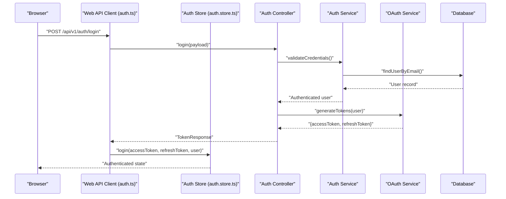
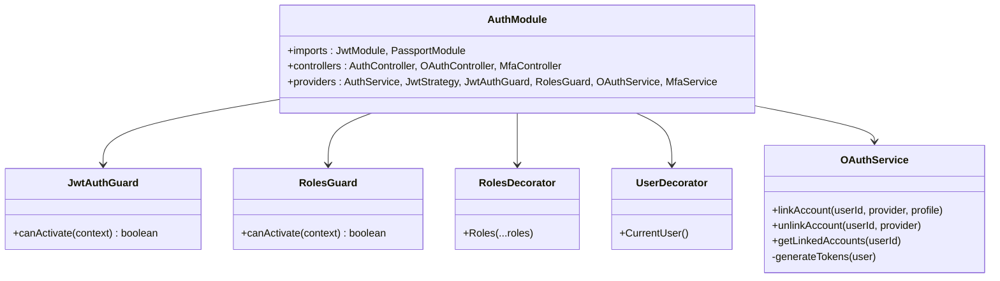
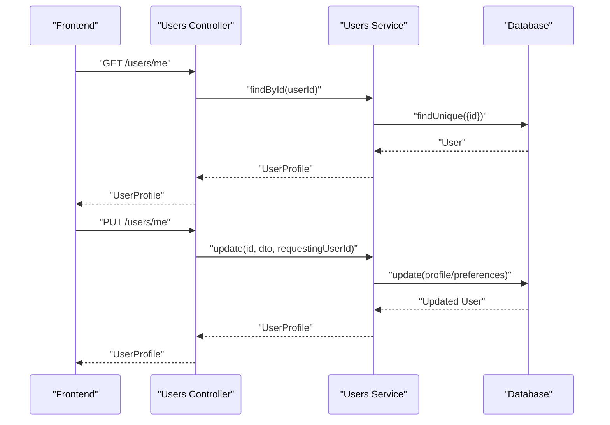
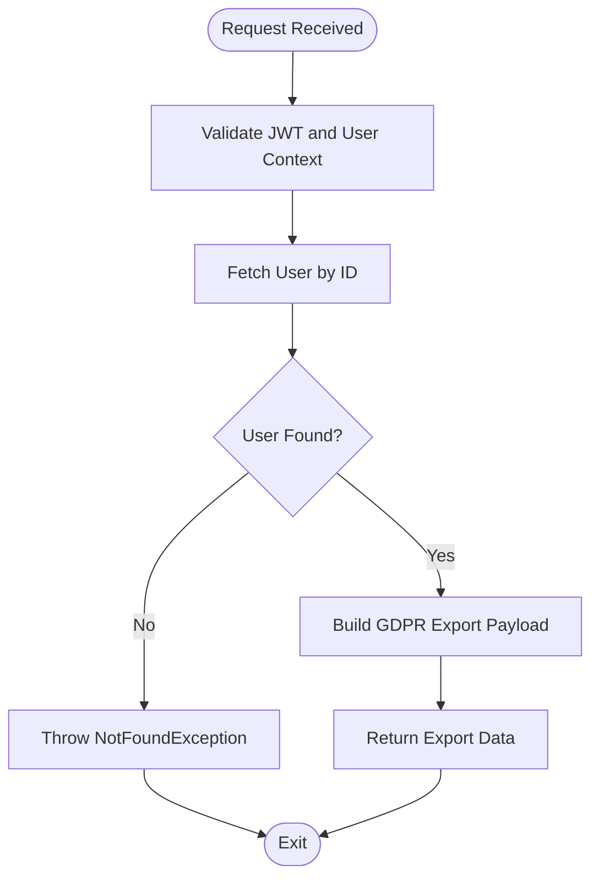
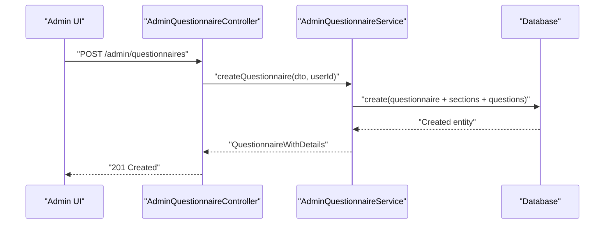
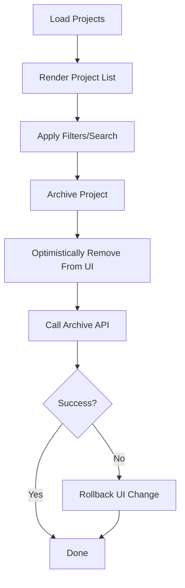
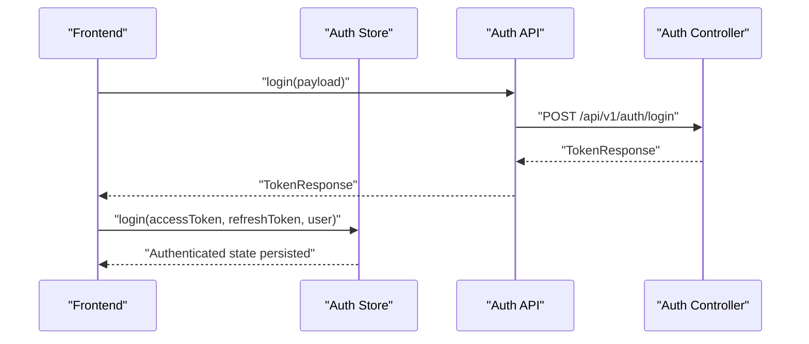
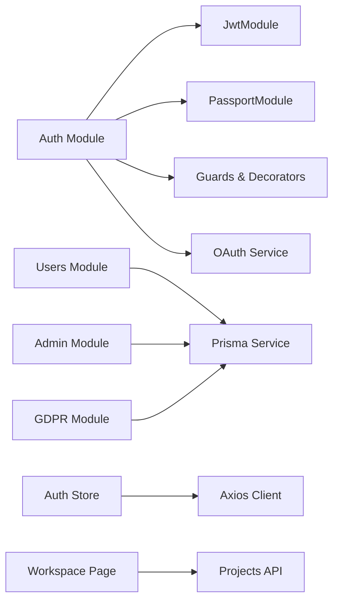

# User Management & Administration

<cite>
**Referenced Files in This Document**
- [001-authentication-authorization.md](file://docs/adr/001-authentication-authorization.md)
- [auth.module.ts](file://apps/api/src/modules/auth/auth.module.ts)
- [auth.controller.ts](file://apps/api/src/modules/auth/auth.controller.ts)
- [oauth.service.ts](file://apps/api/src/modules/auth/oauth/oauth.service.ts)
- [jwt-auth.guard.ts](file://apps/api/src/modules/auth/guards/jwt-auth.guard.ts)
- [roles.guard.ts](file://apps/api/src/modules/auth/guards/roles.guard.ts)
- [roles.decorator.ts](file://apps/api/src/modules/auth/decorators/roles.decorator.ts)
- [user.decorator.ts](file://apps/api/src/modules/auth/decorators/user.decorator.ts)
- [auth.service.ts](file://apps/api/src/modules/auth/auth.service.ts)
- [auth.ts](file://apps/web/src/api/auth.ts)
- [auth.store.ts](file://apps/web/src/stores/auth.ts)
- [users.controller.ts](file://apps/api/src/modules/users/users.controller.ts)
- [users.service.ts](file://apps/api/src/modules/users/users.service.ts)
- [gdpr.controller.ts](file://apps/api/src/modules/users/gdpr.controller.ts)
- [gdpr.service.ts](file://apps/api/src/modules/users/gdpr.service.ts)
- [admin.module.ts](file://apps/api/src/modules/admin/admin.module.ts)
- [admin-questionnaire.controller.ts](file://apps/api/src/modules/admin/controllers/admin-questionnaire.controller.ts)
- [admin-questionnaire.service.ts](file://apps/api/src/modules/admin/services/admin-questionnaire.service.ts)
- [04-api-documentation.md](file://docs/cto/04-api-documentation.md)
- [PRE-DEPLOYMENT-TESTING-PROTOCOL.md](file://docs/testing/PRE-DEPLOYMENT-TESTING-PROTOCOL.md)
- [WorkspacePage.tsx](file://apps/web/src/pages/workspace/WorkspacePage.tsx)
</cite>

## Table of Contents
1. [Introduction](#introduction)
2. [Project Structure](#project-structure)
3. [Core Components](#core-components)
4. [Architecture Overview](#architecture-overview)
5. [Detailed Component Analysis](#detailed-component-analysis)
6. [Dependency Analysis](#dependency-analysis)
7. [Performance Considerations](#performance-considerations)
8. [Security & Compliance](#security--compliance)
9. [Troubleshooting Guide](#troubleshooting-guide)
10. [Conclusion](#conclusion)

## Introduction
This document provides comprehensive documentation for the user management and administrative systems. It covers the authentication and authorization framework (JWT tokens, OAuth integration, and role-based access control), user profile management, GDPR compliance features, administrative capabilities for questionnaire management, and workspace administration. It also outlines frontend authentication components, user settings interfaces, administrative dashboards, backend APIs for user CRUD operations and administrative workflows, and security considerations including audit logging and compliance requirements.

## Project Structure
The system is organized into three primary layers:
- Backend (NestJS API): Authentication, authorization, user management, GDPR, and administrative controllers/services.
- Frontend (React SPA): Authentication store, API client, and pages for workspace and settings.
- Documentation: ADRs, API documentation, and testing protocols define policies and behaviors.

```mermaid
graph TB
subgraph "Frontend (Web)"
FE_AuthAPI["apps/web/src/api/auth.ts"]
FE_AuthStore["apps/web/src/stores/auth.ts"]
FE_Workspace["apps/web/src/pages/workspace/WorkspacePage.tsx"]
end
subgraph "Backend (API)"
BE_AuthModule["apps/api/src/modules/auth/auth.module.ts"]
BE_AuthCtrl["apps/api/src/modules/auth/auth.controller.ts"]
BE_AuthSvc["apps/api/src/modules/auth/auth.service.ts"]
BE_OAuthService["apps/api/src/modules/auth/oauth/oauth.service.ts"]
BE_Guards["guards (jwt-auth.guard.ts, roles.guard.ts)"]
BE_RolesDecorator["decorators (roles.decorator.ts, user.decorator.ts)"]
BE_UsersCtrl["apps/api/src/modules/users/users.controller.ts"]
BE_UsersSvc["apps/api/src/modules/users/users.service.ts"]
BE_GDPRCtrl["apps/api/src/modules/users/gdpr.controller.ts"]
BE_GDRPSvc["apps/api/src/modules/users/gdpr.service.ts"]
BE_AdminModule["apps/api/src/modules/admin/admin.module.ts"]
BE_AdminQCtrl["apps/api/src/modules/admin/controllers/admin-questionnaire.controller.ts"]
BE_AdminQSvc["apps/api/src/modules/admin/services/admin-questionnaire.service.ts"]
end
FE_AuthAPI --> FE_AuthStore
FE_AuthStore --> BE_AuthCtrl
FE_Workspace --> BE_UsersCtrl
BE_AuthModule --> BE_AuthCtrl
BE_AuthModule --> BE_AuthSvc
BE_AuthModule --> BE_OAuthService
BE_AuthModule --> BE_Guards
BE_AuthModule --> BE_RolesDecorator
BE_UsersCtrl --> BE_UsersSvc
BE_GDPRCtrl --> BE_GDRPSvc
BE_AdminModule --> BE_AdminQCtrl
BE_AdminModule --> BE_AdminQSvc
```

**Diagram sources**
- [auth.module.ts:1-52](file://apps/api/src/modules/auth/auth.module.ts#L1-L52)
- [auth.controller.ts](file://apps/api/src/modules/auth/auth.controller.ts)
- [oauth.service.ts:293-356](file://apps/api/src/modules/auth/oauth/oauth.service.ts#L293-L356)
- [jwt-auth.guard.ts](file://apps/api/src/modules/auth/guards/jwt-auth.guard.ts)
- [roles.guard.ts](file://apps/api/src/modules/auth/guards/roles.guard.ts)
- [roles.decorator.ts](file://apps/api/src/modules/auth/decorators/roles.decorator.ts)
- [user.decorator.ts](file://apps/api/src/modules/auth/decorators/user.decorator.ts)
- [auth.service.ts](file://apps/api/src/modules/auth/auth.service.ts)
- [auth.ts:1-101](file://apps/web/src/api/auth.ts#L1-L101)
- [auth.store.ts:1-173](file://apps/web/src/stores/auth.ts#L1-L173)
- [users.controller.ts:1-75](file://apps/api/src/modules/users/users.controller.ts#L1-L75)
- [users.service.ts:1-203](file://apps/api/src/modules/users/users.service.ts#L1-L203)
- [gdpr.controller.ts:1-31](file://apps/api/src/modules/users/gdpr.controller.ts#L1-L31)
- [gdpr.service.ts:1-57](file://apps/api/src/modules/users/gdpr.service.ts#L1-L57)
- [admin.module.ts:1-13](file://apps/api/src/modules/admin/admin.module.ts#L1-L13)
- [admin-questionnaire.controller.ts:1-111](file://apps/api/src/modules/admin/controllers/admin-questionnaire.controller.ts#L1-L111)
- [admin-questionnaire.service.ts:1-44](file://apps/api/src/modules/admin/services/admin-questionnaire.service.ts#L1-L44)
- [WorkspacePage.tsx:185-227](file://apps/web/src/pages/workspace/WorkspacePage.tsx#L185-L227)

**Section sources**
- [auth.module.ts:1-52](file://apps/api/src/modules/auth/auth.module.ts#L1-L52)
- [auth.ts:1-101](file://apps/web/src/api/auth.ts#L1-L101)
- [auth.store.ts:1-173](file://apps/web/src/stores/auth.ts#L1-L173)
- [users.controller.ts:1-75](file://apps/api/src/modules/users/users.controller.ts#L1-L75)
- [gdpr.controller.ts:1-31](file://apps/api/src/modules/users/gdpr.controller.ts#L1-L31)
- [admin.module.ts:1-13](file://apps/api/src/modules/admin/admin.module.ts#L1-L13)
- [WorkspacePage.tsx:185-227](file://apps/web/src/pages/workspace/WorkspacePage.tsx#L185-L227)

## Core Components
- Authentication and Authorization (Backend):
  - JWT module configuration, strategies, guards, and decorators.
  - OAuth service for linking/unlinking external accounts and token generation.
  - Controllers for login, refresh, logout, and profile retrieval.
- User Management (Backend):
  - Users controller and service for profile CRUD, role-based listing, and statistics.
  - GDPR controller and service for data export and erasure.
- Administrative Systems (Backend):
  - Admin module with controllers/services for questionnaire management (CRUD, ordering, visibility rules).
- Frontend Authentication (Web):
  - Auth API client for login/register/logout and profile operations.
  - Zustand auth store with localStorage persistence and token synchronization strategy.
- Workspace Administration (Web):
  - Workspace page for project listing and archive operations.

**Section sources**
- [auth.module.ts:1-52](file://apps/api/src/modules/auth/auth.module.ts#L1-L52)
- [oauth.service.ts:293-356](file://apps/api/src/modules/auth/oauth/oauth.service.ts#L293-L356)
- [users.controller.ts:1-75](file://apps/api/src/modules/users/users.controller.ts#L1-L75)
- [users.service.ts:1-203](file://apps/api/src/modules/users/users.service.ts#L1-L203)
- [gdpr.controller.ts:1-31](file://apps/api/src/modules/users/gdpr.controller.ts#L1-L31)
- [gdpr.service.ts:1-57](file://apps/api/src/modules/users/gdpr.service.ts#L1-L57)
- [admin.module.ts:1-13](file://apps/api/src/modules/admin/admin.module.ts#L1-L13)
- [admin-questionnaire.controller.ts:1-111](file://apps/api/src/modules/admin/controllers/admin-questionnaire.controller.ts#L1-L111)
- [admin-questionnaire.service.ts:1-44](file://apps/api/src/modules/admin/services/admin-questionnaire.service.ts#L1-L44)
- [auth.ts:1-101](file://apps/web/src/api/auth.ts#L1-L101)
- [auth.store.ts:1-173](file://apps/web/src/stores/auth.ts#L1-L173)
- [WorkspacePage.tsx:185-227](file://apps/web/src/pages/workspace/WorkspacePage.tsx#L185-L227)

## Architecture Overview
The system follows a layered architecture:
- Frontend SPA communicates with the backend API via Axios client.
- Backend NestJS modules encapsulate authentication, authorization, user management, GDPR, and admin functionality.
- Guards and decorators enforce RBAC and ABAC-style checks.
- OAuth integration supports external identity providers.
- Token lifecycle is managed with short-lived access tokens and long-lived refresh tokens stored in HTTP-only cookies.

**Diagram sources**
- [auth.ts:1-101](file://apps/web/src/api/auth.ts#L1-L101)
- [auth.store.ts:1-173](file://apps/web/src/stores/auth.ts#L1-L173)
- [auth.controller.ts](file://apps/api/src/modules/auth/auth.controller.ts)
- [auth.service.ts](file://apps/api/src/modules/auth/auth.service.ts)
- [oauth.service.ts:332-356](file://apps/api/src/modules/auth/oauth/oauth.service.ts#L332-L356)

**Section sources**
- [001-authentication-authorization.md:46-97](file://docs/adr/001-authentication-authorization.md#L46-L97)
- [auth.module.ts:1-52](file://apps/api/src/modules/auth/auth.module.ts#L1-L52)
- [auth.ts:1-101](file://apps/web/src/api/auth.ts#L1-L101)
- [auth.store.ts:1-173](file://apps/web/src/stores/auth.ts#L1-L173)

## Detailed Component Analysis

### Authentication and Authorization Framework
- JWT Configuration:
  - Access tokens are short-lived and configured via environment variables.
  - Refresh tokens are long-lived and stored in HTTP-only cookies.
- Guards and Decorators:
  - JWT guard enforces bearer token validation.
  - Roles guard enforces RBAC with ADMIN/SUPER_ADMIN privileges.
  - Roles decorator restricts endpoints to authorized roles.
  - User decorator injects the current authenticated user into handlers.
- OAuth Integration:
  - Link/unlink external accounts and enforce minimum authentication method rules.
  - Generate access and refresh tokens upon successful OAuth login.
- Token Lifecycle:
  - Refresh endpoint accepts refresh token and returns a new access token.
  - Logout invalidates refresh tokens.

**Diagram sources**
- [auth.module.ts:1-52](file://apps/api/src/modules/auth/auth.module.ts#L1-L52)
- [jwt-auth.guard.ts](file://apps/api/src/modules/auth/guards/jwt-auth.guard.ts)
- [roles.guard.ts](file://apps/api/src/modules/auth/guards/roles.guard.ts)
- [roles.decorator.ts](file://apps/api/src/modules/auth/decorators/roles.decorator.ts)
- [user.decorator.ts](file://apps/api/src/modules/auth/decorators/user.decorator.ts)
- [oauth.service.ts:293-356](file://apps/api/src/modules/auth/oauth/oauth.service.ts#L293-L356)

**Section sources**
- [001-authentication-authorization.md:46-97](file://docs/adr/001-authentication-authorization.md#L46-L97)
- [auth.module.ts:1-52](file://apps/api/src/modules/auth/auth.module.ts#L1-L52)
- [auth.controller.ts](file://apps/api/src/modules/auth/auth.controller.ts)
- [oauth.service.ts:293-356](file://apps/api/src/modules/auth/oauth/oauth.service.ts#L293-L356)
- [04-api-documentation.md:934-1011](file://docs/cto/04-api-documentation.md#L934-L1011)

### User Profile Management
- Endpoints:
  - GET /users/me: Retrieve current user profile.
  - PUT /users/me: Update current user profile (name, phone, timezone, preferences).
  - GET /users: List users (ADMIN/SUPER_ADMIN) with pagination and role filtering.
  - GET /users/:id: Get user by ID (ADMIN/SUPER_ADMIN).
- Business Rules:
  - Users can only update their own profile unless ADMIN.
  - Statistics include completed sessions and generated documents.
- Frontend Integration:
  - Auth API exposes getMe for profile retrieval.
  - Auth store persists tokens and user state.

**Diagram sources**
- [users.controller.ts:23-74](file://apps/api/src/modules/users/users.controller.ts#L23-L74)
- [users.service.ts:41-203](file://apps/api/src/modules/users/users.service.ts#L41-L203)
- [auth.ts:94-97](file://apps/web/src/api/auth.ts#L94-L97)
- [auth.store.ts:1-173](file://apps/web/src/stores/auth.ts#L1-L173)

**Section sources**
- [users.controller.ts:1-75](file://apps/api/src/modules/users/users.controller.ts#L1-L75)
- [users.service.ts:1-203](file://apps/api/src/modules/users/users.service.ts#L1-L203)
- [auth.ts:94-97](file://apps/web/src/api/auth.ts#L94-L97)
- [auth.store.ts:1-173](file://apps/web/src/stores/auth.ts#L1-L173)

### GDPR Compliance Features
- Endpoints:
  - GET /users/gdpr/export: Export all personal data for the authenticated user (Article 15/20).
  - DELETE /users/gdpr/delete: Erase all personal data (Article 17).
- Implementation:
  - Aggregates user, sessions, documents, and audit logs.
  - Returns structured export and deletion result.

**Diagram sources**
- [gdpr.controller.ts:15-30](file://apps/api/src/modules/users/gdpr.controller.ts#L15-L30)
- [gdpr.service.ts:50-57](file://apps/api/src/modules/users/gdpr.service.ts#L50-L57)

**Section sources**
- [gdpr.controller.ts:1-31](file://apps/api/src/modules/users/gdpr.controller.ts#L1-L31)
- [gdpr.service.ts:1-57](file://apps/api/src/modules/users/gdpr.service.ts#L1-L57)

### Administrative Capabilities: Questionnaire Management
- Endpoints:
  - List, get, create, update, soft-delete questionnaires (ADMIN/SUPER_ADMIN).
  - Manage sections and questions with reordering support.
  - Manage visibility rules for adaptive logic.
- Audit:
  - Admin audit service collaborates with questionnaire service for administrative actions.

**Diagram sources**
- [admin-questionnaire.controller.ts:72-81](file://apps/api/src/modules/admin/controllers/admin-questionnaire.controller.ts#L72-L81)
- [admin-questionnaire.service.ts:36-44](file://apps/api/src/modules/admin/services/admin-questionnaire.service.ts#L36-L44)

**Section sources**
- [admin-questionnaire.controller.ts:1-111](file://apps/api/src/modules/admin/controllers/admin-questionnaire.controller.ts#L1-L111)
- [admin-questionnaire.service.ts:1-44](file://apps/api/src/modules/admin/services/admin-questionnaire.service.ts#L1-L44)
- [admin.module.ts:1-13](file://apps/api/src/modules/admin/admin.module.ts#L1-L13)

### Workspace Administration
- The workspace page lists projects, applies filters and search, and supports archiving with optimistic UI updates and rollback on error.

**Diagram sources**
- [WorkspacePage.tsx:195-223](file://apps/web/src/pages/workspace/WorkspacePage.tsx#L195-L223)

**Section sources**
- [WorkspacePage.tsx:185-227](file://apps/web/src/pages/workspace/WorkspacePage.tsx#L185-L227)

### Frontend Authentication Components
- Auth API Client:
  - Provides methods for register, login, logout, verify-email, resend-verification, forgot-password, reset-password, and getMe.
- Auth Store:
  - Zustand store with localStorage persistence.
  - Token synchronization strategy with retries and fallback.
  - Proactive refresh on hydration when refresh token exists without access token.

**Diagram sources**
- [auth.ts:17-97](file://apps/web/src/api/auth.ts#L17-L97)
- [auth.store.ts:71-132](file://apps/web/src/stores/auth.ts#L71-L132)

**Section sources**
- [auth.ts:1-101](file://apps/web/src/api/auth.ts#L1-L101)
- [auth.store.ts:1-173](file://apps/web/src/stores/auth.ts#L1-L173)

## Dependency Analysis
- Backend Modules:
  - Auth module depends on JwtModule, PassportModule, guards, strategies, OAuth service, and MFA service.
  - Users module depends on Prisma service and provides user DTOs and controllers.
  - Admin module depends on Prisma and exposes questionnaire admin endpoints.
  - GDPR module depends on Prisma and aggregates related entities.
- Frontend Dependencies:
  - Auth store integrates with Axios client and local storage.
  - Workspace page consumes project API and manages UI state.

**Diagram sources**
- [auth.module.ts:1-52](file://apps/api/src/modules/auth/auth.module.ts#L1-L52)
- [users.controller.ts:1-75](file://apps/api/src/modules/users/users.controller.ts#L1-L75)
- [admin.module.ts:1-13](file://apps/api/src/modules/admin/admin.module.ts#L1-L13)
- [gdpr.controller.ts:1-31](file://apps/api/src/modules/users/gdpr.controller.ts#L1-L31)
- [auth.store.ts:1-173](file://apps/web/src/stores/auth.ts#L1-L173)
- [WorkspacePage.tsx:185-227](file://apps/web/src/pages/workspace/WorkspacePage.tsx#L185-L227)

**Section sources**
- [auth.module.ts:1-52](file://apps/api/src/modules/auth/auth.module.ts#L1-L52)
- [users.controller.ts:1-75](file://apps/api/src/modules/users/users.controller.ts#L1-L75)
- [admin.module.ts:1-13](file://apps/api/src/modules/admin/admin.module.ts#L1-L13)
- [gdpr.controller.ts:1-31](file://apps/api/src/modules/users/gdpr.controller.ts#L1-L31)
- [auth.store.ts:1-173](file://apps/web/src/stores/auth.ts#L1-L173)
- [WorkspacePage.tsx:185-227](file://apps/web/src/pages/workspace/WorkspacePage.tsx#L185-L227)

## Performance Considerations
- Token Lifetimes:
  - Short-lived access tokens reduce exposure windows; refresh tokens are rotated and invalidated on logout.
- Database Queries:
  - Users service uses selective includes and counts to avoid unnecessary data transfer.
- Frontend State:
  - Auth store minimizes re-renders by persisting only essential fields and synchronizing state with retries.
- Pagination:
  - Admin and users endpoints support pagination to scale listing operations.

[No sources needed since this section provides general guidance]

## Security & Compliance
- Authentication and Authorization:
  - JWT with RS256 signing, refresh token rotation, and blacklist support.
  - RBAC with ADMIN/SUPER_ADMIN roles; ABAC-style checks enforced via guards and decorators.
  - CSRF protection via dedicated guard.
- OAuth Integration:
  - Link/unlink external accounts with validation to prevent orphaned authentication methods.
- Data Protection:
  - GDPR export and erasure endpoints satisfy Article 15/17 requirements.
- API Security:
  - Pre-deployment testing checklist verifies hashing, token expiry, rate limiting, and account lockout.
- Audit Logging:
  - Admin audit service supports administrative action tracking.

**Section sources**
- [001-authentication-authorization.md:72-97](file://docs/adr/001-authentication-authorization.md#L72-L97)
- [PRE-DEPLOYMENT-TESTING-PROTOCOL.md:203-261](file://docs/testing/PRE-DEPLOYMENT-TESTING-PROTOCOL.md#L203-L261)
- [oauth.service.ts:293-356](file://apps/api/src/modules/auth/oauth/oauth.service.ts#L293-L356)
- [gdpr.controller.ts:15-30](file://apps/api/src/modules/users/gdpr.controller.ts#L15-L30)
- [gdpr.service.ts:46-57](file://apps/api/src/modules/users/gdpr.service.ts#L46-L57)
- [admin-questionnaire.controller.ts:35-111](file://apps/api/src/modules/admin/controllers/admin-questionnaire.controller.ts#L35-L111)

## Troubleshooting Guide
- Authentication Issues:
  - Verify JWT expiration and refresh token rotation.
  - Confirm CSRF guard is applied to sensitive routes.
  - Check token synchronization in auth store; ensure localStorage writes succeed.
- Authorization Errors:
  - Ensure roles guard is applied to admin endpoints and roles decorator matches expected roles.
- User Management:
  - For profile updates, confirm requester ID matches target user or requester has ADMIN role.
- GDPR Operations:
  - Validate user existence before export/erasure; handle NotFoundException appropriately.
- Admin Workflows:
  - Soft-delete restrictions apply to SUPER_ADMIN only; verify role enforcement.

**Section sources**
- [auth.store.ts:98-132](file://apps/web/src/stores/auth.ts#L98-L132)
- [users.controller.ts:40-74](file://apps/api/src/modules/users/users.controller.ts#L40-L74)
- [users.service.ts:75-127](file://apps/api/src/modules/users/users.service.ts#L75-L127)
- [gdpr.controller.ts:15-30](file://apps/api/src/modules/users/gdpr.controller.ts#L15-L30)
- [admin-questionnaire.controller.ts:96-107](file://apps/api/src/modules/admin/controllers/admin-questionnaire.controller.ts#L96-L107)

## Conclusion
The system implements a robust user management and administrative platform with strong authentication and authorization controls, GDPR-compliant data handling, and scalable backend services. The frontend provides seamless authentication and workspace administration experiences, while backend modules enforce RBAC and ABAC policies, support OAuth integration, and maintain audit-ready administrative workflows.