# User Profile Management

<cite>
**Referenced Files in This Document**
- [users.controller.ts](file://apps/api/src/modules/users/users.controller.ts)
- [users.service.ts](file://apps/api/src/modules/users/users.service.ts)
- [update-user.dto.ts](file://apps/api/src/modules/users/dto/update-user.dto.ts)
- [schema.prisma](file://prisma/schema.prisma)
- [gdpr.controller.ts](file://apps/api/src/modules/users/gdpr.controller.ts)
- [gdpr.service.ts](file://apps/api/src/modules/users/gdpr.service.ts)
- [auth.ts](file://apps/web/src/api/auth.ts)
- [ProfilePage.tsx](file://apps/web/src/pages/settings/ProfilePage.tsx)
- [ThemeToggle.tsx](file://apps/web/src/components/settings/ThemeToggle.tsx)
- [UserPreferences.tsx](file://apps/web/src/components/personalization/UserPreferences.tsx)
- [auth.ts](file://apps/web/src/stores/auth.ts)
- [10-data-protection-privacy-policy.md](file://docs/cto/10-data-protection-privacy-policy.md)
</cite>

## Table of Contents
1. [Introduction](#introduction)
2. [Project Structure](#project-structure)
3. [Core Components](#core-components)
4. [Architecture Overview](#architecture-overview)
5. [Detailed Component Analysis](#detailed-component-analysis)
6. [Dependency Analysis](#dependency-analysis)
7. [Performance Considerations](#performance-considerations)
8. [Troubleshooting Guide](#troubleshooting-guide)
9. [Conclusion](#conclusion)
10. [Appendices](#appendices)

## Introduction
This document provides comprehensive documentation for user profile management functionality across the backend API and frontend application. It covers user CRUD operations, profile data models, validation rules, GDPR compliance features (data access and deletion), user preferences and theme customization, and the integration with the authentication system and session management. It also details the frontend profile interface components, form validation, and user data editing capabilities, along with backend service implementations, data access patterns, and security measures.

## Project Structure
The user profile management spans three primary areas:
- Backend NestJS modules for user management and GDPR operations
- Prisma data model defining user profiles, preferences, and related entities
- Frontend React components for profile editing, preferences, and theme customization

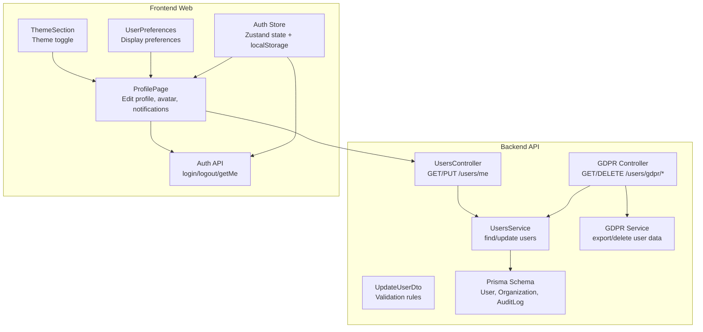

**Diagram sources**
- [users.controller.ts:16-75](file://apps/api/src/modules/users/users.controller.ts#L16-L75)
- [users.service.ts:37-203](file://apps/api/src/modules/users/users.service.ts#L37-L203)
- [update-user.dto.ts:4-36](file://apps/api/src/modules/users/dto/update-user.dto.ts#L4-L36)
- [gdpr.controller.ts:8-31](file://apps/api/src/modules/users/gdpr.controller.ts#L8-L31)
- [gdpr.service.ts:40-57](file://apps/api/src/modules/users/gdpr.service.ts#L40-L57)
- [schema.prisma:245-286](file://prisma/schema.prisma#L245-L286)
- [ProfilePage.tsx:64-506](file://apps/web/src/pages/settings/ProfilePage.tsx#L64-L506)
- [ThemeToggle.tsx:87-115](file://apps/web/src/components/settings/ThemeToggle.tsx#L87-L115)
- [UserPreferences.tsx:952-993](file://apps/web/src/components/personalization/UserPreferences.tsx#L952-L993)
- [auth.ts:54-173](file://apps/web/src/stores/auth.ts#L54-L173)
- [auth.ts:17-98](file://apps/web/src/api/auth.ts#L17-L98)

**Section sources**
- [users.controller.ts:16-75](file://apps/api/src/modules/users/users.controller.ts#L16-L75)
- [users.service.ts:37-203](file://apps/api/src/modules/users/users.service.ts#L37-L203)
- [update-user.dto.ts:4-36](file://apps/api/src/modules/users/dto/update-user.dto.ts#L4-L36)
- [schema.prisma:245-286](file://prisma/schema.prisma#L245-L286)
- [gdpr.controller.ts:8-31](file://apps/api/src/modules/users/gdpr.controller.ts#L8-L31)
- [gdpr.service.ts:40-57](file://apps/api/src/modules/users/gdpr.service.ts#L40-L57)
- [ProfilePage.tsx:64-506](file://apps/web/src/pages/settings/ProfilePage.tsx#L64-L506)
- [ThemeToggle.tsx:87-115](file://apps/web/src/components/settings/ThemeToggle.tsx#L87-L115)
- [UserPreferences.tsx:952-993](file://apps/web/src/components/personalization/UserPreferences.tsx#L952-L993)
- [auth.ts:54-173](file://apps/web/src/stores/auth.ts#L54-L173)
- [auth.ts:17-98](file://apps/web/src/api/auth.ts#L17-L98)

## Core Components
- Backend user management:
  - Controller exposes GET/PUT endpoints for current user profile and admin user listing/fetching
  - Service implements findById, update, findAll, and mapping to UserProfile
  - DTO enforces validation rules for profile updates
- GDPR compliance:
  - Controller exposes export and delete endpoints
  - Service implements data export and soft/hard deletion logic
- Frontend profile editing:
  - ProfilePage handles avatar upload, profile fields, and notification preferences
  - ThemeSection and UserPreferences manage appearance and display settings
  - Auth store manages tokens and user hydration with localStorage persistence

**Section sources**
- [users.controller.ts:23-74](file://apps/api/src/modules/users/users.controller.ts#L23-L74)
- [users.service.ts:7-35](file://apps/api/src/modules/users/users.service.ts#L7-L35)
- [update-user.dto.ts:4-36](file://apps/api/src/modules/users/dto/update-user.dto.ts#L4-L36)
- [gdpr.controller.ts:15-30](file://apps/api/src/modules/users/gdpr.controller.ts#L15-L30)
- [gdpr.service.ts:5-38](file://apps/api/src/modules/users/gdpr.service.ts#L5-L38)
- [ProfilePage.tsx:136-183](file://apps/web/src/pages/settings/ProfilePage.tsx#L136-L183)
- [ThemeToggle.tsx:90-115](file://apps/web/src/components/settings/ThemeToggle.tsx#L90-L115)
- [UserPreferences.tsx:952-993](file://apps/web/src/components/personalization/UserPreferences.tsx#L952-L993)
- [auth.ts:54-173](file://apps/web/src/stores/auth.ts#L54-L173)

## Architecture Overview
The user profile management architecture integrates frontend and backend components with strict authentication and authorization controls. The frontend interacts with the backend via authenticated API calls, while the backend validates inputs, enforces permissions, and persists data using Prisma.

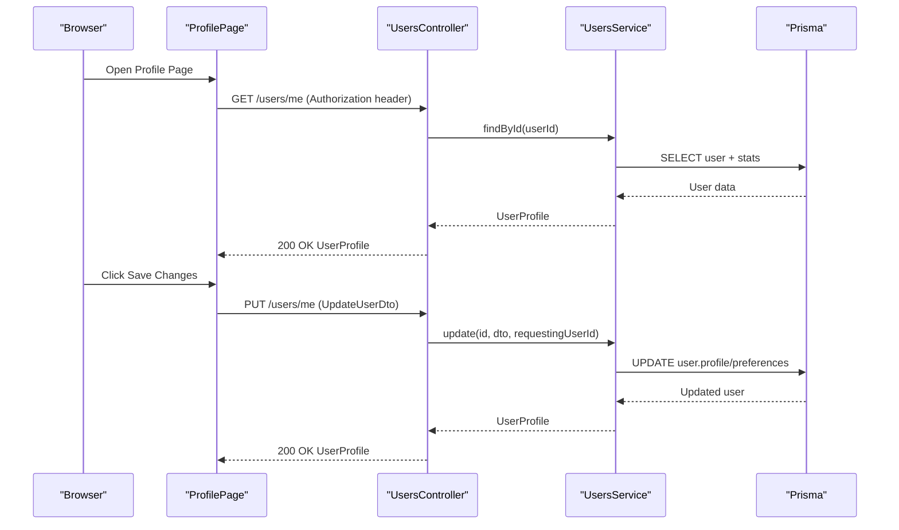

**Diagram sources**
- [users.controller.ts:23-38](file://apps/api/src/modules/users/users.controller.ts#L23-L38)
- [users.service.ts:75-127](file://apps/api/src/modules/users/users.service.ts#L75-L127)
- [ProfilePage.tsx:136-183](file://apps/web/src/pages/settings/ProfilePage.tsx#L136-L183)

**Section sources**
- [users.controller.ts:23-38](file://apps/api/src/modules/users/users.controller.ts#L23-L38)
- [users.service.ts:75-127](file://apps/api/src/modules/users/users.service.ts#L75-L127)
- [ProfilePage.tsx:136-183](file://apps/web/src/pages/settings/ProfilePage.tsx#L136-L183)

## Detailed Component Analysis

### Backend User Management

#### Data Model and Validation
- User entity includes profile and preferences as JSON fields with indexes for performance
- UpdateUserDto defines validation rules for name, phone, timezone, and preferences
- UserProfile interface consolidates profile, preferences, organization, and statistics

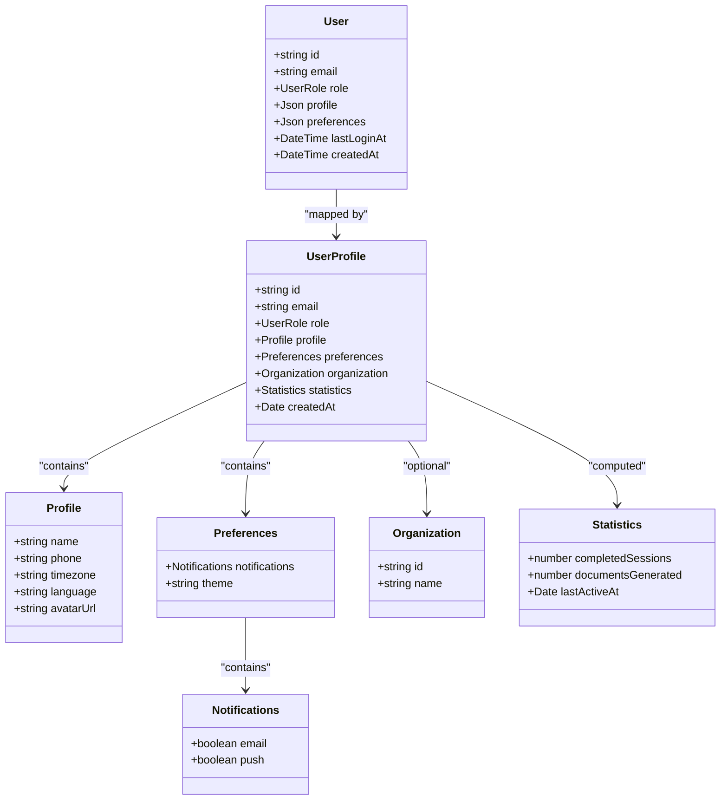

**Diagram sources**
- [schema.prisma:245-286](file://prisma/schema.prisma#L245-L286)
- [users.service.ts:7-35](file://apps/api/src/modules/users/users.service.ts#L7-L35)

**Section sources**
- [schema.prisma:245-286](file://prisma/schema.prisma#L245-L286)
- [users.service.ts:7-35](file://apps/api/src/modules/users/users.service.ts#L7-L35)
- [update-user.dto.ts:4-36](file://apps/api/src/modules/users/dto/update-user.dto.ts#L4-L36)

#### Controller Operations
- GET /users/me returns current user profile
- PUT /users/me updates current user profile with validation and permission checks
- Admin-only endpoints:
  - GET /users lists users with role filtering and pagination
  - GET /users/:id fetches a user by ID

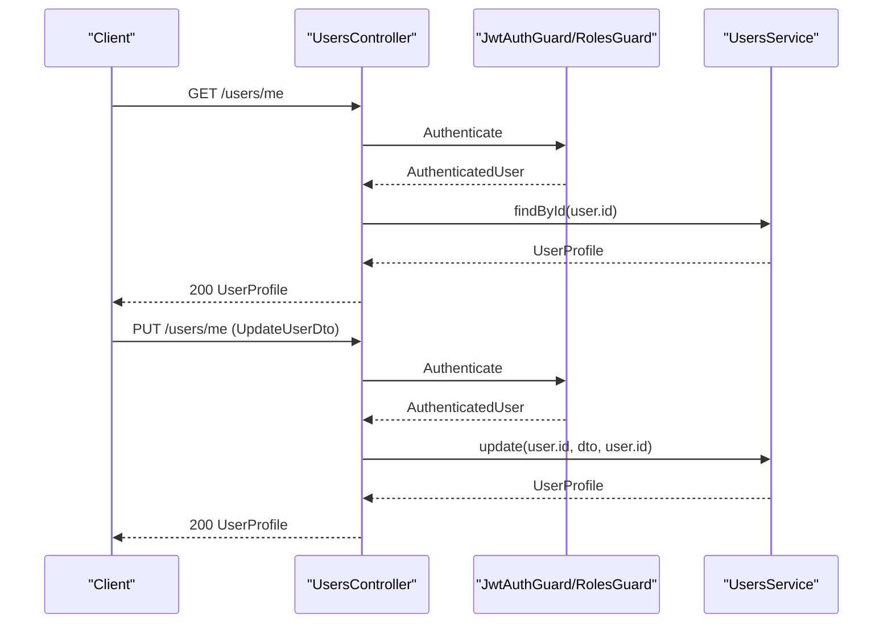

**Diagram sources**
- [users.controller.ts:23-38](file://apps/api/src/modules/users/users.controller.ts#L23-L38)
- [users.service.ts:75-127](file://apps/api/src/modules/users/users.service.ts#L75-L127)

**Section sources**
- [users.controller.ts:23-74](file://apps/api/src/modules/users/users.controller.ts#L23-L74)
- [users.service.ts:41-127](file://apps/api/src/modules/users/users.service.ts#L41-L127)

#### Service Implementation Details
- findById queries user with organization inclusion and counts completed sessions and generated documents
- update enforces self-service updates and admin bypass, merges partial profile and preferences updates
- findAll paginates users with optional role filter and computes statistics

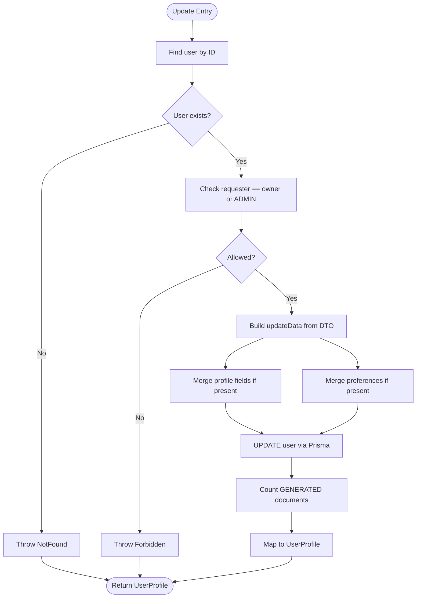

**Diagram sources**
- [users.service.ts:75-127](file://apps/api/src/modules/users/users.service.ts#L75-L127)

**Section sources**
- [users.service.ts:75-164](file://apps/api/src/modules/users/users.service.ts#L75-L164)

### GDPR Compliance Features

#### Data Export and Deletion Endpoints
- GET /users/gdpr/export exports user profile, sessions, documents, and audit logs
- DELETE /users/gdpr/delete deletes user data according to the documented deletion process

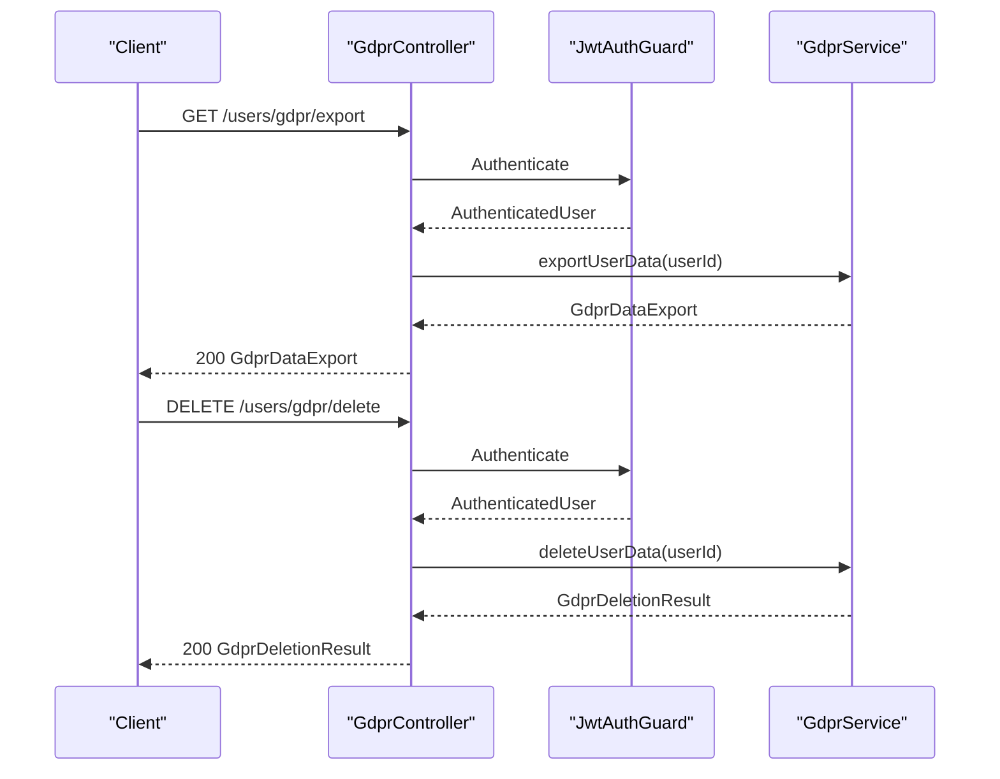

**Diagram sources**
- [gdpr.controller.ts:15-30](file://apps/api/src/modules/users/gdpr.controller.ts#L15-L30)
- [gdpr.service.ts:50-57](file://apps/api/src/modules/users/gdpr.service.ts#L50-L57)

**Section sources**
- [gdpr.controller.ts:15-30](file://apps/api/src/modules/users/gdpr.controller.ts#L15-L30)
- [gdpr.service.ts:5-38](file://apps/api/src/modules/users/gdpr.service.ts#L5-L38)

#### Deletion Process
The deletion process follows a documented workflow with verification, soft deletion, grace period, restoration, and hard deletion.

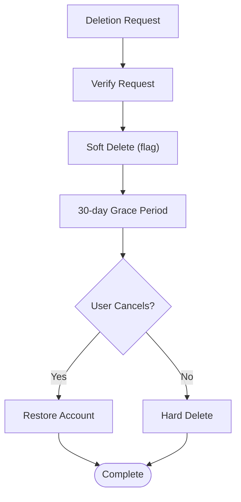

**Diagram sources**
- [10-data-protection-privacy-policy.md:185-213](file://docs/cto/10-data-protection-privacy-policy.md#L185-L213)

**Section sources**
- [10-data-protection-privacy-policy.md:185-213](file://docs/cto/10-data-protection-privacy-policy.md#L185-L213)

### Frontend Profile Interface

#### Profile Editing and Validation
- ProfilePage manages avatar upload (size/type validation), profile fields, and notification preferences
- Uses optimistic updates and rollback on error
- Integrates with backend via PATCH /users/profile and POST /users/avatar

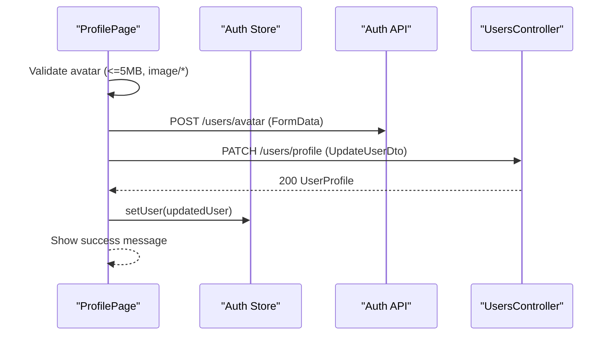

**Diagram sources**
- [ProfilePage.tsx:113-183](file://apps/web/src/pages/settings/ProfilePage.tsx#L113-L183)
- [auth.ts:94-97](file://apps/web/src/api/auth.ts#L94-L97)

**Section sources**
- [ProfilePage.tsx:113-183](file://apps/web/src/pages/settings/ProfilePage.tsx#L113-L183)
- [auth.ts:94-97](file://apps/web/src/api/auth.ts#L94-L97)

#### Theme Customization and Personalization
- ThemeSection provides theme toggling and displays system preference resolution
- UserPreferences manages color theme and font size selections
- These settings are persisted in user preferences and applied in the UI

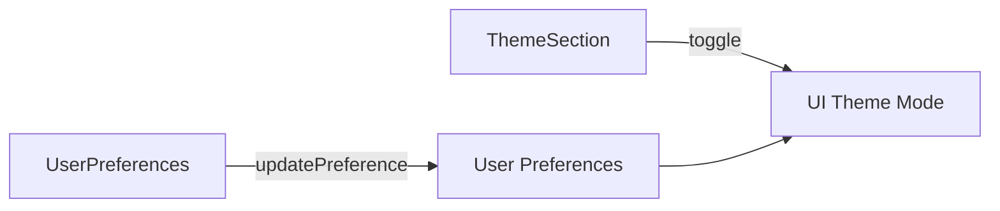

**Diagram sources**
- [ThemeToggle.tsx:90-115](file://apps/web/src/components/settings/ThemeToggle.tsx#L90-L115)
- [UserPreferences.tsx:952-993](file://apps/web/src/components/personalization/UserPreferences.tsx#L952-L993)

**Section sources**
- [ThemeToggle.tsx:90-115](file://apps/web/src/components/settings/ThemeToggle.tsx#L90-L115)
- [UserPreferences.tsx:952-993](file://apps/web/src/components/personalization/UserPreferences.tsx#L952-L993)

### Authentication and Session Management
- Auth store manages access/refresh tokens and user hydration with localStorage persistence
- On rehydration, if refresh token exists without access token, it proactively refreshes
- API base URL resolution matches backend deployment configuration

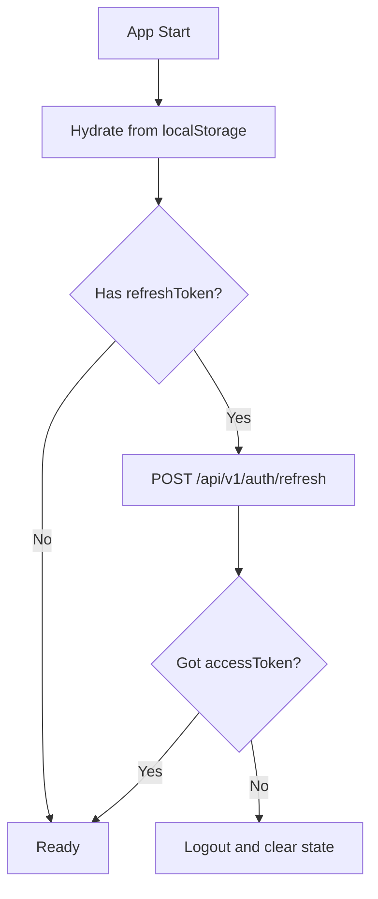

**Diagram sources**
- [auth.ts:150-169](file://apps/web/src/stores/auth.ts#L150-L169)

**Section sources**
- [auth.ts:54-173](file://apps/web/src/stores/auth.ts#L54-L173)

## Dependency Analysis
- Backend dependencies:
  - UsersController depends on UsersService and guards for authentication/authorization
  - UsersService depends on PrismaService and DTOs for validation
  - GDPR Controller depends on GDPR Service and JwtAuthGuard
- Frontend dependencies:
  - ProfilePage depends on Auth API and uses optimistic updates
  - ThemeSection and UserPreferences depend on theme hooks and preferences store
  - Auth store depends on axios and localStorage for persistence

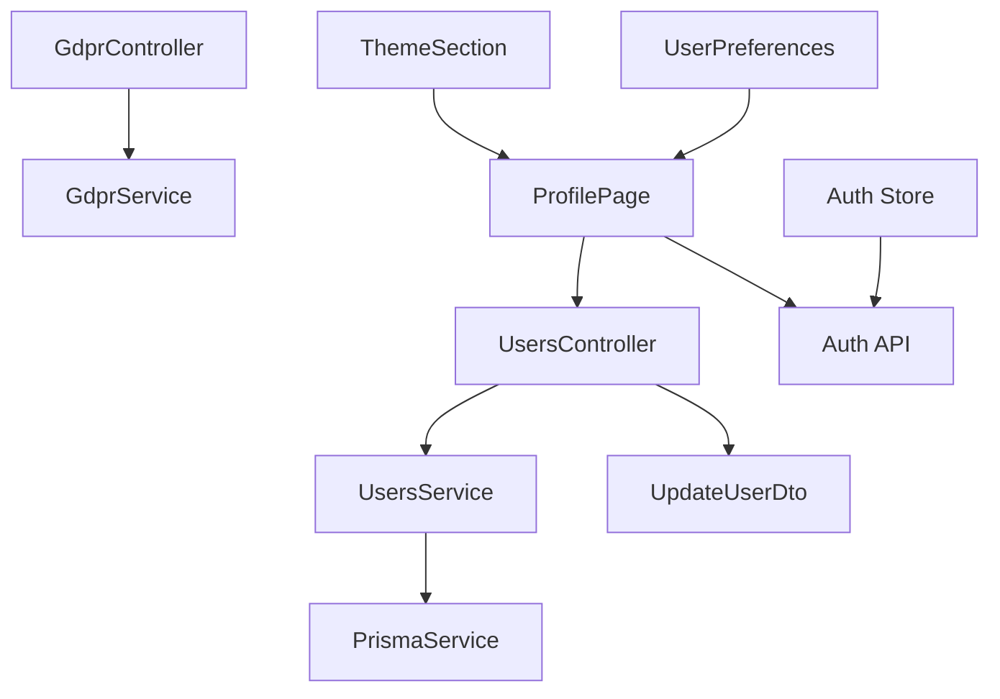

**Diagram sources**
- [users.controller.ts:1-12](file://apps/api/src/modules/users/users.controller.ts#L1-L12)
- [users.service.ts:1-6](file://apps/api/src/modules/users/users.service.ts#L1-L6)
- [gdpr.controller.ts:1-6](file://apps/api/src/modules/users/gdpr.controller.ts#L1-L6)
- [ProfilePage.tsx:64-183](file://apps/web/src/pages/settings/ProfilePage.tsx#L64-L183)
- [ThemeToggle.tsx:90-115](file://apps/web/src/components/settings/ThemeToggle.tsx#L90-L115)
- [UserPreferences.tsx:952-993](file://apps/web/src/components/personalization/UserPreferences.tsx#L952-L993)
- [auth.ts:54-173](file://apps/web/src/stores/auth.ts#L54-L173)

**Section sources**
- [users.controller.ts:1-12](file://apps/api/src/modules/users/users.controller.ts#L1-L12)
- [users.service.ts:1-6](file://apps/api/src/modules/users/users.service.ts#L1-L6)
- [gdpr.controller.ts:1-6](file://apps/api/src/modules/users/gdpr.controller.ts#L1-L6)
- [ProfilePage.tsx:64-183](file://apps/web/src/pages/settings/ProfilePage.tsx#L64-L183)
- [ThemeToggle.tsx:90-115](file://apps/web/src/components/settings/ThemeToggle.tsx#L90-L115)
- [UserPreferences.tsx:952-993](file://apps/web/src/components/personalization/UserPreferences.tsx#L952-L993)
- [auth.ts:54-173](file://apps/web/src/stores/auth.ts#L54-L173)

## Performance Considerations
- Use of include and count queries in UsersService minimizes round trips
- Pagination in findAll prevents large result sets
- DTO validation reduces unnecessary database writes
- Frontend optimistic updates improve perceived responsiveness

## Troubleshooting Guide
- Permission errors:
  - Ensure the requester matches the user ID or has ADMIN/SUPER_ADMIN role for updates
- Validation failures:
  - Verify DTO constraints (string lengths, object presence) before sending requests
- GDPR export/delete:
  - Confirm user exists and authentication is valid
- Frontend state sync:
  - If localStorage state appears inconsistent, the auth store includes retry mechanisms and fallbacks

**Section sources**
- [users.service.ts:85-88](file://apps/api/src/modules/users/users.service.ts#L85-L88)
- [update-user.dto.ts:4-36](file://apps/api/src/modules/users/dto/update-user.dto.ts#L4-L36)
- [gdpr.controller.ts:15-30](file://apps/api/src/modules/users/gdpr.controller.ts#L15-L30)
- [auth.ts:98-123](file://apps/web/src/stores/auth.ts#L98-L123)

## Conclusion
The user profile management system provides a secure, validated, and compliant way to manage user data. It integrates frontend editing with robust backend services, supports GDPR compliance through export and deletion endpoints, and offers flexible personalization and theme customization. Authentication and session management are handled securely with token persistence and proactive refresh logic.

## Appendices

### API Definitions

- GET /users/me
  - Description: Retrieve current user profile
  - Authentication: Required (Bearer)
  - Response: UserProfile

- PUT /users/me
  - Description: Update current user profile
  - Authentication: Required (Bearer)
  - Request body: UpdateUserDto
  - Response: UserProfile

- GET /users
  - Description: List users (Admin only)
  - Authentication: Required (Bearer + Roles)
  - Query params: role (enum), pagination via PaginationDto
  - Response: { items: UserProfile[], pagination }

- GET /users/:id
  - Description: Get user by ID (Admin only)
  - Authentication: Required (Bearer + Roles)
  - Response: UserProfile

- GET /users/gdpr/export
  - Description: Export all personal data (GDPR Article 15/20)
  - Authentication: Required (Bearer)
  - Response: GdprDataExport

- DELETE /users/gdpr/delete
  - Description: Delete all personal data (GDPR Article 17)
  - Authentication: Required (Bearer)
  - Response: GdprDeletionResult

**Section sources**
- [users.controller.ts:23-74](file://apps/api/src/modules/users/users.controller.ts#L23-L74)
- [gdpr.controller.ts:15-30](file://apps/api/src/modules/users/gdpr.controller.ts#L15-L30)

### Data Privacy and Audit Logging
- Audit logs capture user actions with IP address, user agent, and request correlation
- GDPR export includes user profile, sessions, documents, and audit logs for transparency
- Deletion process includes soft deletion and grace period for restoration

**Section sources**
- [schema.prisma:780-799](file://prisma/schema.prisma#L780-L799)
- [gdpr.service.ts:5-38](file://apps/api/src/modules/users/gdpr.service.ts#L5-L38)
- [10-data-protection-privacy-policy.md:185-213](file://docs/cto/10-data-protection-privacy-policy.md#L185-L213)