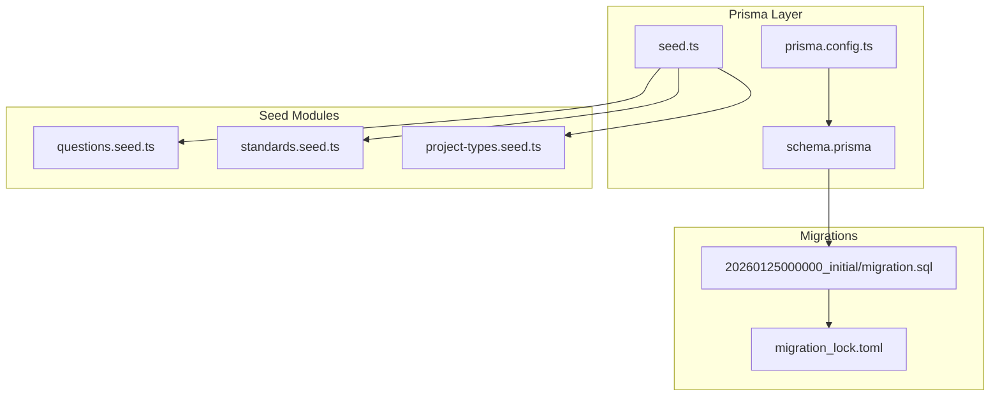
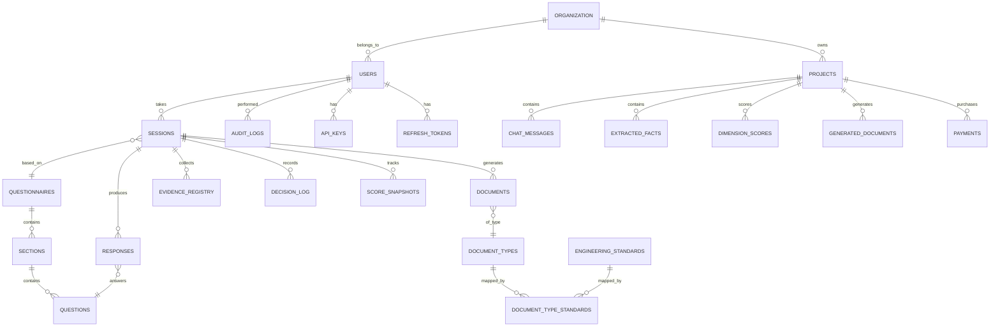
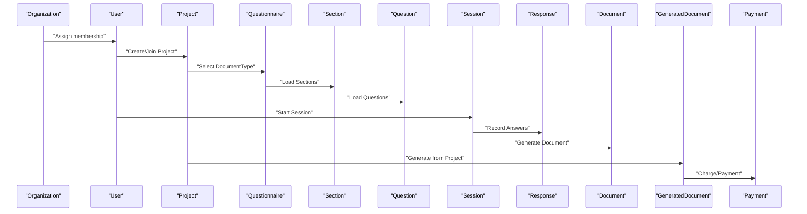
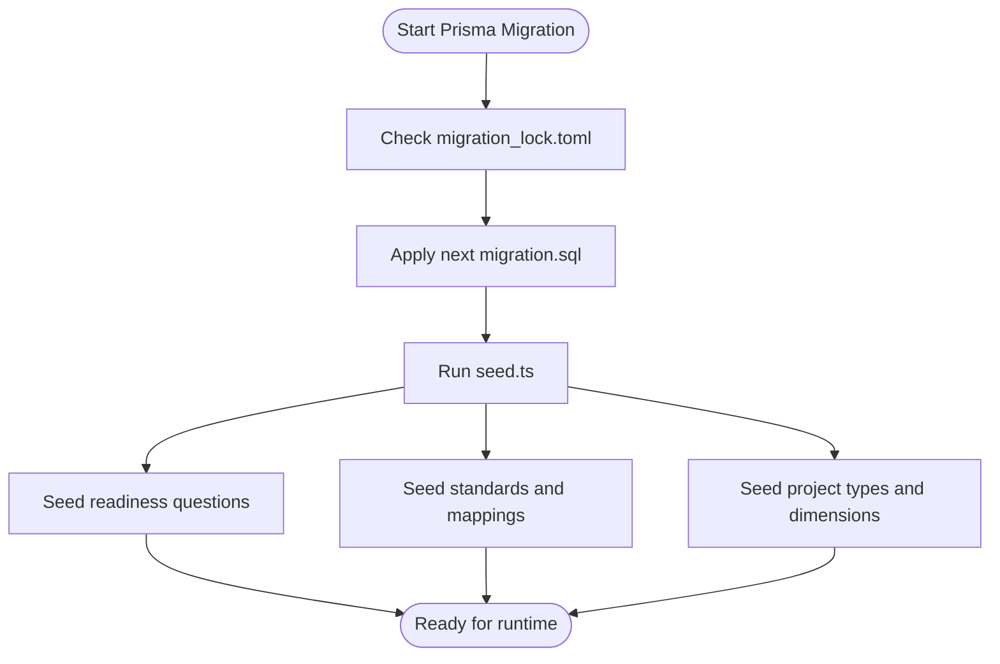
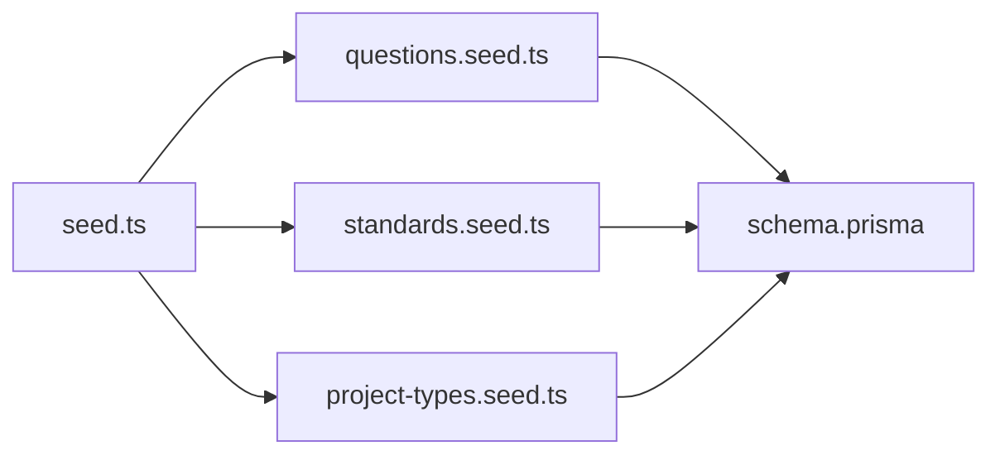

# Database Design

<cite>
**Referenced Files in This Document**
- [schema.prisma](file://prisma/schema.prisma)
- [migration_lock.toml](file://prisma/migrations/migration_lock.toml)
- [prisma.config.ts](file://prisma/prisma.config.ts)
- [seed.ts](file://prisma/seed.ts)
- [20260125000000_initial/migration.sql](file://prisma/migrations/20260125000000_initial/migration.sql)
- [questions.seed.ts](file://prisma/seeds/questions.seed.ts)
- [standards.seed.ts](file://prisma/seeds/standards.seed.ts)
- [project-types.seed.ts](file://prisma/seeds/project-types.seed.ts)
</cite>

## Table of Contents
1. [Introduction](#introduction)
2. [Project Structure](#project-structure)
3. [Core Components](#core-components)
4. [Architecture Overview](#architecture-overview)
5. [Detailed Component Analysis](#detailed-component-analysis)
6. [Dependency Analysis](#dependency-analysis)
7. [Performance Considerations](#performance-considerations)
8. [Troubleshooting Guide](#troubleshooting-guide)
9. [Conclusion](#conclusion)
10. [Appendices](#appendices)

## Introduction
This document provides comprehensive database design documentation for Quiz-to-Build’s PostgreSQL-backed Prisma schema. It details the data model for entities central to assessment workflows, user management, document generation, and compliance tracking. The schema supports multi-tenant organizations, adaptive questionnaires, interactive sessions, evidence registry, decision logs, and AI-powered document generation. The document also explains migration strategy via Prisma Migrate, seed data implementation, indexing and foreign key strategies, performance considerations, and security/access patterns.

## Project Structure
The database design is defined in Prisma’s declarative schema and materialized through SQL migrations. The seed system initializes foundational data including organizations, users, questionnaires, dimensions, standards, and project types. The configuration integrates with Prisma’s client generator and migration engine.

**Diagram sources**
- [schema.prisma](file://prisma/schema.prisma)
- [prisma.config.ts](file://prisma/prisma.config.ts)
- [seed.ts](file://prisma/seed.ts)
- [migration_lock.toml](file://prisma/migrations/migration_lock.toml)
- [20260125000000_initial/migration.sql](file://prisma/migrations/20260125000000_initial/migration.sql)
- [questions.seed.ts](file://prisma/seeds/questions.seed.ts)
- [standards.seed.ts](file://prisma/seeds/standards.seed.ts)
- [project-types.seed.ts](file://prisma/seeds/project-types.seed.ts)

**Section sources**
- [schema.prisma](file://prisma/schema.prisma)
- [prisma.config.ts](file://prisma/prisma.config.ts)
- [seed.ts](file://prisma/seed.ts)
- [migration_lock.toml](file://prisma/migrations/migration_lock.toml)
- [20260125000000_initial/migration.sql](file://prisma/migrations/20260125000000_initial/migration.sql)

## Core Components
This section outlines the principal entities and their roles in the system.

- Organization: Tenant container with settings and subscription metadata; supports soft-deletion via deleted_at.
- User: Authenticatable person with role-based access, MFA, and audit trail; belongs to an Organization.
- Questionnaire: Assessment blueprint with sections and questions; supports default and active flags.
- Section: Logical grouping of questions within a questionnaire.
- Question: Individual assessment item with type, validation, persona targeting, and dimension mapping.
- Session: Active assessment instance with adaptive state, progress tracking, and readiness scoring.
- Response: User-provided answers to questions, with validation and coverage tracking.
- DocumentType: Template-driven specification for generated documents with category, formats, and pricing.
- Document: Instance of a generated document tied to a Session.
- AuditLog: Append-only record of user/system actions for compliance.
- EvidenceRegistry: Attachments and verification workflow for supporting evidence.
- DecisionLog: Append-only decision record with owner and status.
- EngineeringStandard and DocumentTypeStandard: Standards catalog and mappings to document types.
- Quiz2Biz extensions: Project, ProjectType, ChatMessage, ExtractedFact, QualityDimension, DimensionScore, GeneratedDocument, Payment.

**Section sources**
- [schema.prisma](file://prisma/schema.prisma)

## Architecture Overview
The schema models a multi-tenant assessment and document generation platform. Organizations own Users and Projects. Users participate in Sessions that traverse Questionnaires and Sections, producing Responses. Responses feed readiness scoring and evidence collection. Documents are generated from Sessions or Projects, optionally tied to AI providers and payments.

**Diagram sources**
- [schema.prisma](file://prisma/schema.prisma)

## Detailed Component Analysis

### Entity Relationships and Constraints
- Foreign Keys:
  - Users belong to Organizations (SetNull on delete).
  - Sessions belong to Users and Questionnaires (Restrict on questionnaire delete).
  - Responses belong to Sessions and Questions (Cascade deletes).
  - Documents belong to Sessions and DocumentTypes (Restrict on type delete).
  - EvidenceRegistry belongs to Sessions and Questions.
  - AuditLogs belong to Users (SetNull on delete).
  - Project-related entities cascade appropriately for chat, facts, scores, and documents.
- Indexes:
  - Unique and composite indexes on slugs, emails, tokens, and composite keys to optimize lookups and uniqueness.
  - Range and equality indexes on timestamps, statuses, and foreign keys to accelerate filtering and joins.

**Section sources**
- [20260125000000_initial/migration.sql](file://prisma/migrations/20260125000000_initial/migration.sql)
- [schema.prisma](file://prisma/schema.prisma)

### Data Access Patterns and Workflows
- Assessment flow:
  - Create Organization and User.
  - Select ProjectType and Questionnaire; initialize Session.
  - Traverse Sections and Questions; collect Responses.
  - Track readiness score via ScoreSnapshot and update Session progress.
- Evidence and compliance:
  - Upload artifacts to EvidenceRegistry; mark verified; derive coverage.
  - Record decisions in DecisionLog; maintain append-only history.
- Document generation:
  - Generate Documents from Sessions or Projects; map to DocumentTypes.
  - Optionally integrate AI providers and payments.

**Diagram sources**
- [schema.prisma](file://prisma/schema.prisma)

### Migration Strategy and Seed Data
- Prisma Migrate:
  - Uses DATABASE_URL from environment; migration_lock.toml ensures safe concurrent migrations.
  - Initial migration establishes core tables, enums, indexes, and foreign keys.
- Seed Data:
  - seed.ts orchestrates creation of default Organization, Admin user, AI providers, and core Questionnaire.
  - questions.seed.ts populates Quiz2Biz readiness questions with persona, severity, standards, and acceptance criteria.
  - standards.seed.ts seeds EngineeringStandard and maps them to DocumentType via DocumentTypeStandard.
  - project-types.seed.ts creates ProjectType, dimension catalogs, and DocumentType definitions.

**Diagram sources**
- [migration_lock.toml](file://prisma/migrations/migration_lock.toml)
- [20260125000000_initial/migration.sql](file://prisma/migrations/20260125000000_initial/migration.sql)
- [seed.ts](file://prisma/seed.ts)
- [questions.seed.ts](file://prisma/seeds/questions.seed.ts)
- [standards.seed.ts](file://prisma/seeds/standards.seed.ts)
- [project-types.seed.ts](file://prisma/seeds/project-types.seed.ts)

**Section sources**
- [prisma.config.ts](file://prisma/prisma.config.ts)
- [migration_lock.toml](file://prisma/migrations/migration_lock.toml)
- [20260125000000_initial/migration.sql](file://prisma/migrations/20260125000000_initial/migration.sql)
- [seed.ts](file://prisma/seed.ts)
- [questions.seed.ts](file://prisma/seeds/questions.seed.ts)
- [standards.seed.ts](file://prisma/seeds/standards.seed.ts)
- [project-types.seed.ts](file://prisma/seeds/project-types.seed.ts)

### Data Integrity and Security Controls
- Enums and defaults:
  - Centralized enums for roles, question types, session status, visibility actions, document categories/status, standards, and more.
  - Defaults for booleans, decimals, JSON fields, and timestamps ensure consistent state.
- Foreign key constraints:
  - Restrict on questionnaire deletion prevents orphaned sessions.
  - Cascade on responses ensures cleanup when sessions or questions are removed.
- Indexes:
  - Unique indexes on slugs and emails; composite indexes on (sessionId, questionId) for responses; indexes on timestamps and status fields.
- Audit and compliance:
  - AuditLog captures actions, IP, user agent, and request correlation.
  - DecisionLog is append-only with status tracking.
  - EvidenceRegistry supports verification, hashing, and metadata for integrity.

**Section sources**
- [schema.prisma](file://prisma/schema.prisma)
- [20260125000000_initial/migration.sql](file://prisma/migrations/20260125000000_initial/migration.sql)

### Multi-Tenancy and Access Control
- Multi-tenancy:
  - Organization as tenant root; Users belong to Organization via org_id with SetNull on delete.
  - Project and ProjectType enable per-tenant workspaces and document catalogs.
- Access control:
  - User roles (CLIENT, DEVELOPER, ADMIN, SUPER_ADMIN) govern access.
  - API keys scoped per user; refresh tokens tracked with expiry.
  - OAuth accounts integrate external identity providers.

**Section sources**
- [schema.prisma](file://prisma/schema.prisma)

### Data Lifecycle, Retention, and Archival
- Soft deletion:
  - Organizations and Users support deleted_at for soft-deletion semantics.
- Expiration:
  - Sessions include expires_at; Responses include answered_at; Documents include generated_at and expires_at.
- Retention:
  - Recommendation: Archive old Sessions and Responses after retention periods; retain AuditLogs and DecisionLogs per compliance requirements.
- Archival:
  - Historical ScoreSnapshot entries can be moved to cold storage; EvidenceRegistry URLs should remain accessible or mirrored.

[No sources needed since this section provides general guidance]

## Dependency Analysis
This section maps module-level dependencies among seed modules and their relationships to the schema.

**Diagram sources**
- [seed.ts](file://prisma/seed.ts)
- [questions.seed.ts](file://prisma/seeds/questions.seed.ts)
- [standards.seed.ts](file://prisma/seeds/standards.seed.ts)
- [project-types.seed.ts](file://prisma/seeds/project-types.seed.ts)
- [schema.prisma](file://prisma/schema.prisma)

**Section sources**
- [seed.ts](file://prisma/seed.ts)
- [questions.seed.ts](file://prisma/seeds/questions.seed.ts)
- [standards.seed.ts](file://prisma/seeds/standards.seed.ts)
- [project-types.seed.ts](file://prisma/seeds/project-types.seed.ts)
- [schema.prisma](file://prisma/schema.prisma)

## Performance Considerations
- Indexing strategy:
  - Ensure selective indexes on frequently filtered columns (status, category, timestamps).
  - Composite indexes for join-heavy queries (responses by session and question).
- Query patterns:
  - Prefer paginated reads for long lists (sessions, documents, audit logs).
  - Use connection pooling and Prisma batching for bulk inserts (e.g., seed data).
- Data types:
  - Use decimal types for monetary and scoring fields to avoid floating-point precision issues.
  - JSON fields for flexible metadata; consider normalization if queries become complex.
- Caching:
  - Cache frequently accessed enumerations and static configuration (e.g., DocumentType, ProjectType).
  - Cache user preferences and organization settings.
- Concurrency:
  - Use database transactions for atomic updates (e.g., session progress, payment state).
  - Apply row-level locking for scoring and evidence updates.

[No sources needed since this section provides general guidance]

## Troubleshooting Guide
- Migration conflicts:
  - Verify migration_lock.toml presence and integrity; ensure DATABASE_URL points to the correct database.
- Seed failures:
  - Confirm seed.ts runs after schema is up-to-date; check Prisma client version compatibility.
- Missing indexes:
  - Review migration.sql for missing indexes; add composite indexes for frequent JOINs.
- Data inconsistencies:
  - Validate foreign keys; check restrict vs. cascade policies for critical entities.
- Audit anomalies:
  - Confirm AuditLog indexes and ensure request_id correlation for traceability.

**Section sources**
- [migration_lock.toml](file://prisma/migrations/migration_lock.toml)
- [20260125000000_initial/migration.sql](file://prisma/migrations/20260125000000_initial/migration.sql)
- [seed.ts](file://prisma/seed.ts)

## Conclusion
The Quiz-to-Build database design leverages Prisma’s strong typing and migrations to model a robust, multi-tenant assessment and document generation platform. The schema emphasizes referential integrity, performance through strategic indexing, and compliance via audit and decision logs. The seed system establishes a coherent foundation for questionnaires, standards, and project types, enabling rapid onboarding and consistent behavior across tenants.

## Appendices

### Appendix A: Enumerations and Categories
- Roles: CLIENT, DEVELOPER, ADMIN, SUPER_ADMIN
- Question types: TEXT, TEXTAREA, NUMBER, EMAIL, URL, DATE, SINGLE_CHOICE, MULTIPLE_CHOICE, SCALE, FILE_UPLOAD, MATRIX
- Session status: IN_PROGRESS, COMPLETED, ABANDONED, EXPIRED
- Visibility actions: SHOW, HIDE, REQUIRE, UNREQUIRE
- Document categories: CTO, CFO, BA, CEO, POLICY, SEO
- Document status: PENDING, GENERATING, GENERATED, PENDING_REVIEW, APPROVED, REJECTED, FAILED
- Standard categories: MODERN_ARCHITECTURE, AI_ASSISTED_DEV, CODING_STANDARDS, TESTING_QA, SECURITY_DEVSECOPS, WORKFLOW_OPS, DOCS_KNOWLEDGE
- Persona: CTO, CFO, CEO, BA, POLICY
- Evidence types: FILE, IMAGE, LINK, LOG, SBOM, REPORT, TEST_RESULT, SCREENSHOT, DOCUMENT
- Decision status: DRAFT, LOCKED, AMENDED, SUPERSEDED
- Coverage level: NONE, PARTIAL, HALF, SUBSTANTIAL, FULL
- Project status: DRAFT, ACTIVE, ARCHIVED, COMPLETED
- Payment status: PENDING, PROCESSING, COMPLETED, FAILED, REFUNDED
- Output format: DOCX, PDF, MARKDOWN

**Section sources**
- [schema.prisma](file://prisma/schema.prisma)

### Appendix B: Representative Queries and Reporting Patterns
- Count sessions by status per user:
  - SELECT status, COUNT(*) FROM sessions WHERE user_id = ? GROUP BY status
- Retrieve recent audit logs for a user:
  - SELECT * FROM audit_logs WHERE user_id = ? ORDER BY created_at DESC LIMIT 100
- Find documents generated in the last 30 days:
  - SELECT * FROM documents WHERE generated_at >= NOW() - INTERVAL '30 days'
- Compute average readiness score per project type:
  - SELECT pt.name, AVG(s.readiness_score) FROM sessions s JOIN project_types pt ON s.project_type_id = pt.id GROUP BY pt.name
- List pending payments with associated generated documents:
  - SELECT p.*, gd.file_name FROM payments p JOIN generated_documents gd ON p.generated_document_id = gd.id WHERE p.status = 'PENDING'

[No sources needed since this section provides general guidance]