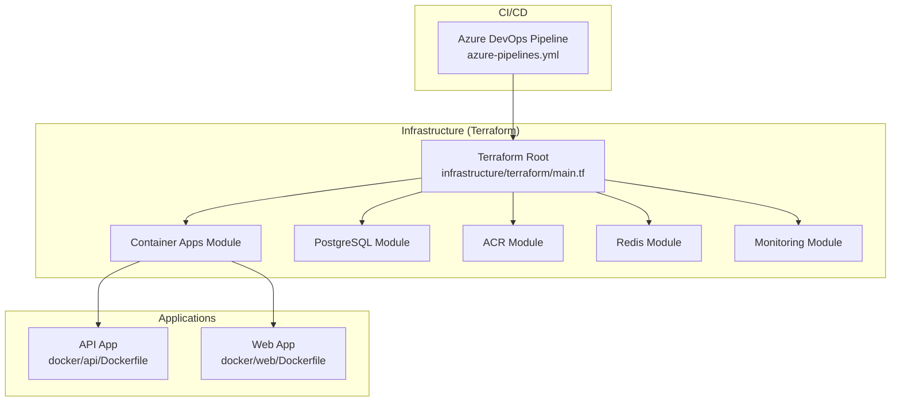
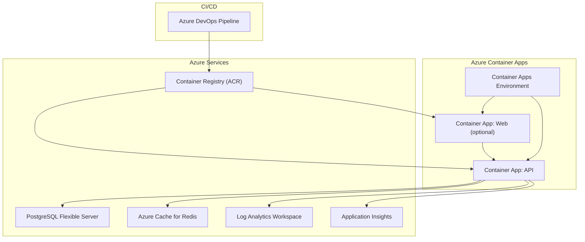
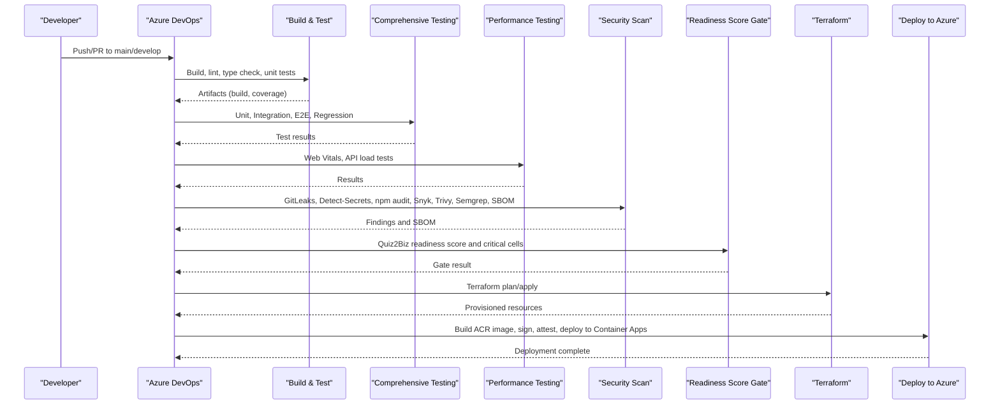
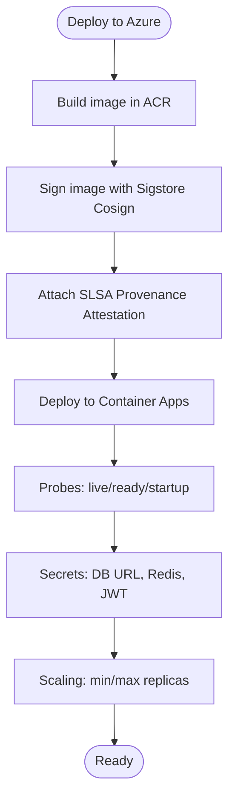
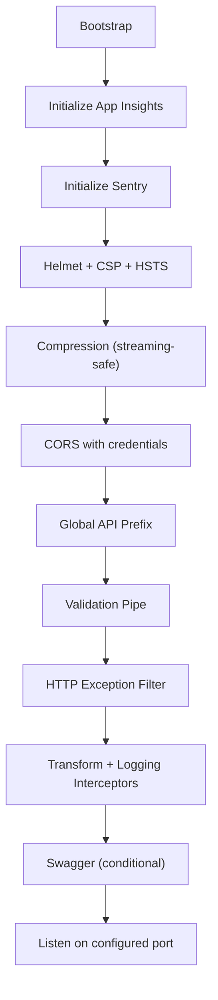
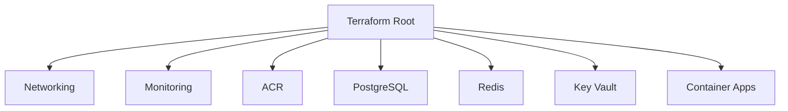
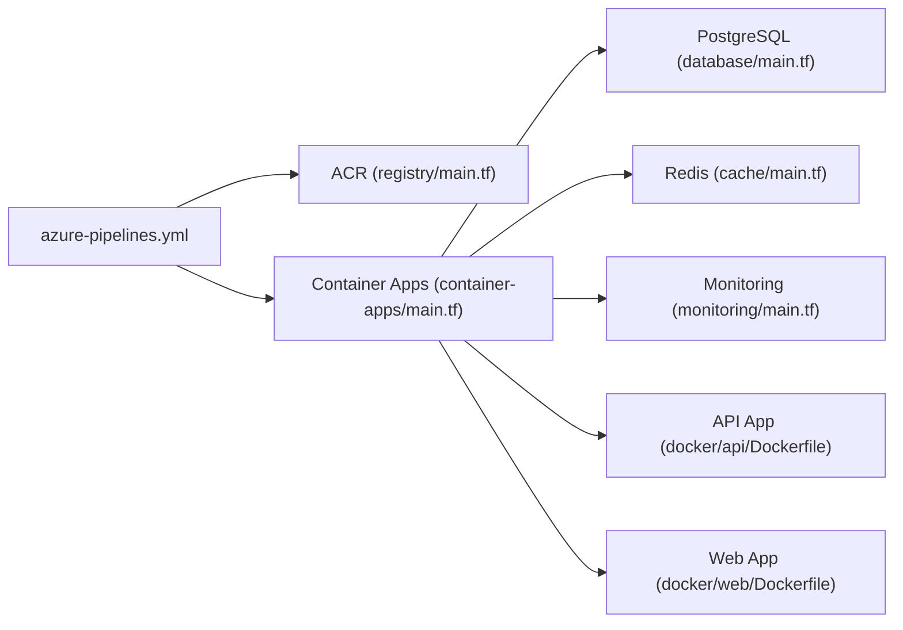

# Cloud Deployment & Azure

<cite>
**Referenced Files in This Document**
- [azure-pipelines.yml](file://azure-pipelines.yml)
- [main.tf](file://infrastructure/terraform/main.tf)
- [container-apps/main.tf](file://infrastructure/terraform/modules/container-apps/main.tf)
- [database/main.tf](file://infrastructure/terraform/modules/database/main.tf)
- [registry/main.tf](file://infrastructure/terraform/modules/registry/main.tf)
- [cache/main.tf](file://infrastructure/terraform/modules/cache/main.tf)
- [monitoring/main.tf](file://infrastructure/terraform/modules/monitoring/main.tf)
- [deploy-to-azure.ps1](file://scripts/deploy-to-azure.ps1)
- [setup-azure.sh](file://scripts/setup-azure.sh)
- [Dockerfile (API)](file://docker/api/Dockerfile)
- [Dockerfile (Web)](file://docker/web/Dockerfile)
- [docker-compose.prod.yml](file://docker-compose.prod.yml)
- [apps/api/src/main.ts](file://apps/api/src/main.ts)
- [package.json](file://package.json)
- [vite.config.ts](file://apps/web/vite.config.ts)
</cite>

## Table of Contents
1. [Introduction](#introduction)
2. [Project Structure](#project-structure)
3. [Core Components](#core-components)
4. [Architecture Overview](#architecture-overview)
5. [Detailed Component Analysis](#detailed-component-analysis)
6. [Dependency Analysis](#dependency-analysis)
7. [Performance Considerations](#performance-considerations)
8. [Troubleshooting Guide](#troubleshooting-guide)
9. [Conclusion](#conclusion)
10. [Appendices](#appendices)

## Introduction
This document describes the cloud deployment strategy for Quiz-to-Build on Azure infrastructure. It covers the Azure Container Apps deployment model for both API and web applications, the CI/CD pipeline using Azure DevOps, automated testing and gates, Azure resource provisioning via Terraform, production deployment workflow, rollback and canary/blue-green strategies, environment configuration and secrets management, infrastructure scaling, monitoring and alerting, health checks, performance metrics, and security and compliance considerations.

## Project Structure
The repository includes:
- CI/CD pipeline definition for Azure DevOps
- Terraform modules for provisioning Azure resources (Container Apps, PostgreSQL, Redis, Container Registry, Monitoring)
- Scripts for manual Azure deployments and Terraform backend setup
- Dockerized API and Web applications with health checks and environment-driven configuration
- Application entrypoints and configuration enabling security, observability, and API documentation

**Diagram sources**
- [azure-pipelines.yml](file://azure-pipelines.yml)
- [main.tf](file://infrastructure/terraform/main.tf)
- [container-apps/main.tf](file://infrastructure/terraform/modules/container-apps/main.tf)
- [database/main.tf](file://infrastructure/terraform/modules/database/main.tf)
- [registry/main.tf](file://infrastructure/terraform/modules/registry/main.tf)
- [cache/main.tf](file://infrastructure/terraform/modules/cache/main.tf)
- [monitoring/main.tf](file://infrastructure/terraform/modules/monitoring/main.tf)
- [Dockerfile (API)](file://docker/api/Dockerfile)
- [Dockerfile (Web)](file://docker/web/Dockerfile)

**Section sources**
- [azure-pipelines.yml](file://azure-pipelines.yml)
- [main.tf](file://infrastructure/terraform/main.tf)

## Core Components
- Azure DevOps CI/CD pipeline orchestrates build, test, security scanning, readiness gating, infrastructure provisioning, and deployment to Azure Container Apps.
- Terraform provisions Container Apps Environment, API and optional Web Container Apps, PostgreSQL, Redis, Container Registry, and monitoring resources.
- Applications are containerized with health checks and environment-driven configuration for production readiness.
- Scripts automate manual deployments and Terraform backend initialization.

**Section sources**
- [azure-pipelines.yml](file://azure-pipelines.yml)
- [main.tf](file://infrastructure/terraform/main.tf)
- [Dockerfile (API)](file://docker/api/Dockerfile)
- [Dockerfile (Web)](file://docker/web/Dockerfile)

## Architecture Overview
The production architecture centers on Azure Container Apps for the API and optional Web application, backed by managed services for persistence and caching, and secured with secrets management and monitoring.

**Diagram sources**
- [container-apps/main.tf](file://infrastructure/terraform/modules/container-apps/main.tf)
- [database/main.tf](file://infrastructure/terraform/modules/database/main.tf)
- [cache/main.tf](file://infrastructure/terraform/modules/cache/main.tf)
- [monitoring/main.tf](file://infrastructure/terraform/modules/monitoring/main.tf)
- [registry/main.tf](file://infrastructure/terraform/modules/registry/main.tf)
- [azure-pipelines.yml](file://azure-pipelines.yml)

## Detailed Component Analysis

### Azure DevOps CI/CD Pipeline
The pipeline defines stages for build and test, comprehensive testing (unit, integration, E2E, regression), performance testing, security scanning, readiness scoring gate, infrastructure provisioning with Terraform, and deployment to Azure Container Apps. It enforces blocking gates for security and readiness thresholds and publishes artifacts for later stages.

**Diagram sources**
- [azure-pipelines.yml](file://azure-pipelines.yml)

**Section sources**
- [azure-pipelines.yml](file://azure-pipelines.yml)

### Azure Container Apps Deployment Strategy
- API and optional Web applications are deployed as Container Apps within a Container Apps Environment.
- Health probes use the configured API prefix for liveness/readiness/startup checks.
- Secrets are injected via secret references and stored in the environment’s managed secret store.
- Traffic distribution supports single or multiple revisions for canary deployments.

**Diagram sources**
- [container-apps/main.tf](file://infrastructure/terraform/modules/container-apps/main.tf)
- [azure-pipelines.yml](file://azure-pipelines.yml)

**Section sources**
- [container-apps/main.tf](file://infrastructure/terraform/modules/container-apps/main.tf)
- [azure-pipelines.yml](file://azure-pipelines.yml)

### API Application Configuration and Security
- The API initializes Application Insights and Sentry early, sets up Helmet with Content Security Policy, Permissions-Policy, and HSTS in production, and enables CORS with credentials handling.
- Compression excludes streaming endpoints; request body limits mitigate payload attacks.
- Swagger/OpenAPI is gated by an environment flag and configured with bearer auth and tags.
- Health endpoints are exposed under the configured API prefix.

**Diagram sources**
- [apps/api/src/main.ts](file://apps/api/src/main.ts)

**Section sources**
- [apps/api/src/main.ts](file://apps/api/src/main.ts)

### Web Application Configuration
- The Web app is built with Vite and served via Nginx in production, with environment variables injected at build time and runtime.
- Health checks are configured for the Nginx container.

**Section sources**
- [vite.config.ts](file://apps/web/vite.config.ts)
- [Dockerfile (Web)](file://docker/web/Dockerfile)

### Infrastructure Provisioning with Terraform
- Root module composes networking, monitoring, ACR, PostgreSQL, Redis, Key Vault, and Container Apps modules.
- Container Apps module defines environment, API and optional Web apps, secrets, registry credentials, probes, and traffic weights.
- Database module provisions PostgreSQL Flexible Server with HA and VNet integration options.
- Cache module provisions Redis with TLS and memory policies.
- Monitoring module provisions Log Analytics and Application Insights.
- Registry module provisions ACR with admin enabled.

**Diagram sources**
- [main.tf](file://infrastructure/terraform/main.tf)
- [container-apps/main.tf](file://infrastructure/terraform/modules/container-apps/main.tf)
- [database/main.tf](file://infrastructure/terraform/modules/database/main.tf)
- [cache/main.tf](file://infrastructure/terraform/modules/cache/main.tf)
- [monitoring/main.tf](file://infrastructure/terraform/modules/monitoring/main.tf)
- [registry/main.tf](file://infrastructure/terraform/modules/registry/main.tf)

**Section sources**
- [main.tf](file://infrastructure/terraform/main.tf)
- [container-apps/main.tf](file://infrastructure/terraform/modules/container-apps/main.tf)
- [database/main.tf](file://infrastructure/terraform/modules/database/main.tf)
- [cache/main.tf](file://infrastructure/terraform/modules/cache/main.tf)
- [monitoring/main.tf](file://infrastructure/terraform/modules/monitoring/main.tf)
- [registry/main.tf](file://infrastructure/terraform/modules/registry/main.tf)

### Manual Deployment Script
- The PowerShell script automates end-to-end deployment to Azure, including ACR build, Container Apps creation/update, database migrations, and credential output.
- It demonstrates environment-specific naming, secret generation, and resource provisioning.

**Section sources**
- [deploy-to-azure.ps1](file://scripts/deploy-to-azure.ps1)

### Terraform Backend Setup Script
- The shell script prepares Terraform remote state in Azure storage, updates backend configuration, and generates tfvars for the environment.

**Section sources**
- [setup-azure.sh](file://scripts/setup-azure.sh)

### Container Images and Health Checks
- API Dockerfile defines a multi-stage production image with non-root user, health checks, and OCI labels.
- Web Dockerfile defines a multi-stage Nginx-based production image with health checks and environment substitution.

**Section sources**
- [Dockerfile (API)](file://docker/api/Dockerfile)
- [Dockerfile (Web)](file://docker/web/Dockerfile)

### Local Production Composition (Optional)
- docker-compose.prod.yml defines a local production-like stack for API and Web with health checks and explicit environment variables.

**Section sources**
- [docker-compose.prod.yml](file://docker-compose.prod.yml)

## Dependency Analysis
- CI/CD pipeline depends on repository code, Azure DevOps agents, and Azure services (ACR, Container Apps, PostgreSQL, Redis, monitoring).
- Terraform modules depend on each other (e.g., Container Apps depends on Networking, Registry, Database, Cache, Key Vault, Monitoring).
- Applications depend on managed services and secrets injected at runtime.

**Diagram sources**
- [azure-pipelines.yml](file://azure-pipelines.yml)
- [container-apps/main.tf](file://infrastructure/terraform/modules/container-apps/main.tf)
- [database/main.tf](file://infrastructure/terraform/modules/database/main.tf)
- [cache/main.tf](file://infrastructure/terraform/modules/cache/main.tf)
- [monitoring/main.tf](file://infrastructure/terraform/modules/monitoring/main.tf)
- [registry/main.tf](file://infrastructure/terraform/modules/registry/main.tf)
- [Dockerfile (API)](file://docker/api/Dockerfile)
- [Dockerfile (Web)](file://docker/web/Dockerfile)

**Section sources**
- [azure-pipelines.yml](file://azure-pipelines.yml)
- [main.tf](file://infrastructure/terraform/main.tf)

## Performance Considerations
- Container Apps scaling: min/max replicas and CPU/memory are configurable in the Container Apps module.
- API compression excludes streaming endpoints to preserve throughput for real-time features.
- Health probes are tuned for fast detection of live/ready states.
- Redis memory policies and TLS enforced for performance and security.
- PostgreSQL server parameters optimized for logging and timezone consistency.

**Section sources**
- [container-apps/main.tf](file://infrastructure/terraform/modules/container-apps/main.tf)
- [apps/api/src/main.ts](file://apps/api/src/main.ts)
- [cache/main.tf](file://infrastructure/terraform/modules/cache/main.tf)
- [database/main.tf](file://infrastructure/terraform/modules/database/main.tf)

## Troubleshooting Guide
- CI/CD failures: Review stage-specific logs and artifacts (test results, coverage, Snyk, SBOM). The pipeline publishes artifacts for diagnostics.
- Deployment issues: Validate Container Apps environment, registry credentials, and secret references. Confirm health probes and traffic weights.
- Database connectivity: Verify DATABASE_URL secret and firewall rules; ensure VNet integration if applicable.
- Redis connectivity: Confirm hostname, SSL port, and password secret; check TLS version and memory policies.
- Observability: Use Application Insights and Log Analytics to investigate traces and logs.

**Section sources**
- [azure-pipelines.yml](file://azure-pipelines.yml)
- [container-apps/main.tf](file://infrastructure/terraform/modules/container-apps/main.tf)
- [database/main.tf](file://infrastructure/terraform/modules/database/main.tf)
- [cache/main.tf](file://infrastructure/terraform/modules/cache/main.tf)
- [monitoring/main.tf](file://infrastructure/terraform/modules/monitoring/main.tf)

## Conclusion
The repository provides a robust, automated, and auditable cloud deployment strategy for Quiz-to-Build on Azure. The CI/CD pipeline enforces quality and security gates, Terraform provisions production-grade infrastructure, and Container Apps delivers scalable, secure application hosting with comprehensive observability and secrets management.

## Appendices

### Production Deployment Workflow
- Trigger: Merge to main branch.
- Build/Test: Node.js build, lint, type check, unit tests, publish coverage.
- Comprehensive Testing: Unit, integration, E2E, regression suites.
- Performance Testing: Web Vitals and API load tests.
- Security: Secret detection, npm audit, Snyk, Trivy, Semgrep, SBOM generation.
- Readiness Gate: Quiz2Biz score and critical cells thresholds.
- Infrastructure: Terraform plan/apply for Azure resources.
- Deploy: Build ACR image, sign with Sigstore Cosign, attach SLSA provenance, deploy to Container Apps.

**Section sources**
- [azure-pipelines.yml](file://azure-pipelines.yml)

### Rollback and Canary Strategies
- Canary deployment: Container Apps supports multiple revisions with configurable traffic weights for gradual rollout.
- Blue-green: Use separate Container Apps environments or distinct resource groups for staged promotion.
- Rollback: Promote previous revision or switch traffic weights to the prior stable revision.

**Section sources**
- [container-apps/main.tf](file://infrastructure/terraform/modules/container-apps/main.tf)

### Environment Configuration Management and Secrets
- Environment variables: API prefix, ports, CORS origins, JWT settings, logging level.
- Secrets: Stored as Container Apps secrets and referenced by name; populated from module outputs.
- Key Vault: Centralized secrets management for database URL and Redis/JWT secrets.

**Section sources**
- [container-apps/main.tf](file://infrastructure/terraform/modules/container-apps/main.tf)
- [main.tf](file://infrastructure/terraform/main.tf)

### Monitoring and Alerting
- Application Insights and Log Analytics provide telemetry and logs.
- Health checks: Liveness/readiness/startup probes integrated with Container Apps.
- Metrics: CPU, memory, replica counts, and request latency visible in Azure Monitor.

**Section sources**
- [monitoring/main.tf](file://infrastructure/terraform/modules/monitoring/main.tf)
- [container-apps/main.tf](file://infrastructure/terraform/modules/container-apps/main.tf)

### Security and Compliance
- Supply chain: Image signing with Sigstore Cosign and SLSA provenance attestation.
- Secrets: Secret references and Key Vault integration.
- Network: Optional VNet integration for PostgreSQL and private DNS zones.
- Compliance: SBOM generation and security scanning gates.

**Section sources**
- [azure-pipelines.yml](file://azure-pipelines.yml)
- [container-apps/main.tf](file://infrastructure/terraform/modules/container-apps/main.tf)
- [database/main.tf](file://infrastructure/terraform/modules/database/main.tf)