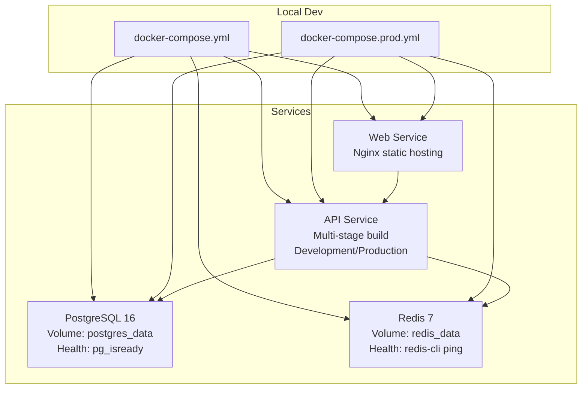
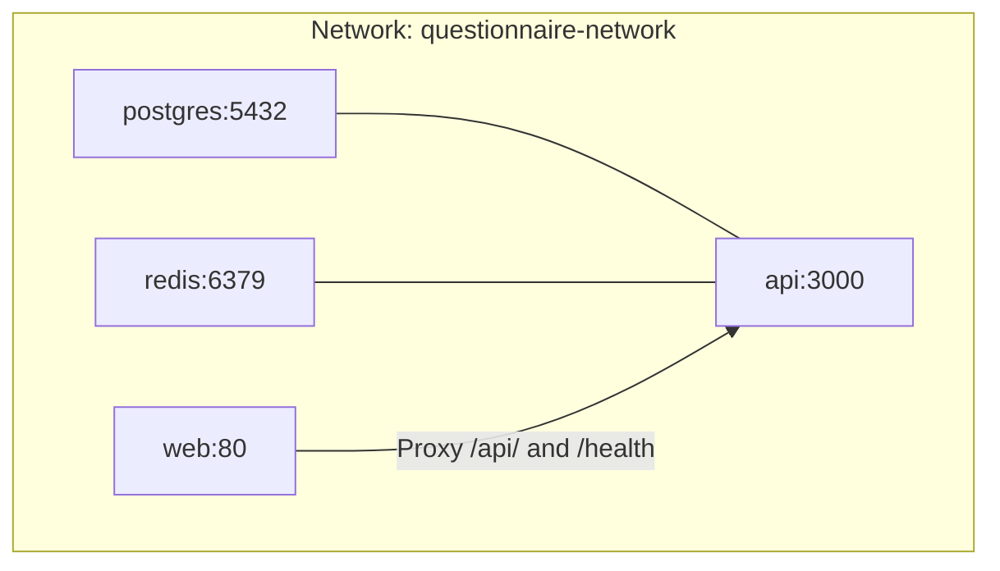
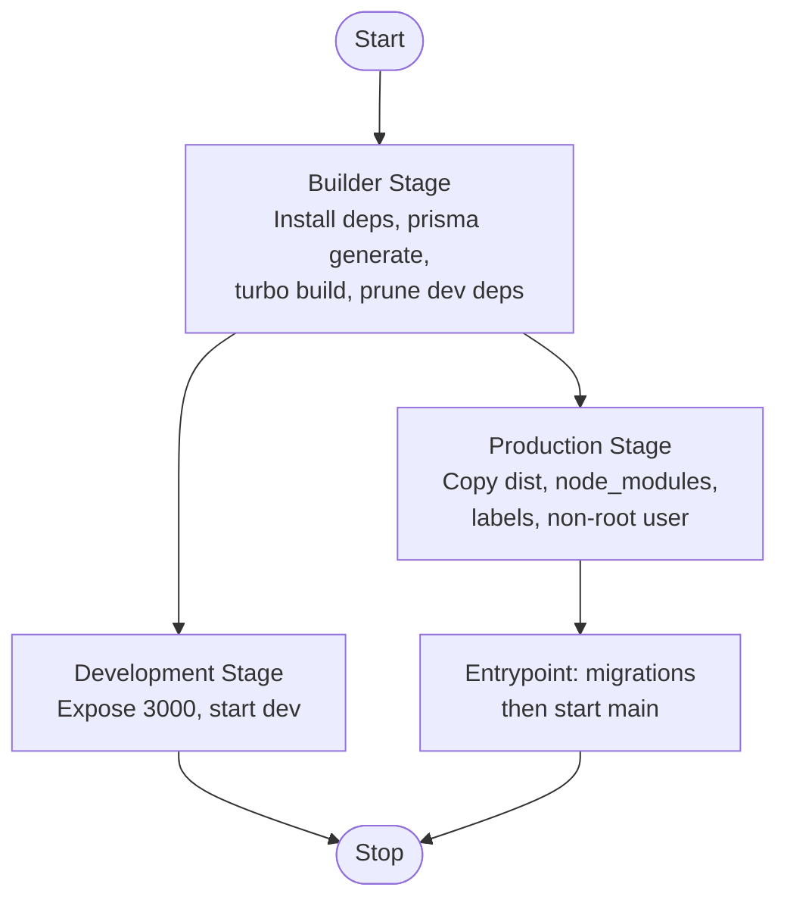
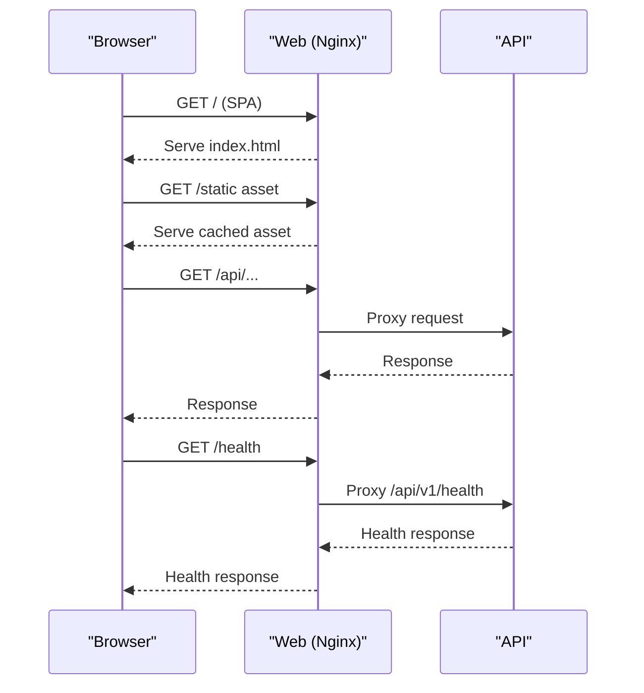
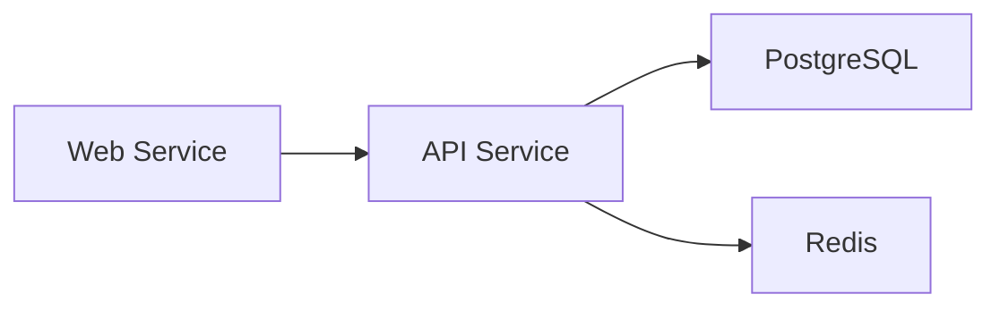

# Containerization & Docker

<cite>
**Referenced Files in This Document**
- [docker-compose.yml](file://docker-compose.yml)
- [docker-compose.prod.yml](file://docker-compose.prod.yml)
- [Dockerfile (API)](file://docker/api/Dockerfile)
- [Dockerfile (Web)](file://docker/web/Dockerfile)
- [entrypoint.sh](file://docker/api/entrypoint.sh)
- [.dockerignore](file://.dockerignore)
- [init.sql](file://docker/postgres/init.sql)
- [nginx.conf](file://docker/web/nginx.conf)
- [deploy-local.sh](file://scripts/deploy-local.sh)
- [dev-start.sh](file://scripts/dev-start.sh)
- [setup-local.sh](file://scripts/setup-local.sh)
- [package.json](file://package.json)
- [apps/api/package.json](file://apps/api/package.json)
</cite>

## Table of Contents
1. [Introduction](#introduction)
2. [Project Structure](#project-structure)
3. [Core Components](#core-components)
4. [Architecture Overview](#architecture-overview)
5. [Detailed Component Analysis](#detailed-component-analysis)
6. [Dependency Analysis](#dependency-analysis)
7. [Performance Considerations](#performance-considerations)
8. [Troubleshooting Guide](#troubleshooting-guide)
9. [Conclusion](#conclusion)
10. [Appendices](#appendices)

## Introduction
This document explains the containerization strategy for Quiz-to-Build, focusing on Docker Compose orchestration and multi-stage Docker builds for the API and Web applications. It covers:
- Multi-service orchestration for PostgreSQL 16, Redis 7, and the API application
- Multi-stage Dockerfile build process for the API service (development and production targets)
- Container networking strategy, volume management, and health checks
- Database initialization via init.sql and environment variable configuration
- Local development setup, container debugging techniques, and troubleshooting
- Azure Container Registry integration and cloud deployment patterns
- Container security best practices, resource limits, and performance optimization

## Project Structure
The containerization assets are organized under the docker directory and orchestrated via docker-compose files. The API and Web services are built using multi-stage Dockerfiles with dedicated targets for development and production. A shared network bridges containers, and volumes persist database and cache data.

**Diagram sources**
- [docker-compose.yml:18-150](file://docker-compose.yml#L18-L150)
- [docker-compose.prod.yml:1-95](file://docker-compose.prod.yml#L1-L95)

**Section sources**
- [docker-compose.yml:18-150](file://docker-compose.yml#L18-L150)
- [docker-compose.prod.yml:1-95](file://docker-compose.prod.yml#L1-L95)

## Core Components
- PostgreSQL 16: Runs with Alpine base, initializes extensions and grants, health-checked via pg_isready, and persists data in a named volume.
- Redis 7: Runs with persistence enabled, health-checked via redis-cli ping, and persists data in a named volume.
- API Service: Multi-stage build with a builder stage generating Prisma client and building the monorepo, followed by development and production stages. Production stage runs as a non-root user and exposes a health check.
- Web Service: Multi-stage build producing static assets and serving via Nginx with environment-driven proxying and security headers.

Key orchestration highlights:
- Shared bridge network with a defined subnet for predictable addressing.
- Named volumes for persistent storage.
- Health checks for readiness gates.
- Environment-driven configuration for secrets and upstreams.

**Section sources**
- [docker-compose.yml:27-135](file://docker-compose.yml#L27-L135)
- [docker-compose.prod.yml:2-82](file://docker-compose.prod.yml#L2-L82)
- [Dockerfile (API):1-120](file://docker/api/Dockerfile#L1-L120)
- [Dockerfile (Web):1-85](file://docker/web/Dockerfile#L1-L85)

## Architecture Overview
The system uses Docker Compose to orchestrate four primary services:
- PostgreSQL 16 and Redis 7 for data and caching
- API service (NestJS) with Prisma ORM and Redis client
- Web service (React SPA) served by Nginx with dynamic proxy configuration

**Diagram sources**
- [docker-compose.yml:144-150](file://docker-compose.yml#L144-L150)
- [docker-compose.prod.yml:89-95](file://docker-compose.prod.yml#L89-L95)

**Section sources**
- [docker-compose.yml:144-150](file://docker-compose.yml#L144-L150)
- [docker-compose.prod.yml:89-95](file://docker-compose.prod.yml#L89-L95)

## Detailed Component Analysis

### PostgreSQL 16 Initialization and Configuration
- Image: postgres:16-alpine
- Initialization: init.sql enables UUID and pgcrypto extensions, grants privileges, and logs completion.
- Persistence: Volume postgres_data mounted at /var/lib/postgresql/data
- Health check: pg_isready targeting the postgres user
- Ports: 5432 exposed; in production, bound to loopback for secure internal access

Operational notes:
- The init script runs automatically on first container creation.
- For production, ensure environment variables for credentials are set externally.

**Section sources**
- [docker-compose.yml:27-51](file://docker-compose.yml#L27-L51)
- [docker-compose.prod.yml:2-21](file://docker-compose.prod.yml#L2-L21)
- [init.sql:1-21](file://docker/postgres/init.sql#L1-L21)

### Redis 7 Caching Layer
- Image: redis:7-alpine
- Persistence: appendonly enabled with volume redis_data
- Health check: redis-cli ping
- Ports: 6379 exposed; in production, bound to loopback for secure internal access
- Production note: requires a password via environment variable

Security and reliability:
- Append-only persistence improves durability.
- Non-root user recommended in production (handled in Compose).

**Section sources**
- [docker-compose.yml:55-70](file://docker-compose.yml#L55-L70)
- [docker-compose.prod.yml:23-39](file://docker-compose.prod.yml#L23-L39)

### API Service: Multi-Stage Docker Build
The API Dockerfile defines three stages:
- Builder: Installs dependencies, generates Prisma client, builds filtered packages, prunes dev dependencies.
- Development: Copies sources, installs dependencies, exposes port 3000, starts in development mode.
- Production: Copies pruned dependencies and built outputs, creates non-root user, sets health check, and starts via entrypoint.

Entry point behavior:
- Runs database migrations using the local Prisma binary.
- Supports overriding migration failure behavior via an environment flag.
- Starts the application with constrained memory for stability.

**Diagram sources**
- [Dockerfile (API):1-120](file://docker/api/Dockerfile#L1-L120)
- [entrypoint.sh:1-34](file://docker/api/entrypoint.sh#L1-L34)

**Section sources**
- [Dockerfile (API):1-120](file://docker/api/Dockerfile#L1-L120)
- [entrypoint.sh:1-34](file://docker/api/entrypoint.sh#L1-L34)

### Web Service: Static SPA with Nginx Proxy
The Web Dockerfile:
- Builder stage: Installs dependencies, writes a production environment file for Vite, builds the SPA, and validates build outputs.
- Production stage: Serves static assets via Nginx, applies security headers, proxies /api/ and /health to the API, and exposes port 80.

Nginx configuration:
- Dynamic upstream controlled by API_UPSTREAM environment variable.
- Security headers and cache policies for static assets.
- SPA fallback to index.html for client-side routing.

**Diagram sources**
- [Dockerfile (Web):1-85](file://docker/web/Dockerfile#L1-L85)
- [nginx.conf:1-61](file://docker/web/nginx.conf#L1-L61)

**Section sources**
- [Dockerfile (Web):1-85](file://docker/web/Dockerfile#L1-L85)
- [nginx.conf:1-61](file://docker/web/nginx.conf#L1-L61)

### Orchestration: docker-compose.yml (Local Development)
- Services: postgres, redis, postgres-test, redis-test, api
- Networks: questionnaire-network with a dedicated subnet
- Volumes: named volumes for persistent data
- Health checks: pg_isready and redis-cli pings
- Environment: development defaults for local iteration

Usage:
- Bring up all services with docker compose up -d
- Depends on health conditions before starting the API

**Section sources**
- [docker-compose.yml:18-150](file://docker-compose.yml#L18-L150)

### Orchestration: docker-compose.prod.yml (Production)
- Services: postgres, redis, api, web
- Network: same bridge network
- Health checks: same pattern as development
- Environment: production-grade secrets and upstreams via environment variables
- Ports: bind to loopback for internal exposure

**Section sources**
- [docker-compose.prod.yml:1-95](file://docker-compose.prod.yml#L1-L95)

### Local Development Scripts
- deploy-local.sh: Full automation for prerequisites, environment setup, infrastructure, database setup, build, and local API start.
- setup-local.sh: Incremental setup with health checks and migration retry logic.
- dev-start.sh: Minimal startup with automatic migration invocation.

These scripts streamline local iteration and reduce manual steps.

**Section sources**
- [deploy-local.sh:1-359](file://scripts/deploy-local.sh#L1-L359)
- [setup-local.sh:1-189](file://scripts/setup-local.sh#L1-L189)
- [dev-start.sh:1-15](file://scripts/dev-start.sh#L1-L15)

## Dependency Analysis
- API depends on:
  - PostgreSQL for relational data (via Prisma)
  - Redis for caching and session-like operations
- Web depends on API for dynamic content and health checks
- All services share the questionnaire-network for inter-service communication

**Diagram sources**
- [docker-compose.yml:18-150](file://docker-compose.yml#L18-L150)
- [docker-compose.prod.yml:1-95](file://docker-compose.prod.yml#L1-L95)

**Section sources**
- [docker-compose.yml:18-150](file://docker-compose.yml#L18-L150)
- [docker-compose.prod.yml:1-95](file://docker-compose.prod.yml#L1-L95)

## Performance Considerations
- Image size and attack surface:
  - Use production stage for API and Web to minimize runtime footprint.
  - Non-root users improve security posture.
- Resource limits:
  - Configure CPU/memory limits per service in Compose or platform-specific deployment (e.g., Azure Container Apps).
- Caching:
  - Redis appendonly persistence and Nginx static caching reduce load.
- Health checks:
  - Ensure health checks are tuned to avoid false positives during cold starts.
- Build optimization:
  - Keep .dockerignore minimal but comprehensive to avoid unnecessary context.
  - Reuse builder layers and prune dev dependencies in production.

[No sources needed since this section provides general guidance]

## Troubleshooting Guide
Common issues and resolutions:
- API fails to start due to migration errors:
  - Review entrypoint behavior and migration overrides.
  - Use the local Prisma binary to re-run migrations after schema changes.
- Database not initialized:
  - Confirm init.sql executed and extensions enabled.
  - Check volume mounts and permissions.
- Redis connectivity issues:
  - Verify health checks and password configuration in production.
- Web proxy failures:
  - Confirm API_UPSTREAM environment variable and Nginx template substitution.
- Health check timeouts:
  - Increase start period or adjust intervals in Dockerfiles.
- Debugging:
  - Use docker compose logs -f api to inspect runtime logs.
  - Access interactive shells with docker compose exec api sh for diagnostics.

**Section sources**
- [entrypoint.sh:1-34](file://docker/api/entrypoint.sh#L1-L34)
- [init.sql:1-21](file://docker/postgres/init.sql#L1-L21)
- [nginx.conf:1-61](file://docker/web/nginx.conf#L1-L61)
- [docker-compose.yml:129-135](file://docker-compose.yml#L129-L135)
- [docker-compose.prod.yml:58-64](file://docker-compose.prod.yml#L58-L64)

## Conclusion
Quiz-to-Build’s containerization leverages Docker Compose for multi-service orchestration and multi-stage Dockerfiles for efficient, secure builds. The design emphasizes:
- Clear separation of concerns across services
- Persistent storage and health checks for reliability
- Environment-driven configuration for flexibility
- Security best practices via non-root users and health checks
- Scalable cloud deployment patterns using Azure Container Apps and ACR

[No sources needed since this section summarizes without analyzing specific files]

## Appendices

### Environment Variables Reference
- API service:
  - NODE_ENV, PORT, API_PREFIX (production), DATABASE_URL, REDIS_HOST, REDIS_PORT, JWT_SECRET, JWT_REFRESH_SECRET
- Web service:
  - VITE_API_URL, VITE_MICROSOFT_CLIENT_ID, VITE_GOOGLE_CLIENT_ID, API_UPSTREAM
- PostgreSQL:
  - POSTGRES_USER, POSTGRES_PASSWORD, POSTGRES_DB
- Redis:
  - REDIS_PASSWORD (production)

**Section sources**
- [docker-compose.yml:118-125](file://docker-compose.yml#L118-L125)
- [docker-compose.prod.yml:49-57](file://docker-compose.prod.yml#L49-L57)
- [Dockerfile (Web):19-33](file://docker/web/Dockerfile#L19-L33)

### Azure Container Registry and Cloud Deployment
- Login and build/push cycle:
  - Use ACR login, build with the API Dockerfile, push to ACR, then update the Container App image.
- Production deployment:
  - Update the Container App to the new image tag.

**Section sources**
- [docker-compose.yml:7-16](file://docker-compose.yml#L7-L16)
- [package.json:58-64](file://package.json#L58-L64)

### Container Security Best Practices
- Non-root users for API and Web
- Health checks for readiness
- Environment-driven secrets and upstreams
- Minimal base images and layered security updates
- Limit exposed ports and bind to loopback in production

**Section sources**
- [Dockerfile (API):89-109](file://docker/api/Dockerfile#L89-L109)
- [Dockerfile (Web):57-59](file://docker/web/Dockerfile#L57-L59)
- [docker-compose.prod.yml:10-11](file://docker-compose.prod.yml#L10-L11)

### Resource Limits and Monitoring
- Define CPU and memory limits per service in Compose or platform configuration.
- Monitor health endpoints and logs for early detection of issues.
- Use platform-native observability for metrics and tracing.

[No sources needed since this section provides general guidance]