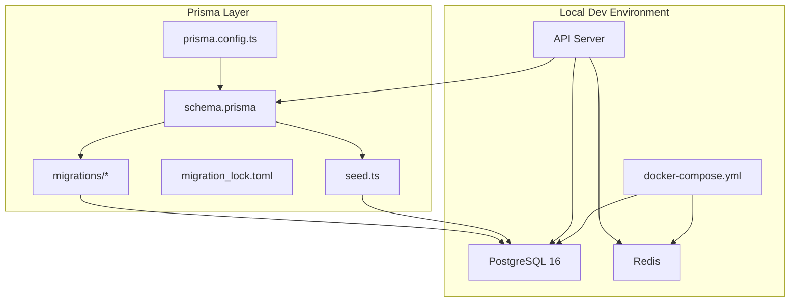
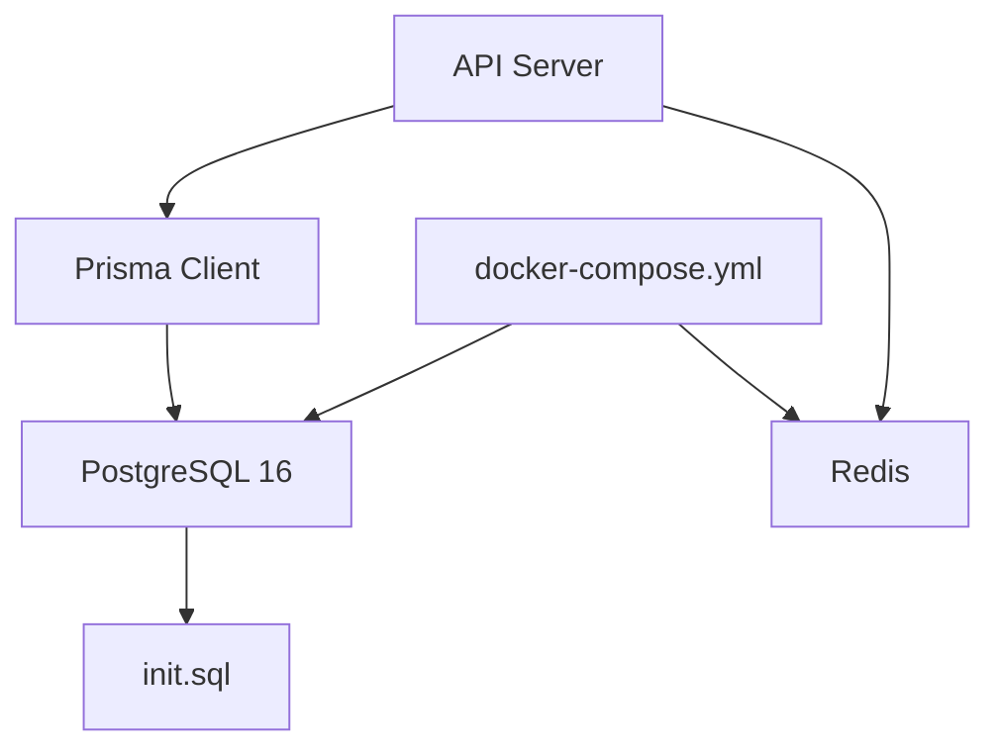
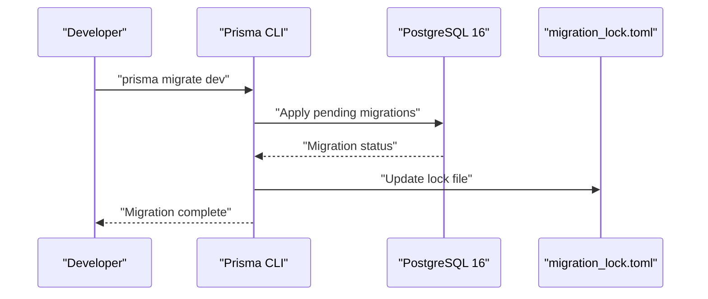
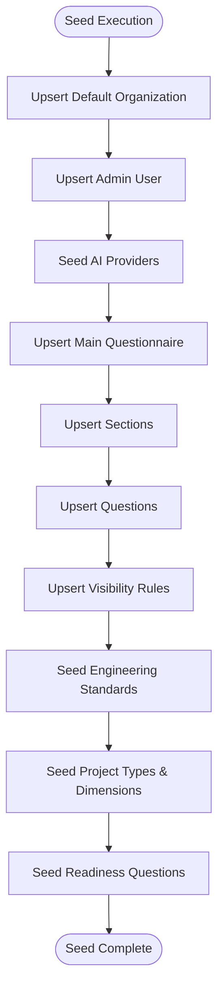
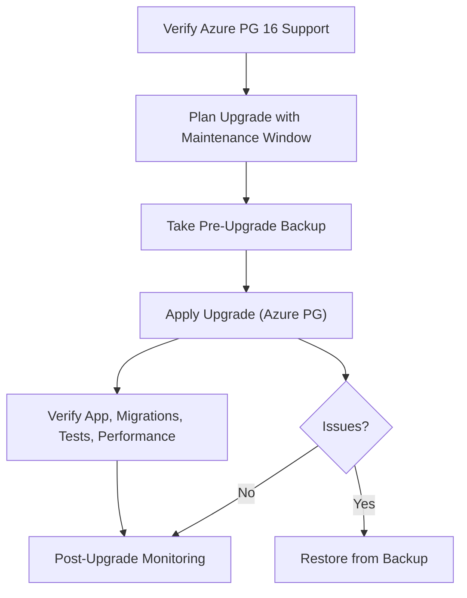
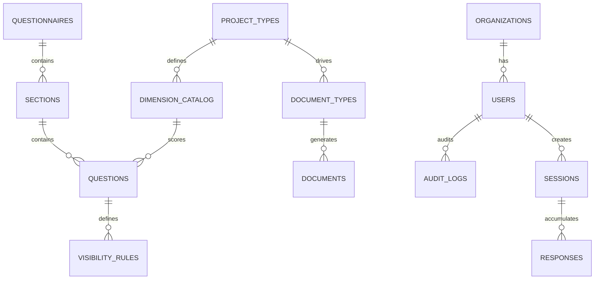

# Database Deployment & Management

<cite>
**Referenced Files in This Document**
- [schema.prisma](file://prisma/schema.prisma)
- [prisma.config.ts](file://prisma/prisma.config.ts)
- [seed.ts](file://prisma/seed.ts)
- [standards.seed.ts](file://prisma/seeds/standards.seed.ts)
- [project-types.seed.ts](file://prisma/seeds/project-types.seed.ts)
- [questions.seed.ts](file://prisma/seeds/questions.seed.ts)
- [migration_lock.toml](file://prisma/migrations/migration_lock.toml)
- [20260125000000_initial/migration.sql](file://prisma/migrations/20260125000000_initial/migration.sql)
- [package.json](file://package.json)
- [docker-compose.yml](file://docker-compose.yml)
- [init.sql](file://docker/postgres/init.sql)
- [postgresql-16-migration.md](file://docs/postgresql-16-migration.md)
- [deploy-local.sh](file://scripts/deploy-local.sh)
- [setup-local.sh](file://scripts/setup-local.sh)
</cite>

## Table of Contents
1. [Introduction](#introduction)
2. [Project Structure](#project-structure)
3. [Core Components](#core-components)
4. [Architecture Overview](#architecture-overview)
5. [Detailed Component Analysis](#detailed-component-analysis)
6. [Dependency Analysis](#dependency-analysis)
7. [Performance Considerations](#performance-considerations)
8. [Troubleshooting Guide](#troubleshooting-guide)
9. [Conclusion](#conclusion)
10. [Appendices](#appendices)

## Introduction
This document provides comprehensive database deployment and management guidance for Quiz-to-Build. It covers Prisma-based schema and migration strategy, database seeding and test data management, PostgreSQL 16 upgrade considerations, backup and recovery planning, connection pooling and performance tuning, monitoring and query optimization, and multi-environment management with schema versioning and data synchronization.

## Project Structure
The database layer is centered around Prisma ORM with declarative schema, versioned migrations, and seed scripts. Docker Compose provisions PostgreSQL 16 and Redis for local development and testing. Scripts automate deployment and setup.

**Diagram sources**
- [docker-compose.yml:18-150](file://docker-compose.yml#L18-L150)
- [schema.prisma:1-1112](file://prisma/schema.prisma#L1-L1112)
- [prisma.config.ts:1-14](file://prisma/prisma.config.ts#L1-L14)
- [seed.ts:1-526](file://prisma/seed.ts#L1-L526)
- [migration_lock.toml:1-3](file://prisma/migrations/migration_lock.toml#L1-L3)

**Section sources**
- [docker-compose.yml:18-150](file://docker-compose.yml#L18-L150)
- [schema.prisma:1-1112](file://prisma/schema.prisma#L1-L1112)
- [prisma.config.ts:1-14](file://prisma/prisma.config.ts#L1-L14)
- [seed.ts:1-526](file://prisma/seed.ts#L1-L526)
- [migration_lock.toml:1-3](file://prisma/migrations/migration_lock.toml#L1-L3)

## Core Components
- Prisma schema defines models, enums, relations, and indexes for the domain (organizations, users, questionnaires, sessions, readiness scoring, documents, audit logs, and more).
- Prisma configuration sets early access mode and schema location, and resolves DATABASE_URL at runtime.
- Migrations are stored under prisma/migrations with a lock file indicating provider.
- Seed scripts populate initial data, standards, project types, and readiness questions.

Key implementation references:
- [schema.prisma](file://prisma/schema.prisma)
- [prisma.config.ts](file://prisma/prisma.config.ts)
- [migration_lock.toml](file://prisma/migrations/migration_lock.toml)
- [seed.ts](file://prisma/seed.ts)
- [standards.seed.ts](file://prisma/seeds/standards.seed.ts)
- [project-types.seed.ts](file://prisma/seeds/project-types.seed.ts)
- [questions.seed.ts](file://prisma/seeds/questions.seed.ts)

**Section sources**
- [schema.prisma:1-1112](file://prisma/schema.prisma#L1-L1112)
- [prisma.config.ts:1-14](file://prisma/prisma.config.ts#L1-L14)
- [migration_lock.toml:1-3](file://prisma/migrations/migration_lock.toml#L1-L3)
- [seed.ts:1-526](file://prisma/seed.ts#L1-L526)
- [standards.seed.ts:1-412](file://prisma/seeds/standards.seed.ts#L1-L412)
- [project-types.seed.ts:1-726](file://prisma/seeds/project-types.seed.ts#L1-L726)
- [questions.seed.ts:1-800](file://prisma/seeds/questions.seed.ts#L1-L800)

## Architecture Overview
The database architecture integrates Prisma ORM with PostgreSQL 16 and Redis. The API server connects via DATABASE_URL, while migrations and seeds are orchestrated through npm scripts.

**Diagram sources**
- [docker-compose.yml:18-150](file://docker-compose.yml#L18-L150)
- [init.sql:1-21](file://docker/postgres/init.sql#L1-L21)
- [schema.prisma:9-12](file://prisma/schema.prisma#L9-L12)

**Section sources**
- [docker-compose.yml:18-150](file://docker-compose.yml#L18-L150)
- [init.sql:1-21](file://docker/postgres/init.sql#L1-L21)
- [schema.prisma:9-12](file://prisma/schema.prisma#L9-L12)

## Detailed Component Analysis

### Prisma Migration Strategy
- Migration creation: Use Prisma CLI to scaffold new migrations from schema changes.
- Migration execution: Apply migrations in development and production using npm scripts.
- Rollback: Reset migrations in development; for production, use Prisma’s deploy behavior and consider manual intervention if needed.

**Diagram sources**
- [schema.prisma:1-1112](file://prisma/schema.prisma#L1-L1112)
- [migration_lock.toml:1-3](file://prisma/migrations/migration_lock.toml#L1-L3)

**Section sources**
- [package.json:49-54](file://package.json#L49-L54)
- [20260125000000_initial/migration.sql:1-487](file://prisma/migrations/20260125000000_initial/migration.sql#L1-L487)

### Database Seeding and Test Data Management
- Seed entry point orchestrates organization, admin user, AI providers, main questionnaire, sections, questions, visibility rules, standards, project types, and readiness dimensions.
- Modular seed files encapsulate domain-specific data (standards, project types, questions).
- Seeding is executed via npm script and can be re-run safely due to upsert semantics.

**Diagram sources**
- [seed.ts:12-526](file://prisma/seed.ts#L12-L526)
- [standards.seed.ts:323-400](file://prisma/seeds/standards.seed.ts#L323-L400)
- [project-types.seed.ts:402-713](file://prisma/seeds/project-types.seed.ts#L402-L713)
- [questions.seed.ts:783-800](file://prisma/seeds/questions.seed.ts#L783-L800)

**Section sources**
- [seed.ts:12-526](file://prisma/seed.ts#L12-L526)
- [standards.seed.ts:323-400](file://prisma/seeds/standards.seed.ts#L323-L400)
- [project-types.seed.ts:402-713](file://prisma/seeds/project-types.seed.ts#L402-L713)
- [questions.seed.ts:783-800](file://prisma/seeds/questions.seed.ts#L783-L800)

### PostgreSQL 16 Upgrade Considerations
- The project upgraded to PostgreSQL 16 from 15, updating Docker Compose images and CI/CD test containers.
- Prisma ORM and existing migrations remain compatible; raw SQL queries verified compatible.
- Production upgrade follows Azure PostgreSQL flexible server in-place upgrade with maintenance window and pre-upgrade backup.
- Rollback plan includes restoring from backup or provisioning a new PG 15 instance.

**Diagram sources**
- [postgresql-16-migration.md:34-56](file://docs/postgresql-16-migration.md#L34-L56)
- [docker-compose.yml:27-35](file://docker-compose.yml#L27-L35)

**Section sources**
- [postgresql-16-migration.md:1-93](file://docs/postgresql-16-migration.md#L1-L93)
- [docker-compose.yml:27-35](file://docker-compose.yml#L27-L35)

### Database Initialization and Extensions
- The PostgreSQL initialization script enables UUID and pgcrypto extensions, grants privileges, and logs completion.
- These extensions support UUID primary keys and cryptographic functions used across models.

**Section sources**
- [init.sql:1-21](file://docker/postgres/init.sql#L1-L21)
- [schema.prisma:154-170](file://prisma/schema.prisma#L154-L170)

### Multi-Environment Management and Schema Versioning
- Local development uses Docker Compose with separate test databases and Redis instances.
- Production uses Azure Container Apps with centralized environment configuration; DATABASE_URL sourced from environment.
- Prisma migrations enforce schema versioning; migration_lock.toml records provider.

**Section sources**
- [docker-compose.yml:18-150](file://docker-compose.yml#L18-L150)
- [schema.prisma:9-12](file://prisma/schema.prisma#L9-L12)
- [migration_lock.toml:1-3](file://prisma/migrations/migration_lock.toml#L1-L3)

### Data Synchronization Between Environments
- Local setup scripts demonstrate applying migrations and seeding via Prisma inside the API container.
- For production, apply migrations using Prisma deploy in CI/CD pipelines and manage seeds accordingly.

**Section sources**
- [setup-local.sh:115-135](file://scripts/setup-local.sh#L115-L135)
- [package.json:50-52](file://package.json#L50-L52)

## Dependency Analysis
Prisma schema defines extensive indexes and foreign keys across models. Understanding these dependencies is essential for safe migrations and performance.

**Diagram sources**
- [schema.prisma:154-170](file://prisma/schema.prisma#L154-L170)
- [schema.prisma:245-286](file://prisma/schema.prisma#L245-L286)
- [schema.prisma:351-376](file://prisma/schema.prisma#L351-L376)
- [schema.prisma:425-444](file://prisma/schema.prisma#L425-L444)
- [schema.prisma:446-489](file://prisma/schema.prisma#L446-L489)
- [schema.prisma:491-506](file://prisma/schema.prisma#L491-L506)
- [schema.prisma:512-560](file://prisma/schema.prisma#L512-L560)
- [schema.prisma:579-608](file://prisma/schema.prisma#L579-L608)
- [schema.prisma:712-742](file://prisma/schema.prisma#L712-L742)
- [schema.prisma:780-799](file://prisma/schema.prisma#L780-L799)
- [schema.prisma:615-633](file://prisma/schema.prisma#L615-L633)
- [schema.prisma:378-401](file://prisma/schema.prisma#L378-L401)

**Section sources**
- [schema.prisma:154-170](file://prisma/schema.prisma#L154-L170)
- [schema.prisma:245-286](file://prisma/schema.prisma#L245-L286)
- [schema.prisma:351-376](file://prisma/schema.prisma#L351-L376)
- [schema.prisma:425-444](file://prisma/schema.prisma#L425-L444)
- [schema.prisma:446-489](file://prisma/schema.prisma#L446-L489)
- [schema.prisma:491-506](file://prisma/schema.prisma#L491-L506)
- [schema.prisma:512-560](file://prisma/schema.prisma#L512-L560)
- [schema.prisma:579-608](file://prisma/schema.prisma#L579-L608)
- [schema.prisma:712-742](file://prisma/schema.prisma#L712-L742)
- [schema.prisma:780-799](file://prisma/schema.prisma#L780-L799)
- [schema.prisma:615-633](file://prisma/schema.prisma#L615-L633)
- [schema.prisma:378-401](file://prisma/schema.prisma#L378-L401)

## Performance Considerations
- Indexes: Review frequently queried columns and joins (e.g., user email, organization slug, session status, questionnaire activity).
- JSON fields: Use appropriate indexing strategies for JSONB fields where needed.
- Connection pooling: Configure pool size and timeouts in the application to match workload characteristics.
- Query optimization: Monitor slow queries and add composite indexes for common filters and sorts.
- Capacity planning: Track growth of sessions, responses, and documents; plan storage and compute scaling.

[No sources needed since this section provides general guidance]

## Troubleshooting Guide
- Migration failures: Use Prisma reset in development to recreate schema, then re-apply migrations.
- Seed conflicts: Re-run seeding; upsert logic minimizes duplication.
- Local setup issues: Scripts wait for service health checks; inspect container logs and ensure DATABASE_URL is set.
- PostgreSQL 16 upgrade problems: Follow rollback plan using backups or restore to PG 15.

**Section sources**
- [package.json:54](file://package.json#L54)
- [deploy-local.sh:118-129](file://scripts/deploy-local.sh#L118-L129)
- [setup-local.sh:115-135](file://scripts/setup-local.sh#L115-L135)
- [postgresql-16-migration.md:65-77](file://docs/postgresql-16-migration.md#L65-L77)

## Conclusion
Quiz-to-Build employs a robust Prisma-based database strategy with versioned migrations, modular seeding, and PostgreSQL 16 compatibility. The included scripts and Docker Compose streamline local deployment and testing. For production, follow the documented upgrade and rollback procedures, maintain strong indexes, and monitor performance to ensure reliable operation across environments.

## Appendices

### Database Deployment Procedures
- Local deployment: Run the deployment script to generate Prisma client, apply migrations, seed data, and start the API.
- Production deployment: Ensure DATABASE_URL is configured, apply migrations with Prisma deploy, and run seeds as needed.

**Section sources**
- [deploy-local.sh:118-129](file://scripts/deploy-local.sh#L118-L129)
- [package.json:50-52](file://package.json#L50-L52)

### Example Maintenance Tasks
- Reset migrations in development: npm run db:reset
- Generate Prisma client: npm run db:generate
- Open Prisma Studio: npm run db:studio

**Section sources**
- [package.json:49-54](file://package.json#L49-L54)