# Deployment & Infrastructure

<cite>
**Referenced Files in This Document**
- [Dockerfile (API)](file://docker/api/Dockerfile)
- [Dockerfile (Web)](file://docker/web/Dockerfile)
- [Dockerfile.prebuilt (Web)](file://docker/web/Dockerfile.prebuilt)
- [docker-compose.yml](file://docker-compose.yml)
- [docker-compose.prod.yml](file://docker-compose.prod.yml)
- [main.tf](file://infrastructure/terraform/main.tf)
- [providers.tf](file://infrastructure/terraform/providers.tf)
- [container-apps/main.tf](file://infrastructure/terraform/modules/container-apps/main.tf)
- [database/main.tf](file://infrastructure/terraform/modules/database/main.tf)
- [cache/main.tf](file://infrastructure/terraform/modules/cache/main.tf)
- [monitoring/main.tf](file://infrastructure/terraform/modules/monitoring/main.tf)
- [azure-pipelines.yml](file://azure-pipelines.yml)
- [deploy-to-azure.ps1](file://scripts/deploy-to-azure.ps1)
- [setup-production-infrastructure.ps1](file://scripts/setup-production-infrastructure.ps1)
- [deploy.sh](file://scripts/deploy.sh)
- [init.sql](file://docker/postgres/init.sql)
- [prisma/schema.prisma](file://prisma/schema.prisma)
- [prisma/migrations](file://prisma/migrations)
- [configuration.ts](file://apps/api/src/config/configuration.ts)
- [appinsights.config.ts](file://apps/api/src/config/appinsights.config.ts)
- [sentry.config.ts](file://apps/api/src/config/sentry.config.ts)
- [uptime-monitoring.config.ts](file://apps/api/src/config/uptime-monitoring.config.ts)
- [disaster-recovery.config.ts](file://apps/api/src/config/disaster-recovery.config.ts)
- [health.controller.ts](file://apps/api/src/health.controller.ts)
</cite>

## Table of Contents
1. [Introduction](#introduction)
2. [Project Structure](#project-structure)
3. [Core Components](#core-components)
4. [Architecture Overview](#architecture-overview)
5. [Detailed Component Analysis](#detailed-component-analysis)
6. [Dependency Analysis](#dependency-analysis)
7. [Performance Considerations](#performance-considerations)
8. [Troubleshooting Guide](#troubleshooting-guide)
9. [Conclusion](#conclusion)
10. [Appendices](#appendices)

## Introduction
This document provides comprehensive deployment and infrastructure guidance for Quiz-to-Build. It covers containerization strategies (multi-stage Docker builds), Azure Container Apps orchestration, PostgreSQL and Redis provisioning, CI/CD with Azure DevOps, infrastructure as code with Terraform, database migrations and backups, monitoring and observability, scaling and high availability, and operational security and compliance practices.

## Project Structure
The deployment stack comprises:
- API service containerized with a multi-stage Dockerfile targeting development and production
- Static web asset container served by nginx with a dedicated Dockerfile
- Local Docker Compose for development and testing
- Terraform modules for Azure resources (Container Apps, PostgreSQL, Redis, Monitoring, Networking, Registry)
- Azure DevOps pipeline orchestrating build, test, security, readiness gates, infrastructure provisioning, and deployment
- Scripts for manual and automated deployments to Azure

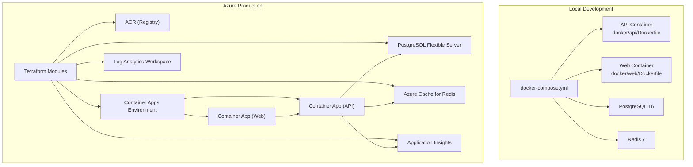

**Diagram sources**
- [docker-compose.yml:18-150](file://docker-compose.yml#L18-L150)
- [Dockerfile (API):1-120](file://docker/api/Dockerfile#L1-L120)
- [Dockerfile (Web):1-85](file://docker/web/Dockerfile#L1-L85)
- [main.tf:12-153](file://infrastructure/terraform/main.tf#L12-L153)
- [container-apps/main.tf:4-310](file://infrastructure/terraform/modules/container-apps/main.tf#L4-L310)
- [database/main.tf:9-78](file://infrastructure/terraform/modules/database/main.tf#L9-L78)
- [cache/main.tf:3-20](file://infrastructure/terraform/modules/cache/main.tf#L3-L20)
- [monitoring/main.tf:3-22](file://infrastructure/terraform/modules/monitoring/main.tf#L3-L22)

**Section sources**
- [docker-compose.yml:18-150](file://docker-compose.yml#L18-L150)
- [Dockerfile (API):1-120](file://docker/api/Dockerfile#L1-L120)
- [Dockerfile (Web):1-85](file://docker/web/Dockerfile#L1-L85)
- [main.tf:12-153](file://infrastructure/terraform/main.tf#L12-L153)

## Core Components
- API Container (NestJS):
  - Multi-stage build with builder, development, and production stages
  - Non-root user, health checks, OCI labels, and Prisma client generation
- Web Container (React + nginx):
  - Multi-stage build with nginx serving prebuilt assets
  - Runtime environment substitution and health checks
- Local Docker Compose:
  - PostgreSQL 16 and Redis 7 with health checks and init scripts
  - API and Web services with development defaults
- Terraform Modules:
  - Networking, Monitoring (Log Analytics + Application Insights), Container Registry, Database (PostgreSQL Flexible Server), Cache (Redis), Container Apps
- Azure DevOps Pipeline:
  - Build, lint, type check, unit/integration/E2E/performance tests
  - Security scanning (GitLeaks, Detect-Secrets, npm audit, Snyk, Trivy, Semgrep), SBOM generation
  - Readiness score gate (Quiz2Biz internal compliance)
  - Infrastructure provisioning via Terraform plan/apply
  - Deployment to Azure Container Apps with image signing and provenance
- Deployment Scripts:
  - PowerShell and Bash scripts for manual and automated Azure deployments
  - Image build in ACR, secret injection, migration execution, health verification

**Section sources**
- [Dockerfile (API):1-120](file://docker/api/Dockerfile#L1-L120)
- [Dockerfile (Web):1-85](file://docker/web/Dockerfile#L1-L85)
- [docker-compose.prod.yml:40-95](file://docker-compose.prod.yml#L40-L95)
- [main.tf:12-153](file://infrastructure/terraform/main.tf#L12-L153)
- [azure-pipelines.yml:1-908](file://azure-pipelines.yml#L1-L908)
- [deploy-to-azure.ps1:1-349](file://scripts/deploy-to-azure.ps1#L1-L349)
- [deploy.sh:1-206](file://scripts/deploy.sh#L1-L206)

## Architecture Overview
The production architecture centers on Azure Container Apps for platform-managed autoscaling and routing, with PostgreSQL and Redis provisioned as managed services. Observability is achieved via Application Insights and Log Analytics. Secrets are managed through Azure Key Vault and Container Apps secrets. CI/CD automates testing, security gates, infrastructure provisioning, and deployment.

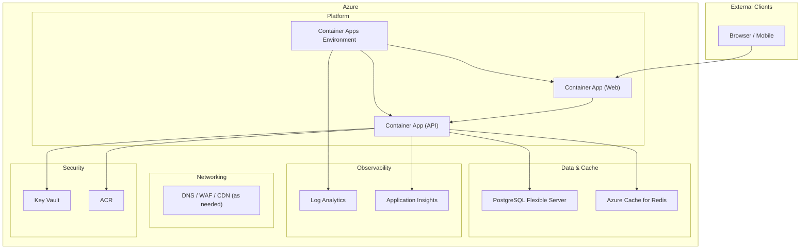

**Diagram sources**
- [container-apps/main.tf:4-310](file://infrastructure/terraform/modules/container-apps/main.tf#L4-L310)
- [database/main.tf:9-78](file://infrastructure/terraform/modules/database/main.tf#L9-L78)
- [cache/main.tf:3-20](file://infrastructure/terraform/modules/cache/main.tf#L3-L20)
- [monitoring/main.tf:3-22](file://infrastructure/terraform/modules/monitoring/main.tf#L3-L22)
- [main.tf:12-153](file://infrastructure/terraform/main.tf#L12-L153)

## Detailed Component Analysis

### Containerization Strategy and Multi-Stage Builds
- API service:
  - Builder stage installs dependencies, generates Prisma client, builds with Turbo
  - Production stage copies pruned node_modules and dist, sets non-root user, adds health checks, and OCI labels
  - Development stage mirrors production dependencies and exposes port for local iteration
- Web service:
  - Builder stage builds React app with injected build-time environment variables
  - Production stage serves assets via nginx with runtime environment substitution and health checks
- Prebuilt web variant:
  - Minimal nginx image with prebuilt assets and static config

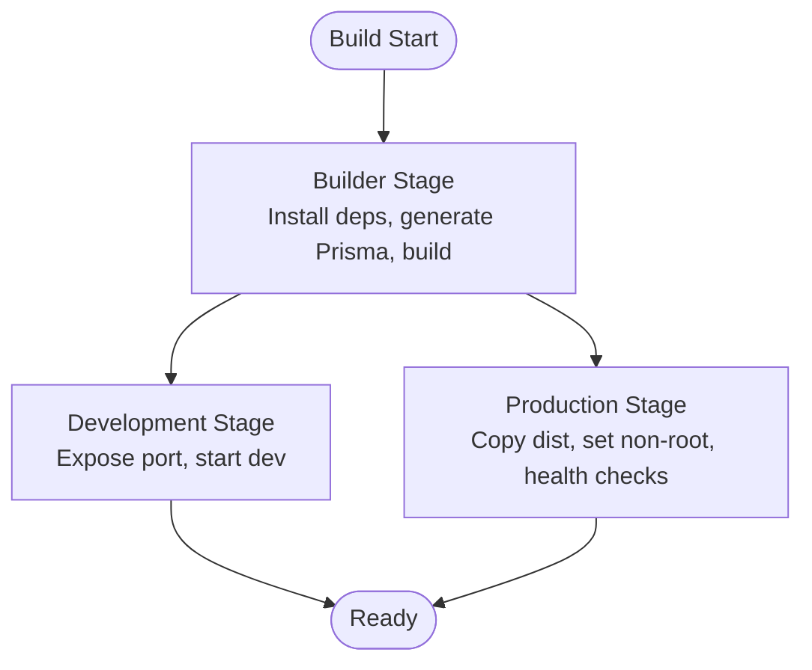

**Diagram sources**
- [Dockerfile (API):1-120](file://docker/api/Dockerfile#L1-L120)
- [Dockerfile (Web):1-85](file://docker/web/Dockerfile#L1-L85)
- [Dockerfile.prebuilt (Web):1-25](file://docker/web/Dockerfile.prebuilt#L1-L25)

**Section sources**
- [Dockerfile (API):1-120](file://docker/api/Dockerfile#L1-L120)
- [Dockerfile (Web):1-85](file://docker/web/Dockerfile#L1-L85)
- [Dockerfile.prebuilt (Web):1-25](file://docker/web/Dockerfile.prebuilt#L1-L25)

### Local Development with Docker Compose
- PostgreSQL 16 and Redis 7 with health checks and persistent volumes
- API service with development environment variables and dependency mounting
- Optional test instances for isolation
- Network isolation via custom bridge subnet

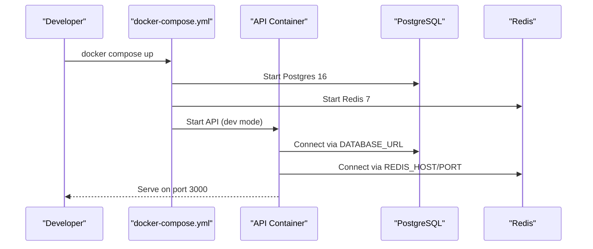

**Diagram sources**
- [docker-compose.yml:18-150](file://docker-compose.yml#L18-L150)

**Section sources**
- [docker-compose.yml:18-150](file://docker-compose.yml#L18-L150)

### Azure Container Apps Orchestration
- Container Apps Environment provides managed infrastructure with autoscaling and ingress
- API Container:
  - Managed secrets for database URL, Redis password, JWT secrets
  - Liveness/readiness/startup probes using /api/v1/health endpoints
  - CPU/memory allocation and replica scaling
- Web Container:
  - Single-revision deployment with external ingress
  - Health probes on port 80

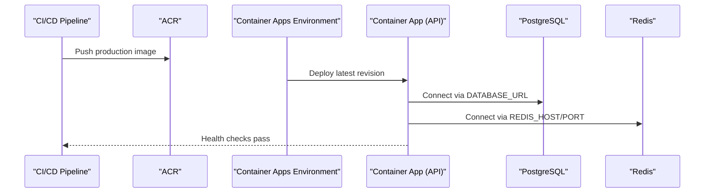

**Diagram sources**
- [container-apps/main.tf:20-222](file://infrastructure/terraform/modules/container-apps/main.tf#L20-L222)
- [container-apps/main.tf:224-310](file://infrastructure/terraform/modules/container-apps/main.tf#L224-L310)

**Section sources**
- [container-apps/main.tf:20-222](file://infrastructure/terraform/modules/container-apps/main.tf#L20-L222)
- [container-apps/main.tf:224-310](file://infrastructure/terraform/modules/container-apps/main.tf#L224-L310)

### Database Provisioning and Migration Management
- PostgreSQL Flexible Server configured with timezone, connection logging, and optional HA
- Migrations executed post-deployment via Prisma client
- Seed data and schema managed under prisma/

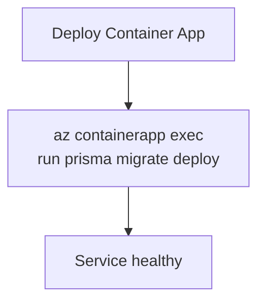

**Diagram sources**
- [database/main.tf:9-78](file://infrastructure/terraform/modules/database/main.tf#L9-L78)
- [deploy.sh:163-171](file://scripts/deploy.sh#L163-L171)

**Section sources**
- [database/main.tf:9-78](file://infrastructure/terraform/modules/database/main.tf#L9-L78)
- [deploy.sh:163-171](file://scripts/deploy.sh#L163-L171)
- [prisma/schema.prisma](file://prisma/schema.prisma)
- [prisma/migrations](file://prisma/migrations)

### CI/CD Pipeline with Azure DevOps
- Stages:
  - Build & Test: lint, type check, unit tests, coverage
  - Comprehensive Testing: unit, integration, E2E, regression
  - Performance Testing: load tests and performance units
  - Security Scan: multiple scanners and SBOM generation
  - Readiness Score Gate: Quiz2Biz internal compliance
  - Infrastructure: Terraform plan/apply
  - Deploy: ACR cloud build, image signing, Container Apps update
- Artifacts: test results, coverage, SBOM, Terraform plan

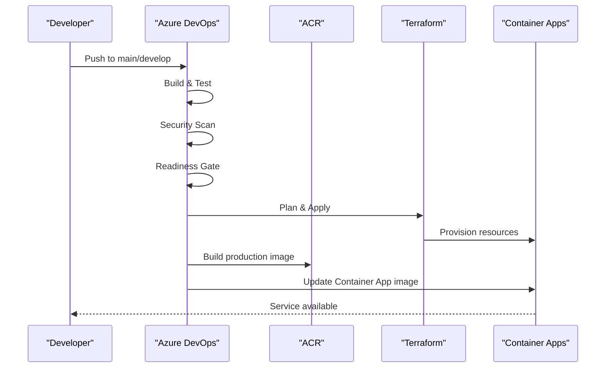

**Diagram sources**
- [azure-pipelines.yml:39-718](file://azure-pipelines.yml#L39-L718)

**Section sources**
- [azure-pipelines.yml:1-908](file://azure-pipelines.yml#L1-L908)

### Monitoring and Observability
- Application Insights and Log Analytics integrated via Terraform modules
- Application-level configuration enables telemetry and error reporting
- Health endpoints exposed for probes and uptime monitoring
- Uptime monitoring and alerting configurations

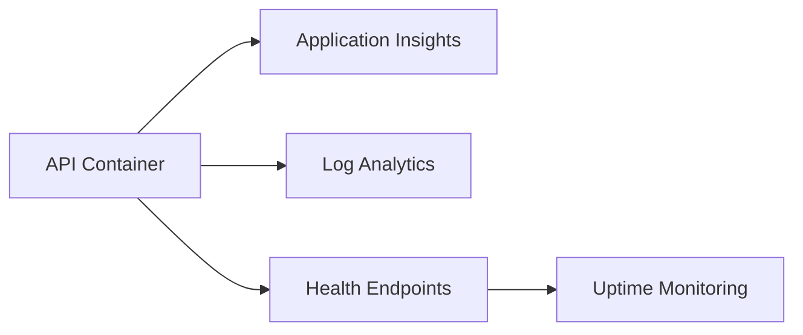

**Diagram sources**
- [monitoring/main.tf:3-22](file://infrastructure/terraform/modules/monitoring/main.tf#L3-L22)
- [appinsights.config.ts](file://apps/api/src/config/appinsights.config.ts)
- [sentry.config.ts](file://apps/api/src/config/sentry.config.ts)
- [uptime-monitoring.config.ts](file://apps/api/src/config/uptime-monitoring.config.ts)
- [health.controller.ts](file://apps/api/src/health.controller.ts)

**Section sources**
- [monitoring/main.tf:3-22](file://infrastructure/terraform/modules/monitoring/main.tf#L3-L22)
- [appinsights.config.ts](file://apps/api/src/config/appinsights.config.ts)
- [sentry.config.ts](file://apps/api/src/config/sentry.config.ts)
- [uptime-monitoring.config.ts](file://apps/api/src/config/uptime-monitoring.config.ts)
- [health.controller.ts](file://apps/api/src/health.controller.ts)

### Scaling, Load Balancing, and High Availability
- Container Apps provides automatic horizontal scaling and revision-based traffic management
- PostgreSQL HA via ZoneRedundant mode
- Redis with TLS and memory policies
- Canary deployment supported via traffic weights

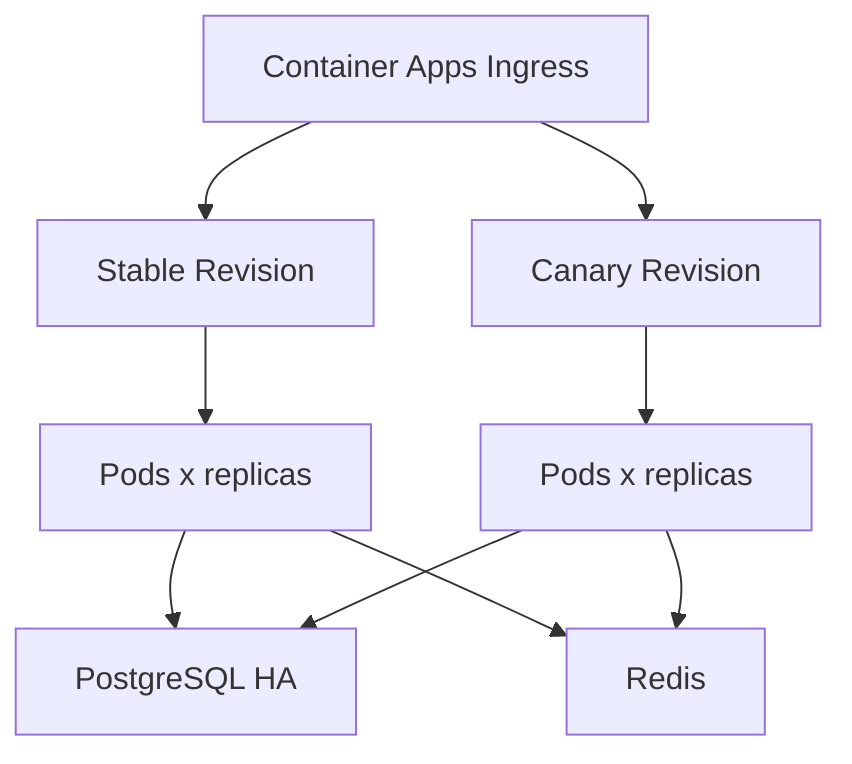

**Diagram sources**
- [container-apps/main.tf:160-181](file://infrastructure/terraform/modules/container-apps/main.tf#L160-L181)
- [database/main.tf:25-31](file://infrastructure/terraform/modules/database/main.tf#L25-L31)
- [cache/main.tf:10-16](file://infrastructure/terraform/modules/cache/main.tf#L10-L16)

**Section sources**
- [container-apps/main.tf:160-181](file://infrastructure/terraform/modules/container-apps/main.tf#L160-L181)
- [database/main.tf:25-31](file://infrastructure/terraform/modules/database/main.tf#L25-L31)
- [cache/main.tf:10-16](file://infrastructure/terraform/modules/cache/main.tf#L10-L16)

### Disaster Recovery and Backup Strategies
- PostgreSQL backup retention configured
- High availability enabled for production
- Secrets managed via Azure Key Vault and Container Apps secrets
- Disaster recovery configuration loaded from application config

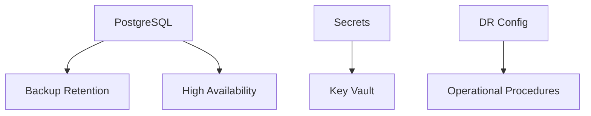

**Diagram sources**
- [database/main.tf:23-31](file://infrastructure/terraform/modules/database/main.tf#L23-L31)
- [disaster-recovery.config.ts](file://apps/api/src/config/disaster-recovery.config.ts)

**Section sources**
- [database/main.tf:23-31](file://infrastructure/terraform/modules/database/main.tf#L23-L31)
- [disaster-recovery.config.ts](file://apps/api/src/config/disaster-recovery.config.ts)

### Security Hardening and Compliance
- Supply chain: ACR cloud build, image signing with Sigstore Cosign (keyless), SLSA provenance attestation
- Secrets management: Container Apps secrets and Key Vault integration
- TLS enforcement: Redis minimum TLS 1.2
- Security scanning: GitLeaks, Detect-Secrets, npm audit, Snyk, Trivy, Semgrep
- SBOM generation (CycloneDX/SPDX)
- Compliance gate: Readiness score and critical cell thresholds

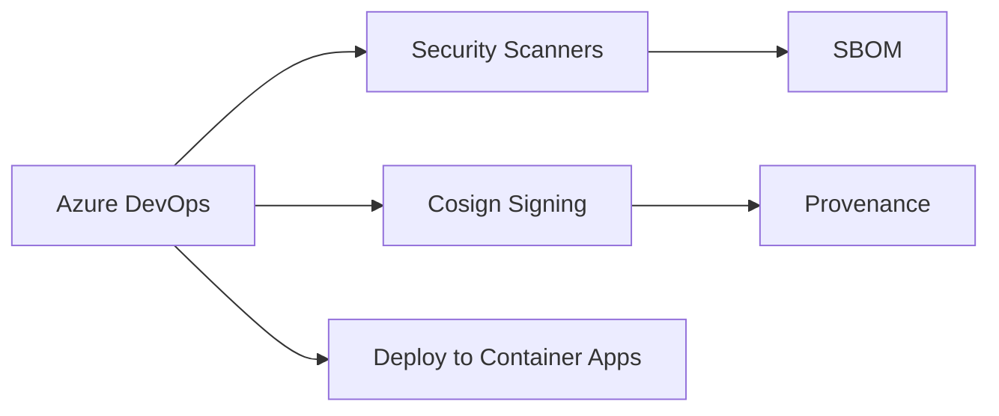

**Diagram sources**
- [azure-pipelines.yml:350-718](file://azure-pipelines.yml#L350-L718)
- [container-apps/main.tf:183-222](file://infrastructure/terraform/modules/container-apps/main.tf#L183-L222)

**Section sources**
- [azure-pipelines.yml:350-718](file://azure-pipelines.yml#L350-L718)
- [container-apps/main.tf:183-222](file://infrastructure/terraform/modules/container-apps/main.tf#L183-L222)

## Dependency Analysis
- API container depends on PostgreSQL and Redis connectivity
- Web container depends on API endpoint availability
- Terraform modules depend on provider configuration and resource group existence
- CI/CD depends on Azure DevOps service connections and secrets

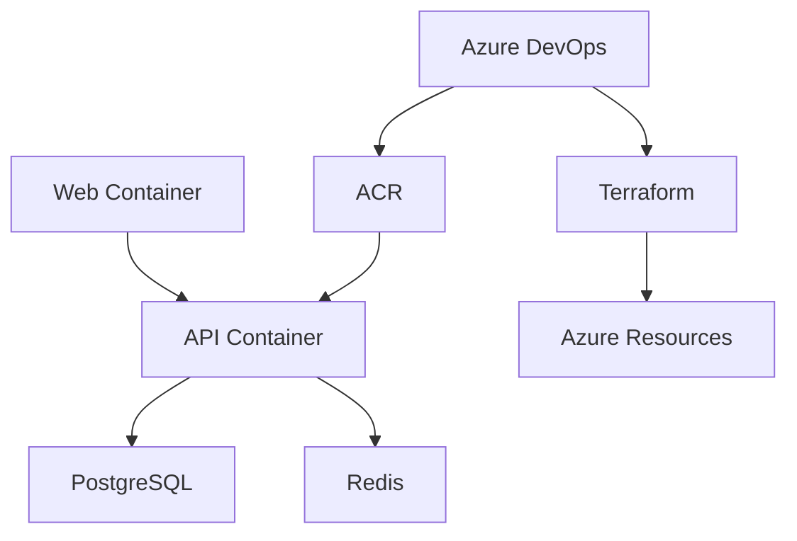

**Diagram sources**
- [docker-compose.yml:18-150](file://docker-compose.yml#L18-L150)
- [main.tf:12-153](file://infrastructure/terraform/main.tf#L12-L153)
- [azure-pipelines.yml:39-718](file://azure-pipelines.yml#L39-L718)

**Section sources**
- [docker-compose.yml:18-150](file://docker-compose.yml#L18-L150)
- [main.tf:12-153](file://infrastructure/terraform/main.tf#L12-L153)
- [azure-pipelines.yml:39-718](file://azure-pipelines.yml#L39-L718)

## Performance Considerations
- Use production Docker targets for optimized images and non-root execution
- Enable autoscaling and monitor resource utilization via Application Insights
- Optimize database queries and Redis caching policies
- Validate API and Web performance targets in CI/CD stages

[No sources needed since this section provides general guidance]

## Troubleshooting Guide
- Health checks:
  - API: /api/v1/health endpoints for live/ready probes
  - Web: root path health check
- Logs and diagnostics:
  - Use Azure CLI to retrieve logs and inspect revisions
  - Exec into app for interactive debugging
- Local development:
  - Confirm database and Redis health checks succeed
  - Verify environment variables and volume mounts
- CI/CD failures:
  - Review test results and security scan artifacts
  - Validate Terraform plan and state alignment
- Database migrations:
  - Run migrations post-deployment if auto-exec fails

**Section sources**
- [health.controller.ts](file://apps/api/src/health.controller.ts)
- [container-apps/main.tf:124-156](file://infrastructure/terraform/modules/container-apps/main.tf#L124-L156)
- [deploy.sh:172-186](file://scripts/deploy.sh#L172-L186)
- [docker-compose.yml:47-104](file://docker-compose.yml#L47-L104)

## Conclusion
Quiz-to-Build employs a robust, supply-chain-aware, and observability-rich deployment model on Azure. The combination of multi-stage container builds, managed services, automated CI/CD, and comprehensive security and compliance tooling ensures reliable, scalable, and auditable operations suitable for production environments.

[No sources needed since this section summarizes without analyzing specific files]

## Appendices

### Azure Deployment Commands and Scripts
- Automated deployment (Bash):
  - Initialize, validate, plan, apply Terraform
  - Build image in ACR and update Container App
  - Execute migrations and health checks
- Manual deployment (PowerShell):
  - Create resource group, ACR, PostgreSQL, Redis, Container Apps Environment
  - Deploy Container App with secrets and environment variables
  - Run migrations and print application URLs

**Section sources**
- [deploy.sh:101-206](file://scripts/deploy.sh#L101-L206)
- [deploy-to-azure.ps1:115-349](file://scripts/deploy-to-azure.ps1#L115-L349)

### Environment Configuration Examples
- API:
  - NODE_ENV, PORT, API_PREFIX, DATABASE_URL, REDIS_HOST/PORT, JWT secrets, CORS_ORIGIN, FRONTEND_URL
- Web:
  - VITE_API_URL, runtime nginx configuration with environment substitution

**Section sources**
- [container-apps/main.tf:41-122](file://infrastructure/terraform/modules/container-apps/main.tf#L41-L122)
- [Dockerfile (Web):20-33](file://docker/web/Dockerfile#L20-L33)
- [docker-compose.prod.yml:49-74](file://docker-compose.prod.yml#L49-L74)

### Database Initialization and Schema
- PostgreSQL initialization script included in compose
- Prisma schema and migrations define database structure and versioning

**Section sources**
- [init.sql](file://docker/postgres/init.sql)
- [prisma/schema.prisma](file://prisma/schema.prisma)
- [prisma/migrations](file://prisma/migrations)