# Infrastructure as Code (Terraform)

<cite>
**Referenced Files in This Document**
- [main.tf](file://infrastructure/terraform/main.tf)
- [providers.tf](file://infrastructure/terraform/providers.tf)
- [backend.tf](file://infrastructure/terraform/backend.tf)
- [variables.tf](file://infrastructure/terraform/variables.tf)
- [outputs.tf](file://infrastructure/terraform/outputs.tf)
- [modules/networking/main.tf](file://infrastructure/terraform/modules/networking/main.tf)
- [modules/database/main.tf](file://infrastructure/terraform/modules/database/main.tf)
- [modules/cache/main.tf](file://infrastructure/terraform/modules/cache/main.tf)
- [modules/container-apps/main.tf](file://infrastructure/terraform/modules/container-apps/main.tf)
- [modules/keyvault/main.tf](file://infrastructure/terraform/modules/keyvault/main.tf)
- [modules/monitoring/main.tf](file://infrastructure/terraform/modules/monitoring/main.tf)
- [modules/registry/main.tf](file://infrastructure/terraform/modules/registry/main.tf)
- [modules/chaos-studio/main.tf](file://infrastructure/terraform/modules/chaos-studio/main.tf)
</cite>

## Table of Contents
1. [Introduction](#introduction)
2. [Project Structure](#project-structure)
3. [Core Components](#core-components)
4. [Architecture Overview](#architecture-overview)
5. [Detailed Component Analysis](#detailed-component-analysis)
6. [Dependency Analysis](#dependency-analysis)
7. [Performance Considerations](#performance-considerations)
8. [Troubleshooting Guide](#troubleshooting-guide)
9. [Conclusion](#conclusion)
10. [Appendices](#appendices)

## Introduction
This document describes the Terraform-based infrastructure for Quiz-to-Build on Azure. It covers the modular architecture for networking, database, cache, monitoring, container registries, and containerized applications, along with secrets management via Azure Key Vault. It also explains environment provisioning strategies for development, staging, and production, resource management patterns, dependency configurations, state management, and operational topics such as drift detection, validation, deployment automation, and cost optimization.

## Project Structure
The Terraform code is organized around a single root module that composes reusable modules for each infrastructure domain. Modules encapsulate Azure resources for networking, PostgreSQL, Redis, monitoring, container registry, container apps, and key vault. Centralized variables and outputs define environment-specific behavior and expose connection details.

```mermaid
graph TB
Root["Root Module<br/>main.tf"] --> RG["Resource Group"]
Root --> NetMod["Networking Module<br/>modules/networking/main.tf"]
Root --> MonMod["Monitoring Module<br/>modules/monitoring/main.tf"]
Root --> RegMod["Registry Module<br/>modules/registry/main.tf"]
Root --> DbMod["Database Module<br/>modules/database/main.tf"]
Root --> CacheMod["Cache Module<br/>modules/cache/main.tf"]
Root --> KVMod["Key Vault Module<br/>modules/keyvault/main.tf"]
Root --> CA["Container Apps Module<br/>modules/container-apps/main.tf"]
NetMod --> VNet["Virtual Network"]
NetMod --> SNetApp["Subnet: App"]
NetMod --> SNetDb["Subnet: DB"]
NetMod --> SNetCache["Subnet: Cache"]
NetMod --> NSGApp["NSG: App"]
NetMod --> PDNS["Private DNS Zone: PostgreSQL"]
DbMod --> PSQL["PostgreSQL Flexible Server"]
DbMod --> PSQLDb["Database"]
DbMod --> FW["Firewall Rule: Azure Services"]
CacheMod --> Redis["Redis Cache"]
MonMod --> LA["Log Analytics Workspace"]
MonMod --> AI["Application Insights"]
RegMod --> ACR["Container Registry"]
KVMod --> KV["Key Vault"]
KVMod --> KVS1["Secret: DATABASE-URL"]
KVMod --> KVS2["Secret: REDIS-PASSWORD"]
KVMod --> KVS3["Secret: JWT-SECRET"]
KVMod --> KVS4["Secret: JWT-REFRESH-SECRET"]
KVMod --> KVS5["Secret: CSRF-SECRET"]
CA --> CAEnv["Container App Environment"]
CA --> CAApi["Container App: API"]
CA --> CAWeb["Container App: Web"]
```

**Diagram sources**
- [main.tf:13-152](file://infrastructure/terraform/main.tf#L13-L152)
- [modules/networking/main.tf:3-110](file://infrastructure/terraform/modules/networking/main.tf#L3-L110)
- [modules/database/main.tf:9-77](file://infrastructure/terraform/modules/database/main.tf#L9-L77)
- [modules/cache/main.tf:3-19](file://infrastructure/terraform/modules/cache/main.tf#L3-L19)
- [modules/monitoring/main.tf:3-21](file://infrastructure/terraform/modules/monitoring/main.tf#L3-L21)
- [modules/registry/main.tf:3-11](file://infrastructure/terraform/modules/registry/main.tf#L3-L11)
- [modules/keyvault/main.tf:11-126](file://infrastructure/terraform/modules/keyvault/main.tf#L11-L126)
- [modules/container-apps/main.tf:4-308](file://infrastructure/terraform/modules/container-apps/main.tf#L4-L308)

**Section sources**
- [main.tf:1-153](file://infrastructure/terraform/main.tf#L1-L153)
- [variables.tf:1-178](file://infrastructure/terraform/variables.tf#L1-L178)
- [outputs.tf:1-138](file://infrastructure/terraform/outputs.tf#L1-L138)

## Core Components
- Resource Group: Central grouping for all resources with environment-aware naming and tags.
- Networking: Virtual network with dedicated subnets for app, database, and cache, plus NSG and private DNS for PostgreSQL.
- Database: PostgreSQL Flexible Server with optional VNet integration and high availability.
- Cache: Azure Cache for Redis with TLS and memory policy configuration.
- Monitoring: Log Analytics workspace and Application Insights for telemetry.
- Registry: Azure Container Registry with admin credentials enabled for development.
- Container Apps: Container App Environment hosting API and optional Web frontend; secrets injected from Key Vault.
- Key Vault: Secure secrets storage with access policies for deployer and Container App managed identity.

**Section sources**
- [main.tf:13-152](file://infrastructure/terraform/main.tf#L13-L152)
- [modules/networking/main.tf:3-110](file://infrastructure/terraform/modules/networking/main.tf#L3-L110)
- [modules/database/main.tf:9-77](file://infrastructure/terraform/modules/database/main.tf#L9-L77)
- [modules/cache/main.tf:3-19](file://infrastructure/terraform/modules/cache/main.tf#L3-L19)
- [modules/monitoring/main.tf:3-21](file://infrastructure/terraform/modules/monitoring/main.tf#L3-L21)
- [modules/registry/main.tf:3-11](file://infrastructure/terraform/modules/registry/main.tf#L3-L11)
- [modules/container-apps/main.tf:4-308](file://infrastructure/terraform/modules/container-apps/main.tf#L4-L308)
- [modules/keyvault/main.tf:11-126](file://infrastructure/terraform/modules/keyvault/main.tf#L11-L126)

## Architecture Overview
The system provisions a private network for secure communications, places the API in a Container App Environment backed by a managed database and cache, and centralizes secrets in Key Vault. Monitoring is integrated for observability. Optional chaos experiments can be enabled per environment.

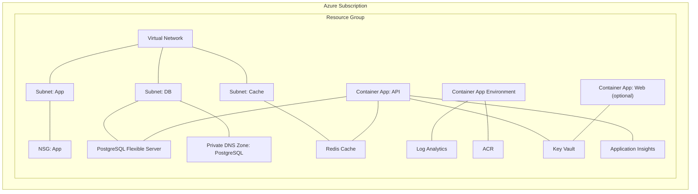

**Diagram sources**
- [main.tf:13-152](file://infrastructure/terraform/main.tf#L13-L152)
- [modules/networking/main.tf:3-110](file://infrastructure/terraform/modules/networking/main.tf#L3-L110)
- [modules/database/main.tf:9-77](file://infrastructure/terraform/modules/database/main.tf#L9-L77)
- [modules/cache/main.tf:3-19](file://infrastructure/terraform/modules/cache/main.tf#L3-L19)
- [modules/monitoring/main.tf:3-21](file://infrastructure/terraform/modules/monitoring/main.tf#L3-L21)
- [modules/registry/main.tf:3-11](file://infrastructure/terraform/modules/registry/main.tf#L3-L11)
- [modules/keyvault/main.tf:11-126](file://infrastructure/terraform/modules/keyvault/main.tf#L11-L126)
- [modules/container-apps/main.tf:4-308](file://infrastructure/terraform/modules/container-apps/main.tf#L4-L308)

## Detailed Component Analysis

### Networking Module
- Virtual network with configurable address space.
- Subnets:
  - App subnet with delegation to Container Apps.
  - DB subnet with delegation to PostgreSQL and storage endpoint.
  - Cache subnet for Redis.
- Network Security Group allows HTTP/HTTPS ingress to the app subnet.
- Private DNS zone for PostgreSQL FQDN resolution within the VNet.

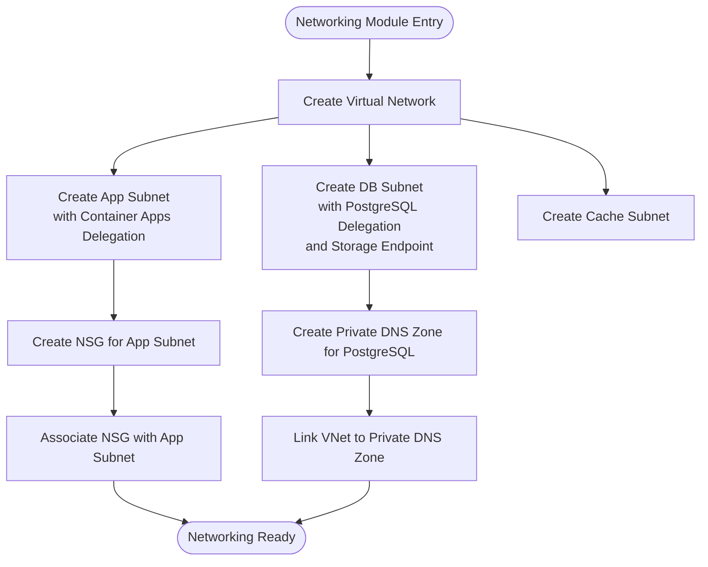

**Diagram sources**
- [modules/networking/main.tf:3-110](file://infrastructure/terraform/modules/networking/main.tf#L3-L110)

**Section sources**
- [modules/networking/main.tf:3-110](file://infrastructure/terraform/modules/networking/main.tf#L3-L110)

### Database Module (PostgreSQL Flexible Server)
- Generates a random admin password for the server.
- Supports VNet integration and private DNS zone linkage for private connectivity.
- Enables high availability in production-like environments.
- Creates the application database and sets charset/collation.
- Adds firewall rule to allow Azure services to reach the server.
- Sets server parameters for timezone and connection logging.

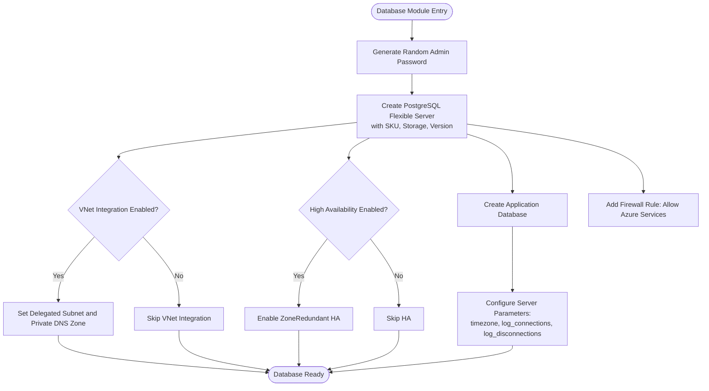

**Diagram sources**
- [modules/database/main.tf:3-77](file://infrastructure/terraform/modules/database/main.tf#L3-L77)

**Section sources**
- [modules/database/main.tf:9-77](file://infrastructure/terraform/modules/database/main.tf#L9-L77)

### Cache Module (Azure Cache for Redis)
- Creates Redis cache with TLS 1.2 minimum and memory policies.
- Configures eviction policy suitable for session/state caching.

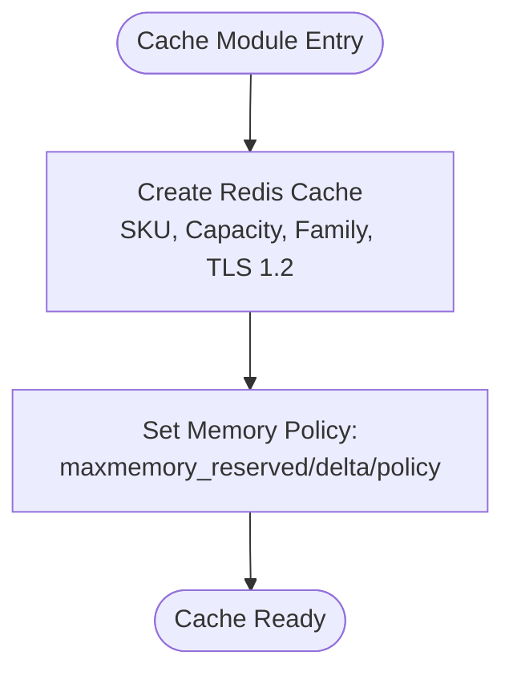

**Diagram sources**
- [modules/cache/main.tf:3-19](file://infrastructure/terraform/modules/cache/main.tf#L3-L19)

**Section sources**
- [modules/cache/main.tf:3-19](file://infrastructure/terraform/modules/cache/main.tf#L3-L19)

### Monitoring Module (Log Analytics + Application Insights)
- Creates a Log Analytics workspace with retention and SKU.
- Creates Application Insights linked to the workspace for Node.js.

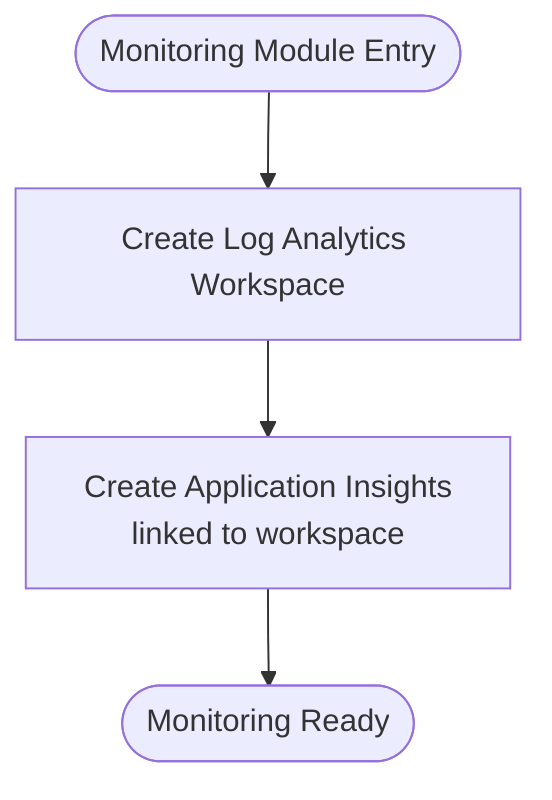

**Diagram sources**
- [modules/monitoring/main.tf:3-21](file://infrastructure/terraform/modules/monitoring/main.tf#L3-L21)

**Section sources**
- [modules/monitoring/main.tf:3-21](file://infrastructure/terraform/modules/monitoring/main.tf#L3-L21)

### Registry Module (Azure Container Registry)
- Creates ACR with admin credentials enabled for simplified development.
- Suitable for pushing images built locally or CI pipelines.

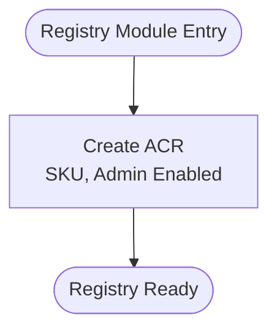

**Diagram sources**
- [modules/registry/main.tf:3-11](file://infrastructure/terraform/modules/registry/main.tf#L3-L11)

**Section sources**
- [modules/registry/main.tf:3-11](file://infrastructure/terraform/modules/registry/main.tf#L3-L11)

### Container Apps Module
- Container App Environment provisioned with infrastructure subnet and Log Analytics.
- API Container App:
  - Deploys the questionnaire API image from ACR.
  - Uses managed identity and injects secrets from Key Vault.
  - Configures probes, CORS, frontend URL, and Application Insights connection string.
- Web Container App (optional):
  - Deploys the React frontend with environment-specific API URL.
  - Exposes HTTP/HTTPS probes and ingress.

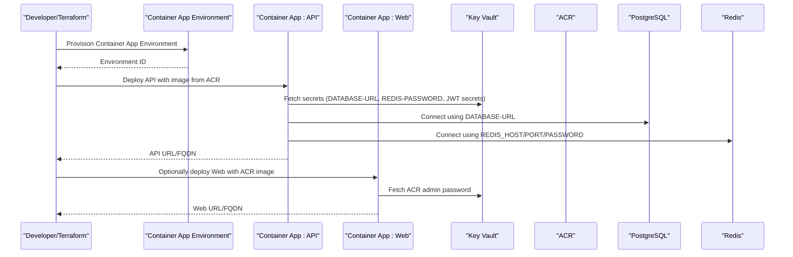

**Diagram sources**
- [modules/container-apps/main.tf:4-308](file://infrastructure/terraform/modules/container-apps/main.tf#L4-L308)
- [modules/keyvault/main.tf:53-126](file://infrastructure/terraform/modules/keyvault/main.tf#L53-L126)
- [modules/registry/main.tf:3-11](file://infrastructure/terraform/modules/registry/main.tf#L3-L11)

**Section sources**
- [modules/container-apps/main.tf:4-308](file://infrastructure/terraform/modules/container-apps/main.tf#L4-L308)

### Key Vault Module
- Creates a Key Vault with soft-delete retention and standard SKU.
- Grants permissions to the current deployer identity for secret management.
- Optionally grants read-only access to the Container App managed identity.
- Stores secrets for database URL, Redis password, JWT secrets, CSRF secret, and optionally CORS origin and Stripe webhook secret.

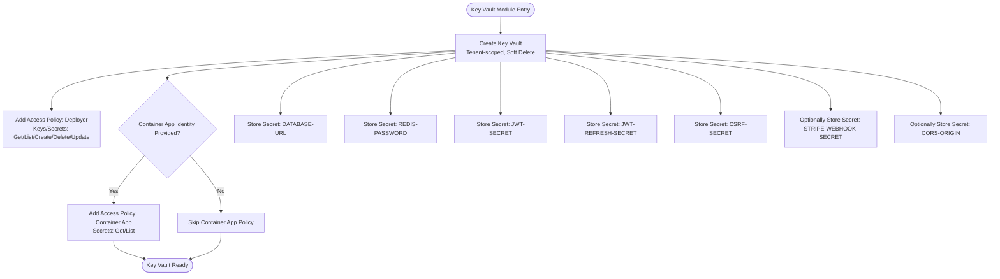

**Diagram sources**
- [modules/keyvault/main.tf:11-126](file://infrastructure/terraform/modules/keyvault/main.tf#L11-L126)

**Section sources**
- [modules/keyvault/main.tf:11-126](file://infrastructure/terraform/modules/keyvault/main.tf#L11-L126)

### Chaos Studio Module (Optional)
- Provides optional chaos engineering capabilities including managed identity, targets, capabilities, experiments, role assignments, and alerting.
- Supports CPU/memory pressure, network isolation, and combined “Game Day” experiments.
- Emits administrative activity log alerts for experiment start/stop events.

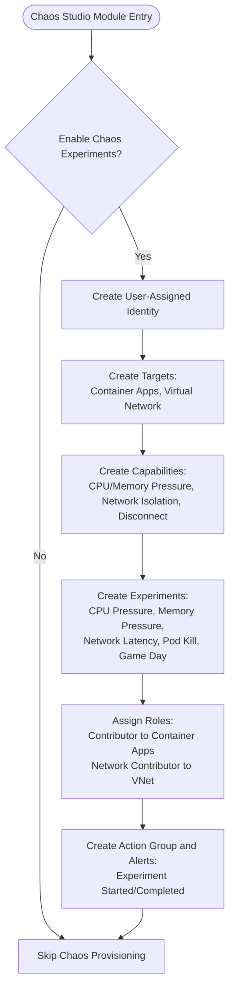

**Diagram sources**
- [modules/chaos-studio/main.tf:99-534](file://infrastructure/terraform/modules/chaos-studio/main.tf#L99-L534)

**Section sources**
- [modules/chaos-studio/main.tf:1-534](file://infrastructure/terraform/modules/chaos-studio/main.tf#L1-L534)

## Dependency Analysis
- Root module composes modules with explicit dependencies to ensure proper ordering:
  - Networking precedes database, cache, keyvault, container apps.
  - Monitoring precedes container apps for log analytics workspace.
  - Registry precedes container apps for ACR credentials.
  - Database and cache precede keyvault for secret values.
  - Key vault precedes container apps for secret injection.
- Variables drive environment-specific behavior (location, SKUs, sizes, HA/VNet flags).
- Outputs expose connection info for local development and integration.

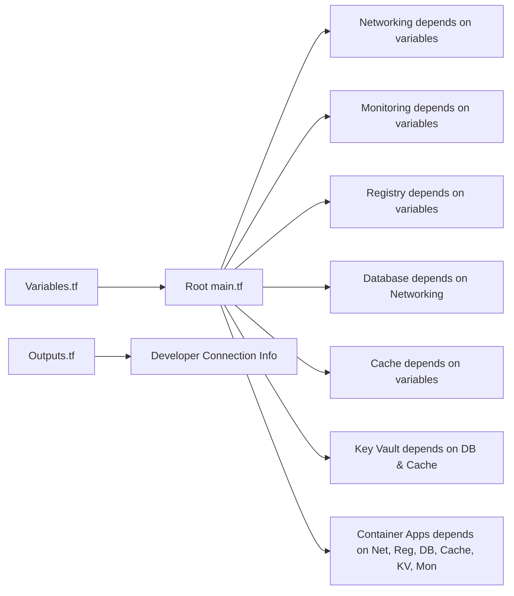

**Diagram sources**
- [variables.tf:1-178](file://infrastructure/terraform/variables.tf#L1-L178)
- [main.tf:13-152](file://infrastructure/terraform/main.tf#L13-L152)
- [outputs.tf:107-136](file://infrastructure/terraform/outputs.tf#L107-L136)

**Section sources**
- [main.tf:13-152](file://infrastructure/terraform/main.tf#L13-L152)
- [variables.tf:1-178](file://infrastructure/terraform/variables.tf#L1-L178)
- [outputs.tf:1-138](file://infrastructure/terraform/outputs.tf#L1-L138)

## Performance Considerations
- Container scaling: Configure min/max replicas and CPU/memory per workload to balance responsiveness and cost.
- Database and cache sizing: Adjust PostgreSQL storage and SKU and Redis capacity according to expected load.
- VNet integration: Enabling VNet integration for PostgreSQL improves security and reduces exposure.
- High availability: Enable zone-redundant HA for PostgreSQL in production-like environments.
- Observability: Application Insights and Log Analytics provide metrics and logs to detect performance regressions.

[No sources needed since this section provides general guidance]

## Troubleshooting Guide
- Drift detection:
  - Use terraform plan to review differences before applying.
  - Review lifecycle ignore_changes blocks to understand what is intentionally excluded from drift correction.
- State management:
  - Backend is configured to use Azure Storage; ensure credentials and permissions are valid.
  - Locks and concurrency are handled by the backend; avoid manual deletions of tfstate.
- Connectivity:
  - Verify VNet subnets and delegations match expectations.
  - Confirm NSG rules allow required ports for app subnet.
  - Ensure private DNS zone link exists for PostgreSQL FQDN resolution.
- Secrets:
  - Confirm Key Vault access policies grant the Container App managed identity Get/List permissions.
  - Validate that secrets exist and are referenced by the correct names in container apps.
- Health checks:
  - Inspect container app probes and ensure endpoints align with application routes (/api/v1/health/live and /api/v1/health/ready).

**Section sources**
- [main.tf:35-152](file://infrastructure/terraform/main.tf#L35-L152)
- [modules/container-apps/main.tf:124-156](file://infrastructure/terraform/modules/container-apps/main.tf#L124-L156)
- [modules/keyvault/main.tf:39-50](file://infrastructure/terraform/modules/keyvault/main.tf#L39-L50)
- [backend.tf:1-9](file://infrastructure/terraform/backend.tf#L1-L9)

## Conclusion
The Terraform configuration establishes a modular, secure, and observable foundation for Quiz-to-Build on Azure. It supports development, staging, and production provisioning through environment variables and module composition. With VNet integration, Key Vault secrets management, and Application Insights monitoring, the platform is ready for production-grade deployments while remaining flexible for experimentation and cost-conscious operations.

[No sources needed since this section summarizes without analyzing specific files]

## Appendices

### Environment Provisioning Strategy
- Development:
  - Use lower-cost SKUs and smaller Redis capacity.
  - Keep VNet integration disabled for simplicity; rely on firewall rules.
  - Enable chaos experiments only for targeted testing.
- Staging:
  - Enable VNet integration for database and consider enabling HA.
  - Use moderate container replicas and appropriate ACR SKU.
- Production:
  - Enable VNet integration and zone-redundant HA for PostgreSQL.
  - Use managed identity for ACR access instead of admin credentials.
  - Harden NSGs and enforce least-privilege access policies.
  - Enable chaos experiments sparingly and with strict alerting.

[No sources needed since this section provides general guidance]

### Resource Management Patterns and State Management
- Centralized variables control environment, location, SKUs, and feature flags.
- Outputs expose connection info and URLs for seamless developer onboarding.
- Lifecycle blocks ignore changes for specific attributes to prevent unwanted drift.
- Backend state stored in Azure Storage with a dedicated resource group and storage account.

**Section sources**
- [variables.tf:1-178](file://infrastructure/terraform/variables.tf#L1-L178)
- [outputs.tf:107-136](file://infrastructure/terraform/outputs.tf#L107-L136)
- [backend.tf:1-9](file://infrastructure/terraform/backend.tf#L1-L9)

### Azure Resource Creation Details
- Container Apps:
  - Environment provisioning with infrastructure subnet and Log Analytics.
  - API app with secrets from Key Vault and probes aligned with application endpoints.
  - Optional Web app with environment-specific API URL.
- PostgreSQL:
  - Flexible Server with configurable SKU, storage, and HA.
  - Private DNS zone linkage for VNet-only connectivity.
- Redis:
  - TLS 1.2 enforced with memory policies optimized for caching.
- Key Vault:
  - Secrets for database URL, Redis password, JWT secrets, CSRF secret, and optional CORS/stripe secrets.
- Monitoring:
  - Log Analytics workspace and Application Insights for telemetry.

**Section sources**
- [modules/container-apps/main.tf:4-308](file://infrastructure/terraform/modules/container-apps/main.tf#L4-L308)
- [modules/database/main.tf:9-77](file://infrastructure/terraform/modules/database/main.tf#L9-L77)
- [modules/cache/main.tf:3-19](file://infrastructure/terraform/modules/cache/main.tf#L3-L19)
- [modules/keyvault/main.tf:53-126](file://infrastructure/terraform/modules/keyvault/main.tf#L53-L126)
- [modules/monitoring/main.tf:3-21](file://infrastructure/terraform/modules/monitoring/main.tf#L3-L21)

### Networking, Security Groups, and DNS Management
- Virtual network with subnets for app, database, and cache.
- NSG allowing HTTP/HTTPS ingress to the app subnet.
- Private DNS zone for PostgreSQL FQDN resolution within the VNet.

**Section sources**
- [modules/networking/main.tf:3-110](file://infrastructure/terraform/modules/networking/main.tf#L3-L110)

### Examples of Infrastructure Modifications
- Change environment:
  - Update environment variable to switch between dev/staging/prod naming and tags.
- Scale workloads:
  - Adjust container min/max replicas and CPU/memory allocations.
- Enable VNet integration:
  - Set enable_database_vnet to true and pass subnet and private DNS zone IDs.
- Enable HA:
  - Set enable_database_ha to true for zone-redundant PostgreSQL.
- Modify Redis:
  - Increase capacity or change SKU for higher throughput.

**Section sources**
- [variables.tf:79-108](file://infrastructure/terraform/variables.tf#L79-L108)
- [modules/database/main.tf:15-31](file://infrastructure/terraform/modules/database/main.tf#L15-L31)
- [modules/container-apps/main.tf:32-39](file://infrastructure/terraform/modules/container-apps/main.tf#L32-L39)

### Deployment Automation and Validation
- Provider configuration pins versions and enables key vault soft-delete purge on destroy.
- Backend state ensures centralized, collaborative state management.
- Outputs provide connection info for automated validation and local development.

**Section sources**
- [providers.tf:1-30](file://infrastructure/terraform/providers.tf#L1-L30)
- [backend.tf:1-9](file://infrastructure/terraform/backend.tf#L1-L9)
- [outputs.tf:107-136](file://infrastructure/terraform/outputs.tf#L107-L136)

### Disaster Recovery Procedures
- Enable soft delete and purge protection for Key Vault.
- Enable backups and retention on PostgreSQL.
- Use VNet integration to limit exposure and improve recovery predictability.
- Monitor administrative actions via activity log alerts for chaos experiments.

**Section sources**
- [modules/keyvault/main.tf:17-18](file://infrastructure/terraform/modules/keyvault/main.tf#L17-L18)
- [modules/database/main.tf:23-23](file://infrastructure/terraform/modules/database/main.tf#L23-L23)
- [modules/chaos-studio/main.tf:433-471](file://infrastructure/terraform/modules/chaos-studio/main.tf#L433-L471)

### Cost Optimization, Resource Tagging, and Compliance
- Cost optimization:
  - Use appropriate SKUs and capacity tiers; right-size containers and caches.
  - Disable admin credentials for ACR in production; prefer managed identities.
  - Use lifecycle ignore_changes judiciously to avoid unnecessary updates.
- Resource tagging:
  - Centralized tags applied via variables and merged with environment-specific values.
- Compliance:
  - Enforce TLS 1.2 for Redis.
  - Limit inbound access via NSGs and VNet integration.
  - Use managed identities and Key Vault for secrets management.

**Section sources**
- [variables.tf:19-27](file://infrastructure/terraform/variables.tf#L19-L27)
- [modules/cache/main.tf:10-10](file://infrastructure/terraform/modules/cache/main.tf#L10-L10)
- [modules/registry/main.tf:8-8](file://infrastructure/terraform/modules/registry/main.tf#L8-L8)
- [modules/networking/main.tf:56-87](file://infrastructure/terraform/modules/networking/main.tf#L56-L87)