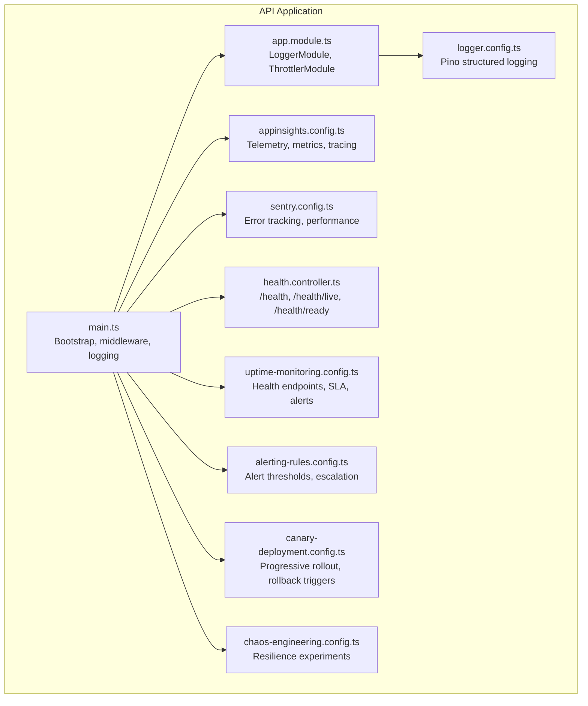
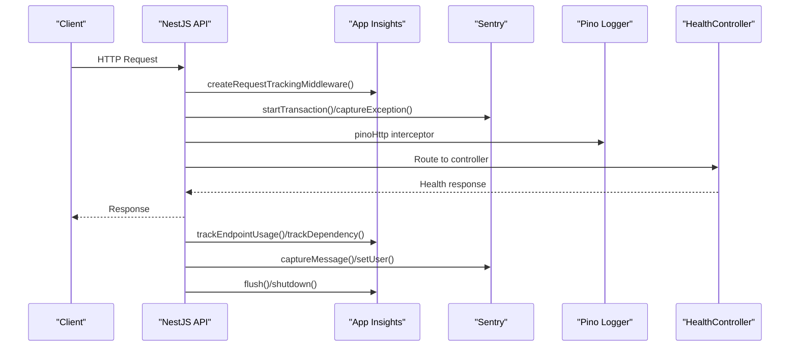
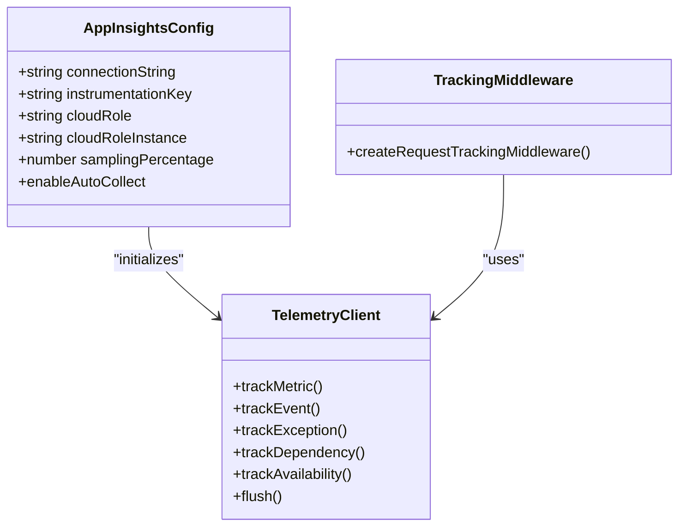
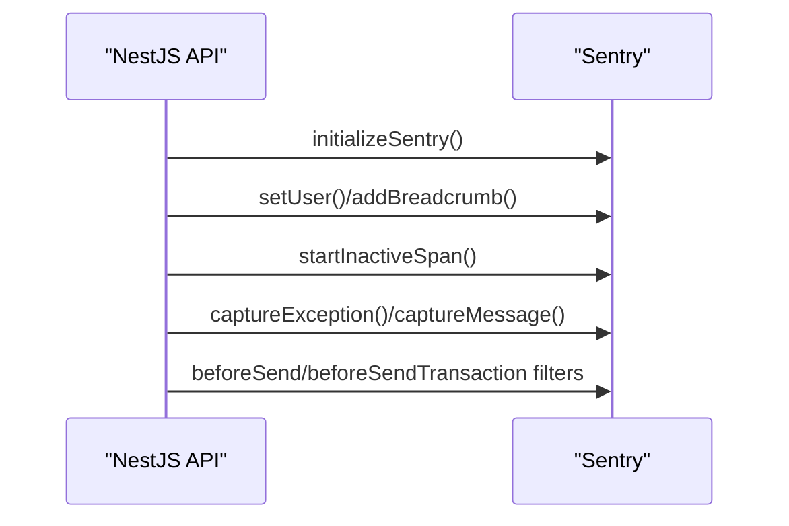
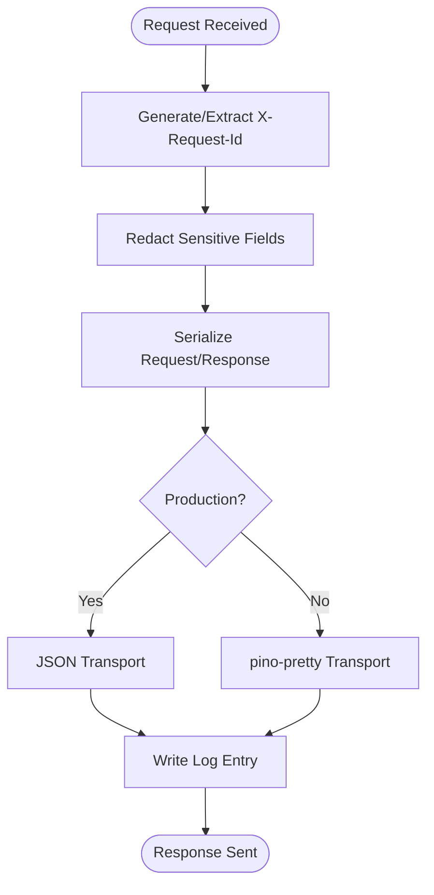
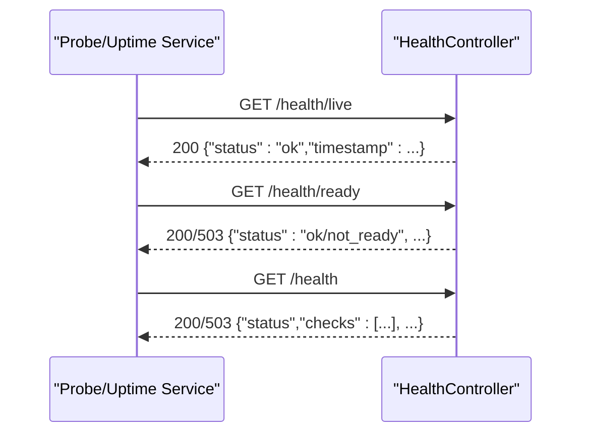
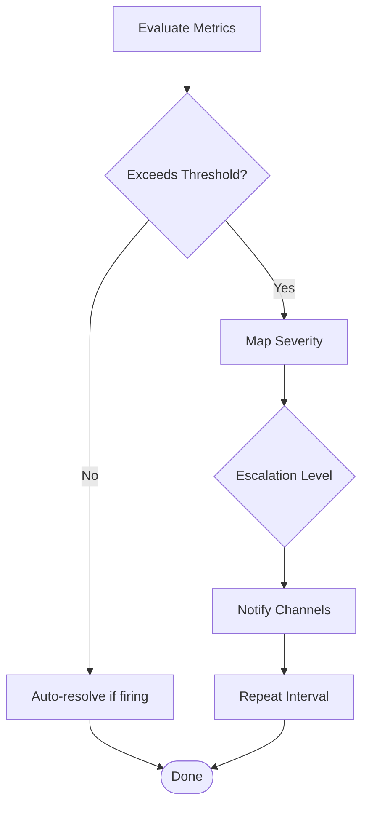
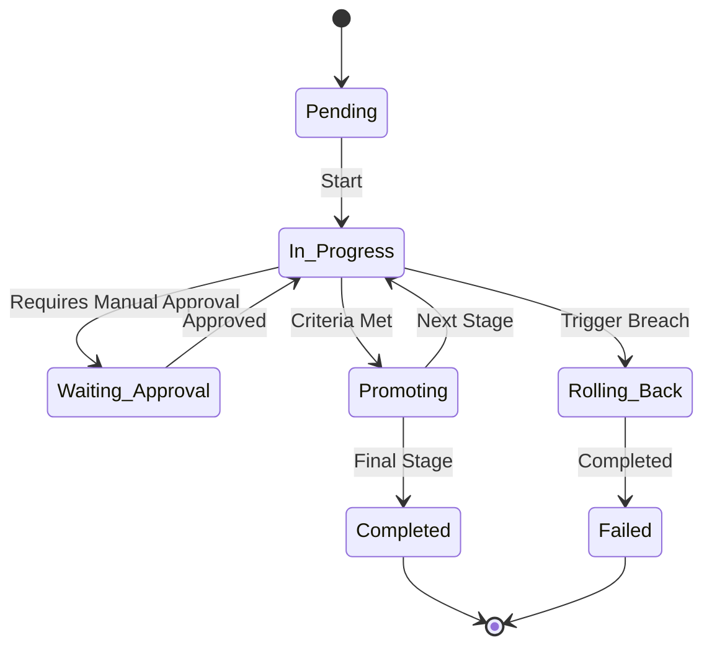
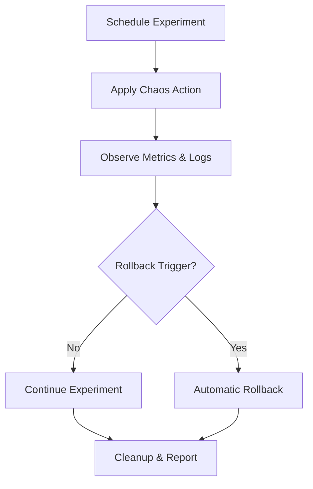
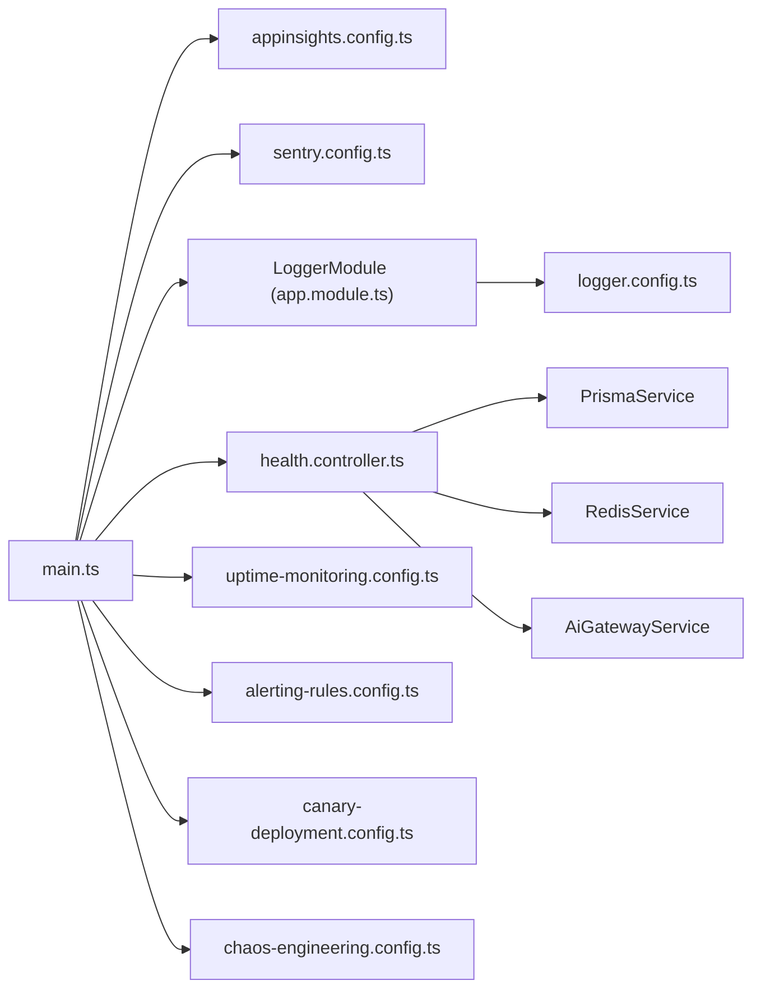

# Monitoring & Observability

<cite>
**Referenced Files in This Document**
- [main.ts](file://apps/api/src/main.ts)
- [app.module.ts](file://apps/api/src/app.module.ts)
- [health.controller.ts](file://apps/api/src/health.controller.ts)
- [appinsights.config.ts](file://apps/api/src/config/appinsights.config.ts)
- [sentry.config.ts](file://apps/api/src/config/sentry.config.ts)
- [logger.config.ts](file://apps/api/src/config/logger.config.ts)
- [uptime-monitoring.config.ts](file://apps/api/src/config/uptime-monitoring.config.ts)
- [alerting-rules.config.ts](file://apps/api/src/config/alerting-rules.config.ts)
- [canary-deployment.config.ts](file://apps/api/src/config/canary-deployment.config.ts)
- [chaos-engineering.config.ts](file://apps/api/src/config/chaos-engineering.config.ts)
- [configuration.ts](file://apps/api/src/config/configuration.ts)
</cite>

## Table of Contents
1. [Introduction](#introduction)
2. [Project Structure](#project-structure)
3. [Core Components](#core-components)
4. [Architecture Overview](#architecture-overview)
5. [Detailed Component Analysis](#detailed-component-analysis)
6. [Dependency Analysis](#dependency-analysis)
7. [Performance Considerations](#performance-considerations)
8. [Troubleshooting Guide](#troubleshooting-guide)
9. [Conclusion](#conclusion)
10. [Appendices](#appendices)

## Introduction
This document describes the monitoring and observability implementation for Quiz-to-Build. It covers Application Insights integration for performance monitoring, custom metrics, and distributed tracing; Sentry error tracking and user impact analysis; structured logging with Pino; health check endpoints and uptime monitoring; alerting and escalation; custom monitoring services; and practical debugging and troubleshooting workflows. It also outlines dashboards, monitoring queries, performance baselines, and capacity planning indicators.

## Project Structure
The monitoring stack is implemented primarily in the API application:
- Application bootstrapping initializes Application Insights and Sentry early, then configures Pino logging and middleware.
- Health endpoints expose readiness, liveness, and full health checks.
- Configuration modules define alerting rules, uptime monitoring, canary deployments, and chaos engineering.

**Diagram sources**
- [main.ts:28-329](file://apps/api/src/main.ts#L28-L329)
- [app.module.ts:53-129](file://apps/api/src/app.module.ts#L53-L129)
- [health.controller.ts:52-410](file://apps/api/src/health.controller.ts#L52-L410)
- [appinsights.config.ts:35-610](file://apps/api/src/config/appinsights.config.ts#L35-L610)
- [sentry.config.ts:35-228](file://apps/api/src/config/sentry.config.ts#L35-L228)
- [logger.config.ts:9-62](file://apps/api/src/config/logger.config.ts#L9-L62)
- [uptime-monitoring.config.ts:36-94](file://apps/api/src/config/uptime-monitoring.config.ts#L36-L94)
- [alerting-rules.config.ts:61-478](file://apps/api/src/config/alerting-rules.config.ts#L61-L478)
- [canary-deployment.config.ts:144-472](file://apps/api/src/config/canary-deployment.config.ts#L144-L472)
- [chaos-engineering.config.ts:286-642](file://apps/api/src/config/chaos-engineering.config.ts#L286-L642)

**Section sources**
- [main.ts:28-329](file://apps/api/src/main.ts#L28-L329)
- [app.module.ts:53-129](file://apps/api/src/app.module.ts#L53-L129)

## Core Components
- Application Insights: Telemetry initialization, custom metrics/events, dependency tracking, availability, and request tracking middleware.
- Sentry: Error capture, performance monitoring, user context, and alerting rules.
- Pino: Structured JSON logging with correlation IDs, redaction, and pretty printing in development.
- Health Controller: Kubernetes-friendly health endpoints with detailed dependency checks.
- Uptime Monitoring: SLA targets, health endpoints, alert channels, escalation, and status messages.
- Alerting Rules: Thresholds, notification channels, escalation policies, and runbooks.
- Canary Deployment: Progressive rollout with health checks, rollback triggers, and notifications.
- Chaos Engineering: Resilience experiments for networks, CPU/memory, storage, DNS, and HTTP.

**Section sources**
- [appinsights.config.ts:35-610](file://apps/api/src/config/appinsights.config.ts#L35-L610)
- [sentry.config.ts:35-228](file://apps/api/src/config/sentry.config.ts#L35-L228)
- [logger.config.ts:9-62](file://apps/api/src/config/logger.config.ts#L9-L62)
- [health.controller.ts:52-410](file://apps/api/src/health.controller.ts#L52-L410)
- [uptime-monitoring.config.ts:12-379](file://apps/api/src/config/uptime-monitoring.config.ts#L12-L379)
- [alerting-rules.config.ts:61-478](file://apps/api/src/config/alerting-rules.config.ts#L61-L478)
- [canary-deployment.config.ts:144-472](file://apps/api/src/config/canary-deployment.config.ts#L144-L472)
- [chaos-engineering.config.ts:286-642](file://apps/api/src/config/chaos-engineering.config.ts#L286-L642)

## Architecture Overview
The monitoring architecture integrates telemetry, error tracking, structured logging, health checks, and alerting. Application Insights captures performance and custom telemetry; Sentry captures errors and performance spans; Pino provides structured logs; health endpoints support Kubernetes probes and external uptime monitoring; alerting rules and canary configs govern escalations and risk control.

**Diagram sources**
- [main.ts:170-172](file://apps/api/src/main.ts#L170-L172)
- [appinsights.config.ts:576-610](file://apps/api/src/config/appinsights.config.ts#L576-L610)
- [sentry.config.ts:184-189](file://apps/api/src/config/sentry.config.ts#L184-L189)
- [logger.config.ts:9-62](file://apps/api/src/config/logger.config.ts#L9-L62)
- [health.controller.ts:68-205](file://apps/api/src/health.controller.ts#L68-L205)

## Detailed Component Analysis

### Application Insights Integration
Application Insights is initialized early in the bootstrap process and provides:
- Telemetry client access and lifecycle management (flush/shutdown).
- Custom metrics for response times, questionnaire metrics, readiness scores.
- Custom events for authentication, document generation, and endpoint usage.
- Exception tracking with severity tagging and handled/critical variants.
- Dependency tracking for database and external API calls.
- Availability tracking for health checks.
- Request tracking middleware to correlate HTTP requests with telemetry.

**Diagram sources**
- [appinsights.config.ts:16-52](file://apps/api/src/config/appinsights.config.ts#L16-L52)
- [appinsights.config.ts:122-124](file://apps/api/src/config/appinsights.config.ts#L122-L124)
- [appinsights.config.ts:576-610](file://apps/api/src/config/appinsights.config.ts#L576-L610)

**Section sources**
- [appinsights.config.ts:35-610](file://apps/api/src/config/appinsights.config.ts#L35-L610)
- [main.ts:170-172](file://apps/api/src/main.ts#L170-L172)

### Sentry Error Tracking and Performance
Sentry is initialized early and provides:
- Error capture with context and severity.
- Performance monitoring with transaction spans and optional profiling.
- User context management and breadcrumbs for debugging.
- Alerting rules with thresholds and channels.
- Filtering of sensitive data and health check transactions.

**Diagram sources**
- [sentry.config.ts:51-127](file://apps/api/src/config/sentry.config.ts#L51-L127)
- [sentry.config.ts:132-189](file://apps/api/src/config/sentry.config.ts#L132-L189)

**Section sources**
- [sentry.config.ts:35-228](file://apps/api/src/config/sentry.config.ts#L35-L228)
- [main.ts:23-26](file://apps/api/src/main.ts#L23-L26)

### Structured Logging with Pino
Pino is configured as the NestJS logger:
- JSON output in production; pretty-print in development.
- Correlation IDs via X-Request-Id header.
- Redaction of sensitive headers and cookies.
- Serializers for request/response shapes.
- Environment-driven log level.

**Diagram sources**
- [logger.config.ts:9-62](file://apps/api/src/config/logger.config.ts#L9-L62)

**Section sources**
- [logger.config.ts:9-62](file://apps/api/src/config/logger.config.ts#L9-L62)
- [app.module.ts:63-66](file://apps/api/src/app.module.ts#L63-L66)

### Health Check Endpoints and Uptime Monitoring
The HealthController exposes:
- Liveness (/health/live): simple process check.
- Readiness (/health/ready): database and optional Redis checks.
- Full health (/health): comprehensive dependency status, memory, and uptime.

Uptime monitoring configuration defines:
- SLA targets and response time goals.
- Health endpoints with intervals and expected responses.
- Alert channels (email, Slack, Teams, PagerDuty).
- Escalation levels and severity mapping.
- Status messages and metrics to track.

**Diagram sources**
- [health.controller.ts:68-205](file://apps/api/src/health.controller.ts#L68-L205)
- [uptime-monitoring.config.ts:36-94](file://apps/api/src/config/uptime-monitoring.config.ts#L36-L94)

**Section sources**
- [health.controller.ts:52-410](file://apps/api/src/health.controller.ts#L52-L410)
- [uptime-monitoring.config.ts:12-379](file://apps/api/src/config/uptime-monitoring.config.ts#L12-L379)

### Alerting Rules and Escalation
Alerting rules define:
- Error rate, HTTP 5xx, spikes, unhandled exceptions.
- Performance thresholds (p95/p99 latency, throughput).
- Security anomalies (auth failures, unauthorized attempts, suspicious IPs).
- Business KPIs (completion rates, payment failures, document generation).
- Resource thresholds (CPU, memory, disk, DB pool).

Escalation policies:
- Default and critical escalations with channels and delays.
- Quiet hours filtering for lower severities.

**Diagram sources**
- [alerting-rules.config.ts:61-478](file://apps/api/src/config/alerting-rules.config.ts#L61-L478)
- [alerting-rules.config.ts:597-647](file://apps/api/src/config/alerting-rules.config.ts#L597-L647)

**Section sources**
- [alerting-rules.config.ts:61-478](file://apps/api/src/config/alerting-rules.config.ts#L61-L478)
- [uptime-monitoring.config.ts:155-210](file://apps/api/src/config/uptime-monitoring.config.ts#L155-L210)

### Canary Deployment and Rollback Triggers
Canary deployment follows a linear rollout:
- Stages: 5% → 25% → 50% → 100%.
- Health checks: readiness, live, and full health endpoints.
- Rollback triggers: error rate, latency, pod restarts, CPU/memory usage.
- Notifications for stage promotions, rollbacks, and manual approvals.

**Diagram sources**
- [canary-deployment.config.ts:521-796](file://apps/api/src/config/canary-deployment.config.ts#L521-L796)

**Section sources**
- [canary-deployment.config.ts:144-472](file://apps/api/src/config/canary-deployment.config.ts#L144-L472)
- [canary-deployment.config.ts:521-796](file://apps/api/src/config/canary-deployment.config.ts#L521-L796)

### Chaos Engineering
Chaos experiments validate resilience:
- Network latency/partition, CPU/memory/disk pressure, pod kill, DNS/HTTP chaos.
- Azure Chaos Studio and Chaos Mesh configurations.
- Rollback triggers and monitoring with alerts and dashboards.

**Diagram sources**
- [chaos-engineering.config.ts:286-642](file://apps/api/src/config/chaos-engineering.config.ts#L286-L642)

**Section sources**
- [chaos-engineering.config.ts:286-642](file://apps/api/src/config/chaos-engineering.config.ts#L286-L642)

## Dependency Analysis
- Boot order: Application Insights → Sentry → Logger → Middleware → Controllers.
- HealthController depends on PrismaService, RedisService, and AiGatewayService for checks.
- Alerting and uptime configs are environment-driven and support multiple channels.

**Diagram sources**
- [main.ts:28-329](file://apps/api/src/main.ts#L28-L329)
- [app.module.ts:53-129](file://apps/api/src/app.module.ts#L53-L129)
- [health.controller.ts:56-62](file://apps/api/src/health.controller.ts#L56-L62)

**Section sources**
- [main.ts:28-329](file://apps/api/src/main.ts#L28-L329)
- [app.module.ts:53-129](file://apps/api/src/app.module.ts#L53-L129)
- [health.controller.ts:56-62](file://apps/api/src/health.controller.ts#L56-L62)

## Performance Considerations
- Sampling and cost control: Application Insights sampling percentage is tuned for production.
- Compression exclusion: Streaming endpoints skip compression to preserve real-time performance.
- Health thresholds: Memory and DB response thresholds degrade service status before failing.
- Canary latency thresholds: Strict thresholds at full rollout to maintain SLAs.

[No sources needed since this section provides general guidance]

## Troubleshooting Guide
Common scenarios and resolutions:
- Application fails to start: Bootstrap errors are captured by Sentry and logged; check environment variables and secrets validation.
- Health check failures: Inspect database connectivity, Redis availability, AI gateway health, and memory usage.
- High error rates or latency: Review alerting rules, Application Insights metrics, and Sentry performance traces.
- Telemetry not appearing: Verify Application Insights connection string/instrumentation key and flush/shutdown hooks.

**Section sources**
- [main.ts:319-329](file://apps/api/src/main.ts#L319-L329)
- [health.controller.ts:240-408](file://apps/api/src/health.controller.ts#L240-L408)
- [alerting-rules.config.ts:656-741](file://apps/api/src/config/alerting-rules.config.ts#L656-L741)
- [appinsights.config.ts:538-554](file://apps/api/src/config/appinsights.config.ts#L538-L554)

## Conclusion
Quiz-to-Build employs a robust, layered observability stack combining Application Insights for performance and custom telemetry, Sentry for error tracking and performance monitoring, Pino for structured logging, comprehensive health endpoints for uptime monitoring, and configurable alerting and canary deployment for safe releases. These components work together to ensure visibility, reliability, and rapid incident response.

[No sources needed since this section summarizes without analyzing specific files]

## Appendices

### Monitoring Queries and Dashboards
- Application Insights:
  - Requests per second: count() by bin(timestamp, 1m)
  - p95 response time: percentile(duration, 95) by bin(timestamp, 1m)
  - Error rate: countif(success == false)/count() by bin(timestamp, 1m)
  - Database query time: average(duration) where dependencyTypeName == 'PostgreSQL'
  - Document generation time: average(durationMs) where name == 'document_generated'
- Sentry:
  - Transactions by route and status
  - Top error groups and trends
  - Performance by route (p95/p99)
- UptimeRobot/Prometheus/Grafana:
  - SLA percentage by month
  - Response time percentiles
  - Error rate and 5xx rate
  - Health endpoint success rates

[No sources needed since this section provides general guidance]

### Performance Baselines and Capacity Planning
- Baselines:
  - API response time p95: < 500 ms; p99: < 2000 ms
  - Database query time p95: < 1000 ms
  - Health endpoint response: < 500 ms
- Capacity indicators:
  - CPU usage < 80% (warn), < 95% (critical)
  - Memory usage < 80% (warn), < 95% (critical)
  - DB connection pool usage < 90%
  - Redis memory usage < 80%

[No sources needed since this section provides general guidance]